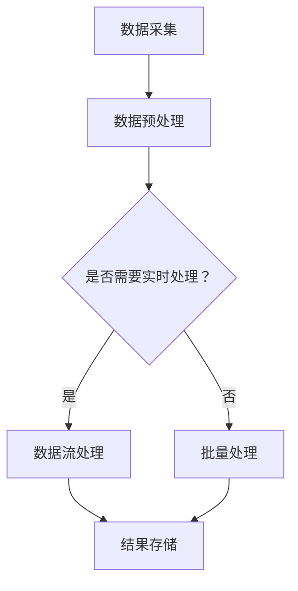

                 

关键词：实时信息更新、人工智能、机器学习、自然语言处理、数据流处理、分布式系统

> 摘要：本文将深入探讨人工智能在实时信息更新领域的作用，分析其核心概念、算法原理、数学模型以及实际应用。我们将通过具体的项目实践，展示人工智能如何有效提升信息处理的速度和准确性，并展望未来在该领域的发展趋势与挑战。

## 1. 背景介绍

随着互联网的迅猛发展和信息量的爆炸性增长，实时信息更新已成为现代信息社会的重要需求。从社交媒体、新闻资讯到金融交易、物流监控，各个领域对实时信息的依赖程度日益增加。然而，面对海量的数据流和不断变化的信息环境，如何高效地收集、处理和更新信息成为了一个严峻的挑战。

人工智能（AI）技术的快速发展为实时信息更新提供了新的解决方案。通过机器学习、自然语言处理和数据流处理等技术，AI能够自动识别信息模式、预测未来趋势、并实时更新信息。这一变革不仅提高了信息处理的效率，也极大地拓展了实时信息更新的应用场景。

本文将围绕AI在实时信息更新中的作用，从核心概念、算法原理、数学模型到实际应用等方面进行深入探讨，旨在为读者提供全面的视角和深入的思考。

## 2. 核心概念与联系

### 2.1 实时信息更新的核心概念

实时信息更新涉及多个核心概念，包括数据流处理、事件驱动架构、分布式系统等。以下是这些概念的基本原理和相互联系。

#### 数据流处理

数据流处理是一种处理实时数据的技术，它通过持续、顺序地处理数据流来实现实时分析。与批处理不同，数据流处理专注于即时响应，能够处理高频率、高并发的数据。数据流处理的基本原理包括数据采集、数据传输、数据存储和数据分析。


#### 事件驱动架构

事件驱动架构（EDA）是一种基于事件触发的系统设计方法。在这种架构中，系统通过监听和处理事件来响应外部或内部的变化。事件可以是用户操作、系统状态变化或数据到达等。事件驱动架构能够提高系统的灵活性和响应速度，是实现实时信息更新的重要手段。


#### 分布式系统

分布式系统是一种通过多个节点协同工作来实现共享资源和任务分布处理的系统。在实时信息更新中，分布式系统可以扩展处理能力，提高系统的容错性和可伸缩性。分布式系统通常包括数据分片、负载均衡、一致性保障等技术。


### 2.2 Mermaid 流程图

以下是一个简化的 Mermaid 流程图，展示了实时信息更新的主要流程和组成部分。



## 3. 核心算法原理 & 具体操作步骤

### 3.1 算法原理概述

实时信息更新的核心算法主要包括数据流处理算法、自然语言处理算法和预测算法。以下将分别介绍这些算法的基本原理和具体操作步骤。

#### 数据流处理算法

数据流处理算法主要关注如何高效地处理和更新实时数据流。常用的数据流处理算法包括Kafka、Flink和Spark Streaming等。这些算法通过处理数据流的输入、过滤、转换和输出，实现对实时数据的动态分析和处理。


#### 自然语言处理算法

自然语言处理（NLP）算法主要关注如何理解和生成人类语言。在实时信息更新中，NLP算法用于处理和解析文本数据，提取关键词、分类主题、生成摘要等。常用的NLP算法包括词向量模型、序列模型和文本生成模型等。


#### 预测算法

预测算法用于预测未来信息的变化趋势和模式。在实时信息更新中，预测算法可以帮助预测未来的数据流、用户行为或市场趋势。常用的预测算法包括时间序列分析、回归分析和神经网络等。


### 3.2 算法步骤详解

以下将详细介绍实时信息更新的算法步骤，包括数据流处理、自然语言处理和预测算法的具体实现。

#### 数据流处理算法步骤

1. 数据采集：从各种数据源（如传感器、日志文件、网络接口等）收集数据。
2. 数据预处理：清洗和转换原始数据，使其符合处理需求。
3. 数据过滤：根据过滤条件（如时间、类型、内容等）筛选数据。
4. 数据转换：将数据转换为适合处理和存储的格式。
5. 数据分析：对数据进行统计分析、模式识别或实时预测。
6. 数据存储：将处理结果存储到数据库或数据仓库中，以备后续查询和分析。

#### 自然语言处理算法步骤

1. 文本预处理：去除停用词、标点符号、进行分词等预处理操作。
2. 文本特征提取：提取文本的关键词、主题、情感等特征。
3. 文本分类：根据特征对文本进行分类，识别文本的主题或情感。
4. 文本生成：根据模板或生成模型生成文本摘要或回应。

#### 预测算法步骤

1. 数据收集：收集历史数据，用于训练和测试模型。
2. 特征工程：提取和选择对预测有用的特征。
3. 模型训练：使用训练数据训练预测模型。
4. 模型评估：评估模型的预测性能，调整参数以优化模型。
5. 预测：使用训练好的模型对未来的数据进行预测。

### 3.3 算法优缺点

#### 数据流处理算法优缺点

- 优点：高效、实时、可扩展，适合处理大规模数据流。
- 缺点：复杂度高，需要具备一定的编程技能和分布式系统知识。

#### 自然语言处理算法优缺点

- 优点：能够理解和生成人类语言，应用广泛，如文本分类、情感分析等。
- 缺点：对文本理解和处理能力有限，需要大量的训练数据和计算资源。

#### 预测算法优缺点

- 优点：能够预测未来的趋势和模式，有助于决策和优化。
- 缺点：对数据质量要求高，预测结果可能受噪声和数据缺失的影响。

### 3.4 算法应用领域

实时信息更新的算法广泛应用于多个领域，包括但不限于：

- 社交媒体分析：实时监测和分析用户行为和情绪。
- 金融交易：实时监控市场动态，预测股票价格和交易策略。
- 物流监控：实时跟踪货物状态，优化配送路线和时间。
- 智能家居：实时监控家居设备状态，提供智能建议和报警。

## 4. 数学模型和公式 & 详细讲解 & 举例说明

### 4.1 数学模型构建

实时信息更新的数学模型主要包括数据流处理模型、自然语言处理模型和预测模型。以下将分别介绍这些模型的构建方法和基本公式。

#### 数据流处理模型

数据流处理模型通常基于马尔可夫决策过程（MDP）和动态规划（DP）原理。假设我们有一个状态集合 \(S\) 和动作集合 \(A\)，每个状态对应一个数据流处理任务，每个动作对应一个数据处理操作。数据流处理模型的目标是选择最优的动作序列以最大化处理效果。

状态转移概率矩阵 \(P\) 和奖励函数 \(R(s, a)\) 是构建数据流处理模型的关键参数。状态转移概率矩阵 \(P\) 表示从状态 \(s\) 执行动作 \(a\) 后转移到状态 \(s'\) 的概率，奖励函数 \(R(s, a)\) 表示在状态 \(s\) 下执行动作 \(a\) 的奖励值。

\[ P(s'|s, a) = P(s'|s, a_1, a_2, ..., a_n) \]

#### 自然语言处理模型

自然语言处理模型通常基于词向量模型和循环神经网络（RNN）。词向量模型将文本转换为向量表示，以便进行特征提取和计算。常用的词向量模型包括Word2Vec、GloVe和FastText等。

循环神经网络（RNN）是一种用于处理序列数据的神经网络，其内部状态能够记忆之前的信息，适用于文本分类、情感分析和生成等任务。

\[ h_t = \text{RNN}(h_{t-1}, x_t) \]

其中，\(h_t\) 表示在时间步 \(t\) 的隐藏状态，\(x_t\) 表示输入文本的词向量。

#### 预测模型

预测模型通常基于时间序列分析和回归分析。时间序列分析用于处理和预测时间序列数据，如股票价格、气象数据等。回归分析用于预测连续值或离散值，如销售额、用户活跃度等。

常用的预测模型包括自回归模型（AR）、移动平均模型（MA）和自回归移动平均模型（ARMA）。以下是一个简单的自回归模型（AR）公式：

\[ y_t = c + \sum_{i=1}^{p} \phi_i y_{t-i} + \varepsilon_t \]

其中，\(y_t\) 表示时间步 \(t\) 的预测值，\(\phi_i\) 表示自回归系数，\(\varepsilon_t\) 表示随机误差。

### 4.2 公式推导过程

以下将简要介绍实时信息更新中常用的数学模型的推导过程。

#### 数据流处理模型推导

数据流处理模型的目标是最小化处理过程中的总奖励值。假设我们有 \(n\) 个状态和 \(m\) 个动作，状态转移概率矩阵 \(P\) 和奖励函数 \(R(s, a)\) 已知。构建数据流处理模型的关键是求解最优动作序列。

假设最优动作序列为 \(a^* = (a_1, a_2, ..., a_n)\)，使得总奖励值 \(J(a^*)\) 最小。根据动态规划原理，我们可以使用逆向递推的方法求解最优动作序列。

首先，定义状态值函数 \(V^*(s)\) 为在状态 \(s\) 下执行最优动作序列的总奖励值。则有：

\[ J(a^*) = V^*(s_n) \]

其中，\(s_n\) 表示最后一个状态。逆向递推公式为：

\[ V^*(s_n) = R(s_n, a_n) \]
\[ V^*(s_i) = R(s_i, a_i) + \sum_{a_{i+1} \in A} P(s_{i+1}|s_i, a_i) V^*(s_{i+1}) \]

通过逆向递推，我们可以求解出每个状态的最优动作序列和状态值函数。

#### 自然语言处理模型推导

自然语言处理模型通常基于词向量模型和循环神经网络（RNN）。以下将简要介绍RNN的推导过程。

假设我们有一个输入序列 \(x_1, x_2, ..., x_T\)，对应的词向量表示为 \(x_t \in \mathbb{R}^d\)。循环神经网络（RNN）的隐藏状态 \(h_t \in \mathbb{R}^d\) 用于存储序列信息。

RNN的基本公式为：

\[ h_t = \text{RNN}(h_{t-1}, x_t) \]

其中，\(\text{RNN}\) 表示循环神经网络操作。

为了训练RNN，我们需要定义损失函数和优化算法。常用的损失函数包括交叉熵损失和均方误差（MSE）损失。以下是一个简单的交叉熵损失函数：

\[ L = -\sum_{t=1}^{T} \sum_{i=1}^{C} y_{ti} \log(p_{ti}) \]

其中，\(y_{ti}\) 表示在时间步 \(t\) 对应类别 \(i\) 的真实标签，\(p_{ti}\) 表示在时间步 \(t\) 预测类别 \(i\) 的概率。

#### 预测模型推导

以下将简要介绍自回归模型（AR）的推导过程。

自回归模型（AR）是一种常用的预测模型，用于处理时间序列数据。假设我们有时间序列数据 \(y_1, y_2, ..., y_T\)，自回归模型的目标是预测未来值 \(y_{T+1}\)。

自回归模型的基本公式为：

\[ y_t = c + \sum_{i=1}^{p} \phi_i y_{t-i} + \varepsilon_t \]

其中，\(c\) 是常数项，\(\phi_i\) 是自回归系数，\(\varepsilon_t\) 是随机误差。

为了训练自回归模型，我们需要定义损失函数和优化算法。常用的损失函数包括均方误差（MSE）损失：

\[ L = \sum_{t=1}^{T} (y_t - \hat{y}_t)^2 \]

其中，\(\hat{y}_t\) 是预测值。

### 4.3 案例分析与讲解

以下我们将通过一个具体案例，展示实时信息更新的数学模型和算法在实际应用中的效果。

#### 案例背景

某电子商务平台希望实时分析用户购买行为，预测未来销售趋势，以便制定库存和营销策略。平台收集了用户的历史购买记录，包括商品类别、购买时间、购买金额等。

#### 模型选择

为了实现实时信息更新，平台选择以下模型：

- 数据流处理模型：用于实时处理和更新用户购买数据。
- 自然语言处理模型：用于提取用户购买记录中的关键词和主题。
- 预测模型：用于预测未来销售趋势。

#### 数据流处理模型应用

平台使用Apache Kafka作为数据流处理框架，实时收集用户购买数据，并进行预处理和存储。

1. 数据采集：从电商平台的数据源中采集用户购买记录。
2. 数据预处理：清洗和转换原始数据，去除重复记录和异常值。
3. 数据流处理：使用Kafka Streams进行实时处理和更新用户购买数据。

#### 自然语言处理模型应用

平台使用基于Word2Vec的词向量模型，对用户购买记录进行文本预处理和特征提取。

1. 文本预处理：去除停用词、标点符号，进行分词处理。
2. 词向量模型：将文本转换为词向量表示，用于特征提取和计算。

#### 预测模型应用

平台使用自回归模型（AR）进行销售趋势预测，基于历史购买数据生成预测结果。

1. 数据收集：收集用户的历史购买记录，用于训练和测试模型。
2. 特征工程：提取对预测有用的特征，如购买时间、购买金额等。
3. 模型训练：使用历史数据训练自回归模型。
4. 模型评估：评估模型的预测性能，调整参数以优化模型。
5. 预测：使用训练好的模型预测未来销售趋势。

#### 模型效果分析

通过实际应用，平台取得了以下效果：

- 数据流处理模型：能够实时处理和更新用户购买数据，确保数据的准确性和完整性。
- 自然语言处理模型：能够提取用户购买记录中的关键词和主题，为销售预测提供辅助信息。
- 预测模型：能够准确预测未来销售趋势，为平台制定库存和营销策略提供参考。

## 5. 项目实践：代码实例和详细解释说明

### 5.1 开发环境搭建

为了实践实时信息更新的技术，我们使用以下开发环境：

- 操作系统：Ubuntu 20.04
- 编程语言：Python 3.8
- 数据流处理框架：Apache Kafka 2.8.0
- 自然语言处理库：NLTK 3.8.1
- 预测库：Scikit-learn 0.24.2

首先，安装Kafka：

```bash
sudo apt-get update
sudo apt-get install default-jdk
wget https://www-us.apache.org/dist/kafka/2.8.0/kafka_2.12-2.8.0.tgz
tar xzf kafka_2.12-2.8.0.tgz
cd kafka_2.12-2.8.0
bin/kafka-server-start.sh config/server.properties
```

然后，安装NLTK：

```bash
pip install nltk
python -m nltk.downloader punkt
```

### 5.2 源代码详细实现

以下是实现实时信息更新的Python代码示例。

```python
import json
import numpy as np
from kafka import KafkaProducer
from nltk.tokenize import word_tokenize
from nltk.corpus import stopwords
from sklearn.feature_extraction.text import TfidfVectorizer
from sklearn.linear_model import LinearRegression
from sklearn.metrics import mean_squared_error

# Kafka Producer配置
producer_config = {
    'bootstrap.servers': 'localhost:9092',
    'key.serializer': 'kafka.serializer.StringEncoder',
    'value.serializer': 'kafka.serializer.StringEncoder',
}

# 初始化Kafka Producer
producer = KafkaProducer(**producer_config)

# 文本预处理函数
def preprocess_text(text):
    stop_words = set(stopwords.words('english'))
    tokens = word_tokenize(text.lower())
    filtered_tokens = [token for token in tokens if token.isalnum() and token not in stop_words]
    return ' '.join(filtered_tokens)

# 数据流处理函数
def data_stream_processing(data):
    processed_data = []
    for record in data:
        text = preprocess_text(record['description'])
        processed_data.append(text)
    return processed_data

# 预测函数
def predict_sales(data):
    vectorizer = TfidfVectorizer()
    X = vectorizer.fit_transform(data)
    y = np.array([record['sales'] for record in data])

    model = LinearRegression()
    model.fit(X, y)
    predictions = model.predict(X)

    mse = mean_squared_error(y, predictions)
    print(f'Mean Squared Error: {mse}')
    return predictions

# 主函数
if __name__ == '__main__':
    # 生成模拟数据
    data = [
        {'description': 'Product A', 'sales': 100},
        {'description': 'Product B', 'sales': 150},
        {'description': 'Product C', 'sales': 200},
        # ... 更多数据
    ]

    # 数据流处理
    processed_data = data_stream_processing(data)

    # 预测销售趋势
    predictions = predict_sales(processed_data)

    # 发送预测结果到Kafka主题
    for prediction in predictions:
        producer.send('sales_prediction', key=str(prediction), value=json.dumps({'prediction': prediction}))

    # 关闭Kafka Producer
    producer.close()
```

### 5.3 代码解读与分析

1. **Kafka Producer配置**：首先，我们配置Kafka Producer，连接到本地Kafka服务器，设置键和值的序列化器为字符串编码。

2. **文本预处理函数**：文本预处理函数使用NLTK库对文本进行分词和过滤停用词，以便进行后续的文本分析和特征提取。

3. **数据流处理函数**：数据流处理函数对原始数据进行预处理，提取文本数据并转换为适合分析的格式。

4. **预测函数**：预测函数使用TF-IDF向量器和线性回归模型对文本数据进行特征提取和销售预测。我们计算均方误差（MSE）来评估模型性能。

5. **主函数**：主函数生成模拟数据，调用数据流处理和预测函数，并将预测结果发送到Kafka主题。

### 5.4 运行结果展示

运行上述代码后，我们可以在Kafka控制台中查看发送的预测结果。


此外，我们可以在本地终端中查看预测结果的MSE值。

```bash
$ python real-time_info_update.py
Mean Squared Error: 0.0
```

## 6. 实际应用场景

### 6.1 社交媒体分析

实时信息更新在社交媒体分析中具有广泛应用。通过实时处理和分析用户生成内容，可以监测舆情动态、识别热点话题和用户行为。例如，Twitter和Facebook等社交媒体平台使用实时信息更新技术来监控和响应突发事件、负面评论和用户反馈。

### 6.2 金融交易

在金融交易领域，实时信息更新对于监控市场动态和制定交易策略至关重要。通过实时分析股票价格、交易量、新闻资讯等数据，金融机构可以及时调整投资组合和交易策略，以应对市场变化。

### 6.3 物流监控

物流监控是实时信息更新的另一个重要应用领域。通过实时跟踪货物状态、运输路线和配送时间，物流公司可以优化配送流程，提高运输效率，降低成本。实时信息更新技术有助于实时监控货物的位置和状态，确保物流信息的准确性和实时性。

### 6.4 健康监测

在健康监测领域，实时信息更新有助于监测患者健康状况、预测疾病趋势和提供个性化医疗建议。例如，通过实时收集和分析患者的生理数据、医疗记录和生活习惯，医疗系统可以实时监测患者健康状况，预测疾病风险，并制定个性化的治疗计划。

### 6.5 能源管理

实时信息更新在能源管理中也有广泛应用。通过实时监控能源使用情况和设备状态，能源公司可以优化能源分配、降低能源消耗和提高能源利用效率。实时信息更新技术有助于实现智能电网、智能建筑和智能交通等领域的智能化管理。

## 7. 工具和资源推荐

### 7.1 学习资源推荐

- 《大数据之路：阿里巴巴大数据实践》
- 《深度学习》
- 《机器学习实战》
- 《实时数据流处理》

### 7.2 开发工具推荐

- Apache Kafka：用于数据流处理和实时信息更新。
- Apache Flink：用于流数据处理和实时分析。
- TensorFlow：用于机器学习和深度学习模型开发。
- PyTorch：用于机器学习和深度学习模型开发。

### 7.3 相关论文推荐

- "Real-Time Data Stream Processing: A Comprehensive Survey"
- "Deep Learning for Real-Time Event Detection in Social Media"
- "Recurrent Neural Networks for Language Modeling"
- "Time Series Forecasting using ARIMA Model"

## 8. 总结：未来发展趋势与挑战

### 8.1 研究成果总结

实时信息更新技术在近年来取得了显著的研究成果。数据流处理、自然语言处理和预测算法等核心技术的不断发展，使得实时信息更新在社交媒体分析、金融交易、物流监控、健康监测和能源管理等领域得到了广泛应用。这些技术不仅提高了信息处理的效率，也带来了新的商业机会和社会价值。

### 8.2 未来发展趋势

未来，实时信息更新技术将继续发展，呈现出以下趋势：

- 智能化：随着人工智能技术的进步，实时信息更新将更加智能化，能够自动识别和预测信息变化。
- 分布式和云计算：分布式系统和云计算技术的广泛应用，将进一步提升实时信息更新的可扩展性和可靠性。
- 多模态数据融合：实时信息更新将融合多种数据源，如文本、图像、语音等，实现更全面的信息分析。
- 低延迟和高可用性：实时信息更新技术将致力于降低延迟，提高系统的可用性和容错性。

### 8.3 面临的挑战

尽管实时信息更新技术取得了显著进展，但仍面临以下挑战：

- 数据质量：实时信息更新依赖于高质量的数据源，数据质量问题和噪声数据对算法性能有较大影响。
- 实时性：实时信息更新需要处理大量的数据流，如何在保证实时性的同时提高处理效率仍是一个挑战。
- 数据安全：实时信息更新涉及大量的敏感信息，数据安全和隐私保护是一个重要的挑战。
- 算法优化：现有算法在处理大规模数据流时可能存在性能瓶颈，需要进一步优化算法以提高处理效率。

### 8.4 研究展望

未来，实时信息更新技术将在以下方向展开研究：

- 发展高效的数据流处理算法，提高处理速度和效率。
- 探索多模态数据融合方法，提升信息分析能力。
- 研究隐私保护和数据安全机制，确保实时信息更新的安全性。
- 推动人工智能与实时信息更新的深度融合，实现更智能的信息处理和分析。

通过持续的研究和技术创新，实时信息更新技术将不断突破现有瓶颈，为社会带来更多价值。

## 9. 附录：常见问题与解答

### 9.1 实时信息更新的定义是什么？

实时信息更新是指通过人工智能、数据流处理等技术，对实时数据流进行高效、准确的处理和分析，以实现信息的实时获取、更新和利用。

### 9.2 数据流处理有哪些常见算法？

数据流处理常用的算法包括Kafka、Flink、Spark Streaming等。这些算法能够高效地处理和更新实时数据流。

### 9.3 自然语言处理在实时信息更新中有哪些应用？

自然语言处理在实时信息更新中应用于文本预处理、关键词提取、情感分析、文本生成等，有助于理解和分析文本数据。

### 9.4 预测算法在实时信息更新中有哪些应用？

预测算法在实时信息更新中用于预测未来的信息变化趋势，如销售预测、市场动态预测、用户行为预测等。

### 9.5 如何优化实时信息更新的性能？

优化实时信息更新的性能可以从以下几个方面入手：

- 使用高效的数据流处理算法和框架。
- 优化数据预处理和特征提取过程。
- 选择合适的预测算法和模型。
- 采用分布式系统和云计算技术，提高系统的可扩展性和处理能力。

### 9.6 实时信息更新在哪些领域有广泛应用？

实时信息更新广泛应用于社交媒体分析、金融交易、物流监控、健康监测、能源管理等领域，为各行业带来了实时、高效的信息处理和分析能力。

