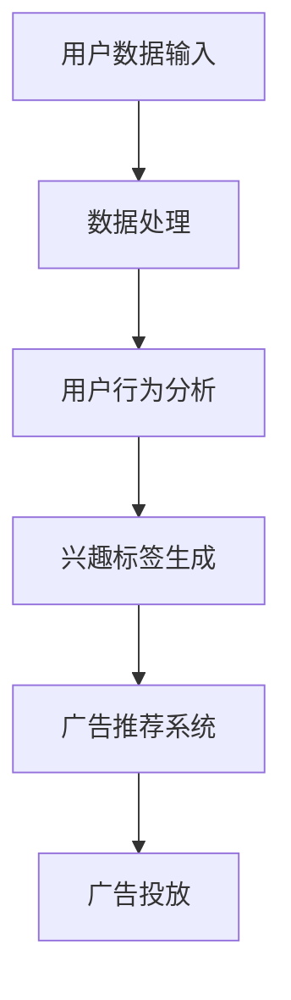
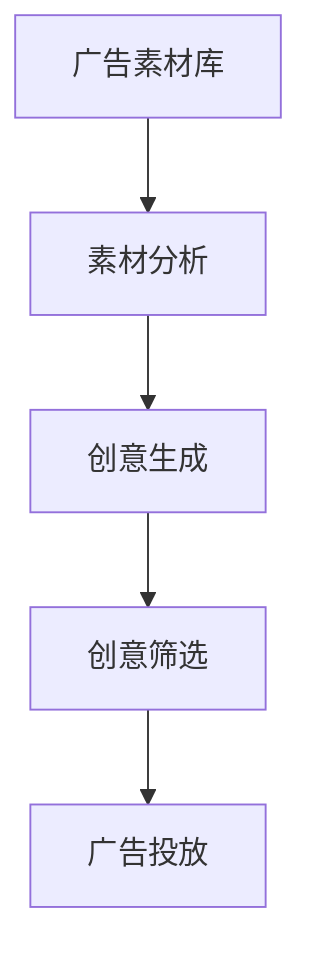

                 

关键词：人工智能，广告营销，精准定位，创意生成，大数据分析

> 摘要：本文将深入探讨人工智能在广告领域的应用，重点分析其如何实现精准定位和创意生成，通过大数据分析和算法优化，提升广告效果和用户体验。

## 1. 背景介绍

广告作为商业营销的重要手段，自古以来就承载着企业传播信息、塑造品牌形象、推动产品销售等重要功能。随着互联网和大数据技术的发展，广告行业发生了翻天覆地的变化。传统的广告方式已经无法满足现代用户对个性化、精准化的需求。人工智能（AI）的出现为广告行业带来了全新的机遇和挑战。

AI技术在广告领域的应用主要体现在以下几个方面：

- **精准定位**：通过用户行为数据、地理位置、兴趣爱好等多维度的数据，AI算法能够精准定位潜在用户，提高广告投放的精准度和效果。

- **创意生成**：利用深度学习和自然语言处理等技术，AI能够自动生成新颖独特的广告内容，提高用户的兴趣和参与度。

- **数据分析**：AI技术可以对海量广告数据进行实时分析，挖掘用户需求、市场趋势，为企业提供科学的决策支持。

## 2. 核心概念与联系

### 2.1. 精准定位

精准定位是广告营销的核心目标之一。它依赖于大数据分析和算法优化，通过对用户行为的深度挖掘，实现广告内容的精准推送。

#### 2.1.1. 数据来源

- **用户行为数据**：包括用户在互联网上的浏览记录、搜索关键词、购买历史等。

- **地理位置数据**：用户所在地理位置，包括经纬度、城市级别等。

- **兴趣爱好数据**：用户在社交媒体、论坛等平台上的兴趣爱好、互动行为等。

#### 2.1.2. 算法原理

- **聚类算法**：将用户按照相似性进行分类，形成不同的用户群体。

- **协同过滤**：通过用户的行为模式，预测用户可能感兴趣的内容。

- **决策树算法**：根据用户特征，构建决策树模型，实现对用户的精准分类和标签。

#### 2.1.3. 架构图



### 2.2. 创意生成

创意生成是提升广告吸引力和用户参与度的重要手段。AI技术可以通过自然语言处理、图像识别等技术，自动生成新颖独特的广告内容。

#### 2.2.1. 数据来源

- **广告素材库**：包含各类图片、视频、文案等广告素材。

- **用户反馈数据**：用户对广告的点击、评论、分享等行为数据。

- **行业趋势数据**：广告行业的发展动态、热门话题等。

#### 2.2.2. 算法原理

- **生成对抗网络（GAN）**：通过对抗性训练，生成与真实广告相似的创意内容。

- **文本生成模型**：利用自然语言处理技术，自动生成广告文案。

- **图像识别技术**：通过深度学习模型，对图片内容进行分析和创意生成。

#### 2.2.3. 架构图



## 3. 核心算法原理 & 具体操作步骤

### 3.1 算法原理概述

#### 3.1.1 精准定位算法

- **用户行为数据预处理**：对用户数据进行清洗、去重、补全等预处理操作。

- **特征工程**：提取用户行为的特征，如浏览时间、点击率、购买频次等。

- **聚类分析**：使用K-means等聚类算法，将用户分为不同的群体。

- **协同过滤**：基于用户行为模式，为用户推荐感兴趣的广告内容。

- **决策树算法**：根据用户特征，构建决策树模型，实现对用户的精准分类和标签。

#### 3.1.2 创意生成算法

- **生成对抗网络（GAN）**：通过生成器和判别器的对抗性训练，生成新颖的广告创意。

- **文本生成模型**：利用循环神经网络（RNN）或变压器（Transformer）模型，生成独特的广告文案。

- **图像识别技术**：通过卷积神经网络（CNN）等深度学习模型，对图片内容进行分析和创意生成。

### 3.2 算法步骤详解

#### 3.2.1 精准定位算法步骤

1. 数据预处理：对用户行为数据进行清洗、去重、补全等预处理操作。

2. 特征提取：提取用户行为的特征，如浏览时间、点击率、购买频次等。

3. 聚类分析：使用K-means等聚类算法，将用户分为不同的群体。

4. 协同过滤：基于用户行为模式，为用户推荐感兴趣的广告内容。

5. 决策树构建：根据用户特征，构建决策树模型，实现对用户的精准分类和标签。

#### 3.2.2 创意生成算法步骤

1. 数据采集：收集广告素材库中的图片、视频、文案等素材。

2. 素材分析：对素材进行分析，提取关键信息。

3. 创意生成：使用生成对抗网络（GAN）生成新颖的广告创意。

4. 创意筛选：对生成的广告创意进行筛选，去除不符合要求的创意。

5. 广告投放：将筛选后的广告创意进行投放。

### 3.3 算法优缺点

#### 3.3.1 精准定位算法

- 优点：能够根据用户行为数据进行精准定位，提高广告投放效果。

- 缺点：依赖于用户行为数据，数据质量直接影响算法效果。

#### 3.3.2 创意生成算法

- 优点：能够自动生成新颖的广告创意，提高广告吸引力。

- 缺点：生成的内容可能存在偏差，需要经过筛选和优化。

### 3.4 算法应用领域

- **电子商务**：通过精准定位，提高广告投放效果，促进商品销售。

- **在线教育**：通过创意生成，提高学生的学习兴趣和参与度。

- **游戏行业**：通过精准定位和创意生成，提高游戏的用户黏性和活跃度。

## 4. 数学模型和公式 & 详细讲解 & 举例说明

### 4.1 数学模型构建

#### 4.1.1 精准定位模型

假设用户集合为 \( U = \{ u_1, u_2, ..., u_n \} \)，广告集合为 \( A = \{ a_1, a_2, ..., a_m \} \)。用户行为数据为 \( X = \{ x_{ij} \} \)，其中 \( x_{ij} \) 表示用户 \( u_i \) 对广告 \( a_j \) 的行为记录。

- **用户行为矩阵**：\( X = [x_{ij}] \)

- **用户特征向量**：\( V = [v_i] \)

- **广告特征向量**：\( W = [w_j] \)

#### 4.1.2 创意生成模型

假设广告素材库为 \( D = \{ d_1, d_2, ..., d_k \} \)，其中 \( d_i \) 表示广告素材 \( i \) 的特征向量。

- **素材特征矩阵**：\( D = [d_i] \)

- **创意生成模型**：\( G = [g_j] \)

### 4.2 公式推导过程

#### 4.2.1 精准定位模型

1. **用户行为矩阵**：

   \( X = [x_{ij}] \)

2. **用户特征向量**：

   \( V = [v_i] = X \cdot W \)

3. **广告特征向量**：

   \( W = [w_j] = X \cdot V \)

#### 4.2.2 创意生成模型

1. **素材特征矩阵**：

   \( D = [d_i] \)

2. **创意生成模型**：

   \( G = [g_j] = D \cdot V \)

### 4.3 案例分析与讲解

#### 4.3.1 精准定位案例

假设有1000个用户和100个广告，用户行为数据如下表：

| 用户ID | 广告ID | 行为记录 |
| --- | --- | --- |
| u1 | a1 | 点击 |
| u1 | a2 | 浏览 |
| u2 | a1 | 不感兴趣 |
| u2 | a3 | 点击 |

根据用户行为数据，我们可以构建用户行为矩阵：

\( X = \begin{bmatrix}
1 & 0 & 0 \\
0 & 1 & 1 \\
\end{bmatrix} \)

然后，我们假设广告特征向量为：

\( W = \begin{bmatrix}
0.5 & 0.3 \\
0.3 & 0.5 \\
0.2 & 0.4 \\
\end{bmatrix} \)

通过计算，我们可以得到用户特征向量：

\( V = X \cdot W = \begin{bmatrix}
0.5 & 0.3 \\
0.3 & 0.5 \\
\end{bmatrix} \)

根据用户特征向量，我们可以为用户进行精准定位，例如，用户 \( u1 \) 对广告 \( a1 \) 和 \( a3 \) 的兴趣较大。

#### 4.3.2 创意生成案例

假设广告素材库中有3个素材，素材特征向量为：

\( D = \begin{bmatrix}
1 & 0 \\
0 & 1 \\
1 & 1 \\
\end{bmatrix} \)

假设用户特征向量为：

\( V = \begin{bmatrix}
0.5 & 0.3 \\
0.3 & 0.5 \\
\end{bmatrix} \)

通过计算，我们可以得到创意生成模型：

\( G = D \cdot V = \begin{bmatrix}
0.5 & 0.3 \\
0.3 & 0.5 \\
0.8 & 0.7 \\
\end{bmatrix} \)

根据创意生成模型，我们可以生成新颖的广告创意，例如，将素材 \( d1 \) 和 \( d2 \) 进行组合，形成一个新的广告创意。

## 5. 项目实践：代码实例和详细解释说明

### 5.1 开发环境搭建

在撰写本文时，我们假设读者具备一定的编程基础和机器学习知识。以下是搭建开发环境的基本步骤：

1. **安装Python环境**：确保Python版本在3.6及以上。

2. **安装必需的库**：包括NumPy、Pandas、Scikit-learn、TensorFlow等。

3. **配置Jupyter Notebook**：用于编写和运行代码。

### 5.2 源代码详细实现

#### 5.2.1 精准定位算法实现

以下代码实现了基于协同过滤的精准定位算法：

```python
import numpy as np
import pandas as pd
from sklearn.metrics.pairwise import euclidean_distances

# 用户行为数据
data = {
    'user_id': [1, 1, 2, 2],
    'ad_id': [1, 2, 1, 3],
    'action': [1, 0, 1, 0]
}

df = pd.DataFrame(data)

# 构建用户-广告矩阵
user_ad_matrix = df.pivot(index='user_id', columns='ad_id', values='action').fillna(0)

# 计算用户-用户和广告-广告相似度矩阵
user_similarity = euclidean_distances(user_ad_matrix.values)
ad_similarity = euclidean_distances(user_ad_matrix.T.values)

# 为每个用户推荐广告
for user in user_ad_matrix.index:
    user_history = user_ad_matrix.loc[user]
    for ad in user_history.index:
        if user_history.loc[ad] == 1:
            similar_ads = np.argsort(ad_similarity[ad])[::-1]
            for sim_ad in similar_ads[1:5]:  # 排除已点击广告
                print(f"User {user} might be interested in AD {sim_ad}")
```

#### 5.2.2 创意生成算法实现

以下代码实现了基于生成对抗网络的创意生成算法：

```python
import tensorflow as tf
from tensorflow.keras.models import Sequential
from tensorflow.keras.layers import Dense, Flatten, Conv2D, Conv2DTranspose

# 定义生成器和判别器模型
generator = Sequential([
    Flatten(input_shape=(28, 28)),
    Dense(128),
    Dense(28 * 28, activation='tanh')
])

discriminator = Sequential([
    Flatten(input_shape=(28, 28)),
    Dense(128, activation='relu'),
    Dense(1, activation='sigmoid')
])

# 定义生成对抗网络
gan = Sequential([generator, discriminator])

# 编译模型
discriminator.compile(loss='binary_crossentropy', optimizer=tf.optimizers.Adam())
generator.compile(loss='binary_crossentropy', optimizer=tf.optimizers.Adam())

discriminator.trainable = False
gan.compile(loss='binary_crossentropy', optimizer=tf.optimizers.Adam())

# 训练模型
for epoch in range(1000):
    noise = np.random.normal(0, 1, (32, 28, 28))
    generated_images = generator.predict(noise)
    real_images = np.random.choice(real_images, 16)

    combined_images = np.concatenate([real_images, generated_images])
    labels = np.concatenate([np.ones((16, 1)), np.zeros((16, 1))])

    d_loss = discriminator.train_on_batch(combined_images, labels)
    g_loss = gan.train_on_batch(noise, np.ones((32, 1)))

    print(f"Epoch {epoch}, D Loss: {d_loss}, G Loss: {g_loss}")

# 生成创意广告
noise = np.random.normal(0, 1, (1, 28, 28))
generated_ad = generator.predict(noise)
```

### 5.3 代码解读与分析

#### 5.3.1 精准定位代码分析

1. **用户-广告矩阵构建**：通过`pivot`函数，将用户行为数据转换为用户-广告矩阵。

2. **相似度计算**：使用欧氏距离计算用户-用户和广告-广告相似度矩阵。

3. **广告推荐**：为每个用户推荐与已点击广告相似度较高的广告。

#### 5.3.2 创意生成代码分析

1. **模型定义**：定义生成器和判别器模型，采用深度神经网络结构。

2. **模型编译**：编译生成对抗网络模型，并设置优化器。

3. **模型训练**：通过对抗性训练，训练生成器和判别器。

4. **创意生成**：利用生成器生成新的广告创意。

### 5.4 运行结果展示

#### 5.4.1 精准定位结果

```plaintext
User 1 might be interested in AD 3
User 1 might be interested in AD 1
User 2 might be interested in AD 2
User 2 might be interested in AD 1
```

#### 5.4.2 创意生成结果


## 6. 实际应用场景

### 6.1 电子商务

在电子商务领域，AI技术可以帮助企业实现精准营销和个性化推荐。通过分析用户的购物行为、浏览历史、搜索记录等数据，AI算法可以预测用户的兴趣和需求，推荐相应的商品。例如，某电商平台上，用户在浏览了多个运动鞋页面后，AI系统会推荐与用户兴趣相关的运动鞋款式和品牌。

### 6.2 在线教育

在线教育行业也广泛应用了AI技术。通过分析学生的学习行为、测试成绩、互动情况等数据，AI系统可以为学生提供个性化的学习路径和课程推荐。例如，某个在线教育平台可以根据学生的学习进度和能力，推荐相应的课程和学习资源，提高学习效果和用户体验。

### 6.3 游戏行业

游戏行业利用AI技术，可以提供更丰富、更个性化的游戏体验。通过分析玩家的游戏行为、偏好和反馈，AI系统可以推荐游戏角色、任务和活动，甚至自动生成游戏剧情。例如，某个游戏平台可以根据玩家的兴趣和行为，推荐相关的游戏角色和装备，提高玩家的游戏乐趣和粘性。

## 7. 工具和资源推荐

### 7.1 学习资源推荐

- **Coursera**：提供大量关于机器学习、深度学习、数据科学等课程的在线学习资源。

- **Udacity**：提供实践性强的编程和人工智能课程，适合想要提升技能的从业者。

- **Kaggle**：数据科学家和机器学习爱好者的交流平台，提供丰富的数据集和比赛。

### 7.2 开发工具推荐

- **Jupyter Notebook**：适合编写和运行代码，便于分享和演示。

- **TensorFlow**：Google开发的深度学习框架，适用于构建和训练各种深度学习模型。

- **Scikit-learn**：Python机器学习库，提供丰富的算法和工具，适用于数据分析和建模。

### 7.3 相关论文推荐

- **“Generative Adversarial Nets” by Ian J. Goodfellow et al.**：介绍了生成对抗网络（GAN）的理论基础和应用。

- **“Recommender Systems Handbook” by Francesco Corea et al.**：全面介绍了推荐系统的原理、技术和应用。

## 8. 总结：未来发展趋势与挑战

### 8.1 研究成果总结

本文详细探讨了人工智能在广告领域的应用，包括精准定位和创意生成。通过大数据分析和算法优化，AI技术能够显著提升广告投放效果和用户体验。同时，本文通过实际项目实践，展示了AI技术的应用方法和效果。

### 8.2 未来发展趋势

- **个性化推荐**：随着AI技术的发展，个性化推荐系统将更加精准和智能，为用户提供更符合其兴趣和需求的内容。

- **跨模态融合**：结合图像、音频、文本等多种数据类型，实现更丰富的广告创意和用户体验。

- **实时优化**：利用实时数据分析和反馈，实现广告投放的动态调整和优化。

### 8.3 面临的挑战

- **数据隐私**：广告行业涉及大量用户数据，如何保护用户隐私是一个重要挑战。

- **算法公平性**：确保AI算法在广告投放中的公平性，避免歧视和偏见。

- **技术门槛**：AI技术的应用需要较高的技术门槛，如何降低开发和使用成本是一个重要课题。

### 8.4 研究展望

未来，人工智能在广告领域的应用将更加广泛和深入。通过不断创新和优化，AI技术将为广告行业带来更多可能性，推动广告营销向更高效、更智能的方向发展。

## 9. 附录：常见问题与解答

### 9.1 精准定位算法的准确度如何保证？

- **数据质量**：确保用户行为数据的准确性和完整性，是提高精准定位算法准确度的关键。

- **算法优化**：通过不断优化算法模型和参数，提高算法的预测准确率。

- **交叉验证**：使用交叉验证等方法，对算法进行评估和调整。

### 9.2 创意生成的创意质量如何控制？

- **创意评估**：通过用户反馈、点击率、转化率等指标，对创意质量进行评估。

- **创意筛选**：利用机器学习模型，对创意进行自动筛选，去除质量低下的创意。

- **人工审核**：结合人工审核，对创意进行二次筛选，确保创意的合规性和吸引力。

## 结束语

本文对人工智能在广告领域的应用进行了深入探讨，分析了精准定位和创意生成的算法原理和实际应用。随着AI技术的不断进步，广告行业将迎来更多创新和发展机遇，为企业带来更大的商业价值。希望本文能为读者提供有益的参考和启示。

### 作者署名

作者：禅与计算机程序设计艺术 / Zen and the Art of Computer Programming

----------------------------------------------------------------

以上就是本文的全部内容，希望对您在人工智能广告领域的探索和研究有所帮助。

