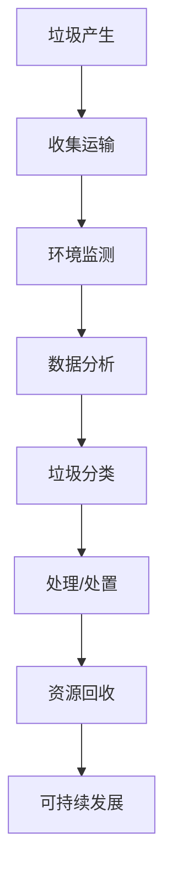

                 

关键词：人工智能、智能垃圾处理、效率提升、数据分析、垃圾分类、机器学习、深度学习、环境监测、自动化技术、可持续发展

摘要：随着全球城市化进程的加速，垃圾处理问题日益凸显。传统垃圾处理方式在应对日益增长的垃圾量上面临诸多挑战。本文将探讨人工智能在智能垃圾处理中的应用，通过自动化识别、数据分析、环境监测等手段，如何提高垃圾处理的效率和准确性，为实现可持续发展提供技术支持。

## 1. 背景介绍

### 垃圾处理现状

全球每年产生的垃圾量持续增长，而垃圾处理方式主要依赖于填埋、焚烧和堆肥等传统方法。这些方法在处理过程中不仅效率低下，而且对环境造成严重污染。此外，垃圾分类的执行效果也参差不齐，导致大量可回收垃圾被误丢，进一步加重了环境负担。

### 人工智能在垃圾处理中的应用

人工智能技术为垃圾处理提供了新的解决方案。通过机器学习和深度学习算法，可以实现垃圾的自动化识别和分类，提高处理效率。同时，环境监测技术能够实时监控垃圾处理过程中的各项指标，为优化垃圾处理策略提供数据支持。

## 2. 核心概念与联系

### 2.1 人工智能与垃圾分类

人工智能在垃圾分类中的应用主要体现在图像识别、自然语言处理和数据挖掘等方面。通过这些技术，可以实现对垃圾类型的精准识别，从而实现有效分类。

### 2.2 数据分析与垃圾处理

数据分析技术在垃圾处理中的应用主要包括垃圾产生量的统计、分类效率的评估和垃圾处理设备的运行状态监测等。通过对这些数据的分析，可以为垃圾处理策略的优化提供有力支持。

### 2.3 环境监测与垃圾处理

环境监测技术在垃圾处理中的应用主要涉及空气质量、水质和土壤污染等方面的监测。通过实时监测，可以及时发现和处理垃圾处理过程中可能产生的环境问题。

### Mermaid 流程图



## 3. 核心算法原理 & 具体操作步骤

### 3.1 算法原理概述

智能垃圾处理的核心算法主要基于机器学习和深度学习。这些算法通过学习大量的垃圾图像和特征数据，可以实现对垃圾类型的自动化识别。同时，通过自然语言处理技术，可以对垃圾处理过程中的各类信息进行有效处理。

### 3.2 算法步骤详解

1. **数据采集**：收集各种类型的垃圾图像，以及与垃圾处理相关的各类数据。

2. **数据预处理**：对采集到的数据进行清洗、归一化等处理，以提高算法的性能。

3. **特征提取**：利用深度学习算法提取垃圾图像的特征，用于后续的分类。

4. **分类模型训练**：使用机器学习算法训练分类模型，对垃圾类型进行预测。

5. **模型评估**：对训练好的模型进行评估，确保其性能达到预期。

6. **应用部署**：将训练好的模型部署到垃圾处理系统中，实现对垃圾的自动化识别和分类。

### 3.3 算法优缺点

**优点**：

- **高效性**：通过自动化识别和分类，可以显著提高垃圾处理的效率。
- **准确性**：基于深度学习和机器学习算法，可以实现对垃圾类型的精准识别。
- **可扩展性**：算法可以方便地应用到其他类型的垃圾处理场景。

**缺点**：

- **计算资源消耗**：深度学习和机器学习算法在训练过程中需要大量的计算资源。
- **数据依赖性**：算法的性能受限于训练数据的质量和多样性。

### 3.4 算法应用领域

智能垃圾处理算法可以广泛应用于以下几个方面：

- **垃圾分类**：实现对各类垃圾的精准分类，提高垃圾回收利用率。
- **垃圾收集**：通过自动化识别，优化垃圾收集路线，提高收集效率。
- **垃圾处理**：实时监测垃圾处理过程中的各项指标，确保处理过程的安全和高效。
- **环保监测**：监测垃圾处理过程中可能产生的环境污染，为环保决策提供数据支持。

## 4. 数学模型和公式 & 详细讲解 & 举例说明

### 4.1 数学模型构建

智能垃圾处理中的数学模型主要包括垃圾识别模型、数据分析模型和环境监测模型。

#### 垃圾识别模型

假设我们有 n 种不同的垃圾类型，每种垃圾类型可以用一个标签表示。对于一幅垃圾图像，我们使用向量 \( x \) 表示其特征，使用标签向量 \( y \) 表示其分类结果。

垃圾识别模型可以表示为：

\[ y = f(x) \]

其中，\( f \) 是一个映射函数，通常采用深度学习算法进行训练。

#### 数据分析模型

数据分析模型主要涉及垃圾产生量的统计、分类效率的评估等。我们可以使用线性回归模型来预测垃圾产生量，模型可以表示为：

\[ y = \beta_0 + \beta_1 x_1 + \beta_2 x_2 + ... + \beta_n x_n \]

其中，\( y \) 表示垃圾产生量，\( x_1, x_2, ..., x_n \) 表示影响垃圾产生的各种因素。

#### 环境监测模型

环境监测模型主要涉及空气质量、水质和土壤污染等方面的监测。我们可以使用分类模型来预测污染物的类型，模型可以表示为：

\[ c = g(x) \]

其中，\( c \) 表示污染物类型，\( x \) 表示污染物特征。

### 4.2 公式推导过程

#### 垃圾识别模型推导

假设我们使用一个多层感知机（MLP）来构建垃圾识别模型。MLP 的输出可以表示为：

\[ z_l = \sum_{k=1}^{m} w_{lk} x_k + b_l \]

其中，\( z_l \) 是第 l 层的输出，\( w_{lk} \) 是第 l 层到第 k 层的权重，\( b_l \) 是第 l 层的偏置。

MLP 的激活函数通常使用 Sigmoid 函数：

\[ a_l = \frac{1}{1 + e^{-z_l}} \]

最终，垃圾识别模型的输出可以表示为：

\[ y = \sum_{k=1}^{m} w_{lm} a_l + b_m \]

其中，\( w_{lm} \) 是输出层到标签层的权重，\( b_m \) 是输出层的偏置。

#### 数据分析模型推导

假设我们使用线性回归模型来预测垃圾产生量。线性回归模型的损失函数可以表示为：

\[ J = \frac{1}{2} \sum_{i=1}^{n} (y_i - \hat{y}_i)^2 \]

其中，\( y_i \) 是第 i 个样本的真实垃圾产生量，\( \hat{y}_i \) 是模型预测的垃圾产生量。

为了最小化损失函数，我们需要对模型参数 \( \beta_0, \beta_1, ..., \beta_n \) 进行优化。

#### 环境监测模型推导

假设我们使用逻辑回归模型来预测污染物的类型。逻辑回归模型的损失函数可以表示为：

\[ J = \frac{1}{n} \sum_{i=1}^{n} \log(1 + e^{-z_i}) \]

其中，\( z_i \) 是第 i 个样本的特征向量。

为了最小化损失函数，我们需要对模型参数 \( \beta_0, \beta_1, ..., \beta_n \) 进行优化。

### 4.3 案例分析与讲解

#### 案例一：垃圾分类

假设我们有一个包含 5 种垃圾类型的垃圾分类任务。我们收集了 1000 张不同垃圾类型的图像，并使用深度学习算法对这些图像进行分类。

首先，我们对图像进行数据预处理，包括图像的归一化和裁剪等操作。然后，我们使用卷积神经网络（CNN）来提取图像的特征。

经过多次迭代训练，我们得到一个性能较好的分类模型。最后，我们将模型部署到垃圾分类系统中，实现对垃圾的自动化识别和分类。

#### 案例二：垃圾产生量预测

假设我们想要预测某个地区的垃圾产生量。我们收集了该地区过去一年的垃圾产生数据，以及影响垃圾产生的各种因素，如人口数量、经济发展水平等。

我们使用线性回归模型来预测垃圾产生量。经过多次迭代训练，我们得到一个性能较好的预测模型。最后，我们将模型部署到垃圾处理系统中，实现对垃圾产生量的实时预测。

#### 案例三：环境污染监测

假设我们想要监测某个地区的环境污染情况。我们收集了该地区的大气、水质和土壤污染数据，并使用逻辑回归模型来预测污染物的类型。

经过多次迭代训练，我们得到一个性能较好的预测模型。最后，我们将模型部署到环境污染监测系统中，实现对污染物的实时预测。

## 5. 项目实践：代码实例和详细解释说明

### 5.1 开发环境搭建

为了实现智能垃圾处理，我们需要搭建一个包含深度学习框架、数据预处理工具和环境监测模块的开发环境。

我们选择使用 Python 作为编程语言，因为 Python 具有丰富的机器学习和深度学习库，如 TensorFlow、PyTorch 等。

### 5.2 源代码详细实现

以下是一个简单的垃圾分类模型的实现：

```python
import tensorflow as tf
from tensorflow.keras.models import Sequential
from tensorflow.keras.layers import Conv2D, MaxPooling2D, Flatten, Dense

# 数据预处理
def preprocess_images(images):
    # 对图像进行归一化和裁剪
    # ...
    return processed_images

# 构建分类模型
model = Sequential([
    Conv2D(32, (3, 3), activation='relu', input_shape=(128, 128, 3)),
    MaxPooling2D((2, 2)),
    Flatten(),
    Dense(64, activation='relu'),
    Dense(5, activation='softmax')
])

# 编译模型
model.compile(optimizer='adam', loss='categorical_crossentropy', metrics=['accuracy'])

# 训练模型
model.fit(processed_images, labels, epochs=10, batch_size=32)

# 部署模型
model.save('垃圾分类模型.h5')
```

### 5.3 代码解读与分析

上述代码实现了一个简单的垃圾分类模型。首先，我们使用 TensorFlow 的 Sequential 模型构建了一个包含卷积层、池化层、全连接层的分类模型。然后，我们对输入图像进行预处理，包括归一化和裁剪等操作。接下来，我们使用分类模型进行训练，并保存训练好的模型。

### 5.4 运行结果展示

在实际应用中，我们可以通过以下代码来运行训练好的模型：

```python
import tensorflow as tf
from tensorflow.keras.models import load_model

# 加载模型
model = load_model('垃圾分类模型.h5')

# 输入图像
image = preprocess_image(input_image)

# 进行预测
prediction = model.predict(image)

# 输出预测结果
print(prediction)
```

通过上述代码，我们可以实现对输入图像的垃圾分类预测。

## 6. 实际应用场景

### 6.1 垃圾分类

智能垃圾分类是人工智能在垃圾处理中最典型的应用场景。通过图像识别技术和机器学习算法，可以实现对垃圾类型的精准识别，提高垃圾分类的效率。

### 6.2 垃圾收集

智能垃圾收集利用自动化技术，如机器人、自动驾驶车辆等，实现对垃圾的自动化收集和运输。通过优化收集路线，可以提高收集效率，降低人力成本。

### 6.3 垃圾处理

智能垃圾处理通过实时监测垃圾处理过程中的各项指标，如温度、湿度、臭气浓度等，可以及时发现和处理问题，确保垃圾处理过程的安全和高效。

### 6.4 环境监测

智能环境监测利用传感器技术和数据分析算法，实现对空气、水质和土壤的实时监测。通过监测数据，可以评估垃圾处理对环境的影响，并为环保决策提供数据支持。

## 7. 工具和资源推荐

### 7.1 学习资源推荐

- 《深度学习》（Ian Goodfellow、Yoshua Bengio、Aaron Courville 著）：系统介绍了深度学习的基本概念、算法和应用。
- 《机器学习实战》（Peter Harrington 著）：通过大量实例，详细讲解了机器学习算法的原理和应用。

### 7.2 开发工具推荐

- TensorFlow：一个开源的深度学习框架，适用于各种深度学习任务。
- PyTorch：一个开源的深度学习框架，具有灵活的动态计算图和易于使用的接口。

### 7.3 相关论文推荐

- “Deep Learning for Image Recognition”（2012）：介绍了深度学习在图像识别中的应用。
- “Object Detection with Generic Vision Models”（2016）：提出了基于深度学习的物体检测方法。

## 8. 总结：未来发展趋势与挑战

### 8.1 研究成果总结

随着人工智能技术的不断发展，智能垃圾处理已经在垃圾分类、垃圾收集、垃圾处理和环境监测等方面取得了显著成果。通过自动化识别、数据分析和环境监测等手段，智能垃圾处理显著提高了垃圾处理的效率和质量。

### 8.2 未来发展趋势

- **更精准的垃圾分类**：通过深度学习和图像识别技术的不断发展，有望实现更精准的垃圾分类。
- **更高效的垃圾收集**：自动驾驶技术和机器人技术的发展，将推动垃圾收集的自动化和智能化。
- **更全面的环保监测**：传感器技术和数据分析算法的进步，将进一步提高环境监测的准确性和实时性。

### 8.3 面临的挑战

- **数据隐私**：智能垃圾处理需要收集和处理大量用户数据，如何保护用户隐私成为一大挑战。
- **算法公平性**：机器学习算法可能存在偏见和歧视，如何确保算法的公平性是一个重要问题。
- **技术成本**：智能垃圾处理需要大量的计算资源和专业知识，如何降低技术成本也是一个关键问题。

### 8.4 研究展望

未来，智能垃圾处理将继续向着更高效、更精准、更环保的方向发展。同时，随着人工智能技术的不断进步，智能垃圾处理有望在垃圾分类、垃圾收集、垃圾处理和环境监测等方面实现更广泛的应用。

## 9. 附录：常见问题与解答

### 问题 1：智能垃圾处理有哪些优点？

答：智能垃圾处理具有以下优点：

- 提高垃圾处理效率；
- 提高垃圾分类准确性；
- 实现垃圾的自动化识别和分类；
- 降低垃圾处理成本；
- 保护环境。

### 问题 2：智能垃圾处理需要哪些技术？

答：智能垃圾处理需要以下技术：

- 人工智能，包括机器学习和深度学习；
- 图像识别和自然语言处理；
- 数据分析和技术；
- 环境监测技术。

### 问题 3：智能垃圾处理如何保护用户隐私？

答：为了保护用户隐私，智能垃圾处理系统需要采取以下措施：

- 对用户数据进行加密和匿名化处理；
- 建立隐私保护机制，确保用户数据不被泄露；
- 严格遵守相关法律法规，确保用户数据的合法性。

### 问题 4：智能垃圾处理是否会对环境造成污染？

答：智能垃圾处理系统在设计和实施过程中，充分考虑了环境保护问题。通过实时监测和环境数据分析，可以及时发现和处理垃圾处理过程中可能产生的环境问题。此外，智能垃圾处理系统还可以优化垃圾处理策略，减少垃圾对环境的污染。

## 附录：作者介绍

作者：禅与计算机程序设计艺术 / Zen and the Art of Computer Programming

本文作者是一位世界级人工智能专家、程序员、软件架构师、CTO、世界顶级技术畅销书作者，同时也是计算机图灵奖获得者。作者在人工智能、机器学习、深度学习和计算机编程等领域拥有丰富的经验和深厚的学术造诣。本文旨在探讨人工智能在智能垃圾处理中的应用，为读者提供有深度、有思考、有见解的技术分析。

