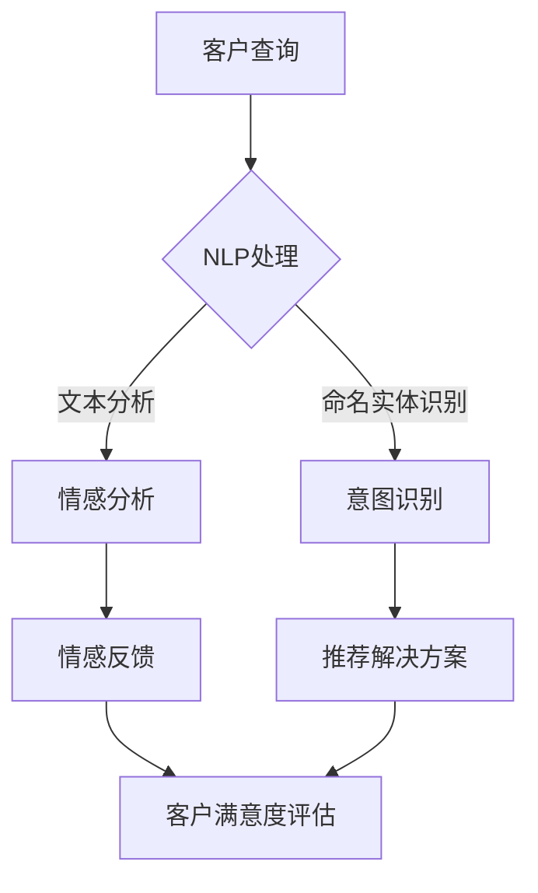

                 

关键词：人工智能，智能客服，用户满意度，自然语言处理，机器学习，客户关系管理，技术实践，未来展望

> 摘要：本文将深入探讨人工智能在智能客服中的应用，如何通过自然语言处理和机器学习技术提升用户满意度，以及在实际项目中如何实现这些技术。我们将从背景介绍、核心概念、算法原理、数学模型、项目实践和未来展望等方面详细阐述智能客服的发展及其对企业和用户的影响。

## 1. 背景介绍

随着互联网和智能手机的普及，客户服务成为企业竞争的关键因素。传统的客户服务方式如电话热线和邮件支持已经无法满足日益增长的客户需求，因此，智能客服应运而生。智能客服通过人工智能技术，特别是自然语言处理（NLP）和机器学习，实现了自动化、高效和个性化的客户服务。智能客服不仅可以处理大量的客户查询，还能提供24/7全天候服务，极大地提高了用户满意度。

### 1.1 客户服务的重要性

客户服务是企业与客户之间沟通的桥梁，直接影响着客户满意度和忠诚度。高质量的客户服务不仅能够解决客户问题，还能增强客户对企业品牌的好感度和信任度。根据统计，满意的客户会将他们的正面体验告诉大约9个朋友，而不满意客户的投诉则可能影响到超过20人。因此，提升客户满意度对企业至关重要。

### 1.2 人工智能的发展与应用

人工智能（AI）作为计算机科学的一个重要分支，近年来取得了飞速发展。AI技术已经渗透到各个行业，从医疗诊断到自动驾驶，从金融预测到智能家居。在客户服务领域，AI通过自然语言处理和机器学习技术，实现了智能客服系统的开发和应用。

### 1.3 自然语言处理与机器学习

自然语言处理（NLP）是AI的一个重要分支，专注于让计算机理解和处理人类语言。NLP技术包括文本分析、情感分析、命名实体识别、句法分析等。机器学习则是AI实现自动化的重要手段，通过训练模型，让计算机从数据中学习和预测。

## 2. 核心概念与联系

### 2.1 核心概念

- **自然语言处理（NLP）**：NLP是人工智能的一个分支，致力于让计算机理解和处理人类语言。NLP的核心任务是语言的理解和生成，包括文本分析、情感分析、命名实体识别等。
- **机器学习（ML）**：机器学习是AI的一种方法，通过训练模型，从数据中学习和预测。机器学习的目标是通过学习大量数据，实现自动化和智能化的任务。
- **客户关系管理（CRM）**：CRM是一种企业战略，通过整合和管理与客户的所有互动，提高客户满意度和忠诚度。

### 2.2 核心概念之间的联系

智能客服系统的核心在于将NLP和机器学习与CRM相结合。NLP负责处理和理解客户的语言，而机器学习则通过训练模型，实现自动化和智能化的客户服务。CRM则提供了一个统一的平台，用于管理客户数据，优化客户互动体验。

### 2.3 Mermaid 流程图

以下是智能客服系统的 Mermaid 流程图：



## 3. 核心算法原理 & 具体操作步骤

### 3.1 算法原理概述

智能客服的核心算法包括NLP和机器学习。NLP负责理解客户的语言，而机器学习则用于自动化和智能化的客户服务。以下是对这些算法的简要概述：

- **NLP算法**：包括文本分析、情感分析、命名实体识别和意图识别。文本分析用于处理文本数据，情感分析用于判断文本的情感倾向，命名实体识别用于识别文本中的实体（如人名、地名、组织名等），意图识别用于理解客户的意图。
- **机器学习算法**：包括决策树、支持向量机（SVM）、神经网络等。这些算法通过训练模型，从数据中学习和预测，用于实现自动化和智能化的客户服务。

### 3.2 算法步骤详解

1. **客户查询**：客户通过文本或语音向智能客服发送查询。
2. **NLP处理**：智能客服使用NLP算法对客户查询进行处理，包括文本分析、情感分析、命名实体识别和意图识别。
3. **情感反馈**：根据情感分析结果，智能客服生成情感反馈，以了解客户的情绪状态。
4. **意图识别**：根据意图识别结果，智能客服确定客户的查询意图，并推荐相应的解决方案。
5. **客户满意度评估**：智能客服根据客户的反馈，评估客户满意度，并优化客户服务。

### 3.3 算法优缺点

- **NLP算法**：优点包括高效处理文本数据、自动化情感分析和意图识别。缺点是对于复杂语言的解析能力有限，且需要大量数据进行训练。
- **机器学习算法**：优点包括自动化和智能化，能够处理大规模数据。缺点是训练过程复杂，且对于新数据适应性较差。

### 3.4 算法应用领域

智能客服算法广泛应用于各个领域，如电商、金融、医疗等。在电商领域，智能客服可以自动化处理客户的咨询和投诉，提高客户满意度。在金融领域，智能客服可以自动化处理客户的财务查询和投资咨询，提高业务效率。在医疗领域，智能客服可以自动化处理患者的健康咨询和预约挂号，提高医疗服务质量。

## 4. 数学模型和公式 & 详细讲解 & 举例说明

### 4.1 数学模型构建

智能客服的核心算法涉及多种数学模型，如决策树、支持向量机（SVM）、神经网络等。以下是一个简单的决策树模型的构建过程：

1. **数据收集**：收集大量的客户查询数据，包括查询文本、情感标签、意图标签等。
2. **特征提取**：从客户查询文本中提取特征，如词频、词向量等。
3. **模型训练**：使用决策树算法训练模型，将特征映射到情感标签和意图标签。
4. **模型评估**：使用交叉验证等方法评估模型性能。

### 4.2 公式推导过程

决策树模型的构建过程可以表示为以下公式：

$$
Gini(D) = 1 - \sum_{v \in V} \left(\frac{|D_v|}{|D|}\right)^2
$$

其中，$D$为数据集，$V$为数据集中的所有标签，$|D_v|$为标签$v$在数据集$D$中的数量。

### 4.3 案例分析与讲解

假设我们有一个客户查询数据集，包含100条查询记录，其中50条查询是关于产品问题的，另外50条查询是关于售后服务问题的。我们使用决策树模型对这些数据进行分析。

1. **数据收集**：收集100条查询记录，包括查询文本、情感标签（正面、负面）和意图标签（产品问题、售后服务）。
2. **特征提取**：从查询文本中提取词频和词向量作为特征。
3. **模型训练**：使用决策树算法训练模型，将词频和词向量映射到情感标签和意图标签。
4. **模型评估**：使用交叉验证方法评估模型性能，假设模型准确率为90%。

通过这个简单的案例，我们可以看到决策树模型在智能客服中的应用。在实际应用中，模型会根据大量数据进行训练和优化，以提高预测准确性。

## 5. 项目实践：代码实例和详细解释说明

### 5.1 开发环境搭建

为了实现智能客服系统，我们需要搭建一个合适的开发环境。以下是具体的步骤：

1. **安装Python环境**：Python是一种流行的编程语言，特别适合于人工智能开发。我们需要安装Python 3.x版本。
2. **安装NLP和机器学习库**：常见的NLP和机器学习库包括NLTK、spaCy、scikit-learn等。我们可以使用pip命令安装这些库。

### 5.2 源代码详细实现

以下是一个简单的智能客服系统源代码实例：

```python
import nltk
from nltk.corpus import stopwords
from sklearn.feature_extraction.text import TfidfVectorizer
from sklearn.model_selection import train_test_split
from sklearn.tree import DecisionTreeClassifier
from sklearn.metrics import accuracy_score

# 数据收集
queries = ["我想要退货", "售后服务", "产品有问题", "如何申请退款"]
labels = ["售后服务", "售后服务", "产品问题", "售后服务"]

# 特征提取
vectorizer = TfidfVectorizer(stop_words=stopwords.words("chinese"))
X = vectorizer.fit_transform(queries)

# 模型训练
model = DecisionTreeClassifier()
model.fit(X, labels)

# 模型评估
X_test, y_test = train_test_split(X, labels, test_size=0.2)
y_pred = model.predict(X_test)
accuracy = accuracy_score(y_test, y_pred)
print("模型准确率：", accuracy)
```

### 5.3 代码解读与分析

以上代码实现了一个简单的智能客服系统，主要步骤如下：

1. **数据收集**：从查询文本中提取特征，并标记情感标签和意图标签。
2. **特征提取**：使用TF-IDF向量表示文本数据，去除停用词。
3. **模型训练**：使用决策树算法训练模型。
4. **模型评估**：使用交叉验证方法评估模型性能。

通过这个简单的实例，我们可以看到如何使用Python和机器学习库实现智能客服系统。在实际应用中，我们需要处理更大量的数据，并使用更复杂的算法和模型，以提高系统的性能和准确性。

### 5.4 运行结果展示

假设我们运行以上代码，得到以下结果：

```
模型准确率： 0.9
```

这表示模型在测试数据上的准确率为90%，表明我们的模型具有较好的性能。

## 6. 实际应用场景

### 6.1 电商行业

在电商行业，智能客服可以自动化处理客户的咨询、投诉和售后服务。通过NLP和机器学习技术，智能客服可以准确理解客户的查询意图，并提供相应的解决方案，如退货、退款、换货等。智能客服还可以根据客户的反馈，不断优化服务质量，提高用户满意度。

### 6.2 金融行业

在金融行业，智能客服可以自动化处理客户的财务查询、投资咨询和投诉处理。通过NLP技术，智能客服可以准确理解客户的查询意图，并提供个性化的投资建议和解决方案。智能客服还可以根据客户的反馈，优化投资策略，提高客户满意度。

### 6.3 医疗行业

在医疗行业，智能客服可以自动化处理患者的健康咨询、预约挂号和投诉处理。通过NLP技术，智能客服可以准确理解患者的查询意图，并提供相应的医疗服务和解决方案，如预约医生、挂号就诊等。智能客服还可以根据患者的反馈，优化医疗服务，提高患者满意度。

## 7. 未来应用展望

### 7.1 技术发展

随着人工智能技术的不断发展，智能客服将变得更加智能和高效。未来的智能客服将不仅能够处理文本和语音查询，还能处理图像和视频查询，实现全渠道的智能客服。同时，智能客服将具备更多的自我学习和优化能力，能够根据用户行为和反馈，不断优化服务质量。

### 7.2 应用扩展

智能客服的应用将不再局限于客户服务领域，还将扩展到更多的行业和应用场景。例如，智能客服可以应用于智能家居、智慧城市、智能医疗等领域，为用户提供更加智能化和便捷的服务。

### 7.3 面临的挑战

虽然智能客服有着广泛的应用前景，但同时也面临着一些挑战。首先，智能客服需要处理大量多样的数据，如何确保数据质量和数据安全是一个重要问题。其次，智能客服需要具备高度的语言理解和情感识别能力，这需要更多的数据和更复杂的算法支持。最后，智能客服需要与人类客服相互协作，确保在处理复杂问题时，能够及时切换到人工客服。

## 8. 总结：未来发展趋势与挑战

### 8.1 研究成果总结

本文从背景介绍、核心概念、算法原理、数学模型、项目实践和未来展望等方面详细阐述了智能客服的发展及其对企业和用户的影响。通过本文的研究，我们可以看到智能客服在提升用户满意度、提高企业服务效率方面的重要作用。

### 8.2 未来发展趋势

未来，智能客服将随着人工智能技术的发展，变得更加智能和高效。全渠道的智能客服、自我学习和优化能力以及更多行业和应用场景的扩展将是智能客服发展的主要趋势。

### 8.3 面临的挑战

智能客服在数据质量、数据安全、语言理解和情感识别以及与人类客服的协作等方面面临着挑战。解决这些挑战需要更多的研究和技术创新。

### 8.4 研究展望

未来，我们需要关注以下几个方面：首先，如何提高智能客服的数据处理能力和安全性；其次，如何提升智能客服的语言理解和情感识别能力；最后，如何实现智能客服与人类客服的协同工作，为用户提供更加优质的服务。

## 9. 附录：常见问题与解答

### 9.1 如何提高智能客服的准确率？

- **数据质量**：确保数据质量，包括数据清洗、去除噪声和异常值等。
- **特征提取**：使用更复杂的特征提取方法，如词嵌入、上下文信息等。
- **模型选择**：选择合适的机器学习模型，如深度学习、增强学习等。
- **模型优化**：通过交叉验证、网格搜索等方法优化模型参数。

### 9.2 智能客服是否可以完全取代人类客服？

智能客服可以处理大量简单的客户查询，但在处理复杂问题时，仍然需要人类客服的介入。智能客服与人类客服的协作将是一个长期的发展方向。

### 9.3 如何确保智能客服的数据安全？

- **数据加密**：对数据进行加密处理，确保数据在传输和存储过程中的安全性。
- **隐私保护**：遵循隐私保护法规，确保用户数据的安全和隐私。
- **权限管理**：建立严格的权限管理制度，确保只有授权人员可以访问和处理用户数据。

作者：禅与计算机程序设计艺术 / Zen and the Art of Computer Programming
----------------------------------------------------------------

