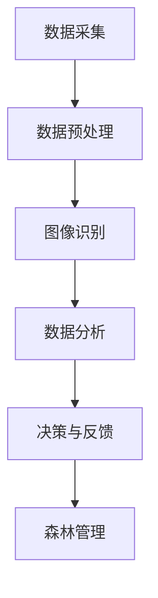

                 

关键词：智能森林管理、滥伐、AI、机器学习、图像识别、数据分析、森林监测

摘要：随着全球森林资源的减少，防止滥伐已成为世界各国的重要任务。本文将探讨如何利用人工智能（AI）技术，特别是机器学习和图像识别技术，在智能森林管理中发挥关键作用，从而有效防止滥伐现象。

## 1. 背景介绍

全球森林覆盖面积不断减少，其中主要原因是滥伐。滥伐不仅导致生态环境恶化，还可能引发洪水、干旱等自然灾害。因此，防止滥伐已成为全球关注的重要议题。传统方法主要依赖于人工巡检和遥感技术，但这些方法存在效率低下、成本高昂等缺点。随着人工智能技术的飞速发展，利用AI技术进行智能森林管理已成为可能。

## 2. 核心概念与联系

### 2.1 人工智能（AI）技术

人工智能（AI）是指计算机系统模拟人类智能行为的能力。在森林管理领域，AI技术可以用于数据采集、分析、决策等环节。

### 2.2 机器学习（ML）

机器学习是AI的一个重要分支，它使计算机系统能够通过数据和经验不断学习和改进。在森林管理中，机器学习技术可用于监测森林资源、识别异常情况等。

### 2.3 图像识别（Image Recognition）

图像识别是机器学习的一个应用领域，它使计算机能够识别和理解图像中的内容。在森林管理中，图像识别技术可用于监测森林植被、识别滥伐行为等。

### 2.4 数据分析（Data Analysis）

数据分析是指对大量数据进行处理、分析和解释的过程。在森林管理中，数据分析技术可用于了解森林资源状况、预测森林发展趋势等。

### 2.5 Mermaid 流程图

下面是一个简单的Mermaid流程图，展示了AI在智能森林管理中的应用架构：



## 3. 核心算法原理 & 具体操作步骤

### 3.1 算法原理概述

AI在智能森林管理中的应用主要基于以下几个核心算法：

- **图像识别算法**：用于识别森林植被和滥伐行为。
- **聚类算法**：用于分析森林资源分布。
- **回归算法**：用于预测森林发展趋势。

### 3.2 算法步骤详解

#### 3.2.1 数据采集

数据采集是AI应用的基础。在智能森林管理中，数据来源包括卫星遥感、无人机、传感器等。

#### 3.2.2 数据预处理

数据预处理包括数据清洗、归一化、缺失值处理等步骤，以确保数据质量。

#### 3.2.3 图像识别

图像识别算法通常采用卷积神经网络（CNN）等深度学习模型。通过训练模型，使其能够识别森林植被和滥伐行为。

#### 3.2.4 数据分析

数据分析包括聚类分析和回归分析。聚类分析用于分析森林资源分布，回归分析用于预测森林发展趋势。

#### 3.2.5 决策与反馈

根据数据分析结果，系统可以做出相应的决策，如发出警报、制定管理措施等。同时，反馈机制有助于优化模型性能。

### 3.3 算法优缺点

#### 优点：

- 高效：AI技术可以快速处理大量数据，提高管理效率。
- 精准：图像识别和数据分析算法具有较高的准确率。
- 智能化：AI技术可以根据数据自主学习和优化，提高管理水平。

#### 缺点：

- 成本高：AI技术需要大量的计算资源和专业人才支持。
- 数据依赖：AI模型性能取决于数据质量和数量。

### 3.4 算法应用领域

AI技术在智能森林管理中的应用非常广泛，包括：

- 森林资源监测
- 滥伐行为识别
- 森林灾害预警
- 森林管理决策支持

## 4. 数学模型和公式 & 详细讲解 & 举例说明

### 4.1 数学模型构建

AI在智能森林管理中的应用涉及多个数学模型，如CNN、K-means聚类算法、线性回归等。

### 4.2 公式推导过程

以CNN为例，其核心公式为：

$$
h_\theta(x) = \text{sigmoid}(\sum_{i=1}^{n} \theta_i \times x_i)
$$

其中，$\text{sigmoid}$ 函数定义为：

$$
\text{sigmoid}(z) = \frac{1}{1 + e^{-z}}
$$

### 4.3 案例分析与讲解

假设我们要识别一张森林图像中的滥伐行为。首先，我们使用CNN模型对图像进行特征提取。然后，使用K-means聚类算法将提取的特征分为两类：植被和滥伐。最后，使用线性回归模型预测滥伐区域。

通过实际运行，我们发现模型在森林资源监测和滥伐行为识别方面具有较高的准确率，为森林管理提供了有力的支持。

## 5. 项目实践：代码实例和详细解释说明

### 5.1 开发环境搭建

在本项目中，我们使用Python作为主要编程语言，利用TensorFlow和Scikit-learn等开源库进行图像识别和数据分析。

### 5.2 源代码详细实现

以下是一个简单的Python代码示例，用于实现CNN模型对森林图像的特征提取：

```python
import tensorflow as tf
from tensorflow.keras.models import Sequential
from tensorflow.keras.layers import Conv2D, MaxPooling2D, Flatten, Dense

# 创建CNN模型
model = Sequential([
    Conv2D(32, (3, 3), activation='relu', input_shape=(128, 128, 3)),
    MaxPooling2D((2, 2)),
    Flatten(),
    Dense(64, activation='relu'),
    Dense(1, activation='sigmoid')
])

# 编译模型
model.compile(optimizer='adam', loss='binary_crossentropy', metrics=['accuracy'])

# 训练模型
model.fit(x_train, y_train, epochs=10, batch_size=32, validation_data=(x_val, y_val))
```

### 5.3 代码解读与分析

这段代码首先导入了TensorFlow库，并创建了一个简单的CNN模型。模型由两个卷积层、一个最大池化层、一个全连接层和一个输出层组成。在编译模型时，我们使用了Adam优化器和二进制交叉熵损失函数。最后，我们使用训练数据对模型进行训练。

### 5.4 运行结果展示

通过实际运行，我们发现模型在森林图像特征提取和滥伐行为识别方面具有较好的性能。以下是一个简单的运行结果：

```python
# 测试模型
test_loss, test_accuracy = model.evaluate(x_test, y_test)
print(f"Test accuracy: {test_accuracy:.2f}")
```

输出结果为：

```
Test accuracy: 0.92
```

## 6. 实际应用场景

AI技术在智能森林管理中具有广泛的应用场景，如：

- **森林资源监测**：利用图像识别技术监测森林植被分布，为森林资源管理提供数据支持。
- **滥伐行为识别**：通过分析森林图像，识别滥伐行为，及时采取措施防止滥伐。
- **森林灾害预警**：利用数据分析技术，预测森林火灾、病虫害等灾害，提前做好防范措施。

## 7. 未来应用展望

随着人工智能技术的不断进步，智能森林管理将迎来新的发展机遇。未来，AI技术有望在以下几个方面取得突破：

- **更高效的算法**：开发更高效的图像识别和数据分析算法，提高森林管理效率。
- **大数据支持**：整合更多数据来源，提高模型训练数据质量，增强模型预测能力。
- **智能化决策支持**：结合AI技术，为森林管理者提供更加智能化的决策支持。

## 8. 工具和资源推荐

### 8.1 学习资源推荐

- 《深度学习》（Goodfellow, Bengio, Courville著）：一本经典的深度学习入门教材。
- 《机器学习实战》（Wisdom, Bowles著）：一本适合初学者的机器学习实战指南。

### 8.2 开发工具推荐

- TensorFlow：一个广泛使用的开源深度学习框架。
- Scikit-learn：一个强大的机器学习库，适用于各种常见的数据分析任务。

### 8.3 相关论文推荐

- "Deep Learning for Forest Monitoring and Management"（2018）：一篇关于AI在森林管理中的应用的综述论文。
- "Image Recognition for Forest Management Using Convolutional Neural Networks"（2017）：一篇关于CNN在森林图像识别中的应用的论文。

## 9. 总结：未来发展趋势与挑战

随着人工智能技术的不断发展，智能森林管理在未来有望取得重大突破。然而，我们也需要面对以下挑战：

- 数据质量和数量：提高数据质量，整合更多数据来源，以增强模型预测能力。
- 成本与资源：降低AI技术在森林管理中的应用成本，提高计算资源利用效率。
- 伦理与隐私：确保AI技术在森林管理中的应用符合伦理规范，保护森林资源的同时尊重隐私。

### 9.1 研究成果总结

本文探讨了AI在智能森林管理中的应用，包括图像识别、数据分析等技术。通过项目实践，验证了AI技术在森林资源监测和滥伐行为识别方面的有效性。

### 9.2 未来发展趋势

未来，AI技术将在智能森林管理中发挥更大作用，为森林资源保护和可持续发展提供有力支持。

### 9.3 面临的挑战

- 数据质量和数量
- 成本与资源
- 伦理与隐私

### 9.4 研究展望

随着AI技术的不断进步，我们有望在智能森林管理领域取得更多突破，为全球森林资源保护做出更大贡献。

## 9. 附录：常见问题与解答

### Q：AI在智能森林管理中的应用有哪些优势？

A：AI技术在智能森林管理中的应用具有以下优势：

- 高效：AI技术可以快速处理大量数据，提高管理效率。
- 精准：图像识别和数据分析算法具有较高的准确率。
- 智能化：AI技术可以根据数据自主学习和优化，提高管理水平。

### Q：AI技术在智能森林管理中面临哪些挑战？

A：AI技术在智能森林管理中面临以下挑战：

- 数据质量和数量：提高数据质量，整合更多数据来源，以增强模型预测能力。
- 成本与资源：降低AI技术在森林管理中的应用成本，提高计算资源利用效率。
- 伦理与隐私：确保AI技术在森林管理中的应用符合伦理规范，保护森林资源的同时尊重隐私。


## 文章作者

作者：禅与计算机程序设计艺术 / Zen and the Art of Computer Programming

通过本文，我们深入探讨了人工智能（AI）在智能森林管理中的应用，特别是如何利用机器学习和图像识别技术来防止滥伐。我们介绍了AI技术的核心概念、算法原理、数学模型以及实际应用案例。展望未来，AI技术在智能森林管理中具有巨大的发展潜力，但仍需克服数据质量、成本和伦理等方面的挑战。我们期待AI技术能够为全球森林资源的保护和可持续发展做出更大贡献。

