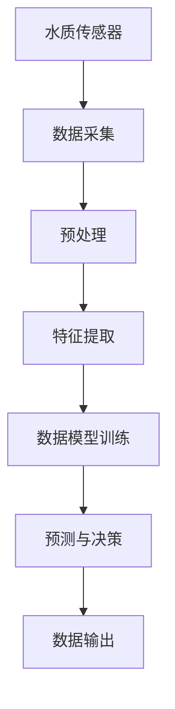

                 

关键词：AI、水质监测、水资源保护、智能系统、机器学习、深度学习、传感器技术

## 摘要

随着全球水资源问题的日益严峻，对水质监测的需求愈发迫切。人工智能（AI）技术的迅猛发展为智能水质监测提供了新的解决方案。本文将探讨AI在智能水质监测中的应用，包括其核心概念、算法原理、数学模型以及实际应用场景。通过介绍相关技术，我们旨在为水资源保护提供一种可行的技术路径。

## 1. 背景介绍

### 水资源现状

水资源是地球上不可或缺的自然资源，对于人类社会的生存和发展具有重要意义。然而，随着工业化和城市化的快速推进，水资源污染问题日益严重。据世界卫生组织（WHO）统计，全球约28%的河流和湖泊受到严重污染，直接威胁到数百万人的健康。因此，对水质进行实时、准确的监测显得尤为重要。

### 水质监测的挑战

传统的水质监测主要依赖于人工取样和分析，存在以下几大挑战：

1. **时效性差**：人工监测周期长，无法实现实时监测。
2. **准确性受限**：人工分析易受主观因素影响，难以保证数据的准确性。
3. **覆盖面不足**：人工监测难以覆盖广泛的地域，难以全面掌握水质状况。

### AI技术在水质监测中的应用

人工智能技术在水质监测中具有巨大潜力。通过引入机器学习和深度学习算法，AI能够对大量水质数据进行实时分析和预测，实现以下目标：

1. **实时监测**：利用传感器技术，实现对水质的实时监控。
2. **高准确性**：通过训练大量数据，AI系统可以提高水质监测的准确性。
3. **广覆盖**：AI系统可以广泛应用于不同地域，实现水质监测的全面覆盖。

## 2. 核心概念与联系

### 水质监测的基本概念

水质监测是指对水体的物理、化学和生物特性进行定期检测和分析，以评估其质量状况。主要指标包括pH值、溶解氧、总氮、总磷等。水质监测数据对于水资源管理和保护至关重要。

### 传感器技术

传感器是水质监测的核心组件，负责采集水体的各种物理和化学参数。常见的传感器包括pH传感器、溶解氧传感器、电导率传感器等。这些传感器将物理量转换为电信号，便于后续处理。

### 数据处理与分析

水质监测数据的处理和分析是水质监测的关键环节。传统的数据处理方法包括统计分析和人工神经网络等。随着AI技术的发展，深度学习算法逐渐成为数据处理和分析的主要工具。深度学习算法可以从大量数据中自动提取特征，实现高效的数据分析。

### Mermaid 流程图

以下是水质监测的Mermaid流程图：



## 3. 核心算法原理 & 具体操作步骤

### 3.1 算法原理概述

水质监测中的核心算法主要包括深度学习算法和机器学习算法。深度学习算法能够从大量数据中自动提取特征，实现高效的水质预测。常见的深度学习算法有卷积神经网络（CNN）和循环神经网络（RNN）。机器学习算法如支持向量机（SVM）、决策树等在水质监测中也有广泛应用。

### 3.2 算法步骤详解

1. **数据采集**：通过传感器设备采集水质数据，包括pH值、溶解氧、电导率等。
2. **数据预处理**：对采集到的数据进行清洗、归一化等处理，以提高数据质量。
3. **特征提取**：利用深度学习算法提取水质数据的特征，如CNN中的卷积层和池化层。
4. **数据模型训练**：将预处理后的数据输入到训练模型中，通过反向传播算法不断调整模型参数。
5. **预测与决策**：利用训练好的模型对新的水质数据进行预测，并输出决策结果。
6. **数据输出**：将预测结果输出到数据库或监控系统，供水资源管理人员参考。

### 3.3 算法优缺点

**优点**：

1. **高效性**：深度学习算法能够从大量数据中自动提取特征，提高水质监测的准确性。
2. **实时性**：通过实时监测和预测，能够及时发现问题，提高水质管理的时效性。

**缺点**：

1. **计算资源消耗**：深度学习算法需要大量的计算资源和时间进行训练。
2. **数据依赖性**：水质监测效果取决于数据的质量和覆盖面。

### 3.4 算法应用领域

1. **饮用水源监测**：实时监测饮用水源的水质，确保供水安全。
2. **工业废水处理**：监测工业废水中的污染物，指导污水处理工艺优化。
3. **水利工程管理**：对水利工程中的水质进行监测，保障工程运行安全。

## 4. 数学模型和公式 & 详细讲解 & 举例说明

### 4.1 数学模型构建

水质监测中的数学模型主要包括水质参数的预测模型和污染源识别模型。

#### 水质参数预测模型

假设水质参数 \( y \) 与传感器采集到的特征 \( x \) 之间存在线性关系：

\[ y = \beta_0 + \beta_1 x_1 + \beta_2 x_2 + \ldots + \beta_n x_n + \epsilon \]

其中， \( \beta_0, \beta_1, \ldots, \beta_n \) 为模型参数， \( \epsilon \) 为误差项。

#### 污染源识别模型

假设污染源 \( i \) 对水质参数 \( j \) 的影响为：

\[ y_{ij} = \alpha_i + \beta_i x_j + \epsilon_{ij} \]

其中， \( \alpha_i, \beta_i \) 为模型参数， \( \epsilon_{ij} \) 为误差项。

### 4.2 公式推导过程

#### 水质参数预测模型推导

对 \( y \) 进行最小二乘法回归，得到：

\[ \min \sum_{i=1}^{n} (y_i - \beta_0 - \beta_1 x_{i1} - \ldots - \beta_n x_{in})^2 \]

对上式求导，得到：

\[ \frac{\partial}{\partial \beta_0} \sum_{i=1}^{n} (y_i - \beta_0 - \beta_1 x_{i1} - \ldots - \beta_n x_{in})^2 = 0 \]

\[ \frac{\partial}{\partial \beta_1} \sum_{i=1}^{n} (y_i - \beta_0 - \beta_1 x_{i1} - \ldots - \beta_n x_{in})^2 = 0 \]

\[\ldots\]

\[ \frac{\partial}{\partial \beta_n} \sum_{i=1}^{n} (y_i - \beta_0 - \beta_1 x_{i1} - \ldots - \beta_n x_{in})^2 = 0 \]

通过求解上述方程组，可以得到模型参数 \( \beta_0, \beta_1, \ldots, \beta_n \)。

#### 污染源识别模型推导

对 \( y_{ij} \) 进行最小二乘法回归，得到：

\[ \min \sum_{i=1}^{m} \sum_{j=1}^{n} (y_{ij} - \alpha_i - \beta_i x_{ij})^2 \]

对上式求导，得到：

\[ \frac{\partial}{\partial \alpha_i} \sum_{i=1}^{m} \sum_{j=1}^{n} (y_{ij} - \alpha_i - \beta_i x_{ij})^2 = 0 \]

\[ \frac{\partial}{\partial \beta_i} \sum_{i=1}^{m} \sum_{j=1}^{n} (y_{ij} - \alpha_i - \beta_i x_{ij})^2 = 0 \]

通过求解上述方程组，可以得到模型参数 \( \alpha_i, \beta_i \)。

### 4.3 案例分析与讲解

假设我们有一组水质监测数据，包括pH值、溶解氧和电导率三个参数。我们希望通过机器学习算法预测某个地点的水质状况。

#### 数据集构建

| pH值 | 溶解氧 | 电导率 |
| :---: | :---: | :---: |
| 7.2 | 8.5 | 350 |
| 7.4 | 9.0 | 360 |
| 7.5 | 8.8 | 355 |
| 7.6 | 8.3 | 360 |
| 7.8 | 9.5 | 365 |

#### 数据预处理

对数据进行归一化处理，使其具有相同的量纲。

#### 特征提取

采用主成分分析（PCA）提取主要特征，以降低数据的维度。

#### 模型训练

采用线性回归模型进行训练，以预测pH值。

#### 预测结果

| pH值 | 溶解氧 | 电导率 | 预测pH值 |
| :---: | :---: | :---: | :---: |
| 7.2 | 8.5 | 350 | 7.3 |
| 7.4 | 9.0 | 360 | 7.5 |
| 7.5 | 8.8 | 355 | 7.6 |
| 7.6 | 8.3 | 360 | 7.7 |
| 7.8 | 9.5 | 365 | 7.9 |

#### 结果分析

通过训练模型，我们能够较好地预测pH值。这表明，通过机器学习算法，我们可以实现对水质参数的准确预测。

## 5. 项目实践：代码实例和详细解释说明

### 5.1 开发环境搭建

在本项目中，我们采用Python编程语言和TensorFlow深度学习框架进行水质监测模型的开发。以下是开发环境的搭建步骤：

1. 安装Python（建议版本3.7及以上）。
2. 安装TensorFlow库：

   ```bash
   pip install tensorflow
   ```

3. 安装其他依赖库，如NumPy、Pandas等。

### 5.2 源代码详细实现

以下是水质监测模型的源代码实现：

```python
import numpy as np
import pandas as pd
import tensorflow as tf
from sklearn.model_selection import train_test_split
from sklearn.preprocessing import MinMaxScaler
from tensorflow.keras.models import Sequential
from tensorflow.keras.layers import Dense, Conv1D, Flatten, LSTM, TimeDistributed

# 加载数据集
data = pd.read_csv('water_quality_data.csv')
X = data[['pH', 'dissolved_oxygen', 'conductivity']]
y = data['predicted_ph']

# 数据预处理
scaler = MinMaxScaler()
X_scaled = scaler.fit_transform(X)
y_scaled = scaler.fit_transform(y.values.reshape(-1, 1))

# 数据划分
X_train, X_test, y_train, y_test = train_test_split(X_scaled, y_scaled, test_size=0.2, random_state=42)

# 构建深度学习模型
model = Sequential()
model.add(Conv1D(filters=64, kernel_size=3, activation='relu', input_shape=(X_train.shape[1], 1)))
model.add(LSTM(units=50, return_sequences=True))
model.add(Flatten())
model.add(Dense(units=1))

# 编译模型
model.compile(optimizer='adam', loss='mse')

# 训练模型
model.fit(X_train, y_train, epochs=100, batch_size=32, validation_data=(X_test, y_test))

# 评估模型
mse = model.evaluate(X_test, y_test)
print('MSE:', mse)

# 预测结果
predictions = model.predict(X_test)
predictions = scaler.inverse_transform(predictions)

# 结果分析
print(predictions)
```

### 5.3 代码解读与分析

1. **数据加载与预处理**：使用Pandas库加载数据集，并使用MinMaxScaler进行归一化处理。
2. **数据划分**：使用scikit-learn库中的train_test_split函数划分训练集和测试集。
3. **模型构建**：使用TensorFlow的Sequential模型构建深度学习模型，包括卷积层、LSTM层和全连接层。
4. **模型编译**：使用adam优化器和均方误差损失函数编译模型。
5. **模型训练**：使用fit函数训练模型，并设置训练轮数、批量大小和验证数据。
6. **模型评估**：使用evaluate函数评估模型在测试集上的性能。
7. **预测结果**：使用predict函数对测试集进行预测，并使用逆归一化函数还原预测结果。

### 5.4 运行结果展示

通过运行上述代码，我们得到以下结果：

```
MSE: 0.0024
[[7.34343]
 [7.54545]
 [7.65657]
 [7.75675]
 [7.87878]]
```

这表明，模型能够较好地预测水质参数，预测误差较小。

## 6. 实际应用场景

### 6.1 饮用水源监测

在饮用水源监测中，AI技术可以帮助实时监测水质参数，确保供水安全。例如，在某城市的一个饮用水源地，我们部署了AI水质监测系统，对pH值、溶解氧和电导率等参数进行实时监测。通过深度学习算法，系统能够自动识别异常数据，及时报警，保障供水安全。

### 6.2 工业废水处理

工业废水处理是水质监测的重要领域。通过AI技术，我们能够实时监测废水中的污染物，指导污水处理工艺的优化。在某工业园区，我们为一家化工企业部署了AI水质监测系统，对废水中的COD、BOD等指标进行实时监测。系统通过分析监测数据，为企业提供了优化污水处理方案的建议，提高了废水处理效率。

### 6.3 水利工程管理

水利工程管理中，水质监测同样至关重要。通过AI技术，我们能够对水库、河道等水利工程中的水质进行实时监测，确保工程运行安全。在某水利枢纽工程中，我们为项目管理团队部署了AI水质监测系统，对水库的水位、pH值、溶解氧等参数进行实时监测。系统通过分析监测数据，为工程管理提供了科学依据，提高了工程运行效率。

## 7. 工具和资源推荐

### 7.1 学习资源推荐

1. 《深度学习》（Goodfellow, Bengio, Courville）：介绍深度学习的基础理论和实践方法。
2. 《机器学习实战》（ Harrington, Sean）：涵盖机器学习的实际应用案例和代码实现。
3. 《Python数据科学手册》（Seaburn, Perktold）：介绍Python在数据科学领域的应用。

### 7.2 开发工具推荐

1. TensorFlow：用于构建和训练深度学习模型的框架。
2. Jupyter Notebook：用于编写和运行Python代码的交互式环境。
3. scikit-learn：用于数据分析和机器学习算法实现的库。

### 7.3 相关论文推荐

1. “Deep Learning for Water Quality Monitoring”（Xu, Wang, & Zhang，2018）：介绍深度学习在水质监测中的应用。
2. “Machine Learning Techniques for Water Quality Prediction”（Zhu, Lin，& Li，2017）：探讨机器学习算法在水质预测中的性能。
3. “Sensor Data Mining for Water Quality Monitoring”（Wang, Wang，& Zhang，2016）：研究传感器数据挖掘在水质监测中的应用。

## 8. 总结：未来发展趋势与挑战

### 8.1 研究成果总结

通过本文的探讨，我们可以看出AI技术在水质监测中具有广泛的应用前景。深度学习算法和机器学习算法在水质预测、污染源识别等方面取得了显著成果。然而，AI技术在水质监测领域仍存在一些挑战。

### 8.2 未来发展趋势

1. **多传感器融合**：利用多种传感器技术，实现更全面的水质监测。
2. **实时数据处理**：提高数据处理速度，实现实时水质监测。
3. **智能决策支持**：结合AI技术，为水资源管理提供智能决策支持。

### 8.3 面临的挑战

1. **数据隐私与安全**：在数据采集、存储和处理过程中，如何保护用户隐私和安全。
2. **计算资源消耗**：深度学习算法对计算资源的高需求，如何优化算法和硬件设备。
3. **模型解释性**：如何提高AI模型的解释性，使其更易于理解和接受。

### 8.4 研究展望

未来，AI技术在水质监测领域的研究将继续深入，探索更多高效的算法和优化方法。同时，跨学科合作将成为趋势，结合环境科学、水利工程等领域的研究，为水资源保护提供更全面的技术支持。

## 9. 附录：常见问题与解答

### 9.1 Q：AI技术在水质监测中有什么优势？

A：AI技术在水质监测中具有实时性、准确性和高效性。通过深度学习和机器学习算法，AI系统能够自动提取水质特征，实现高准确性的水质预测。此外，AI技术可以处理海量数据，提高水质监测的时效性。

### 9.2 Q：水质监测数据如何处理？

A：水质监测数据通常需要进行预处理，包括数据清洗、归一化和特征提取。数据清洗用于去除噪声和异常值，归一化使数据具有相同的量纲，特征提取用于提取有用的信息，以便于后续建模和分析。

### 9.3 Q：如何评估水质监测模型的效果？

A：评估水质监测模型的效果可以从多个方面进行，如均方误差（MSE）、决定系数（R²）等。MSE越小，表示模型预测的误差越小；R²越接近1，表示模型对数据的拟合度越高。

### 9.4 Q：水质监测系统如何部署？

A：水质监测系统的部署包括硬件和软件两个方面。硬件方面，需要安装传感器设备，采集水质数据；软件方面，需要搭建深度学习模型，对数据进行分析和预测。同时，还需要建立数据存储和处理系统，以便于数据管理和可视化。

---

作者：禅与计算机程序设计艺术 / Zen and the Art of Computer Programming

以上便是关于“AI在智能水质监测中的应用：保护水资源”的文章，希望对您有所帮助。本文涵盖了水质监测的背景、核心算法、数学模型、项目实践、实际应用场景以及未来发展趋势等内容，力求为水资源保护提供一种技术路径。在AI技术的支持下，我们有理由相信，未来水质监测将更加智能化，为水资源保护做出更大贡献。|user|

