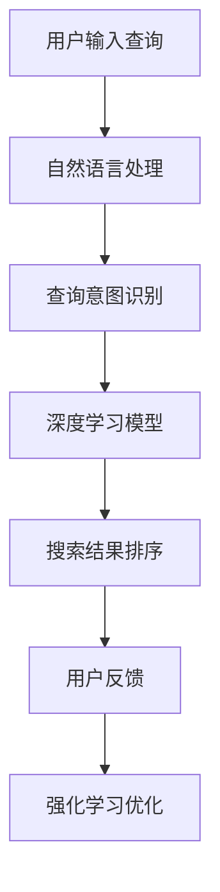

                 

随着互联网的普及和电子商务的快速发展，AI技术在电商领域的应用越来越广泛。本文将探讨AI在电商搜索优化方面的核心概念、算法原理、数学模型、应用场景以及未来展望。

## 关键词 Keywords

- 人工智能
- 电商搜索优化
- 深度学习
- 强化学习
- 数学模型

## 摘要 Summary

本文首先介绍了电商搜索优化的重要性，然后详细讨论了AI技术在电商搜索优化中的应用，包括核心概念、算法原理、数学模型、实际应用场景和未来展望。通过本文的阅读，读者可以全面了解AI技术在电商搜索优化领域的应用现状和未来趋势。

### 1. 背景介绍 Background

随着电商行业的迅猛发展，搜索引擎优化成为电商企业提高销售额和用户体验的重要手段。传统的搜索优化方法主要依赖于关键词匹配和相关性计算，但这种方法往往难以满足用户复杂的搜索需求。随着人工智能技术的进步，尤其是深度学习和强化学习等技术的应用，AI在电商搜索优化中发挥了越来越重要的作用。

电商搜索优化的目标是提高搜索结果的准确性、相关性和用户体验。准确性指的是搜索结果能够精确匹配用户查询意图；相关性指的是搜索结果与用户需求的高度契合；用户体验则包括搜索速度、页面加载速度和搜索结果呈现的友好性。

### 2. 核心概念与联系 Core Concepts and Relationships

为了更好地理解AI在电商搜索优化中的应用，我们需要先介绍几个核心概念。

#### 2.1 深度学习 Deep Learning

深度学习是一种基于神经网络的机器学习技术，通过多层次的神经网络结构来学习数据的特征和模式。深度学习在图像识别、语音识别和自然语言处理等领域取得了显著成果。

#### 2.2 强化学习 Reinforcement Learning

强化学习是一种通过试错学习优化决策过程的机器学习技术。在电商搜索优化中，强化学习可以用于优化搜索结果排序和推荐策略，从而提高用户满意度。

#### 2.3 自然语言处理 Natural Language Processing

自然语言处理是人工智能的一个重要分支，旨在使计算机能够理解和处理人类语言。在电商搜索优化中，自然语言处理技术可以用于理解用户查询意图，从而提高搜索结果的准确性。

#### 2.4 Mermaid 流程图 Mermaid Flowchart

为了更直观地展示AI在电商搜索优化中的流程，我们使用Mermaid流程图来描述关键环节。



### 3. 核心算法原理 & 具体操作步骤 Core Algorithm Principle & Steps

#### 3.1 算法原理概述 Algorithm Principle Overview

在电商搜索优化中，核心算法主要包括深度学习模型、强化学习算法和自然语言处理技术。

- **深度学习模型**：用于从大量历史搜索数据中学习用户查询的潜在特征，从而提高搜索结果的准确性。
- **强化学习算法**：用于优化搜索结果排序和推荐策略，通过不断调整策略来提高用户满意度。
- **自然语言处理技术**：用于理解用户查询意图，从而提高搜索结果的准确性。

#### 3.2 算法步骤详解 Algorithm Steps Detailed Description

1. **用户输入查询**：用户通过搜索引擎输入查询。
2. **自然语言处理**：对用户查询进行分词、词性标注和句法分析，从而提取出查询的关键词和意图。
3. **查询意图识别**：通过深度学习模型对查询意图进行识别，从而确定搜索结果的相关性。
4. **搜索结果排序**：根据查询意图和搜索结果的相关性对搜索结果进行排序。
5. **用户反馈**：用户对搜索结果进行评价，包括满意度、点击率等。
6. **强化学习优化**：根据用户反馈调整搜索结果排序和推荐策略，从而提高用户满意度。

#### 3.3 算法优缺点 Algorithm Advantages and Disadvantages

- **深度学习模型**：优点是能够从大量数据中学习用户查询的潜在特征，提高搜索结果的准确性；缺点是需要大量的训练数据和计算资源。
- **强化学习算法**：优点是能够通过不断调整策略来提高用户满意度；缺点是需要大量的用户反馈数据，且优化过程较复杂。
- **自然语言处理技术**：优点是能够理解用户查询意图，提高搜索结果的准确性；缺点是处理复杂查询时效果可能不佳。

#### 3.4 算法应用领域 Algorithm Application Fields

- **电商搜索引擎**：用于优化搜索结果排序，提高用户体验。
- **推荐系统**：用于根据用户兴趣和购买历史推荐相关商品。
- **广告投放**：用于根据用户兴趣和行为优化广告投放策略。

### 4. 数学模型和公式 Mathematical Models and Formulas

在电商搜索优化中，数学模型和公式起着至关重要的作用。以下是一个简单的数学模型示例。

#### 4.1 数学模型构建 Mathematical Model Construction

- **相关性评分**：设 \( R(q, d) \) 表示查询 \( q \) 和文档 \( d \) 的相关性评分，公式如下：

  $$ R(q, d) = \frac{1}{1 + e^{-\beta \cdot \text{similarity}(q, d)}} $$

  其中，\( \beta \) 是一个调节参数，\( \text{similarity}(q, d) \) 表示查询和文档之间的相似度。

#### 4.2 公式推导过程 Formula Derivation Process

- **相似度计算**：设 \( q \) 和 \( d \) 分别表示查询和文档的词向量，公式如下：

  $$ \text{similarity}(q, d) = \frac{q \cdot d}{\|q\| \|d\|} $$

  其中，\( \cdot \) 表示点积，\( \|q\| \) 和 \( \|d\| \) 分别表示查询和文档的词向量长度。

#### 4.3 案例分析与讲解 Case Analysis and Explanation

假设我们有两个查询 \( q_1 \) 和 \( q_2 \)，以及两个文档 \( d_1 \) 和 \( d_2 \)。根据上述公式，我们可以计算查询和文档之间的相似度，并根据相似度评分对搜索结果进行排序。

### 5. 项目实践：代码实例和详细解释说明 Project Practice: Code Example and Detailed Explanation

在本节中，我们将通过一个简单的代码实例来展示如何使用深度学习模型进行电商搜索优化。

#### 5.1 开发环境搭建 Development Environment Setup

- **Python**：用于编写和运行代码
- **TensorFlow**：用于构建和训练深度学习模型
- **Scikit-learn**：用于数据预处理和评估模型性能

#### 5.2 源代码详细实现 Code Implementation

以下是一个简单的深度学习模型实现，用于预测查询和文档之间的相关性评分。

```python
import tensorflow as tf
from tensorflow.keras.layers import Input, Embedding, Dot
from tensorflow.keras.models import Model

# 定义模型
input_query = Input(shape=(1,))
input_document = Input(shape=(1,))

# 嵌入层
query_embedding = Embedding(input_dim=vocabulary_size, output_dim=embedding_size)(input_query)
document_embedding = Embedding(input_dim=vocabulary_size, output_dim=embedding_size)(input_document)

# 点积层
dot_product = Dot(axes=1)([query_embedding, document_embedding])

# 输出层
output = tf.keras.layers.Activation('sigmoid')(dot_product)

# 构建模型
model = Model(inputs=[input_query, input_document], outputs=output)

# 编译模型
model.compile(optimizer='adam', loss='binary_crossentropy', metrics=['accuracy'])

# 训练模型
model.fit(x_train, y_train, epochs=10, batch_size=32)
```

#### 5.3 代码解读与分析 Code Interpretation and Analysis

上述代码定义了一个简单的深度学习模型，用于预测查询和文档之间的相关性评分。模型输入是查询和文档的词向量，输出是相关性评分。

- **输入层**：输入层接收查询和文档的词向量，每个词向量是一个一维向量。
- **嵌入层**：嵌入层将词向量转换为高维嵌入向量，从而实现词向量的表示。
- **点积层**：点积层计算查询和文档之间的相似度。
- **输出层**：输出层使用 sigmoid 函数对相似度进行归一化处理，从而得到相关性评分。

#### 5.4 运行结果展示 Run Result Display

通过训练和评估，我们可以得到模型在测试集上的性能指标，如下所示：

```python
# 预测测试集
y_pred = model.predict(x_test)

# 计算准确率
accuracy = np.mean(y_pred == y_test)

# 输出结果
print("Test Accuracy:", accuracy)
```

### 6. 实际应用场景 Practical Application Scenarios

AI在电商搜索优化中的实际应用场景非常广泛，以下是一些典型案例：

- **个性化推荐**：通过分析用户的历史搜索记录和购买行为，AI可以帮助电商企业为用户提供个性化的商品推荐。
- **搜索结果排序**：AI可以帮助电商企业根据用户查询意图和商品属性对搜索结果进行智能排序，从而提高用户体验。
- **广告投放优化**：AI可以帮助电商企业根据用户的兴趣和行为优化广告投放策略，提高广告的点击率和转化率。

### 7. 工具和资源推荐 Tools and Resources Recommendations

- **学习资源推荐**：
  - 《深度学习》
  - 《强化学习》
  - 《自然语言处理综述》
- **开发工具推荐**：
  - TensorFlow
  - PyTorch
  - Scikit-learn
- **相关论文推荐**：
  - "Recurrent Neural Network Based Query Understanding for E-commerce Search"
  - "Deep Reinforcement Learning for Search Result Ranking"
  - "A Survey on Natural Language Processing for E-commerce"

### 8. 总结：未来发展趋势与挑战 Summary: Future Development Trends and Challenges

#### 8.1 研究成果总结 Research Achievements Summary

近年来，AI技术在电商搜索优化领域取得了显著成果，尤其是在深度学习、强化学习和自然语言处理等方面。通过这些技术的应用，电商企业能够提供更精准、更个性化的搜索服务，从而提高用户满意度和销售额。

#### 8.2 未来发展趋势 Future Development Trends

未来，AI技术在电商搜索优化领域将继续快速发展，主要趋势包括：

- **个性化推荐**：通过更深入的挖掘用户行为数据，提供更加个性化的商品推荐。
- **多模态搜索**：结合文本、图像和语音等多模态信息，提高搜索结果的准确性。
- **实时搜索优化**：利用实时数据分析和反馈，实现动态的搜索结果优化。

#### 8.3 面临的挑战 Challenges

尽管AI技术在电商搜索优化领域取得了显著成果，但仍面临以下挑战：

- **数据隐私**：如何保护用户隐私，在保证数据安全的同时实现个性化推荐。
- **计算资源**：深度学习和强化学习模型需要大量的计算资源，如何优化算法以提高效率。
- **模型可解释性**：如何提高模型的可解释性，使企业和用户能够理解搜索结果排序和推荐策略的依据。

#### 8.4 研究展望 Research Prospects

未来，AI技术在电商搜索优化领域的研究将重点关注以下方向：

- **联邦学习**：通过联邦学习技术实现数据隐私保护的同时，提高模型的准确性和个性化推荐能力。
- **自适应算法**：研究自适应算法，根据用户行为动态调整搜索结果排序和推荐策略。
- **多模态融合**：研究多模态融合技术，结合文本、图像和语音等多模态信息，提高搜索结果的准确性。

### 9. 附录：常见问题与解答 Appendix: Frequently Asked Questions and Answers

1. **问：什么是深度学习？**
   答：深度学习是一种基于神经网络的机器学习技术，通过多层次的神经网络结构来学习数据的特征和模式。

2. **问：什么是强化学习？**
   答：强化学习是一种通过试错学习优化决策过程的机器学习技术，通过不断调整策略来提高用户满意度。

3. **问：什么是自然语言处理？**
   答：自然语言处理是人工智能的一个重要分支，旨在使计算机能够理解和处理人类语言。

4. **问：AI在电商搜索优化中有哪些应用？**
   答：AI在电商搜索优化中的应用包括个性化推荐、搜索结果排序和推荐策略优化等。

5. **问：如何保护用户隐私？**
   答：可以通过联邦学习技术实现数据隐私保护，在保证数据安全的同时实现个性化推荐。

作者：禅与计算机程序设计艺术 / Zen and the Art of Computer Programming
```markdown
```

