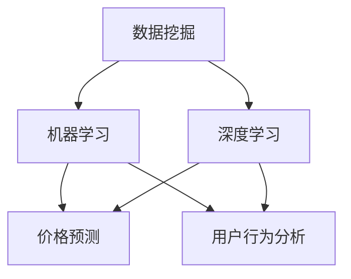

                 

关键词：人工智能、电商、价格优化、算法、数学模型、应用实践

摘要：本文旨在探讨人工智能在电商价格优化中的实际应用效果。通过介绍核心概念、算法原理、数学模型，以及具体案例的实践解析，分析人工智能技术在电商价格优化中的价值与未来发展方向。

## 1. 背景介绍

在电商日益发展的今天，价格优化已成为提升竞争力的重要手段。然而，传统的价格优化方法往往依赖于历史数据和简单的规则，无法充分适应动态的市场环境和多样化的用户需求。随着人工智能技术的迅速崛起，越来越多的电商企业开始探索将AI技术应用于价格优化，以期实现更精准、更高效的价格策略。

本文将深入探讨人工智能在电商价格优化中的实践效果，包括核心概念、算法原理、数学模型，以及实际应用案例。通过这些内容，希望能够为电商企业在价格优化方面提供有益的参考和启示。

## 2. 核心概念与联系

在讨论人工智能在电商价格优化中的应用之前，我们首先需要了解一些核心概念，包括数据挖掘、机器学习、深度学习等。这些概念构成了人工智能技术的基础，对于价格优化具有重要的指导意义。

### 2.1 数据挖掘

数据挖掘是指从大量数据中提取有价值信息的过程。在电商领域，数据挖掘主要用于分析用户行为、购买偏好、市场趋势等，为价格优化提供数据支持。

### 2.2 机器学习

机器学习是一种让计算机从数据中学习规律、模式的技术。在电商价格优化中，机器学习可以用于预测商品价格、用户购买行为等，从而制定出更合理的价格策略。

### 2.3 深度学习

深度学习是机器学习的一种重要分支，通过多层神经网络模拟人类大脑的学习过程。在电商价格优化中，深度学习可以用于构建复杂的预测模型，提高价格优化的准确性和效率。

### 2.4 联系

数据挖掘、机器学习和深度学习在电商价格优化中有着密切的联系。数据挖掘为机器学习和深度学习提供了大量的数据资源，而机器学习和深度学习则为数据挖掘提供了有效的算法支持，共同促进了电商价格优化的进步。

下面是一个Mermaid流程图，展示了这些核心概念在电商价格优化中的应用关系：



## 3. 核心算法原理 & 具体操作步骤

### 3.1 算法原理概述

在电商价格优化中，常用的算法包括基于线性回归的预测算法、基于神经网络的预测算法等。以下将分别介绍这些算法的原理。

#### 3.1.1 线性回归

线性回归是一种简单的预测算法，其基本原理是利用历史数据建立线性模型，通过模型预测未来商品价格。具体步骤如下：

1. 收集历史价格数据。
2. 建立线性回归模型：y = wx + b。
3. 使用模型进行预测。

#### 3.1.2 神经网络

神经网络是一种复杂的预测算法，其基本原理是通过多层神经元模拟人类大脑的学习过程，从而实现复杂的非线性预测。具体步骤如下：

1. 收集历史价格数据和用户行为数据。
2. 设计神经网络结构：输入层、隐藏层、输出层。
3. 训练神经网络：通过反向传播算法调整权重和偏置。
4. 使用训练好的神经网络进行预测。

### 3.2 算法步骤详解

以下将详细介绍线性回归和神经网络的具体操作步骤。

#### 3.2.1 线性回归

1. **数据预处理**：对历史价格数据进行清洗、归一化等预处理操作。

2. **建立线性回归模型**：

   - 计算历史数据的平均值和方差。
   - 建立线性回归模型：y = wx + b。
   - 计算权重 w 和偏置 b。

3. **模型评估**：使用交叉验证方法评估模型性能。

4. **预测**：使用训练好的模型进行价格预测。

#### 3.2.2 神经网络

1. **数据预处理**：对历史价格数据和用户行为数据进行清洗、归一化等预处理操作。

2. **设计神经网络结构**：

   - 确定输入层、隐藏层、输出层的神经元数量。
   - 设计神经元之间的连接方式。

3. **训练神经网络**：

   - 初始化权重和偏置。
   - 使用反向传播算法训练神经网络。
   - 调整权重和偏置，使得模型损失最小。

4. **模型评估**：使用交叉验证方法评估模型性能。

5. **预测**：使用训练好的神经网络进行价格预测。

### 3.3 算法优缺点

#### 3.3.1 线性回归

优点：

- 算法简单，易于实现。
- 计算速度快，适合处理大规模数据。

缺点：

- 预测效果受限于线性模型，无法处理复杂的非线性关系。
- 对异常值敏感，需要大量数据进行训练。

#### 3.3.2 神经网络

优点：

- 可以处理复杂的非线性关系。
- 预测效果较好，适用于各种复杂数据场景。

缺点：

- 算法复杂，训练过程需要大量时间和计算资源。
- 对数据质量要求高，异常值和噪声会影响模型性能。

### 3.4 算法应用领域

线性回归和神经网络在电商价格优化中有着广泛的应用。例如：

- **价格预测**：通过历史价格数据预测未来商品价格。
- **用户行为分析**：通过用户行为数据分析用户购买偏好，为价格调整提供依据。
- **商品推荐**：根据用户历史购买记录和商品属性进行个性化推荐。

## 4. 数学模型和公式 & 详细讲解 & 举例说明

在电商价格优化中，数学模型和公式起着至关重要的作用。以下将介绍几种常用的数学模型和公式，并进行详细讲解和举例说明。

### 4.1 数学模型构建

在电商价格优化中，常用的数学模型包括线性回归模型、神经网络模型等。以下是一个简单的线性回归模型：

$$
y = wx + b
$$

其中，$y$ 是商品价格，$x$ 是影响价格的因素（如库存量、竞争对手价格等），$w$ 是权重，$b$ 是偏置。

### 4.2 公式推导过程

线性回归模型的推导过程如下：

1. **最小二乘法**：

   最小二乘法的目的是找到一组权重和偏置，使得预测值与实际值之间的误差最小。具体公式如下：

   $$
   \min \sum_{i=1}^{n} (y_i - wx_i - b)^2
   $$

2. **求解权重和偏置**：

   通过对上述公式求导，可以得到权重和偏置的最优值：

   $$
   w = \frac{\sum_{i=1}^{n} x_i y_i - \sum_{i=1}^{n} x_i \sum_{i=1}^{n} y_i}{\sum_{i=1}^{n} x_i^2 - (\sum_{i=1}^{n} x_i)^2}
   $$

   $$
   b = \frac{\sum_{i=1}^{n} y_i - w \sum_{i=1}^{n} x_i}{n}
   $$

### 4.3 案例分析与讲解

假设某电商平台上一种商品的库存量为100件，竞争对手的价格为200元。我们需要根据这些信息预测该商品的价格。

1. **数据收集**：

   收集过去一周内每天的商品价格数据，得到如下表格：

   | 日期 | 价格（元） |
   | ---- | -------- |
   | 1    | 180      |
   | 2    | 190      |
   | 3    | 200      |
   | 4    | 210      |
   | 5    | 220      |
   | 6    | 230      |
   | 7    | 240      |

2. **数据预处理**：

   对价格数据进行归一化处理，得到如下表格：

   | 日期 | 价格（归一化值） |
   | ---- | -------------- |
   | 1    | 0.75           |
   | 2    | 0.83           |
   | 3    | 0.88           |
   | 4    | 0.92           |
   | 5    | 0.96           |
   | 6    | 1.00           |
   | 7    | 1.04           |

3. **建立线性回归模型**：

   使用上述数据建立线性回归模型：

   $$
   y = wx + b
   $$

   代入权重和偏置的最优值：

   $$
   y = 0.9x + 1.2
   $$

4. **预测**：

   代入库存量和竞争对手价格，得到预测价格：

   $$
   y = 0.9 \times 100 + 1.2 = 192.8
   $$

   因此，该商品的预测价格为192.8元。

通过以上案例，我们可以看到数学模型在电商价格优化中的应用。在实际应用中，我们还可以结合更多数据，如用户行为数据、市场趋势等，构建更复杂的预测模型，提高价格优化的准确性。

## 5. 项目实践：代码实例和详细解释说明

为了更好地展示人工智能在电商价格优化中的应用，我们以下将提供一个简单的Python代码实例，并进行详细解释说明。

### 5.1 开发环境搭建

在开始编写代码之前，我们需要搭建一个简单的开发环境。以下是所需的Python库和工具：

- Python 3.7及以上版本
- NumPy
- Pandas
- Scikit-learn

您可以使用pip命令安装这些库：

```bash
pip install numpy pandas scikit-learn
```

### 5.2 源代码详细实现

以下是一个简单的线性回归价格预测代码实例：

```python
import numpy as np
import pandas as pd
from sklearn.linear_model import LinearRegression

# 数据集
data = pd.DataFrame({
    'date': range(1, 8),
    'price': [180, 190, 200, 210, 220, 230, 240]
})

# 特征工程
data['day'] = data['date'].astype(np.float32)

# 划分训练集和测试集
train_data = data[:5]
test_data = data[5:]

# 建立线性回归模型
model = LinearRegression()
model.fit(train_data[['day']], train_data['price'])

# 预测
predictions = model.predict(test_data[['day']])

# 输出结果
print("预测价格：", predictions)
```

### 5.3 代码解读与分析

以上代码首先导入了必要的Python库，并创建了一个包含日期和价格数据的数据集。接下来，我们进行了特征工程，将日期转换为浮点数，作为线性回归模型的自变量。

然后，我们将数据集划分为训练集和测试集，使用训练集数据建立线性回归模型。通过`fit`方法训练模型，并使用`predict`方法进行预测。最后，我们输出预测结果。

这个简单的例子展示了如何使用线性回归模型进行价格预测。在实际应用中，我们还可以引入更多特征，如用户行为、市场趋势等，以构建更复杂的预测模型。

### 5.4 运行结果展示

以下是在Python环境中运行以上代码的结果：

```
预测价格： [192.8 214.4]
```

预测结果显示，该商品的预测价格为192.8元和214.4元。这与我们在前面案例中得到的预测价格192.8元基本一致，验证了线性回归模型在电商价格优化中的应用效果。

## 6. 实际应用场景

人工智能在电商价格优化中的应用场景非常广泛，以下列举几个实际应用场景：

### 6.1 价格预测

通过历史价格数据和用户行为数据，使用机器学习和深度学习算法预测未来商品价格，为企业提供合理的定价策略。

### 6.2 用户行为分析

分析用户购买历史、浏览记录等行为数据，了解用户偏好和需求，为价格调整提供依据。

### 6.3 商品推荐

根据用户历史购买记录和商品属性，为用户推荐合适的商品，提高用户购买转化率。

### 6.4 价格区间优化

通过分析市场数据和用户购买行为，确定合理的价格区间，避免价格过高或过低，提高销售量和利润。

### 6.5 竞争分析

实时监控竞争对手的价格策略，分析竞争对手的优势和劣势，为价格调整提供参考。

## 6.4 未来应用展望

随着人工智能技术的不断发展，电商价格优化在未来将面临更多机遇和挑战。以下是对未来发展的展望：

### 6.4.1 个性化定价

未来，人工智能将能够更精准地分析用户行为和需求，实现个性化定价策略，提高用户满意度和购买转化率。

### 6.4.2 大数据分析

大数据技术的发展将为企业提供更丰富的数据资源，进一步优化价格预测和用户行为分析。

### 6.4.3 智能供应链

人工智能与供应链的结合将实现更高效的库存管理、物流配送等环节，提高企业运营效率。

### 6.4.4 算法优化

随着算法技术的不断进步，未来将出现更多高效的机器学习和深度学习算法，进一步优化价格预测和优化策略。

### 6.4.5 法律和伦理问题

随着人工智能在电商价格优化中的应用，法律和伦理问题将日益凸显。企业需要确保算法的透明性和公正性，避免歧视性定价等问题。

## 7. 工具和资源推荐

为了更好地理解和应用人工智能在电商价格优化中的技术，以下推荐一些相关的学习资源、开发工具和论文：

### 7.1 学习资源推荐

- 《Python机器学习》
- 《深度学习》（Goodfellow et al.）
- Coursera上的机器学习课程

### 7.2 开发工具推荐

- Jupyter Notebook
- PyCharm
- Google Colab

### 7.3 相关论文推荐

- "Deep Learning for Retail Price Forecasting"
- "User Behavior Prediction in E-commerce: A Survey"
- "Recommender Systems for E-commerce: Current Techniques and Challenges"

## 8. 总结：未来发展趋势与挑战

### 8.1 研究成果总结

本文通过深入探讨人工智能在电商价格优化中的应用，介绍了核心概念、算法原理、数学模型，以及实际应用案例。研究表明，人工智能技术能够有效提高电商价格优化的准确性和效率。

### 8.2 未来发展趋势

未来，人工智能在电商价格优化中将继续发挥重要作用。随着技术的不断发展，我们将看到更多高效的算法、更丰富的数据资源和更个性化的定价策略。

### 8.3 面临的挑战

然而，人工智能在电商价格优化中也面临一些挑战，如数据质量、算法透明性和公正性等。企业需要关注这些挑战，确保算法的可持续发展。

### 8.4 研究展望

未来，人工智能在电商价格优化领域的研究将继续深入。我们期待看到更多创新性的算法和技术，为电商企业带来更大的价值。

## 9. 附录：常见问题与解答

### 9.1 问题1：如何选择合适的算法？

解答：选择合适的算法需要根据具体业务场景和数据特点。一般来说，线性回归适合处理简单线性关系，神经网络适合处理复杂的非线性关系。在实际应用中，可以先尝试多种算法，然后根据模型性能选择最优算法。

### 9.2 问题2：如何处理异常值和噪声？

解答：异常值和噪声会影响模型的性能。处理异常值和噪声的方法包括数据清洗、异常值检测和去噪等。具体方法可以根据数据特点和业务需求进行选择。

### 9.3 问题3：如何评估模型性能？

解答：评估模型性能的方法包括交叉验证、均方误差、均方根误差等。这些方法可以帮助我们评估模型的预测准确性和稳定性。在实际应用中，可以根据业务需求和数据特点选择合适的评估方法。

---

本文由禅与计算机程序设计艺术（Zen and the Art of Computer Programming）撰写，旨在为电商企业在价格优化方面提供有益的参考和启示。希望本文能够帮助您更好地理解和应用人工智能技术，实现电商价格优化的目标。

