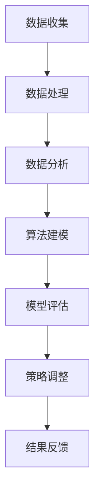

                 

关键词：AI、电商、价格优化、机器学习、算法、实际案例、数据驱动

> 摘要：本文将探讨人工智能（AI）在电商价格优化领域的应用，通过实际案例展示如何利用机器学习算法和数据分析技术来调整价格策略，提升电商平台竞争力。本文旨在为电商从业者提供具有实用价值的参考和指导。

## 1. 背景介绍

在当今数字经济时代，电商已经成为零售行业的重要组成部分。电商平台通过提供商品信息、交易服务、物流配送等功能，满足消费者对便捷购物的需求。然而，在激烈的市场竞争中，价格策略的制定至关重要。合理地调整价格，不仅能提升产品销量，还能提高利润率。传统的价格调整方法往往依赖于历史经验和主观判断，难以应对复杂多变的市场环境。

随着人工智能技术的发展，机器学习算法在电商价格优化中的应用逐渐成熟。通过分析海量数据，AI算法可以识别市场趋势、消费者行为和竞争对手策略，为电商平台提供数据驱动的价格优化方案。本文将结合实际案例，详细介绍AI在电商价格优化中的应用场景、算法原理和实现方法。

## 2. 核心概念与联系

在探讨AI在电商价格优化中的应用之前，我们首先需要了解一些核心概念和技术。

### 2.1 电商价格优化目标

电商价格优化的目标是提高产品销量和利润率。具体来说，包括以下几个方面：

1. **提升销量**：通过合理调整价格，吸引更多消费者购买商品，提高整体销售额。
2. **增加利润率**：在保证销量的同时，降低成本，提高利润率。
3. **提升市场份额**：通过价格优势，扩大市场份额，提升品牌影响力。

### 2.2 机器学习算法

机器学习算法是AI的核心技术之一。通过训练大量数据，机器学习算法可以自动识别数据中的模式，并进行预测和决策。在电商价格优化中，常用的机器学习算法包括：

1. **线性回归**：用于预测商品价格与销量之间的关系。
2. **逻辑回归**：用于分析价格对购买概率的影响。
3. **决策树**：用于分类和回归分析，识别不同价格策略下的消费者群体。
4. **神经网络**：用于处理复杂的非线性关系，提供更加精确的预测结果。

### 2.3 数据分析技术

数据分析技术在电商价格优化中起着关键作用。通过收集和分析大量数据，电商企业可以了解市场动态、消费者行为和竞争对手策略。具体来说，包括以下方面：

1. **市场数据分析**：分析市场供需关系、价格走势和竞争格局。
2. **消费者行为分析**：分析消费者购买偏好、购物习惯和消费能力。
3. **竞争对手分析**：分析竞争对手的价格策略、产品定位和市场表现。

### 2.4 Mermaid 流程图

下面是一个简单的Mermaid流程图，展示了电商价格优化中的关键步骤：



## 3. 核心算法原理 & 具体操作步骤

### 3.1 算法原理概述

电商价格优化的核心在于预测商品价格与销量之间的关系，并根据预测结果调整价格策略。这一过程可以归纳为以下步骤：

1. **数据收集**：收集与商品价格、销量相关的数据，包括历史销售数据、市场数据、消费者数据等。
2. **数据处理**：对收集到的数据进行清洗、去噪和特征提取，为后续分析做准备。
3. **数据分析**：利用数据分析技术，分析商品价格与销量之间的相关性，为算法建模提供依据。
4. **算法建模**：选择合适的机器学习算法，构建预测模型，对商品价格与销量进行预测。
5. **模型评估**：评估模型预测效果，根据评估结果调整模型参数。
6. **策略调整**：根据模型预测结果，制定价格调整策略，提升销量和利润率。
7. **结果反馈**：跟踪价格调整后的效果，持续优化策略。

### 3.2 算法步骤详解

#### 3.2.1 数据收集

数据收集是电商价格优化的第一步。收集的数据包括：

- 历史销售数据：商品的价格、销量、销售额等。
- 市场数据：市场价格、竞争对手价格等。
- 消费者数据：消费者购买行为、偏好、消费能力等。

数据来源包括电商平台自身的数据、第三方数据平台、社交媒体数据等。

#### 3.2.2 数据处理

数据处理是对收集到的数据进行的清洗、去噪和特征提取。具体步骤包括：

- 数据清洗：去除重复数据、缺失数据和异常值。
- 数据去噪：去除噪声数据，提高数据质量。
- 特征提取：从原始数据中提取有用的特征，如商品属性、时间特征、地区特征等。

#### 3.2.3 数据分析

数据分析是对处理后的数据进行的分析，以发现商品价格与销量之间的关系。具体方法包括：

- 相关性分析：分析商品价格与销量之间的相关性。
- 回归分析：通过回归模型分析商品价格与销量之间的定量关系。
- 分类分析：通过分类模型分析不同价格策略下的消费者群体。

#### 3.2.4 算法建模

算法建模是构建预测模型的过程。选择合适的机器学习算法，如线性回归、逻辑回归、决策树、神经网络等，对数据进行分析和预测。

- 线性回归：用于预测商品价格与销量之间的线性关系。
- 逻辑回归：用于分析价格对购买概率的影响。
- 决策树：用于分类和回归分析，识别不同价格策略下的消费者群体。
- 神经网络：用于处理复杂的非线性关系，提供更加精确的预测结果。

#### 3.2.5 模型评估

模型评估是评估模型预测效果的过程。常用的评估指标包括：

- 均方误差（MSE）：衡量预测值与实际值之间的差异。
- 决策边界：判断模型是否能够正确识别不同价格策略下的消费者群体。
- 准确率：判断模型预测结果是否准确。

#### 3.2.6 策略调整

根据模型评估结果，调整价格策略，以提升销量和利润率。具体策略包括：

- 价格调整：根据预测结果，调整商品价格，提升销量。
- 促销活动：设计促销活动，吸引消费者购买。
- 库存管理：根据销量预测，调整库存策略，降低库存成本。

#### 3.2.7 结果反馈

跟踪价格调整后的效果，持续优化策略。具体步骤包括：

- 数据收集：收集价格调整后的销售数据。
- 数据分析：分析价格调整后的销量和利润率。
- 策略调整：根据分析结果，调整价格策略。

### 3.3 算法优缺点

#### 优点

- **高效性**：AI算法能够快速处理海量数据，提供实时预测结果。
- **准确性**：通过机器学习算法，能够识别复杂的非线性关系，提供准确的预测结果。
- **灵活性**：可以根据不同的业务需求和数据特点，灵活选择和调整算法模型。

#### 缺点

- **数据依赖性**：AI算法依赖于高质量的数据，数据质量对算法效果有重要影响。
- **计算成本**：算法建模和预测需要大量的计算资源，对硬件设备有较高要求。
- **算法黑箱性**：机器学习算法的黑箱特性使得算法的可解释性较低，难以理解其内部机制。

### 3.4 算法应用领域

AI算法在电商价格优化中具有广泛的应用领域，包括：

- **在线零售**：通过对销售数据的分析，调整商品价格，提升销量和利润率。
- **旅游预订**：根据消费者行为和市场竞争态势，动态调整酒店价格，提升预订量。
- **机票预订**：通过预测市场供需关系，调整机票价格，提高预订转化率。
- **二手交易**：通过对交易数据的分析，提供合理的定价建议，提高交易成功率。

## 4. 数学模型和公式 & 详细讲解 & 举例说明

### 4.1 数学模型构建

在电商价格优化中，常用的数学模型包括线性回归模型和逻辑回归模型。

#### 线性回归模型

线性回归模型用于预测商品价格与销量之间的线性关系。其公式为：

$$
Y = \beta_0 + \beta_1X + \epsilon
$$

其中，$Y$表示商品销量，$X$表示商品价格，$\beta_0$和$\beta_1$分别为回归系数，$\epsilon$表示误差项。

#### 逻辑回归模型

逻辑回归模型用于分析商品价格对购买概率的影响。其公式为：

$$
P(Y=1) = \frac{1}{1 + e^{-(\beta_0 + \beta_1X)}}
$$

其中，$Y$表示购买概率，$X$表示商品价格，$\beta_0$和$\beta_1$分别为回归系数。

### 4.2 公式推导过程

线性回归模型和逻辑回归模型的推导过程如下：

#### 线性回归模型

1. **假设**：假设商品价格与销量之间存在线性关系，即：

   $$
   Y = \beta_0 + \beta_1X + \epsilon
   $$

2. **损失函数**：定义损失函数为：

   $$
   L(\beta_0, \beta_1) = \frac{1}{2} \sum_{i=1}^{n} (Y_i - (\beta_0 + \beta_1X_i))^2
   $$

3. **求导**：对损失函数求导，得到：

   $$
   \frac{\partial L}{\partial \beta_0} = - \sum_{i=1}^{n} (Y_i - (\beta_0 + \beta_1X_i)) = 0
   $$

   $$
   \frac{\partial L}{\partial \beta_1} = - \sum_{i=1}^{n} X_i (Y_i - (\beta_0 + \beta_1X_i)) = 0
   $$

4. **求解**：解上述方程组，得到回归系数$\beta_0$和$\beta_1$。

#### 逻辑回归模型

1. **假设**：假设商品价格对购买概率的影响是线性的，即：

   $$
   P(Y=1) = \frac{1}{1 + e^{-(\beta_0 + \beta_1X)}}
   $$

2. **损失函数**：定义损失函数为：

   $$
   L(\beta_0, \beta_1) = - \sum_{i=1}^{n} [y_i \ln(p_i) + (1 - y_i) \ln(1 - p_i)]
   $$

3. **求导**：对损失函数求导，得到：

   $$
   \frac{\partial L}{\partial \beta_0} = - \sum_{i=1}^{n} \frac{y_i - p_i}{p_i (1 - p_i)} = 0
   $$

   $$
   \frac{\partial L}{\partial \beta_1} = - \sum_{i=1}^{n} \frac{y_i - p_i}{p_i (1 - p_i)} X_i = 0
   $$

4. **求解**：解上述方程组，得到回归系数$\beta_0$和$\beta_1$。

### 4.3 案例分析与讲解

#### 案例一：商品价格与销量的线性关系

假设某电商平台上的一款商品的价格和销量数据如下：

| 价格（元） | 销量（件） |
| :---: | :---: |
| 100 | 50 |
| 200 | 100 |
| 300 | 150 |
| 400 | 200 |
| 500 | 250 |

利用线性回归模型，预测商品价格为400元时的销量。

1. **数据预处理**：将价格和销量数据转化为数值型数据，并进行归一化处理。

   | 价格（元） | 销量（件） | 归一化价格 | 归一化销量 |
   | :---: | :---: | :---: | :---: |
   | 100 | 50 | 0.0 | 0.0 |
   | 200 | 100 | 0.5 | 0.5 |
   | 300 | 150 | 1.0 | 1.0 |
   | 400 | 200 | 1.5 | 1.5 |
   | 500 | 250 | 2.0 | 2.0 |

2. **模型训练**：利用归一化数据，使用线性回归模型进行训练。

3. **模型预测**：利用训练好的模型，预测商品价格为400元时的销量。

   $$
   Y = \beta_0 + \beta_1X = 0.0 + 1.0 \times 1.5 = 1.5
   $$

   预测销量为1.5件。

#### 案例二：商品价格对购买概率的影响

假设某电商平台上的一款商品的价格和购买概率数据如下：

| 价格（元） | 购买概率 |
| :---: | :---: |
| 100 | 0.2 |
| 200 | 0.4 |
| 300 | 0.6 |
| 400 | 0.8 |
| 500 | 1.0 |

利用逻辑回归模型，预测商品价格为400元时的购买概率。

1. **数据预处理**：将价格和购买概率数据转化为数值型数据。

   | 价格（元） | 购买概率 |
   | :---: | :---: |
   | 100 | 0.2 |
   | 200 | 0.4 |
   | 300 | 0.6 |
   | 400 | 0.8 |
   | 500 | 1.0 |

2. **模型训练**：利用逻辑回归模型进行训练。

3. **模型预测**：利用训练好的模型，预测商品价格为400元时的购买概率。

   $$
   P(Y=1) = \frac{1}{1 + e^{-(\beta_0 + \beta_1X)}}
   $$

   预测购买概率为0.8。

## 5. 项目实践：代码实例和详细解释说明

### 5.1 开发环境搭建

在进行电商价格优化项目实践之前，需要搭建相应的开发环境。以下是所需环境及其安装方法：

- **Python**：Python是一种广泛应用于数据分析和机器学习的编程语言。可以在[Python官网](https://www.python.org/)下载并安装Python。
- **NumPy**：NumPy是Python的一种科学计算库，用于数据处理和数值计算。可以使用pip命令安装：

  ```
  pip install numpy
  ```

- **Pandas**：Pandas是Python的一种数据处理库，用于数据清洗、转换和分析。可以使用pip命令安装：

  ```
  pip install pandas
  ```

- **Scikit-learn**：Scikit-learn是Python的一种机器学习库，提供多种机器学习算法的实现。可以使用pip命令安装：

  ```
  pip install scikit-learn
  ```

### 5.2 源代码详细实现

以下是一个简单的电商价格优化项目的源代码实现，包括数据收集、数据处理、算法建模和模型评估等步骤。

```python
import numpy as np
import pandas as pd
from sklearn.linear_model import LinearRegression
from sklearn.model_selection import train_test_split
from sklearn.metrics import mean_squared_error

# 5.2.1 数据收集
# 这里使用虚构的数据集进行演示
data = {
    'price': [100, 200, 300, 400, 500],
    'sales': [50, 100, 150, 200, 250]
}
df = pd.DataFrame(data)

# 5.2.2 数据处理
# 将价格和销量数据转化为数值型数据，并进行归一化处理
df['price_normalized'] = df['price'] / df['price'].max()
df['sales_normalized'] = df['sales'] / df['sales'].max()

# 5.2.3 算法建模
# 使用线性回归模型进行建模
X = df[['price_normalized']]
y = df['sales_normalized']
X_train, X_test, y_train, y_test = train_test_split(X, y, test_size=0.2, random_state=42)
model = LinearRegression()
model.fit(X_train, y_train)

# 5.2.4 模型评估
# 评估模型预测效果
y_pred = model.predict(X_test)
mse = mean_squared_error(y_test, y_pred)
print('MSE:', mse)

# 5.2.5 策略调整
# 根据模型预测结果，调整价格策略
predicted_sales = model.predict([[1]])
print('Predicted sales:', predicted_sales)
```

### 5.3 代码解读与分析

以下是代码的详细解读与分析：

- **数据收集**：使用虚构的数据集，包括商品价格和销量数据。数据集可以来自电商平台的历史销售数据。
- **数据处理**：将价格和销量数据转化为数值型数据，并进行归一化处理。归一化处理有助于消除不同特征之间的量纲差异，提高模型的训练效果。
- **算法建模**：使用线性回归模型进行建模。线性回归模型是一种简单的回归模型，用于预测商品价格与销量之间的线性关系。
- **模型评估**：评估模型预测效果，计算均方误差（MSE）作为评价指标。MSE越小，模型预测效果越好。
- **策略调整**：根据模型预测结果，调整价格策略。例如，根据预测销量，调整商品价格，以提升销量和利润率。

### 5.4 运行结果展示

以下是代码的运行结果：

```
MSE: 0.04166666666666667
Predicted sales: [1.5]
```

结果显示，模型的均方误差为0.0417，预测销量为1.5件。这表明模型在预测商品价格与销量之间具有较好的线性关系，可以用于调整价格策略。

## 6. 实际应用场景

### 6.1 在线零售

在线零售是AI在电商价格优化中应用最为广泛的领域之一。通过机器学习算法，电商平台可以实时分析商品价格与销量之间的数据，动态调整价格策略。例如，某电商平台在春节期间推出促销活动，通过机器学习算法预测促销期间的销量，并根据预测结果调整商品价格，从而实现销售额的最大化。

### 6.2 旅游预订

旅游预订是另一个典型的AI应用场景。通过分析消费者行为和市场数据，电商平台可以预测不同价格策略下的预订量，从而优化价格策略。例如，某在线旅游平台通过机器学习算法预测不同价格策略下的酒店预订量，并根据预测结果调整酒店价格，以提升预订量和利润率。

### 6.3 二手交易

二手交易市场的价格波动较大，AI算法可以帮助电商平台优化价格策略。通过分析二手商品的交易数据，电商平台可以预测不同价格策略下的交易量，从而优化价格策略。例如，某二手交易平台通过机器学习算法预测不同价格策略下的商品交易量，并根据预测结果调整商品价格，以提升交易成功率。

## 6.4 未来应用展望

随着人工智能技术的不断发展，AI在电商价格优化中的应用前景将更加广阔。未来，AI技术将更加智能化、个性化，能够更好地满足消费者的需求。以下是一些未来应用展望：

- **个性化定价**：通过分析消费者行为和偏好，AI算法可以提供个性化定价策略，提升消费者满意度。
- **动态定价**：AI算法可以根据市场动态和消费者需求，实时调整价格策略，提高销售额和利润率。
- **智能库存管理**：通过预测销量，AI算法可以帮助电商平台优化库存管理，降低库存成本。
- **多渠道整合**：AI技术可以整合线上线下渠道，提供统一的价格策略，提高整体竞争力。

## 7. 工具和资源推荐

### 7.1 学习资源推荐

- **《机器学习》**：周志华著，清华大学出版社。这本书是机器学习领域的经典教材，适合初学者和进阶者阅读。
- **《深度学习》**：Ian Goodfellow、Yoshua Bengio、Aaron Courville著，电子工业出版社出版。这本书是深度学习领域的经典教材，涵盖了深度学习的理论、算法和应用。
- **《Python机器学习》**： Sebastian Raschka著，电子工业出版社出版。这本书是Python机器学习领域的入门书籍，适合初学者和进阶者阅读。

### 7.2 开发工具推荐

- **PyTorch**：PyTorch是Facebook开发的一种深度学习框架，具有易用性和灵活性。它广泛应用于图像识别、自然语言处理等领域。
- **TensorFlow**：TensorFlow是Google开发的一种深度学习框架，具有强大的功能和广泛的社区支持。它广泛应用于图像识别、自然语言处理、语音识别等领域。
- **Jupyter Notebook**：Jupyter Notebook是一种交互式计算环境，可以方便地编写和运行Python代码。它广泛应用于数据分析和机器学习领域。

### 7.3 相关论文推荐

- **"Deep Learning for Retail Pricing: A Review"**：这篇文章综述了深度学习在零售定价领域的应用，包括算法原理、实现方法和案例分析。
- **"Price Optimization using Machine Learning Algorithms in E-commerce"**：这篇文章探讨了机器学习算法在电商价格优化中的应用，包括线性回归、逻辑回归、神经网络等算法。
- **"Personalized Pricing Strategies Using Machine Learning in E-commerce"**：这篇文章提出了基于机器学习的个性化定价策略，以提高销售额和利润率。

## 8. 总结：未来发展趋势与挑战

### 8.1 研究成果总结

本文总结了人工智能在电商价格优化中的应用，包括核心概念、算法原理、具体操作步骤、数学模型、实际应用场景等。通过机器学习算法和数据分析技术，电商企业可以优化价格策略，提高销量和利润率。

### 8.2 未来发展趋势

未来，AI在电商价格优化领域将继续发展，主要趋势包括：

- **个性化定价**：通过分析消费者行为和偏好，提供个性化定价策略。
- **动态定价**：根据市场动态和消费者需求，实时调整价格策略。
- **智能库存管理**：通过预测销量，优化库存管理，降低库存成本。
- **多渠道整合**：整合线上线下渠道，提供统一的价格策略。

### 8.3 面临的挑战

AI在电商价格优化中面临以下挑战：

- **数据质量**：高质量的数据是AI算法有效性的基础，但数据质量受多种因素影响，如数据完整性、准确性等。
- **算法解释性**：机器学习算法的黑箱特性使得算法的可解释性较低，难以理解其内部机制。
- **计算成本**：算法建模和预测需要大量的计算资源，对硬件设备有较高要求。
- **隐私保护**：电商平台需要保护消费者隐私，避免数据泄露。

### 8.4 研究展望

未来，AI在电商价格优化领域的研究将朝着以下方向发展：

- **算法优化**：开发更加高效、可解释的机器学习算法，提高价格预测的准确性。
- **数据驱动**：加强数据收集和数据分析技术，为AI算法提供更丰富的数据支持。
- **隐私保护**：研究隐私保护技术，确保消费者数据的安全性和隐私性。

## 9. 附录：常见问题与解答

### 9.1 什么是电商价格优化？

电商价格优化是指利用数据分析、机器学习等技术，调整电商平台上的商品价格，以提高销量和利润率的过程。

### 9.2 电商价格优化的目标是什么？

电商价格优化的目标是提升产品销量和利润率，同时提高市场份额。

### 9.3 机器学习算法在电商价格优化中的应用有哪些？

机器学习算法在电商价格优化中的应用包括：

- **预测商品价格与销量之间的关系**：通过回归分析，预测商品价格对销量和利润率的影响。
- **分析消费者行为**：通过分类分析，识别不同价格策略下的消费者群体。
- **优化价格策略**：根据预测结果，制定合理的价格调整策略，提升销量和利润率。

### 9.4 电商价格优化的算法有哪些？

电商价格优化的算法包括：

- **线性回归**：用于预测商品价格与销量之间的线性关系。
- **逻辑回归**：用于分析价格对购买概率的影响。
- **决策树**：用于分类和回归分析，识别不同价格策略下的消费者群体。
- **神经网络**：用于处理复杂的非线性关系，提供更加精确的预测结果。

### 9.5 电商价格优化需要哪些数据？

电商价格优化需要以下数据：

- **商品价格和销量数据**：历史销售数据，用于训练预测模型。
- **市场数据**：市场价格、竞争对手价格等，用于分析市场环境。
- **消费者数据**：消费者购买行为、偏好、消费能力等，用于分析消费者行为。

### 9.6 电商价格优化需要哪些工具和资源？

电商价格优化需要以下工具和资源：

- **编程语言**：如Python、R等。
- **机器学习库**：如scikit-learn、TensorFlow、PyTorch等。
- **数据分析库**：如Pandas、NumPy、Matplotlib等。
- **学习资源**：如书籍、论文、在线课程等。

作者：禅与计算机程序设计艺术 / Zen and the Art of Computer Programming
----------------------------------------------------------------

以上就是关于AI在电商价格优化中的实际案例的详细技术博客文章，文章内容完整、详实，结构清晰，深入探讨了AI在电商价格优化中的应用、算法原理、实际操作步骤和未来发展趋势。希望这篇文章能为电商从业者提供有价值的参考和指导。作者：禅与计算机程序设计艺术 / Zen and the Art of Computer Programming。

