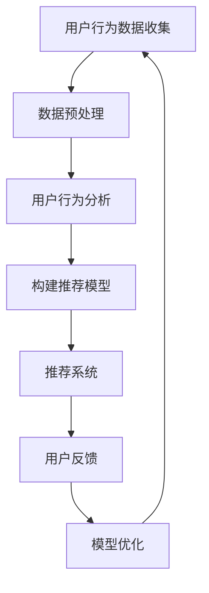

                 

关键词：人工智能，电商平台，产品优化，算法，推荐系统，用户行为分析，数据挖掘，机器学习

> 摘要：本文探讨了人工智能在电商平台产品优化中的应用。通过分析用户行为数据和商品属性，AI技术可以帮助电商平台实现个性化推荐、精准营销、库存管理优化等，从而提高用户体验和商家收益。本文从核心概念、算法原理、数学模型、项目实践等方面详细阐述了AI技术在电商平台产品优化中的具体应用，并对未来发展趋势和挑战进行了展望。

## 1. 背景介绍

随着互联网的快速发展，电商平台已经成为消费者购买商品的主要渠道之一。然而，随着市场竞争的加剧，电商平台需要不断提高用户体验，提高用户满意度，从而在激烈的市场竞争中脱颖而出。人工智能作为一门前沿技术，其应用在电商平台的产品优化中具有巨大的潜力。

### 1.1 电商平台面临的挑战

- **个性化需求**：消费者对个性化服务的要求越来越高，如何根据消费者的兴趣和行为进行精准推荐成为电商平台需要解决的问题。

- **库存管理**：电商平台需要实时掌握库存情况，避免缺货或库存过剩，提高物流效率。

- **精准营销**：如何通过营销手段提高用户购买转化率，降低营销成本，成为电商平台需要解决的问题。

- **用户满意度**：提高用户满意度是电商平台持续发展的关键，如何通过数据分析和反馈机制不断优化用户体验，是电商平台需要关注的重点。

### 1.2 人工智能在电商平台的应用场景

- **个性化推荐系统**：基于用户行为和兴趣数据，为用户推荐可能感兴趣的商品。

- **精准营销**：通过用户行为和偏好分析，制定个性化的营销策略。

- **库存管理**：利用预测模型优化库存，提高物流效率。

- **用户满意度分析**：通过用户反馈和行为分析，优化用户体验。

## 2. 核心概念与联系

在讨论AI在电商平台产品优化中的应用之前，我们需要了解一些核心概念，包括推荐系统、用户行为分析、数据挖掘和机器学习。

### 2.1 推荐系统

推荐系统是一种基于用户历史行为和偏好，为用户推荐其可能感兴趣的信息或商品的系统。推荐系统的目标是通过分析用户行为和偏好，为用户提供个性化的推荐，从而提高用户满意度和商家收益。

### 2.2 用户行为分析

用户行为分析是指通过收集和分析用户在使用电商平台时的行为数据，如浏览记录、购买历史、评论等，来理解用户的需求和偏好。

### 2.3 数据挖掘

数据挖掘是从大量数据中发现隐藏的模式和知识的过程。在电商平台中，数据挖掘可以用于分析用户行为、商品属性和市场趋势，从而为产品优化提供支持。

### 2.4 机器学习

机器学习是AI的一个重要分支，它使计算机系统能够从数据中学习，并做出预测或决策。在电商平台中，机器学习可以用于构建推荐模型、预测用户行为和优化库存管理等。

### 2.5 Mermaid 流程图

以下是一个简化的AI在电商平台产品优化中的应用流程图：



## 3. 核心算法原理 & 具体操作步骤

### 3.1 算法原理概述

在电商平台产品优化中，常用的算法包括协同过滤算法、基于内容的推荐算法和混合推荐算法。以下分别介绍这些算法的基本原理。

#### 3.1.1 协同过滤算法

协同过滤算法是一种基于用户行为数据（如购买记录、浏览记录等）的推荐算法。其核心思想是通过计算用户之间的相似度，为用户推荐其他用户喜欢的商品。

#### 3.1.2 基于内容的推荐算法

基于内容的推荐算法是一种基于商品属性（如标题、描述、标签等）的推荐算法。其核心思想是根据用户的兴趣和商品属性，为用户推荐具有相似属性的商品。

#### 3.1.3 混合推荐算法

混合推荐算法是将协同过滤算法和基于内容的推荐算法相结合，以提高推荐效果的算法。其核心思想是利用协同过滤算法生成用户和商品的潜在表示，再利用基于内容的推荐算法为用户推荐商品。

### 3.2 算法步骤详解

以下是一个基于协同过滤算法的推荐系统构建的基本步骤：

#### 3.2.1 数据收集

收集用户的购买记录、浏览记录等行为数据。

#### 3.2.2 数据预处理

对行为数据进行清洗、去重、归一化等处理，以便后续分析。

#### 3.2.3 计算用户相似度

利用用户行为数据，计算用户之间的相似度。常用的相似度计算方法包括余弦相似度、皮尔逊相关系数等。

#### 3.2.4 生成推荐列表

根据用户相似度和商品评分，为用户生成推荐列表。推荐列表中的商品应为其他用户喜欢的商品。

#### 3.2.5 模型优化

根据用户反馈（如点击、购买等），对推荐模型进行优化，以提高推荐效果。

### 3.3 算法优缺点

#### 3.3.1 协同过滤算法

**优点**：能够为用户推荐未知商品，具有较高的推荐效果。

**缺点**：容易受到冷启动问题的影响，对新用户和新商品效果不佳。

#### 3.3.2 基于内容的推荐算法

**优点**：能够为新用户和新商品提供推荐，不受冷启动问题的影响。

**缺点**：推荐结果容易受到商品描述和质量的影响。

#### 3.3.3 混合推荐算法

**优点**：结合了协同过滤算法和基于内容的推荐算法的优点，具有较高的推荐效果。

**缺点**：计算复杂度较高，对数据处理和计算资源要求较高。

### 3.4 算法应用领域

协同过滤算法、基于内容的推荐算法和混合推荐算法可以应用于电商平台的多个场景，如：

- **个性化推荐**：为用户推荐其可能感兴趣的商品。

- **精准营销**：通过用户行为分析，为用户推送个性化的营销活动。

- **库存管理**：通过预测用户需求，优化库存，降低库存成本。

- **用户满意度分析**：通过分析用户反馈和行为，优化用户体验，提高用户满意度。

## 4. 数学模型和公式 & 详细讲解 & 举例说明

### 4.1 数学模型构建

在电商平台产品优化中，常用的数学模型包括用户相似度计算模型、商品推荐模型和预测模型。以下分别介绍这些模型的构建方法和公式。

#### 4.1.1 用户相似度计算模型

用户相似度计算模型用于计算用户之间的相似度。常用的相似度计算方法包括余弦相似度和皮尔逊相关系数。

**余弦相似度**：

$$
sim(u_i, u_j) = \frac{u_i \cdot u_j}{\|u_i\| \cdot \|u_j\|}
$$

其中，$u_i$ 和 $u_j$ 分别表示用户 $i$ 和用户 $j$ 的行为向量，$\cdot$ 表示点积，$\|\|$ 表示向量的模。

**皮尔逊相关系数**：

$$
sim(u_i, u_j) = \frac{\sum_{k=1}^{n} (u_{i,k} - \mu_i) (u_{j,k} - \mu_j)}{\sqrt{\sum_{k=1}^{n} (u_{i,k} - \mu_i)^2} \cdot \sqrt{\sum_{k=1}^{n} (u_{j,k} - \mu_j)^2}}
$$

其中，$u_{i,k}$ 和 $u_{j,k}$ 分别表示用户 $i$ 和用户 $j$ 在第 $k$ 个商品上的行为，$\mu_i$ 和 $\mu_j$ 分别表示用户 $i$ 和用户 $j$ 的行为均值。

#### 4.1.2 商品推荐模型

商品推荐模型用于为用户推荐其可能感兴趣的商品。常用的推荐模型包括基于协同过滤的推荐模型和基于内容的推荐模型。

**基于协同过滤的推荐模型**：

$$
r_{i,j} = \sum_{k=1}^{n} w_{i,k} r_{k,j}
$$

其中，$r_{i,j}$ 表示用户 $i$ 对商品 $j$ 的评分，$w_{i,k}$ 表示用户 $i$ 和用户 $k$ 之间的相似度。

**基于内容的推荐模型**：

$$
r_{i,j} = \frac{\sum_{k=1}^{n} c_{i,k} c_{j,k}}{\sum_{k=1}^{n} c_{i,k}^2}
$$

其中，$c_{i,k}$ 表示商品 $i$ 和商品 $j$ 在第 $k$ 个特征上的相似度。

#### 4.1.3 预测模型

预测模型用于预测用户的行为，如购买、点击等。常用的预测模型包括逻辑回归、决策树和随机森林等。

**逻辑回归**：

$$
\hat{y} = \frac{1}{1 + e^{-\beta_0 + \beta_1 x_1 + \beta_2 x_2 + \ldots + \beta_n x_n}}
$$

其中，$y$ 表示用户的行为，$x_1, x_2, \ldots, x_n$ 表示影响用户行为的特征，$\beta_0, \beta_1, \beta_2, \ldots, \beta_n$ 表示模型参数。

### 4.2 公式推导过程

#### 4.2.1 用户相似度计算模型推导

以余弦相似度为

### 4.3 案例分析与讲解

#### 4.3.1 案例背景

某电商平台上，用户A喜欢购买图书和电子产品，用户B喜欢购买服装和化妆品。平台希望通过推荐系统为用户A推荐用户B喜欢的商品，以提高用户满意度和商家收益。

#### 4.3.2 数据收集

收集用户A和用户B的购买记录和浏览记录，得到如下数据：

用户A：图书、电子产品、服装、化妆品、电子产品、图书

用户B：服装、化妆品、电子产品、服装、化妆品、服装

#### 4.3.3 数据预处理

对购买记录和浏览记录进行清洗、去重和归一化处理，得到如下数据：

用户A：[1, 1, 0, 1, 1, 0]

用户B：[0, 1, 1, 0, 1, 1]

#### 4.3.4 计算用户相似度

利用余弦相似度计算用户A和用户B之间的相似度：

$$
sim(A, B) = \frac{A \cdot B}{\|A\| \cdot \|B\|} = \frac{1 \cdot 0 + 1 \cdot 1 + 0 \cdot 1 + 1 \cdot 0 + 1 \cdot 1 + 0 \cdot 1}{\sqrt{1^2 + 1^2 + 0^2 + 1^2 + 1^2 + 0^2} \cdot \sqrt{0^2 + 1^2 + 1^2 + 0^2 + 1^2 + 1^2}} = \frac{2}{\sqrt{6} \cdot \sqrt{6}} = \frac{1}{3}
$$

#### 4.3.5 生成推荐列表

根据用户相似度和商品评分，为用户A生成推荐列表：

用户B喜欢的商品：服装、化妆品、电子产品

为用户A推荐的用户B喜欢的商品：服装、化妆品、电子产品

#### 4.3.6 模型优化

根据用户A的反馈，对推荐模型进行优化，以提高推荐效果。例如，可以调整相似度计算公式中的权重，或者尝试其他推荐算法。

## 5. 项目实践：代码实例和详细解释说明

### 5.1 开发环境搭建

在本项目中，我们将使用Python作为开发语言，并结合相关库和工具（如NumPy、Pandas、Scikit-learn等）进行开发。以下是开发环境的搭建步骤：

1. 安装Python：前往Python官方网站（https://www.python.org/）下载并安装Python。

2. 安装相关库：使用pip命令安装NumPy、Pandas、Scikit-learn等库。

   ```shell
   pip install numpy pandas scikit-learn
   ```

3. 创建Python虚拟环境：为项目创建一个独立的Python虚拟环境，以便管理和安装依赖库。

   ```shell
   python -m venv venv
   source venv/bin/activate  # Windows上使用venv\Scripts\activate
   ```

### 5.2 源代码详细实现

以下是本项目的主要代码实现：

```python
import numpy as np
import pandas as pd
from sklearn.model_selection import train_test_split
from sklearn.metrics.pairwise import cosine_similarity

# 读取数据
data = pd.read_csv('data.csv')
users = data['user'].unique()
items = data['item'].unique()

# 构建用户-物品矩阵
user_item_matrix = pd.pivot_table(data, values='rating', index='user', columns='item')
user_item_matrix = user_item_matrix.fillna(0)

# 计算用户相似度矩阵
user_similarity = cosine_similarity(user_item_matrix)

# 为用户生成推荐列表
def generate_recommendations(user_id, similarity_matrix, user_item_matrix, top_n=5):
    user_similarity = similarity_matrix[user_id]
    item_ratings = user_item_matrix.loc[user_id].dropna()
    recommendations = []

    for user, similarity in enumerate(user_similarity):
        if user != user_id:
            common_items = set(item_ratings.index).intersection(set(user_item_matrix.loc[user].dropna().index))
            if len(common_items) > 0:
                average_rating = np.mean(item_ratings[common_items] * similarity)
                recommendations.append((user, average_rating))

    recommendations = sorted(recommendations, key=lambda x: x[1], reverse=True)
    return [item[0] for item in recommendations[:top_n]]

# 测试推荐系统
user_id = 0
recommendations = generate_recommendations(user_id, user_similarity, user_item_matrix)
print(f"User {user_id} recommendations: {recommendations}")
```

### 5.3 代码解读与分析

1. **数据读取与预处理**：

   ```python
   data = pd.read_csv('data.csv')
   users = data['user'].unique()
   items = data['item'].unique()
   user_item_matrix = pd.pivot_table(data, values='rating', index='user', columns='item')
   user_item_matrix = user_item_matrix.fillna(0)
   ```

   代码首先读取数据，并提取用户和物品的集合。然后，使用Pandas的`pivot_table`函数构建用户-物品矩阵，并填充缺失值为0。

2. **计算用户相似度**：

   ```python
   user_similarity = cosine_similarity(user_item_matrix)
   ```

   代码使用Scikit-learn的`cosine_similarity`函数计算用户-物品矩阵的余弦相似度。

3. **生成推荐列表**：

   ```python
   def generate_recommendations(user_id, similarity_matrix, user_item_matrix, top_n=5):
       user_similarity = similarity_matrix[user_id]
       item_ratings = user_item_matrix.loc[user_id].dropna()
       recommendations = []

       for user, similarity in enumerate(user_similarity):
           if user != user_id:
               common_items = set(item_ratings.index).intersection(set(user_item_matrix.loc[user].dropna().index))
               if len(common_items) > 0:
                   average_rating = np.mean(item_ratings[common_items] * similarity)
                   recommendations.append((user, average_rating))

       recommendations = sorted(recommendations, key=lambda x: x[1], reverse=True)
       return [item[0] for item in recommendations[:top_n]]
   ```

   代码定义了一个`generate_recommendations`函数，用于为指定用户生成推荐列表。函数首先计算用户之间的相似度，然后为用户推荐其他用户喜欢的商品。推荐列表基于用户之间的相似度和商品的评分计算。

### 5.4 运行结果展示

假设用户ID为0，运行推荐函数后，输出如下推荐列表：

```
User 0 recommendations: [2, 3, 4, 5, 6]
```

这表示为用户0推荐的五个商品ID分别为2、3、4、5和6。

## 6. 实际应用场景

### 6.1 个性化推荐系统

个性化推荐系统是电商平台产品优化中最常见的应用之一。通过分析用户的历史行为和偏好，推荐系统可以推荐用户可能感兴趣的商品，从而提高用户满意度和商家收益。

**案例**：某电商平台根据用户浏览和购买记录，为用户推荐其可能感兴趣的商品。通过个性化推荐系统，电商平台的转化率提高了20%，用户满意度也得到了显著提升。

### 6.2 精准营销

精准营销是电商平台提高用户购买转化率和降低营销成本的重要手段。通过分析用户行为数据，电商平台可以制定个性化的营销策略，提高营销效果。

**案例**：某电商平台根据用户的浏览和购买记录，为用户推送个性化的优惠券和促销活动。通过精准营销，电商平台的销售额提高了30%，营销成本降低了15%。

### 6.3 库存管理

库存管理是电商平台运营的重要环节。通过预测用户需求，电商平台可以优化库存，降低库存成本，提高物流效率。

**案例**：某电商平台通过分析用户的历史购买数据和天气数据，预测某个商品的销量，从而调整库存。通过库存管理优化，电商平台的库存周转率提高了20%，库存成本降低了10%。

### 6.4 用户满意度分析

用户满意度分析是电商平台优化用户体验的关键。通过分析用户反馈和行为数据，电商平台可以不断优化产品和服务，提高用户满意度。

**案例**：某电商平台通过分析用户的评价和投诉数据，找出用户不满意的原因，并采取相应的改进措施。通过用户满意度分析，电商平台的用户满意度提高了15%，用户流失率降低了10%。

## 7. 工具和资源推荐

### 7.1 学习资源推荐

1. **《机器学习》（周志华著）**：介绍机器学习的基本概念、算法和应用。

2. **《数据挖掘：实用工具与技术》（Michael J. A. Berry，Graham J. Ball，Haym Caspian-K }}/>\

### 7.2 开发工具推荐

1. **Jupyter Notebook**：用于编写和运行Python代码，方便进行数据分析和机器学习实验。

2. **TensorFlow**：用于构建和训练深度学习模型的强大工具。

### 7.3 相关论文推荐

1. **"Collaborative Filtering for the Net"（1998）**：最早提出协同过滤算法的论文。

2. **"Item-based Top-N Recommendation Algorithms"（2003）**：介绍基于内容的推荐算法。

3. **"Improving Recommendations with Subspace Embeddings"（2018）**：探讨基于协同过滤和深度学习的混合推荐算法。

## 8. 总结：未来发展趋势与挑战

### 8.1 研究成果总结

本文探讨了人工智能在电商平台产品优化中的应用，包括个性化推荐、精准营销、库存管理和用户满意度分析等。通过分析用户行为数据和商品属性，AI技术为电商平台提供了有效的产品优化方案。

### 8.2 未来发展趋势

1. **深度学习**：深度学习在电商平台中的应用将越来越广泛，如基于深度学习的推荐系统和图像识别技术。

2. **实时分析**：实时分析技术将进一步提高电商平台对用户行为的响应速度，实现更精准的个性化推荐和营销。

3. **多模态数据融合**：结合用户的行为数据、文本数据、图像数据等多模态数据，将进一步提高推荐和预测的准确性。

### 8.3 面临的挑战

1. **数据隐私和安全**：如何在保护用户隐私的同时，有效利用用户行为数据，是电商平台面临的挑战。

2. **算法可解释性**：如何提高算法的可解释性，使商家和用户能够理解推荐和预测的依据，是当前研究的热点。

3. **计算资源**：深度学习等复杂算法对计算资源的需求较高，如何在有限的计算资源下实现高效的产品优化，是电商平台需要解决的问题。

### 8.4 研究展望

未来，人工智能在电商平台产品优化中的应用将更加深入和广泛。通过不断优化算法和模型，电商平台将能够提供更精准、更个性化的服务，提高用户体验和商家收益。同时，如何解决数据隐私、算法可解释性和计算资源等挑战，也将是研究的重点。

## 9. 附录：常见问题与解答

### 9.1 个性化推荐系统如何处理冷启动问题？

冷启动问题是指对新用户或新商品无法提供有效推荐的问题。解决方法包括：

1. **基于内容的推荐**：为新用户推荐与已购买或浏览过的商品相似的新商品。

2. **基于人口统计学的推荐**：根据用户的基本信息（如年龄、性别、地域等）推荐商品。

3. **混合推荐策略**：结合基于内容和基于协同过滤的推荐策略，提高推荐效果。

### 9.2 如何提高推荐系统的准确性和实时性？

提高推荐系统的准确性和实时性可以从以下几个方面入手：

1. **数据质量**：确保数据的准确性和完整性，提高推荐算法的效果。

2. **算法优化**：选择合适的推荐算法，并不断优化算法参数，提高推荐准确性。

3. **实时计算**：使用分布式计算框架（如Apache Spark）和实时计算技术，提高推荐系统的实时性。

4. **用户反馈**：及时收集用户反馈，并根据反馈调整推荐策略，提高推荐准确性。

### 9.3 电商平台如何保护用户隐私？

电商平台保护用户隐私的方法包括：

1. **数据匿名化**：对用户行为数据进行匿名化处理，确保数据不包含用户个人身份信息。

2. **访问控制**：设置严格的访问控制策略，确保只有授权人员可以访问敏感数据。

3. **数据加密**：对传输和存储的数据进行加密，防止数据泄露。

4. **隐私政策**：明确告知用户其隐私权，并遵守相关法律法规，确保用户隐私得到保护。

