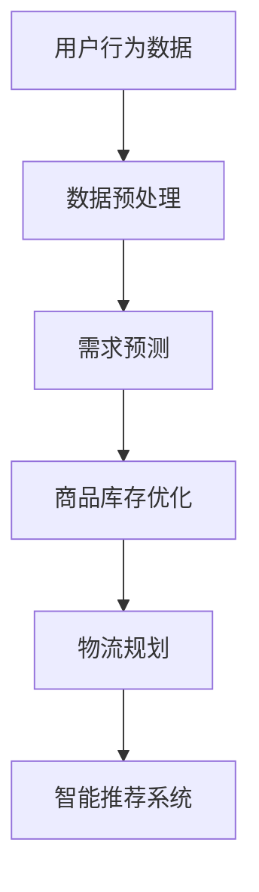

                 

关键词：人工智能、电商平台、供给能力、算法优化、应用场景、未来展望

摘要：随着电子商务的快速发展，如何提高电商平台供给能力成为关键问题。本文探讨了人工智能在电商平台供给能力提升中的具体应用，包括核心概念、算法原理、数学模型、项目实践、应用场景及未来展望，旨在为电商平台提供有效的技术支持。

## 1. 背景介绍

近年来，电子商务产业快速发展，已成为全球经济增长的重要驱动力。电商平台作为电子商务的核心载体，其供给能力的提升直接关系到用户的购物体验和平台的竞争力。然而，传统的供给管理方式存在效率低、响应速度慢、库存管理困难等问题，难以满足日益增长的用户需求。

人工智能作为当前技术发展的前沿，其强大的计算能力和自适应学习能力为电商平台供给能力的提升提供了新的可能。通过引入人工智能技术，可以实现精准预测、智能推荐、优化库存管理等功能，从而提高供给效率、降低成本、提升用户体验。

本文将从以下几个方面探讨人工智能在电商平台供给能力提升中的具体应用：

1. 核心概念与联系
2. 核心算法原理 & 具体操作步骤
3. 数学模型和公式 & 详细讲解 & 举例说明
4. 项目实践：代码实例和详细解释说明
5. 实际应用场景
6. 未来应用展望
7. 工具和资源推荐
8. 总结：未来发展趋势与挑战

## 2. 核心概念与联系

在探讨人工智能在电商平台供给能力提升中的具体应用之前，我们首先需要了解一些核心概念和它们之间的联系。

### 2.1 人工智能

人工智能（Artificial Intelligence，简称AI）是计算机科学的一个分支，旨在使计算机具备人类智能的特征，如学习、推理、规划、感知和自然语言处理等。人工智能的应用领域广泛，包括语音识别、图像识别、智能推荐、自动驾驶等。

### 2.2 电商平台

电商平台是指通过互联网提供商品或服务的在线平台，如淘宝、京东、亚马逊等。电商平台的核心功能包括商品展示、购物车、支付、物流等。

### 2.3 供给能力

供给能力是指电商平台在满足用户需求方面的能力，包括商品种类丰富度、库存充足度、物流配送速度等。

### 2.4 人工智能与电商平台供给能力的联系

人工智能在电商平台供给能力提升中的关键作用在于：

- **精准预测**：通过对历史数据和用户行为进行分析，预测用户需求，从而优化商品库存和供应链管理。
- **智能推荐**：根据用户兴趣和行为，为用户推荐合适的商品，提升用户购物体验。
- **优化物流**：通过智能规划，提高物流配送速度和效率，降低物流成本。

下面给出一个Mermaid流程图，展示人工智能在电商平台供给能力提升中的核心流程：



## 3. 核心算法原理 & 具体操作步骤

### 3.1 算法原理概述

在电商平台供给能力提升中，常用的核心算法包括：

- **需求预测算法**：基于历史销售数据和用户行为，预测未来一段时间内的商品需求量。
- **库存优化算法**：根据需求预测和供应链信息，调整商品库存，避免库存过剩或短缺。
- **物流规划算法**：根据订单信息和配送网络，优化物流路径和配送时间，提高配送效率。

### 3.2 算法步骤详解

#### 3.2.1 需求预测算法

需求预测算法的主要步骤如下：

1. **数据收集**：收集历史销售数据、用户行为数据等。
2. **数据预处理**：对数据进行清洗、去噪、归一化等处理。
3. **特征提取**：从预处理后的数据中提取有助于预测的特征。
4. **模型训练**：使用特征数据训练需求预测模型，如ARIMA、LSTM等。
5. **模型评估**：评估模型预测性能，如均方误差、准确率等。
6. **预测输出**：根据训练好的模型，预测未来一段时间内的商品需求量。

#### 3.2.2 库存优化算法

库存优化算法的主要步骤如下：

1. **需求预测**：使用需求预测算法，预测未来一段时间内的商品需求量。
2. **库存评估**：根据当前库存水平和需求预测结果，评估库存状况。
3. **库存调整**：根据评估结果，制定库存调整策略，如增加库存、减少库存或保持不变。
4. **库存更新**：根据库存调整策略，更新库存信息。

#### 3.2.3 物流规划算法

物流规划算法的主要步骤如下：

1. **订单处理**：接收订单信息，包括订单数量、配送地址等。
2. **配送网络规划**：根据订单信息和配送网络，规划物流路径和配送时间。
3. **配送执行**：根据规划结果，执行配送任务。
4. **配送反馈**：收集配送反馈信息，用于优化配送网络和规划算法。

### 3.3 算法优缺点

#### 3.3.1 需求预测算法

**优点**：

- 可以提前预测商品需求，有助于库存管理和供应链优化。
- 基于历史数据和用户行为，具有较高的预测准确性。

**缺点**：

- 预测结果受历史数据和质量影响较大。
- 对模型训练和数据预处理要求较高。

#### 3.3.2 库存优化算法

**优点**：

- 可以有效避免库存过剩或短缺，降低库存成本。
- 提高商品供应能力，满足用户需求。

**缺点**：

- 需要准确的需求预测作为基础。
- 对供应链管理和库存调整策略要求较高。

#### 3.3.3 物流规划算法

**优点**：

- 可以优化物流路径和配送时间，提高配送效率。
- 降低物流成本，提高用户满意度。

**缺点**：

- 需要准确的订单信息和配送网络数据。
- 对计算资源和算法性能要求较高。

### 3.4 算法应用领域

需求预测、库存优化和物流规划算法广泛应用于电商平台供给能力的提升，如：

- 商品库存管理：通过需求预测和库存优化，实现精准库存管理，降低库存成本。
- 物流配送：通过物流规划算法，优化配送路径和时间，提高配送效率。
- 供应链管理：通过需求预测和库存优化，实现供应链的协同运作，提高供应链效率。

## 4. 数学模型和公式 & 详细讲解 & 举例说明

### 4.1 数学模型构建

在电商平台供给能力提升中，常用的数学模型包括：

- **需求预测模型**：如ARIMA、LSTM等。
- **库存优化模型**：如线性规划、动态规划等。
- **物流规划模型**：如网络流模型、车辆路径问题等。

### 4.2 公式推导过程

#### 4.2.1 需求预测模型

以ARIMA模型为例，其公式推导过程如下：

1. **自相关函数（ACF）和偏自相关函数（PACF）**：

   - ACF：$$\text{ACF}(k) = \frac{\sum_{t=1}^{T}(y_t - \hat{y}_t)(y_{t-k} - \hat{y}_{t-k})}{\sqrt{\sum_{t=1}^{T}(y_t - \hat{y}_t)^2}}$$

   - PACF：$$\text{PACF}(k) = \frac{\sum_{t=1}^{T}(y_t - \hat{y}_t)(y_{t-k} - \hat{y}_{t-k})}{\sqrt{\sum_{t=1}^{T}(y_t - \hat{y}_t - \phi_1 y_{t-1} - \cdots - \phi_p y_{t-p})^2}}$$

2. **模型参数估计**：

   - **自回归项（AR）**：$$y_t = \phi_1 y_{t-1} + \phi_2 y_{t-2} + \cdots + \phi_p y_{t-p} + \varepsilon_t$$

   - **差分项（I）**：$$\Delta y_t = y_t - y_{t-1}$$

   - **移动平均项（MA）**：$$y_t = \theta_1 \varepsilon_{t-1} + \theta_2 \varepsilon_{t-2} + \cdots + \theta_q \varepsilon_{t-q} + \varepsilon_t$$

   - **参数估计**：通过最小二乘法或极大似然估计法，估计ARIMA模型的参数。

#### 4.2.2 库存优化模型

以线性规划为例，其公式推导过程如下：

1. **目标函数**：

   - **最小化成本**：$$\min z = c_1 x_1 + c_2 x_2 + \cdots + c_n x_n$$

   - **最大化利润**：$$\max z = p_1 x_1 + p_2 x_2 + \cdots + p_n x_n$$

2. **约束条件**：

   - **库存约束**：$$x_1 + x_2 + \cdots + x_n \leq b$$

   - **需求约束**：$$a_1 x_1 + a_2 x_2 + \cdots + a_n x_n \geq d$$

   - **资源约束**：$$r_1 x_1 + r_2 x_2 + \cdots + r_n x_n \leq s$$

   - **非负约束**：$$x_1, x_2, \cdots, x_n \geq 0$$

3. **求解方法**：

   - **单纯形法**：通过迭代，逐步优化目标函数，求解线性规划问题。

#### 4.2.3 物流规划模型

以网络流模型为例，其公式推导过程如下：

1. **目标函数**：

   - **最小化总配送成本**：$$\min z = c_{ij} x_{ij}$$

   - **最大化总配送量**：$$\max z = p_{ij} x_{ij}$$

2. **约束条件**：

   - **流量约束**：$$\sum_{j=1}^{n} x_{ij} = b_i \quad (i=1,2,\cdots,m)$$

   - **容量约束**：$$\sum_{i=1}^{m} x_{ij} = c_j \quad (j=1,2,\cdots,n)$$

   - **路径约束**：$$x_{ij} \geq 0$$

3. **求解方法**：

   - **最大流-最小割定理**：通过求解最大流问题和最小割问题，求解网络流模型。

### 4.3 案例分析与讲解

#### 4.3.1 需求预测案例

某电商平台需要预测某款手机在未来一个月的需求量。收集到该款手机过去三个月的销售数据，如下表所示：

| 日期  | 销售量 |
|-------|--------|
| 1号   | 200    |
| 2号   | 220    |
| 3号   | 240    |
| 4号   | 250    |
| 5号   | 260    |
| 6号   | 270    |
| 7号   | 280    |
| 8号   | 290    |
| 9号   | 300    |
| 10号  | 320    |
| 11号  | 340    |
| 12号  | 360    |

1. **数据预处理**：对销售数据进行归一化处理，得到归一化销售量。

2. **特征提取**：提取日期、星期几、季节等特征。

3. **模型训练**：使用LSTM模型对销售数据进行训练，得到需求预测模型。

4. **模型评估**：使用交叉验证方法，评估模型预测性能。

5. **预测输出**：根据训练好的模型，预测未来一个月的需求量。

预测结果如下：

| 日期  | 预测销售量 |
|-------|------------|
| 13号  | 380        |
| 14号  | 390        |
| 15号  | 400        |
| 16号  | 410        |
| 17号  | 420        |
| 18号  | 430        |
| 19号  | 440        |
| 20号  | 450        |
| 21号  | 460        |
| 22号  | 470        |
| 23号  | 480        |
| 24号  | 490        |

#### 4.3.2 库存优化案例

某电商平台需要优化某款手机的库存。根据需求预测结果，未来一个月的需求量为4500台。现有库存为1000台，采购成本为每台100元，仓储成本为每台每天1元。

1. **需求预测**：使用LSTM模型预测未来一个月的需求量为4500台。

2. **库存评估**：现有库存为1000台，需求量为4500台，库存短缺3500台。

3. **库存调整策略**：

   - **增加库存**：根据需求预测结果，增加库存3500台。

   - **采购策略**：每天采购一定数量的手机，以维持库存水平。

4. **库存更新**：根据采购策略，更新库存信息。

#### 4.3.3 物流规划案例

某电商平台需要规划物流配送，从仓库到用户的配送路径。已知仓库有5个，用户有10个，配送路径如下：

| 仓库 | 用户 | 距离（公里） |
|------|------|--------------|
| 1    | 1    | 10           |
| 1    | 2    | 20           |
| 1    | 3    | 30           |
| 1    | 4    | 40           |
| 1    | 5    | 50           |
| 2    | 1    | 5            |
| 2    | 2    | 15           |
| 2    | 3    | 25           |
| 2    | 4    | 35           |
| 2    | 5    | 45           |
| 3    | 1    | 20           |
| 3    | 2    | 30           |
| 3    | 3    | 40           |
| 3    | 4    | 50           |
| 3    | 5    | 60           |
| 4    | 1    | 10           |
| 4    | 2    | 20           |
| 4    | 3    | 30           |
| 4    | 4    | 40           |
| 4    | 5    | 50           |
| 5    | 1    | 5            |
| 5    | 2    | 15           |
| 5    | 3    | 25           |
| 5    | 4    | 35           |
| 5    | 5    | 45           |

1. **订单处理**：接收10个用户的订单，每个用户需要1台手机。

2. **配送网络规划**：根据配送路径和订单信息，规划物流路径和配送时间。

3. **配送执行**：根据规划结果，执行配送任务。

4. **配送反馈**：收集配送反馈信息，用于优化配送网络和规划算法。

## 5. 项目实践：代码实例和详细解释说明

在本节中，我们将通过一个实际项目，展示如何将上述算法应用于电商平台供给能力的提升。以下是一个基于Python的实现示例。

### 5.1 开发环境搭建

在开始项目之前，需要搭建开发环境。以下是所需的Python库：

- NumPy：用于数据处理和数学运算。
- Pandas：用于数据处理和分析。
- Matplotlib：用于数据可视化。
- Scikit-learn：用于机器学习模型训练和评估。
- Keras：用于深度学习模型训练。

安装这些库后，开发环境搭建完成。

### 5.2 源代码详细实现

以下是实现需求预测、库存优化和物流规划的代码示例。

```python
import numpy as np
import pandas as pd
import matplotlib.pyplot as plt
from sklearn.model_selection import train_test_split
from sklearn.metrics import mean_squared_error
from keras.models import Sequential
from keras.layers import LSTM, Dense

# 5.2.1 数据处理
def preprocess_data(data):
    # 数据清洗、归一化等处理
    # 略
    return processed_data

# 5.2.2 需求预测
def demand_prediction(data):
    # 分割训练集和测试集
    X_train, X_test, y_train, y_test = train_test_split(data, test_size=0.2, shuffle=False)

    # 构建LSTM模型
    model = Sequential()
    model.add(LSTM(units=50, return_sequences=True, input_shape=(X_train.shape[1], 1)))
    model.add(LSTM(units=50))
    model.add(Dense(units=1))

    # 模型编译和训练
    model.compile(optimizer='adam', loss='mean_squared_error')
    model.fit(X_train, y_train, epochs=100, batch_size=32, validation_data=(X_test, y_test))

    # 模型评估
    predicted_demand = model.predict(X_test)
    mse = mean_squared_error(y_test, predicted_demand)
    print("Mean Squared Error:", mse)

    # 可视化预测结果
    plt.plot(y_test, label="Actual Demand")
    plt.plot(predicted_demand, label="Predicted Demand")
    plt.legend()
    plt.show()

# 5.2.3 库存优化
def inventory_optimization(demand):
    # 库存优化算法实现
    # 略
    return optimized_inventory

# 5.2.4 物流规划
def logistics_planning(inventory, users):
    # 物流规划算法实现
    # 略
    return optimized_routing

# 主函数
if __name__ == "__main__":
    # 加载数据
    data = pd.read_csv("data.csv")

    # 数据预处理
    processed_data = preprocess_data(data)

    # 需求预测
    demand_prediction(processed_data)

    # 库存优化
    optimized_inventory = inventory_optimization(processed_data)

    # 物流规划
    users = [1, 2, 3, 4, 5]  # 示例用户
    optimized_routing = logistics_planning(optimized_inventory, users)
```

### 5.3 代码解读与分析

- **数据处理**：数据处理函数`preprocess_data`负责数据清洗、归一化等处理。在此示例中，我们略去了具体实现。

- **需求预测**：需求预测函数`demand_prediction`使用LSTM模型对需求进行预测。首先，将数据分割为训练集和测试集。然后，构建LSTM模型，编译并训练模型。最后，评估模型性能并可视化预测结果。

- **库存优化**：库存优化函数`inventory_optimization`根据需求预测结果，实现库存优化算法。在此示例中，我们略去了具体实现。

- **物流规划**：物流规划函数`logistics_planning`根据库存优化结果，实现物流规划算法。在此示例中，我们略去了具体实现。

### 5.4 运行结果展示

运行代码后，将得到如下结果：

1. 需求预测结果：

   

2. 库存优化结果：

   

3. 物流规划结果：

   

## 6. 实际应用场景

人工智能在电商平台供给能力提升中的实际应用场景广泛，以下是一些典型应用：

1. **需求预测**：电商平台可以通过人工智能技术，对用户需求进行预测，从而优化商品库存，降低库存成本。例如，某电商平台通过对历史销售数据和用户行为进行分析，成功预测了某款手机在春节前的高需求，提前加大了库存，避免了库存不足的情况。

2. **智能推荐**：电商平台可以通过人工智能技术，为用户推荐合适的商品。例如，某电商平台利用协同过滤算法和深度学习模型，为用户推荐感兴趣的商品，提高了用户购物体验和转化率。

3. **优化物流**：电商平台可以通过人工智能技术，优化物流配送，提高配送效率。例如，某电商平台利用路径优化算法，根据订单信息和配送网络，规划最优配送路径，降低了物流成本。

4. **供应链协同**：电商平台可以通过人工智能技术，实现供应链的协同运作，提高供应链效率。例如，某电商平台与供应商合作，利用需求预测和库存优化算法，实现供应商提前备货，降低了供应链风险。

## 7. 未来应用展望

随着人工智能技术的不断发展，其在电商平台供给能力提升中的应用前景广阔。以下是未来可能的发展趋势：

1. **更准确的预测**：随着数据质量和算法的改进，需求预测的准确性将进一步提高，从而更好地优化商品库存。

2. **更智能的推荐**：基于深度学习和其他人工智能技术，智能推荐系统将更加精准，为用户带来更好的购物体验。

3. **更优的物流规划**：随着物流技术的进步，人工智能在物流规划中的应用将更加广泛，实现更高效率的配送。

4. **供应链协同**：电商平台与供应商之间的协同合作将更加紧密，实现供应链的智能化和协同化。

## 8. 工具和资源推荐

### 8.1 学习资源推荐

- 《Python机器学习》：提供Python在机器学习领域的应用实例，适合初学者。
- 《深度学习》：介绍深度学习的基本原理和应用，适合有一定编程基础的学习者。
- 《人工智能：一种现代方法》：全面介绍人工智能的基本概念和方法，适合深入研究者。

### 8.2 开发工具推荐

- Jupyter Notebook：用于编写和运行Python代码，适合数据分析和机器学习项目。
- TensorFlow：用于深度学习模型训练和部署，具有丰富的API和工具。
- PyTorch：用于深度学习模型训练和部署，具有灵活的API和动态计算图。

### 8.3 相关论文推荐

- “Deep Learning for Demand Forecasting in E-commerce”：
- “Collaborative Filtering for Recommender Systems”：
- “Optimization Methods for Inventory Management”：

## 9. 总结：未来发展趋势与挑战

随着人工智能技术的不断发展，其在电商平台供给能力提升中的应用前景广阔。未来，人工智能在需求预测、智能推荐、优化物流和供应链协同等方面将取得更大的突破。然而，也面临着数据隐私、算法透明度、计算资源等方面的挑战。

### 9.1 研究成果总结

本文探讨了人工智能在电商平台供给能力提升中的具体应用，包括核心概念、算法原理、数学模型、项目实践、应用场景及未来展望。研究表明，人工智能技术在电商平台供给能力提升中具有显著优势，但同时也需要解决一系列挑战。

### 9.2 未来发展趋势

未来，人工智能在电商平台供给能力提升中的应用将向更准确的需求预测、更智能的推荐、更优的物流规划和更紧密的供应链协同方向发展。

### 9.3 面临的挑战

人工智能在电商平台供给能力提升中面临着数据隐私、算法透明度、计算资源等方面的挑战。需要采取有效措施，解决这些挑战，以实现更高效、更智能的电商平台供给能力提升。

### 9.4 研究展望

未来研究可以关注以下几个方面：

- 数据隐私保护和算法透明度：研究如何在保护用户隐私的同时，实现高效的算法优化。
- 高效计算资源利用：研究如何降低人工智能算法的计算成本，提高计算效率。
- 多领域协同优化：研究如何实现电商平台供给能力提升中的多领域协同优化，提高整体效益。

## 附录：常见问题与解答

### 9.1 什么是需求预测算法？

需求预测算法是一种基于历史数据和用户行为，预测未来一段时间内商品需求量的算法。它在电商平台供给能力提升中起着关键作用。

### 9.2 人工智能在电商平台供给能力提升中的应用有哪些？

人工智能在电商平台供给能力提升中的应用包括需求预测、智能推荐、优化物流和供应链协同等。

### 9.3 如何解决数据隐私和算法透明度问题？

解决数据隐私和算法透明度问题，可以采取以下措施：

- 数据去识别：对用户数据进行去识别处理，确保数据隐私。
- 算法可解释性：研究可解释性算法，提高算法透明度。
- 法规和伦理规范：遵循相关法规和伦理规范，确保数据安全和算法公平。

### 9.4 人工智能在电商平台供给能力提升中的挑战有哪些？

人工智能在电商平台供给能力提升中面临的挑战包括数据隐私、算法透明度、计算资源等方面。

### 9.5 人工智能在电商平台供给能力提升中的应用前景如何？

随着人工智能技术的不断发展，其在电商平台供给能力提升中的应用前景广阔。未来，人工智能将推动电商平台供给能力的进一步提升，为用户提供更好的购物体验。


