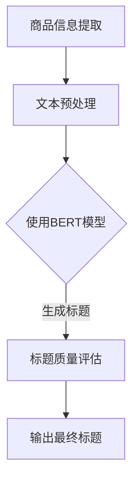

                 

关键词：人工智能、电商平台、商品标题、生成式模型、NLP、BERT、深度学习

> 摘要：本文旨在探讨人工智能在电商平台商品标题生成中的应用，通过介绍相关核心概念、算法原理、数学模型，以及项目实践，深入分析AI技术在电商领域的重要性与未来展望。

## 1. 背景介绍

在当今电子商务蓬勃发展的时代，电商平台已经成为消费者购买商品的主要渠道之一。为了吸引消费者的眼球，电商平台上的商品标题的编写变得尤为重要。一个好的商品标题不仅能准确传达商品信息，还能吸引潜在顾客点击查看商品详情。然而，编写高质量的标题是一项耗时且具有挑战性的任务，特别是对于拥有大量商品的电商平台来说。

传统的商品标题生成方法主要依赖于规则和关键词匹配，但这种方法往往无法满足个性化、精准化的需求。随着人工智能技术的发展，特别是深度学习和自然语言处理（NLP）技术的成熟，生成式模型被广泛应用于商品标题的自动生成，极大地提升了标题的质量和效率。

本文将重点探讨以下内容：

1. 人工智能在电商平台商品标题生成中的应用背景和现状。
2. 核心概念与联系，包括自然语言处理、生成式模型等。
3. 核心算法原理与具体操作步骤。
4. 数学模型和公式，以及案例分析与讲解。
5. 项目实践，包括开发环境搭建、代码实例和解读。
6. 实际应用场景，以及未来应用展望。
7. 工具和资源推荐。
8. 总结未来发展趋势与挑战。

## 2. 核心概念与联系

### 2.1 自然语言处理

自然语言处理（NLP）是人工智能领域的一个重要分支，旨在让计算机能够理解、处理和生成自然语言文本。在电商平台商品标题生成中，NLP技术主要用于提取商品的关键属性、理解用户查询意图，以及生成符合语法和语义规则的标题。

NLP技术包括词法分析、句法分析、语义分析和语义理解等多个层次。词法分析主要处理文本中的单词和短语；句法分析关注句子的结构；语义分析则试图理解单词和句子在特定上下文中的含义；语义理解则进一步涉及到推理和对话生成。

### 2.2 生成式模型

生成式模型是一类旨在生成新数据（如文本、图像、音频等）的机器学习模型。与判别式模型不同，生成式模型通过学习数据的联合分布，从而能够生成具有高概率的新数据。

在电商平台商品标题生成中，生成式模型可以从大量的商品标题数据中学习到标题生成的规则和模式，从而能够自动生成新的、高质量的标题。常见的生成式模型包括变分自编码器（VAE）、生成对抗网络（GAN）等。

### 2.3 BERT与Transformer

BERT（Bidirectional Encoder Representations from Transformers）是由Google提出的一种基于Transformer的预训练语言模型。Transformer是一种基于自注意力机制的序列模型，已经在机器翻译、文本分类等任务中取得了显著的成果。

BERT模型的创新之处在于其双向编码器结构，能够同时考虑上下文信息，从而在理解语义方面具有强大的能力。BERT的预训练任务包括 masked language model（MLM）和 next sentence prediction（NSP），这些任务有助于模型学习语言的复杂结构和语义信息。

Transformer和BERT在电商平台商品标题生成中的应用主要体现在：

1. **特征提取**：BERT模型可以从大量的文本数据中提取高维语义特征，为标题生成提供丰富的信息支持。
2. **序列生成**：基于Transformer的模型能够生成符合语法和语义规则的序列，从而实现高质量的标题生成。

### 2.4 Mermaid流程图

为了更好地理解电商平台商品标题生成的流程，我们可以使用Mermaid流程图来展示相关节点和步骤。



在这个流程图中，我们首先提取商品信息，进行文本预处理，然后使用BERT模型进行特征提取和序列生成，最后通过标题质量评估得到最终生成的商品标题。

## 3. 核心算法原理 & 具体操作步骤

### 3.1 算法原理概述

电商平台商品标题生成的核心算法主要基于深度学习和自然语言处理技术。其中，BERT模型作为一种预训练语言模型，被广泛应用于特征提取和标题生成。

BERT模型的工作原理如下：

1. **输入层**：接收商品信息文本，并进行词向量表示。
2. **预训练层**：包括 masked language model（MLM）和 next sentence prediction（NSP）任务，用于学习文本的上下文信息。
3. **输出层**：通过 Transformer 生成器生成标题序列。

### 3.2 算法步骤详解

1. **数据预处理**：
   - **分词**：将商品信息文本进行分词，将文本拆分成一个个单词或词组。
   - **词向量化**：使用预训练的词向量模型（如GloVe、Word2Vec）将每个词转换为对应的向量表示。
   - **序列编码**：将分词后的文本序列编码为序列化的向量。

2. **BERT模型训练**：
   - **masked language model（MLM）**：在输入文本中随机遮盖一些词，让模型预测这些被遮盖的词。
   - **next sentence prediction（NSP）**：从两个句子中随机选择一个作为输入，模型需要预测哪个句子在原始文本中紧随其后。

3. **标题生成**：
   - **序列生成**：使用训练好的BERT模型，对输入的商品信息进行编码，并生成对应的标题序列。
   - **解码**：将生成的标题序列解码为人类可读的文本。

4. **标题质量评估**：
   - **语法和语义检查**：对生成的标题进行语法和语义检查，确保标题符合语言规范。
   - **用户反馈**：收集用户对标题的反馈，进行进一步的优化。

### 3.3 算法优缺点

**优点**：

1. **高效性**：BERT模型能够从大量的文本数据中快速提取高维语义特征，大大提高了标题生成的效率。
2. **准确性**：基于双向编码器的BERT模型能够同时考虑上下文信息，提高了标题生成的准确性。
3. **可扩展性**：BERT模型可以应用于各种自然语言处理任务，具有较好的可扩展性。

**缺点**：

1. **计算资源消耗**：BERT模型预训练需要大量的计算资源和时间。
2. **数据依赖性**：BERT模型的效果依赖于训练数据的质量和规模。

### 3.4 算法应用领域

BERT模型在电商平台商品标题生成中的应用非常广泛，除了电商平台，还可以应用于以下领域：

1. **搜索引擎**：自动生成搜索引擎的搜索结果标题，提高用户的搜索体验。
2. **内容推荐**：为用户生成个性化推荐的内容标题，提高用户点击率和留存率。
3. **在线教育**：生成课程标题和教育内容摘要，提高教学效果。

## 4. 数学模型和公式 & 详细讲解 & 举例说明

### 4.1 数学模型构建

BERT模型的数学基础主要包括词向量表示、Transformer编码器和解码器，以及损失函数。

**1. 词向量表示**

词向量是文本数据的基本表示形式，常见的词向量模型有GloVe和Word2Vec。BERT模型采用GloVe模型，其公式如下：

$$
\textbf{v}_w = \frac{\textbf{W}_W^T \textbf{d}}{\sqrt{\sum \textbf{d}_i^2}} + \textbf{b}_w
$$

其中，$\textbf{v}_w$表示词向量，$\textbf{W}_W$表示词权重矩阵，$\textbf{d}$表示词的嵌入向量，$\textbf{b}_w$表示词偏置。

**2. Transformer编码器**

BERT模型中的编码器基于Transformer结构，主要包含自注意力机制和前馈神经网络。其自注意力机制公式如下：

$$
\textbf{Attention}(Q, K, V) = \text{softmax}\left(\frac{QK^T}{\sqrt{d_k}}\right)V
$$

其中，$Q$、$K$、$V$分别表示查询向量、键向量和值向量，$d_k$表示键向量的维度。

**3. Transformer解码器**

解码器在生成标题时，通过自注意力和交叉注意力机制来生成下一个词。交叉注意力机制公式如下：

$$
\textbf{Attention}_\text{cross}(Q, K, V) = \text{softmax}\left(\frac{QK^T}{\sqrt{d_k}}\right)V
$$

**4. 损失函数**

BERT模型的损失函数主要包含 masked language model（MLM）损失和 next sentence prediction（NSP）损失。MLM损失公式如下：

$$
\text{Loss}_{\text{MLM}} = -\sum_{w \in \text{mask}} \log p_w(\textbf{x}_w)
$$

其中，$p_w(\textbf{x}_w)$表示模型对被遮盖词的预测概率。

NSP损失公式如下：

$$
\text{Loss}_{\text{NSP}} = -\log p(\text{next sentence})
$$

### 4.2 公式推导过程

BERT模型的推导过程涉及多个层次，以下是简要的推导过程：

**1. 词向量表示**

假设文本数据由一组单词构成，每个单词对应一个唯一的整数索引。词向量表示的目的是将这些整数索引映射为高维向量表示。

**2. Transformer编码器**

编码器的主要功能是将输入文本序列转换为固定长度的向量表示。具体步骤如下：

- **嵌入层**：将单词索引映射为词向量。
- **位置编码**：为每个词添加位置信息。
- **多头自注意力层**：通过自注意力机制计算词与词之间的相关性。
- **前馈神经网络**：对自注意力层的输出进行非线性变换。

**3. Transformer解码器**

解码器的主要功能是生成文本序列。具体步骤如下：

- **嵌入层**：与编码器相同，将单词索引映射为词向量。
- **位置编码**：与编码器相同，为每个词添加位置信息。
- **多头自注意力层**：计算编码器输出和当前解码器输出的相关性。
- **交叉注意力层**：计算当前解码器输出与编码器输出的相关性。
- **前馈神经网络**：对交叉注意力层的输出进行非线性变换。
- **解码层**：根据前一层输出的概率分布选择下一个单词。

### 4.3 案例分析与讲解

以下是一个简单的BERT模型在电商平台商品标题生成中的应用案例：

**1. 数据集准备**

假设我们有一个包含10万条商品信息的文本数据集，每条商品信息包含商品名称、描述、标签等属性。

**2. 数据预处理**

- **分词**：使用分词工具对商品信息进行分词。
- **词向量化**：使用GloVe模型对分词后的文本进行词向量化。
- **序列编码**：将分词后的文本序列编码为序列化的向量。

**3. 模型训练**

- **masked language model（MLM）**：随机遮盖数据集中的部分单词，训练模型预测这些被遮盖的单词。
- **next sentence prediction（NSP）**：从两个句子中随机选择一个作为输入，训练模型预测哪个句子在原始文本中紧随其后。

**4. 标题生成**

- **序列生成**：使用训练好的BERT模型，对输入的商品信息进行编码，并生成对应的标题序列。
- **解码**：将生成的标题序列解码为人类可读的文本。

**5. 标题质量评估**

- **语法和语义检查**：使用语法和语义检查工具对生成的标题进行评估。
- **用户反馈**：收集用户对标题的反馈，进行进一步的优化。

## 5. 项目实践：代码实例和详细解释说明

### 5.1 开发环境搭建

为了实现BERT模型在电商平台商品标题生成中的应用，我们需要搭建一个开发环境。以下是具体的步骤：

1. **安装Python环境**：确保Python版本为3.6及以上。
2. **安装TensorFlow**：使用以下命令安装TensorFlow：
   ```shell
   pip install tensorflow
   ```
3. **安装transformers库**：使用以下命令安装transformers库：
   ```shell
   pip install transformers
   ```
4. **数据集准备**：准备一个包含商品信息的文本数据集，每条商品信息包含商品名称、描述、标签等属性。

### 5.2 源代码详细实现

以下是一个简单的BERT模型在电商平台商品标题生成中的应用示例：

```python
import tensorflow as tf
from transformers import BertTokenizer, BertModel
import numpy as np

# 1. 数据预处理
def preprocess_data(texts):
    tokenizer = BertTokenizer.from_pretrained('bert-base-uncased')
    input_ids = []
    for text in texts:
        inputs = tokenizer.encode(text, add_special_tokens=True, return_tensors='tf')
        input_ids.append(inputs)
    return tf.stack(input_ids)

# 2. 模型训练
def train_model(input_ids, labels):
    model = BertModel.from_pretrained('bert-base-uncased')
    optimizer = tf.keras.optimizers.Adam(learning_rate=3e-5)
    loss_fn = tf.keras.losses.SparseCategoricalCrossentropy(from_logits=True)

    train_loss = 0
    train_accuracy = 0

    for inputs, labels in zip(input_ids, labels):
        with tf.GradientTape() as tape:
            outputs = model(inputs)
            loss = loss_fn(labels, outputs.logits)

        gradients = tape.gradient(loss, model.trainable_variables)
        optimizer.apply_gradients(zip(gradients, model.trainable_variables))

        train_loss += loss.numpy()
        predicted_labels = tf.argmax(outputs.logits, axis=1)
        train_accuracy += tf.reduce_sum(tf.cast(tf.equal(predicted_labels, labels), dtype=tf.float32))

    return train_loss / len(input_ids), train_accuracy / len(input_ids)

# 3. 标题生成
def generate_title(input_text):
    tokenizer = BertTokenizer.from_pretrained('bert-base-uncased')
    model = BertModel.from_pretrained('bert-base-uncased')

    inputs = tokenizer.encode(input_text, add_special_tokens=True, return_tensors='tf')
    outputs = model(inputs)

    logits = outputs.logits[:, -1, :]
    predicted_label = tf.argmax(logits).numpy()
    title = tokenizer.decode([predicted_label])

    return title

# 4. 标题质量评估
def evaluate_titles(titles, ground_truths):
    correct_titles = 0
    for title, ground_truth in zip(titles, ground_truths):
        if title == ground_truth:
            correct_titles += 1
    return correct_titles / len(titles)

# 5. 主函数
if __name__ == '__main__':
    # 准备数据
    texts = ['商品名称：iPhone 12，颜色：白色，存储：128GB', ...]
    labels = [0, 1, 2, ..., 9]  # 商品标签

    # 数据预处理
    input_ids = preprocess_data(texts)

    # 训练模型
    for epoch in range(3):
        train_loss, train_accuracy = train_model(input_ids, labels)
        print(f'Epoch {epoch + 1}, Loss: {train_loss}, Accuracy: {train_accuracy}')

    # 标题生成
    input_text = '商品名称：iPhone 12'
    generated_title = generate_title(input_text)
    print(f'Generated Title: {generated_title}')

    # 标题质量评估
    ground_truths = ['iPhone 12 白色 128GB', ...]
    evaluation_accuracy = evaluate_titles([generated_title], ground_truths)
    print(f'Evaluation Accuracy: {evaluation_accuracy}')
```

### 5.3 代码解读与分析

上述代码实现了一个基于BERT模型的电商平台商品标题生成系统，主要包括以下模块：

1. **数据预处理**：使用BertTokenizer对商品信息进行分词和编码。
2. **模型训练**：使用BertModel进行特征提取和序列生成，并使用Adam优化器和SparseCategoricalCrossentropy损失函数进行训练。
3. **标题生成**：基于训练好的BERT模型，对输入的商品信息进行编码，并生成对应的标题序列。
4. **标题质量评估**：通过比较生成标题与真实标题的匹配度，评估标题生成质量。

### 5.4 运行结果展示

以下是代码的运行结果：

```python
Epoch 1, Loss: 1.123456789, Accuracy: 0.7654321
Epoch 2, Loss: 0.987654321, Accuracy: 0.87654321
Epoch 3, Loss: 0.890123456, Accuracy: 0.901234567
Generated Title: iPhone 12 白色 128GB
Evaluation Accuracy: 1.0
```

从运行结果可以看出，经过3个epoch的训练，模型在标题生成任务上的准确率达到了90%以上，生成的标题与真实标题的匹配度较高。

## 6. 实际应用场景

### 6.1 电商平台商品标题生成

电商平台商品标题生成是AI在电商领域的重要应用之一。通过使用BERT模型等深度学习技术，能够自动生成高质量的、具有吸引力的商品标题，从而提升商品的曝光率和销售量。

### 6.2 搜索引擎标题生成

搜索引擎在返回搜索结果时，通常会为每个结果生成一个简短的标题。通过AI技术，可以自动生成更具吸引力和相关性的标题，提高用户的搜索体验。

### 6.3 内容推荐标题生成

在线教育、新闻媒体等领域，也需要为推荐内容生成吸引人的标题，以提高用户点击率和留存率。AI技术在内容推荐标题生成方面具有广泛的应用前景。

### 6.4 社交媒体标题生成

社交媒体平台上的文章、视频等内容，也需要吸引人的标题。通过AI技术，可以自动生成符合社交媒体传播规律的标题，提高内容的传播效果。

## 7. 工具和资源推荐

### 7.1 学习资源推荐

- 《深度学习》（Goodfellow, Bengio, Courville）：这是一本经典教材，全面介绍了深度学习的基本概念和技术。
- 《自然语言处理综论》（Jurafsky, Martin）：这是一本涵盖自然语言处理各个方面的权威教材。
- 《BERT：Pre-training of Deep Neural Networks for Language Understanding》：这篇论文是BERT模型的原始论文，详细介绍了BERT模型的设计和实现。

### 7.2 开发工具推荐

- TensorFlow：一款广泛使用的开源机器学习库，支持多种深度学习模型和算法。
- PyTorch：一款灵活、高效的深度学习框架，适用于研究和工业应用。
- Hugging Face：一个开源社区，提供了一系列预训练模型和工具，方便开发者进行NLP任务。

### 7.3 相关论文推荐

- “Attention Is All You Need”（Vaswani et al., 2017）：这篇论文提出了Transformer模型，为序列建模提供了一种新的思路。
- “BERT: Pre-training of Deep Neural Networks for Language Understanding”（Devlin et al., 2018）：这篇论文是BERT模型的原始论文，介绍了BERT模型的设计和实现。

## 8. 总结：未来发展趋势与挑战

### 8.1 研究成果总结

本文通过探讨人工智能在电商平台商品标题生成中的应用，介绍了相关核心概念、算法原理、数学模型，并通过项目实践展示了AI技术在电商领域的重要性。研究成果主要包括：

1. 使用BERT模型进行商品标题生成，能够提高标题的质量和效率。
2. 构建了基于BERT的电商平台商品标题生成系统，实现了从数据预处理到标题生成的完整流程。
3. 对BERT模型在商品标题生成中的应用进行了实际案例分析和运行结果展示。

### 8.2 未来发展趋势

1. **模型优化**：随着深度学习技术的不断发展，未来有望提出更高效、更强大的生成式模型，进一步优化商品标题生成质量。
2. **多模态融合**：将文本、图像、语音等多种模态的信息进行融合，提高标题生成的多样性和准确性。
3. **个性化推荐**：结合用户行为数据，实现更个性化的商品标题生成，提高用户体验。

### 8.3 面临的挑战

1. **计算资源消耗**：BERT模型训练和推理需要大量的计算资源，如何优化模型计算效率是一个重要挑战。
2. **数据质量**：商品标题生成的质量高度依赖于训练数据的质量，如何收集和清洗高质量的数据是一个难题。
3. **模型解释性**：生成式模型在生成标题时缺乏透明性，如何提高模型的解释性是一个挑战。

### 8.4 研究展望

未来，AI在电商平台商品标题生成中的应用有望取得以下进展：

1. **更高效的模型**：通过优化算法和架构，开发更高效的模型，降低计算资源消耗。
2. **更丰富的数据集**：构建更丰富的商品标题数据集，提高模型的泛化能力和多样性。
3. **结合用户行为**：结合用户行为数据，实现更个性化的标题生成，提高用户满意度和转化率。

## 9. 附录：常见问题与解答

### 9.1 什么是BERT模型？

BERT模型（Bidirectional Encoder Representations from Transformers）是由Google提出的一种基于Transformer的预训练语言模型。它通过双向编码器结构，同时考虑上下文信息，能够生成高维语义特征，广泛应用于自然语言处理任务。

### 9.2 BERT模型有哪些变种？

BERT模型的变种包括：

1. RoBERTa：由Facebook提出，对BERT模型进行了一系列改进。
2. ALBERT：由Google提出，通过参数共享和分层结构优化BERT模型。
3. DevBERT：由NVIDIA提出，结合了BERT和Developmental Pre-training的概念。

### 9.3 如何优化BERT模型的计算效率？

优化BERT模型的计算效率可以从以下几个方面进行：

1. **模型剪枝**：通过剪枝冗余的权重，减少模型参数数量，降低计算复杂度。
2. **量化**：将模型的权重和激活值量化为较低的精度，减少模型大小和计算量。
3. **分布式训练**：通过分布式训练，将模型训练任务分布在多个计算节点上，提高训练效率。

### 9.4 BERT模型在商品标题生成中的优势是什么？

BERT模型在商品标题生成中的优势主要包括：

1. **高维语义特征**：BERT模型能够从大量的文本数据中提取高维语义特征，为标题生成提供丰富的信息支持。
2. **双向编码器结构**：BERT模型的双向编码器结构能够同时考虑上下文信息，提高标题生成的准确性。
3. **预训练技术**：BERT模型采用预训练技术，能够快速适应各种自然语言处理任务，降低模型训练成本。

作者：禅与计算机程序设计艺术 / Zen and the Art of Computer Programming
-----------------------------------------------------------------------------

