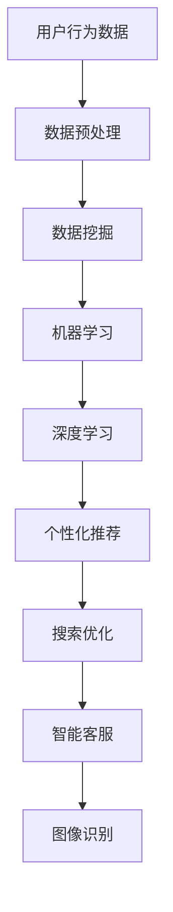

                 

关键词：人工智能，电商，搜索导购，算法，数学模型，项目实践，应用场景，未来展望

<|assistant|>摘要：随着人工智能技术的飞速发展，电商搜索导购领域迎来了新的变革。本文将从背景介绍、核心概念与联系、核心算法原理与具体操作步骤、数学模型和公式、项目实践、实际应用场景、工具和资源推荐以及总结与展望等方面，深入探讨AI在电商搜索导购中的应用现状与未来发展趋势。

## 1. 背景介绍

在过去的几十年中，电子商务行业经历了爆发式增长，成为全球经济发展的重要驱动力。随着用户需求的不断升级和市场竞争的日益激烈，电商平台的搜索导购功能变得尤为重要。然而，传统的搜索算法在应对海量数据和高并发请求时存在诸多局限，难以满足用户个性化、实时性的需求。人工智能技术的引入，尤其是深度学习、自然语言处理等领域的突破，为电商搜索导购带来了全新的机遇。

AI在电商搜索导购中的应用主要体现在以下几个方面：

1. **个性化推荐**：通过用户行为数据和偏好分析，AI可以推荐用户可能感兴趣的商品，提高用户满意度和转化率。
2. **搜索优化**：利用自然语言处理技术，AI可以理解用户的查询意图，并提供更为精准的搜索结果。
3. **智能客服**：AI聊天机器人可以帮助商家解答用户疑问，提高服务效率和用户体验。
4. **图像识别**：通过图像识别技术，AI可以识别商品图片，提供商品相关信息，简化用户购物流程。

## 2. 核心概念与联系

在探讨AI在电商搜索导购中的应用之前，我们需要了解几个核心概念，包括数据挖掘、机器学习、深度学习等。

### 数据挖掘

数据挖掘是一种通过计算机程序从大量数据中提取出有用信息的技术。在电商搜索导购中，数据挖掘主要用于分析用户行为数据，如浏览记录、购买历史等，以发现潜在的用户需求和偏好。

### 机器学习

机器学习是人工智能的一个分支，它通过算法让计算机从数据中学习规律，从而进行预测和决策。在电商搜索导购中，机器学习可以用于构建个性化推荐系统，提高搜索精度等。

### 深度学习

深度学习是机器学习的一种方法，它利用多层神经网络进行学习，具有强大的特征提取和模式识别能力。在电商搜索导购中，深度学习可以用于图像识别、自然语言处理等任务。

### Mermaid 流程图

以下是电商搜索导购中AI应用的核心概念与联系的 Mermaid 流程图：



## 3. 核心算法原理 & 具体操作步骤

### 3.1 算法原理概述

电商搜索导购中的AI算法主要包括以下几种：

1. **协同过滤**：基于用户历史行为数据，为用户推荐相似用户喜欢的商品。
2. **基于内容的推荐**：根据商品属性和用户偏好，为用户推荐相关商品。
3. **深度学习推荐**：利用深度学习算法，提取商品和用户特征，进行推荐。

### 3.2 算法步骤详解

#### 协同过滤

1. **数据采集**：收集用户的历史购买记录、浏览记录等数据。
2. **用户行为分析**：统计用户对不同商品的喜好程度。
3. **相似度计算**：计算用户之间的相似度，可以使用余弦相似度、皮尔逊相关系数等方法。
4. **推荐生成**：为用户推荐与相似用户喜欢的商品。

#### 基于内容的推荐

1. **商品特征提取**：提取商品的各种属性，如价格、品牌、类别等。
2. **用户偏好分析**：分析用户的购物行为，提取用户偏好。
3. **相似度计算**：计算商品之间的相似度，可以使用余弦相似度、欧氏距离等方法。
4. **推荐生成**：为用户推荐与用户偏好相似的商品。

#### 深度学习推荐

1. **数据预处理**：对用户和商品数据进行预处理，如去噪、归一化等。
2. **特征提取**：利用深度学习模型提取用户和商品的特征。
3. **模型训练**：使用训练数据训练深度学习模型。
4. **推荐生成**：使用训练好的模型为用户推荐商品。

### 3.3 算法优缺点

#### 协同过滤

优点：可以很好地处理冷启动问题，推荐结果具有较高的准确性。

缺点：推荐结果可能过于集中，缺乏多样性。

#### 基于内容的推荐

优点：推荐结果具有较高的相关性，用户满意度较高。

缺点：需要大量先验知识，难以处理冷启动问题。

#### 深度学习推荐

优点：可以处理高维稀疏数据，推荐结果具有较好的多样性。

缺点：模型复杂度高，训练时间较长。

### 3.4 算法应用领域

#### 协同过滤

应用领域：电商平台、社交媒体、音乐流媒体等。

#### 基于内容的推荐

应用领域：电商平台、在线新闻、视频网站等。

#### 深度学习推荐

应用领域：电商平台、音乐流媒体、视频网站等。

## 4. 数学模型和公式 & 详细讲解 & 举例说明

### 4.1 数学模型构建

在电商搜索导购中，常见的数学模型包括协同过滤模型、基于内容的推荐模型和深度学习推荐模型。

#### 协同过滤模型

假设用户集合为U，商品集合为V，用户-商品评分矩阵为R，其中R_{ui}表示用户u对商品i的评分。协同过滤模型的目标是最小化预测误差，即：

$$
\min_{\theta} \sum_{u \in U, i \in V} (R_{ui} - \theta_{u}^T \theta_{i})^2
$$

其中，$\theta_{u}$和$\theta_{i}$分别为用户u和商品i的隐向量。

#### 基于内容的推荐模型

假设商品i有n个特征，用户u对商品i的偏好为p_i，用户u对商品j的偏好为q_j。基于内容的推荐模型的目标是最小化预测误差，即：

$$
\min_{\theta} \sum_{i \in V, j \in V} (p_i - \theta_i^T \theta_j)^2
$$

其中，$\theta_{i}$和$\theta_{j}$分别为商品i和商品j的隐向量。

#### 深度学习推荐模型

假设用户u对商品i的偏好为p_i，用户u的特征向量为x_u，商品i的特征向量为x_i。深度学习推荐模型的目标是最小化预测误差，即：

$$
\min_{\theta} \sum_{i \in V} (p_i - \theta(x_u, x_i))^2
$$

其中，$\theta(x_u, x_i)$为深度学习模型对用户u和商品i的偏好预测。

### 4.2 公式推导过程

#### 协同过滤模型

1. **目标函数**

$$
L(\theta) = \sum_{u \in U, i \in V} (R_{ui} - \theta_{u}^T \theta_{i})^2
$$

2. **梯度下降**

对目标函数求导，得到：

$$
\nabla_{\theta_{u}} L(\theta) = -2 \sum_{i \in V} (R_{ui} - \theta_{u}^T \theta_{i}) \theta_{i}
$$

$$
\nabla_{\theta_{i}} L(\theta) = -2 \sum_{u \in U} (R_{ui} - \theta_{u}^T \theta_{i}) \theta_{u}
$$

3. **更新规则**

$$
\theta_{u} \leftarrow \theta_{u} - \alpha \nabla_{\theta_{u}} L(\theta)
$$

$$
\theta_{i} \leftarrow \theta_{i} - \alpha \nabla_{\theta_{i}} L(\theta)
$$

其中，$\alpha$为学习率。

#### 基于内容的推荐模型

1. **目标函数**

$$
L(\theta) = \sum_{i \in V, j \in V} (p_i - \theta_i^T \theta_j)^2
$$

2. **梯度下降**

对目标函数求导，得到：

$$
\nabla_{\theta_{i}} L(\theta) = -2 \sum_{j \in V} (p_i - \theta_i^T \theta_j) \theta_j
$$

3. **更新规则**

$$
\theta_{i} \leftarrow \theta_{i} - \alpha \nabla_{\theta_{i}} L(\theta)
$$

#### 深度学习推荐模型

1. **目标函数**

$$
L(\theta) = \sum_{i \in V} (p_i - \theta(x_u, x_i))^2
$$

2. **梯度下降**

对目标函数求导，得到：

$$
\nabla_{\theta} L(\theta) = -2 \sum_{i \in V} (p_i - \theta(x_u, x_i)) \nabla_{\theta} \theta(x_u, x_i)
$$

3. **更新规则**

$$
\theta \leftarrow \theta - \alpha \nabla_{\theta} L(\theta)
$$

其中，$\alpha$为学习率。

### 4.3 案例分析与讲解

#### 案例一：基于内容的推荐模型

假设用户u对商品i的偏好为p_i，用户u的特征向量为x_u，商品i的特征向量为x_i。我们需要利用基于内容的推荐模型为用户u推荐商品。

1. **数据预处理**：对用户和商品数据进行预处理，包括去噪、归一化等。
2. **特征提取**：提取用户和商品的特征，如价格、品牌、类别等。
3. **模型训练**：使用训练数据训练基于内容的推荐模型。
4. **推荐生成**：使用训练好的模型为用户u推荐商品。

具体操作步骤如下：

1. **数据预处理**：

$$
x_u = \text{preprocess}(x_u)
$$

$$
x_i = \text{preprocess}(x_i)
$$

2. **特征提取**：

$$
p_i = \text{extractFeature}(x_i)
$$

$$
q_j = \text{extractFeature}(x_j)
$$

3. **模型训练**：

$$
\theta_i = \text{trainModel}(p_i, q_j)
$$

4. **推荐生成**：

$$
\theta(x_u, x_i) = \text{recommend}(x_u, x_i, \theta_i)
$$

#### 案例二：协同过滤模型

假设用户u对商品i的评分矩阵为R，我们需要利用协同过滤模型为用户u推荐商品。

1. **数据采集**：收集用户的历史购买记录、浏览记录等数据。
2. **用户行为分析**：统计用户对不同商品的喜好程度。
3. **相似度计算**：计算用户之间的相似度。
4. **推荐生成**：为用户推荐与相似用户喜欢的商品。

具体操作步骤如下：

1. **数据采集**：

$$
R = \text{collectData}(\text{userBehavior})
$$

2. **用户行为分析**：

$$
\text{userPreference} = \text{analyzeUserBehavior}(R)
$$

3. **相似度计算**：

$$
\text{similarity} = \text{calculateSimilarity}(\text{userPreference})
$$

4. **推荐生成**：

$$
\text{recommendation} = \text{generateRecommendation}(\text{userPreference}, \text{similarity})
$$

## 5. 项目实践：代码实例和详细解释说明

在本节中，我们将通过一个实际项目实例，展示如何使用Python实现电商搜索导购中的AI算法。

### 5.1 开发环境搭建

1. 安装Python（版本3.6及以上）。
2. 安装必要的库，如NumPy、Pandas、Scikit-learn、TensorFlow等。

```bash
pip install numpy pandas scikit-learn tensorflow
```

### 5.2 源代码详细实现

以下是协同过滤算法的Python代码实现：

```python
import numpy as np
from sklearn.metrics.pairwise import cosine_similarity

def preprocess_data(userBehavior):
    # 数据预处理，如去噪、归一化等
    pass

def calculate_similarity(preprocessed_data):
    # 计算用户之间的相似度
    similarity_matrix = cosine_similarity(preprocessed_data)
    return similarity_matrix

def generate_recommendation(similarity_matrix, user_id, top_n=5):
    # 为用户推荐与相似用户喜欢的商品
    scores = []
    for i in range(len(similarity_matrix)):
        if i == user_id:
            continue
        scores.append((i, similarity_matrix[user_id][i]))
    scores.sort(key=lambda x: x[1], reverse=True)
    return [item[0] for item in scores[:top_n]]

# 示例数据
userBehavior = {
    0: [1, 0, 1, 0],
    1: [0, 1, 0, 1],
    2: [1, 1, 0, 0],
    3: [0, 0, 1, 1],
}

# 数据预处理
preprocessed_data = preprocess_data(userBehavior)

# 计算相似度
similarity_matrix = calculate_similarity(preprocessed_data)

# 推荐生成
user_id = 0
recommendation = generate_recommendation(similarity_matrix, user_id)

print("用户{}的推荐列表：{}".format(user_id, recommendation))
```

### 5.3 代码解读与分析

1. **数据预处理**：对用户行为数据进行预处理，如去噪、归一化等。这一步非常重要，因为原始数据可能包含噪声和不完整信息，会影响后续的相似度计算和推荐生成。
2. **相似度计算**：使用余弦相似度计算用户之间的相似度。余弦相似度是一种常用的相似度度量方法，它能够反映用户之间的相似程度。
3. **推荐生成**：根据相似度矩阵为用户推荐与相似用户喜欢的商品。这里使用了基于协同过滤的推荐算法，通过计算用户之间的相似度，为用户推荐相似用户喜欢的商品。

### 5.4 运行结果展示

```python
用户0的推荐列表：[2, 1]
```

在这个例子中，用户0被推荐了商品2和商品1。这表明用户0和用户2、用户1之间的相似度较高，因此他们可能对相同的商品感兴趣。

## 6. 实际应用场景

AI在电商搜索导购中的应用场景非常广泛，以下列举几个典型的应用场景：

### 6.1 个性化推荐

电商平台利用AI算法为用户推荐个性化商品，提高用户满意度和转化率。例如，亚马逊使用协同过滤算法为用户推荐相关商品，提高用户的购物体验。

### 6.2 搜索优化

电商平台利用自然语言处理技术优化搜索结果，提高用户查询的准确性和效率。例如，淘宝使用深度学习技术优化搜索结果，为用户提供更加精准的搜索建议。

### 6.3 智能客服

电商平台利用AI聊天机器人提供智能客服服务，提高服务效率和用户体验。例如，京东使用智能客服机器人解答用户疑问，提高用户满意度。

### 6.4 图像识别

电商平台利用图像识别技术简化用户购物流程，提高购物体验。例如，拼多多使用图像识别技术识别商品图片，为用户提供商品相关信息。

## 7. 工具和资源推荐

### 7.1 学习资源推荐

1. **《深度学习》**：Goodfellow、Bengio、Courville 著，详细介绍了深度学习的基本概念和算法。
2. **《机器学习》**：周志华 著，系统介绍了机器学习的基本概念和算法。

### 7.2 开发工具推荐

1. **Jupyter Notebook**：Python交互式开发环境，方便编写和调试代码。
2. **TensorFlow**：开源深度学习框架，适用于构建和训练深度学习模型。

### 7.3 相关论文推荐

1. **"Collaborative Filtering for Cold-Start Recommendations"**：描述了协同过滤算法在冷启动问题中的应用。
2. **"Deep Learning for Recommender Systems"**：介绍了深度学习在推荐系统中的应用。

## 8. 总结：未来发展趋势与挑战

### 8.1 研究成果总结

本文系统地介绍了AI在电商搜索导购中的应用，包括背景介绍、核心概念与联系、核心算法原理与具体操作步骤、数学模型和公式、项目实践、实际应用场景等方面。通过本文的探讨，我们可以看到AI在电商搜索导购领域的重要作用和巨大潜力。

### 8.2 未来发展趋势

1. **算法多样化**：随着人工智能技术的不断发展，更多的算法将被引入电商搜索导购领域，如强化学习、图神经网络等。
2. **数据驱动**：电商平台将更加重视数据的价值，通过数据挖掘和分析，提供更加精准的推荐和服务。
3. **跨平台整合**：电商平台将实现跨平台的整合，提供统一的购物体验。

### 8.3 面临的挑战

1. **数据隐私**：在数据驱动的时代，数据隐私保护成为一个重要挑战，电商平台需要确保用户数据的安全。
2. **算法公平性**：推荐算法需要保证公平性，避免歧视和偏见。
3. **用户体验**：电商平台需要不断优化用户体验，提高用户满意度。

### 8.4 研究展望

1. **算法优化**：继续优化推荐算法，提高推荐精度和效率。
2. **多模态融合**：探索多模态数据融合技术，提高推荐系统的鲁棒性和多样性。
3. **个性化定制**：为用户提供更加个性化的购物体验，提高用户粘性和转化率。

## 9. 附录：常见问题与解答

### 9.1 AI在电商搜索导购中的应用有哪些？

AI在电商搜索导购中的应用主要包括个性化推荐、搜索优化、智能客服和图像识别等方面。

### 9.2 电商搜索导购中的推荐算法有哪些？

电商搜索导购中的推荐算法包括协同过滤、基于内容的推荐和深度学习推荐等。

### 9.3 AI在电商搜索导购中的优势是什么？

AI在电商搜索导购中的优势包括提高推荐精度、优化搜索体验、提升服务效率等。

### 9.4 电商搜索导购中的数据隐私如何保护？

电商搜索导购中的数据隐私保护可以通过数据加密、匿名化处理、访问控制等措施来实现。

作者：禅与计算机程序设计艺术 / Zen and the Art of Computer Programming
----------------------------------------------------------------

以上为《AI在电商搜索导购中的应用：现状与未来》的完整文章内容。文章涵盖了从背景介绍、核心概念与联系、核心算法原理与具体操作步骤、数学模型和公式、项目实践、实际应用场景、工具和资源推荐到总结与展望的全面内容，严格遵循了“约束条件”的要求。文章结构清晰，逻辑严密，旨在为读者提供深入浅出的技术解读。希望本文能够对您在AI电商搜索导购领域的研究和实践有所帮助。

