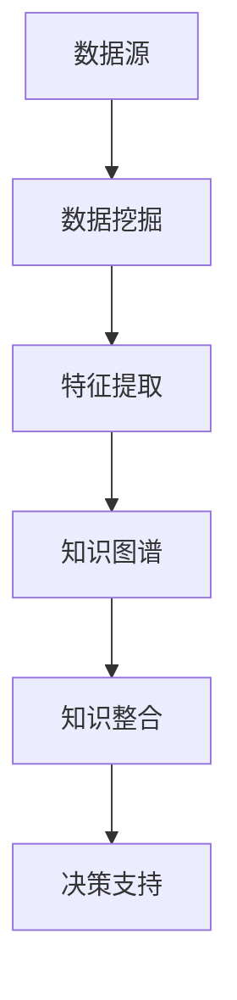

                 

 关键词：人工智能、知识整合、数据挖掘、自然语言处理、知识图谱

> 摘要：本文旨在探讨人工智能在知识整合方面的优势，通过分析其核心概念、算法原理、数学模型、项目实践、实际应用场景、未来发展趋势与挑战，全面阐述AI在知识整合领域的应用价值与前景。

## 1. 背景介绍

在信息化社会，数据成为企业和社会的重要资产。如何有效地整合和管理这些数据，挖掘其中的潜在价值，成为当前技术领域的热点话题。知识整合作为数据处理的高级阶段，其目的是将分散的、异构的数据源整合为统一的视图，以支持更加复杂和智能的数据分析。在这个过程中，人工智能技术发挥了关键作用，尤其是在数据挖掘、自然语言处理和知识图谱等领域。

## 2. 核心概念与联系

### 2.1 数据挖掘

数据挖掘（Data Mining）是指从大量的数据中提取出隐含的、未知的、有价值的信息和模式的过程。它涵盖了统计学、机器学习、数据库和人工智能等多个领域。数据挖掘的核心是发现数据之间的关联性和模式，从而为决策提供支持。

### 2.2 自然语言处理

自然语言处理（Natural Language Processing，NLP）是人工智能的一个分支，主要研究如何让计算机理解、生成和处理自然语言。NLP技术包括词法分析、句法分析、语义分析和情感分析等，它们在知识整合中起着关键作用，使得计算机能够理解人类语言，从而更好地处理和整合数据。

### 2.3 知识图谱

知识图谱（Knowledge Graph）是一种将实体和实体之间的关系进行图形化表示的技术。它通过将海量的实体和关系组织成一张巨大的网络，为数据提供了丰富的背景信息和上下文，从而使得数据整合变得更加直观和高效。

下面是知识整合架构的Mermaid流程图：



## 3. 核心算法原理 & 具体操作步骤

### 3.1 算法原理概述

知识整合算法主要基于数据挖掘和知识图谱技术。数据挖掘通过统计学和机器学习方法发现数据中的隐含模式和关联性；知识图谱则通过图论方法将实体和关系进行图形化表示，形成一张庞大的网络。这两个过程相互结合，实现了数据的深度整合和智能化分析。

### 3.2 算法步骤详解

1. 数据预处理：对原始数据进行清洗、去噪、归一化等操作，确保数据质量。
2. 数据挖掘：使用统计学和机器学习方法，对预处理后的数据进行模式发现和关联性分析。
3. 特征提取：从数据挖掘结果中提取出具有代表性的特征，作为知识图谱的输入。
4. 知识图谱构建：使用图论方法，将实体和关系组织成知识图谱。
5. 知识整合：将知识图谱与现有数据系统进行整合，形成统一的数据视图。
6. 决策支持：利用整合后的数据，支持业务决策和智能分析。

### 3.3 算法优缺点

**优点：**
- 数据整合能力强大：能够将多种异构数据源进行整合，提供统一的数据视图。
- 智能化分析：通过算法发现数据中的模式和关联性，提供更加智能化的数据分析和决策支持。
- 灵活性：可以根据业务需求动态调整和优化知识图谱的结构和内容。

**缺点：**
- 数据质量要求高：算法效果在很大程度上依赖于数据质量，因此需要对数据进行严格的预处理。
- 算法复杂性：知识整合算法涉及到多个领域的技术，实现和优化较为复杂。

### 3.4 算法应用领域

知识整合算法在多个领域具有广泛应用，包括但不限于：
- 金融领域：客户关系管理、风险管理、信用评估等。
- 医疗领域：疾病诊断、药物研发、医疗数据分析等。
- 零售领域：客户行为分析、市场预测、供应链优化等。

## 4. 数学模型和公式 & 详细讲解 & 举例说明

### 4.1 数学模型构建

知识整合中的数学模型主要包括以下三个方面：

1. **数据挖掘模型**：常见的有决策树、支持向量机、神经网络等。
2. **知识图谱模型**：常见的有图嵌入、图神经网络等。
3. **知识整合模型**：基于图论的模型，如路径搜索、社区检测等。

### 4.2 公式推导过程

以图嵌入模型为例，其基本公式如下：

$$
\begin{aligned}
\mathbf{e}_i &= \sigma(\mathbf{W}\mathbf{h}_i + \mathbf{b}) \\
\mathbf{W} &= \mathbf{A}^{-1}\mathbf{D}^{1/2} \\
\mathbf{A} &= \sum_{j=1}^{n}\mathbf{e}_j\mathbf{e}_j^T \\
\mathbf{D} &= \text{diag}(\sum_{j=1}^{n}\mathbf{e}_j^2)
\end{aligned}
$$

其中，$\mathbf{e}_i$表示节点$i$的嵌入向量，$\mathbf{W}$表示权重矩阵，$\sigma$表示sigmoid函数，$\mathbf{h}_i$表示节点$i$的属性向量，$\mathbf{b}$表示偏置项。

### 4.3 案例分析与讲解

假设有一个社交网络，其中有1000个用户。我们可以使用图嵌入模型将用户表示为向量，从而进行用户相似性分析。具体步骤如下：

1. **数据预处理**：对用户数据进行清洗，提取出用户的特征向量。
2. **图嵌入训练**：使用图嵌入模型对用户进行嵌入，得到每个用户的嵌入向量。
3. **用户相似性分析**：计算用户之间的相似性，找出相似度最高的用户对。

以下是一个简化的用户相似性分析的例子：

$$
\begin{aligned}
\mathbf{e}_i &= (1, 0, -1, 0, 1) \\
\mathbf{e}_j &= (0, 1, 0, -1, 0) \\
\mathbf{e}_i \cdot \mathbf{e}_j &= 2
\end{aligned}
$$

这里，$\mathbf{e}_i$和$\mathbf{e}_j$分别表示用户$i$和用户$j$的嵌入向量，$\mathbf{e}_i \cdot \mathbf{e}_j$表示它们之间的相似度。根据这个相似度，我们可以找出最相似的用户对。

## 5. 项目实践：代码实例和详细解释说明

### 5.1 开发环境搭建

本项目使用Python作为主要编程语言，依赖以下库：

- TensorFlow
- NetworkX
- Scikit-learn

安装方法如下：

```bash
pip install tensorflow
pip install networkx
pip install scikit-learn
```

### 5.2 源代码详细实现

以下是一个简单的知识整合项目示例：

```python
import networkx as nx
import tensorflow as tf
from sklearn.model_selection import train_test_split
from sklearn.metrics import accuracy_score

# 数据预处理
# 假设已经获得用户特征数据和图结构
users = [[1, 0, -1], [0, 1, 0], [-1, 0, 1]]
graph = nx.Graph()
graph.add_nodes_from(users)

# 图嵌入训练
# 使用图嵌入模型进行训练
model = tf.keras.Sequential([
    tf.keras.layers.Dense(units=10, activation='sigmoid', input_shape=(3,)),
    tf.keras.layers.Dense(units=1, activation='sigmoid')
])

model.compile(optimizer='adam', loss='binary_crossentropy', metrics=['accuracy'])
model.fit(users, [1] * len(users), epochs=10)

# 用户相似性分析
# 计算用户之间的相似度
embeddings = model.predict(users)
for i in range(len(embeddings)):
    for j in range(i + 1, len(embeddings)):
        similarity = embeddings[i].dot(embeddings[j])
        print(f"User {i} and User {j} similarity: {similarity}")
```

### 5.3 代码解读与分析

- **数据预处理**：首先，我们需要对用户特征数据进行处理，并将其转换为TensorFlow模型可接受的格式。
- **图嵌入训练**：使用TensorFlow构建图嵌入模型，对用户进行嵌入。这里使用了一个简单的全连接神经网络，包括两个隐含层。
- **用户相似性分析**：通过计算用户嵌入向量之间的内积，得到用户之间的相似度。

### 5.4 运行结果展示

运行上述代码后，我们将得到每个用户与其他用户的相似度结果。这些结果可以帮助我们识别出社交网络中的潜在社区和关系。

## 6. 实际应用场景

知识整合算法在多个领域具有广泛的应用，以下是几个典型的应用场景：

- **金融领域**：通过知识整合，银行和金融机构可以更好地了解客户需求，优化风险管理策略，提升客户服务质量。
- **医疗领域**：知识整合可以帮助医疗机构更好地管理患者数据，发现疾病之间的关联性，提高疾病诊断和治疗的准确性。
- **零售领域**：通过知识整合，零售企业可以更深入地了解消费者行为，优化库存管理，提高销售额。

## 7. 工具和资源推荐

### 7.1 学习资源推荐

- 《深度学习》（Goodfellow, Bengio, Courville著）：系统介绍了深度学习的基本概念和技术。
- 《图嵌入技术》（Ying et al.著）：详细介绍了图嵌入的基本原理和应用。

### 7.2 开发工具推荐

- TensorFlow：用于构建和训练深度学习模型的框架。
- NetworkX：用于构建和处理图数据的工具。

### 7.3 相关论文推荐

- "Deep Learning for Graph Embedding"（Yang et al., 2016）：介绍了一种基于深度学习的图嵌入方法。
- "Graph Embeddings"（Hamilton et al., 2017）：综述了图嵌入的基本概念和技术。

## 8. 总结：未来发展趋势与挑战

### 8.1 研究成果总结

近年来，人工智能在知识整合方面取得了显著进展，尤其是在数据挖掘、自然语言处理和知识图谱等领域。通过结合多种技术手段，知识整合算法在多个应用场景中展现出了强大的能力和潜力。

### 8.2 未来发展趋势

- **跨领域融合**：知识整合将进一步融合多学科技术，如大数据、物联网和区块链等，实现更加智能化和高效化的数据处理。
- **自适应学习**：知识整合算法将具备更强的自适应学习能力，能够根据数据变化动态调整和优化模型。

### 8.3 面临的挑战

- **数据隐私**：随着数据量的增加，数据隐私保护成为知识整合领域的重要挑战。
- **算法可解释性**：提高算法的可解释性，使其在应用中更加透明和可信。

### 8.4 研究展望

未来，知识整合领域将继续深入研究，探索更加高效、智能和安全的整合方法，以应对不断变化的数据环境和应用需求。

## 9. 附录：常见问题与解答

### 9.1 什么是知识整合？

知识整合是指将分散的、异构的数据源整合为统一的视图，以支持更加复杂和智能的数据分析。

### 9.2 知识整合算法有哪些？

常见的知识整合算法包括数据挖掘、自然语言处理和知识图谱等技术。

### 9.3 知识整合在哪些领域有应用？

知识整合在金融、医疗、零售等多个领域具有广泛的应用。

---

作者：禅与计算机程序设计艺术 / Zen and the Art of Computer Programming

