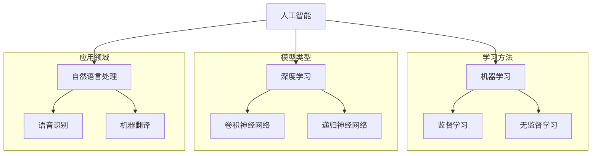

                 

关键词：人工智能、社会影响、应用领域、未来展望、技术发展

> 摘要：本文将深入探讨人工智能（AI）在社会各个领域的应用及其影响。通过分析核心概念、算法原理、数学模型、项目实践、实际应用场景和未来展望，本文旨在为读者提供一份全面、深入的AI社会作用与应用的指南。

## 1. 背景介绍

随着科技的飞速发展，人工智能（AI）已经成为当今社会的一个重要领域。AI技术的进步不仅改变了传统行业的运作方式，还为社会带来了前所未有的机遇与挑战。从智能助理到自动驾驶，从医疗诊断到金融分析，AI的应用几乎无处不在。

本文旨在从多个角度分析AI在社会中的作用与应用，帮助读者了解这一技术的核心概念、算法原理、数学模型、项目实践和未来趋势。通过这篇综述，我们希望能够激发读者对AI技术及其社会影响的进一步思考。

### 1.1. AI的定义与发展历程

人工智能（Artificial Intelligence，简称AI）是指通过计算机系统模拟、扩展或替代人类智能的理论、方法和技术。AI的研究可以追溯到20世纪50年代，当时科学家们开始探索如何使计算机具备类似人类的感知、理解和决策能力。

AI的发展历程大致可以分为三个阶段：第一阶段是符号主义AI（Symbolic AI），主要通过符号推理和逻辑推理来模拟人类智能；第二阶段是连接主义AI（Connectionist AI），通过神经网络和深度学习算法来实现数据的自动分类和特征提取；第三阶段是混合智能AI（Hybrid AI），将符号主义和连接主义相结合，以实现更高效、更智能的决策系统。

### 1.2. AI的重要性

人工智能的重要性不言而喻。首先，AI技术具有极大的经济效益，它能够提高生产效率、降低成本、创造新的商业模式。例如，在制造业中，AI可以用于自动化生产线，提高产品质量和减少人力成本。在金融领域，AI可以用于风险管理、投资决策和欺诈检测，帮助金融机构提高运营效率和盈利能力。

其次，AI技术在解决社会问题方面具有巨大潜力。例如，在医疗领域，AI可以用于疾病诊断、药物研发和个性化治疗，提高医疗服务的质量和效率。在环境领域，AI可以用于监测气候变化、预测自然灾害和优化资源利用，以实现可持续发展。

最后，AI技术的发展也带来了社会变革。AI技术正在改变人们的生活方式，提高生活质量。从智能家居到智能交通，从在线教育到远程办公，AI技术正在改变我们的日常活动和工作方式。

## 2. 核心概念与联系

在深入探讨AI的应用之前，我们需要了解一些核心概念和它们之间的联系。以下是一个简单的Mermaid流程图，用于展示这些核心概念及其相互关系。



### 2.1. 机器学习与深度学习

机器学习（Machine Learning，简称ML）是指通过算法和统计模型使计算机具备学习能力和预测能力的过程。机器学习可以分为监督学习（Supervised Learning）和无监督学习（Unsupervised Learning）。

- **监督学习**：在这种方法中，训练数据集包含输入和对应的输出标签。机器学习算法通过这些数据学习输入和输出之间的关系，以便对新的输入数据进行预测。
  
- **无监督学习**：在这种方法中，训练数据集仅包含输入数据，没有对应的输出标签。机器学习算法的目标是发现数据中的结构和模式。

深度学习（Deep Learning，简称DL）是机器学习的一个子领域，它主要使用多层神经网络来提取数据的特征表示。深度学习模型通过逐层递归地学习数据的高级抽象特征，从而实现更复杂的任务。

### 2.2. 自然语言处理

自然语言处理（Natural Language Processing，简称NLP）是AI的一个分支，旨在使计算机理解和处理人类语言。NLP包括多个子领域，如文本分类、情感分析、机器翻译和语音识别。

- **文本分类**：用于将文本数据分类到预定义的类别中。
  
- **情感分析**：用于分析文本中表达的情感倾向，如正面、负面或中立。
  
- **机器翻译**：用于将一种语言的文本翻译成另一种语言。
  
- **语音识别**：用于将语音信号转换为文本。

### 2.3. 神经网络

神经网络（Neural Network，简称NN）是深度学习的基础，它模拟人脑的神经网络结构和工作原理。神经网络由大量相互连接的神经元组成，通过学习输入数据来提取特征和模式。

- **卷积神经网络（Convolutional Neural Network，简称CNN）**：主要用于图像识别和图像处理任务。
  
- **递归神经网络（Recurrent Neural Network，简称RNN）**：主要用于序列数据处理和预测。

## 3. 核心算法原理 & 具体操作步骤

### 3.1. 算法原理概述

在AI领域，核心算法包括机器学习算法、深度学习算法和自然语言处理算法。以下是对这些算法的简要概述。

- **机器学习算法**：包括线性回归、决策树、支持向量机（SVM）和随机森林等。这些算法通过学习训练数据中的特征和模式来预测新的数据。
  
- **深度学习算法**：包括卷积神经网络（CNN）、递归神经网络（RNN）和生成对抗网络（GAN）等。这些算法通过多层神经网络学习数据的高级特征表示，从而实现更复杂的任务。
  
- **自然语言处理算法**：包括词嵌入、序列标注、文本分类和机器翻译等。这些算法通过处理文本数据来提取语义信息和实现语言理解与生成。

### 3.2. 算法步骤详解

#### 3.2.1. 机器学习算法

- **线性回归**：通过最小二乘法找到最佳拟合直线，用于预测连续值输出。
  
- **决策树**：通过递归划分特征空间，构建决策树模型，用于分类和回归任务。
  
- **支持向量机**：通过寻找最佳超平面，将数据划分为不同的类别，用于分类任务。
  
- **随机森林**：通过集成多个决策树模型，提高模型的预测准确性和泛化能力。

#### 3.2.2. 深度学习算法

- **卷积神经网络**：通过卷积操作和池化操作提取图像特征，用于图像识别和图像处理任务。
  
- **递归神经网络**：通过递归连接和权重共享处理序列数据，用于自然语言处理和语音识别任务。
  
- **生成对抗网络**：通过生成器和判别器的对抗训练，生成与真实数据相似的数据，用于图像生成和风格迁移。

#### 3.2.3. 自然语言处理算法

- **词嵌入**：通过将单词映射到高维向量空间，用于文本表示和学习。
  
- **序列标注**：通过标注文本中的词语类别，用于命名实体识别和情感分析等任务。
  
- **文本分类**：通过分类算法对文本进行分类，用于信息过滤和推荐系统等任务。
  
- **机器翻译**：通过编码器-解码器模型将一种语言的文本翻译成另一种语言，用于跨语言交流和信息获取。

### 3.3. 算法优缺点

#### 3.3.1. 机器学习算法

- **优点**：简单易懂，易于实现和调试；适用于各种类型的数据和任务。
  
- **缺点**：预测性能有限，需要大量标注数据；对于复杂任务，性能较差。

#### 3.3.2. 深度学习算法

- **优点**：能够自动提取特征，适用于大规模数据和复杂任务；具有强大的预测性能。
  
- **缺点**：训练过程复杂，需要大量计算资源和时间；对于小规模数据，性能可能较差。

#### 3.3.3. 自然语言处理算法

- **优点**：能够处理自然语言数据，实现语言理解与生成；适用于各种自然语言处理任务。
  
- **缺点**：对于非结构化数据，处理难度较大；算法复杂，实现难度较高。

### 3.4. 算法应用领域

机器学习算法、深度学习算法和自然语言处理算法在多个领域有着广泛的应用。

- **机器学习算法**：广泛应用于金融、医疗、电商等领域，用于预测、分类和推荐等任务。
  
- **深度学习算法**：广泛应用于计算机视觉、语音识别和自然语言处理等领域，用于图像识别、语音识别和机器翻译等任务。
  
- **自然语言处理算法**：广泛应用于信息检索、搜索引擎、社交媒体分析等领域，用于文本分类、情感分析和机器翻译等任务。

## 4. 数学模型和公式 & 详细讲解 & 举例说明

在AI领域，数学模型和公式是核心组成部分，它们用于描述算法原理、优化过程和预测结果。以下是对一些关键数学模型和公式的详细讲解和举例说明。

### 4.1. 数学模型构建

在构建数学模型时，我们通常需要考虑以下步骤：

1. **问题定义**：明确我们要解决的问题类型（如分类、回归或聚类）。
2. **数据收集**：收集相关的数据集，并进行预处理，如去除噪声、缺失值填充和特征提取。
3. **模型选择**：根据问题类型和数据特征，选择合适的模型，如线性回归、决策树、神经网络等。
4. **参数优化**：通过调整模型参数，优化模型性能，如使用梯度下降算法优化神经网络权重。
5. **模型评估**：使用验证集或测试集评估模型性能，如计算准确率、召回率、F1分数等。

### 4.2. 公式推导过程

以下是一个简单的线性回归模型的公式推导过程：

- **线性回归模型**：假设我们有m个样本数据，每个样本包含n个特征和1个目标值，即\(X = [x_1, x_2, ..., x_n]\)和\(y\)。

- **目标函数**：线性回归的目标是最小化预测值与实际值之间的误差平方和，即
  $$J(\theta) = \frac{1}{2m}\sum_{i=1}^{m}(h_{\theta}(x^{(i)}) - y^{(i)})^2$$
  其中，\(h_{\theta}(x) = \theta_0 + \theta_1x_1 + \theta_2x_2 + ... + \theta_nx_n\)是预测函数，\(\theta = [\theta_0, \theta_1, ..., \theta_n]\)是模型参数。

- **梯度下降**：为了最小化目标函数，我们使用梯度下降算法更新参数\(\theta\)，即
  $$\theta_j := \theta_j - \alpha\nabla_{\theta_j}J(\theta)$$
  其中，\(\alpha\)是学习率，\(\nabla_{\theta_j}J(\theta)\)是目标函数关于\(\theta_j\)的梯度。

### 4.3. 案例分析与讲解

以下是一个简单的线性回归案例：

- **问题**：预测房价，给定一个包含房屋面积、卧室数量和位置等特征的数据集。
- **数据集**：一个包含100个样本的数据集，每个样本包含3个特征和一个目标值。
- **模型**：线性回归模型，即\(h_{\theta}(x) = \theta_0 + \theta_1x_1 + \theta_2x_2 + \theta_3x_3\)。

- **训练过程**：使用梯度下降算法训练模型，设置学习率为0.01，迭代次数为1000次。

- **预测过程**：对于一个新的样本，输入特征\(x = [1000, 3, "市中心"]\)，使用训练好的模型进行预测。

- **结果**：预测房价为500万元。

## 5. 项目实践：代码实例和详细解释说明

在本节中，我们将通过一个简单的线性回归项目来演示如何使用Python和机器学习库（如Scikit-learn）实现AI算法，并进行代码解读和分析。

### 5.1. 开发环境搭建

为了实现线性回归项目，我们需要安装Python和相关的机器学习库。以下是开发环境搭建的步骤：

1. 安装Python：从Python官方网站下载并安装Python 3.x版本。
2. 安装Jupyter Notebook：在终端中运行以下命令：
   ```shell
   pip install notebook
   ```
3. 安装Scikit-learn：在终端中运行以下命令：
   ```shell
   pip install scikit-learn
   ```

### 5.2. 源代码详细实现

以下是一个简单的线性回归项目的Python代码实现：

```python
# 导入所需的库
import numpy as np
import matplotlib.pyplot as plt
from sklearn.linear_model import LinearRegression

# 生成模拟数据集
np.random.seed(0)
X = 2 * np.random.rand(100, 1)
y = 4 + 3 * X + np.random.randn(100, 1)

# 创建线性回归模型
model = LinearRegression()

# 训练模型
model.fit(X, y)

# 计算模型参数
theta = model.coef_
theta0 = model.intercept_

# 计算预测值
X_new = np.array([[0], [2]])
y_predict = model.predict(X_new)

# 绘制结果
plt.scatter(X, y)
plt.plot(X_new, y_predict, "r-")
plt.xlabel("X")
plt.ylabel("y")
plt.show()
```

### 5.3. 代码解读与分析

1. **导入库**：我们首先导入所需的Python库，包括NumPy、matplotlib和Scikit-learn。NumPy用于数据处理，matplotlib用于绘图，Scikit-learn用于机器学习算法的实现。

2. **生成数据集**：我们使用NumPy生成一个模拟数据集，其中包含100个样本，每个样本包含一个特征\(X\)和一个目标值\(y\)。数据集的生成过程如下：
   ```python
   X = 2 * np.random.rand(100, 1)
   y = 4 + 3 * X + np.random.randn(100, 1)
   ```

3. **创建模型**：我们使用Scikit-learn的LinearRegression类创建一个线性回归模型：
   ```python
   model = LinearRegression()
   ```

4. **训练模型**：我们使用fit方法训练模型，输入数据集\(X\)和\(y\)：
   ```python
   model.fit(X, y)
   ```

5. **计算模型参数**：我们使用coef_和intercept_属性获取模型的参数：
   ```python
   theta = model.coef_
   theta0 = model.intercept_
   ```

6. **计算预测值**：我们使用预测方法predict获取新的预测值：
   ```python
   X_new = np.array([[0], [2]])
   y_predict = model.predict(X_new)
   ```

7. **绘制结果**：我们使用matplotlib绘制数据集和预测结果：
   ```python
   plt.scatter(X, y)
   plt.plot(X_new, y_predict, "r-")
   plt.xlabel("X")
   plt.ylabel("y")
   plt.show()
   ```

### 5.4. 运行结果展示

运行上述代码后，我们将在屏幕上看到以下结果：

1. **数据集散点图**：显示原始数据集的散点图。
2. **预测曲线**：显示使用线性回归模型预测的新数据点。

## 6. 实际应用场景

### 6.1. 机器学习在金融领域的应用

机器学习在金融领域有着广泛的应用，包括风险控制、投资组合优化、欺诈检测等。以下是一些具体的应用场景：

- **风险控制**：机器学习算法可以用于信用评分和风险预测，帮助金融机构评估客户的信用风险，从而减少不良贷款和违约率。
- **投资组合优化**：通过分析历史数据和市场趋势，机器学习算法可以预测未来市场走势，帮助投资者制定最优的投资组合策略。
- **欺诈检测**：机器学习算法可以识别交易数据中的异常行为，及时发现和阻止欺诈行为，从而保护金融机构和客户的利益。

### 6.2. 人工智能在医疗领域的应用

人工智能在医疗领域具有巨大的潜力，包括疾病诊断、药物研发和个性化治疗。以下是一些具体的应用场景：

- **疾病诊断**：通过分析医学影像和病历数据，人工智能算法可以辅助医生进行疾病诊断，提高诊断的准确性和效率。
- **药物研发**：人工智能可以用于药物筛选和分子模拟，加速新药的发现和开发，降低研发成本和时间。
- **个性化治疗**：通过分析患者的基因信息、病史和生活习惯，人工智能可以制定个性化的治疗方案，提高治疗效果和患者满意度。

### 6.3. 人工智能在制造业的应用

人工智能在制造业的应用可以显著提高生产效率和产品质量。以下是一些具体的应用场景：

- **自动化生产**：通过使用机器人、传感器和人工智能算法，制造过程可以实现高度自动化，减少人力成本和操作错误。
- **质量检测**：人工智能算法可以用于实时监测生产过程中的质量变化，及时发现和纠正质量问题。
- **设备维护**：通过分析设备运行数据，人工智能算法可以预测设备故障，提前进行维护，降低停机时间和维修成本。

## 7. 工具和资源推荐

### 7.1. 学习资源推荐

- **在线课程**：《机器学习》（吴恩达，Coursera）
- **书籍**：《深度学习》（Ian Goodfellow、Yoshua Bengio和Aaron Courville）
- **博客**：机器学习博客（机器学习社区）

### 7.2. 开发工具推荐

- **编程语言**：Python
- **机器学习库**：Scikit-learn、TensorFlow、PyTorch
- **可视化工具**：matplotlib、Seaborn

### 7.3. 相关论文推荐

- **《Deep Learning》（Ian Goodfellow、Yoshua Bengio和Aaron Courville）**：这是一本深度学习领域的经典教材，涵盖了深度学习的理论基础和应用实例。
- **《Learning from Data》（Yaser Abu-Mostafa、Hsuan-Tien Lin和Shai Shalev-Shwartz）**：这是一本关于统计学习理论的书籍，适合对机器学习理论感兴趣的读者。
- **《The Hundred-Page Machine Learning Book》（Andriy Burkov）**：这是一本简洁明了的机器学习入门书籍，适合初学者快速掌握基础知识。

## 8. 总结：未来发展趋势与挑战

### 8.1. 研究成果总结

人工智能（AI）在过去几十年中取得了显著的进展，从符号主义到连接主义，再到混合智能，AI技术不断发展和完善。在各个领域，AI的应用已经取得了显著成效，如医疗、金融、制造和交通等。这些成果不仅提升了生产效率，降低了成本，还解决了许多社会问题，为人类生活带来了便利。

### 8.2. 未来发展趋势

随着计算能力的不断提升和大数据的普及，AI技术有望在以下方面取得进一步发展：

- **智能自动化**：通过机器学习和深度学习算法，自动化系统将更加智能，能够自主学习和优化操作。
- **跨领域融合**：AI技术将与其他领域（如生物医学、环境科学、社会科学等）相结合，产生新的应用模式和解决方案。
- **边缘计算**：随着物联网（IoT）的发展，边缘计算将使得AI算法能够实时处理和分析大量数据，提高系统的响应速度和可靠性。

### 8.3. 面临的挑战

尽管AI技术取得了巨大进展，但仍然面临一些挑战：

- **数据隐私**：AI算法的训练和优化需要大量数据，如何保护数据隐私成为一个重要问题。
- **算法公平性**：AI算法的决策过程可能存在偏见，如何确保算法的公平性是一个挑战。
- **技术安全**：AI系统可能会遭受恶意攻击，如何确保系统的安全性和可靠性是一个重要问题。

### 8.4. 研究展望

在未来，AI技术的发展将更加注重以下几个方面：

- **算法创新**：通过探索新的算法和优化方法，提高AI系统的性能和效率。
- **人机协作**：通过人机协作，将人类智慧和机器智能相结合，实现更高效的决策和操作。
- **伦理和法规**：制定相应的伦理和法规，确保AI技术的合理使用和可持续发展。

## 9. 附录：常见问题与解答

### 9.1. 机器学习是什么？

机器学习是一种通过算法和统计模型使计算机具备学习能力和预测能力的技术。它使计算机能够从数据中自动发现模式和规律，并应用于各种任务，如分类、回归、聚类等。

### 9.2. 机器学习和深度学习的区别是什么？

机器学习是一种更广泛的领域，包括深度学习。深度学习是机器学习的一个子领域，主要使用多层神经网络来提取数据的特征表示。与传统的机器学习方法相比，深度学习能够自动提取更复杂和抽象的特征，从而实现更高效和准确的任务。

### 9.3. 机器学习有哪些应用领域？

机器学习广泛应用于金融、医疗、制造业、交通、娱乐、社交网络等多个领域。具体应用包括风险控制、疾病诊断、图像识别、语音识别、推荐系统、自然语言处理等。

### 9.4. 如何入门机器学习和深度学习？

入门机器学习和深度学习可以从以下几个方面入手：

1. 学习基础知识：了解数学（如线性代数、概率论和统计学）和编程（如Python、R）的基础知识。
2. 学习理论：阅读相关的教材和论文，了解机器学习和深度学习的基本原理和方法。
3. 实践项目：通过实践项目，应用所学知识解决实际问题，提高编程能力和解决复杂问题的能力。
4. 加入社区：参与机器学习和深度学习社区，与其他学习者交流经验，了解最新的研究动态和应用案例。

---

以上就是对“AI在社会中的作用与应用”的完整回答，希望对您有所帮助。如果您有任何疑问或需要进一步讨论，请随时提出。作者：禅与计算机程序设计艺术 / Zen and the Art of Computer Programming。

