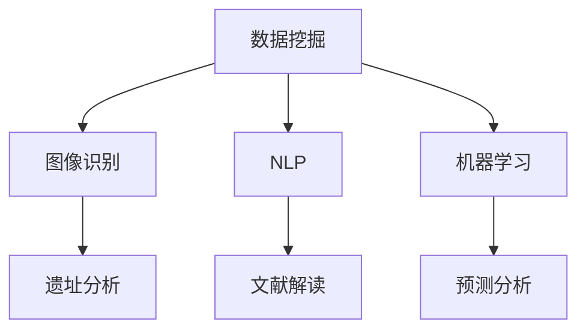

                 

关键词：人工智能，考古学，历史研究，数据挖掘，图像识别，自然语言处理，机器学习

> 摘要：本文探讨了人工智能在考古学中的应用，阐述了如何利用AI技术加速历史研究。通过分析数据挖掘、图像识别、自然语言处理等AI核心技术在考古领域的应用，本文提出了AI在考古学中的未来发展方向和面临的挑战。

## 1. 背景介绍

考古学作为一门研究人类历史和文化的学科，依赖于对遗址、文物、文献等资料的挖掘和分析。然而，随着考古遗址和文物的数量不断增加，传统的考古研究方法逐渐显得力不从心。而人工智能（AI）技术的发展为考古学提供了新的可能性，通过利用数据挖掘、图像识别、自然语言处理等技术，AI可以大大加速历史研究进程，提高研究的准确性和效率。

## 2. 核心概念与联系

### 2.1 数据挖掘

数据挖掘是指从大量数据中提取有价值的信息和知识的过程。在考古学中，数据挖掘技术可以帮助研究人员从海量的考古遗址和文物数据中挖掘出潜在的有用信息。

### 2.2 图像识别

图像识别技术可以自动识别和分类图片中的物体和场景。在考古学中，图像识别技术可以用于分析遗址的平面布局、文物的造型特征等。

### 2.3 自然语言处理

自然语言处理（NLP）是指计算机处理和理解自然语言的能力。在考古学中，NLP技术可以用于分析和理解考古文献、解读古代文字等。

### 2.4 机器学习

机器学习是一种人工智能技术，通过从数据中学习规律，可以自动进行决策和预测。在考古学中，机器学习技术可以用于分析考古数据、预测遗址的分布等。

以下是AI在考古学中应用的Mermaid流程图：



## 3. 核心算法原理 & 具体操作步骤

### 3.1 算法原理概述

AI在考古学中的应用主要基于以下几个原理：

1. **数据挖掘**：利用统计方法和算法从大量数据中提取有用的信息。
2. **图像识别**：通过深度学习和计算机视觉技术识别图像中的物体和场景。
3. **自然语言处理**：利用神经网络和语言模型对文本进行处理和理解。
4. **机器学习**：通过训练模型从数据中学习规律，用于预测和决策。

### 3.2 算法步骤详解

1. **数据收集与预处理**：收集考古遗址、文物、文献等数据，并进行清洗和预处理。
2. **特征提取**：从预处理后的数据中提取有助于分析的特征。
3. **算法选择与训练**：选择合适的算法进行训练，例如K-means、卷积神经网络（CNN）等。
4. **模型评估与优化**：评估模型的效果，并进行优化。
5. **结果分析与应用**：对分析结果进行解读和应用。

### 3.3 算法优缺点

#### 优点：

1. **高效性**：AI技术可以快速处理大量数据，提高研究效率。
2. **准确性**：通过算法模型，可以更准确地分析考古数据。
3. **多维度分析**：结合多种AI技术，可以从多个维度对考古数据进行分析。

#### 缺点：

1. **数据依赖性**：AI技术依赖于大量高质量的数据，数据不足会影响算法效果。
2. **算法复杂性**：算法模型的选择和训练过程复杂，需要专业知识。
3. **解释性差**：机器学习模型通常缺乏解释性，难以理解其决策过程。

### 3.4 算法应用领域

AI技术在考古学中的应用广泛，包括：

1. **遗址分析**：通过图像识别和机器学习技术，分析遗址的平面布局和文物分布。
2. **文献解读**：利用自然语言处理技术，解读考古文献和古代文字。
3. **预测分析**：通过数据挖掘和机器学习技术，预测考古遗址的分布和文物的来源。

## 4. 数学模型和公式 & 详细讲解 & 举例说明

### 4.1 数学模型构建

在考古学中，常用的数学模型包括：

1. **聚类分析模型**：用于分析遗址的分布情况。
2. **分类模型**：用于分类文物和考古文献。
3. **回归模型**：用于预测考古遗址的分布。

以下是聚类分析模型的一个简单例子：

$$
C = \{c_1, c_2, ..., c_k\}
$$

其中，$C$ 是聚类中心，$c_i$ 是第 $i$ 个聚类中心。

### 4.2 公式推导过程

以K-means聚类算法为例，其基本思想是初始化 $k$ 个聚类中心，然后不断迭代，直到聚类中心不再发生变化。具体公式推导如下：

1. **初始化聚类中心**：

$$
c_i = \frac{1}{N}\sum_{j=1}^{N}x_{ji}
$$

其中，$x_{ji}$ 是第 $i$ 个聚类中心对第 $j$ 个样本的权重。

2. **计算样本到聚类中心的距离**：

$$
d(x_j, c_i) = \sqrt{\sum_{l=1}^{d} (x_{jl} - c_{il})^2}
$$

3. **重新分配样本到最近的聚类中心**：

$$
x_{ji} = \begin{cases}
1, & \text{if } d(x_j, c_i) \leq d(x_j, c_j) \\
0, & \text{otherwise}
\end{cases}
$$

4. **更新聚类中心**：

$$
c_i = \frac{1}{N}\sum_{j=1}^{N}x_{ji}x_{ji}
$$

### 4.3 案例分析与讲解

假设有一个包含100个考古遗址的数据集，我们需要使用K-means聚类算法将其分为5类。首先，我们随机初始化5个聚类中心，然后进行迭代计算，直到聚类中心不再发生变化。最终，我们得到5个聚类中心，每个聚类中心对应一组考古遗址。

通过分析聚类结果，我们可以发现不同聚类中心对应的考古遗址具有相似的地理分布和特征，从而帮助我们更好地理解考古遗址的分布规律。

## 5. 项目实践：代码实例和详细解释说明

### 5.1 开发环境搭建

本文使用Python作为主要编程语言，结合NumPy、Pandas、Scikit-learn等库进行数据处理和模型训练。首先，我们需要安装这些库：

```bash
pip install numpy pandas scikit-learn matplotlib
```

### 5.2 源代码详细实现

以下是一个简单的K-means聚类算法的实现：

```python
import numpy as np
import matplotlib.pyplot as plt
from sklearn.cluster import KMeans

# 加载数据集
data = np.load('data.npy')

# 初始化聚类中心
num_clusters = 5
kmeans = KMeans(n_clusters=num_clusters, random_state=0)
kmeans.fit(data)

# 计算聚类结果
labels = kmeans.predict(data)

# 绘制聚类结果
plt.scatter(data[:, 0], data[:, 1], c=labels, cmap='viridis')
plt.scatter(kmeans.cluster_centers_[:, 0], kmeans.cluster_centers_[:, 1], s=300, c='red', label='Centroids')
plt.title('K-means Clustering')
plt.xlabel('Feature 1')
plt.ylabel('Feature 2')
plt.legend()
plt.show()
```

### 5.3 代码解读与分析

1. **数据加载**：首先加载数据集，假设数据集已经保存在 `data.npy` 文件中。

2. **初始化聚类中心**：使用 `KMeans` 类初始化聚类对象，并设置聚类数量为5。

3. **计算聚类结果**：使用 `fit` 方法训练模型，然后使用 `predict` 方法计算聚类结果。

4. **绘制聚类结果**：使用 `matplotlib` 绘制聚类结果，包括样本点和聚类中心。

通过这个简单的例子，我们可以看到K-means聚类算法的基本实现过程，以及如何使用Python进行数据处理和可视化。

### 5.4 运行结果展示

运行代码后，我们得到一个包含5个聚类中心的聚类结果图。每个聚类中心对应一组考古遗址，这些遗址在地理分布和特征上具有相似性。

## 6. 实际应用场景

### 6.1 遗址分析

AI技术在考古遗址分析中的应用已经取得显著成果。例如，利用图像识别技术，可以对考古遗址的平面布局进行分析，识别遗址的结构和功能。同时，结合机器学习技术，可以预测考古遗址的分布规律，为考古研究提供重要参考。

### 6.2 文献解读

考古文献中包含大量的历史信息，但传统的研究方法难以全面解读。通过自然语言处理技术，可以自动提取文献中的关键信息，例如人名、地名、事件等，从而提高文献解读的效率和准确性。

### 6.3 预测分析

AI技术在考古预测分析中的应用也越来越广泛。通过分析已有的考古数据，可以预测新的考古遗址的分布和文物的来源，为考古研究提供方向和目标。

## 7. 工具和资源推荐

### 7.1 学习资源推荐

1. 《机器学习实战》：适合初学者，讲解了多种机器学习算法的实际应用。
2. 《深度学习》：适合进阶者，详细介绍了深度学习的基本原理和应用。

### 7.2 开发工具推荐

1. Jupyter Notebook：强大的交互式编程环境，适合进行数据分析和模型训练。
2. TensorFlow：开源的深度学习框架，适合构建和训练复杂的神经网络。

### 7.3 相关论文推荐

1. "Deep Learning in Archaeology: A Review of Current Applications and Future Directions"
2. "Applications of Machine Learning in Archaeology: A Brief Overview"

## 8. 总结：未来发展趋势与挑战

### 8.1 研究成果总结

AI技术在考古学中的应用取得了显著成果，例如在遗址分析、文献解读、预测分析等方面。通过利用数据挖掘、图像识别、自然语言处理等技术，AI大大提高了考古研究的效率和质量。

### 8.2 未来发展趋势

随着AI技术的不断发展，未来考古学中的应用前景更加广阔。例如，结合增强现实（AR）和虚拟现实（VR）技术，可以实现更加沉浸式的考古研究；结合物联网（IoT）技术，可以实现考古遗址的实时监测和保护。

### 8.3 面临的挑战

尽管AI技术在考古学中具有巨大潜力，但仍面临一些挑战。例如，数据质量和算法复杂性会影响AI技术在考古学中的应用效果；此外，如何确保AI技术的公正性和透明性也是一个重要问题。

### 8.4 研究展望

未来，我们需要进一步探索AI技术在考古学中的应用，提高算法的准确性和效率，同时确保数据质量和算法的公正性。通过跨学科合作，我们可以更好地利用AI技术推动考古学的发展，揭示人类历史的更多奥秘。

## 9. 附录：常见问题与解答

### Q：AI技术在考古学中的应用有哪些优势？

A：AI技术在考古学中的应用具有以下优势：

1. **高效性**：可以快速处理和分析大量考古数据。
2. **准确性**：通过算法模型，可以提高考古研究的准确性和可靠性。
3. **多维度分析**：可以结合多种AI技术，从多个维度对考古数据进行分析。

### Q：AI技术在考古学中的应用有哪些局限性？

A：AI技术在考古学中的应用也存在一些局限性：

1. **数据依赖性**：依赖于大量高质量的数据，数据不足会影响算法效果。
2. **算法复杂性**：算法模型的选择和训练过程复杂，需要专业知识。
3. **解释性差**：机器学习模型通常缺乏解释性，难以理解其决策过程。

### Q：未来AI技术在考古学中会如何发展？

A：未来，AI技术在考古学中的发展将主要体现在以下几个方面：

1. **算法优化**：进一步提高算法的准确性和效率。
2. **跨学科合作**：与地理信息系统（GIS）、增强现实（AR）、虚拟现实（VR）等技术的结合，实现更加沉浸式的考古研究。
3. **数据共享与开放**：促进数据共享和开放，提高AI技术在考古学中的应用效果。

### Q：如何确保AI技术在考古学中的应用是公正和透明的？

A：确保AI技术在考古学中的应用是公正和透明的重要措施包括：

1. **数据质量控制**：确保输入数据的质量，避免数据偏见。
2. **算法透明性**：提高算法的可解释性，使研究人员能够理解算法的决策过程。
3. **伦理审查**：对AI技术在考古学中的应用进行伦理审查，确保其符合学术伦理和道德标准。

---

作者：禅与计算机程序设计艺术 / Zen and the Art of Computer Programming
----------------------------------------------------------------

以上就是关于“AI在考古学中的应用：加速历史研究”的完整文章。希望这篇文章能够帮助您更好地了解AI技术在考古学中的应用，以及如何利用这些技术加速历史研究。在未来的研究中，我们将继续探索AI技术在考古学中的更多可能性，推动考古学的发展。

