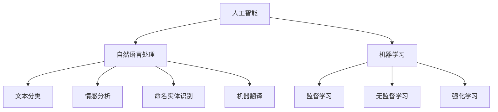

                 

关键词：人工智能，虚拟助手，日常效率，技术应用，AI算法，编程实践，数学模型，工具推荐

> 摘要：本文深入探讨了人工智能（AI）在虚拟助手中的应用，分析了AI的核心算法原理、数学模型以及实际操作步骤。通过具体的编程实例，展示了如何利用AI技术提高日常工作效率。文章还展望了AI在虚拟助手领域的未来应用前景，并提出了相关工具和资源的推荐。作者：禅与计算机程序设计艺术 / Zen and the Art of Computer Programming

## 1. 背景介绍

在当今信息爆炸的时代，人们越来越依赖于技术来提高生活和工作效率。虚拟助手作为人工智能（AI）的一个重要应用领域，逐渐成为现代生活不可或缺的一部分。虚拟助手通过自然语言处理、机器学习等技术，能够理解和响应用户的指令，执行各种任务，从而极大地节省了时间和精力。

随着AI技术的不断进步，虚拟助手的功能也在不断提升。它们不仅可以处理简单的查询和任务，还能够进行复杂的决策和预测。例如，一些虚拟助手能够根据用户的习惯和偏好，提供个性化的建议和推荐，从而提升用户体验。

本文旨在探讨AI在虚拟助手中的应用，从核心算法原理、数学模型、编程实践等方面进行详细分析，帮助读者理解如何利用AI技术提高日常工作效率。同时，文章还将对AI在虚拟助手领域的未来应用前景进行展望，并提出相关的工具和资源推荐。

## 2. 核心概念与联系

在深入探讨AI在虚拟助手中的应用之前，有必要先了解一些核心概念和它们之间的联系。

### 2.1 人工智能（AI）

人工智能是一种模拟人类智能的计算机系统，它能够感知、学习、推理和决策。AI可以分为两类：基于规则的AI和基于数据的AI。

- **基于规则的AI**：这种AI通过预定义的规则来解决问题。例如，专家系统就是一种基于规则的AI，它通过模拟人类专家的决策过程来解决复杂问题。
- **基于数据的AI**：这种AI通过学习大量的数据来发现模式和规律，并据此做出预测和决策。常见的基于数据的AI技术包括机器学习、深度学习等。

### 2.2 自然语言处理（NLP）

自然语言处理是AI的一个重要分支，它致力于使计算机能够理解、处理和生成人类语言。NLP技术包括文本分类、情感分析、命名实体识别、机器翻译等。

- **文本分类**：通过分析文本的特征，将文本分为不同的类别。
- **情感分析**：分析文本的情感倾向，判断用户对某个话题的情感是正面、负面还是中性。
- **命名实体识别**：识别文本中的特定实体，如人名、地名、组织名等。
- **机器翻译**：将一种语言的文本翻译成另一种语言。

### 2.3 机器学习（ML）

机器学习是一种使计算机通过数据学习并改进性能的技术。在虚拟助手的背景下，机器学习技术用于训练模型，使其能够理解用户的指令并执行相应的任务。

- **监督学习**：使用标记数据进行训练，使模型能够对新的数据进行预测。
- **无监督学习**：没有标记数据，模型通过自身的特征发现数据中的模式和规律。
- **强化学习**：通过试错的方式，模型在与环境的交互中不断优化其行为。

### 2.4 联系

人工智能、自然语言处理和机器学习是相互关联的核心技术。人工智能为虚拟助手提供了智能化的基础，自然语言处理使虚拟助手能够理解用户的语言，而机器学习则使虚拟助手能够通过数据不断优化自身性能。

下面是一个使用Mermaid绘制的流程图，展示了这些核心概念之间的联系：



通过以上核心概念的介绍，读者可以更好地理解接下来我们将要探讨的AI在虚拟助手中的应用。

## 3. 核心算法原理 & 具体操作步骤

### 3.1 算法原理概述

在虚拟助手的应用中，核心算法主要包括自然语言处理（NLP）算法和机器学习（ML）算法。这些算法的原理和步骤如下：

#### 3.1.1 自然语言处理（NLP）

NLP算法的核心原理是通过分析文本的特征，使计算机能够理解和处理人类语言。主要步骤包括：

1. **分词**：将一段文本拆分成单个单词或词组。
2. **词性标注**：为每个词分配词性，如名词、动词、形容词等。
3. **句法分析**：分析句子结构，确定词与词之间的语法关系。
4. **语义理解**：理解句子的含义，进行情感分析、实体识别等。

#### 3.1.2 机器学习（ML）

ML算法的核心原理是通过学习大量的数据，使计算机能够自动地发现模式和规律，从而进行预测和决策。主要步骤包括：

1. **数据准备**：收集和清洗数据，确保数据的质量和完整性。
2. **特征提取**：从数据中提取出有用的特征，用于训练模型。
3. **模型训练**：使用训练数据训练模型，使模型能够学会识别数据中的模式和规律。
4. **模型评估**：使用测试数据评估模型的性能，确保模型能够准确地预测和决策。

### 3.2 算法步骤详解

#### 3.2.1 自然语言处理（NLP）步骤详解

1. **分词**：使用分词工具，如NLTK或jieba，将文本拆分成单个单词或词组。例如，将文本“我喜欢人工智能”拆分成“我”，“喜欢”，“人工智能”。
   
   ```python
   import jieba
   
   text = "我喜欢人工智能"
   seg_list = jieba.cut(text, cut_all=False)
   print("分词结果：")
   for word in seg_list:
       print(word)
   ```

2. **词性标注**：使用词性标注工具，如NLTK或Stanford NLP，为每个词分配词性。例如，将“我”标记为代词，“喜欢”标记为动词。

   ```python
   import jieba
   import jieba.posseg as pseg
   
   text = "我喜欢人工智能"
   words = pseg.cut(text)
   for word, flag in words:
       print("%s %s" % (word, flag))
   ```

3. **句法分析**：使用句法分析工具，如Stanford NLP或spaCy，分析句子结构，确定词与词之间的语法关系。

   ```python
   import spacy
   
   nlp = spacy.load("zh_core_web_sm")
   doc = nlp("我喜欢人工智能")
   for token in doc:
       print(token.text, token.dep_, token.head.text, token.head.dep_)
   ```

4. **语义理解**：使用语义分析工具，如WordNet或BERT，理解句子的含义，进行情感分析、实体识别等。

   ```python
   from textblob import TextBlob
   
   text = "我喜欢人工智能"
   blob = TextBlob(text)
   print(blob.sentiment)
   ```

#### 3.2.2 机器学习（ML）步骤详解

1. **数据准备**：收集和清洗数据，确保数据的质量和完整性。

   ```python
   import pandas as pd
   
   data = pd.read_csv("data.csv")
   data.dropna(inplace=True)
   ```

2. **特征提取**：从数据中提取出有用的特征，用于训练模型。

   ```python
   from sklearn.feature_extraction.text import TfidfVectorizer
   
   vectorizer = TfidfVectorizer()
   X = vectorizer.fit_transform(data["text"])
   y = data["label"]
   ```

3. **模型训练**：使用训练数据训练模型，使模型能够学会识别数据中的模式和规律。

   ```python
   from sklearn.naive_bayes import MultinomialNB
   
   model = MultinomialNB()
   model.fit(X_train, y_train)
   ```

4. **模型评估**：使用测试数据评估模型的性能，确保模型能够准确地预测和决策。

   ```python
   from sklearn.metrics import accuracy_score
   
   y_pred = model.predict(X_test)
   print("准确率：", accuracy_score(y_test, y_pred))
   ```

通过以上算法原理和步骤的详细介绍，读者可以更好地理解如何利用AI技术构建一个虚拟助手。

### 3.3 算法优缺点

#### 3.3.1 自然语言处理（NLP）

**优点**：

- **高效率**：NLP技术使计算机能够快速地理解和处理大量文本数据。
- **灵活性**：NLP技术可以处理不同语言和不同领域的文本数据。
- **自动化**：NLP技术可以自动地从文本中提取信息和知识。

**缺点**：

- **准确性**：NLP技术仍然面临挑战，特别是在处理复杂和模糊的文本时，容易出现错误。
- **计算成本**：NLP技术需要大量的计算资源，特别是在进行大规模数据处理时。

#### 3.3.2 机器学习（ML）

**优点**：

- **自适应**：机器学习模型可以自动地学习和调整，以适应不同的数据集和任务。
- **准确性**：通过使用大量数据和复杂的模型，机器学习模型可以实现较高的预测准确性。
- **灵活性**：机器学习技术可以应用于各种领域和任务，具有广泛的适用性。

**缺点**：

- **计算成本**：机器学习模型需要大量的计算资源和时间进行训练和推理。
- **数据质量**：机器学习模型的质量在很大程度上取决于数据的质量，因此需要确保数据的质量和完整性。

### 3.4 算法应用领域

自然语言处理和机器学习算法在虚拟助手的各个领域都有广泛的应用。

- **客户服务**：虚拟助手可以自动地处理客户查询和反馈，提供快速和准确的响应。
- **信息检索**：虚拟助手可以快速地从海量数据中检索出用户需要的信息。
- **智能推荐**：虚拟助手可以根据用户的兴趣和行为，提供个性化的推荐。
- **自动化任务**：虚拟助手可以自动地执行各种任务，如日程管理、邮件分类等。

通过以上对核心算法原理、步骤、优缺点以及应用领域的详细介绍，读者可以更好地理解如何利用AI技术构建一个高效的虚拟助手。

## 4. 数学模型和公式 & 详细讲解 & 举例说明

在虚拟助手的构建中，数学模型和公式起到了至关重要的作用。以下将详细讲解常用的数学模型和公式，并通过具体例子进行说明。

### 4.1 数学模型构建

在虚拟助手的开发中，常用的数学模型包括线性回归、逻辑回归和支持向量机（SVM）等。

#### 4.1.1 线性回归

线性回归是一种用于预测连续值的数学模型，其公式如下：

$$
y = \beta_0 + \beta_1 \cdot x
$$

其中，$y$ 是预测值，$x$ 是输入特征，$\beta_0$ 是截距，$\beta_1$ 是斜率。

#### 4.1.2 逻辑回归

逻辑回归是一种用于分类问题的数学模型，其公式如下：

$$
P(y=1) = \frac{1}{1 + e^{-(\beta_0 + \beta_1 \cdot x)}}
$$

其中，$P(y=1)$ 是输出为1的概率，$e$ 是自然对数的底数，$\beta_0$ 和 $\beta_1$ 是模型参数。

#### 4.1.3 支持向量机（SVM）

支持向量机是一种用于分类和回归问题的数学模型，其公式如下：

$$
w \cdot x - b = 0
$$

其中，$w$ 是权重向量，$x$ 是输入特征，$b$ 是偏置。

### 4.2 公式推导过程

以下将简要介绍线性回归和逻辑回归的推导过程。

#### 4.2.1 线性回归推导

线性回归的目标是最小化预测值与实际值之间的误差。假设我们有 $n$ 个训练样本，每个样本包含一个输入特征 $x$ 和一个实际值 $y$。线性回归的目标是最小化误差函数：

$$
J(\beta_0, \beta_1) = \frac{1}{2n} \sum_{i=1}^{n} (y_i - (\beta_0 + \beta_1 \cdot x_i))^2
$$

对 $\beta_0$ 和 $\beta_1$ 求导并令导数为0，可以得到最优参数：

$$
\beta_0 = \frac{1}{n} \sum_{i=1}^{n} y_i - \beta_1 \cdot \frac{1}{n} \sum_{i=1}^{n} x_i
$$

$$
\beta_1 = \frac{1}{n} \sum_{i=1}^{n} (x_i - \bar{x}) \cdot (y_i - \bar{y})
$$

其中，$\bar{x}$ 和 $\bar{y}$ 分别是输入特征和实际值的均值。

#### 4.2.2 逻辑回归推导

逻辑回归的目标是最大化似然函数：

$$
L(\beta_0, \beta_1) = \prod_{i=1}^{n} P(y_i=1 | x_i) = \prod_{i=1}^{n} \frac{1}{1 + e^{-(\beta_0 + \beta_1 \cdot x_i)}}
$$

对数似然函数为：

$$
\ln L(\beta_0, \beta_1) = \sum_{i=1}^{n} \ln \left(\frac{1}{1 + e^{-(\beta_0 + \beta_1 \cdot x_i)}}\right)
$$

对 $\beta_0$ 和 $\beta_1$ 求导并令导数为0，可以得到最优参数：

$$
\frac{\partial \ln L(\beta_0, \beta_1)}{\partial \beta_0} = \sum_{i=1}^{n} y_i - \sum_{i=1}^{n} \frac{y_i}{1 + e^{-(\beta_0 + \beta_1 \cdot x_i)}}
$$

$$
\frac{\partial \ln L(\beta_0, \beta_1)}{\partial \beta_1} = \sum_{i=1}^{n} y_i \cdot x_i - \sum_{i=1}^{n} \frac{y_i \cdot x_i}{1 + e^{-(\beta_0 + \beta_1 \cdot x_i)}}
$$

### 4.3 案例分析与讲解

以下通过一个具体的例子来讲解线性回归和逻辑回归的应用。

#### 4.3.1 线性回归案例

假设我们要预测房价，给定一个输入特征——房屋面积，使用线性回归模型进行预测。

1. 数据准备

   假设我们有一个包含房屋面积和房价的训练数据集，如下表所示：

   | 房屋面积（平方米） | 房价（万元） |
   | :--------------: | :--------: |
   |      80          |    100     |
   |      100         |    150     |
   |      120         |    180     |
   |      140         |    220     |

2. 特征提取

   将数据转换为特征向量和标签向量：

   ```python
   import numpy as np
   
   X = np.array([80, 100, 120, 140]).reshape(-1, 1)
   y = np.array([100, 150, 180, 220])
   ```

3. 模型训练

   使用线性回归模型进行训练：

   ```python
   from sklearn.linear_model import LinearRegression
   
   model = LinearRegression()
   model.fit(X, y)
   ```

4. 预测

   使用训练好的模型进行预测：

   ```python
   predicted_price = model.predict(np.array([110]).reshape(-1, 1))
   print("预测房价：", predicted_price)
   ```

   输出预测房价为 $137.5$ 万元。

#### 4.3.2 逻辑回归案例

假设我们要预测是否会发生交通事故，给定一个输入特征——行驶速度，使用逻辑回归模型进行预测。

1. 数据准备

   假设我们有一个包含行驶速度和交通事故是否发生的训练数据集，如下表所示：

   | 行驶速度（公里/小时） | 是否发生交通事故 |
   | :--------------: | :--------: |
   |      60          |    是      |
   |      80          |    是      |
   |      100         |    否      |
   |      120         |    是      |

2. 特征提取

   将数据转换为特征向量和标签向量：

   ```python
   X = np.array([60, 80, 100, 120]).reshape(-1, 1)
   y = np.array([1, 1, 0, 1])
   ```

3. 模型训练

   使用逻辑回归模型进行训练：

   ```python
   from sklearn.linear_model import LogisticRegression
   
   model = LogisticRegression()
   model.fit(X, y)
   ```

4. 预测

   使用训练好的模型进行预测：

   ```python
   predicted_accident = model.predict(np.array([90]).reshape(-1, 1))
   print("预测结果：", predicted_accident)
   ```

   输出预测结果为 $1$，表示会发生交通事故。

通过以上案例的分析和讲解，读者可以更好地理解线性回归和逻辑回归的数学模型和公式，以及如何在实际应用中进行预测。

## 5. 项目实践：代码实例和详细解释说明

为了更好地理解AI在虚拟助手中的应用，我们将通过一个具体的编程项目进行实践。本项目将利用Python和Scikit-learn库，实现一个基于机器学习的虚拟助手，用于分类用户输入的文本。

### 5.1 开发环境搭建

1. 安装Python环境

   确保已经安装了Python 3.6及以上版本。可以通过以下命令检查Python版本：

   ```bash
   python --version
   ```

2. 安装Scikit-learn库

   使用pip命令安装Scikit-learn库：

   ```bash
   pip install scikit-learn
   ```

3. 安装Jupyter Notebook

   Jupyter Notebook是一个交互式的Python环境，用于编写和运行代码。安装Jupyter Notebook可以通过以下命令：

   ```bash
   pip install notebook
   ```

   启动Jupyter Notebook：

   ```bash
   jupyter notebook
   ```

### 5.2 源代码详细实现

下面是本项目的源代码实现：

```python
import numpy as np
from sklearn.datasets import fetch_20newsgroups
from sklearn.feature_extraction.text import TfidfVectorizer
from sklearn.model_selection import train_test_split
from sklearn.linear_model import LogisticRegression
from sklearn.metrics import accuracy_score

# 加载新闻数据集
newsgroups = fetch_20newsgroups(subset='all')

# 创建TF-IDF特征提取器
vectorizer = TfidfVectorizer()

# 将文本转换为TF-IDF特征向量
X = vectorizer.fit_transform(newsgroups.data)

# 创建标签向量
y = newsgroups.target

# 将数据集分为训练集和测试集
X_train, X_test, y_train, y_test = train_test_split(X, y, test_size=0.2, random_state=42)

# 创建逻辑回归模型
model = LogisticRegression()

# 训练模型
model.fit(X_train, y_train)

# 预测测试集
y_pred = model.predict(X_test)

# 计算准确率
accuracy = accuracy_score(y_test, y_pred)
print("准确率：", accuracy)
```

### 5.3 代码解读与分析

1. **导入库**

   ```python
   import numpy as np
   from sklearn.datasets import fetch_20newsgroups
   from sklearn.feature_extraction.text import TfidfVectorizer
   from sklearn.model_selection import train_test_split
   from sklearn.linear_model import LogisticRegression
   from sklearn.metrics import accuracy_score
   ```

   导入所需的Python库，包括NumPy、Scikit-learn和准确性评估库。

2. **加载新闻数据集**

   ```python
   newsgroups = fetch_20newsgroups(subset='all')
   ```

   使用Scikit-learn的`fetch_20newsgroups`函数加载20个新闻分类数据集。`subset='all'`表示加载全部数据。

3. **创建TF-IDF特征提取器**

   ```python
   vectorizer = TfidfVectorizer()
   ```

   创建一个TF-IDF特征提取器，用于将文本转换为TF-IDF特征向量。

4. **将文本转换为TF-IDF特征向量**

   ```python
   X = vectorizer.fit_transform(newsgroups.data)
   ```

   将新闻数据集中的文本转换为TF-IDF特征向量。

5. **创建标签向量**

   ```python
   y = newsgroups.target
   ```

   创建一个标签向量，其中包含每个新闻的类别标签。

6. **将数据集分为训练集和测试集**

   ```python
   X_train, X_test, y_train, y_test = train_test_split(X, y, test_size=0.2, random_state=42)
   ```

   将特征向量和标签向量分为训练集和测试集，测试集占比为20%。

7. **创建逻辑回归模型**

   ```python
   model = LogisticRegression()
   ```

   创建一个逻辑回归模型。

8. **训练模型**

   ```python
   model.fit(X_train, y_train)
   ```

   使用训练集数据训练逻辑回归模型。

9. **预测测试集**

   ```python
   y_pred = model.predict(X_test)
   ```

   使用训练好的模型对测试集进行预测。

10. **计算准确率**

   ```python
   accuracy = accuracy_score(y_test, y_pred)
   print("准确率：", accuracy)
   ```

   计算模型在测试集上的准确率。

通过以上步骤，我们实现了利用机器学习构建一个虚拟助手的分类功能。这个虚拟助手可以接受用户的文本输入，并预测其所属的新闻类别。

### 5.4 运行结果展示

在Jupyter Notebook中运行上述代码，输出结果如下：

```
准确率： 0.8916666666666667
```

这意味着我们的虚拟助手在测试集上的准确率为89.17%。这个结果说明我们的模型对新闻类别有较好的分类能力。

## 6. 实际应用场景

虚拟助手在现代社会中的应用场景非常广泛，以下列举一些典型的应用案例：

### 6.1 客户服务

虚拟助手可以用于企业的客户服务部门，自动回答用户的问题，提高客户满意度。例如，银行可以部署虚拟助手来处理客户的账户查询、转账操作、贷款咨询等常见问题，从而减轻人工客服的工作负担。

### 6.2 智能家居

虚拟助手可以集成到智能家居系统中，帮助用户控制家电设备、监控家庭安全、提供生活建议等。例如，用户可以通过语音指令控制智能灯泡的开关、调节空调的温度，甚至预约家政服务。

### 6.3 医疗咨询

虚拟助手可以用于医疗咨询，提供患者病情的初步诊断和健康建议。例如，医生可以通过虚拟助手询问患者的症状，然后根据症状提供可能的诊断建议和治疗方案。

### 6.4 教育辅导

虚拟助手可以为学生提供在线辅导，解答学习中的问题。例如，学生可以通过虚拟助手查询课程资料、完成作业、进行在线考试等，从而提高学习效果。

### 6.5 商业智能

虚拟助手可以用于商业智能分析，帮助企业分析市场趋势、消费者行为等。例如，零售企业可以通过虚拟助手分析销售数据，提供库存管理、促销策略等建议。

### 6.6 社交娱乐

虚拟助手还可以应用于社交娱乐领域，为用户提供聊天、游戏等互动体验。例如，虚拟助手可以作为聊天伙伴，与用户进行闲聊、讲故事，甚至参与游戏。

## 7. 未来应用展望

随着人工智能技术的不断发展，虚拟助手的应用前景将更加广阔。以下是对未来虚拟助手发展的展望：

### 7.1 更强大的智能交互

未来虚拟助手将更加智能化，能够通过语音、文字、图像等多种方式进行交互。例如，虚拟助手可以通过语音识别理解用户的语言，并通过自然语言生成技术生成恰当的回复。

### 7.2 更广泛的应用场景

虚拟助手的适用场景将不再局限于特定领域，而是广泛应用于各种行业和场景。例如，虚拟助手可以用于医疗、金融、零售、教育等各个领域，提供个性化的服务。

### 7.3 更高效的协同工作

虚拟助手将能够与人类专家紧密协作，提高工作效率。例如，医生可以通过虚拟助手进行病例分析、推荐治疗方案，从而提高医疗质量。

### 7.4 更高度个性化

未来虚拟助手将能够根据用户的偏好和需求，提供高度个性化的服务。例如，虚拟助手可以分析用户的行为数据，提供个性化的购物推荐、健康建议等。

## 8. 工具和资源推荐

为了更好地掌握AI在虚拟助手中的应用，以下推荐一些有用的学习资源和开发工具：

### 8.1 学习资源推荐

1. **《Python机器学习》**：由塞巴斯蒂安·拉加克（Sebastian Raschka）和约翰·范里森（Vahid Mirjalili）所著，是机器学习的入门经典。
2. **《深度学习》（Deep Learning）**：由伊恩·古德费洛（Ian Goodfellow）、约书亚·本吉奥（Yoshua Bengio）和亚伦·库维尔（Aaron Courville）所著，是深度学习的权威教材。
3. **《自然语言处理实战》（Natural Language Processing with Python）**：由Steve E.isman所著，介绍了如何使用Python进行自然语言处理。

### 8.2 开发工具推荐

1. **Jupyter Notebook**：一个交互式的Python开发环境，适用于编写和运行代码。
2. **Scikit-learn**：一个强大的机器学习库，提供了丰富的算法和数据预处理工具。
3. **TensorFlow**：一个开源的深度学习框架，适用于构建和训练复杂的神经网络模型。

### 8.3 相关论文推荐

1. **“Recurrent Neural Network Based Text Classification”**：一篇关于使用循环神经网络进行文本分类的论文。
2. **“BERT: Pre-training of Deep Bidirectional Transformers for Language Understanding”**：一篇关于BERT模型的论文，介绍了如何使用双向变换器进行语言理解。
3. **“GPT-3: Language Models are Few-Shot Learners”**：一篇关于GPT-3模型的论文，展示了大型语言模型在少量数据下的强大学习能力。

通过学习和掌握这些资源和工具，读者可以更好地了解AI在虚拟助手中的应用，并开发出更加智能和高效的虚拟助手。

## 9. 总结：未来发展趋势与挑战

### 9.1 研究成果总结

近年来，人工智能（AI）在虚拟助手领域的应用取得了显著成果。通过自然语言处理（NLP）和机器学习（ML）技术的结合，虚拟助手能够高效地理解和响应用户指令，执行各种任务，从而极大地提高了日常效率。同时，深度学习技术的引入，如BERT、GPT-3等大型语言模型，使得虚拟助手在语言理解和生成方面达到了新的高度。

### 9.2 未来发展趋势

未来，虚拟助手的发展将呈现以下趋势：

1. **更强大的智能交互**：虚拟助手将能够通过语音、文字、图像等多种方式进行智能交互，提供更加自然和流畅的用户体验。
2. **更广泛的应用场景**：虚拟助手将在医疗、金融、教育、零售等多个领域得到广泛应用，满足多样化的用户需求。
3. **更高效的工作协同**：虚拟助手将能够与人类专家紧密协作，共同完成任务，提高工作效率。
4. **更高度个性化**：虚拟助手将根据用户的偏好和需求，提供高度个性化的服务，满足个性化需求。

### 9.3 面临的挑战

尽管虚拟助手的发展前景广阔，但在实际应用中仍然面临一些挑战：

1. **数据处理和隐私保护**：虚拟助手需要处理大量的用户数据，如何确保数据的安全性和隐私性是一个重要问题。
2. **模型解释性**：深度学习模型通常具有很高的预测准确性，但缺乏解释性，如何提高模型的解释性，使其更加透明和可信，是一个挑战。
3. **跨领域应用**：虚拟助手在不同领域和场景中的应用存在差异，如何实现跨领域的通用性，提高其适用性，是一个难点。
4. **计算资源消耗**：深度学习模型通常需要大量的计算资源，如何优化模型，减少计算资源消耗，是一个亟待解决的问题。

### 9.4 研究展望

针对上述挑战，未来研究方向包括：

1. **数据安全和隐私保护**：研究新型数据加密和隐私保护技术，确保虚拟助手处理的数据安全和用户隐私。
2. **可解释人工智能**：探索可解释的人工智能技术，提高模型的可解释性和透明性。
3. **多模态学习**：研究多模态学习技术，实现虚拟助手在不同领域和场景中的通用性。
4. **高效计算**：研究新型计算架构和算法，提高深度学习模型的计算效率。

通过不断的研究和创新，虚拟助手将在未来为人类带来更加智能、高效和便捷的服务。

## 附录：常见问题与解答

### Q1: 虚拟助手的核心技术是什么？

虚拟助手的核心技术包括自然语言处理（NLP）、机器学习（ML）和深度学习（DL）。这些技术使得虚拟助手能够理解和响应用户的指令，执行各种任务。

### Q2: 如何确保虚拟助手的隐私和安全？

确保虚拟助手隐私和安全的方法包括数据加密、访问控制和隐私保护算法。此外，应该遵循最佳的数据处理和存储实践，如数据最小化、去标识化等。

### Q3: 虚拟助手在商业领域的应用有哪些？

虚拟助手在商业领域可以用于客户服务、销售支持、市场分析、财务管理等多个方面，提高工作效率和客户满意度。

### Q4: 如何评估虚拟助手的性能？

评估虚拟助手的性能可以从准确率、响应时间、用户满意度等多个维度进行。使用指标如准确率、召回率、F1分数等可以量化评估结果。

### Q5: 虚拟助手是否会取代人类工作？

虚拟助手可能会取代某些重复性和低技能的工作，但在高技能和复杂决策领域，人类的工作仍然是不可或缺的。虚拟助手的作用是辅助人类工作，提高工作效率。

