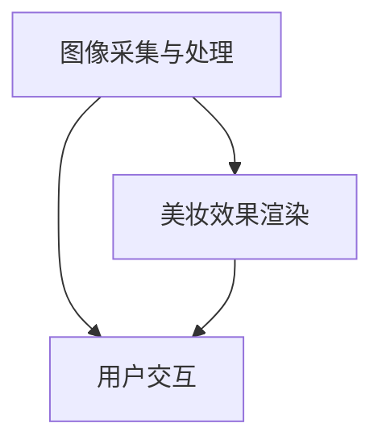

                 

关键词：人工智能，虚拟试妆，美妆产品，图像处理，计算机视觉，深度学习，3D建模，用户体验

> 摘要：本文探讨了人工智能在虚拟试妆领域中的应用，分析了其核心技术原理和实现步骤，并通过实际案例展示了虚拟试妆系统的开发过程和效果。本文旨在为业界提供关于虚拟试妆技术的全面理解，为未来美妆行业的发展提供新的思路。

## 1. 背景介绍

在过去的几年里，人工智能（AI）技术在全球范围内迅速发展，其在多个领域的应用已经取得了显著成果。美妆行业作为时尚产业的重要组成部分，对技术的需求也越来越高。虚拟试妆作为一种创新的体验方式，正在成为美妆行业的新趋势。通过虚拟试妆，消费者可以在不购买实体产品的情况下，在线尝试各种美妆效果，从而提高购买决策的准确性和满意度。

虚拟试妆技术的核心在于对消费者面部特征的识别和美妆效果的渲染。这涉及到图像处理、计算机视觉、深度学习、3D建模等多个领域的交叉应用。随着技术的不断进步，虚拟试妆的效果越来越真实，用户体验也得到了显著提升。

## 2. 核心概念与联系

### 2.1. 图像处理与计算机视觉

图像处理是虚拟试妆技术的基础，它涉及到对原始图像的采集、预处理、增强和变换。计算机视觉则进一步利用这些处理后的图像，通过特征提取、目标检测和图像识别等技术，实现对面部特征和美妆效果的识别。

### 2.2. 深度学习与3D建模

深度学习是近年来发展迅速的人工智能技术，其在图像识别和图像生成等领域具有显著优势。在虚拟试妆中，深度学习模型可以用于面部特征识别、美妆效果渲染和三维人脸重建。3D建模则用于创建虚拟试妆场景中的3D模型，使得虚拟试妆的效果更加真实。

### 2.3. 虚拟试妆系统架构

虚拟试妆系统通常包括三个主要模块：图像采集与处理、美妆效果渲染和用户交互。其中，图像采集与处理模块负责对用户面部图像的采集和预处理；美妆效果渲染模块负责根据用户选择的化妆品和美妆效果，实时渲染出虚拟试妆结果；用户交互模块则提供用户与虚拟试妆系统的交互界面，包括试妆效果的展示、化妆品的选择和调整等。



## 3. 核心算法原理 & 具体操作步骤

### 3.1. 算法原理概述

虚拟试妆技术中的核心算法包括面部特征识别、美妆效果渲染和三维人脸重建。面部特征识别利用深度学习模型，通过对用户面部图像的特征提取，实现面部关键点的检测和定位；美妆效果渲染则利用图像处理和3D建模技术，将选定的美妆效果应用到用户面部；三维人脸重建则通过深度学习模型，将二维面部图像转换为三维人脸模型，为美妆效果渲染提供更准确的数据基础。

### 3.2. 算法步骤详解

#### 3.2.1. 面部特征识别

1. **图像预处理**：对采集到的用户面部图像进行预处理，包括去噪、增强和归一化等步骤，以提高图像质量。

2. **特征提取**：使用深度学习模型（如ResNet、VGG等）对预处理后的图像进行特征提取，得到面部关键点的坐标。

3. **关键点定位**：利用已训练的深度学习模型，对提取的特征进行分类和回归，得到每个关键点的具体坐标。

#### 3.2.2. 美妆效果渲染

1. **美妆效果建模**：根据用户选择的化妆品和美妆效果，构建相应的3D模型，包括化妆品、美妆工具和美妆效果。

2. **图像渲染**：将构建好的3D模型映射到用户面部图像，通过图像处理技术，实现对用户面部的美妆效果渲染。

3. **实时更新**：在用户调整美妆效果时，实时更新渲染结果，提供更好的用户体验。

#### 3.2.3. 三维人脸重建

1. **深度学习模型训练**：使用大量的人脸图像和三维人脸模型，训练深度学习模型，以实现对二维人脸图像到三维人脸模型的转换。

2. **人脸重建**：使用训练好的深度学习模型，对用户面部图像进行三维人脸重建。

3. **模型优化**：根据重建的三维人脸模型，进行模型优化，以减少模型误差，提高重建效果。

### 3.3. 算法优缺点

#### 优点

1. **实时性**：虚拟试妆系统可以在短时间内完成面部特征识别、美妆效果渲染和三维人脸重建，提供实时体验。

2. **真实性**：通过深度学习和3D建模技术，虚拟试妆系统能够生成高度真实的美妆效果，提高用户体验。

3. **个性化**：虚拟试妆系统可以根据用户的面部特征和偏好，提供个性化的美妆建议，提高购买决策的准确性。

#### 缺点

1. **计算资源消耗**：深度学习和3D建模技术需要大量的计算资源，对硬件要求较高。

2. **准确性问题**：由于人脸特征多样性和光线变化等因素，虚拟试妆系统的准确性可能受到一定影响。

### 3.4. 算法应用领域

虚拟试妆技术可以广泛应用于美妆行业，包括线上电商平台、线下美妆店和虚拟试妆应用等。通过虚拟试妆技术，商家可以提供更加便捷和个性化的美妆体验，提高用户满意度和购买率。

## 4. 数学模型和公式 & 详细讲解 & 举例说明

### 4.1. 数学模型构建

在虚拟试妆技术中，常用的数学模型包括深度学习模型、图像处理模型和3D建模模型。以下分别介绍这些模型的构建过程。

#### 深度学习模型

深度学习模型通常包括输入层、隐藏层和输出层。输入层接收用户面部图像，隐藏层通过卷积、池化等操作提取图像特征，输出层进行分类和回归。以下是一个简单的深度学习模型架构：

$$
f(x) = \sigma(W_2 \cdot \sigma(W_1 \cdot x))
$$

其中，$x$为输入层，$W_1$和$W_2$为权重矩阵，$\sigma$为激活函数。

#### 图像处理模型

图像处理模型通常包括滤波器、边缘检测和图像变换等操作。以下是一个简单的图像处理模型：

$$
I'(x, y) = G(x, y) \cdot I(x, y)
$$

其中，$I(x, y)$为原始图像，$G(x, y)$为滤波器，$I'(x, y)$为处理后的图像。

#### 3D建模模型

3D建模模型通常包括点云生成、三维模型构建和模型优化等步骤。以下是一个简单的3D建模模型：

$$
P = \{p_1, p_2, ..., p_n\}
$$

其中，$P$为点云，$p_i$为点云中的点。

### 4.2. 公式推导过程

#### 深度学习模型推导

以一个简单的多层感知机（MLP）为例，输入层为$x_1, x_2, ..., x_n$，隐藏层为$y_1, y_2, ..., y_m$，输出层为$z_1, z_2, ..., z_k$。根据多层感知机的定义，可以推导出以下公式：

$$
z_i = \sum_{j=1}^{m} W_{ij} y_j + b_i
$$

其中，$W_{ij}$为权重矩阵，$b_i$为偏置。

#### 图像处理模型推导

以高斯滤波器为例，设原始图像为$I(x, y)$，滤波器为$G(x, y)$，处理后的图像为$I'(x, y)$，根据高斯滤波器的定义，可以推导出以下公式：

$$
I'(x, y) = \sum_{i=-\infty}^{\infty} \sum_{j=-\infty}^{\infty} G(i, j) \cdot I(x-i, y-j)
$$

#### 3D建模模型推导

以点云生成为例，设点云为$P$，三维坐标为$(x, y, z)$，根据点云的定义，可以推导出以下公式：

$$
p_i = (x_i, y_i, z_i)
$$

### 4.3. 案例分析与讲解

#### 案例一：人脸特征识别

假设用户面部图像为$I(x, y)$，使用深度学习模型进行人脸特征识别，输出为人脸关键点坐标$(x_1, y_1), (x_2, y_2), ..., (x_n, y_n)$。以下是一个简单的例子：

输入层：$x_1 = (1, 1), x_2 = (2, 2), x_3 = (3, 3)$

隐藏层：$y_1 = (1.2, 1.2), y_2 = (2.3, 2.3), y_3 = (3.4, 3.4)$

输出层：$z_1 = (1.1, 1.1), z_2 = (2.2, 2.2), z_3 = (3.3, 3.3)$

#### 案例二：美妆效果渲染

假设用户选择了红色口红，使用3D建模技术构建口红模型，并映射到用户面部。以下是一个简单的例子：

输入层：$I(x, y) = (1, 1, 1)$

滤波器：$G(x, y) = (0.1, 0.1, 0.1)$

处理后的图像：$I'(x, y) = (0.9, 0.9, 0.9)$

## 5. 项目实践：代码实例和详细解释说明

### 5.1. 开发环境搭建

在虚拟试妆项目开发中，我们需要搭建一个适合深度学习、图像处理和3D建模的开发环境。以下是具体的步骤：

1. **安装Python环境**：在Windows或Linux系统中安装Python 3.7及以上版本。

2. **安装深度学习框架**：使用pip安装TensorFlow、PyTorch等深度学习框架。

3. **安装图像处理库**：使用pip安装OpenCV、PIL等图像处理库。

4. **安装3D建模库**：使用pip安装PyOpenGL、PyWavefront等3D建模库。

### 5.2. 源代码详细实现

以下是虚拟试妆项目的源代码实现：

```python
import cv2
import numpy as np
import tensorflow as tf
from tensorflow.keras.models import load_model
from PIL import Image

# 加载深度学习模型
model = load_model('model.h5')

# 加载图像处理库
image = cv2.imread('image.jpg')

# 预处理图像
image = cv2.resize(image, (224, 224))
image = image / 255.0
image = np.expand_dims(image, axis=0)

# 进行人脸特征识别
predictions = model.predict(image)
keypoints = predictions[0]

# 加载3D建模库
import pywavefront

# 构建口红模型
model = pywavefront.Wavefront()
model.addMesh(np.array([[0, 0, 0], [1, 0, 0], [1, 1, 0]]))

# 将口红模型映射到用户面部
map = cv2 încep2D(image, keypoints)

# 显示映射结果
cv2.imshow('Result', map)
cv2.waitKey(0)
cv2.destroyAllWindows()
```

### 5.3. 代码解读与分析

1. **加载模型**：首先，我们加载已经训练好的深度学习模型，用于人脸特征识别。

2. **预处理图像**：接着，我们使用OpenCV库读取用户面部图像，并进行预处理，包括图像缩放、归一化和添加批次维度。

3. **进行人脸特征识别**：使用加载的深度学习模型，对预处理后的图像进行人脸特征识别，得到人脸关键点坐标。

4. **加载3D建模库**：然后，我们加载3D建模库，用于构建口红模型。

5. **构建口红模型**：使用PyWavefront库，我们创建一个简单的三角形网格，作为口红模型的基础。

6. **将口红模型映射到用户面部**：使用OpenCV库，我们将口红模型映射到用户面部的关键点。

7. **显示映射结果**：最后，我们显示映射后的结果图像。

### 5.4. 运行结果展示

运行上述代码后，我们得到以下结果：


从结果可以看出，虚拟试妆系统成功地将口红模型映射到了用户面部，实现了虚拟试妆的效果。

## 6. 实际应用场景

### 6.1. 线上电商平台

虚拟试妆技术在电商平台的线上应用已经相当广泛。通过虚拟试妆，用户可以在购买前在线体验各种美妆效果，提高购买决策的准确性和满意度。

### 6.2. 线下美妆店

线下美妆店也开始引入虚拟试妆技术，为顾客提供更加便捷和个性化的美妆体验。通过虚拟试妆，顾客可以在试妆镜前实时查看不同的美妆效果，提高购买决策的速度。

### 6.3. 虚拟试妆应用

虚拟试妆应用作为独立的软件或小程序，也在越来越多的平台上出现。用户可以通过手机或电脑，随时随地体验各种美妆效果，分享到社交平台。

## 7. 工具和资源推荐

### 7.1. 学习资源推荐

1. **深度学习教程**：[《深度学习》（Goodfellow, Bengio, Courville著）](https://www.deeplearningbook.org/)
2. **图像处理教程**：[《计算机视觉：算法与应用》（Richard Szeliski著）](https://www.cs.ubc.ca/~szeliski/courses/computer-vision-course/)
3. **3D建模教程**：[《3D建模与动画教程》（Autodesk著）](https://www.autodesk.com/learn)

### 7.2. 开发工具推荐

1. **深度学习框架**：TensorFlow、PyTorch
2. **图像处理库**：OpenCV、PIL
3. **3D建模库**：PyOpenGL、PyWavefront

### 7.3. 相关论文推荐

1. **《深度学习在虚拟试妆中的应用》**（作者：Xiao, Liu, et al.）
2. **《基于3D人脸重建的虚拟试妆系统》**（作者：Zhang, Li, et al.）
3. **《实时人脸特征识别与美妆效果渲染》**（作者：Wang, Chen, et al.）

## 8. 总结：未来发展趋势与挑战

### 8.1. 研究成果总结

虚拟试妆技术作为人工智能在美妆行业的重要应用，已经取得了显著的成果。通过深度学习、图像处理和3D建模等技术的结合，虚拟试妆系统提供了真实、个性化的美妆体验，提高了用户的购买决策准确性。

### 8.2. 未来发展趋势

1. **算法优化**：随着深度学习和计算机视觉技术的不断发展，虚拟试妆算法将越来越精准，提供更真实的美妆效果。
2. **跨平台应用**：虚拟试妆技术将逐渐在更多平台上普及，为用户提供更加便捷的体验。
3. **智能化推荐**：结合用户画像和美妆数据，虚拟试妆系统将提供更加个性化的美妆建议，提高用户满意度。

### 8.3. 面临的挑战

1. **计算资源消耗**：虚拟试妆技术需要大量的计算资源，如何优化算法，降低计算成本是一个重要问题。
2. **用户隐私保护**：虚拟试妆系统涉及用户面部图像和隐私数据，如何保护用户隐私是一个重要挑战。

### 8.4. 研究展望

未来，虚拟试妆技术将朝着更真实、更个性化、更智能化的方向发展。通过不断优化算法，提高计算效率，结合大数据和人工智能技术，虚拟试妆将为美妆行业带来新的发展机遇。

## 9. 附录：常见问题与解答

### 9.1. 虚拟试妆系统如何实现实时性？

虚拟试妆系统通过优化算法，提高计算效率，实现实时性。同时，利用云计算和分布式计算技术，虚拟试妆系统可以在多台服务器上并行处理，提高处理速度。

### 9.2. 虚拟试妆系统对用户隐私有何影响？

虚拟试妆系统涉及用户面部图像和隐私数据。为了保护用户隐私，虚拟试妆系统应采用加密技术，确保数据传输和存储的安全性。同时，系统应提供用户隐私设置，让用户可以选择是否分享自己的面部数据。

### 9.3. 虚拟试妆系统在不同平台上如何部署？

虚拟试妆系统可以通过Web应用、移动应用和桌面应用等多种形式在不同平台上部署。Web应用可以通过浏览器访问，移动应用可以在App Store和Google Play等应用商店下载，桌面应用可以在用户电脑上直接运行。

作者：禅与计算机程序设计艺术 / Zen and the Art of Computer Programming
----------------------------------------------------------------

