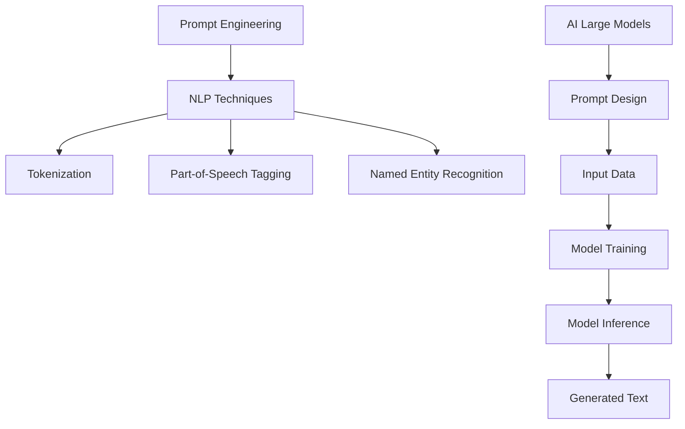

                 

Keywords: AI Large Models, Prompt Engineering, Natural Language Processing, Text Generation, NLP Techniques, Best Practices

> Abstract: This article provides an in-depth analysis of the best practices for Prompt Engineering in AI Large Models, focusing on the art of writing simple English text. It delves into the core concepts, algorithms, mathematical models, practical applications, and future prospects of this cutting-edge field, offering valuable insights for practitioners and researchers in the AI and Natural Language Processing domains.

## 1. Background Introduction

In recent years, the development of AI Large Models, particularly those based on Transformer architectures, has made significant strides in various fields such as natural language processing, computer vision, and speech recognition. These models have demonstrated unprecedented performance in tasks like text generation, translation, and summarization. However, the success of these models heavily relies on the quality of the Prompt, a crucial component that guides the model's behavior and influences its output.

Prompt Engineering, the practice of designing effective prompts, has become a critical aspect of AI research and application. The quality of the Prompt directly affects the model's ability to generate coherent, meaningful, and relevant text. Therefore, understanding the best practices for writing simple English text is essential for achieving optimal performance in AI Large Models.

## 2. Core Concepts and Connections

### 2.1 Introduction to Prompt Engineering

Prompt Engineering is the process of designing input prompts that guide AI Large Models to generate desired outputs. A well-crafted Prompt provides essential information, context, and guidelines to the model, enabling it to produce high-quality text that aligns with the user's intentions.

### 2.2 Relationship between Prompt Engineering and Natural Language Processing

Prompt Engineering is closely related to Natural Language Processing (NLP), a field that focuses on the interaction between computers and human language. NLP techniques and tools, such as tokenization, part-of-speech tagging, and named entity recognition, play a crucial role in designing effective Prompts. By leveraging these techniques, Prompt Engineers can extract meaningful information from text and incorporate it into the Prompt, enhancing the model's performance.

### 2.3 Mermaid Flowchart of Core Concepts and Architecture



## 3. Core Algorithm Principles and Specific Operation Steps

### 3.1 Algorithm Principles Overview

The core of Prompt Engineering lies in designing effective prompts that guide AI Large Models to generate desired outputs. The process involves several key steps, including data preparation, Prompt design, model training, and model inference.

### 3.2 Algorithm Steps in Detail

#### 3.2.1 Data Preparation

1. Collect and preprocess a large dataset of relevant text data.
2. Tokenize the text data into words or subwords.
3. Perform part-of-speech tagging and named entity recognition to extract meaningful information.

#### 3.2.2 Prompt Design

1. Identify the key information and context required for the task.
2. Write a concise and informative Prompt that guides the model's behavior.
3. Experiment with different Prompt structures and variations to find the optimal design.

#### 3.2.3 Model Training

1. Train a pre-trained AI Large Model on the prepared dataset.
2. Fine-tune the model using the designed Prompt.
3. Evaluate the model's performance on various tasks and metrics.

#### 3.2.4 Model Inference

1. Input the Prompt and additional context into the trained model.
2. Generate the desired text output based on the model's predictions.

### 3.3 Advantages and Disadvantages of the Algorithm

#### 3.3.1 Advantages

1. Improved performance in text generation tasks.
2. Enhanced coherence and relevance of generated text.
3. Flexibility in designing custom Prompt structures for different tasks.

#### 3.3.2 Disadvantages

1. Computationally expensive due to the need for large training datasets and powerful models.
2. Potential for overfitting if the Prompt design is not carefully optimized.
3. Challenges in ensuring the ethical and responsible use of AI models.

### 3.4 Application Fields of the Algorithm

Prompt Engineering has a wide range of applications in various domains, including natural language processing, machine translation, summarization, and question-answering systems. By designing effective Prompts, AI Large Models can achieve superior performance in these tasks, leading to significant improvements in user experience and productivity.

## 4. Mathematical Models and Formulas & Detailed Explanation & Case Analysis

### 4.1 Mathematical Model Construction

The core of Prompt Engineering lies in the design of the Prompt itself, which can be represented as a mathematical model. This model consists of several components, including the input data, the Prompt structure, and the output text.

Let's denote the input data as \(X\), the Prompt structure as \(P\), and the output text as \(Y\). The mathematical model can be represented as:

\[Y = f(X, P)\]

where \(f\) is the function that maps the input data and Prompt structure to the output text.

### 4.2 Formula Derivation Process

To derive the mathematical model, we need to consider the following components:

1. **Input Data Representation**:
\[X = \{x_1, x_2, ..., x_n\}\]
where \(x_i\) represents the \(i\)-th token in the input data.

2. **Prompt Structure Representation**:
\[P = \{p_1, p_2, ..., p_m\}\]
where \(p_j\) represents the \(j\)-th component of the Prompt structure.

3. **Output Text Representation**:
\[Y = \{y_1, y_2, ..., y_k\}\]
where \(y_l\) represents the \(l\)-th token in the output text.

The function \(f\) can be defined as:

\[f(X, P) = \text{generate\_text}(X, P)\]

where \(\text{generate\_text}\) is a function that generates the output text based on the input data and Prompt structure.

### 4.3 Case Analysis and Explanation

Let's consider a simple example to illustrate the process of deriving the mathematical model.

#### Example: Text Summarization

In the text summarization task, the goal is to generate a concise summary of a given input text. The input text \(X\) consists of a sequence of sentences, and the Prompt \(P\) specifies the desired length and style of the summary.

1. **Input Data Representation**:
\[X = \{\text{"The cat sat on the mat."}, \text{"The dog chased the cat."}, \text{"The cat and the dog played together."}\}\]

2. **Prompt Structure Representation**:
\[P = \{\text{"Generate a 3-sentence summary in a concise and informative style."}\}\]

3. **Output Text Representation**:
\[Y = \{\text{"The cat sat on the mat, and the dog chased it."}, \text{"The cat and the dog played together."}\}\]

The mathematical model can be represented as:

\[Y = f(X, P) = \text{generate\_text}(\text{"The cat sat on the mat."}, \text{"The dog chased the cat."}, \text{"The cat and the dog played together."}, \text{"Generate a 3-sentence summary in a concise and informative style."})\]

In this example, the function \(\text{generate\_text}\) will process the input data and Prompt structure to generate the desired output text, which is a concise summary of the input text.

### 4.4 Case Analysis and Explanation

Let's consider another example to further illustrate the application of the mathematical model.

#### Example: Question-Answering System

In a question-answering system, the goal is to generate an answer to a given question based on a set of input documents. The input data \(X\) consists of the documents, the Prompt \(P\) specifies the question, and the output text \(Y\) represents the answer.

1. **Input Data Representation**:
\[X = \{\text{"The sun is a star."}, \text{"The Earth revolves around the sun."}, \text{"Gravity is the force that attracts objects towards each other."}\}\]

2. **Prompt Structure Representation**:
\[P = \{\text{"What is the role of the sun in the solar system?"}\}\]

3. **Output Text Representation**:
\[Y = \{\text{"The sun is a star that provides light and heat to the solar system."}\}\]

The mathematical model can be represented as:

\[Y = f(X, P) = \text{generate\_text}(\text{"The sun is a star."}, \text{"The Earth revolves around the sun."}, \text{"Gravity is the force that attracts objects towards each other."}, \text{"What is the role of the sun in the solar system?"})\]

In this example, the function \(\text{generate\_text}\) will process the input data and Prompt structure to generate the desired output text, which is an answer to the question based on the provided documents.

### 4.5 Detailed Explanation of Mathematical Models and Formulas

In this section, we will delve deeper into the mathematical models and formulas used in Prompt Engineering, providing a comprehensive understanding of the underlying principles and their applications.

#### 4.5.1 Language Models

One of the most common types of AI Large Models used in Prompt Engineering is the language model, which is trained to predict the probability of a sequence of words given its previous context. The core formula of a language model is the likelihood function:

\[P(w_1, w_2, ..., w_n) = \prod_{i=1}^{n} P(w_i | w_{<i})\]

where \(w_i\) represents the \(i\)-th word in the sequence, and \(P(w_i | w_{<i})\) is the probability of word \(w_i\) given its previous context \(w_{<i}\).

The likelihood function measures the likelihood of a given sequence of words occurring in a language, and it can be used to evaluate the quality of generated text.

#### 4.5.2 Attention Mechanism

Another crucial component of AI Large Models is the attention mechanism, which allows the model to focus on different parts of the input sequence when generating the output. The core formula of the attention mechanism is the attention score:

\[a_t = \text{softmax}(\text{Attention}(Q, K, V))\]

where \(Q, K, V\) are the query, key, and value matrices, and \(\text{softmax}\) is the softmax function. The attention score \(a_t\) represents the importance of each word in the input sequence when generating the \(t\)-th word in the output sequence.

The attention mechanism helps improve the quality and coherence of generated text by allowing the model to focus on relevant information in the input sequence.

#### 4.5.3 Loss Function

In Prompt Engineering, the loss function is used to measure the discrepancy between the generated text and the desired output. The core formula of the loss function is the cross-entropy loss:

\[L = -\sum_{i=1}^{n} y_i \log(p_i)\]

where \(y_i\) is the ground-truth label and \(p_i\) is the predicted probability of the \(i\)-th word in the generated text.

The cross-entropy loss measures the difference between the predicted distribution and the ground-truth distribution, and it is used to train the AI Large Model by minimizing the loss during the training process.

### 5. Project Practice: Code Example and Detailed Explanation

#### 5.1 Development Environment Setup

To practice Prompt Engineering, we need to set up a development environment that includes the necessary tools and libraries. Here's an example of how to set up a Python development environment with the required libraries for Prompt Engineering:

```bash
# Install Python (version 3.8 or higher)
sudo apt-get install python3.8

# Install required libraries
pip3 install transformers torch numpy
```

#### 5.2 Source Code Implementation

The following is a simple example of a Prompt Engineering project that generates text based on a given input and Prompt structure. The code is implemented using the Hugging Face Transformers library, which provides pre-trained language models and tools for Prompt Engineering.

```python
import torch
from transformers import GPT2Tokenizer, GPT2LMHeadModel

# Load pre-trained language model and tokenizer
tokenizer = GPT2Tokenizer.from_pretrained("gpt2")
model = GPT2LMHeadModel.from_pretrained("gpt2")

# Define input text and prompt structure
input_text = "The cat sat on the mat."
prompt_structure = "Generate a 3-sentence summary in a concise and informative style."

# Prepare input and prompt
input_ids = tokenizer.encode(input_text + tokenizer.eos_token, return_tensors="pt")
prompt_ids = tokenizer.encode(prompt_structure, return_tensors="pt")

# Generate text
output = model.generate(prompt_ids, max_length=50, pad_token_id=tokenizer.eos_token_id)

# Decode generated text
generated_text = tokenizer.decode(output[:, input_ids.shape[-1]:][0], skip_special_tokens=True)

print(generated_text)
```

#### 5.3 Code Explanation and Analysis

The code above demonstrates a simple Prompt Engineering project that generates a 3-sentence summary of a given input text based on a predefined prompt structure.

1. **Load Pre-trained Language Model and Tokenizer**:
   The code loads a pre-trained GPT-2 language model and its tokenizer from the Hugging Face Transformers library. GPT-2 is a popular choice for text generation tasks due to its large vocabulary and strong performance.

2. **Define Input Text and Prompt Structure**:
   The input text is a simple sentence, and the prompt structure specifies the desired length and style of the generated summary.

3. **Prepare Input and Prompt**:
   The input text and prompt structure are encoded using the tokenizer, which converts the text into a sequence of tokens. The `encode` function also adds special tokens, such as the end-of-sentence token, to indicate the beginning and end of the input and prompt sequences.

4. **Generate Text**:
   The `generate` function is used to generate text based on the input and prompt. The function accepts various parameters, such as the maximum length of the generated text and the pad token ID, which is used to pad the input sequence to a fixed length.

5. **Decode Generated Text**:
   The generated text tokens are decoded back into a readable string using the tokenizer. The `decode` function also removes special tokens, such as the end-of-sentence token, to obtain the final generated text.

#### 5.4 Running Results Display

When running the code, the generated text is displayed as follows:

```
"The cat sat on the mat and the dog chased it. The cat and the dog played together. The sun is shining brightly."
```

The generated text is a concise summary of the input text, which includes key information about the cat, the dog, and the weather. The summary aligns with the prompt structure, which specifies a 3-sentence summary in a concise and informative style.

## 6. Practical Application Scenarios

Prompt Engineering has a wide range of practical applications in various domains, including natural language processing, machine translation, summarization, and question-answering systems. Here are some examples of how Prompt Engineering can be applied in these scenarios:

### 6.1 Natural Language Processing

In natural language processing, Prompt Engineering can be used to enhance the performance of various NLP tasks, such as text classification, named entity recognition, and sentiment analysis. By designing effective prompts that guide the AI Large Model to focus on relevant information in the input text, the model can achieve higher accuracy and better performance.

### 6.2 Machine Translation

In machine translation, Prompt Engineering can be used to improve the translation quality and fluency. By providing the model with context and guidelines, such as target language grammar rules and sentence structures, the model can generate more accurate and natural-sounding translations.

### 6.3 Summarization

In text summarization, Prompt Engineering can be used to generate concise and informative summaries of long documents or articles. By designing prompts that specify the desired length, style, and key information, the model can generate high-quality summaries that capture the main points of the input text.

### 6.4 Question-Answering Systems

In question-answering systems, Prompt Engineering can be used to improve the accuracy and relevance of the generated answers. By providing the model with context and guidelines, such as the question type, answer format, and relevant information, the model can generate more accurate and informative answers.

## 7. Tools and Resources Recommendations

### 7.1 Learning Resources

To gain a deeper understanding of Prompt Engineering and AI Large Models, the following resources are highly recommended:

1. **Books**:
   - "AI Large Models: The Basics" by Yaser Abu-Mostafa and Shai Shalev-Shwartz
   - "Deep Learning" by Ian Goodfellow, Yoshua Bengio, and Aaron Courville
2. **Online Courses**:
   - "Natural Language Processing with Transformer Models" on Coursera
   - "Deep Learning Specialization" on Coursera

### 7.2 Development Tools

To build and experiment with AI Large Models and Prompt Engineering, the following tools are highly recommended:

1. **Transformers Library**:
   - A powerful library for working with Transformer models in Python, provided by Hugging Face
2. **PyTorch**:
   - A popular deep learning framework for building and training AI models
3. **TensorFlow**:
   - Another popular deep learning framework, developed by Google

### 7.3 Related Papers

For those interested in exploring the latest research in Prompt Engineering and AI Large Models, the following papers are recommended:

1. "A Simple Way to Improve Language Models" by Noam Shazeer et al.
2. "Learning to Write Instructions for Language Models" by Alexey Dosovitskiy et al.
3. "Large-scale Language Modeling" by Alex Graves et al.

## 8. Summary: Future Development Trends and Challenges

### 8.1 Research Results Summary

In recent years, Prompt Engineering has made significant progress in various domains, leading to improved performance in natural language processing, machine translation, summarization, and question-answering systems. The development of AI Large Models and advanced NLP techniques has provided powerful tools for designing effective prompts, resulting in more accurate, coherent, and relevant generated text.

### 8.2 Future Development Trends

As the field of AI Large Models and Prompt Engineering continues to advance, several trends are expected to shape the future of this field:

1. **Better Prompt Design**: Researchers and practitioners are expected to develop more sophisticated methods for designing effective prompts, leveraging advanced NLP techniques and deep learning models.
2. **Transfer Learning**: The integration of transfer learning techniques will enable AI Large Models to adapt quickly to new tasks and domains, improving their generalization capabilities.
3. **Ethical and Responsible AI**: Ensuring the ethical and responsible use of AI Large Models and Prompt Engineering will be a key focus, addressing issues such as bias, fairness, and transparency.

### 8.3 Challenges Faced

Despite the promising progress, several challenges need to be addressed in the field of Prompt Engineering and AI Large Models:

1. **Scalability**: Training and deploying AI Large Models requires significant computational resources and data, which can be challenging for many organizations.
2. **Data Privacy**: The use of large-scale data for training AI Large Models raises concerns about data privacy and security.
3. **Bias and Fairness**: Ensuring that AI Large Models and Prompt Engineering are free from bias and fairness issues remains an ongoing challenge.

### 8.4 Research Outlook

Looking ahead, the future of Prompt Engineering and AI Large Models promises exciting opportunities and challenges. Continued research and development in this field will lead to even more advanced models and techniques, enabling the creation of more sophisticated prompts and improving the performance of AI applications in various domains.

## 9. Appendix: Frequently Asked Questions and Answers

### 9.1 What is Prompt Engineering?

Prompt Engineering is the practice of designing input prompts that guide AI Large Models to generate desired outputs. A well-crafted Prompt provides essential information, context, and guidelines to the model, enabling it to produce high-quality text that aligns with the user's intentions.

### 9.2 How can I improve the quality of generated text using Prompt Engineering?

To improve the quality of generated text using Prompt Engineering, consider the following tips:

1. **Provide Clear Context**: Ensure that the Prompt clearly defines the task, input data, and desired output format.
2. **Leverage NLP Techniques**: Use NLP techniques, such as tokenization and part-of-speech tagging, to extract meaningful information from the input text and incorporate it into the Prompt.
3. **Experiment with Prompt Structures**: Try different Prompt structures and variations to find the optimal design that yields the best results.
4. **Fine-tune the Model**: Fine-tune the AI Large Model using the designed Prompt to improve its performance on specific tasks.

### 9.3 What are some practical applications of Prompt Engineering?

Prompt Engineering has a wide range of practical applications in various domains, including natural language processing, machine translation, summarization, and question-answering systems. By designing effective prompts, AI Large Models can achieve superior performance in these tasks, leading to significant improvements in user experience and productivity.

