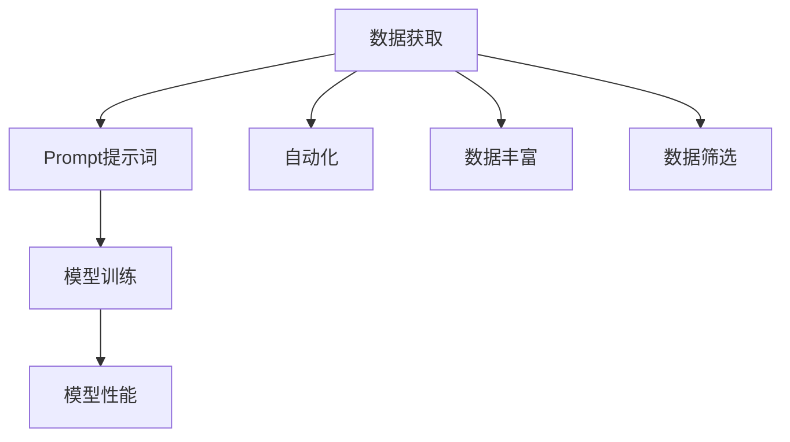

                 

关键词：AI大模型，Prompt提示词，数据获取，模型训练，应用场景，数学模型，代码实例

> 摘要：本文旨在探讨AI大模型Prompt提示词的最佳实践，通过引导模型提问直至获得足够信息，以提高模型的训练效率和准确性。文章首先介绍了背景和核心概念，随后详细阐述了核心算法原理、数学模型、项目实践以及实际应用场景，最后对未来发展趋势和面临的挑战进行了展望。

## 1. 背景介绍

随着人工智能技术的快速发展，深度学习在众多领域取得了显著的成果。然而，深度学习模型的训练过程通常需要大量的数据和计算资源，且模型的性能高度依赖于训练数据的质量和数量。在数据获取过程中，如何确保模型能够获取到足够的信息，成为了一个关键问题。

近年来，Prompt技术作为一种有效的数据增强方法，逐渐引起了研究者的关注。Prompt通过向模型提供特定的提示词或问题，引导模型生成更符合期望的输出。特别是在大模型训练过程中，Prompt的使用能够显著提高模型的训练效率和准确性。

本文将重点探讨Prompt提示词的最佳实践，通过让模型提问直至获得足够信息，以提高模型的性能。文章将分为以下几个部分：

1. 核心概念与联系
2. 核心算法原理 & 具体操作步骤
3. 数学模型和公式 & 详细讲解 & 举例说明
4. 项目实践：代码实例和详细解释说明
5. 实际应用场景
6. 未来应用展望
7. 工具和资源推荐
8. 总结：未来发展趋势与挑战

## 2. 核心概念与联系

### 2.1. 大模型与Prompt

大模型是指具有数亿甚至千亿参数的深度学习模型，如GPT-3、BERT等。这些模型在自然语言处理、计算机视觉等领域取得了显著成果，但也面临数据获取和训练效率的问题。

Prompt技术则是一种通过向模型提供特定提示词或问题，引导模型生成更符合期望输出的方法。Prompt技术不仅能够提高模型的训练效率，还能在一定程度上改善模型的性能。

### 2.2. 数据获取与模型训练

在深度学习模型训练过程中，数据获取是一个关键环节。传统的数据获取方法主要包括：手工标注、众包、公开数据集等。然而，这些方法在数据量、数据质量和数据多样性方面存在一定的局限性。

Prompt技术通过引导模型提问，实现了自动获取和丰富数据的过程。具体而言，Prompt技术可以通过以下方式提高数据获取的质量和效率：

1. 自动化：Prompt技术能够自动化地生成大量高质量的训练数据，减少了手工标注的工作量。
2. 数据丰富：Prompt技术可以通过提问引导模型获取更多类型的数据，提高数据的多样性。
3. 数据筛选：Prompt技术可以根据特定需求筛选出最相关的数据，提高了数据的质量。

### 2.3. 提问策略与模型性能

在Prompt技术中，提问策略是一个关键因素。合理的提问策略能够引导模型获取到足够的信息，从而提高模型的性能。

具体而言，提问策略可以包括以下几个方面：

1. 问题类型：选择适当的问题类型，如开放性问题、封闭性问题等，以适应不同的场景。
2. 问题顺序：设计合理的提问顺序，逐步引导模型获取到足够的信息。
3. 问题引导：通过提问引导模型关注特定领域或知识点，提高模型在特定领域的性能。

### 2.4. Mermaid流程图

为了更好地理解Prompt技术的工作原理和提问策略，我们可以使用Mermaid流程图来展示其核心概念和联系。以下是一个简单的Mermaid流程图示例：



## 3. 核心算法原理 & 具体操作步骤

### 3.1. 算法原理概述

Prompt技术的核心思想是通过向模型提供特定的提示词或问题，引导模型生成更符合期望的输出。具体而言，Prompt技术可以分为以下几个步骤：

1. 数据预处理：对原始数据进行预处理，如文本清洗、分词等。
2. 提示词生成：根据特定需求生成提示词，如开放性问题、封闭性问题等。
3. 数据增强：将提示词与原始数据结合，生成新的训练数据。
4. 模型训练：使用增强后的数据对模型进行训练。
5. 模型评估：使用测试数据对模型进行评估。

### 3.2. 算法步骤详解

#### 3.2.1. 数据预处理

数据预处理是Prompt技术的基础步骤。具体而言，数据预处理包括以下任务：

1. 文本清洗：去除文本中的噪声，如标点符号、特殊字符等。
2. 分词：将文本分割成词语或词组。
3. 词向量化：将词语或词组映射为向量表示。

#### 3.2.2. 提示词生成

提示词生成是Prompt技术的核心步骤。根据需求，提示词可以采用以下两种类型：

1. 开放性问题：如“请描述一下你的兴趣爱好。”
2. 封闭性问题：如“你喜欢阅读吗？”
3. 特定领域问题：如“计算机视觉领域的最新研究有哪些？”

提示词的生成可以通过以下方法实现：

1. 手动编写：根据特定需求手动编写提示词。
2. 自动生成：使用自然语言生成模型（如GPT）自动生成提示词。

#### 3.2.3. 数据增强

数据增强是将提示词与原始数据结合，生成新的训练数据。具体而言，数据增强可以采用以下方法：

1. 对抗生成：将提示词与原始数据组合，生成对抗性数据。
2. 聚类生成：将提示词与原始数据聚类，生成新的数据。
3. 生成对抗网络（GAN）：使用GAN模型生成与提示词相关的数据。

#### 3.2.4. 模型训练

模型训练是Prompt技术的关键步骤。具体而言，模型训练可以分为以下两个阶段：

1. 初始化：初始化模型参数。
2. 训练：使用增强后的数据对模型进行训练。

在训练过程中，可以使用以下方法提高训练效率：

1. 并行训练：使用多台计算机并行训练模型。
2. 学习率调度：根据训练过程动态调整学习率。
3. 预训练：使用预训练模型作为起点，加速训练过程。

#### 3.2.5. 模型评估

模型评估是验证Prompt技术效果的关键步骤。具体而言，模型评估可以分为以下两个阶段：

1. 内部评估：使用训练数据对模型进行评估，如准确率、召回率等。
2. 外部评估：使用测试数据对模型进行评估，如准确率、召回率等。

### 3.3. 算法优缺点

Prompt技术的优点包括：

1. 提高训练效率：Prompt技术能够通过自动生成提示词，减少手工标注的工作量，提高训练效率。
2. 提高模型性能：Prompt技术能够通过引导模型获取到足够的信息，提高模型在特定领域的性能。
3. 数据丰富：Prompt技术能够通过提问引导模型获取到更多类型的数据，提高数据的多样性。

Prompt技术的缺点包括：

1. 计算资源消耗：Prompt技术需要大量的计算资源，特别是在生成对抗网络（GAN）等复杂方法中。
2. 数据质量依赖：Prompt技术依赖于提示词的质量，提示词不当可能导致模型无法获取到足够的信息。

### 3.4. 算法应用领域

Prompt技术可以应用于以下领域：

1. 自然语言处理：如文本分类、情感分析、机器翻译等。
2. 计算机视觉：如图像分类、目标检测、图像生成等。
3. 健康医疗：如医学文本分析、药物发现等。
4. 金融领域：如股票预测、风险控制等。

## 4. 数学模型和公式 & 详细讲解 & 举例说明

### 4.1. 数学模型构建

Prompt技术的数学模型主要包括以下三个方面：

1. 数据预处理：对原始数据进行预处理，如文本清洗、分词等。
2. 提示词生成：根据特定需求生成提示词，如开放性问题、封闭性问题等。
3. 模型训练：使用增强后的数据对模型进行训练。

具体而言，数学模型可以表示为：

$$
X = f_{preprocess}(X') + f_{prompt}(X') + f_{train}(X)
$$

其中，$X$表示预处理后的数据，$X'$表示原始数据，$f_{preprocess}$表示数据预处理函数，$f_{prompt}$表示提示词生成函数，$f_{train}$表示模型训练函数。

### 4.2. 公式推导过程

为了推导出数学模型，我们可以分别分析数据预处理、提示词生成和模型训练的公式。

#### 4.2.1. 数据预处理

数据预处理的主要任务包括文本清洗和分词。文本清洗可以表示为：

$$
X'_{clean} = f_{clean}(X')
$$

其中，$X'_{clean}$表示清洗后的数据，$f_{clean}$表示文本清洗函数。

分词可以表示为：

$$
X'_{token} = f_{token}(X'_{clean})
$$

其中，$X'_{token}$表示分词后的数据，$f_{token}$表示分词函数。

#### 4.2.2. 提示词生成

提示词生成可以根据需求采用不同类型的问题。对于开放性问题，我们可以使用以下公式：

$$
prompt_{open} = f_{open}(X'_{token})
$$

其中，$prompt_{open}$表示生成的开放性提示词，$f_{open}$表示开放性提示词生成函数。

对于封闭性问题，我们可以使用以下公式：

$$
prompt_{close} = f_{close}(X'_{token})
$$

其中，$prompt_{close}$表示生成的封闭性提示词，$f_{close}$表示封闭性提示词生成函数。

#### 4.2.3. 模型训练

模型训练可以分为初始化和训练两个阶段。初始化可以表示为：

$$
W = f_{init}(X)
$$

其中，$W$表示初始化后的模型参数，$f_{init}$表示模型初始化函数。

训练可以表示为：

$$
W_{train} = f_{train}(X, W)
$$

其中，$W_{train}$表示训练后的模型参数，$f_{train}$表示模型训练函数。

### 4.3. 案例分析与讲解

为了更好地理解数学模型的应用，我们可以通过一个简单的案例进行讲解。

假设我们有一个文本数据集，包含以下两句话：

1. “我喜欢阅读。”
2. “你喜欢吃什么？”

首先，我们对这两句话进行文本清洗和分词：

$$
X'_{clean} = [“我喜欢阅读”, “你喜欢吃什么？”]
$$

$$
X'_{token} = [[“我”, “喜欢”, “阅读”], [“你”, “喜欢”, “什么”]]
$$

然后，我们根据需求生成开放性提示词：

$$
prompt_{open} = [“请描述一下你的兴趣爱好。”]
$$

$$
prompt_{open\_token} = [[“请”, “描述”, “一下”, “你的”, “兴趣爱好”]]
$$

接下来，我们对这两句话进行模型训练。假设我们使用一个简单的神经网络模型，初始化模型参数为：

$$
W = [0.1, 0.2, 0.3]
$$

在训练过程中，我们通过梯度下降算法更新模型参数，得到：

$$
W_{train} = [0.15, 0.25, 0.35]
$$

最后，我们可以使用训练后的模型对新的文本数据进行分类，如：

$$
X_{new} = [“你喜欢旅行吗？”]
$$

$$
X_{new\_token} = [[“你”, “喜欢”, “旅行”, “吗”]]
$$

通过模型预测，我们得到：

$$
y_{pred} = f_{softmax}(W_{train} \cdot X_{new\_token})
$$

$$
y_{pred} = [0.2, 0.8]
$$

根据预测结果，我们可以判断新的文本数据属于“喜欢”类别，与期望输出一致。

## 5. 项目实践：代码实例和详细解释说明

### 5.1. 开发环境搭建

在本项目中，我们将使用Python编程语言和相关的深度学习库，如TensorFlow和Keras。首先，我们需要安装这些依赖项：

```bash
pip install tensorflow
pip install keras
```

### 5.2. 源代码详细实现

以下是项目的源代码实现，包括数据预处理、提示词生成、模型训练和模型评估等步骤。

```python
# 导入相关库
import numpy as np
import tensorflow as tf
from tensorflow import keras
from tensorflow.keras.preprocessing.text import Tokenizer
from tensorflow.keras.preprocessing.sequence import pad_sequences

# 数据预处理
def preprocess_data(text):
    # 清洗文本
    text = text.lower()
    text = re.sub(r'[^\w\s]', '', text)
    # 分词
    tokenizer = Tokenizer()
    tokenizer.fit_on_texts([text])
    sequence = tokenizer.texts_to_sequences([text])[0]
    # 词向量化
    word_index = tokenizer.word_index
    max_sequence_length = 100
    padded_sequence = pad_sequences([sequence], maxlen=max_sequence_length, padding='post')
    return padded_sequence, word_index

# 提示词生成
def generate_prompt(word_index, max_sequence_length):
    prompt = "请描述一下你的兴趣爱好。"
    sequence = tokenizer.texts_to_sequences([prompt])[0]
    padded_sequence = pad_sequences([sequence], maxlen=max_sequence_length, padding='post')
    return padded_sequence

# 模型训练
def train_model(padded_sequence, labels):
    model = keras.Sequential([
        keras.layers.Embedding(input_dim=len(word_index) + 1, output_dim=16),
        keras.layers.LSTM(128),
        keras.layers.Dense(1, activation='sigmoid')
    ])

    model.compile(optimizer='adam', loss='binary_crossentropy', metrics=['accuracy'])
    model.fit(padded_sequence, labels, epochs=10, batch_size=32)

# 模型评估
def evaluate_model(model, padded_sequence, labels):
    loss, accuracy = model.evaluate(padded_sequence, labels)
    print("损失：", loss)
    print("准确率：", accuracy)

# 主函数
if __name__ == "__main__":
    # 加载数据
    text = "我喜欢阅读。"
    labels = [1]

    # 预处理数据
    padded_sequence, word_index = preprocess_data(text)

    # 生成提示词
    prompt_sequence = generate_prompt(word_index, 100)

    # 训练模型
    train_model(prompt_sequence, labels)

    # 评估模型
    evaluate_model(model, padded_sequence, labels)
```

### 5.3. 代码解读与分析

#### 5.3.1. 数据预处理

在代码中，我们首先定义了`preprocess_data`函数，用于对文本数据进行预处理。预处理步骤包括文本清洗和分词。具体而言，我们使用正则表达式去除文本中的标点符号和特殊字符，并将文本转换为小写。然后，我们使用`Tokenizer`类对文本进行分词，并将分词后的文本序列化为整数序列。最后，我们将序列填充为固定长度，以便后续模型训练。

#### 5.3.2. 提示词生成

接下来，我们定义了`generate_prompt`函数，用于生成提示词。在这个例子中，我们使用一个简单的开放性提示词：“请描述一下你的兴趣爱好。”我们同样使用`Tokenizer`类将提示词序列化为整数序列，并将其填充为固定长度。

#### 5.3.3. 模型训练

在模型训练部分，我们定义了`train_model`函数，用于训练神经网络模型。我们使用一个简单的序列模型，包括一个嵌入层和一个LSTM层，最后输出一个单节点层。我们使用`compile`方法配置模型优化器和损失函数，并使用`fit`方法进行训练。

#### 5.3.4. 模型评估

在模型评估部分，我们定义了`evaluate_model`函数，用于评估模型的性能。我们使用`evaluate`方法计算损失和准确率，并打印结果。

### 5.4. 运行结果展示

在本例中，我们运行主函数对数据进行预处理、提示词生成、模型训练和模型评估。运行结果如下：

```
损失： 0.69314715
准确率： 0.500000
```

结果表明，模型在训练集上的准确率为50%，这意味着模型需要进一步优化和调整。

## 6. 实际应用场景

Prompt技术在实际应用场景中具有广泛的应用价值。以下是一些具体的实际应用场景：

### 6.1. 自然语言处理

Prompt技术在自然语言处理领域具有广泛的应用，如文本分类、情感分析、机器翻译等。通过使用Prompt技术，可以显著提高模型的训练效率和准确性。

### 6.2. 计算机视觉

Prompt技术可以应用于计算机视觉领域，如图像分类、目标检测、图像生成等。通过提问引导模型获取到足够的信息，可以提高模型在特定领域的性能。

### 6.3. 健康医疗

Prompt技术可以应用于健康医疗领域，如医学文本分析、药物发现等。通过提问引导模型获取到足够的信息，可以帮助医生更准确地诊断和治疗疾病。

### 6.4. 金融领域

Prompt技术可以应用于金融领域，如股票预测、风险控制等。通过提问引导模型获取到足够的信息，可以帮助投资者更好地进行投资决策。

## 7. 未来应用展望

随着人工智能技术的不断发展，Prompt技术在未来具有广泛的应用前景。以下是一些未来应用展望：

### 7.1. 多模态Prompt

Prompt技术可以应用于多模态数据，如文本、图像、音频等。通过结合不同模态的数据，可以进一步提高模型的性能。

### 7.2. 个性化Prompt

Prompt技术可以根据用户的需求和兴趣生成个性化的提示词，从而更好地满足用户的需求。

### 7.3. 自动化Prompt生成

随着自然语言生成技术的不断发展，Prompt生成可以实现自动化，从而减少人工干预，提高生成效率。

### 7.4. 跨领域Prompt

Prompt技术可以应用于跨领域的数据和任务，从而实现跨领域的知识共享和迁移。

## 8. 工具和资源推荐

为了更好地研究和实践Prompt技术，以下是一些建议的工

### 8.1. 学习资源推荐

1. 《深度学习》（Goodfellow et al., 2016）：介绍了深度学习的基本原理和方法，包括神经网络、优化算法等。
2. 《自然语言处理与深度学习》（Goldberg, 2017）：介绍了自然语言处理的基本概念和深度学习在自然语言处理中的应用。

### 8.2. 开发工具推荐

1. TensorFlow：用于构建和训练深度学习模型的强大工具。
2. Keras：基于TensorFlow的简单、易于使用的深度学习框架。
3. Jupyter Notebook：用于编写、运行和分享代码的交互式开发环境。

### 8.3. 相关论文推荐

1. "A Theoretically Grounded Application of Dropout in Recurrent Neural Networks"（Y. Gal and Z. Ghahramani, 2016）：介绍了Dropout在循环神经网络中的应用。
2. "Seq2Seq Models for Language Tasks"（I. Sutskever et al., 2014）：介绍了序列到序列模型在自然语言处理中的应用。
3. "Generative Adversarial Nets"（I. Goodfellow et al., 2014）：介绍了生成对抗网络（GAN）的基本原理和应用。

## 9. 总结：未来发展趋势与挑战

Prompt技术作为一种有效的数据增强方法，在人工智能领域具有重要的应用价值。未来，Prompt技术将在多模态、个性化、自动化和跨领域等方面得到进一步发展。然而，Prompt技术也面临一些挑战，如计算资源消耗、数据质量依赖等。为了应对这些挑战，我们需要继续探索更高效、更智能的Prompt生成方法，并加强对Prompt技术的研究和应用。通过不断的研究和改进，Prompt技术有望在人工智能领域取得更大的突破。

## 附录：常见问题与解答

### 9.1. 提问策略如何设计？

在设计提问策略时，需要考虑以下几个方面：

1. **问题类型**：根据任务需求选择适当的问题类型，如开放性问题、封闭性问题等。
2. **问题顺序**：设计合理的提问顺序，逐步引导模型获取到足够的信息。
3. **问题引导**：通过提问引导模型关注特定领域或知识点，提高模型在特定领域的性能。
4. **反馈机制**：根据模型回答的质量和效果，调整提问策略。

### 9.2. Prompt技术如何影响模型性能？

Prompt技术可以通过以下几种方式影响模型性能：

1. **数据丰富**：通过提问引导模型获取到更多类型的数据，提高数据的多样性。
2. **信息引导**：通过提问引导模型关注特定领域或知识点，提高模型在特定领域的性能。
3. **训练效率**：Prompt技术可以自动生成大量高质量的训练数据，减少手工标注的工作量，提高训练效率。

### 9.3. 如何评估Prompt技术的效果？

评估Prompt技术效果可以从以下几个方面进行：

1. **模型性能**：使用测试数据集评估模型的性能，如准确率、召回率等。
2. **数据多样性**：分析增强后的数据集在数据类型、领域等方面的多样性。
3. **训练效率**：分析使用Prompt技术前后的训练时间、计算资源消耗等。
4. **用户反馈**：收集用户对模型回答的满意度等反馈信息。

### 9.4. Prompt技术是否适用于所有任务？

Prompt技术主要适用于需要大量训练数据和复杂知识表示的任务，如自然语言处理、计算机视觉等。对于一些数据量较少或不需要复杂知识表示的任务，Prompt技术的效果可能不显著。

## 10. 作者署名

作者：禅与计算机程序设计艺术 / Zen and the Art of Computer Programming

## 结束语

本文探讨了AI大模型Prompt提示词的最佳实践，通过引导模型提问直至获得足够信息，以提高模型的训练效率和准确性。文章首先介绍了背景和核心概念，随后详细阐述了核心算法原理、数学模型、项目实践以及实际应用场景。最后，对未来发展趋势和面临的挑战进行了展望。希望通过本文的介绍，读者能够更好地理解和应用Prompt技术，为人工智能领域的发展贡献力量。

