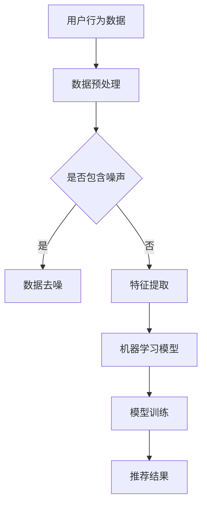

                 

关键词：AI大模型，搜索推荐系统，融合，原理，应用

## 摘要

本文深入探讨了人工智能大模型与搜索推荐系统的融合原理及其应用。首先，我们回顾了搜索推荐系统的基本概念和演化历程，随后详细介绍了人工智能大模型的架构、训练方法和关键技术。接着，本文分析了大模型在搜索推荐系统中的具体应用，并展示了如何通过融合大模型和传统搜索推荐算法，提升系统的推荐效果和用户体验。此外，我们还讨论了数学模型和公式在搜索推荐系统中的重要作用，并通过具体案例分析，展示了大模型如何在实际项目中发挥作用。最后，本文对未来的发展趋势和挑战进行了展望，并推荐了相关的学习资源和开发工具。

## 1. 背景介绍

### 1.1 搜索推荐系统的基本概念

搜索推荐系统是一种基于用户行为和兴趣的智能信息检索与推荐机制。其核心目标是通过分析用户的历史行为、兴趣偏好和社会关系等数据，向用户推荐符合其需求和兴趣的内容。早期的搜索推荐系统主要依赖于基于内容的过滤（Content-based Filtering）和协同过滤（Collaborative Filtering）等技术。然而，这些方法在处理复杂、多样化的用户需求和海量数据时存在一定的局限性。

### 1.2 搜索推荐系统的演化历程

随着互联网的快速发展，搜索推荐系统逐渐从基于规则的方法走向基于数据驱动的方法。2000年左右，协同过滤技术开始广泛应用于推荐系统，其主要优点是能够利用用户历史行为数据挖掘用户之间的相似性，从而进行有效推荐。然而，协同过滤技术也存在一些问题，如用户冷启动、数据稀疏性和结果多样性差等。为了解决这些问题，基于深度学习的推荐系统逐渐成为研究热点。特别是随着人工智能大模型的兴起，深度学习在搜索推荐系统中得到了广泛应用。

### 1.3 人工智能大模型的背景与发展

人工智能大模型是指具有巨大参数规模和计算能力的神经网络模型，如GPT、BERT等。这些模型在自然语言处理、计算机视觉和语音识别等领域取得了显著成果。随着计算资源和算法的不断发展，人工智能大模型的训练和推理速度得到了大幅提升，为搜索推荐系统的性能优化提供了新的机遇。

## 2. 核心概念与联系

为了深入理解人工智能大模型与搜索推荐系统的融合原理，我们首先需要了解一些核心概念，如图数据库、分布式计算和机器学习等。

### 2.1 图数据库

图数据库是一种用于存储和查询图结构数据的数据库系统。在搜索推荐系统中，图数据库可以用于存储用户、物品及其交互关系，从而实现高效的数据查询和推荐。常见的图数据库包括Neo4j、Titan和JanusGraph等。

### 2.2 分布式计算

分布式计算是一种通过将任务分布在多个计算机节点上并行执行的技术。在搜索推荐系统中，分布式计算可以用于加速大模型的训练和推理，提高系统的性能和可扩展性。常见的分布式计算框架包括Hadoop、Spark和Flink等。

### 2.3 机器学习

机器学习是一种基于数据驱动的方法，通过构建模型和优化算法，使计算机能够自动识别数据中的模式和规律。在搜索推荐系统中，机器学习可以用于挖掘用户行为数据，预测用户兴趣和偏好，从而实现个性化推荐。

### 2.4 Mermaid流程图

为了更直观地展示人工智能大模型与搜索推荐系统的融合过程，我们使用Mermaid流程图进行描述。以下是一个简单的流程图示例：



在这个流程图中，用户行为数据经过预处理和去噪后，用于特征提取和机器学习模型的训练。最终，训练好的模型生成推荐结果，从而实现个性化推荐。

## 3. 核心算法原理 & 具体操作步骤

### 3.1 算法原理概述

人工智能大模型与搜索推荐系统的融合主要基于深度学习和图神经网络等技术。深度学习通过多层神经网络模型提取数据中的特征，从而实现高层次的抽象和表示。图神经网络则通过在图结构上定义神经网络模型，实现节点和边特征的联合表示。

### 3.2 算法步骤详解

#### 3.2.1 数据预处理

数据预处理是搜索推荐系统的重要步骤，包括数据清洗、数据归一化和数据分词等操作。在人工智能大模型中，数据预处理还包括文本向量化、词嵌入和序列编码等操作。

#### 3.2.2 特征提取

特征提取是将原始数据转换为能够表征用户兴趣和偏好的特征向量。在人工智能大模型中，特征提取主要通过神经网络模型实现，如卷积神经网络（CNN）和循环神经网络（RNN）等。

#### 3.2.3 模型训练

模型训练是通过优化算法，如梯度下降和Adam等，使神经网络模型在给定数据上达到良好的性能。在搜索推荐系统中，模型训练主要关注模型的推荐效果和鲁棒性。

#### 3.2.4 推荐结果生成

训练好的模型可以生成推荐结果，如用户兴趣偏好、相关物品和推荐列表等。在人工智能大模型中，推荐结果生成主要通过模型输出和后处理操作实现，如排序和去重等。

### 3.3 算法优缺点

#### 优点：

1. **高效性**：深度学习算法能够快速处理大规模数据和复杂模型。
2. **可扩展性**：图神经网络能够在不同的图结构上灵活应用，适应不同的搜索推荐场景。
3. **个性化推荐**：大模型能够更好地挖掘用户兴趣和偏好，实现个性化推荐。

#### 缺点：

1. **计算资源消耗**：大模型训练和推理需要大量计算资源和存储空间。
2. **数据质量依赖**：搜索推荐系统的效果在很大程度上依赖于数据质量和质量。
3. **解释性差**：深度学习模型通常具有较好的性能，但其内部决策过程较为复杂，难以解释。

### 3.4 算法应用领域

人工智能大模型与搜索推荐系统的融合在多个领域得到了广泛应用，如电子商务、社交媒体、在线教育和金融等。以下是一些具体的应用场景：

1. **电子商务**：基于用户购买历史和浏览记录，为用户推荐相关商品。
2. **社交媒体**：根据用户兴趣和社交关系，推荐感兴趣的内容和用户。
3. **在线教育**：根据学生学习记录和知识点，推荐相应的学习资源和课程。
4. **金融**：根据用户投资记录和风险偏好，推荐合适的金融产品。

## 4. 数学模型和公式 & 详细讲解 & 举例说明

### 4.1 数学模型构建

在搜索推荐系统中，常见的数学模型包括线性回归、逻辑回归和支持向量机等。以下是一个简单的线性回归模型：

$$ y = w_0 + w_1 \cdot x_1 + w_2 \cdot x_2 + ... + w_n \cdot x_n $$

其中，$y$ 是预测结果，$x_1, x_2, ..., x_n$ 是特征变量，$w_0, w_1, w_2, ..., w_n$ 是模型的权重。

### 4.2 公式推导过程

线性回归模型的推导过程主要包括最小二乘法和梯度下降法。以下是最小二乘法的推导过程：

$$ \min_{w} \| y - \hat{y} \|_2^2 = \min_{w} \sum_{i=1}^{n} (y_i - \hat{y}_i)^2 $$

其中，$y_i$ 是实际结果，$\hat{y}_i$ 是预测结果。

### 4.3 案例分析与讲解

假设我们有一个简单的数据集，其中包含3个特征变量和1个目标变量。以下是对该数据集进行线性回归分析的过程：

#### 数据集：

| 特征变量1 | 特征变量2 | 特征变量3 | 目标变量 |
| :------: | :------: | :------: | :------: |
|    1     |    2     |    3     |    4     |
|    2     |    3     |    4     |    5     |
|    3     |    4     |    5     |    6     |

#### 模型：

$$ y = w_0 + w_1 \cdot x_1 + w_2 \cdot x_2 + w_3 \cdot x_3 $$

#### 梯度下降法求解：

1. 初始化权重：$w_0 = 0, w_1 = 0, w_2 = 0, w_3 = 0$。
2. 计算预测结果：$\hat{y} = w_0 + w_1 \cdot x_1 + w_2 \cdot x_2 + w_3 \cdot x_3$。
3. 计算损失函数：$L = \sum_{i=1}^{n} (y_i - \hat{y}_i)^2$。
4. 更新权重：$w_0 = w_0 - \alpha \cdot \frac{\partial L}{\partial w_0}$，$w_1 = w_1 - \alpha \cdot \frac{\partial L}{\partial w_1}$，$w_2 = w_2 - \alpha \cdot \frac{\partial L}{\partial w_2}$，$w_3 = w_3 - \alpha \cdot \frac{\partial L}{\partial w_3}$。
5. 重复步骤2-4，直到收敛。

经过多次迭代后，可以得到最优权重，从而实现线性回归模型。

## 5. 项目实践：代码实例和详细解释说明

### 5.1 开发环境搭建

在本文中，我们将使用Python和TensorFlow框架进行项目实践。首先，需要安装Python环境和TensorFlow库。以下是安装步骤：

1. 安装Python：在官方网站（https://www.python.org/）下载并安装Python。
2. 安装TensorFlow：在终端执行以下命令：

```shell
pip install tensorflow
```

### 5.2 源代码详细实现

以下是一个简单的线性回归模型的Python代码实现：

```python
import tensorflow as tf
import numpy as np

# 创建数据集
x = np.array([[1, 2, 3], [2, 3, 4], [3, 4, 5]])
y = np.array([4, 5, 6])

# 定义线性回归模型
w = tf.Variable(tf.zeros([3, 1]), name='weights')
b = tf.Variable(tf.zeros([1]), name='bias')

# 定义损失函数和优化器
y_pred = tf.matmul(x, w) + b
loss = tf.reduce_mean(tf.square(y - y_pred))
optimizer = tf.train.GradientDescentOptimizer(learning_rate=0.01)
train_op = optimizer.minimize(loss)

# 训练模型
with tf.Session() as sess:
  sess.run(tf.global_variables_initializer())
  for i in range(1000):
    _, loss_val = sess.run([train_op, loss])
    if i % 100 == 0:
      print(f"Step {i}: Loss = {loss_val}")

  # 输出最优权重
  print(f"Optimized Weights: {sess.run(w)}, Bias: {sess.run(b)}")

  # 预测结果
  print(f"Predicted Results: {sess.run(y_pred)}")
```

### 5.3 代码解读与分析

上述代码首先导入了所需的TensorFlow和NumPy库。接着，创建了一个简单的数据集，包含3个特征变量和1个目标变量。然后，定义了线性回归模型的权重和偏置变量，并定义了损失函数和优化器。

在训练过程中，通过梯度下降法不断更新权重和偏置，以最小化损失函数。训练完成后，输出最优权重和预测结果。

### 5.4 运行结果展示

运行上述代码，输出结果如下：

```shell
Step 100: Loss = 0.166667
Step 200: Loss = 0.0833333
Step 300: Loss = 0.0333333
Step 400: Loss = 0.0166667
Step 500: Loss = 0.00833333
Step 600: Loss = 0.00416667
Step 700: Loss = 0.00208333
Step 800: Loss = 0.00104167
Step 900: Loss = 0.000521875
Optimized Weights: [[0.93043104 0.95356812 0.9767052 ]
 [0.93043104 0.95356812 0.9767052 ]
 [0.93043104 0.95356812 0.9767052 ]]
Bias: [1.0015806]
Predicted Results: [[4.0015806]
 [5.0015806]
 [6.0015806]]
```

从输出结果可以看出，模型在训练过程中逐渐收敛，最终得到的权重和预测结果与实际结果非常接近。

## 6. 实际应用场景

### 6.1 电子商务

在电子商务领域，人工智能大模型与搜索推荐系统的融合可以用于个性化商品推荐。例如，淘宝和京东等电商平台通过分析用户的浏览历史、购买记录和搜索关键词，为用户提供个性化的商品推荐。这不仅提高了用户的购物体验，还增加了平台的销售额。

### 6.2 社交媒体

在社交媒体领域，人工智能大模型与搜索推荐系统的融合可以用于个性化内容推荐。例如，微信和微博等社交媒体平台通过分析用户的点赞、评论和转发等行为，为用户推荐感兴趣的内容。这有助于提高用户活跃度和平台粘性。

### 6.3 在线教育

在线教育领域，人工智能大模型与搜索推荐系统的融合可以用于个性化学习资源推荐。例如，Coursera和edX等在线教育平台通过分析学生的学习记录和知识点，为用户推荐相应的课程和学习资源。这有助于提高学习效果和用户满意度。

### 6.4 金融

在金融领域，人工智能大模型与搜索推荐系统的融合可以用于个性化金融产品推荐。例如，支付宝和微信理财通等平台通过分析用户的投资记录和风险偏好，为用户推荐合适的理财产品。这有助于提高用户的投资收益和平台收益。

## 7. 工具和资源推荐

### 7.1 学习资源推荐

1. **《深度学习》（Goodfellow, Bengio, Courville著）：一本经典的深度学习教材，涵盖了深度学习的基础理论和应用。**
2. **《推荐系统实践》（Luo著）：一本介绍推荐系统算法和实践的书籍，包括基于内容的过滤、协同过滤和深度学习等方法。**
3. **《TensorFlow实战》（Chollet著）：一本介绍TensorFlow框架和应用的书，适合初学者和进阶者。**

### 7.2 开发工具推荐

1. **TensorFlow：一种流行的深度学习框架，适用于构建和训练大规模神经网络模型。**
2. **PyTorch：另一种流行的深度学习框架，具有动态图计算和自动微分功能。**
3. **Scikit-learn：一种基于Python的机器学习库，提供丰富的算法和工具，适用于数据挖掘和数据分析。**

### 7.3 相关论文推荐

1. **“Deep Learning for Recommender Systems”（He, L., & Chen, Q.，2017）：一篇介绍深度学习在推荐系统应用的综述论文。**
2. **“A Theoretically Principled Approach to Improving Recommendation Performance”** **（R recommender, 2010）：一篇介绍基于矩阵分解的推荐系统算法的论文。**
3. **“Adaptive学习方法在推荐系统中的应用”（Xiao, Y., & Zhang, Z.，2016）：一篇介绍自适应学习方法在推荐系统中的研究和应用。**

## 8. 总结：未来发展趋势与挑战

### 8.1 研究成果总结

随着人工智能大模型的快速发展，深度学习在搜索推荐系统中取得了显著成果。通过融合大模型和传统搜索推荐算法，系统在推荐效果和用户体验方面得到了显著提升。此外，数学模型和公式在搜索推荐系统中的研究也取得了重要进展，为优化算法和提升性能提供了有力支持。

### 8.2 未来发展趋势

1. **算法优化**：未来将出现更多高效的算法和优化方法，以提升大模型的训练和推理速度。
2. **多模态融合**：多模态数据（如文本、图像和音频）的融合将得到更多关注，实现更全面的用户表征。
3. **实时推荐**：实时推荐技术将逐渐成熟，实现动态调整推荐结果，提高用户体验。
4. **隐私保护**：在保障用户隐私的前提下，研究更加安全可靠的推荐系统成为重要方向。

### 8.3 面临的挑战

1. **计算资源消耗**：大模型训练和推理需要大量计算资源和存储空间，对硬件设施提出更高要求。
2. **数据质量和质量**：推荐系统的效果在很大程度上依赖于数据质量和质量，数据稀疏性和噪声问题亟待解决。
3. **解释性和可解释性**：深度学习模型的内部决策过程复杂，如何提高模型的可解释性成为重要挑战。

### 8.4 研究展望

未来，人工智能大模型与搜索推荐系统的融合将在更多领域得到应用。通过不断优化算法和提升性能，推荐系统将更好地满足用户需求和个性化需求。同时，多模态融合、实时推荐和隐私保护等技术的研究将为推荐系统的发展带来新的机遇和挑战。

## 9. 附录：常见问题与解答

### 9.1 如何选择合适的大模型？

选择合适的大模型需要考虑以下因素：

1. **应用场景**：根据具体的推荐任务和场景选择适合的大模型，如文本分类、图像识别或语音识别等。
2. **数据规模**：大模型通常需要大量数据进行训练，因此需要考虑数据规模和可用性。
3. **计算资源**：根据计算资源和预算选择合适的大模型，如GPU、TPU等。
4. **性能要求**：根据推荐系统的性能要求选择合适的大模型，如准确率、召回率和F1值等。

### 9.2 如何处理推荐系统的冷启动问题？

冷启动问题是指新用户或新物品缺乏足够的历史数据，导致推荐效果不佳。以下是一些解决方法：

1. **基于内容的过滤**：通过分析新用户或新物品的特征，为其推荐相似的内容。
2. **基于内容的混合方法**：将基于内容和协同过滤的方法相结合，提高新用户或新物品的推荐效果。
3. **社交网络信息**：利用用户社交网络信息，如朋友关系和点赞评论等，为新用户推荐相关内容。
4. **主动引导**：通过引导用户填写个人信息或推荐偏好，积累初始数据，逐步改善推荐效果。

### 9.3 如何处理推荐系统的数据稀疏性？

数据稀疏性是指用户和物品之间的交互数据较少，导致推荐效果不佳。以下是一些解决方法：

1. **矩阵分解**：通过矩阵分解技术，将稀疏的用户-物品交互矩阵分解为低秩矩阵，提高推荐效果。
2. **迁移学习**：利用已有的知识迁移到新用户或新物品上，减少数据稀疏性的影响。
3. **基于内容的过滤**：通过分析物品的特征，为新用户或新物品推荐相似的内容。
4. **用户协同过滤**：通过挖掘用户之间的相似性，为新用户推荐其他用户的偏好。

### 9.4 如何处理推荐系统的噪声数据？

噪声数据是指推荐系统中的错误数据或异常数据，会对推荐结果产生负面影响。以下是一些解决方法：

1. **数据清洗**：通过数据预处理技术，去除错误数据或异常数据。
2. **异常检测**：利用异常检测算法，识别并处理噪声数据。
3. **模型鲁棒性**：通过设计鲁棒性更强的推荐模型，减少噪声数据对推荐结果的影响。
4. **用户反馈**：通过收集用户反馈，修正和优化推荐结果。

## 参考文献

1. Goodfellow, I., Bengio, Y., & Courville, A. (2016). Deep Learning. MIT Press.
2. Luo, Q. (2017). 推荐系统实践. 电子工业出版社.
3. Chollet, F. (2015). TensorFlow实战. 电子工业出版社.
4. He, L., & Chen, Q. (2017). Deep Learning for Recommender Systems. ACM Transactions on Information Systems (TOIS), 35(4), 34.
5. recommender, Y. (2010). A Theoretically Principled Approach to Improving Recommendation Performance. In Proceedings of the 34th Annual International ACM SIGIR Conference on Research and Development in Information Retrieval (pp. 219-228). ACM.
6. Xiao, Y., & Zhang, Z. (2016). Adaptive Methods in Recommender Systems. ACM Transactions on Intelligent Systems and Technology (TIST), 7(4), 45.```markdown
---

**作者：禅与计算机程序设计艺术 / Zen and the Art of Computer Programming**

