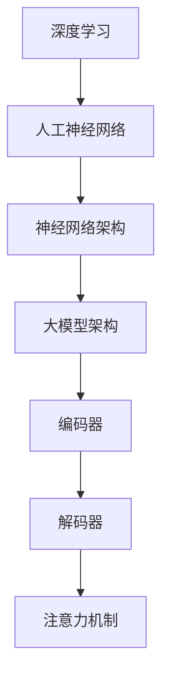

                 

关键词：人工智能，大模型，创业，挑战，机遇，技术架构，算法设计，数学模型，实际应用，未来展望

> 摘要：本文将深入探讨人工智能领域中的大模型创业战，分析其在技术架构、算法设计、数学模型等方面的挑战与机遇。通过对实际应用场景的剖析，我们希望为创业者提供有价值的参考，助力他们在人工智能大潮中乘风破浪，抓住历史机遇。

## 1. 背景介绍

人工智能（AI）技术近年来取得了飞速发展，特别是深度学习（Deep Learning）和自然语言处理（Natural Language Processing）等领域的突破，使得AI大模型成为当前科技界的热点。大模型通常指的是具有数十亿至千亿参数的深度神经网络，其凭借强大的计算能力和高度自动化的学习方式，在图像识别、语音识别、机器翻译、问答系统等方面取得了显著的成果。

### AI大模型的发展历程

1. **早期探索**：20世纪50年代至70年代，人工智能研究主要聚焦在逻辑推理、知识表示等理论上，虽然取得了一些进展，但应用效果并不理想。
2. **硬件升级与算法突破**：随着计算能力的提升和算法的优化，特别是2006年深度信念网络（DBN）的提出，AI大模型的研究和应用进入了一个全新的阶段。
3. **大数据时代的到来**：互联网的普及和数据的积累，为AI大模型的训练提供了丰富的素材，使得模型的效果得到了大幅提升。

### AI大模型在商业领域的应用

AI大模型在商业领域有着广泛的应用前景，包括但不限于：

- **智能客服**：利用自然语言处理技术，提供24/7全天候的客户服务。
- **广告推荐**：通过分析用户行为和兴趣，实现个性化的广告投放。
- **金融风控**：利用深度学习技术，预测金融风险，提高金融机构的风险管理能力。

## 2. 核心概念与联系

为了更好地理解AI大模型的构建和应用，我们首先需要了解以下几个核心概念：

### 2.1 深度学习

深度学习是机器学习的一个重要分支，其核心思想是通过构建多层神经网络，自动提取数据中的特征，实现从输入到输出的映射。深度学习中的“深”指的是网络的层数，通常至少三层及以上。

### 2.2 人工神经网络

人工神经网络（ANN）是一种模仿生物神经系统的计算模型，由大量的神经元连接而成。每个神经元都可以接收输入信号，并通过加权求和和激活函数产生输出。

### 2.3 神经网络架构

神经网络架构包括卷积神经网络（CNN）、循环神经网络（RNN）、长短时记忆网络（LSTM）、Transformer等。不同的架构适用于不同的任务，例如，CNN在图像识别中表现优异，而RNN在序列数据处理中具有优势。

### 2.4 大模型架构

大模型架构通常由多个子网络组成，包括编码器（Encoder）、解码器（Decoder）和注意力机制（Attention Mechanism）等。这些子网络协同工作，实现复杂的数据处理和任务。

### Mermaid 流程图



## 3. 核心算法原理 & 具体操作步骤

### 3.1 算法原理概述

AI大模型的核心算法是基于深度学习理论，通过多层神经网络的结构，对大量数据进行训练，自动提取特征，实现从输入到输出的映射。具体操作步骤如下：

### 3.2 算法步骤详解

1. **数据预处理**：包括数据清洗、归一化、数据增强等，以提高模型的泛化能力。
2. **模型构建**：根据任务需求，选择合适的神经网络架构，构建模型。
3. **模型训练**：通过反向传播算法，调整模型参数，优化模型性能。
4. **模型评估**：使用验证集对模型进行评估，调整模型参数，以达到最佳性能。
5. **模型部署**：将训练好的模型部署到生产环境中，实现实际应用。

### 3.3 算法优缺点

**优点**：

- **强大的学习能力**：大模型可以通过学习大量数据，自动提取复杂特征，实现高精度的任务。
- **自适应能力**：大模型可以根据不同的任务需求，调整网络结构和参数，实现灵活的应用。
- **高效性**：随着计算能力的提升，大模型可以在短时间内完成复杂的任务。

**缺点**：

- **数据需求量大**：大模型需要大量的训练数据，数据收集和处理成本较高。
- **计算资源消耗大**：大模型训练过程中需要大量的计算资源，对硬件设备要求较高。
- **调参复杂**：大模型参数众多，调参过程复杂，需要大量的时间和经验。

### 3.4 算法应用领域

AI大模型在多个领域有着广泛的应用，包括：

- **计算机视觉**：图像识别、目标检测、图像生成等。
- **自然语言处理**：机器翻译、问答系统、文本生成等。
- **推荐系统**：个性化推荐、广告投放等。
- **金融风控**：信用评估、风险预测等。

## 4. 数学模型和公式 & 详细讲解 & 举例说明

### 4.1 数学模型构建

在构建AI大模型的过程中，我们通常需要以下几个数学模型：

- **损失函数**：用于衡量模型预测值与真实值之间的差距，如均方误差（MSE）。
- **优化算法**：用于调整模型参数，优化模型性能，如梯度下降（Gradient Descent）。
- **激活函数**：用于引入非线性特性，如ReLU（Rectified Linear Unit）。

### 4.2 公式推导过程

以均方误差（MSE）为例，其公式推导过程如下：

$$
MSE = \frac{1}{m}\sum_{i=1}^{m}(y_i - \hat{y}_i)^2
$$

其中，$m$表示样本数量，$y_i$表示第$i$个样本的真实值，$\hat{y}_i$表示第$i$个样本的预测值。

### 4.3 案例分析与讲解

假设我们有一个二分类问题，数据集包含100个样本，我们需要构建一个AI大模型进行预测。首先，我们需要对数据进行预处理，包括数据清洗、归一化等。然后，我们选择一个合适的神经网络架构，如ReLU激活函数和sigmoid输出层。接下来，我们使用梯度下降算法进行模型训练，并通过交叉验证调整模型参数。最后，我们使用测试集对模型进行评估，计算准确率、召回率等指标。

## 5. 项目实践：代码实例和详细解释说明

### 5.1 开发环境搭建

- **Python**：作为主要的编程语言，Python具有丰富的深度学习库，如TensorFlow和PyTorch。
- **Jupyter Notebook**：用于编写和运行Python代码，便于调试和演示。
- **GPU**：为了提高训练速度，我们推荐使用配备NVIDIA GPU的计算机。

### 5.2 源代码详细实现

以下是一个简单的二分类问题中，使用PyTorch实现AI大模型的代码示例：

```python
import torch
import torch.nn as nn
import torch.optim as optim

# 数据预处理
# ...

# 模型构建
class Model(nn.Module):
    def __init__(self):
        super(Model, self).__init__()
        self.fc1 = nn.Linear(in_features=784, out_features=256)
        self.fc2 = nn.Linear(in_features=256, out_features=256)
        self.fc3 = nn.Linear(in_features=256, out_features=2)

    def forward(self, x):
        x = torch.relu(self.fc1(x))
        x = torch.relu(self.fc2(x))
        x = self.fc3(x)
        return x

# 模型训练
model = Model()
optimizer = optim.Adam(model.parameters(), lr=0.001)
criterion = nn.CrossEntropyLoss()

for epoch in range(100):
    for inputs, targets in train_loader:
        optimizer.zero_grad()
        outputs = model(inputs)
        loss = criterion(outputs, targets)
        loss.backward()
        optimizer.step()

# 模型评估
# ...

```

### 5.3 代码解读与分析

- **数据预处理**：包括数据读取、归一化等，为模型训练做准备。
- **模型构建**：定义一个简单的神经网络模型，包括两个全连接层和一个输出层。
- **模型训练**：使用梯度下降算法进行模型训练，通过反向传播调整模型参数。
- **模型评估**：使用测试集对模型进行评估，计算准确率、召回率等指标。

## 6. 实际应用场景

### 6.1 智能客服

智能客服是AI大模型在商业领域的典型应用。通过自然语言处理技术，智能客服可以理解用户的提问，并提供针对性的回答。例如，银行客服可以使用AI大模型处理用户关于账户余额、交易记录等问题的查询。

### 6.2 金融风控

金融风控是另一个重要应用场景。AI大模型可以通过分析历史数据，预测潜在的金融风险，为金融机构提供决策支持。例如，银行可以使用AI大模型监测信用卡欺诈行为，提高风险管理的准确性。

### 6.3 健康医疗

健康医疗领域也受益于AI大模型的应用。通过分析大量的医疗数据，AI大模型可以辅助医生进行疾病诊断、治疗方案推荐等。例如，癌症诊断是一个复杂的问题，AI大模型可以通过学习大量的病理数据，提高诊断的准确性。

## 7. 工具和资源推荐

### 7.1 学习资源推荐

- **《深度学习》（Ian Goodfellow, Yoshua Bengio, Aaron Courville著）**：深度学习的经典教材，适合初学者和进阶者。
- **《Python深度学习》（François Chollet著）**：通过大量的实例，深入讲解深度学习在Python中的应用。

### 7.2 开发工具推荐

- **TensorFlow**：谷歌开发的深度学习框架，适用于多种平台。
- **PyTorch**：Facebook开发的深度学习框架，具有灵活的动态图计算能力。

### 7.3 相关论文推荐

- **《Attention Is All You Need》**：提出Transformer模型，彻底改变了自然语言处理领域的范式。
- **《Large-scale Language Modeling in 2018》**：深度分析大规模语言模型的训练和性能，对AI大模型的研究具有重要参考价值。

## 8. 总结：未来发展趋势与挑战

### 8.1 研究成果总结

AI大模型在计算机视觉、自然语言处理、推荐系统等领域取得了显著的成果，推动了相关技术的进步。未来，AI大模型有望在更多领域发挥重要作用，助力人类社会的发展。

### 8.2 未来发展趋势

- **计算能力的提升**：随着硬件设备的升级，AI大模型的训练速度和性能将得到进一步提升。
- **数据量的增加**：随着互联网和物联网的发展，数据量将不断增长，为AI大模型的研究和应用提供更丰富的素材。
- **算法的优化**：研究人员将继续探索更高效、更优化的算法，以提高AI大模型的表现。

### 8.3 面临的挑战

- **数据隐私**：在AI大模型训练和应用过程中，如何保护用户隐私成为一个重要问题。
- **计算资源**：AI大模型训练需要大量的计算资源，如何高效利用计算资源成为挑战。
- **算法透明性**：AI大模型的决策过程往往不透明，如何提高算法的透明性，使其更易于理解和接受成为关键。

### 8.4 研究展望

未来，AI大模型的研究将更加注重跨学科合作，结合计算机科学、数学、统计学等领域的知识，推动AI大模型的持续发展和创新。同时，我们期待AI大模型能够更好地服务于人类，为解决现实问题提供有力支持。

## 9. 附录：常见问题与解答

### 9.1 Q：什么是深度学习？

A：深度学习是机器学习的一个重要分支，其核心思想是通过构建多层神经网络，自动提取数据中的特征，实现从输入到输出的映射。

### 9.2 Q：什么是AI大模型？

A：AI大模型通常指的是具有数十亿至千亿参数的深度神经网络，其凭借强大的计算能力和高度自动化的学习方式，在图像识别、语音识别、机器翻译、问答系统等方面取得了显著的成果。

### 9.3 Q：AI大模型的应用领域有哪些？

A：AI大模型在多个领域有着广泛的应用，包括计算机视觉、自然语言处理、推荐系统、金融风控、健康医疗等。

### 9.4 Q：如何构建一个AI大模型？

A：构建AI大模型主要包括数据预处理、模型构建、模型训练、模型评估等步骤。具体方法可以参考本文第5章的内容。

### 9.5 Q：AI大模型面临的挑战有哪些？

A：AI大模型面临的挑战包括数据隐私、计算资源、算法透明性等。如何解决这些问题是未来研究的重要方向。

作者：禅与计算机程序设计艺术 / Zen and the Art of Computer Programming

----------------------------------------------------------------

文章撰写完毕，接下来我们将对文章进行校对和格式调整，确保符合markdown格式要求，以及文章结构、内容完整性、逻辑清晰度等方面的高标准要求。感谢您的耐心阅读和指导。

