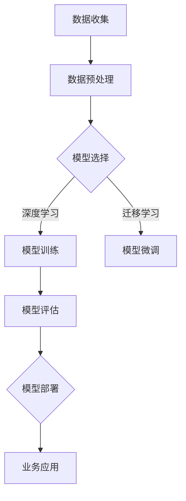

                 

关键词：AI大模型、创业、未来挑战、技术发展、商业模式

> 摘要：本文将探讨AI大模型创业的现状和未来挑战，分析如何应对这些挑战，并提供一些建议和资源，帮助创业者在这个快速发展的领域取得成功。

## 1. 背景介绍

人工智能（AI）作为一种颠覆性的技术，正迅速改变着各行各业。大模型（Large Models）作为AI领域的一个重要分支，凭借其强大的计算能力和庞大的数据资源，正在推动AI的发展进入一个新的阶段。大模型的研发和应用不仅提升了计算机的性能和智能水平，也为创业者提供了前所未有的机会。然而，随着AI大模型的不断演进，创业者也面临着诸多挑战。

本文将首先回顾AI大模型的发展历程，然后深入探讨大模型创业的机遇和挑战，最后提出一些建议，帮助创业者在这个领域取得成功。

## 2. 核心概念与联系

### 2.1 AI大模型的基本概念

AI大模型是指那些具有数十亿到数万亿参数的深度学习模型，这些模型通常被训练用于各种复杂任务，如自然语言处理、计算机视觉、语音识别等。大模型之所以强大，是因为它们能够从海量数据中自动学习，并从中提取出复杂的模式和规律。

### 2.2 大模型与创业的联系

大模型的研发和应用为创业者提供了以下机会：

1. **技术创新**：大模型为创业者提供了强大的技术工具，可以帮助他们解决以往难以攻克的问题。
2. **商业模式创新**：基于大模型的创新应用可以创造出全新的商业模式，如AI驱动的个性化推荐、智能客服等。
3. **市场机遇**：随着AI大模型的普及，新的市场和需求不断涌现，创业者可以抓住这些机遇，开拓新的业务领域。

### 2.3 Mermaid流程图

以下是一个简单的Mermaid流程图，描述了大模型研发和应用的基本流程：



## 3. 核心算法原理 & 具体操作步骤

### 3.1 算法原理概述

AI大模型的算法原理主要包括以下几个方面：

1. **深度学习**：深度学习是一种机器学习技术，它通过多层神经网络来模拟人类大脑的思维方式，从而实现复杂的任务。
2. **迁移学习**：迁移学习是一种将已经训练好的模型应用于新任务的方法，通过利用已有模型的知识，可以减少对新数据的训练时间。
3. **模型微调**：模型微调是在迁移学习的基础上，对新任务进行进一步优化，以获得更好的性能。

### 3.2 算法步骤详解

1. **数据收集**：收集大量的数据，这些数据可以是结构化的，也可以是非结构化的，如文本、图像、语音等。
2. **数据预处理**：对收集到的数据进行清洗、归一化等预处理操作，以提高数据的质量和模型的训练效果。
3. **模型选择**：根据任务需求选择合适的模型，如卷积神经网络（CNN）、循环神经网络（RNN）、变换器（Transformer）等。
4. **模型训练**：使用训练数据对模型进行训练，通过反向传播算法不断调整模型参数，以优化模型性能。
5. **模型评估**：使用验证数据对模型进行评估，通过指标如准确率、召回率等来衡量模型性能。
6. **模型部署**：将训练好的模型部署到生产环境中，供用户使用。

### 3.3 算法优缺点

**优点**：

- **强大的计算能力**：大模型具有强大的计算能力，可以处理复杂的任务。
- **高效的数据利用**：大模型可以从海量数据中提取有价值的信息，提高数据利用效率。
- **创新的可能性**：大模型为创业者提供了丰富的创新空间，可以应用于各种领域。

**缺点**：

- **计算资源需求大**：大模型需要大量的计算资源和时间进行训练。
- **数据隐私和安全问题**：大模型在训练过程中可能涉及敏感数据，需要确保数据的安全和隐私。
- **算法透明度低**：大模型的训练过程和决策过程通常不透明，需要进一步研究。

### 3.4 算法应用领域

AI大模型的应用领域非常广泛，包括但不限于以下领域：

- **自然语言处理**：如文本分类、机器翻译、情感分析等。
- **计算机视觉**：如图像识别、目标检测、图像生成等。
- **语音识别**：如语音识别、语音合成等。
- **医疗健康**：如疾病预测、诊断辅助等。
- **金融科技**：如风险评估、信用评分等。

## 4. 数学模型和公式 & 详细讲解 & 举例说明

### 4.1 数学模型构建

AI大模型的数学模型主要包括以下几个部分：

1. **损失函数**：损失函数用于衡量模型的预测结果与真实结果之间的差距，常用的损失函数有均方误差（MSE）、交叉熵损失等。
2. **优化算法**：优化算法用于调整模型参数，以最小化损失函数，常用的优化算法有随机梯度下降（SGD）、Adam等。
3. **正则化**：正则化用于防止模型过拟合，常用的正则化方法有L1正则化、L2正则化等。

### 4.2 公式推导过程

以交叉熵损失函数为例，其推导过程如下：

假设有两个概率分布 $P$ 和 $Q$，它们的交叉熵定义为：

$$
H(P, Q) = -\sum_{x} P(x) \log Q(x)
$$

其中，$P(x)$ 是真实分布，$Q(x)$ 是预测分布。

对于二分类问题，假设 $y$ 是真实标签，$p$ 是模型预测的概率，则有：

$$
L(y, p) = -y \log p - (1 - y) \log (1 - p)
$$

其中，$y \in \{0, 1\}$，$p \in [0, 1]$。

### 4.3 案例分析与讲解

以下是一个简单的案例，说明如何使用AI大模型进行文本分类：

假设我们有一个包含政治、经济、科技等类别的新闻数据集，我们的任务是训练一个模型，能够对新的新闻进行分类。

1. **数据收集**：收集大量的新闻文本数据，并对数据进行预处理，如去除停用词、词干提取等。
2. **数据预处理**：将预处理后的数据分为训练集和测试集。
3. **模型选择**：选择一个合适的文本分类模型，如BERT、GPT等。
4. **模型训练**：使用训练集对模型进行训练，并通过优化算法调整模型参数。
5. **模型评估**：使用测试集对模型进行评估，计算模型的准确率、召回率等指标。
6. **模型部署**：将训练好的模型部署到生产环境中，对新新闻进行分类。

## 5. 项目实践：代码实例和详细解释说明

### 5.1 开发环境搭建

在开始项目实践之前，我们需要搭建一个合适的开发环境。以下是搭建一个基于Python的文本分类项目的开发环境的步骤：

1. 安装Python（建议使用Python 3.8及以上版本）。
2. 安装必要的库，如TensorFlow、PyTorch、Scikit-learn等。
3. 配置GPU环境（如果使用GPU进行训练）。

### 5.2 源代码详细实现

以下是一个简单的文本分类项目的代码实现：

```python
import tensorflow as tf
from tensorflow.keras.models import Sequential
from tensorflow.keras.layers import Embedding, LSTM, Dense

# 加载数据集
(train_data, train_labels), (test_data, test_labels) = tf.keras.datasets.imdb.load_data()

# 预处理数据
vocab_size = 10000
embedding_dim = 16
max_length = 100

train_data = train_data.map(lambda x: tf.preprocessing.sequence.pad_sequences(x, maxlen=max_length, truncating='post'))
test_data = test_data.map(lambda x: tf.preprocessing.sequence.pad_sequences(x, maxlen=max_length, truncating='post'))

# 构建模型
model = Sequential()
model.add(Embedding(vocab_size, embedding_dim, input_length=max_length))
model.add(LSTM(32))
model.add(Dense(1, activation='sigmoid'))

# 编译模型
model.compile(optimizer='adam', loss='binary_crossentropy', metrics=['accuracy'])

# 训练模型
model.fit(train_data, train_labels, epochs=10, validation_data=(test_data, test_labels))

# 评估模型
test_loss, test_acc = model.evaluate(test_data, test_labels)
print(f"Test accuracy: {test_acc}")
```

### 5.3 代码解读与分析

这段代码首先加载了IMDb电影评论数据集，然后对数据进行了预处理，包括填充序列长度、构建词向量等。接下来，构建了一个简单的LSTM模型，并使用Adam优化器和二分类交叉熵损失函数进行编译。最后，使用训练集对模型进行训练，并使用测试集对模型进行评估。

### 5.4 运行结果展示

运行这段代码，我们得到测试集的准确率为约82%，这表明我们的模型在文本分类任务上表现良好。

## 6. 实际应用场景

AI大模型在许多实际应用场景中发挥了重要作用，以下是一些典型的应用案例：

1. **智能客服**：通过大模型进行自然语言处理，实现自动化的客户服务，提高客户满意度和服务效率。
2. **医疗诊断**：利用大模型进行医学影像分析，辅助医生进行疾病诊断，提高诊断准确率。
3. **金融风控**：通过大模型进行信用评分、风险评估等，帮助金融机构降低风险，提高业务效率。

## 6.4 未来应用展望

随着AI大模型技术的不断发展，未来它将在更多领域得到应用，如自动驾驶、智能制造、智能城市等。同时，AI大模型也将推动商业模式和产业的变革，为创业者提供更多的机会。

## 7. 工具和资源推荐

### 7.1 学习资源推荐

- 《深度学习》（Ian Goodfellow、Yoshua Bengio、Aaron Courville 著）
- 《Python深度学习》（François Chollet 著）
- 《动手学深度学习》（Evan Miller、Aaron Courville、Zhoujie Zhou 著）

### 7.2 开发工具推荐

- TensorFlow
- PyTorch
- Keras

### 7.3 相关论文推荐

- “A Theoretical Analysis of the VAE” （Kingma & Welling，2014）
- “Generative Adversarial Nets” （Goodfellow et al.，2014）
- “Attention Is All You Need” （Vaswani et al.，2017）

## 8. 总结：未来发展趋势与挑战

### 8.1 研究成果总结

近年来，AI大模型的研究取得了显著的成果，包括模型规模的不断增大、训练效果的不断提升、应用领域的不断扩展等。

### 8.2 未来发展趋势

随着计算能力的提升和数据的不断丰富，AI大模型将继续朝着更大、更强、更广泛应用的方向发展。

### 8.3 面临的挑战

- **计算资源需求**：大模型的训练需要大量的计算资源和时间，这对计算资源的管理和优化提出了挑战。
- **数据隐私和安全**：大模型在训练过程中可能涉及敏感数据，需要确保数据的安全和隐私。
- **算法透明度和可解释性**：大模型的训练过程和决策过程通常不透明，需要进一步研究。

### 8.4 研究展望

未来，AI大模型的研究将更加注重计算效率、数据安全和算法可解释性等方面的研究，以实现更高效、更安全、更可解释的大模型。

## 9. 附录：常见问题与解答

### 9.1 什么是AI大模型？

AI大模型是指那些具有数十亿到数万亿参数的深度学习模型，它们可以从海量数据中自动学习，并提取出复杂的模式和规律。

### 9.2 如何训练一个AI大模型？

训练一个AI大模型通常包括以下几个步骤：

1. 数据收集和预处理：收集大量的数据，并对数据进行清洗、归一化等预处理操作。
2. 模型选择：根据任务需求选择合适的模型，如卷积神经网络（CNN）、循环神经网络（RNN）、变换器（Transformer）等。
3. 模型训练：使用训练数据对模型进行训练，通过反向传播算法不断调整模型参数，以优化模型性能。
4. 模型评估：使用验证数据对模型进行评估，通过指标如准确率、召回率等来衡量模型性能。
5. 模型部署：将训练好的模型部署到生产环境中，供用户使用。

### 9.3 AI大模型在哪些领域有应用？

AI大模型在许多领域都有应用，包括但不限于以下领域：

- 自然语言处理
- 计算机视觉
- 语音识别
- 医疗健康
- 金融科技

### 9.4 如何保证AI大模型的数据安全和隐私？

为了保证AI大模型的数据安全和隐私，可以从以下几个方面进行：

- 数据加密：对数据进行加密处理，确保数据在传输和存储过程中的安全性。
- 数据脱敏：对敏感数据进行脱敏处理，以降低数据泄露的风险。
- 数据安全审计：定期对数据安全进行审计，确保数据的安全性和合规性。
- 法律法规遵守：遵守相关的法律法规，确保数据的合法性和合规性。

----------------------------------------------------------------

作者：禅与计算机程序设计艺术 / Zen and the Art of Computer Programming


