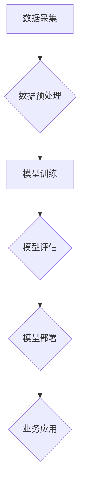

                 

关键词：AI大模型、创业、竞争策略、技术革新、市场分析、商业模式、应对策略

## 摘要

本文旨在探讨AI大模型创业公司如何在日益激烈的市场环境中应对未来竞争对手。通过对AI大模型的现状分析、核心算法原理解析、数学模型构建，以及项目实践和实际应用场景的探讨，本文提出了一系列切实可行的策略和工具，帮助创业公司保持竞争力，实现持续创新和增长。

## 1. 背景介绍

随着人工智能技术的不断进步，AI大模型在各个领域的应用愈发广泛，从自然语言处理到图像识别，再到数据分析和预测，大模型已经成为推动技术革新的关键力量。同时，AI大模型的商业价值也日益凸显，吸引了大量的创业公司和资本进入这一领域。然而，市场的竞争也日趋激烈，创业公司面临着来自巨头公司和新兴企业的双重压力。

在这个背景下，如何利用AI大模型的技术优势，构建有效的商业模式，制定科学的竞争策略，成为创业公司成功的关键。本文将围绕这些问题展开讨论，旨在为AI大模型创业公司提供一些实用的指导和建议。

## 2. 核心概念与联系

### 2.1 AI大模型的概念

AI大模型（Large-scale Artificial Intelligence Model）是指具有大规模参数和复杂结构的深度学习模型，如Transformer、BERT、GPT等。这些模型能够通过大量数据训练，实现高度自动化的学习和决策能力。

### 2.2 核心算法原理

AI大模型的核心算法通常是基于深度学习和神经网络技术。以Transformer为例，其采用了自注意力机制（Self-Attention Mechanism），能够捕捉输入数据中的长距离依赖关系，从而实现高效的特征提取和语义理解。

### 2.3 Mermaid 流程图



在这个流程图中，数据采集、数据预处理、模型训练、模型评估、模型部署和业务应用构成了AI大模型应用的基本步骤。

## 3. 核心算法原理 & 具体操作步骤

### 3.1 算法原理概述

AI大模型的核心算法通常是基于深度学习和神经网络技术。深度学习模型通过多层神经网络结构，对输入数据进行逐层特征提取和抽象，最终实现复杂的数据分析和决策。

### 3.2 算法步骤详解

#### 3.2.1 数据预处理

在模型训练之前，需要对采集到的数据进行预处理，包括数据清洗、数据归一化和数据增强等。这些预处理步骤有助于提高模型的训练效率和性能。

#### 3.2.2 模型训练

模型训练是AI大模型应用的核心步骤。通过使用大量的训练数据，模型可以学习到数据的特征和规律，从而提高对未知数据的预测和识别能力。

#### 3.2.3 模型评估

在模型训练完成后，需要对模型的性能进行评估。常用的评估指标包括准确率、召回率、F1值等。通过这些指标，可以判断模型的性能是否达到预期。

#### 3.2.4 模型部署

评估合格的模型可以被部署到实际应用场景中，通过API接口或嵌入式系统等方式，为业务应用提供数据分析和决策支持。

### 3.3 算法优缺点

#### 优点

- **强大的学习能力**：AI大模型能够通过大量数据训练，实现高度自动化的学习和决策。
- **高效的特征提取**：自注意力机制等算法能够高效地捕捉数据的特征和关系。

#### 缺点

- **计算资源消耗大**：训练大模型需要大量的计算资源和时间。
- **数据隐私和安全问题**：大模型对数据的要求较高，可能涉及到数据隐私和安全问题。

### 3.4 算法应用领域

AI大模型在多个领域具有广泛的应用，包括但不限于：

- **自然语言处理**：如文本分类、机器翻译、语音识别等。
- **图像识别**：如人脸识别、物体检测、图像生成等。
- **数据分析和预测**：如金融预测、医疗诊断、天气预测等。

## 4. 数学模型和公式 & 详细讲解 & 举例说明

### 4.1 数学模型构建

AI大模型的数学模型通常基于深度学习和神经网络技术。以神经网络为例，其基本结构包括输入层、隐藏层和输出层。每个层由多个神经元组成，神经元之间通过权重连接。

### 4.2 公式推导过程

神经网络的激活函数通常采用Sigmoid函数或ReLU函数。以ReLU函数为例，其公式为：

$$
f(x) = \max(0, x)
$$

在模型训练过程中，需要通过反向传播算法来更新神经元的权重。反向传播算法的基本步骤如下：

1. 计算输出层的误差。
2. 通过误差反向传播，计算隐藏层的误差。
3. 根据误差更新神经元的权重。

### 4.3 案例分析与讲解

以GPT-3模型为例，其是一个具有1750亿参数的自然语言处理模型。GPT-3的数学模型基于Transformer架构，其自注意力机制能够高效地捕捉长文本中的依赖关系。

假设我们有一个简单的GPT-3模型，其输入是一个长度为10的文本序列。通过自注意力机制，模型可以捕捉到文本序列中的依赖关系，从而实现高效的特征提取和语义理解。

## 5. 项目实践：代码实例和详细解释说明

### 5.1 开发环境搭建

在搭建开发环境时，需要安装Python、TensorFlow等基础工具。以下是一个简单的安装示例：

```bash
pip install tensorflow
```

### 5.2 源代码详细实现

以下是一个简单的AI大模型训练和部署的代码示例：

```python
import tensorflow as tf

# 模型定义
model = tf.keras.Sequential([
    tf.keras.layers.Dense(128, activation='relu', input_shape=(784,)),
    tf.keras.layers.Dense(10, activation='softmax')
])

# 模型编译
model.compile(optimizer='adam',
              loss='categorical_crossentropy',
              metrics=['accuracy'])

# 模型训练
model.fit(x_train, y_train, epochs=5)

# 模型评估
model.evaluate(x_test, y_test)
```

### 5.3 代码解读与分析

在上面的代码中，我们首先定义了一个简单的神经网络模型，包括一个输入层、一个隐藏层和一个输出层。输入层接收784个输入特征，隐藏层包含128个神经元，输出层包含10个神经元，用于分类。

在模型编译阶段，我们指定了优化器、损失函数和评价指标。在模型训练阶段，我们使用训练数据对模型进行训练。在模型评估阶段，我们使用测试数据对模型的性能进行评估。

### 5.4 运行结果展示

在训练完成后，我们可以使用以下代码来展示模型的运行结果：

```python
import numpy as np

# 输入数据
x = np.random.rand(100, 784)

# 预测结果
y_pred = model.predict(x)

# 输出结果
print(y_pred)
```

## 6. 实际应用场景

### 6.1 自然语言处理

在自然语言处理领域，AI大模型可以应用于文本分类、机器翻译、情感分析等任务。例如，Google的BERT模型在多个自然语言处理任务中取得了优异的性能。

### 6.2 图像识别

在图像识别领域，AI大模型可以应用于人脸识别、物体检测、图像生成等任务。例如，OpenAI的GPT-3模型在图像描述生成任务中取得了显著的成果。

### 6.3 数据分析和预测

在数据分析和预测领域，AI大模型可以应用于金融预测、医疗诊断、天气预测等任务。例如，Google的DeepMind在医疗诊断领域取得了突破性的进展。

### 6.4 未来应用展望

随着AI大模型技术的不断发展，未来其在更多领域的应用将变得愈发广泛。例如，AI大模型可以应用于自动驾驶、智能家居、智慧城市等领域，为人类带来更多便利和效益。

## 7. 工具和资源推荐

### 7.1 学习资源推荐

- 《深度学习》（Goodfellow, Bengio, Courville）
- 《Python深度学习》（François Chollet）
- 《TensorFlow官方文档》

### 7.2 开发工具推荐

- TensorFlow
- PyTorch
- Keras

### 7.3 相关论文推荐

- “Attention Is All You Need”（Vaswani et al., 2017）
- “BERT: Pre-training of Deep Bidirectional Transformers for Language Understanding”（Devlin et al., 2018）
- “Generative Pre-trained Transformer for Language Modeling”（Brown et al., 2020）

## 8. 总结：未来发展趋势与挑战

### 8.1 研究成果总结

AI大模型技术在自然语言处理、图像识别、数据分析和预测等领域取得了显著的研究成果，为多个领域的应用带来了深刻的变革。

### 8.2 未来发展趋势

随着计算资源和数据量的不断增长，AI大模型将继续发展，其在更多领域的应用前景广阔。此外，模型压缩、迁移学习和联邦学习等技术也将成为未来的研究热点。

### 8.3 面临的挑战

AI大模型在计算资源消耗、数据隐私和安全、模型解释性等方面仍面临诸多挑战。未来研究需要关注这些挑战，提出更加有效和可行的解决方案。

### 8.4 研究展望

未来，AI大模型技术将在更多领域得到应用，推动人工智能技术的发展。同时，研究也将更加关注模型的可解释性和安全性，为人工智能的可持续发展奠定基础。

## 9. 附录：常见问题与解答

### 9.1 什么是AI大模型？

AI大模型是指具有大规模参数和复杂结构的深度学习模型，如Transformer、BERT、GPT等。

### 9.2 AI大模型有哪些优缺点？

AI大模型具有强大的学习能力和高效的特征提取能力，但计算资源消耗大，可能涉及数据隐私和安全问题。

### 9.3 AI大模型有哪些应用领域？

AI大模型在自然语言处理、图像识别、数据分析和预测等领域具有广泛的应用。

### 9.4 如何训练AI大模型？

训练AI大模型通常需要使用大量的训练数据和计算资源，并通过深度学习算法进行模型训练和优化。

### 9.5 如何评估AI大模型？

评估AI大模型通常使用准确率、召回率、F1值等指标来评估模型的性能。

### 9.6 如何部署AI大模型？

AI大模型可以通过API接口或嵌入式系统等方式进行部署，为业务应用提供数据分析和决策支持。

### 9.7 AI大模型有哪些研究挑战？

AI大模型在计算资源消耗、数据隐私和安全、模型解释性等方面仍面临诸多挑战。

### 9.8 未来AI大模型技术的发展方向是什么？

未来AI大模型技术将继续发展，同时在模型压缩、迁移学习和联邦学习等方面也将有更多的研究进展。此外，研究还将关注模型的可解释性和安全性。

### 9.9 如何学习和掌握AI大模型技术？

学习和掌握AI大模型技术需要系统学习深度学习和神经网络的基本原理，掌握Python编程和常用深度学习框架，同时关注最新的研究进展和应用案例。

### 9.10 如何构建有效的AI大模型创业公司？

构建有效的AI大模型创业公司需要关注市场需求、技术创新、团队建设和商业模式等方面，同时需要具备强大的技术能力和市场洞察力。

