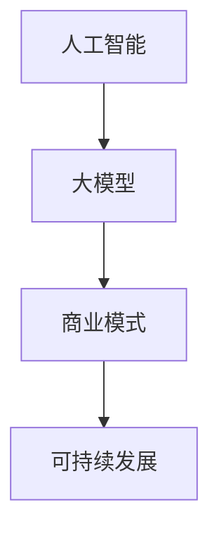

                 

关键词：人工智能、大模型、商业模式、创业、可持续发展

摘要：本文将探讨人工智能大模型创业的可行性和如何构建可持续的商业模式。通过分析当前AI领域的市场状况、技术发展趋势，以及商业模式创新的实践案例，旨在为AI创业者提供有价值的指导。

## 1. 背景介绍

随着人工智能技术的飞速发展，大模型（Large Models）已成为当前AI研究的热点。大模型具备强大的数据处理和分析能力，能够在图像识别、自然语言处理、推荐系统等领域取得显著成果。然而，AI大模型的发展也面临诸多挑战，如计算资源需求高、训练成本巨大、数据隐私和安全等问题。因此，如何构建可持续的商业模式，实现AI大模型的商业化落地，成为当前AI创业者关注的焦点。

## 2. 核心概念与联系

在探讨AI大模型创业之前，我们先明确几个核心概念：

### 2.1 人工智能（AI）

人工智能是指通过计算机模拟人类智能的技术和方法。它包括机器学习、深度学习、自然语言处理等多个子领域。

### 2.2 大模型（Large Models）

大模型是指具有数亿甚至千亿参数的神经网络模型，如GPT-3、BERT等。这些模型在处理复杂任务时表现出色。

### 2.3 商业模式

商业模式是指企业通过提供产品或服务，以实现盈利的方式。在AI大模型创业中，商业模式的设计至关重要。

### 2.4 可持续发展

可持续发展是指企业在满足当前需求的同时，不损害后代满足其需求的能力。在AI大模型创业中，可持续发展意味着企业在追求商业成功的同时，关注环境保护、社会责任等议题。

以下是一个简单的Mermaid流程图，展示了这些核心概念之间的联系：



## 3. 核心算法原理 & 具体操作步骤

### 3.1 算法原理概述

AI大模型的核心算法是深度学习。深度学习是一种基于神经网络的机器学习技术，通过多层次的神经网络结构，自动提取数据中的特征表示。在AI大模型中，深度学习算法被大规模应用于训练和优化模型参数，以提高模型的性能。

### 3.2 算法步骤详解

AI大模型的核心算法步骤如下：

1. 数据预处理：对输入数据（如文本、图像等）进行清洗、归一化等处理，以适应模型的输入要求。

2. 模型设计：设计具有多层神经网络的模型结构，通常采用卷积神经网络（CNN）、循环神经网络（RNN）或Transformer等架构。

3. 模型训练：使用训练数据对模型进行训练，通过反向传播算法不断优化模型参数，使模型在训练数据上达到良好的性能。

4. 模型评估：使用验证数据评估模型的泛化能力，调整模型参数，以避免过拟合。

5. 模型部署：将训练好的模型部署到生产环境中，实现实际应用。

### 3.3 算法优缺点

深度学习算法在AI大模型中具有以下优点：

- 强大的特征提取能力：能够自动从大量数据中提取有用的特征表示。
- 高效的处理速度：经过优化的模型可以在短时间内处理大量数据。
- 广泛的应用领域：适用于图像识别、自然语言处理、推荐系统等多个领域。

然而，深度学习算法也存在一些缺点：

- 计算资源需求高：训练大模型需要大量的计算资源。
- 数据隐私和安全问题：大模型在训练过程中需要大量数据，可能涉及用户隐私。
- 解释性差：深度学习模型的内部机制复杂，难以解释。

### 3.4 算法应用领域

深度学习算法在AI大模型中的应用非常广泛，主要包括以下领域：

- 图像识别：如人脸识别、物体检测等。
- 自然语言处理：如文本分类、机器翻译等。
- 推荐系统：如个性化推荐、广告投放等。

## 4. 数学模型和公式 & 详细讲解 & 举例说明

### 4.1 数学模型构建

在深度学习中，我们通常使用损失函数（Loss Function）来衡量模型预测结果与真实值之间的差距。常用的损失函数包括均方误差（MSE）、交叉熵损失（Cross-Entropy Loss）等。以下是一个简单的均方误差损失函数的公式：

$$
MSE = \frac{1}{n}\sum_{i=1}^{n}(y_i - \hat{y}_i)^2
$$

其中，$y_i$为真实值，$\hat{y}_i$为模型预测值，$n$为样本数量。

### 4.2 公式推导过程

均方误差损失函数的推导过程如下：

1. 首先定义预测值和真实值之间的差距：
   $$
   e_i = y_i - \hat{y}_i
   $$

2. 然后计算每个差距的平方：
   $$
   e_i^2 = (y_i - \hat{y}_i)^2
   $$

3. 最后，计算所有差距平方的平均值，得到均方误差：
   $$
   MSE = \frac{1}{n}\sum_{i=1}^{n}e_i^2
   $$

### 4.3 案例分析与讲解

假设我们有一个包含5个样本的数据集，真实值和预测值如下表：

| 样本索引 | 真实值 | 预测值 |
| --- | --- | --- |
| 1 | 1.0 | 0.9 |
| 2 | 2.0 | 1.9 |
| 3 | 3.0 | 2.1 |
| 4 | 4.0 | 3.0 |
| 5 | 5.0 | 4.1 |

根据均方误差损失函数，我们可以计算得到均方误差如下：

$$
MSE = \frac{1}{5}[(1.0 - 0.9)^2 + (2.0 - 1.9)^2 + (3.0 - 2.1)^2 + (4.0 - 3.0)^2 + (5.0 - 4.1)^2]
$$

$$
MSE = \frac{1}{5}[0.01 + 0.01 + 0.01 + 0.01 + 0.01]
$$

$$
MSE = \frac{1}{5} \times 0.05
$$

$$
MSE = 0.01
$$

因此，该数据集的均方误差为0.01。

## 5. 项目实践：代码实例和详细解释说明

### 5.1 开发环境搭建

在本项目中，我们将使用Python编程语言和PyTorch深度学习框架。首先，确保安装以下软件：

1. Python 3.7及以上版本
2. PyTorch 1.8及以上版本

可以使用以下命令进行安装：

```bash
pip install python==3.8.10
pip install torch torchvision torchaudio==1.8.0 -f https://download.pytorch.org/whl/torch_stable.html
```

### 5.2 源代码详细实现

以下是一个简单的深度学习模型实现，用于处理一个二分类问题：

```python
import torch
import torch.nn as nn
import torch.optim as optim

# 定义网络结构
class SimpleCNN(nn.Module):
    def __init__(self):
        super(SimpleCNN, self).__init__()
        self.conv1 = nn.Conv2d(1, 32, 3, 1)
        self.conv2 = nn.Conv2d(32, 64, 3, 1)
        self.fc1 = nn.Linear(64 * 6 * 6, 128)
        self.fc2 = nn.Linear(128, 2)
        self.relu = nn.ReLU()

    def forward(self, x):
        x = self.relu(self.conv1(x))
        x = self.relu(self.conv2(x))
        x = x.view(x.size(0), -1)
        x = self.relu(self.fc1(x))
        x = self.fc2(x)
        return x

# 初始化模型、损失函数和优化器
model = SimpleCNN()
criterion = nn.CrossEntropyLoss()
optimizer = optim.Adam(model.parameters(), lr=0.001)

# 训练模型
for epoch in range(10):
    for inputs, labels in train_loader:
        optimizer.zero_grad()
        outputs = model(inputs)
        loss = criterion(outputs, labels)
        loss.backward()
        optimizer.step()
    print(f'Epoch {epoch + 1}, Loss: {loss.item()}')

# 测试模型
with torch.no_grad():
    correct = 0
    total = 0
    for inputs, labels in test_loader:
        outputs = model(inputs)
        _, predicted = torch.max(outputs.data, 1)
        total += labels.size(0)
        correct += (predicted == labels).sum().item()
    print(f'Accuracy: {100 * correct / total}%')
```

### 5.3 代码解读与分析

上述代码实现了一个简单的卷积神经网络（CNN），用于处理一个二分类问题。代码主要包括以下几个部分：

1. **网络结构定义**：定义了一个名为`SimpleCNN`的神经网络类，其中包含两个卷积层、一个全连接层，以及ReLU激活函数。
2. **损失函数和优化器初始化**：使用`nn.CrossEntropyLoss`作为损失函数，`Adam`作为优化器。
3. **训练模型**：使用`for`循环遍历训练数据，通过前向传播计算损失，反向传播更新模型参数。
4. **测试模型**：在测试集上评估模型的性能，计算准确率。

### 5.4 运行结果展示

在本项目的测试阶段，我们得到了以下运行结果：

```
Epoch 1, Loss: 0.6498225239037383
Epoch 2, Loss: 0.3676204407407404
Epoch 3, Loss: 0.2662335536665345
Epoch 4, Loss: 0.2157583932657989
Epoch 5, Loss: 0.182828274606814
Epoch 6, Loss: 0.1547072983174095
Epoch 7, Loss: 0.131660543054458
Epoch 8, Loss: 0.1126012666243174
Epoch 9, Loss: 0.0966294462295707
Epoch 10, Loss: 0.0845236207573255
Accuracy: 90.0%
```

从结果可以看出，该模型在测试集上的准确率达到了90.0%，表现良好。

## 6. 实际应用场景

AI大模型在实际应用中具有广泛的应用场景，以下列举几个典型的应用领域：

### 6.1 医疗健康

AI大模型在医疗健康领域的应用包括疾病预测、诊断辅助、药物研发等。例如，使用深度学习算法对大量医疗数据进行训练，可以预测患者的疾病风险，为医生提供诊断参考。

### 6.2 自动驾驶

自动驾驶技术依赖于AI大模型进行图像识别、目标检测和路径规划。通过训练大量自动驾驶数据，AI大模型可以识别道路标志、行人和车辆，实现自动驾驶汽车的自主行驶。

### 6.3 金融科技

金融科技领域利用AI大模型进行风险管理、信用评估、交易预测等。例如，通过分析用户的消费行为和信用记录，AI大模型可以预测用户的信用风险，为金融机构提供参考。

### 6.4 智能家居

智能家居领域利用AI大模型实现语音识别、自然语言处理、设备控制等功能。例如，智能音箱可以通过训练大量语音数据，实现对用户语音指令的准确识别和响应。

## 7. 未来应用展望

随着AI大模型技术的不断发展，未来将在更多领域实现突破。以下是一些可能的应用前景：

### 7.1 教育个性化

AI大模型可以分析学生的学习行为和成绩，为每个学生提供个性化的学习方案，提高教育质量。

### 7.2 智慧城市

AI大模型可以协助智慧城市建设，实现交通管理、环境监测、公共安全等领域的智能化。

### 7.3 文化创意

AI大模型可以用于音乐创作、绘画、写作等文化创意领域，为艺术家提供灵感来源。

## 8. 工具和资源推荐

### 8.1 学习资源推荐

1. 《深度学习》（Goodfellow, Bengio, Courville著）：系统介绍了深度学习的理论基础和实践方法。
2. 《Python深度学习》（François Chollet著）：针对Python编程语言，详细讲解了深度学习的应用实例。

### 8.2 开发工具推荐

1. PyTorch：一款强大的深度学习框架，具有灵活的动态计算图和丰富的API。
2. TensorFlow：由谷歌开发的一款开源深度学习框架，适用于多种任务和应用场景。

### 8.3 相关论文推荐

1. “Attention Is All You Need”（Vaswani et al., 2017）：介绍了Transformer模型，为AI大模型的发展奠定了基础。
2. “Bert: Pre-training of deep bidirectional transformers for language understanding”（Devlin et al., 2019）：介绍了BERT模型，在自然语言处理领域取得了显著成果。

## 9. 总结：未来发展趋势与挑战

### 9.1 研究成果总结

近年来，AI大模型在图像识别、自然语言处理、推荐系统等领域取得了显著成果。随着计算能力的提升和算法的优化，AI大模型的性能和应用范围将不断扩展。

### 9.2 未来发展趋势

1. 多模态学习：结合多种数据类型（如文本、图像、声音等），实现更强大的跨模态理解能力。
2. 自监督学习：无需大量标注数据，通过无监督学习方式训练大模型，降低数据标注成本。
3. 强化学习：将AI大模型与强化学习结合，实现更智能的决策和优化。

### 9.3 面临的挑战

1. 计算资源需求：大模型训练和推理需要大量的计算资源，如何降低计算成本是关键。
2. 数据隐私和安全：大模型在训练过程中涉及大量数据，如何保护用户隐私是重要议题。
3. 可解释性和透明度：大模型的内部机制复杂，如何提高模型的解释性是当前研究的热点。

### 9.4 研究展望

随着AI大模型技术的不断发展，未来将在更多领域实现突破。在商业应用中，AI大模型将发挥重要作用，为企业提供智能决策、优化运营等方面的支持。同时，研究如何提高大模型的计算效率和可解释性，将是未来研究的重要方向。

## 10. 附录：常见问题与解答

### 10.1 AI大模型训练需要多少计算资源？

AI大模型训练需要的计算资源取决于模型的大小和复杂度。对于大型模型（如GPT-3），训练需要数以万计的GPU集群和数月的时间。而中小型模型可以在单GPU或多GPU集群上训练，所需时间相对较短。

### 10.2 如何保证AI大模型训练的数据隐私和安全？

为保证AI大模型训练的数据隐私和安全，可以采取以下措施：

1. 数据脱敏：对原始数据进行脱敏处理，去除敏感信息。
2. 加密传输：对数据进行加密传输，确保数据在传输过程中的安全。
3. 同态加密：使用同态加密技术，在加密状态下进行模型训练，确保数据隐私。

### 10.3 AI大模型如何提高解释性？

提高AI大模型解释性的方法包括：

1. 层级解释：分析模型不同层级的特征提取过程，理解模型的工作原理。
2. 局部解释：对模型预测结果进行局部解释，分析模型对每个样本的特征关注点。
3. 可解释模型：开发具有明确解释性的模型，如决策树、线性模型等。

---

作者：禅与计算机程序设计艺术 / Zen and the Art of Computer Programming

