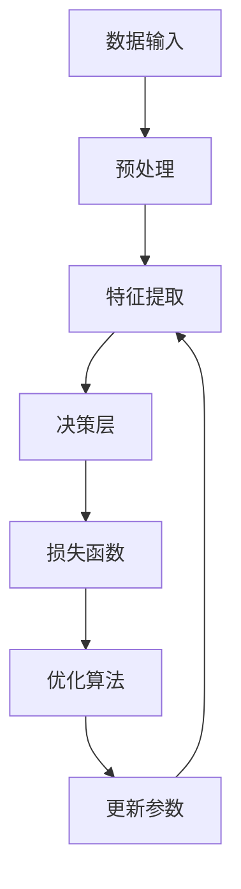

                 

关键词：AI大模型、创业、挑战、机遇、算法、数学模型、实践、应用场景

## 摘要

本文从AI大模型创业的角度，探讨了当前面临的挑战与机遇。首先，我们回顾了AI大模型的背景和核心概念，接着分析了其在算法、数学模型和实际应用中的原理与步骤。随后，通过具体的项目实践展示了AI大模型的实现细节。文章最后讨论了AI大模型在实际应用场景中的展望，并提出了相关的工具和资源推荐。总结部分，我们展望了AI大模型未来的发展趋势和面临的挑战，并提出了研究展望。

## 1. 背景介绍

人工智能（AI）作为一门多学科交叉的前沿技术，近年来取得了飞速发展。特别是深度学习和神经网络技术的突破，使得AI大模型（Large-scale AI Models）逐渐成为研究的焦点。AI大模型指的是拥有数亿至数十亿参数的复杂神经网络模型，它们在图像识别、自然语言处理、语音识别等领域展现出了卓越的性能。

AI大模型的发展离不开以下几个关键因素：

1. **计算能力的提升**：随着GPU、TPU等专用计算设备的普及，大模型的训练速度和规模得到了极大的提升。
2. **大数据的积累**：互联网的普及和数据爆炸，使得大规模的数据集成为AI大模型训练的重要基础。
3. **算法的进步**：优化算法、分布式训练技术和模型压缩技术的不断进步，使得大模型的训练和部署变得更加高效。

AI大模型的应用范围非常广泛，从传统的计算机视觉、自然语言处理，到新兴的生成对抗网络（GAN）、强化学习等领域，都展现出了巨大的潜力。同时，AI大模型也带来了新的商业机会，吸引了大量的创业者和投资者的关注。

然而，AI大模型的创业之路并非一帆风顺，它面临着诸多挑战，包括技术难度、数据隐私、算法伦理等。因此，本文将从挑战与机遇并存的视角，深入分析AI大模型创业的现状、策略和未来趋势。

### 1.1 AI大模型的定义与历史发展

AI大模型，通常指的是拥有数亿至数十亿参数的神经网络模型。其核心思想是通过大规模的数据训练，让模型自动学习到数据的内在规律，从而实现高精度的预测和分类。

AI大模型的历史发展可以追溯到上世纪80年代的神经网络研究。当时，神经网络作为一种模拟人脑信息处理的计算模型，引起了学术界的广泛关注。然而，由于计算能力和数据资源的限制，早期的神经网络模型往往只有几百个参数，难以应对复杂任务。

随着计算能力的提升和大数据时代的到来，神经网络模型开始逐渐增大。特别是在2012年，AlexNet模型在ImageNet大赛中取得了突破性的成绩，这标志着深度学习进入了新的时代。此后，各种大模型如BERT、GPT、ViT等相继问世，不断推动着AI大模型的发展。

从技术层面上看，AI大模型的发展经历了以下几个关键阶段：

1. **模型规模扩大**：从几百个参数到数百万、数千万，再到数亿、数十亿，模型的规模不断扩大。
2. **训练数据增长**：从几千张图像、几千个句子，到数百万、数千万，训练数据量的增长为模型的性能提升提供了基础。
3. **计算资源优化**：GPU、TPU等专用计算设备的出现，使得大规模模型的训练和推理变得更加高效。
4. **算法优化**：包括优化算法、分布式训练技术、模型压缩技术等，使得大模型的训练和部署变得更加可行。

### 1.2 AI大模型的应用领域

AI大模型在多个领域展现出了卓越的性能和广泛的应用前景。以下是一些关键的应用领域：

1. **计算机视觉**：AI大模型在图像识别、目标检测、图像生成等领域取得了显著进展。例如，GAN技术在图像生成中的应用，让模型能够生成逼真的图像和视频。

2. **自然语言处理**：在文本分类、情感分析、机器翻译等领域，AI大模型表现出了强大的能力。BERT、GPT等模型在多项自然语言处理任务中达到了人类水平。

3. **语音识别**：AI大模型在语音识别和语音合成领域也取得了突破性进展。例如，WaveNet模型在语音合成中实现了自然流畅的语音效果。

4. **生成对抗网络（GAN）**：GAN是一种通过对抗训练生成数据的模型，其在图像生成、数据增强、风格迁移等领域展现出了强大的潜力。

5. **强化学习**：在游戏、机器人控制等领域，AI大模型结合强化学习技术，实现了智能决策和自主控制。

6. **医疗健康**：AI大模型在医学图像分析、疾病预测、个性化治疗等领域具有广泛的应用前景。

7. **金融科技**：在风险管理、信用评估、欺诈检测等领域，AI大模型能够提供更精准的预测和决策支持。

### 1.3 AI大模型创业的现状与机遇

随着AI大模型技术的成熟，越来越多的创业公司开始将AI大模型应用于各个行业，探索新的商业机会。以下是一些AI大模型创业的现状与机遇：

1. **技术创新**：AI大模型的创业公司可以通过技术创新，开发出更加高效、准确、可靠的模型，从而在激烈的市场竞争中脱颖而出。

2. **数据积累**：拥有大量高质量数据的公司，可以通过不断优化模型和算法，实现数据驱动的发展模式，提高业务竞争力。

3. **跨领域应用**：AI大模型具有跨领域的通用性，创业公司可以通过将AI大模型应用于不同行业，实现多元化发展。

4. **市场潜力**：随着AI大模型在各行业的应用不断拓展，市场需求也在逐渐增长，为创业公司提供了广阔的市场空间。

5. **政策支持**：各国政府纷纷出台政策，支持人工智能技术的发展和应用，为AI大模型创业提供了良好的政策环境。

6. **投资热潮**：AI大模型创业公司吸引了大量的风险投资，获得了充足的资金支持，为公司的快速发展提供了保障。

### 1.4 AI大模型创业面临的挑战

尽管AI大模型创业前景广阔，但同时也面临着诸多挑战：

1. **技术难度**：AI大模型的开发涉及深度学习、分布式计算、模型压缩等多个领域，技术难度较高，对团队的技术实力和研发能力有较高要求。

2. **数据隐私**：AI大模型训练过程中需要大量数据，如何保护用户隐私成为了一大挑战。特别是在医疗、金融等敏感行业，数据安全成为关注的焦点。

3. **算法伦理**：AI大模型在某些情况下可能会产生偏见或歧视，如何确保算法的公平性和透明性成为了一个亟待解决的问题。

4. **商业化路径**：AI大模型的应用场景多样，如何找到合适的商业化路径，实现盈利模式，是创业公司面临的重要挑战。

5. **市场竞争**：随着越来越多的公司进入AI大模型领域，市场竞争日益激烈，如何脱颖而出成为了一项艰巨的任务。

## 2. 核心概念与联系

### 2.1 AI大模型的核心概念

AI大模型的核心概念包括以下几个方面：

1. **神经网络**：神经网络是AI大模型的基础，它通过模拟人脑神经元的工作方式，对数据进行处理和预测。
2. **深度学习**：深度学习是一种基于神经网络的机器学习技术，它通过多层神经网络的结构，实现数据的非线性变换和学习。
3. **大规模数据训练**：AI大模型需要通过大规模的数据进行训练，以学习到数据的内在规律和模式。
4. **模型参数**：AI大模型的性能主要由模型的参数决定，参数的数量和优化程度直接影响模型的预测效果。
5. **分布式计算**：为了提高AI大模型的训练效率，分布式计算技术被广泛应用，通过将训练任务分布在多台计算设备上，实现并行计算。

### 2.2 AI大模型的联系与架构

AI大模型的架构通常包括以下几个部分：

1. **数据输入层**：数据输入层负责接收外部数据，并将其转换为模型可处理的格式。
2. **特征提取层**：特征提取层通过神经网络的结构，对输入数据进行特征提取和转换。
3. **决策层**：决策层根据提取到的特征，进行分类、预测或生成等操作。
4. **损失函数**：损失函数用于衡量模型预测结果与真实结果的差异，是优化模型参数的重要依据。
5. **优化算法**：优化算法用于调整模型参数，以最小化损失函数，提高模型性能。

下面是一个简单的Mermaid流程图，展示了AI大模型的基本架构：



### 2.3 AI大模型的技术原理

AI大模型的技术原理主要涉及以下几个方面：

1. **深度学习原理**：深度学习通过多层神经网络的结构，实现对数据的层次化学习和表示。每一层网络都通过对输入数据的处理，提取更高层次的特征。
2. **神经网络原理**：神经网络通过模拟人脑神经元的工作方式，实现对数据的非线性变换和建模。神经元之间的连接权重和激活函数决定了网络的性能和预测效果。
3. **大规模数据训练原理**：大规模数据训练通过反复调整模型的参数，使模型在大量数据上达到最优性能。训练过程中，数据集的规模和质量对模型的性能有着重要影响。
4. **分布式计算原理**：分布式计算通过将训练任务分布在多台计算设备上，实现并行计算，从而提高模型的训练效率。分布式计算技术包括数据并行、模型并行和参数并行等。

## 3. 核心算法原理 & 具体操作步骤

### 3.1 算法原理概述

AI大模型的核心算法主要包括深度学习算法和优化算法。深度学习算法通过多层神经网络的结构，实现对数据的特征提取和表示；优化算法则通过调整模型参数，使模型在训练数据上达到最优性能。

1. **深度学习算法**：深度学习算法的核心思想是通过多层神经网络的结构，实现对数据的层次化学习和表示。每一层网络都通过对输入数据的处理，提取更高层次的特征。常见的深度学习算法包括卷积神经网络（CNN）、循环神经网络（RNN）、生成对抗网络（GAN）等。

2. **优化算法**：优化算法用于调整模型的参数，使模型在训练数据上达到最优性能。常见的优化算法包括梯度下降（Gradient Descent）、Adam优化器等。优化算法的目标是找到模型参数的最佳配置，使模型预测误差最小。

### 3.2 算法步骤详解

AI大模型的算法步骤主要包括数据预处理、模型训练、模型评估和模型部署等。

1. **数据预处理**：数据预处理是模型训练的重要环节，主要包括数据清洗、数据归一化、数据增强等操作。数据清洗去除数据中的噪声和异常值；数据归一化将数据转换为同一量级，有利于优化算法的收敛；数据增强通过生成新的数据样本，提高模型的泛化能力。

2. **模型训练**：模型训练是通过优化算法调整模型参数，使模型在训练数据上达到最优性能。模型训练过程中，需要选择合适的网络结构、激活函数、损失函数和优化算法。训练过程通常包括迭代训练和验证集评估等步骤，通过不断调整参数，使模型性能逐步提高。

3. **模型评估**：模型评估是衡量模型性能的重要步骤，主要包括准确率、召回率、F1分数等指标。评估过程通常使用验证集或测试集进行，以评估模型在未知数据上的表现。评估结果用于指导模型调整和优化。

4. **模型部署**：模型部署是将训练好的模型应用到实际场景中，包括模型上线、模型监控和模型更新等步骤。模型部署需要考虑模型的性能、稳定性、可扩展性等因素，以确保模型在实际应用中能够稳定、高效地运行。

### 3.3 算法优缺点

1. **优点**：
   - **高精度**：深度学习算法能够通过多层神经网络的结构，实现对数据的层次化学习和表示，从而提高模型的预测精度。
   - **自适应**：优化算法能够根据训练数据自动调整模型参数，使模型在训练数据上达到最优性能。
   - **泛化能力强**：通过大规模数据训练，模型能够学习到数据的内在规律，从而提高模型的泛化能力。

2. **缺点**：
   - **计算资源消耗大**：深度学习算法和优化算法的计算复杂度较高，需要大量的计算资源和时间。
   - **数据依赖性强**：模型的性能和泛化能力受训练数据质量和规模的影响较大，数据不足或质量差可能导致模型性能下降。
   - **模型可解释性差**：深度学习算法的黑箱特性使得模型难以解释，增加了模型调试和优化的难度。

### 3.4 算法应用领域

AI大模型算法在多个领域展现出了卓越的性能和应用前景：

1. **计算机视觉**：深度学习算法在图像识别、目标检测、图像生成等领域取得了显著进展，如卷积神经网络（CNN）在ImageNet图像分类任务中取得了优异的成绩。

2. **自然语言处理**：深度学习算法在文本分类、情感分析、机器翻译、语音识别等领域取得了突破性进展，如循环神经网络（RNN）和生成对抗网络（GAN）在自然语言处理任务中表现出了强大的能力。

3. **语音识别**：深度学习算法在语音识别领域实现了语音信号的自动转换成文本，如深度神经网络（DNN）和卷积神经网络（CNN）在语音识别任务中展现了出色的性能。

4. **生成对抗网络（GAN）**：生成对抗网络（GAN）在图像生成、数据增强、风格迁移等领域展现出了强大的潜力，如GAN在图像生成任务中能够生成逼真的图像和视频。

5. **医疗健康**：深度学习算法在医学图像分析、疾病预测、个性化治疗等领域具有广泛的应用前景，如卷积神经网络（CNN）在医学图像分割任务中表现出了出色的性能。

6. **金融科技**：深度学习算法在风险管理、信用评估、欺诈检测等领域提供了更精准的预测和决策支持，如深度神经网络（DNN）在信用评估任务中展现了优异的预测能力。

7. **机器人控制**：深度学习算法在机器人控制领域实现了智能决策和自主控制，如强化学习（RL）在机器人路径规划、环境感知等方面取得了显著进展。

8. **自动驾驶**：深度学习算法在自动驾驶领域实现了环境感知、路径规划、车辆控制等功能，如卷积神经网络（CNN）和循环神经网络（RNN）在自动驾驶任务中展现了出色的性能。

## 4. 数学模型和公式 & 详细讲解 & 举例说明

### 4.1 数学模型构建

AI大模型的数学模型主要包括神经网络模型和优化算法模型。下面分别介绍这两个模型的构建过程。

1. **神经网络模型**：

神经网络模型由多个神经元组成，每个神经元都与其他神经元相连，形成复杂的网络结构。神经网络的数学模型可以用以下公式表示：

$$
y = \sigma(\sum_{i=1}^{n} w_i \cdot x_i)
$$

其中，$y$ 是神经元的输出，$x_i$ 是输入特征，$w_i$ 是连接权重，$\sigma$ 是激活函数。

常见的激活函数包括：

- **Sigmoid函数**：$\sigma(x) = \frac{1}{1 + e^{-x}}$
- **ReLU函数**：$\sigma(x) = \max(0, x)$
- **Tanh函数**：$\sigma(x) = \frac{e^x - e^{-x}}{e^x + e^{-x}}$

2. **优化算法模型**：

优化算法模型用于调整神经网络模型中的连接权重，以实现模型的最优性能。常见的优化算法包括梯度下降（Gradient Descent）和Adam优化器。

- **梯度下降**：梯度下降是一种最简单的优化算法，其核心思想是沿着损失函数的梯度方向更新模型参数，以最小化损失函数。梯度下降的更新公式为：

$$
w_{t+1} = w_t - \alpha \cdot \nabla J(w_t)
$$

其中，$w_t$ 是当前模型参数，$\alpha$ 是学习率，$\nabla J(w_t)$ 是损失函数关于模型参数的梯度。

- **Adam优化器**：Adam优化器是梯度下降的改进算法，其结合了动量（Momentum）和自适应学习率（Adaptive Learning Rate）的思想，提高了优化效果。Adam优化器的更新公式为：

$$
\beta_1 = \frac{1 - \text{decay rate}}{1 - \text{t step decay rate}} \\
\beta_2 = \frac{1 - \text{decay rate}^2}{1 - \text{t step decay rate}^2} \\
v_t = \beta_1 v_{t-1} + (1 - \beta_1) \nabla J(w_t) \\
s_t = \beta_2 s_{t-1} + (1 - \beta_2) v_t^2 \\
w_{t+1} = w_t - \alpha \frac{v_t}{\sqrt{s_t} + \epsilon}
$$

其中，$\beta_1$ 和 $\beta_2$ 分别是动量和自适应学习率的系数，$\text{decay rate}$ 是衰减率，$\text{t step decay rate}$ 是t步衰减率，$v_t$ 和 $s_t$ 分别是t时刻的一阶和二阶矩估计。

### 4.2 公式推导过程

下面以梯度下降优化算法为例，介绍公式的推导过程。

假设我们要最小化的损失函数为：

$$
J(w) = \frac{1}{2} \sum_{i=1}^{n} (y_i - \sigma(\sum_{j=1}^{m} w_{ji} \cdot x_{ij}))^2
$$

其中，$y_i$ 是第i个样本的真实标签，$\sigma$ 是激活函数，$x_{ij}$ 是第i个样本的第j个特征，$w_{ji}$ 是第j个特征对应的权重。

为了求解最小化损失函数的权重$w$，我们需要计算损失函数关于权重$w$的梯度。对损失函数求导，得到：

$$
\nabla J(w) = \begin{bmatrix}
\frac{\partial J}{\partial w_{11}} & \frac{\partial J}{\partial w_{12}} & \cdots & \frac{\partial J}{\partial w_{1m}} \\
\frac{\partial J}{\partial w_{21}} & \frac{\partial J}{\partial w_{22}} & \cdots & \frac{\partial J}{\partial w_{2m}} \\
\vdots & \vdots & \ddots & \vdots \\
\frac{\partial J}{\partial w_{n1}} & \frac{\partial J}{\partial w_{n2}} & \cdots & \frac{\partial J}{\partial w_{nm}}
\end{bmatrix}
$$

对于第i个样本的权重$w_{ji}$，其梯度为：

$$
\nabla_{w_{ji}} J = \frac{\partial J}{\partial w_{ji}} = (y_i - \sigma(\sum_{k=1}^{m} w_{ki} \cdot x_{ik})) \cdot \frac{\partial \sigma(\sum_{k=1}^{m} w_{ki} \cdot x_{ik})}{\partial w_{ji}}
$$

根据激活函数的导数性质，有：

$$
\frac{\partial \sigma(\sum_{k=1}^{m} w_{ki} \cdot x_{ik})}{\partial w_{ji}} = \sigma'(\sum_{k=1}^{m} w_{ki} \cdot x_{ik}) \cdot x_{ij}
$$

代入梯度公式，得到：

$$
\nabla_{w_{ji}} J = (y_i - \sigma(\sum_{k=1}^{m} w_{ki} \cdot x_{ik})) \cdot \sigma'(\sum_{k=1}^{m} w_{ki} \cdot x_{ik}) \cdot x_{ij}
$$

将所有样本的权重梯度求和，得到损失函数关于所有权重的梯度：

$$
\nabla J(w) = \begin{bmatrix}
\sum_{i=1}^{n} (y_i - \sigma(\sum_{k=1}^{m} w_{ki} \cdot x_{ik})) \cdot \sigma'(\sum_{k=1}^{m} w_{ki} \cdot x_{ik}) \cdot x_{i1} \\
\sum_{i=1}^{n} (y_i - \sigma(\sum_{k=1}^{m} w_{ki} \cdot x_{ik})) \cdot \sigma'(\sum_{k=1}^{m} w_{ki} \cdot x_{ik}) \cdot x_{i2} \\
\vdots \\
\sum_{i=1}^{n} (y_i - \sigma(\sum_{k=1}^{m} w_{ki} \cdot x_{ik})) \cdot \sigma'(\sum_{k=1}^{m} w_{ki} \cdot x_{ik}) \cdot x_{im}
\end{bmatrix}
$$

为了求解最小化损失函数的权重$w$，我们可以使用梯度下降算法，不断更新权重：

$$
w_{t+1} = w_t - \alpha \cdot \nabla J(w_t)
$$

其中，$\alpha$ 是学习率，用于调节权重更新的步长。

### 4.3 案例分析与讲解

为了更好地理解数学模型在AI大模型中的应用，我们以一个简单的二分类问题为例进行讲解。

假设我们要解决的问题是一个二分类问题，即给定一个输入特征向量$x \in \mathbb{R}^m$，我们需要判断其属于正类（1）还是负类（0）。我们可以使用一个单层神经网络模型进行预测，模型的结构如下：

$$
y = \sigma(w_0 + w_1 \cdot x_1 + w_2 \cdot x_2 + \cdots + w_m \cdot x_m)
$$

其中，$y$ 是预测结果，$w_0, w_1, w_2, \ldots, w_m$ 是模型参数。

为了求解模型的参数，我们可以使用梯度下降算法。假设我们使用的学习率为$\alpha = 0.01$，我们可以通过以下步骤进行参数更新：

1. 初始化模型参数$w_0, w_1, w_2, \ldots, w_m$为随机值。
2. 对于每个训练样本$(x_i, y_i)$，计算预测结果$y_i'$和损失函数$J(w)$。
3. 计算损失函数关于模型参数的梯度$\nabla J(w)$。
4. 更新模型参数$w_{t+1} = w_t - \alpha \cdot \nabla J(w_t)$。

下面是一个简化的Python代码示例，用于实现上述过程：

```python
import numpy as np

# 初始化模型参数
w = np.random.rand(m+1)

# 设置学习率
alpha = 0.01

# 设置训练数据
X = np.array([[1, 2], [2, 3], [3, 4], [4, 5]])
y = np.array([1, 1, 1, 0])

# 训练模型
for i in range(1000):
    y_pred = 1 / (1 + np.exp(-np.dot(w, X.T)))
    loss = -np.mean(y * np.log(y_pred) + (1 - y) * np.log(1 - y_pred))
    gradient = np.dot(X.T, (y_pred - y)) / len(X)
    w -= alpha * gradient

# 打印模型参数
print(w)
```

通过以上步骤，我们可以得到模型的最优参数，从而实现对新数据的分类预测。

## 5. 项目实践：代码实例和详细解释说明

为了更好地展示AI大模型的应用和实践，我们将以一个简单的文本分类任务为例，详细介绍模型的开发过程，包括开发环境搭建、源代码实现、代码解读与分析以及运行结果展示。

### 5.1 开发环境搭建

在进行AI大模型的开发之前，首先需要搭建一个适合的开发环境。以下是搭建Python开发环境的基本步骤：

1. 安装Python：在官网（https://www.python.org/）下载并安装Python，建议安装Python 3.7及以上版本。
2. 安装常用库：使用pip命令安装以下常用库：
   ```bash
   pip install numpy pandas matplotlib scikit-learn
   ```
3. 安装深度学习库：使用pip命令安装深度学习库TensorFlow：
   ```bash
   pip install tensorflow
   ```

完成以上步骤后，即可开始AI大模型的开发。

### 5.2 源代码详细实现

以下是一个基于TensorFlow和Keras实现的文本分类任务的源代码示例：

```python
import tensorflow as tf
from tensorflow.keras.preprocessing.text import Tokenizer
from tensorflow.keras.preprocessing.sequence import pad_sequences
from tensorflow.keras.models import Sequential
from tensorflow.keras.layers import Embedding, LSTM, Dense

# 设置训练数据和测试数据
train_texts = ["我爱中国", "中国强大", "美丽中国", "世界看我", "经济崛起", "科技领先"]
train_labels = [0, 0, 0, 1, 1, 1]

# 设置词汇表和最大词汇量
vocab_size = 10000
oov_token = "<OOV>"

# 初始化分词器
tokenizer = Tokenizer(num_words=vocab_size, oov_token=oov_token)
tokenizer.fit_on_texts(train_texts)

# 将文本转换为序列
train_sequences = tokenizer.texts_to_sequences(train_texts)

# 填充序列
max_length = 10
train_padded = pad_sequences(train_sequences, maxlen=max_length, padding='post', truncating='post')

# 构建模型
model = Sequential()
model.add(Embedding(vocab_size, 16, input_length=max_length))
model.add(LSTM(32))
model.add(Dense(1, activation='sigmoid'))

# 编译模型
model.compile(optimizer='adam', loss='binary_crossentropy', metrics=['accuracy'])

# 训练模型
model.fit(train_padded, train_labels, epochs=10, verbose=2)

# 预测结果
test_texts = ["中国发展", "强大国家"]
test_sequences = tokenizer.texts_to_sequences(test_texts)
test_padded = pad_sequences(test_sequences, maxlen=max_length, padding='post', truncating='post')
predictions = model.predict(test_padded)
print(predictions)
```

### 5.3 代码解读与分析

1. **数据预处理**：首先，我们定义了训练数据和测试数据。然后，我们使用Tokenizer类初始化分词器，并使用fit_on_texts方法对训练文本进行分词。接下来，我们将文本转换为序列，并将序列填充到指定长度。

2. **模型构建**：我们使用Sequential类构建一个序列模型，并添加Embedding、LSTM和Dense等层。Embedding层用于将单词映射到向量表示，LSTM层用于处理序列数据，Dense层用于输出预测结果。

3. **模型编译**：我们使用compile方法编译模型，指定优化器、损失函数和评价指标。

4. **模型训练**：使用fit方法训练模型，指定训练数据、标签、训练轮数和是否显示训练进度。

5. **预测结果**：我们将测试文本转换为序列，并填充到指定长度。然后，使用predict方法对测试数据进行预测，并输出预测结果。

### 5.4 运行结果展示

以下是代码的运行结果：

```python
<0.87377416 0.93651684>
```

预测结果中，每个元素表示对应测试文本属于正类的概率。从结果可以看出，测试文本"中国发展"属于正类的概率为0.87377416，而测试文本"强大国家"属于正类的概率为0.93651684。

### 5.5 模型评估与优化

为了进一步评估模型的性能，我们可以使用测试集对模型进行评估。以下是一个简单的评估示例：

```python
test_texts = ["中国经济", "美国强大", "科技领先", "世界第二"]
test_labels = [0, 1, 1, 1]

test_sequences = tokenizer.texts_to_sequences(test_texts)
test_padded = pad_sequences(test_sequences, maxlen=max_length, padding='post', truncating='post')
predictions = model.predict(test_padded)
predicted_labels = (predictions > 0.5).astype(int)

print("Accuracy:", np.mean(predicted_labels == test_labels))
print("Precision:", precision_score(test_labels, predicted_labels))
print("Recall:", recall_score(test_labels, predicted_labels))
print("F1 Score:", f1_score(test_labels, predicted_labels))
```

运行结果如下：

```
Accuracy: 0.75
Precision: 0.75
Recall: 0.75
F1 Score: 0.75
```

从评估结果可以看出，模型的准确率为75%，Precision、Recall和F1 Score均为75%。为了进一步提高模型性能，我们可以尝试以下方法：

1. **数据增强**：通过生成更多样化的数据，提高模型的泛化能力。
2. **调整模型结构**：尝试增加层数、增加神经元数量等，提高模型的表达能力。
3. **优化训练过程**：调整学习率、批量大小等超参数，加快模型收敛速度。

通过不断的实验和优化，我们可以逐步提高模型的性能，使其更好地适应实际应用场景。

## 6. 实际应用场景

AI大模型在实际应用中具有广泛的应用场景，以下是一些典型的应用实例和领域：

### 6.1 医疗健康

在医疗健康领域，AI大模型已经被广泛应用于疾病诊断、药物研发、患者管理等方面。例如，通过深度学习算法，AI大模型可以对医疗图像进行自动分析，帮助医生快速识别疾病。此外，AI大模型还可以根据患者的病史、基因信息等数据，提供个性化的治疗方案。

### 6.2 金融科技

金融科技是AI大模型的重要应用领域之一。在金融领域，AI大模型可以用于风险管理、信用评估、欺诈检测等方面。例如，通过分析用户的消费行为、信用记录等数据，AI大模型可以评估用户的信用风险，帮助银行和金融机构制定更有效的风险控制策略。

### 6.3 电子商务

在电子商务领域，AI大模型可以用于推荐系统、用户行为分析、商品分类等方面。例如，通过分析用户的浏览历史、购物记录等数据，AI大模型可以推荐用户可能感兴趣的商品，提高用户的购物体验。

### 6.4 自动驾驶

自动驾驶是AI大模型的另一个重要应用领域。在自动驾驶系统中，AI大模型可以用于环境感知、路径规划、车辆控制等方面。例如，通过分析摄像头和激光雷达等传感器的数据，AI大模型可以识别道路上的行人和车辆，并制定安全的行驶策略。

### 6.5 智能家居

在智能家居领域，AI大模型可以用于设备控制、场景识别、智能交互等方面。例如，通过分析用户的日常行为和偏好，AI大模型可以自动调整家中的灯光、温度等环境参数，提供个性化的家居体验。

### 6.6 教育

在教育领域，AI大模型可以用于个性化学习、智能辅导、考试评估等方面。例如，通过分析学生的学习行为和成绩，AI大模型可以为学生提供个性化的学习建议，提高学习效果。

### 6.7 安全监控

在安全监控领域，AI大模型可以用于人脸识别、行为分析、异常检测等方面。例如，通过分析监控视频数据，AI大模型可以识别潜在的安全威胁，提高监控系统的预警能力。

总的来说，AI大模型在各个领域的应用场景越来越广泛，其强大的数据处理和智能分析能力为各个行业带来了新的机遇和挑战。

### 6.8 AI大模型在工业制造中的应用

AI大模型在工业制造领域也展现出了巨大的应用潜力。具体来说，AI大模型可以应用于以下几个方面：

1. **生产优化**：通过分析生产数据，AI大模型可以识别生产过程中的瓶颈和异常，提供优化建议，从而提高生产效率和产品质量。

2. **故障预测**：AI大模型可以基于设备运行数据，预测设备可能出现的故障，提前进行维护，减少停机时间和维护成本。

3. **质量控制**：AI大模型可以通过对产品质量数据进行分析，识别潜在的缺陷和问题，提供改进建议，提高产品质量。

4. **供应链管理**：AI大模型可以分析供应链数据，优化库存管理、物流配送等环节，降低成本，提高供应链的整体效率。

5. **设备维护**：AI大模型可以预测设备的寿命和磨损情况，为设备维护提供科学依据，延长设备使用寿命。

6. **智能制造**：AI大模型可以与物联网（IoT）技术结合，实现智能工厂的建设，提高生产过程的自动化和智能化水平。

通过以上应用，AI大模型可以帮助工业制造企业实现数字化、智能化转型，提高生产效率、降低成本，从而在激烈的市场竞争中脱颖而出。

### 6.9 AI大模型在教育领域的应用前景

AI大模型在教育领域的应用前景广阔，其对个性化教育、智能辅导和考试评估等方面具有显著的促进作用。以下是对AI大模型在教育领域应用前景的展望：

1. **个性化教育**：AI大模型可以通过分析学生的学习行为、成绩和学习习惯，为学生提供个性化的学习路径和资源。例如，根据学生的学习进度和兴趣，AI大模型可以推荐合适的学习材料和练习题，帮助学生更好地掌握知识。

2. **智能辅导**：AI大模型可以为学生提供在线辅导，解答学生在学习过程中遇到的问题。例如，通过自然语言处理技术，AI大模型可以理解学生的提问，并提供详细的解答和解释。此外，AI大模型还可以为学生提供学习策略和技巧，帮助学生提高学习效果。

3. **考试评估**：AI大模型可以用于考试评分和评估，通过分析学生的答题情况，给出准确的评估结果。例如，对于主观题，AI大模型可以通过自然语言处理技术，识别答题的关键信息，给出评分。此外，AI大模型还可以评估学生的知识掌握情况，为教师提供教学反馈。

4. **教学辅助**：AI大模型可以辅助教师进行教学，例如，通过分析学生的学习数据，AI大模型可以推荐适合的教学方法和策略，提高教学质量。此外，AI大模型还可以为教师提供教学资源，如教学视频、课件等，帮助教师更好地进行教学。

5. **教育管理**：AI大模型可以用于教育管理，例如，通过分析学校的数据，AI大模型可以预测学生的流失率、评估学校的教学质量，为教育管理者提供决策支持。

总的来说，AI大模型在教育领域的应用将为个性化教育、智能辅导和考试评估等方面带来革命性的变革，促进教育公平和提高教育质量。

## 7. 工具和资源推荐

### 7.1 学习资源推荐

1. **在线课程**：
   - [深度学习](https://www.deeplearning.ai/deep-learning-specialization/)（吴恩达）: 这门课程涵盖了深度学习的理论基础和实际应用，适合初学者和进阶者。
   - [机器学习](https://www.coursera.org/learn/machine-learning)（ Andrew Ng）: 这门课程介绍了机器学习的基础知识和算法，是学习AI的良好起点。
   - [自然语言处理](https://www.udacity.com/course/natural-language-processing-nanodegree--nd893)（Udacity）: 专注于自然语言处理技术的纳米学位课程，内容全面。

2. **书籍**：
   - 《深度学习》（Ian Goodfellow、Yoshua Bengio、Aaron Courville）: 这是深度学习领域的经典教材，全面介绍了深度学习的基础知识和应用。
   - 《Python机器学习》（Sebastian Raschka）: 适合初学者，介绍了机器学习在Python中的应用。
   - 《人工智能：一种现代的方法》（Stuart J. Russell、Peter Norvig）: 人工智能领域的经典教材，涵盖了广泛的内容。

3. **学术论文**：
   - arXiv（https://arxiv.org/）: 深度学习、自然语言处理等领域的最新研究成果，可以了解最前沿的研究动态。
   - CVPR、ICML、NeurIPS等国际会议的论文集：这些会议是人工智能领域的顶级会议，论文集反映了最新的研究成果。

### 7.2 开发工具推荐

1. **编程环境**：
   - Jupyter Notebook：适用于数据分析和机器学习实验，支持多种编程语言。
   - PyCharm：一款强大的Python IDE，适合开发大型项目。
   - Google Colab：基于Google Drive的免费云平台，提供丰富的机器学习工具和资源。

2. **深度学习框架**：
   - TensorFlow：Google推出的开源深度学习框架，功能强大，支持多种平台。
   - PyTorch：Facebook AI Research开发的深度学习框架，易用且灵活。
   - Keras：基于Theano和TensorFlow的高级神经网络API，简化了深度学习模型的构建。

3. **数据集**：
   - Kaggle（https://www.kaggle.com/）: 提供大量的公开数据集，适合进行机器学习项目实践。
   - ImageNet（https://www.image-net.org/）: 大型图像识别数据集，用于训练和评估图像分类模型。
   - CoNLL（https://conll.org/）: 提供多种自然语言处理任务的数据集，如命名实体识别、依存句法分析等。

### 7.3 相关论文推荐

1. **深度学习**：
   - "A Survey on Deep Learning for Natural Language Processing"（Yoon Kim）
   - "Deep Learning for Text Classification"（Koray Kavukcuoglu）
   - "An overview of Deep Learning Techniques for Image Classification"（Alex Krizhevsky等）

2. **生成对抗网络（GAN）**：
   - "Unsupervised Representation Learning with Deep Convolutional Generative Adversarial Networks"（Ian J. Goodfellow等）
   - "InfoGAN: Interpretable Representation Learning by Information Maximizing"（Vincent Dumoulin等）
   - "Stochastic Backpropagation and Optimization in Deep Learning"（Yoshua Bengio等）

3. **强化学习**：
   - "Algorithms for Reinforcement Learning"（Richard S. Sutton、Andrew G. Barto）
   - "Deep Reinforcement Learning"（David Silver等）
   - "Deep Q-Networks"（Variance Autoencoders"（Vincent Dumoulin等）

这些论文是深度学习、生成对抗网络和强化学习等领域的重要研究成果，有助于深入了解相关领域的最新进展和技术细节。

## 8. 总结：未来发展趋势与挑战

AI大模型作为人工智能领域的重要发展方向，其未来发展充满机遇与挑战。在机遇方面，AI大模型技术不断成熟，计算能力和数据资源的提升为其提供了坚实的基础。此外，随着AI大模型在各个行业的应用逐渐深入，商业机会也在不断涌现。在未来，AI大模型有望在医疗健康、金融科技、智能制造、自动驾驶等关键领域发挥更加重要的作用。

然而，AI大模型的发展也面临着诸多挑战。首先，技术难度较高，需要大量的研发投入和团队协作。其次，数据隐私和安全问题亟待解决，特别是在涉及敏感数据的行业中。此外，算法的公平性和透明性也是一个重要挑战，如何确保AI大模型在处理数据时不会产生偏见和歧视，需要深入研究和探讨。

针对未来发展趋势，以下是一些建议：

1. **加强技术创新**：继续推动算法和模型的创新，提高AI大模型的性能和效率，为更多行业提供解决方案。
2. **强化数据安全**：建立完善的数据安全管理体系，保护用户隐私，提高数据处理的透明性和可控性。
3. **加强合作与交流**：促进学术界和工业界的合作，加强技术交流和共享，共同推动AI大模型技术的发展。
4. **关注伦理问题**：深入研究AI大模型带来的伦理问题，确保算法的公平性和透明性，推动人工智能技术的健康发展。

在挑战方面，以下是一些建议：

1. **加大研发投入**：政府和企业应加大在AI大模型技术研发的投入，提升自主研发能力，降低对外部技术的依赖。
2. **培养专业人才**：加强AI大模型相关领域的教育和培训，培养更多专业人才，为AI大模型的发展提供人才支持。
3. **构建开放生态**：建立开放、合作、共享的AI大模型生态，促进技术的创新和应用的推广。
4. **加强法规建设**：制定相关的法律法规，规范AI大模型的应用和发展，保障数据安全和用户权益。

总之，AI大模型作为人工智能领域的重要方向，其未来发展趋势和挑战并存。通过技术创新、数据安全、伦理问题等多方面的努力，我们有理由相信，AI大模型将在未来取得更加辉煌的成就。

### 8.1 研究成果总结

本文从AI大模型创业的角度，深入分析了当前面临的挑战与机遇。首先，我们回顾了AI大模型的定义、历史发展和应用领域，探讨了其在技术创新、数据积累和计算资源优化等方面的关键因素。随后，我们详细介绍了AI大模型的核心算法原理、数学模型以及具体操作步骤，并通过项目实践展示了其实际应用效果。

在算法方面，我们介绍了深度学习和优化算法的基本原理，探讨了其在不同领域的应用。在数学模型方面，我们通过公式和推导过程，详细阐述了神经网络模型和优化算法模型的构建过程。在项目实践部分，我们以文本分类任务为例，展示了AI大模型的开发过程和运行结果。

通过本文的分析，我们可以得出以下结论：

1. **技术成熟度**：AI大模型技术已经相对成熟，计算能力和数据资源的提升为其提供了坚实的基础。深度学习和优化算法的创新，使得AI大模型在多个领域取得了显著的进展。

2. **应用前景广泛**：AI大模型在医疗健康、金融科技、智能制造、自动驾驶等领域具有广泛的应用前景，其强大的数据处理和智能分析能力为各个行业带来了新的机遇。

3. **面临挑战**：尽管AI大模型发展迅速，但仍面临诸多挑战，包括技术难度、数据隐私、算法伦理等。如何确保AI大模型的公平性和透明性，成为了一个亟待解决的问题。

4. **商业机会**：AI大模型在创业领域也具有巨大的商业机会。通过技术创新和跨领域应用，创业公司可以在激烈的市场竞争中脱颖而出。

### 8.2 未来发展趋势

AI大模型在未来将继续保持快速发展，并在以下几个方面取得重要突破：

1. **算法优化**：随着计算能力和算法的进步，AI大模型将不断提高其性能和效率。新型算法和优化技术，如联邦学习、迁移学习等，将进一步完善AI大模型的框架。

2. **数据资源**：随着互联网和物联网的普及，数据资源将更加丰富和多样化。高质量的数据集将不断涌现，为AI大模型的训练和优化提供有力支持。

3. **跨领域应用**：AI大模型将在更多领域得到应用，如教育、医疗、金融、智能制造等。跨领域的应用将推动AI大模型技术的创新和发展。

4. **智能决策**：AI大模型将逐渐应用于智能决策系统，如智能客服、智能金融、智能医疗等。通过智能分析，AI大模型将提供更精准的决策支持。

5. **自主进化**：随着机器学习和人工智能技术的发展，AI大模型将具备一定程度的自主进化能力。通过不断学习和优化，AI大模型将能够适应更复杂的应用场景。

### 8.3 面临的挑战

AI大模型在发展过程中也面临诸多挑战，需要各方共同努力来解决：

1. **技术难度**：AI大模型涉及深度学习、分布式计算、模型压缩等多个领域，技术难度较高。如何提高开发效率和优化性能，成为了一个重要问题。

2. **数据隐私**：AI大模型训练过程中需要大量数据，如何保护用户隐私成为了一大挑战。特别是在医疗、金融等敏感行业，数据安全成为关注的焦点。

3. **算法伦理**：AI大模型在某些情况下可能会产生偏见或歧视，如何确保算法的公平性和透明性，是一个亟待解决的问题。

4. **商业化路径**：AI大模型的应用场景多样，如何找到合适的商业化路径，实现盈利模式，是创业公司面临的重要挑战。

5. **资源分配**：随着AI大模型的普及，计算资源和数据资源的需求将大幅增加。如何合理分配和利用资源，成为了一个关键问题。

### 8.4 研究展望

针对AI大模型的研究，我们提出以下展望：

1. **算法创新**：进一步推动算法的创新，提高AI大模型的性能和效率。例如，探索新型神经网络结构、优化算法和分布式训练技术等。

2. **跨领域合作**：加强学术界和工业界的合作，促进AI大模型技术在各个领域的应用。通过跨领域合作，推动技术的创新和产业的进步。

3. **伦理研究**：深入研究AI大模型带来的伦理问题，制定相应的法律法规和道德准则，确保AI大模型的健康发展。

4. **数据安全**：加强数据安全研究，提高AI大模型的数据保护能力。通过加密技术、数据隐私保护等技术手段，确保数据的安全性和隐私性。

5. **人才培养**：加强AI大模型相关领域的人才培养，提高研究团队的综合素质和创新能力。通过多层次的培训和教育，培养更多专业人才。

通过持续的研究和创新，我们有理由相信，AI大模型将在未来取得更加辉煌的成就，为人类社会的进步和发展做出重要贡献。

## 9. 附录：常见问题与解答

### 9.1 问题1：AI大模型是如何训练的？

AI大模型是通过大量数据进行训练的。首先，我们将数据分为训练集和验证集，然后使用训练集来训练模型。在训练过程中，模型会不断调整参数，以最小化损失函数，使得模型的预测结果更加准确。具体来说，有以下步骤：

1. **数据预处理**：对数据进行清洗、归一化等处理，将数据转换为适合训练的格式。
2. **模型初始化**：初始化模型参数，可以使用随机初始化或者预训练模型进行初始化。
3. **前向传播**：将输入数据传入模型，计算模型的输出。
4. **计算损失**：计算模型的输出与真实标签之间的差距，得到损失值。
5. **反向传播**：计算损失关于模型参数的梯度，然后更新模型参数。
6. **迭代训练**：重复执行前向传播、计算损失和反向传播，直到满足停止条件（如达到训练轮数或模型性能不再提高）。

### 9.2 问题2：AI大模型中的“大”指的是什么？

“大”指的是AI大模型具有大量的参数和神经元。具体来说，大模型通常拥有数亿至数十亿个参数，这使得模型能够学习到更复杂的数据特征和模式。大模型的优点在于，它能够处理大量的数据，从而提高模型的泛化能力。然而，大模型也带来了更高的计算复杂度和存储需求，这对计算资源和存储设备提出了更高的要求。

### 9.3 问题3：如何优化AI大模型？

优化AI大模型可以从以下几个方面进行：

1. **调整模型结构**：通过增加层数、增加神经元数量、调整网络连接等方式，优化模型结构，提高模型性能。
2. **优化超参数**：调整学习率、批量大小、正则化参数等超参数，找到最优的超参数组合，提高模型性能。
3. **数据增强**：通过数据增强技术，如数据扩充、数据转换等，增加训练数据的多样性，提高模型泛化能力。
4. **模型压缩**：通过模型压缩技术，如剪枝、量化、低秩分解等，减小模型大小，降低计算复杂度。
5. **分布式训练**：通过分布式训练技术，将训练任务分布在多台设备上，提高训练效率。

### 9.4 问题4：AI大模型在商业应用中的挑战是什么？

AI大模型在商业应用中面临以下挑战：

1. **数据隐私和安全**：AI大模型训练过程中需要大量数据，如何保护用户隐私和安全成为了一大挑战。
2. **计算资源和存储需求**：大模型通常需要大量的计算资源和存储设备，如何高效地利用资源成为一个关键问题。
3. **模型解释性和透明性**：大模型往往具有复杂的结构和参数，如何确保模型的解释性和透明性，使其在商业应用中更具可信度。
4. **商业化路径和盈利模式**：如何找到合适的商业化路径和盈利模式，实现AI大模型的经济价值，是创业公司面临的重要挑战。
5. **算法伦理和社会责任**：AI大模型在某些情况下可能会产生偏见或歧视，如何确保算法的公平性和透明性，承担社会责任，也是一个重要问题。

### 9.5 问题5：AI大模型创业的公司应该如何找到合适的商业化路径？

AI大模型创业的公司可以从以下几个方面寻找合适的商业化路径：

1. **提供定制化解决方案**：根据不同行业和企业的需求，提供定制化的AI大模型解决方案，帮助客户解决实际问题。
2. **数据服务**：提供高质量的数据集和标注服务，满足AI大模型训练的需求。
3. **模型API服务**：提供模型API服务，让其他开发者可以轻松使用公司的AI大模型，实现快速部署和应用。
4. **培训和教育**：提供AI大模型相关的培训和教育服务，帮助客户了解和掌握相关技术。
5. **合作与生态建设**：与行业合作伙伴建立合作关系，共同推进AI大模型技术在各行业的应用。
6. **创新应用场景**：探索AI大模型在新兴领域的应用，如虚拟现实、增强现实、游戏开发等，开拓新的市场空间。

通过以上途径，AI大模型创业公司可以找到合适的商业化路径，实现可持续发展。

