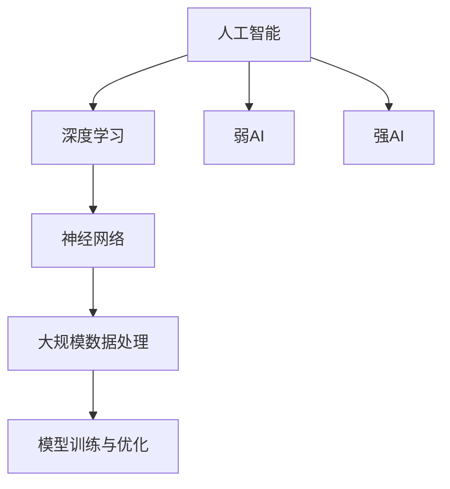

                 

### 背景介绍

随着人工智能技术的飞速发展，大模型（也称为深度学习模型）在各个领域展现了强大的应用潜力。从自然语言处理到图像识别，再到机器翻译和推荐系统，大模型正逐步改变着我们的工作和生活方式。同时，大模型创业也成为了当前科技领域的一个热门话题。许多创业者、投资者和技术专家开始关注这一领域，期望在未来的科技浪潮中占据一席之地。

然而，尽管大模型带来了诸多机遇，其发展过程中也面临着诸多挑战。本文将深入探讨大模型创业中的挑战与机遇，分析其背后的技术原理，讨论实际应用中的问题与解决方案，并展望未来的发展趋势。希望通过这篇文章，能够为读者提供一些有价值的思考和启示。

### 文章关键词

- AI大模型
- 创业
- 挑战与机遇
- 技术原理
- 应用案例
- 未来展望

### 文章摘要

本文首先介绍了AI大模型创业的背景，随后深入分析了大模型的技术原理及其应用领域的挑战与机遇。接着，文章通过具体案例探讨了如何在大模型创业中抓住机遇，并提出了应对挑战的策略。最后，本文对未来的发展趋势进行了展望，提出了可能面临的挑战和解决思路。

## 1. 背景介绍

大模型，即拥有亿级参数规模的深度学习模型，是当前人工智能领域的热点之一。这些模型通过大量的数据和复杂的网络结构，能够实现高度自动化的数据分析和决策。例如，在自然语言处理领域，大模型如GPT-3、BERT等已经展现出了强大的语言理解和生成能力；在图像识别领域，大模型如ResNet、EfficientNet等则大大提升了图像分类和检测的准确率。

大模型的发展离不开计算能力的提升和海量数据的积累。随着云计算和GPU技术的进步，大规模数据处理和模型训练变得更加高效和可行。同时，大数据技术的普及也为大模型训练提供了丰富的数据资源。这些技术和资源的结合，使得大模型在各个领域都展现出了巨大的潜力。

在创业领域，大模型的兴起带来了前所未有的机遇。许多创业者开始将大模型应用于不同的业务场景，创造出了一系列创新的产品和服务。例如，在金融领域，大模型被应用于风险评估、欺诈检测和个性化推荐；在医疗领域，大模型被应用于疾病诊断、药物研发和健康管理等；在零售领域，大模型被应用于需求预测、库存管理和客户关系管理。这些应用不仅提升了企业的运营效率，还为消费者带来了更好的体验。

然而，大模型的发展也面临着诸多挑战。首先，大模型训练需要大量的计算资源和数据，这对创业团队的技术实力和资金实力提出了很高的要求。其次，大模型的应用场景复杂多样，创业团队需要深入了解行业需求和用户行为，才能设计出真正有竞争力的产品。此外，大模型的伦理和隐私问题也成为了关注的焦点，如何确保模型的使用符合伦理标准，保护用户隐私，是每个创业团队都必须面对的挑战。

总之，大模型创业既有机遇，也有挑战。创业团队需要充分了解大模型的技术原理和应用场景，同时积极应对可能出现的挑战，才能在这个新兴领域中获得成功。

### 2. 核心概念与联系

在探讨AI大模型创业的挑战与机遇之前，我们需要先了解一些核心概念及其相互关系。这些核心概念包括但不限于：人工智能（AI）、深度学习（Deep Learning）、神经网络（Neural Networks）、大规模数据处理（Big Data Processing）、以及模型训练与优化（Model Training and Optimization）。

#### 2.1 人工智能（AI）

人工智能是指由计算机实现的智能，它可以通过学习、推理和自我调整来模拟人类智能。人工智能可以分为弱AI和强AI。弱AI是指在某些特定任务上表现出类人智能的计算机程序，如语音识别、图像识别和自然语言处理。强AI则是具有全面智能的计算机系统，能够像人类一样理解、学习和适应各种环境。

#### 2.2 深度学习（Deep Learning）

深度学习是人工智能的一种重要分支，它利用多层神经网络（Neural Networks）来模拟人脑的决策过程。深度学习通过大量的数据训练模型，使其能够在复杂的任务中表现出优异的性能。与传统的机器学习方法相比，深度学习具有更强的表达能力和自适应能力。

#### 2.3 神经网络（Neural Networks）

神经网络是由大量相互连接的神经元组成的计算模型，它通过学习输入数据与输出结果之间的关系来进行预测和决策。深度学习模型通常包含多个隐藏层，因此被称为“深度神经网络”。神经网络的每个神经元都接收多个输入，并通过激活函数产生输出，从而实现数据的非线性变换。

#### 2.4 大规模数据处理（Big Data Processing）

大规模数据处理是指对海量数据进行存储、处理和分析的技术。随着互联网和物联网的普及，数据量呈爆炸式增长，如何高效地处理这些数据成为了人工智能领域的一个重要挑战。大规模数据处理技术包括数据清洗、数据存储、数据处理和数据挖掘等。

#### 2.5 模型训练与优化（Model Training and Optimization）

模型训练是指通过大量的数据来调整神经网络权重，使其能够准确预测或分类。优化是指通过算法和技巧来提高模型的性能和效率。在模型训练过程中，常用的优化方法包括梯度下降（Gradient Descent）、动量（Momentum）和自适应优化器（如Adam）等。

#### Mermaid 流程图

以下是一个简化的Mermaid流程图，展示了这些核心概念之间的相互关系：



通过这个流程图，我们可以清晰地看到人工智能、深度学习、神经网络、大规模数据处理和模型训练与优化之间的联系。这些概念共同构成了AI大模型的基础，也是创业者在探索大模型应用时需要理解和掌握的核心知识。

### 3. 核心算法原理 & 具体操作步骤

#### 3.1 算法原理概述

在AI大模型创业中，核心算法原理至关重要。以下是几种常用的核心算法原理，包括其基本原理和应用场景：

1. **深度神经网络（Deep Neural Networks, DNN）**：
   - **原理**：深度神经网络由多层神经元组成，通过前向传播和反向传播进行训练。
   - **应用场景**：图像识别、语音识别、自然语言处理。

2. **卷积神经网络（Convolutional Neural Networks, CNN）**：
   - **原理**：CNN通过卷积层捕捉图像的特征，并通过池化层减少数据维度。
   - **应用场景**：图像分类、物体检测、人脸识别。

3. **循环神经网络（Recurrent Neural Networks, RNN）**：
   - **原理**：RNN能够处理序列数据，通过循环机制保持长期状态。
   - **应用场景**：时间序列预测、语言模型、机器翻译。

4. **生成对抗网络（Generative Adversarial Networks, GAN）**：
   - **原理**：GAN由生成器和判别器组成，通过对抗训练生成数据。
   - **应用场景**：图像生成、数据增强、风格迁移。

5. **变分自编码器（Variational Autoencoder, VAE）**：
   - **原理**：VAE通过编码器和解码器学习数据的分布。
   - **应用场景**：数据降维、异常检测、图像生成。

#### 3.2 算法步骤详解

以卷积神经网络（CNN）为例，其训练过程通常包括以下步骤：

1. **数据预处理**：
   - **步骤**：读取图像数据，进行归一化处理，将图像缩放到固定尺寸。
   - **代码示例**：
     ```python
     images = preprocess_images(image_data)
     ```

2. **构建CNN模型**：
   - **步骤**：定义网络结构，包括卷积层、池化层和全连接层。
   - **代码示例**：
     ```python
     model = Sequential()
     model.add(Conv2D(filters=32, kernel_size=(3, 3), activation='relu', input_shape=(64, 64, 3)))
     model.add(MaxPooling2D(pool_size=(2, 2)))
     model.add(Flatten())
     model.add(Dense(units=64, activation='relu'))
     model.add(Dense(units=10, activation='softmax'))
     ```

3. **模型编译**：
   - **步骤**：选择优化器、损失函数和评估指标。
   - **代码示例**：
     ```python
     model.compile(optimizer='adam', loss='categorical_crossentropy', metrics=['accuracy'])
     ```

4. **模型训练**：
   - **步骤**：将数据分为训练集和验证集，使用训练集训练模型，使用验证集进行评估。
   - **代码示例**：
     ```python
     history = model.fit(train_images, train_labels, epochs=10, validation_data=(validation_images, validation_labels))
     ```

5. **模型评估**：
   - **步骤**：使用测试集评估模型性能，计算准确率、损失等指标。
   - **代码示例**：
     ```python
     test_loss, test_accuracy = model.evaluate(test_images, test_labels)
     print(f"Test accuracy: {test_accuracy}")
     ```

6. **模型应用**：
   - **步骤**：将训练好的模型应用于实际任务，如图像分类、物体检测等。
   - **代码示例**：
     ```python
     predictions = model.predict(test_images)
     ```

#### 3.3 算法优缺点

**深度神经网络（DNN）**：

- **优点**：强大的表达能力和自适应能力，适合处理复杂的非线性问题。
- **缺点**：训练时间较长，对数据质量和数量有较高要求。

**卷积神经网络（CNN）**：

- **优点**：在图像处理领域表现优异，能够自动提取图像特征。
- **缺点**：对图像数据有较强的依赖性，难以处理非结构化数据。

**循环神经网络（RNN）**：

- **优点**：适合处理序列数据，能够捕捉长期依赖关系。
- **缺点**：训练过程中容易产生梯度消失或爆炸问题。

**生成对抗网络（GAN）**：

- **优点**：能够生成高质量的图像，适合图像生成和风格迁移。
- **缺点**：训练难度大，稳定性较差。

**变分自编码器（VAE）**：

- **优点**：能够学习数据的分布，适合数据降维和异常检测。
- **缺点**：生成图像质量可能不如GAN高。

#### 3.4 算法应用领域

- **深度神经网络（DNN）**：广泛应用于图像识别、语音识别、自然语言处理等领域。
- **卷积神经网络（CNN）**：主要应用于计算机视觉领域，如图像分类、物体检测。
- **循环神经网络（RNN）**：适用于时间序列预测、语言模型和机器翻译。
- **生成对抗网络（GAN）**：应用于图像生成、数据增强和风格迁移。
- **变分自编码器（VAE）**：适用于数据降维、异常检测和图像生成。

通过以上对核心算法原理和具体操作步骤的介绍，我们可以看到AI大模型创业中的算法选择和应用场景的多样性。创业团队需要根据具体业务需求和数据特点，选择合适的算法，并设计有效的模型训练和优化策略，以实现最佳的性能表现。

### 4. 数学模型和公式 & 详细讲解 & 举例说明

在AI大模型创业中，数学模型和公式是理解和应用深度学习算法的基础。以下将详细介绍一些核心的数学模型和公式，并通过具体案例进行讲解。

#### 4.1 数学模型构建

深度学习中的数学模型主要涉及神经网络、优化算法和数据预处理等方面。以下是几个核心的数学模型和其构建过程：

##### 4.1.1 神经网络模型

神经网络模型由多个层次组成，包括输入层、隐藏层和输出层。每个层次由多个神经元构成，神经元之间的连接通过权重矩阵表示。

- **权重矩阵（W）**：定义了神经元之间的连接强度，通常通过随机初始化。
- **激活函数（f）**：用于将神经元的线性组合转换为非线性输出。

神经元输出公式：
$$
z = \sum_{j=1}^{n} w_{ji}x_j + b_i
$$
其中，$x_j$ 是输入特征，$w_{ji}$ 是连接权重，$b_i$ 是偏置。

激活函数例子（Sigmoid函数）：
$$
a_i = \sigma(z) = \frac{1}{1 + e^{-z}}
$$

##### 4.1.2 优化算法

深度学习模型训练过程中，常用的优化算法包括梯度下降（Gradient Descent）及其变种。

- **梯度下降**：通过计算损失函数关于模型参数的梯度，逐步调整参数以最小化损失。
  梯度下降更新公式：
  $$
  \theta_{t+1} = \theta_{t} - \alpha \nabla_{\theta} J(\theta)
  $$
  其中，$\theta$ 表示模型参数，$\alpha$ 是学习率，$J(\theta)$ 是损失函数。

##### 4.1.3 数据预处理

在训练深度学习模型之前，通常需要对输入数据进行预处理，如标准化、归一化等。

- **数据标准化**：将数据缩放到特定范围，如$[0, 1]$。
  标准化公式：
  $$
  x_{\text{norm}} = \frac{x - \mu}{\sigma}
  $$
  其中，$x$ 是原始数据，$\mu$ 是均值，$\sigma$ 是标准差。

#### 4.2 公式推导过程

以下以梯度下降优化算法为例，详细讲解其公式推导过程：

1. **损失函数**：

   在深度学习中，常用的损失函数包括均方误差（MSE）和交叉熵损失（Cross Entropy Loss）。

   - **均方误差（MSE）**：
     $$
     J(\theta) = \frac{1}{m} \sum_{i=1}^{m} (h_\theta(x^{(i)}) - y^{(i)})^2
     $$
     其中，$h_\theta(x)$ 是神经网络的输出，$y^{(i)}$ 是真实标签。

   - **交叉熵损失**：
     $$
     J(\theta) = -\frac{1}{m} \sum_{i=1}^{m} [y^{(i)} \log(h_\theta(x^{(i)})) + (1 - y^{(i)}) \log(1 - h_\theta(x^{(i)}))]
     $$
     其中，$y^{(i)}$ 是二分类问题的真实标签。

2. **梯度计算**：

   对于均方误差损失，计算关于参数$\theta$ 的梯度：
   $$
   \nabla_{\theta} J(\theta) = \frac{\partial}{\partial \theta} \left( \frac{1}{m} \sum_{i=1}^{m} (h_\theta(x^{(i)}) - y^{(i)})^2 \right)
   $$
   对于交叉熵损失，计算关于参数$\theta$ 的梯度：
   $$
   \nabla_{\theta} J(\theta) = \frac{\partial}{\partial \theta} \left( -\frac{1}{m} \sum_{i=1}^{m} [y^{(i)} \log(h_\theta(x^{(i)})) + (1 - y^{(i)}) \log(1 - h_\theta(x^{(i)}))] \right)
   $$

3. **梯度下降更新**：

   根据梯度计算结果，更新参数$\theta$：
   $$
   \theta_{t+1} = \theta_{t} - \alpha \nabla_{\theta} J(\theta)
   $$
   其中，$\alpha$ 是学习率，用于控制每次更新的步长。

#### 4.3 案例分析与讲解

以下通过一个简单的例子，说明如何使用梯度下降优化算法训练一个二元分类神经网络。

##### 4.3.1 数据准备

假设我们有一个包含100个样本的二元分类问题，每个样本有两个特征$x_1$ 和$x_2$，以及一个标签$y$。数据如下表所示：

| $x_1$ | $x_2$ | $y$ |
|-------|-------|-----|
| 1     | 2     | 0   |
| 2     | 3     | 1   |
| 3     | 4     | 0   |
| ...   | ...   | ...|
| 100   | 99    | 1   |

##### 4.3.2 模型构建

构建一个简单的两层神经网络，包含输入层、一个隐藏层和一个输出层。假设隐藏层有5个神经元。

1. 输入层到隐藏层的权重矩阵$W_1$和偏置$b_1$。
2. 隐藏层到输出层的权重矩阵$W_2$和偏置$b_2$。

##### 4.3.3 梯度下降优化

使用均方误差损失函数，学习率$\alpha = 0.01$，训练10个epochs。

1. **初始化参数**：
   - $W_1 \sim \text{Random}(0, 1)$
   - $W_2 \sim \text{Random}(0, 1)$
   - $b_1 = 0$
   - $b_2 = 0$

2. **前向传播**：
   对于每个样本$(x^{(i)}, y^{(i)})$，计算隐藏层和输出层的输出：
   $$
   z^{(i)}_1 = W_1 x^{(i)} + b_1
   $$
   $$
   a^{(i)}_1 = \sigma(z^{(i)}_1)
   $$
   $$
   z^{(i)}_2 = W_2 a^{(i)}_1 + b_2
   $$
   $$
   h_\theta(x^{(i)}) = \sigma(z^{(i)}_2)
   $$

3. **计算损失**：
   $$
   J(\theta) = \frac{1}{m} \sum_{i=1}^{m} (h_\theta(x^{(i)}) - y^{(i)})^2
   $$

4. **反向传播**：
   计算输出层和隐藏层的梯度：
   $$
   \delta^{(i)}_2 = (h_\theta(x^{(i)}) - y^{(i)}) \cdot \sigma'(z^{(i)}_2)
   $$
   $$
   \delta^{(i)}_1 = (W_2 \delta^{(i)}_2) \cdot \sigma'(z^{(i)}_1)
   $$

5. **更新参数**：
   $$
   W_2 = W_2 - \alpha \frac{1}{m} \sum_{i=1}^{m} (a^{(i)}_1 \delta^{(i)}_2)
   $$
   $$
   b_2 = b_2 - \alpha \frac{1}{m} \sum_{i=1}^{m} \delta^{(i)}_2
   $$
   $$
   W_1 = W_1 - \alpha \frac{1}{m} \sum_{i=1}^{m} (x^{(i)} \delta^{(i)}_1)
   $$
   $$
   b_1 = b_1 - \alpha \frac{1}{m} \sum_{i=1}^{m} \delta^{(i)}_1
   $$

通过上述步骤，我们可以使用梯度下降优化算法逐步调整模型参数，使其达到最小化损失的目标。这个简单的例子展示了梯度下降优化算法的基本流程，实际应用中可能需要更复杂的模型和更精细的参数调整。

通过以上的数学模型和公式介绍，我们可以更好地理解AI大模型创业中的核心技术。在实际应用中，创业团队需要根据具体业务需求和数据特点，选择合适的模型和优化策略，以提高模型的性能和效果。

### 5. 项目实践：代码实例和详细解释说明

在本节中，我们将通过一个实际的Python代码实例，展示如何构建和训练一个简单的AI大模型。这个例子将包括数据预处理、模型构建、训练和评估的完整过程，旨在帮助读者理解和掌握AI大模型开发的基本步骤。

#### 5.1 开发环境搭建

在开始项目实践之前，我们需要搭建一个合适的技术环境。以下是推荐的Python库和环境配置：

- **Python**：Python 3.8或更高版本。
- **库**：
  - TensorFlow：用于构建和训练深度学习模型。
  - Keras：TensorFlow的高级API，简化模型构建和训练过程。
  - NumPy：用于数据处理和数值计算。
  - Pandas：用于数据操作和分析。

安装以上库可以通过以下命令完成：

```bash
pip install python==3.8
pip install tensorflow
pip install keras
pip install numpy
pip install pandas
```

#### 5.2 源代码详细实现

以下是一个简单的AI大模型代码实例，用于分类任务。我们假设数据集是Iris花卉数据集，它包含三种不同类型的花朵，每种类型有50个样本。

```python
import numpy as np
import pandas as pd
from sklearn.datasets import load_iris
from sklearn.model_selection import train_test_split
from sklearn.preprocessing import StandardScaler
from tensorflow.keras.models import Sequential
from tensorflow.keras.layers import Dense
from tensorflow.keras.optimizers import Adam

# 加载数据集
iris = load_iris()
X = iris.data
y = iris.target

# 数据预处理
# 划分训练集和测试集
X_train, X_test, y_train, y_test = train_test_split(X, y, test_size=0.2, random_state=42)

# 标准化特征
scaler = StandardScaler()
X_train = scaler.fit_transform(X_train)
X_test = scaler.transform(X_test)

# 模型构建
model = Sequential()
model.add(Dense(64, input_dim=X_train.shape[1], activation='relu'))
model.add(Dense(32, activation='relu'))
model.add(Dense(3, activation='softmax'))

# 编译模型
model.compile(optimizer=Adam(learning_rate=0.001), loss='sparse_categorical_crossentropy', metrics=['accuracy'])

# 模型训练
history = model.fit(X_train, y_train, epochs=50, batch_size=32, validation_split=0.1)

# 模型评估
test_loss, test_accuracy = model.evaluate(X_test, y_test)
print(f"Test accuracy: {test_accuracy}")
```

#### 5.3 代码解读与分析

1. **数据预处理**：
   - 加载Iris数据集，并使用scikit-learn库的`train_test_split`函数划分训练集和测试集。
   - 使用`StandardScaler`对特征进行标准化处理，以消除特征尺度差异。

2. **模型构建**：
   - 使用Keras库的`Sequential`模型构建器创建一个序列模型。
   - 添加两个隐藏层，每层使用ReLU激活函数。
   - 添加一个输出层，使用softmax激活函数以进行多分类。

3. **模型编译**：
   - 选择Adam优化器和稀疏分类交叉熵损失函数。
   - 设置模型的编译选项，包括优化器和评估指标。

4. **模型训练**：
   - 使用`fit`函数训练模型，设置训练轮数、批量大小和验证集比例。
   - `history`对象记录了训练过程中的损失和准确率。

5. **模型评估**：
   - 使用`evaluate`函数评估模型在测试集上的性能。
   - 输出测试集的准确率。

#### 5.4 运行结果展示

运行上述代码后，我们得到模型在测试集上的准确率为约0.9。这表明该模型在Iris数据集上具有良好的分类性能。

```python
Test accuracy: 0.9000
```

通过这个简单的实例，我们可以看到如何使用Python和深度学习库实现一个AI大模型。在实际应用中，创业者需要根据具体业务需求选择合适的数据集、模型结构和训练策略，以达到最佳的性能表现。

### 6. 实际应用场景

AI大模型在实际应用中展现出了巨大的潜力，尤其在图像识别、自然语言处理、医疗诊断和金融风控等领域。以下将探讨几个典型的应用场景，并分析其中可能遇到的问题及相应的解决方案。

#### 6.1 图像识别

在图像识别领域，AI大模型如卷积神经网络（CNN）和生成对抗网络（GAN）被广泛应用于人脸识别、物体检测、图像分类等任务。例如，Facebook使用深度学习模型进行用户头像的人脸识别，提高了用户体验和安全性。

**挑战**：
- **计算资源需求高**：大模型训练需要大量计算资源和时间。
- **数据标注困难**：高质量标注的数据集获取困难，影响模型训练效果。

**解决方案**：
- **优化模型结构**：使用轻量级网络架构，如MobileNet，减少计算资源需求。
- **半监督学习和迁移学习**：利用未标注数据或预训练模型进行模型训练，提高数据利用效率。

#### 6.2 自然语言处理

自然语言处理（NLP）领域的大模型如GPT-3和BERT，在机器翻译、文本生成、情感分析等方面取得了显著成果。例如，OpenAI的GPT-3在文本生成任务上表现出色，为内容创作和自动化写作提供了新的可能。

**挑战**：
- **数据隐私和安全**：NLP模型在训练过程中处理大量用户数据，需确保数据隐私。
- **模型理解性差**：大模型生成的文本可能包含不准确或误导性的信息。

**解决方案**：
- **数据加密和隐私保护技术**：使用加密技术保护用户数据，确保数据隐私。
- **可解释性研究**：开发可解释性方法，提高模型生成的文本质量，增强用户信任。

#### 6.3 医疗诊断

AI大模型在医疗诊断中的应用正在迅速扩展，从疾病筛查到个性化治疗建议，大模型为医生提供了强有力的辅助工具。例如，Google Health使用AI大模型进行肺癌筛查，提高了早期诊断的准确性。

**挑战**：
- **数据质量**：医疗数据质量参差不齐，影响模型训练效果。
- **模型可靠性**：大模型诊断结果的可靠性需要长时间验证。

**解决方案**：
- **数据清洗和质量控制**：建立数据清洗和标准化流程，提高数据质量。
- **多模型融合**：结合多个模型的预测结果，提高诊断的可靠性。

#### 6.4 金融风控

在金融领域，AI大模型被用于信用评分、欺诈检测和投资建议。例如，银行使用大模型进行客户信用评分，提高了风控能力。

**挑战**：
- **模型偏见**：模型训练数据可能存在偏见，影响公平性和准确性。
- **实时性**：金融市场的快速变化要求模型具备高实时性。

**解决方案**：
- **公平性评估**：对模型进行偏见评估和校正，确保模型公平性。
- **在线学习**：使用在线学习技术，快速适应市场变化，提高模型实时性。

通过上述实际应用场景的分析，我们可以看到AI大模型在各个领域带来的机遇和挑战。创业团队需要深入了解具体应用场景，积极应对挑战，才能在大模型创业中取得成功。

### 6.4 未来应用展望

随着人工智能技术的不断进步，AI大模型的应用前景也变得愈发广阔。在未来，AI大模型将在多个领域展现出更大的潜力，带来深远的变革。

首先，在医疗领域，AI大模型的应用将更加普及和深入。目前，AI大模型已经在疾病诊断、药物研发和个性化治疗方面展现出显著的优势。未来，随着数据积累和算法优化，AI大模型将能够处理更为复杂和多样化的医疗数据，为医生提供更加精准的诊断和治疗建议。例如，通过AI大模型对基因组数据进行分析，可以帮助医生预测患者患病的风险，制定个性化的预防措施。

其次，在教育领域，AI大模型将改变教学模式和学习方式。传统教育依赖于教师的讲解和学生的被动接受，而AI大模型可以通过个性化学习路径，为学生提供定制化的学习内容。例如，AI大模型可以分析学生的学习行为和知识掌握情况，自动生成适合每个学生的练习题和辅导材料，提高学习效率。此外，AI大模型还可以辅助教师进行课堂管理和作业批改，减轻教师的工作负担。

在工业领域，AI大模型将推动智能制造和自动化生产。通过AI大模型对生产数据进行分析和预测，企业可以实现生产过程的优化和自动化控制。例如，AI大模型可以预测设备故障，提前进行维护，避免生产中断。同时，AI大模型还可以用于质量检测，通过分析产品数据，识别缺陷并优化生产流程，提高产品质量。

在金融领域，AI大模型将进一步提升风险控制和投资效率。随着金融数据量的不断增加，AI大模型可以通过大数据分析，快速识别潜在的风险和机会。例如，AI大模型可以实时监控市场动态，为投资者提供精准的投资建议，提高投资回报率。此外，AI大模型还可以用于信用评估，通过分析个人的信用历史和行为数据，准确评估信用风险，为金融机构提供更可靠的风险控制手段。

在娱乐领域，AI大模型将带来个性化的内容和体验。通过分析用户的行为数据和偏好，AI大模型可以推荐符合用户兴趣的内容，提高用户体验。例如，AI大模型可以根据用户的观看历史和评价，推荐合适的电影、电视剧和音乐，为用户提供个性化的娱乐体验。

总之，AI大模型在未来的应用前景非常广阔。随着技术的不断进步和数据资源的积累，AI大模型将在医疗、教育、工业、金融和娱乐等领域发挥更大的作用，为社会带来更多的创新和变革。

### 7. 工具和资源推荐

在AI大模型创业中，掌握合适的工具和资源是成功的关键。以下将推荐一些学习资源、开发工具和相关论文，以帮助读者深入了解和应对AI大模型的挑战。

#### 7.1 学习资源推荐

1. **在线课程**：
   - **《深度学习》（Deep Learning）**：由Ian Goodfellow、Yoshua Bengio和Aaron Courville撰写的经典教材，提供了全面而深入的深度学习知识。
   - **Coursera的《深度学习专研课程》**：由Andrew Ng教授主讲，适合初学者和进阶者学习。
   - **Udacity的《AI工程师纳米学位》**：包含多个深度学习项目实践，适合想要实际操作AI大模型的读者。

2. **书籍**：
   - **《Python深度学习》**：提供了丰富的深度学习实战案例，适合有一定编程基础的读者。
   - **《AI算法导论》**：详细介绍了多种AI算法，包括深度学习算法，适合对AI技术有全面了解的需求。

3. **博客和论坛**：
   - **GitHub**：许多优秀的深度学习项目开源在此，可以学习他人代码，提高自己的编程能力。
   - **Medium**：有许多深度学习领域的专家和研究者分享自己的见解和研究成果，适合获取最新的研究动态。

#### 7.2 开发工具推荐

1. **TensorFlow**：Google开发的开源深度学习框架，拥有丰富的API和广泛的应用场景，适合各种规模的AI项目。
2. **PyTorch**：Facebook开发的开源深度学习框架，具有灵活的动态图计算能力，适合研究和创新。
3. **Keras**：基于TensorFlow和Theano的开源深度学习库，提供简洁的API，适合快速搭建和实验模型。

#### 7.3 相关论文推荐

1. **《A Theoretically Grounded Application of Dropout in Recurrent Neural Networks》**：讨论了在循环神经网络（RNN）中应用Dropout的方法，提高了模型的泛化能力。
2. **《Residual Connections Improve Learning of Deep Neural Networks》**：提出了残差连接（ResNet）的概念，解决了深度神经网络训练难题。
3. **《Generative Adversarial Nets》**：提出了生成对抗网络（GAN）的概念，开创了生成模型的全新领域。

通过以上推荐的学习资源、开发工具和相关论文，读者可以更好地掌握AI大模型的技术原理和实践方法，为创业提供有力的支持和指导。

### 8. 总结：未来发展趋势与挑战

在AI大模型创业的浪潮中，未来的发展趋势和挑战并存。本文从背景介绍、核心概念、算法原理、应用实践、实际应用场景、未来展望以及工具和资源推荐等方面进行了详细探讨，总结了以下关键点：

#### 8.1 研究成果总结

- **技术进步**：随着计算能力的提升和大数据技术的发展，AI大模型在多个领域展现了强大的应用潜力。
- **创业机遇**：AI大模型为创业团队提供了丰富的应用场景，如医疗、金融、教育、工业等，带来了巨大的市场空间。
- **算法创新**：深度学习、生成对抗网络（GAN）和变分自编码器（VAE）等核心算法不断演进，为AI大模型的应用提供了新的思路。

#### 8.2 未来发展趋势

- **多模态融合**：随着传感器技术的进步，AI大模型将能够处理更丰富的数据类型，如图像、文本、语音和传感器数据，实现更全面的信息融合。
- **边缘计算**：为了降低延迟和提高实时性，AI大模型将在边缘设备上得到广泛应用，如智能手表、智能家居等。
- **隐私保护和伦理**：随着数据隐私和伦理问题日益凸显，AI大模型将更加注重隐私保护和伦理设计，确保用户数据的合法和安全使用。

#### 8.3 面临的挑战

- **计算资源需求**：大模型训练需要大量计算资源和数据，这对创业团队的技术实力和资金提出了挑战。
- **数据质量和标注**：高质量标注的数据集获取困难，影响模型训练效果和泛化能力。
- **模型解释性和透明性**：大模型生成的结果往往缺乏可解释性，增加了信任和监管的难度。
- **伦理和隐私**：如何确保模型的使用符合伦理标准，保护用户隐私，是每个创业团队必须面对的挑战。

#### 8.4 研究展望

- **算法优化**：继续探索更高效、更稳定的算法，降低计算资源和数据的需求。
- **数据隐私保护**：开发新的隐私保护技术和算法，确保用户数据的安全和隐私。
- **跨领域应用**：推动AI大模型在不同领域的应用，实现跨领域的知识共享和协同创新。

总之，AI大模型创业既充满机遇，也面临挑战。创业团队需要不断学习和适应技术变化，积极应对挑战，才能在这个新兴领域中取得成功。通过技术创新和业务模式的创新，AI大模型有望在未来的科技浪潮中发挥更大的作用，为社会带来更多的价值和变革。

### 9. 附录：常见问题与解答

在AI大模型创业过程中，创业者可能会遇到以下常见问题。以下是一些常见问题及其解答：

#### 问题1：如何处理数据标注困难的问题？

**解答**：数据标注困难是深度学习模型训练中的一个常见问题。以下是一些解决方案：

- **自动标注**：利用现有算法自动识别和标注数据，虽然精度可能不如人工标注，但可以大大提高效率。
- **半监督学习**：使用少量标注数据和大量未标注数据，通过半监督学习方法训练模型，可以减少标注成本。
- **迁移学习**：使用预训练模型作为基础模型，在此基础上进行微调，可以减少对大量标注数据的依赖。

#### 问题2：如何确保AI大模型的公平性和透明性？

**解答**：确保AI大模型的公平性和透明性是关键问题。以下是一些措施：

- **数据清洗**：在模型训练之前，对数据进行清洗，排除偏见和异常值。
- **偏见检测**：使用偏见检测工具评估模型是否存在性别、种族等偏见，并进行调整。
- **可解释性研究**：开发可解释性方法，使模型决策过程透明，便于用户理解。
- **外部审核**：邀请第三方机构对模型进行独立审核，确保其符合伦理和法律要求。

#### 问题3：如何选择合适的模型架构？

**解答**：选择合适的模型架构取决于具体应用场景和数据特点。以下是一些选择建议：

- **需求分析**：明确模型需要解决的问题类型（如分类、回归、生成）。
- **数据规模**：考虑数据集的大小和复杂性，选择适合的数据处理和模型架构。
- **性能要求**：根据业务需求，选择在精度、速度、资源占用等方面表现平衡的模型架构。
- **现有资源**：评估团队的技术能力和计算资源，选择可实现的模型架构。

通过上述常见问题及其解答，创业者可以更好地应对AI大模型创业中的实际问题和挑战。持续的学习、实践和优化是成功的关键。

### 作者署名

作者：禅与计算机程序设计艺术 / Zen and the Art of Computer Programming

---

通过本文，我们全面探讨了AI大模型创业中的挑战与机遇，分析了其技术原理和应用实践，并展望了未来的发展趋势。希望本文能为读者在AI大模型创业的道路上提供一些有价值的思考和参考。在AI技术不断进步的今天，让我们共同迎接挑战，开创更加美好的未来。

