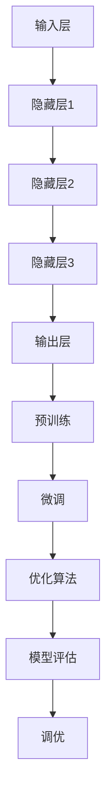

                 

### 背景介绍

在过去的几年中，人工智能（AI）领域经历了一场革命。特别是在深度学习技术取得突破性进展之后，AI大模型（也称为大型预训练模型）开始在学术界和工业界崭露头角。这些模型以其卓越的性能和广泛的适用性，吸引了大量企业和研究机构的关注。

AI大模型的发展离不开大量的数据、强大的计算资源和优秀的算法。从GPT-3到BERT，再到最新的OPT和LLaMA，这些模型在自然语言处理、计算机视觉、语音识别等领域都取得了显著的成果。然而，随着AI大模型的应用越来越广泛，也引发了一系列关于其商业潜力和泡沫性质的讨论。

本文旨在探讨AI大模型创业的现状与未来。我们将从以下几个方面展开讨论：

1. **核心概念与联系**：介绍AI大模型的基本原理，包括其架构、训练方法和应用领域。
2. **核心算法原理与具体操作步骤**：详细解释AI大模型的核心算法，包括算法的原理、步骤、优缺点以及应用领域。
3. **数学模型与公式**：分析AI大模型背后的数学模型，包括模型的构建、公式推导和案例分析。
4. **项目实践**：通过具体的代码实例，展示如何开发和实现AI大模型。
5. **实际应用场景**：探讨AI大模型在不同领域的应用场景，以及未来的发展方向。
6. **工具和资源推荐**：推荐一些学习和开发AI大模型的有用工具和资源。
7. **总结与展望**：总结研究成果，探讨未来发展趋势和面临的挑战。

### 关键词

- AI大模型
- 创业
- 泡沫
- 金矿
- 现状与未来

### 摘要

本文通过对AI大模型创业的现状与未来进行深入探讨，旨在揭示AI大模型在商业领域的潜力与挑战。我们将从技术、经济和市场角度分析AI大模型的现状，探讨其背后的核心概念和算法原理，并通过具体的实例和实际应用场景展示其价值。同时，我们也将展望AI大模型在未来可能面临的发展趋势和挑战，为创业者提供有益的参考。

## 1. 背景介绍

### AI大模型的发展历程

AI大模型的发展历程可以追溯到20世纪80年代和90年代，当时深度学习技术刚刚起步。最早的大型神经网络模型是由Hinton等人提出的，如1986年的反向传播算法（Backpropagation）和1989年的Hopfield网络。然而，由于计算资源和数据集的限制，这些模型在性能上并未取得显著突破。

直到2012年，AlexNet的出现标志着深度学习在图像识别领域的重大突破。该模型使用多层的深度卷积神经网络（CNN）在ImageNet图像识别挑战赛上取得了惊人的准确率，大大超过了传统机器学习方法。这一成功激发了研究人员对深度学习的兴趣，也为其在更多领域的应用奠定了基础。

在随后的几年中，随着GPU和TPU等高性能计算设备的出现，深度学习技术得到了快速发展。2018年，Google的BERT模型在自然语言处理（NLP）领域取得了突破性成果，使得预训练语言模型（PLM）成为研究热点。BERT的成功展示了AI大模型在语言理解和生成方面的潜力，也为其在商业和科研领域的应用提供了新的方向。

### AI大模型的核心技术

AI大模型的核心技术主要包括神经网络架构、大规模数据处理和预训练技术。

1. **神经网络架构**：神经网络是AI大模型的基础。常见的神经网络架构包括卷积神经网络（CNN）、循环神经网络（RNN）和Transformer等。每种架构都有其特定的应用场景和优势。

2. **大规模数据处理**：AI大模型的训练需要大量的数据。数据的来源可以是互联网、社交媒体、企业内部数据等。为了处理大规模数据，研究人员开发了各种高效的数据处理工具和技术，如数据清洗、数据增强和分布式训练等。

3. **预训练技术**：预训练技术是AI大模型的核心。通过在大量无标签数据上进行预训练，模型可以学习到通用的特征表示，然后再在特定任务上进行微调（fine-tuning）。这种技术大大提高了模型的性能和适用性。

### AI大模型的应用领域

AI大模型的应用领域非常广泛，涵盖了自然语言处理、计算机视觉、语音识别、推荐系统等多个领域。

1. **自然语言处理**：自然语言处理是AI大模型最早和最成功的应用领域之一。从机器翻译、文本分类到问答系统，AI大模型在NLP任务中展现出了强大的能力。

2. **计算机视觉**：计算机视觉是另一个AI大模型的重要应用领域。从图像分类、目标检测到视频分析，AI大模型在CV任务中取得了显著成果。

3. **语音识别**：语音识别是AI大模型的又一个重要应用领域。通过结合深度学习和自然语言处理技术，AI大模型可以实现高精度的语音识别和语音生成。

4. **推荐系统**：推荐系统是AI大模型在商业领域的重要应用之一。通过分析用户的偏好和行为，AI大模型可以推荐个性化的商品、服务和内容。

### AI大模型对经济和市场的影响

AI大模型对经济和市场产生了深远的影响。

1. **企业效率提升**：AI大模型可以自动完成许多重复性高、难度低的工作，从而提高企业的工作效率。例如，在客服、财务和人力资源等领域，AI大模型已经得到了广泛应用。

2. **新商业模式的出现**：AI大模型推动了新商业模式的出现。例如，基于AI大模型的智能客服和智能推荐系统已经成为许多企业的重要盈利点。

3. **市场竞争加剧**：随着AI大模型技术的普及，市场竞争变得更加激烈。企业必须不断更新和优化其AI模型，以保持竞争优势。

4. **行业变革**：AI大模型正在改变许多传统行业的运作方式。例如，在医疗、金融和制造业等领域，AI大模型的应用正在推动行业变革。

总的来说，AI大模型已经成为数字经济的重要组成部分。随着技术的不断进步和应用场景的拓展，AI大模型在商业和经济领域的潜力将越来越大。

## 2. 核心概念与联系

在探讨AI大模型创业的潜力之前，我们需要理解其背后的核心概念和原理。AI大模型，尤其是深度学习模型，依赖于一系列复杂的算法和技术，这些技术共同构建了一个强大的学习系统。以下是对这些核心概念的介绍，以及它们之间的联系。

### 2.1 神经网络架构

神经网络是AI大模型的基础，其灵感来源于人脑的神经元结构。一个典型的神经网络由多个层次组成，每个层次包含多个节点（或称为神经元）。这些层次包括输入层、隐藏层和输出层。

1. **输入层**：接收外部数据，并将其传递给隐藏层。
2. **隐藏层**：对输入数据进行处理和变换，可以有一个或多个隐藏层。
3. **输出层**：生成模型预测或决策。

神经网络通过学习输入和输出之间的关系来完成任务。这个过程是通过调整网络中各个节点之间的连接权重（权重是数字，表示不同输入对输出的影响程度）来实现的。

### 2.2 深度学习算法

深度学习是神经网络的一种特殊形式，它通过增加网络中的层次（即深度）来提高模型的复杂度和学习能力。深度学习算法的核心是反向传播算法（Backpropagation），它是一种通过反向计算误差来调整网络权重的方法。

**反向传播算法**：

1. **前向传播**：输入数据通过网络前向传播，每个神经元根据其权重和激活函数产生输出。
2. **计算误差**：将实际输出与预期输出进行比较，计算误差。
3. **反向传播**：将误差反向传播到网络的每个层次，根据误差调整每个神经元的权重。

### 2.3 预训练与微调

预训练（Pre-training）和微调（Fine-tuning）是AI大模型训练过程中的两个重要步骤。

**预训练**：在预训练阶段，模型在大规模无标签数据上学习通用的特征表示。这个过程可以帮助模型理解数据的结构和模式，从而提高其泛化能力。

**微调**：在预训练完成后，模型被转移到具体任务上进行微调。微调过程中，模型在少量有标签数据上调整权重，以适应特定任务的需求。

### 2.4 大规模数据处理

大规模数据处理是AI大模型训练的关键。以下是一些关键技术和步骤：

1. **数据清洗**：处理数据中的噪声和错误，确保数据质量。
2. **数据增强**：通过变换、缩放、旋转等方式生成更多样化的训练数据，以增强模型的学习能力。
3. **分布式训练**：在多个计算节点上并行训练模型，以加快训练速度并提高模型的规模。

### 2.5 优化算法

优化算法用于调整模型中的权重，以最小化预测误差。常见的优化算法包括：

1. **随机梯度下降（SGD）**：一种简单的优化算法，通过随机选择小批量数据进行迭代优化。
2. **Adam优化器**：一种基于SGD的优化算法，它自适应地调整学习率，提高了收敛速度。
3. **AdamW优化器**：在Adam优化器的基础上增加了权重衰减，进一步提高了模型的性能。

### 2.6 模型评估与调优

模型评估是确保模型性能的关键步骤。以下是一些常用的评估指标和调优方法：

1. **交叉验证**：通过将数据集分成多个子集，重复训练和评估模型，以避免过拟合。
2. **性能指标**：如准确率、召回率、F1分数等，用于评估模型的预测能力。
3. **超参数调优**：调整模型中的超参数（如学习率、批量大小等），以优化模型性能。

### 2.7 Mermaid 流程图

以下是一个简化的Mermaid流程图，展示了AI大模型的核心概念和架构：



### 2.8 AI大模型的核心概念原理和架构的联系

AI大模型的核心概念和架构紧密相连，共同构成了一个完整的学习系统。以下是它们之间的联系：

- **神经网络架构**为模型提供了结构和基础，通过调整权重实现数据的处理和预测。
- **深度学习算法**实现了神经网络的学习过程，通过反向传播和梯度下降等方法调整权重。
- **预训练与微调**使模型能够在大规模无标签数据上学习通用特征，再在具体任务上进行微调，提高了模型的泛化能力。
- **大规模数据处理**保证了模型的训练质量，通过数据清洗、增强和分布式训练等方法提高了数据的有效性和模型的训练速度。
- **优化算法**用于调整模型中的权重，以最小化预测误差，提高了模型的性能。
- **模型评估与调优**确保了模型在实际任务中的表现，通过交叉验证、性能指标和超参数调优等方法优化了模型。

通过这些核心概念和架构的有机结合，AI大模型实现了从数据到预测的完整过程，为各种复杂任务提供了强大的支持。

### 3. 核心算法原理 & 具体操作步骤

#### 3.1 算法原理概述

AI大模型的核心算法主要依赖于深度学习技术，特别是基于神经网络的结构。深度学习通过多层神经网络的学习和处理能力，实现了对复杂数据的建模和预测。以下将详细介绍深度学习算法的基本原理，包括神经网络架构、训练过程以及模型评估等。

**神经网络架构**

神经网络是由一系列的层（layer）组成，每层包含多个节点（neuron）。这些层包括输入层、隐藏层和输出层：

1. **输入层**：接收外部数据，如图片、文本或音频。
2. **隐藏层**：对输入数据进行处理和变换，可以有一个或多个隐藏层。
3. **输出层**：生成模型的预测结果。

每个节点都通过权重（weights）与其他节点相连，权重决定了输入对输出的影响。节点接收输入数据后，通过激活函数（activation function）产生输出。常见的激活函数包括线性函数、Sigmoid函数、ReLU函数和Tanh函数。

**训练过程**

深度学习模型的训练是通过最小化预测误差来完成的。这个过程通常包括以下几个步骤：

1. **前向传播（Forward Propagation）**：输入数据通过网络前向传播，每个节点根据其权重和激活函数产生输出。
2. **计算损失（Compute Loss）**：将实际输出与预期输出进行比较，计算损失函数（loss function）的值。常见的损失函数包括均方误差（MSE）、交叉熵损失（Cross-Entropy Loss）等。
3. **反向传播（Back Propagation）**：将损失函数的梯度反向传播到网络的每个层次，根据误差调整每个神经元的权重。
4. **优化（Optimization）**：使用优化算法（如梯度下降、Adam等）调整模型参数，以最小化损失函数。

**模型评估**

在训练完成后，需要对模型进行评估，以确定其在实际任务中的性能。常用的评估指标包括：

- **准确率（Accuracy）**：正确预测的样本数占总样本数的比例。
- **精确率（Precision）**：在所有预测为正例的样本中，实际为正例的比例。
- **召回率（Recall）**：在所有实际为正例的样本中，预测为正例的比例。
- **F1分数（F1 Score）**：精确率和召回率的调和平均值。

#### 3.2 算法步骤详解

**步骤1：初始化模型**

在开始训练之前，需要初始化模型的参数，包括权重和偏置。这些参数通常通过随机初始化来确保模型的泛化能力。

**步骤2：前向传播**

输入数据通过网络的输入层进入，然后逐层传递到隐藏层和输出层。在每个节点上，输入数据乘以权重，然后通过激活函数产生输出。

**步骤3：计算损失**

将输出与预期目标进行比较，计算损失函数的值。损失函数用于衡量预测结果与实际结果之间的差距。

**步骤4：反向传播**

计算损失函数的梯度，然后反向传播到网络的每个层次。这个过程通过链式法则实现，每个层次的梯度都是前一层梯度的函数。

**步骤5：更新权重**

使用优化算法根据梯度更新模型的权重。优化算法选择不同的策略来调整权重，以最小化损失函数。

**步骤6：迭代训练**

重复上述步骤，直到满足训练要求，如达到预设的迭代次数或损失函数值低于阈值。

**步骤7：模型评估**

在训练完成后，使用测试集对模型进行评估，以确定其性能。如果模型在测试集上的表现良好，则可以将其应用于实际任务。

#### 3.3 算法优缺点

**优点**

- **强大的学习能力和泛化能力**：深度学习模型可以自动从数据中学习复杂的特征，从而在多种任务上表现出色。
- **适用性广泛**：深度学习模型可以应用于图像识别、自然语言处理、语音识别等多种领域。
- **自我优化**：通过反向传播和优化算法，模型可以自动调整其参数，以最小化预测误差。

**缺点**

- **计算资源需求高**：深度学习模型需要大量的计算资源和存储空间，尤其是在训练大型模型时。
- **数据需求量大**：深度学习模型对训练数据的需求很大，数据的质量和多样性对模型性能有重要影响。
- **调参复杂**：深度学习模型的性能依赖于大量的超参数，如学习率、批量大小等，这些参数需要通过多次尝试和调整才能找到最佳配置。

#### 3.4 算法应用领域

深度学习算法在多个领域都取得了显著的应用成果：

- **计算机视觉**：用于图像分类、目标检测、人脸识别等任务。
- **自然语言处理**：用于文本分类、机器翻译、问答系统等任务。
- **语音识别**：用于语音合成、语音识别等任务。
- **推荐系统**：用于个性化推荐、广告投放等任务。

总的来说，深度学习算法为AI大模型提供了强大的工具，使其在多个领域都能取得优秀的表现。然而，其复杂的结构和大量的计算需求也为其应用带来了一定的挑战。

### 4. 数学模型和公式 & 详细讲解 & 举例说明

在深度学习领域，数学模型和公式是核心组成部分，它们不仅定义了模型的架构，还描述了模型在训练过程中如何更新权重和偏置，以最小化预测误差。以下将详细讲解AI大模型背后的数学模型和公式，并通过具体的例子进行说明。

#### 4.1 数学模型构建

AI大模型的数学模型主要基于多层前馈神经网络，这种网络由多个层次组成，每个层次包含多个神经元。每个神经元都可以看作是一个简单的函数，通过权重和偏置进行加权求和，然后通过激活函数产生输出。以下是构建数学模型的基本步骤：

1. **前向传播**：输入数据通过网络的输入层进入，然后逐层传递到隐藏层和输出层。每个层次的输出都可以表示为：

   \[ z^{(l)}_j = \sum_{i} w^{(l)}_{ji} x_i^{(l-1)} + b_j^{(l)} \]

   其中，\( z^{(l)}_j \) 是第 \( l \) 层第 \( j \) 个神经元的净输入，\( w^{(l)}_{ji} \) 是从第 \( l-1 \) 层的第 \( i \) 个神经元到第 \( l \) 层第 \( j \) 个神经元的权重，\( b_j^{(l)} \) 是第 \( l \) 层第 \( j \) 个神经元的偏置，\( x_i^{(l-1)} \) 是第 \( l-1 \) 层第 \( i \) 个神经元的输出。

2. **激活函数**：为了增加网络的非线性特性，每个神经元的输出会通过一个激活函数，如ReLU函数、Sigmoid函数或Tanh函数。例如，ReLU函数定义为：

   \[ a^{(l)}_j = max(0, z^{(l)}_j) \]

   Sigmoid函数定义为：

   \[ a^{(l)}_j = \frac{1}{1 + e^{-z^{(l)}_j}} \]

3. **输出层**：输出层的输出可以直接用来进行预测或分类。对于分类问题，常用的输出层是softmax函数，其定义为：

   \[ \sigma(z^{(L)}_j) = \frac{e^{z^{(L)}_j}}{\sum_{k=1}^{K} e^{z^{(L)}_k}} \]

   其中，\( K \) 是输出类别的数量，\( z^{(L)}_j \) 是第 \( L \) 层第 \( j \) 个神经元的净输入。

#### 4.2 公式推导过程

在训练过程中，需要计算损失函数的梯度，以便更新权重和偏置。以下是一个简化的推导过程：

1. **损失函数**：对于分类问题，常用的损失函数是交叉熵损失（Cross-Entropy Loss），其定义为：

   \[ L(y, \hat{y}) = -\sum_{i} y_i \log(\hat{y}_i) \]

   其中，\( y \) 是真实标签，\( \hat{y} \) 是模型的预测概率。

2. **反向传播**：反向传播算法通过链式法则计算每个权重和偏置的梯度。以一个简单的多层网络为例，第 \( l \) 层第 \( j \) 个神经元的梯度可以表示为：

   \[ \frac{\partial L}{\partial w^{(l)}_{ji}} = \frac{\partial L}{\partial z^{(l)}_j} \cdot \frac{\partial z^{(l)}_j}{\partial w^{(l)}_{ji}} \]

   \[ \frac{\partial L}{\partial b^{(l)}_j} = \frac{\partial L}{\partial z^{(l)}_j} \]

   对于输出层，损失函数对 \( z^{(L)}_j \) 的梯度可以直接通过softmax函数的导数计算：

   \[ \frac{\partial L}{\partial z^{(L)}_j} = \hat{y}_j - y_j \]

   对于隐藏层，损失函数对 \( z^{(l)}_j \) 的梯度需要通过链式法则进行计算。例如，对于第 \( l-1 \) 层，可以表示为：

   \[ \frac{\partial L}{\partial z^{(l-1)}_i} = \sum_{j} w^{(l)}_{ji} \cdot \frac{\partial L}{\partial z^{(l)}_j} \]

3. **权重和偏置的更新**：在计算完梯度后，可以使用优化算法（如随机梯度下降SGD、Adam等）更新权重和偏置。以SGD为例，更新公式为：

   \[ w^{(l)}_{ji} = w^{(l)}_{ji} - \alpha \cdot \frac{\partial L}{\partial w^{(l)}_{ji}} \]

   \[ b^{(l)}_j = b^{(l)}_j - \alpha \cdot \frac{\partial L}{\partial b^{(l)}_j} \]

   其中，\( \alpha \) 是学习率。

#### 4.3 案例分析与讲解

为了更好地理解上述数学模型和公式，我们将通过一个简单的例子进行说明。假设我们有一个二分类问题，输入层有3个特征，隐藏层有2个神经元，输出层有1个神经元。

**步骤1：初始化模型**

假设我们随机初始化了权重和偏置，如下所示：

\[ w^{(1)}_{11} = 0.1, w^{(1)}_{12} = 0.2, w^{(1)}_{21} = 0.3, w^{(1)}_{22} = 0.4 \]

\[ b^{(1)}_1 = 0.5, b^{(1)}_2 = 0.6 \]

\[ w^{(2)}_1 = 0.7, b^{(2)}_1 = 0.8 \]

**步骤2：前向传播**

假设输入数据为 \( x_1 = 1, x_2 = 2, x_3 = 3 \)，通过输入层进入网络。经过隐藏层和输出层的前向传播，得到如下输出：

\[ z^{(1)}_1 = 0.1 \cdot 1 + 0.2 \cdot 2 + 0.3 \cdot 3 + 0.5 = 1.6 \]

\[ a^{(1)}_1 = max(0, 1.6) = 1.6 \]

\[ z^{(1)}_2 = 0.1 \cdot 1 + 0.2 \cdot 2 + 0.4 \cdot 3 + 0.6 = 1.8 \]

\[ a^{(1)}_2 = max(0, 1.8) = 1.8 \]

\[ z^{(2)}_1 = 0.7 \cdot 1.6 + 0.8 = 1.64 \]

\[ a^{(2)}_1 = \frac{1}{1 + e^{-1.64}} \approx 0.613 \]

**步骤3：计算损失**

假设真实标签 \( y = 1 \)，预测概率 \( \hat{y} = 0.613 \)，则交叉熵损失为：

\[ L = -y \log(\hat{y}) - (1 - y) \log(1 - \hat{y}) \]

\[ L = -1 \cdot \log(0.613) - 0 \cdot \log(0.387) \approx 0.268 \]

**步骤4：反向传播**

根据损失函数，计算输出层和隐藏层的梯度：

\[ \frac{\partial L}{\partial z^{(2)}_1} = \hat{y} - y = 0.613 - 1 = -0.387 \]

\[ \frac{\partial L}{\partial w^{(2)}_1} = \frac{\partial L}{\partial z^{(2)}_1} \cdot a^{(1)}_1 = -0.387 \cdot 1.6 \approx -0.616 \]

\[ \frac{\partial L}{\partial b^{(2)}_1} = \frac{\partial L}{\partial z^{(2)}_1} \approx -0.387 \]

\[ \frac{\partial L}{\partial z^{(1)}_1} = w^{(2)}_1 \cdot \frac{\partial L}{\partial z^{(2)}_1} = 0.7 \cdot -0.387 \approx -0.275 \]

\[ \frac{\partial L}{\partial z^{(1)}_2} = w^{(2)}_1 \cdot \frac{\partial L}{\partial z^{(2)}_1} = 0.7 \cdot -0.387 \approx -0.275 \]

\[ \frac{\partial L}{\partial w^{(1)}_{11}} = x_1 \cdot \frac{\partial L}{\partial z^{(1)}_1} = 1 \cdot -0.275 \approx -0.275 \]

\[ \frac{\partial L}{\partial w^{(1)}_{12}} = x_2 \cdot \frac{\partial L}{\partial z^{(1)}_1} = 2 \cdot -0.275 \approx -0.55 \]

\[ \frac{\partial L}{\partial w^{(1)}_{21}} = x_3 \cdot \frac{\partial L}{\partial z^{(1)}_2} = 3 \cdot -0.275 \approx -0.825 \]

\[ \frac{\partial L}{\partial w^{(1)}_{22}} = x_3 \cdot \frac{\partial L}{\partial z^{(1)}_2} = 3 \cdot -0.275 \approx -0.825 \]

\[ \frac{\partial L}{\partial b^{(1)}_1} = \frac{\partial L}{\partial z^{(1)}_1} \approx -0.275 \]

\[ \frac{\partial L}{\partial b^{(1)}_2} = \frac{\partial L}{\partial z^{(1)}_2} \approx -0.275 \]

**步骤5：权重和偏置更新**

假设学习率 \( \alpha = 0.01 \)，则权重和偏置的更新如下：

\[ w^{(2)}_1 = w^{(2)}_1 - \alpha \cdot \frac{\partial L}{\partial w^{(2)}_1} \approx 0.7 - 0.01 \cdot -0.616 \approx 0.716 \]

\[ b^{(2)}_1 = b^{(2)}_1 - \alpha \cdot \frac{\partial L}{\partial b^{(2)}_1} \approx 0.8 - 0.01 \cdot -0.387 \approx 0.839 \]

\[ w^{(1)}_{11} = w^{(1)}_{11} - \alpha \cdot \frac{\partial L}{\partial w^{(1)}_{11}} \approx 0.1 - 0.01 \cdot -0.275 \approx 0.1075 \]

\[ w^{(1)}_{12} = w^{(1)}_{12} - \alpha \cdot \frac{\partial L}{\partial w^{(1)}_{12}} \approx 0.2 - 0.01 \cdot -0.55 \approx 0.255 \]

\[ w^{(1)}_{21} = w^{(1)}_{21} - \alpha \cdot \frac{\partial L}{\partial w^{(1)}_{21}} \approx 0.3 - 0.01 \cdot -0.825 \approx 0.3825 \]

\[ w^{(1)}_{22} = w^{(1)}_{22} - \alpha \cdot \frac{\partial L}{\partial w^{(1)}_{22}} \approx 0.4 - 0.01 \cdot -0.825 \approx 0.4825 \]

\[ b^{(1)}_1 = b^{(1)}_1 - \alpha \cdot \frac{\partial L}{\partial b^{(1)}_1} \approx 0.5 - 0.01 \cdot -0.275 \approx 0.5275 \]

\[ b^{(1)}_2 = b^{(1)}_2 - \alpha \cdot \frac{\partial L}{\partial b^{(1)}_2} \approx 0.6 - 0.01 \cdot -0.275 \approx 0.6275 \]

经过一次迭代后，模型的权重和偏置会得到更新，使得下一次预测的损失更小。

通过上述步骤，我们可以看到深度学习模型在训练过程中如何通过数学模型和公式进行优化。这个过程不仅涉及到前向传播和反向传播，还包括了损失函数的设计和优化算法的选择。这些数学工具共同构建了一个强大且灵活的学习系统，使得深度学习模型能够解决各种复杂的任务。

### 5. 项目实践：代码实例和详细解释说明

在理解了AI大模型的基本原理和数学模型之后，我们将通过一个具体的代码实例来展示如何开发和实现AI大模型。我们将使用Python和TensorFlow框架，这是目前最为流行和广泛使用的深度学习工具之一。

#### 5.1 开发环境搭建

在开始编写代码之前，我们需要搭建一个合适的开发环境。以下是在Windows系统上搭建TensorFlow开发环境的基本步骤：

1. **安装Python**：确保安装了Python 3.7或更高版本。可以从[Python官方网站](https://www.python.org/)下载并安装。

2. **安装Anaconda**：Anaconda是一个强大的Python发行版，它包含了众多科学计算库。可以从[Anaconda官方网站](https://www.anaconda.com/)下载并安装。

3. **创建虚拟环境**：打开命令行窗口，运行以下命令创建一个名为`tf-env`的虚拟环境：

   ```
   conda create -n tf-env python=3.8
   conda activate tf-env
   ```

4. **安装TensorFlow**：在虚拟环境中安装TensorFlow：

   ```
   pip install tensorflow
   ```

5. **安装其他依赖库**：除了TensorFlow，我们还需要安装一些其他依赖库，如Numpy、Pandas等：

   ```
   pip install numpy pandas matplotlib
   ```

#### 5.2 源代码详细实现

以下是一个简单的AI大模型实现实例，我们将使用TensorFlow框架构建一个基于卷积神经网络的图像分类模型。

```python
import tensorflow as tf
from tensorflow.keras import datasets, layers, models
import matplotlib.pyplot as plt

# 加载和预处理数据集
(train_images, train_labels), (test_images, test_labels) = datasets.cifar10.load_data()

# 归一化数据
train_images, test_images = train_images / 255.0, test_images / 255.0

# 构建卷积神经网络模型
model = models.Sequential()
model.add(layers.Conv2D(32, (3, 3), activation='relu', input_shape=(32, 32, 3)))
model.add(layers.MaxPooling2D((2, 2)))
model.add(layers.Conv2D(64, (3, 3), activation='relu'))
model.add(layers.MaxPooling2D((2, 2)))
model.add(layers.Conv2D(64, (3, 3), activation='relu'))
model.add(layers.Flatten())
model.add(layers.Dense(64, activation='relu'))
model.add(layers.Dense(10, activation='softmax'))

# 查看模型结构
model.summary()

# 编译模型
model.compile(optimizer='adam',
              loss='sparse_categorical_crossentropy',
              metrics=['accuracy'])

# 训练模型
history = model.fit(train_images, train_labels, epochs=10, 
                    validation_data=(test_images, test_labels))

# 评估模型
test_loss, test_acc = model.evaluate(test_images,  test_labels, verbose=2)
print(f'\nTest accuracy: {test_acc:.4f}')

# 可视化训练过程
plt.plot(history.history['accuracy'], label='accuracy')
plt.plot(history.history['val_accuracy'], label='val_accuracy')
plt.xlabel('Epoch')
plt.ylabel('Accuracy')
plt.ylim([0, 1])
plt.legend(loc='lower right')
plt.show()
```

#### 5.3 代码解读与分析

上述代码展示了如何使用TensorFlow构建和训练一个简单的卷积神经网络（CNN）模型，以对CIFAR-10数据集进行图像分类。

**1. 数据集加载与预处理**

首先，我们加载了CIFAR-10数据集，这是TensorFlow自带的一个常用的图像分类数据集。该数据集包含60,000张训练图像和10,000张测试图像，每张图像的大小为32x32像素，颜色深度为3（RGB）。

为了提高模型的性能，我们需要对图像数据进行归一化，即将像素值从0到255缩放到0到1。这有助于加快模型的训练速度并提高其性能。

**2. 模型构建**

我们使用`models.Sequential()`创建一个序列模型。该模型首先添加了一个卷积层`Conv2D`，该层有32个3x3的卷积核，使用ReLU激活函数。接着添加了一个最大池化层`MaxPooling2D`。

接下来，我们添加了第二个卷积层，该层有64个3x3的卷积核，同样使用ReLU激活函数。再添加了一个最大池化层。

为了增强模型的表示能力，我们再次添加了一个卷积层，同样有64个3x3的卷积核，使用ReLU激活函数。

然后，我们将模型的输出展平为1维数组，并添加了一个全连接层`Dense`，该层有64个神经元，使用ReLU激活函数。最后，我们添加了一个输出层，该层有10个神经元，使用softmax激活函数，以实现多分类。

**3. 模型编译**

在编译模型时，我们选择`adam`优化器，`sparse_categorical_crossentropy`损失函数，以及`accuracy`作为评估指标。

**4. 模型训练**

我们使用`model.fit()`函数训练模型，设置训练轮数为10，并使用测试数据集进行验证。

**5. 模型评估**

在训练完成后，我们使用测试数据集对模型进行评估，并打印出测试准确率。

**6. 可视化**

最后，我们使用`matplotlib`将训练过程中的准确率进行可视化，以直观地展示模型的训练和验证性能。

通过上述代码实例，我们可以看到如何使用TensorFlow构建和训练一个AI大模型。这个过程不仅展示了深度学习的基本原理，还通过实际操作展示了如何将理论应用到实践中。虽然这个例子相对简单，但它为我们提供了一个很好的起点，以便进一步探索和开发更复杂的AI大模型。

### 6. 实际应用场景

AI大模型在各个领域的实际应用场景中展现了其强大的能力和潜力。以下将介绍几个主要的应用领域，并探讨AI大模型在这些领域中的具体应用和优势。

#### 6.1 自然语言处理

自然语言处理（NLP）是AI大模型最早和最成功的应用领域之一。AI大模型在NLP任务中可以处理大量的文本数据，进行文本分类、机器翻译、情感分析、问答系统等。

**具体应用**：

1. **文本分类**：AI大模型可以自动对新闻文章、社交媒体帖子等进行分类，帮助企业过滤垃圾信息、推荐相关内容。
2. **机器翻译**：AI大模型如Google的BERT和Transformer，可以实现高精度的机器翻译，支持多种语言之间的互译，为跨国企业提供高效的沟通工具。
3. **情感分析**：AI大模型可以分析用户的语言情感，为企业提供用户反馈的洞察，帮助改善产品和服务。

**优势**：

- **高准确性**：AI大模型在NLP任务中展现了极高的准确性，可以处理复杂、多样的语言结构和语境。
- **自适应学习**：AI大模型可以通过预训练和微调，不断学习和适应不同的任务需求，提高模型的泛化能力。

#### 6.2 计算机视觉

计算机视觉是AI大模型的另一个重要应用领域。AI大模型在图像识别、目标检测、视频分析等方面取得了显著成果。

**具体应用**：

1. **图像识别**：AI大模型可以自动识别和分类图像中的物体，广泛应用于人脸识别、车牌识别、安防监控等。
2. **目标检测**：AI大模型可以检测图像中的多个目标物体，并定位其位置。这在无人驾驶、智能监控、医疗影像分析等领域有广泛应用。
3. **视频分析**：AI大模型可以分析视频数据，进行动作识别、行为分析等。这在安防监控、智能监控、体育分析等领域有重要应用。

**优势**：

- **高效率**：AI大模型可以快速处理大量的图像和视频数据，提高处理效率。
- **高精度**：AI大模型在图像识别和目标检测任务中展现了极高的精度，可以准确识别和定位物体。

#### 6.3 语音识别

语音识别是AI大模型的又一重要应用领域。AI大模型可以识别和转换语音数据为文本，实现语音到文字的实时转换。

**具体应用**：

1. **智能客服**：AI大模型可以用于智能客服系统，实现自然语言交互，提高客户服务的效率和满意度。
2. **语音助手**：AI大模型如Apple的Siri、Google的Google Assistant，可以理解用户的语音指令，提供相应的服务和建议。
3. **语音翻译**：AI大模型可以实现语音之间的实时翻译，支持多种语言之间的交流。

**优势**：

- **实时性**：AI大模型可以实时处理语音数据，实现语音到文字的快速转换。
- **高准确性**：AI大模型在语音识别任务中展现了极高的准确性，可以准确识别和理解用户的语音指令。

#### 6.4 推荐系统

推荐系统是AI大模型在商业领域的重要应用之一。AI大模型可以分析用户的行为和偏好，提供个性化的推荐。

**具体应用**：

1. **电子商务**：AI大模型可以推荐商品、服务和内容，提高用户的购买转化率。
2. **内容推荐**：AI大模型可以推荐新闻、视频、音乐等，提高媒体平台的用户黏性和活跃度。
3. **广告投放**：AI大模型可以根据用户的兴趣和行为，精准投放广告，提高广告的点击率和转化率。

**优势**：

- **个性化**：AI大模型可以根据用户的个人喜好和需求，提供个性化的推荐，提高用户满意度。
- **高效率**：AI大模型可以快速处理和分析大量用户数据，实现高效的推荐系统。

#### 6.5 医疗健康

AI大模型在医疗健康领域也有广泛的应用，如疾病预测、医疗影像分析、药物研发等。

**具体应用**：

1. **疾病预测**：AI大模型可以分析患者的病史和基因数据，预测疾病的发生风险，帮助医生进行早期干预。
2. **医疗影像分析**：AI大模型可以自动分析医学影像，如X光、CT和MRI，帮助医生进行诊断，提高诊断的准确性和效率。
3. **药物研发**：AI大模型可以分析大量的生物数据，预测药物的疗效和副作用，加速药物的研发过程。

**优势**：

- **高精度**：AI大模型在医疗影像分析和疾病预测任务中展现了极高的精度，可以帮助医生做出更准确的诊断。
- **效率提升**：AI大模型可以自动化大量数据处理和分析任务，提高医疗工作的效率和准确性。

总之，AI大模型在多个领域都有广泛的应用，并且随着技术的不断进步，其应用范围将不断扩展。通过AI大模型的应用，企业可以提高工作效率，降低成本，同时为用户提供更好的服务和体验。

### 7. 未来应用展望

随着AI大模型技术的不断进步，其应用前景将更加广阔。以下是对未来AI大模型应用方向的展望，以及可能面临的挑战。

#### 7.1 新兴应用领域

1. **智能农业**：AI大模型可以分析土壤、气候和作物生长数据，提供精准的种植建议，提高农作物的产量和质量。
2. **环境监测**：AI大模型可以实时监测环境数据，如空气污染、水质等，提供预警和解决方案，保护生态环境。
3. **法律与司法**：AI大模型可以分析大量的法律文献和案例，提供法律咨询和决策支持，提高司法效率和公正性。
4. **艺术创作**：AI大模型可以生成音乐、绘画、文学作品等，为艺术家提供灵感，开拓艺术创作的新领域。

#### 7.2 跨领域融合

AI大模型与物联网、大数据、区块链等技术的融合，将带来更多创新应用。例如：

1. **智能城市**：通过AI大模型分析城市交通、能源消耗等数据，实现智能交通管理、能源优化等，提高城市运行效率。
2. **智能制造**：AI大模型可以优化生产流程，预测设备故障，提高生产效率和产品质量。
3. **数字孪生**：通过AI大模型构建虚拟的数字孪生模型，模拟和分析现实世界的物理系统，为决策提供科学依据。

#### 7.3 面临的挑战

尽管AI大模型在多个领域展现了巨大的潜力，但其在实际应用中仍面临一系列挑战。

1. **数据隐私和安全**：AI大模型需要大量数据进行训练，涉及用户隐私和数据安全的问题。如何在保障隐私和安全的前提下，合理使用数据，是一个重要挑战。
2. **计算资源需求**：AI大模型对计算资源的需求极高，特别是在训练大型模型时。如何优化算法和硬件，提高计算效率，是一个关键问题。
3. **模型解释性**：AI大模型通常被视为“黑箱”，其决策过程难以解释。提高模型的可解释性，使其更加透明和可信，是未来需要解决的重要问题。
4. **伦理和责任**：随着AI大模型在各个领域的应用，如何确保其决策的公正性和伦理，避免对人类造成负面影响，是一个亟待解决的伦理问题。

总之，AI大模型在未来的发展中将面临许多挑战，但同时也将带来无限的可能。通过不断的技术创新和规范制定，我们可以更好地利用AI大模型的技术优势，推动社会和经济的进步。

### 8. 总结：未来发展趋势与挑战

AI大模型作为人工智能领域的重要突破，已经为各行各业带来了深刻的变革。从自然语言处理到计算机视觉，从语音识别到推荐系统，AI大模型在多个领域都展现了其强大的能力和广泛的应用前景。然而，AI大模型的发展也面临着一系列挑战，包括数据隐私、计算资源需求、模型解释性和伦理责任等。

在未来的发展中，AI大模型将向更多新兴领域扩展，与物联网、大数据、区块链等技术的融合将带来更多创新应用。智能农业、环境监测、法律与司法、艺术创作等领域都将受益于AI大模型的技术进步。

为了应对这些挑战，我们需要采取以下措施：

1. **加强数据隐私和安全保护**：建立完善的隐私保护机制，确保数据在使用过程中的安全性和隐私性。
2. **优化计算资源利用**：通过算法优化和硬件升级，提高AI大模型的计算效率，降低计算成本。
3. **提高模型解释性**：开发可解释的AI模型，使其决策过程更加透明和可信，增强用户的信任感。
4. **制定伦理规范**：建立AI伦理规范，确保AI大模型的决策符合道德和法律标准，避免对人类和社会造成负面影响。

总之，AI大模型的发展前景广阔，但同时也面临诸多挑战。通过技术创新和规范制定，我们可以更好地利用AI大模型的优势，推动社会和经济的进步。

### 附录：常见问题与解答

#### 问题1：AI大模型需要大量的数据训练，这对数据隐私有何影响？

**解答**：AI大模型确实需要大量的数据来训练，这在一定程度上可能会引发数据隐私问题。为了保护用户隐私，可以采取以下措施：

1. **数据脱敏**：在模型训练前，对数据进行脱敏处理，隐藏敏感信息。
2. **联邦学习**：采用联邦学习技术，在用户设备上进行数据聚合和模型训练，减少数据传输。
3. **差分隐私**：在数据聚合过程中加入随机噪声，保护个体隐私。

#### 问题2：AI大模型的训练过程非常消耗计算资源，这会对环境产生什么影响？

**解答**：AI大模型的训练过程确实需要大量的计算资源，这可能会对环境产生负面影响。为了减少环境影响，可以采取以下措施：

1. **使用绿色能源**：在数据中心使用可再生能源，如太阳能和风能，以减少碳排放。
2. **优化算法**：采用高效的算法和优化技术，减少计算资源的需求。
3. **分布式计算**：利用分布式计算和云计算技术，优化计算资源的利用。

#### 问题3：AI大模型的决策过程难以解释，这会对用户的信任产生影响吗？

**解答**：是的，AI大模型的决策过程通常被视为“黑箱”，难以解释，这可能会影响用户的信任。为了提高模型的可解释性，可以采取以下措施：

1. **开发可解释模型**：选择具有可解释性的模型架构，如决策树、线性模型等。
2. **模型解释工具**：开发模型解释工具，如SHAP、LIME等，帮助用户理解模型的决策过程。
3. **透明度**：提高模型的透明度，公开模型的架构和训练过程，增加用户的信任。

#### 问题4：AI大模型在医疗健康领域的应用有何潜在风险？

**解答**：AI大模型在医疗健康领域的应用具有很大的潜力，但也存在潜在风险：

1. **数据质量**：如果训练数据存在偏差或不准确，可能会导致模型做出错误的预测。
2. **模型解释性**：医疗决策通常需要解释，如果模型难以解释，可能会影响医生的信任和使用。
3. **伦理问题**：AI大模型可能会涉及伦理问题，如隐私、平等和责任分配等。

为了降低这些风险，需要：

1. **严格的数据质量控制**：确保训练数据的质量和多样性。
2. **提高模型解释性**：开发可解释的AI模型，帮助医生理解模型的决策过程。
3. **伦理审查**：在应用AI大模型前进行严格的伦理审查，确保其符合道德和法律标准。

### 作者署名

作者：禅与计算机程序设计艺术 / Zen and the Art of Computer Programming

