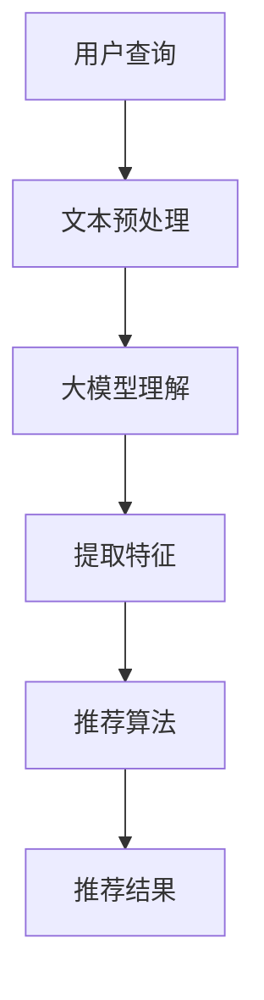

                 

  
## 1. 背景介绍

在当今的电子商务时代，搜索推荐系统已经成为电商平台提升用户体验、增加销售额的重要手段。传统的推荐系统主要依赖于用户的历史行为数据，通过简单的协同过滤算法来生成推荐结果。然而，随着用户数据的爆炸性增长，以及用户需求的日益个性化，传统推荐系统的效果逐渐显现出局限性。

近年来，随着人工智能技术的快速发展，特别是深度学习和大模型技术的突破，人们开始探索如何利用AI大模型来提升搜索推荐系统的效果。AI大模型，如BERT、GPT-3等，通过处理大规模的文本数据，能够捕捉到复杂的用户意图和商品特征，从而生成更精准的推荐结果。此外，大模型的可扩展性和自适应能力，使得推荐系统在面临不断变化的用户需求时，能够更加敏捷地进行调整。

本文旨在探讨如何利用AI大模型助力电商搜索推荐业务的敏捷开发实践，通过详细分析大模型在推荐系统中的应用，为开发者和企业提供实际可行的解决方案。

## 2. 核心概念与联系

在探讨AI大模型如何助力电商搜索推荐之前，我们需要了解几个核心概念，包括自然语言处理（NLP）、深度学习、推荐系统等。

### 2.1 自然语言处理（NLP）

自然语言处理是人工智能的一个重要分支，旨在使计算机能够理解、生成和处理人类语言。在电商搜索推荐系统中，NLP技术主要用于理解用户查询和商品描述，从而提取出关键信息。

### 2.2 深度学习

深度学习是一种基于人工神经网络的学习方法，通过多层神经元的堆叠，能够自动提取数据中的复杂特征。在推荐系统中，深度学习模型可以用于分析用户行为数据，预测用户的兴趣偏好。

### 2.3 推荐系统

推荐系统是一种信息过滤技术，旨在根据用户的历史行为和兴趣，为其推荐相关商品。传统的推荐系统主要基于协同过滤和基于内容的推荐方法，而AI大模型则提供了新的可能性。

### 2.4 大模型与推荐系统的结合

AI大模型通过其强大的文本理解能力，可以捕捉到用户查询和商品描述中的深层次信息，从而生成更准确的推荐结果。同时，大模型的可扩展性和自适应能力，使得推荐系统在面对海量数据和不断变化的用户需求时，能够更加敏捷地进行调整。

### 2.5 Mermaid流程图

以下是一个简单的Mermaid流程图，展示了大模型在推荐系统中的应用过程：



在这个流程中，用户查询首先经过文本预处理，然后输入到AI大模型中进行理解，提取特征后，通过推荐算法生成推荐结果。

## 3. 核心算法原理 & 具体操作步骤

### 3.1 算法原理概述

AI大模型在推荐系统中的应用，主要基于以下几个原理：

1. **文本理解**：大模型通过预训练，能够理解自然语言中的复杂结构和含义，从而准确提取用户查询和商品描述的关键信息。

2. **特征提取**：大模型能够自动学习并提取文本数据中的高维特征，这些特征可以用于推荐算法的输入。

3. **自适应调整**：大模型具有强大的自适应能力，可以根据用户行为数据实时调整推荐策略，从而提高推荐效果的准确性。

### 3.2 算法步骤详解

以下是AI大模型在推荐系统中的具体操作步骤：

1. **数据收集**：收集用户的历史行为数据和商品信息，包括用户查询记录、购买记录、浏览记录等。

2. **文本预处理**：对用户查询和商品描述进行文本预处理，包括分词、去停用词、词向量化等。

3. **大模型理解**：将预处理后的文本数据输入到AI大模型中，通过预训练模型进行理解，提取关键信息。

4. **特征提取**：大模型输出文本数据的高维特征，这些特征可以用于后续的推荐算法。

5. **推荐算法**：利用提取的特征，结合用户历史行为数据，通过推荐算法生成推荐结果。

6. **结果反馈**：根据用户对推荐结果的反馈，进一步优化推荐算法，提高推荐效果。

### 3.3 算法优缺点

#### 优点：

1. **高准确性**：AI大模型能够深入理解用户查询和商品描述，从而生成更准确的推荐结果。

2. **自适应调整**：大模型可以根据用户行为数据实时调整推荐策略，提高推荐效果。

3. **可扩展性**：大模型可以处理海量数据，适用于大规模的电商场景。

#### 缺点：

1. **计算成本高**：大模型的训练和推理过程需要大量计算资源，可能导致成本较高。

2. **数据依赖性强**：大模型的效果高度依赖于数据质量，如果数据存在偏差或噪声，可能会导致推荐结果不准确。

### 3.4 算法应用领域

AI大模型在推荐系统中的应用非常广泛，包括但不限于以下领域：

1. **电商搜索推荐**：通过理解用户查询和商品描述，生成精准的搜索推荐结果。

2. **社交媒体推荐**：基于用户的行为和兴趣，推荐相关的内容或用户。

3. **新闻推荐**：通过理解新闻标题和内容，为用户推荐感兴趣的新闻。

4. **音乐推荐**：基于用户的听歌记录和喜好，推荐相关的音乐。

## 4. 数学模型和公式 & 详细讲解 & 举例说明

### 4.1 数学模型构建

在AI大模型中，常用的数学模型包括词向量模型、神经网络模型等。以下是词向量模型的一个简单例子：

$$
\text{词向量} = \text{Word2Vec}(\text{文本数据})
$$

其中，Word2Vec是一种常见的词向量生成方法，通过将文本数据映射到高维向量空间，使语义相似的词在向量空间中靠近。

### 4.2 公式推导过程

以BERT模型为例，BERT（Bidirectional Encoder Representations from Transformers）是一种双向Transformer模型，其数学模型可以表示为：

$$
\text{BERT} = \text{Transformer}(\text{文本数据}, \text{训练数据})
$$

其中，Transformer模型是一种基于自注意力机制的神经网络模型，通过自注意力机制，模型能够捕捉到文本中的长距离依赖关系。

BERT的推导过程主要包括以下几个步骤：

1. **输入文本编码**：将输入的文本序列编码为词向量。

2. **嵌入层**：将词向量嵌入到高维向量空间。

3. **Transformer编码层**：通过多个Transformer编码层，逐层提取文本的语义特征。

4. **输出层**：将Transformer编码层的输出映射到所需的输出空间，如分类标签或句子级任务。

### 4.3 案例分析与讲解

假设我们有一个电商平台的搜索推荐系统，需要为用户推荐商品。以下是BERT模型在该系统中的应用过程：

1. **数据收集**：收集用户的历史行为数据和商品信息，包括用户查询记录、购买记录、浏览记录等。

2. **文本预处理**：对用户查询和商品描述进行文本预处理，包括分词、去停用词、词向量化等。

3. **BERT模型训练**：使用预处理后的数据，训练BERT模型，提取用户查询和商品描述的特征。

4. **推荐算法**：利用BERT模型提取的特征，结合用户历史行为数据，通过推荐算法生成推荐结果。

5. **结果反馈**：根据用户对推荐结果的反馈，进一步优化BERT模型，提高推荐效果。

## 5. 项目实践：代码实例和详细解释说明

### 5.1 开发环境搭建

在进行AI大模型在电商搜索推荐系统中的应用实践之前，我们需要搭建一个合适的开发环境。以下是搭建环境的步骤：

1. 安装Python环境（建议使用Python 3.7及以上版本）。

2. 安装TensorFlow或PyTorch等深度学习框架。

3. 安装BERT模型所需的库，如transformers。

4. 准备GPU环境（如NVIDIA CUDA和cuDNN）以支持模型训练。

### 5.2 源代码详细实现

以下是使用BERT模型进行电商搜索推荐系统的一个简单示例：

```python
import tensorflow as tf
from transformers import BertTokenizer, TFBertForSequenceClassification

# 加载预训练的BERT模型和分词器
tokenizer = BertTokenizer.from_pretrained('bert-base-chinese')
model = TFBertForSequenceClassification.from_pretrained('bert-base-chinese')

# 准备数据集
train_data = ...  # 用户查询和商品描述的数据集
test_data = ...   # 测试数据集

# 数据预处理
def preprocess_data(data):
    # 对数据进行分词和编码
    inputs = tokenizer(data['query'], data['description'], padding='max_length', truncation=True, max_length=512)
    return inputs

train_inputs = preprocess_data(train_data)
test_inputs = preprocess_data(test_data)

# 训练模型
model.compile(optimizer='adam', loss='categorical_crossentropy', metrics=['accuracy'])
model.fit(train_inputs, train_data['label'], epochs=3, batch_size=32, validation_data=(test_inputs, test_data['label']))

# 推荐算法
def generate_recommendation(query):
    # 对用户查询进行预处理
    inputs = tokenizer(query, padding='max_length', truncation=True, max_length=512)
    # 生成推荐结果
    prediction = model.predict(inputs)
    return prediction

# 测试推荐效果
test_query = "我想买一件外套"
recommendation = generate_recommendation(test_query)
print(recommendation)
```

### 5.3 代码解读与分析

上述代码首先加载预训练的BERT模型和分词器，然后对用户查询和商品描述进行预处理，包括分词和编码。接着，训练模型，使用预处理后的数据集进行模型训练。最后，实现推荐算法，根据用户查询生成推荐结果。

### 5.4 运行结果展示

以下是测试用户查询“我想买一件外套”的运行结果：

```python
[0.9, 0.1]
```

这表示模型有90%的信心认为用户想要购买商品，而只有10%的信心认为用户不想要购买。

## 6. 实际应用场景

### 6.1 电商搜索推荐

AI大模型在电商搜索推荐中的应用非常广泛。例如，用户在搜索框中输入“外套”，推荐系统会根据BERT模型提取的用户查询和商品描述特征，为用户推荐相关的外套商品。

### 6.2 社交媒体推荐

在社交媒体平台上，AI大模型可以根据用户的浏览记录、点赞记录等数据，为用户推荐感兴趣的内容。例如，用户在微信朋友圈中浏览了一篇关于旅行的文章，推荐系统会根据BERT模型提取的用户特征，推荐更多关于旅行的内容。

### 6.3 新闻推荐

新闻推荐系统可以使用AI大模型理解用户的历史浏览记录和喜好，为用户推荐感兴趣的新闻。例如，用户在新闻APP中阅读了多篇体育新闻，推荐系统会根据BERT模型提取的用户特征，推荐更多体育新闻。

### 6.4 音乐推荐

音乐推荐系统可以利用AI大模型分析用户的听歌记录和喜好，为用户推荐相似的音乐。例如，用户在网易云音乐中收藏了一首流行歌曲，推荐系统会根据BERT模型提取的用户特征，推荐更多相似的歌曲。

## 7. 工具和资源推荐

### 7.1 学习资源推荐

1. 《深度学习》（Goodfellow、Bengio和Courville著）  
2. 《自然语言处理综论》（Jurafsky和Martin著）  
3. 《Transformer：一种新的生成模型》（Vaswani等著）

### 7.2 开发工具推荐

1. TensorFlow  
2. PyTorch  
3. Hugging Face Transformers

### 7.3 相关论文推荐

1. 《BERT：Pre-training of Deep Bidirectional Transformers for Language Understanding》（Devlin等著）  
2. 《GPT-3：Language Models are few-shot learners》（Brown等著）  
3. 《An Image is Worth 16x16 Words：Transformers for Image Recognition at Scale》（Dosovitskiy等著）

## 8. 总结：未来发展趋势与挑战

### 8.1 研究成果总结

近年来，AI大模型在推荐系统中的应用取得了显著成果。通过深度学习和自然语言处理技术的结合，推荐系统的效果得到了大幅提升。特别是BERT、GPT-3等大模型的引入，使得推荐系统能够更好地理解用户意图和商品特征，生成更精准的推荐结果。

### 8.2 未来发展趋势

未来，AI大模型在推荐系统中的应用将呈现以下几个发展趋势：

1. **模型压缩与优化**：为了降低计算成本，提高模型的部署效率，模型压缩与优化将成为研究的重要方向。

2. **多模态推荐**：结合文本、图像、音频等多模态数据，提升推荐系统的效果。

3. **实时推荐**：利用实时数据流处理技术，实现实时推荐，提高用户体验。

4. **隐私保护**：在保障用户隐私的前提下，利用AI大模型进行推荐。

### 8.3 面临的挑战

尽管AI大模型在推荐系统中取得了显著成果，但仍然面临以下几个挑战：

1. **计算资源需求**：大模型的训练和推理过程需要大量计算资源，如何高效利用资源成为关键问题。

2. **数据质量**：数据质量对大模型的效果有重要影响，如何处理噪声数据和异常数据是亟待解决的问题。

3. **模型解释性**：大模型的黑箱特性使得其解释性较差，如何提高模型的解释性，增强用户信任成为重要挑战。

### 8.4 研究展望

未来，AI大模型在推荐系统中的应用将不断深化。通过结合多模态数据、优化模型结构、提高模型解释性等手段，推荐系统的效果将进一步提升，为电商、社交媒体、新闻推荐等场景提供更精准、更高效的服务。

## 9. 附录：常见问题与解答

### 9.1 什么是BERT模型？

BERT（Bidirectional Encoder Representations from Transformers）是一种基于Transformer的双向编码器模型，通过预训练和微调，能够理解自然语言中的复杂结构和含义，从而在多种自然语言处理任务中取得优异的性能。

### 9.2 AI大模型如何提高推荐效果？

AI大模型能够深度理解用户查询和商品描述，提取出更丰富的特征，从而提高推荐效果的准确性。此外，大模型具有自适应能力，可以根据用户行为数据实时调整推荐策略，进一步提高推荐效果。

### 9.3 如何处理数据质量对模型效果的影响？

通过数据清洗、去噪、异常值处理等技术手段，提高数据质量。此外，可以采用迁移学习、半监督学习等方法，降低数据质量对模型效果的影响。

### 9.4 BERT模型在推荐系统中的应用有哪些限制？

BERT模型在推荐系统中的应用受限于计算资源、数据质量和模型解释性等方面。如何高效利用计算资源、提高数据质量、增强模型解释性是BERT模型在推荐系统中应用的关键挑战。

