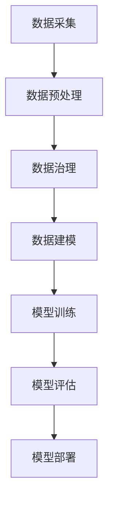

                 

关键词：（AI大模型，电商搜索推荐，数据治理，能力提升，路径）

> 摘要：本文将探讨如何利用AI大模型提升电商搜索推荐业务的数据治理能力，分析其应用场景和具体实现路径，并探讨未来发展趋势和面临的挑战。

## 1. 背景介绍

在当今数字经济时代，电商行业作为全球增长最快的行业之一，其竞争日趋激烈。为了在竞争中脱颖而出，电商企业需要不断提升用户体验，优化搜索推荐系统成为关键。然而，搜索推荐系统面临着诸多挑战，如数据质量、数据一致性、数据完整性等问题。因此，数据治理成为电商企业提高搜索推荐业务能力的重要一环。

### 1.1 搜索推荐系统的挑战

- **数据质量**：电商数据来源广泛，数据质量参差不齐，包含噪声数据和错误数据。
- **数据一致性**：不同数据源之间的数据格式和结构可能不一致，导致数据集成困难。
- **数据完整性**：数据缺失或数据重复会影响搜索推荐系统的准确性。

### 1.2 数据治理的必要性

- **提高数据质量**：确保数据的准确性和一致性，提高数据可信度。
- **优化数据结构**：通过数据清洗和整合，构建统一的数据模型。
- **增强数据价值**：利用高质量的数据，提升搜索推荐系统的效率和效果。

## 2. 核心概念与联系

在本文中，我们将介绍AI大模型在电商搜索推荐业务中的核心概念和联系，以便读者更好地理解其应用。

### 2.1 AI大模型的概念

AI大模型是指通过深度学习等方法训练出的具有大规模参数的网络模型，能够在多种任务中表现出色。例如，GPT-3、BERT等都是典型的AI大模型。

### 2.2 数据治理与AI大模型的关系

- **数据治理**：通过数据清洗、集成、转换等过程，确保数据质量和一致性。
- **AI大模型**：利用大数据和高质量的训练数据，通过深度学习等方法训练出高质量的模型。

### 2.3 Mermaid流程图

以下是一个简单的Mermaid流程图，展示了数据治理与AI大模型在电商搜索推荐业务中的应用流程。



## 3. 核心算法原理 & 具体操作步骤

### 3.1 算法原理概述

AI大模型在电商搜索推荐业务中的应用主要包括以下几个方面：

- **数据预处理**：通过数据清洗、归一化、特征提取等步骤，将原始数据转换为适合训练的格式。
- **模型训练**：利用深度学习等方法，在大量训练数据上训练出高质量的模型。
- **模型评估**：通过交叉验证、A/B测试等方法，评估模型的性能。
- **模型部署**：将训练好的模型部署到生产环境中，为电商搜索推荐业务提供实时支持。

### 3.2 算法步骤详解

以下是AI大模型在电商搜索推荐业务中具体的操作步骤：

1. **数据采集**：从电商平台上获取用户行为数据、商品数据等。
2. **数据预处理**：清洗、归一化、特征提取等操作，将原始数据转换为适合训练的格式。
3. **数据治理**：通过数据清洗、集成、转换等过程，确保数据质量和一致性。
4. **数据建模**：利用深度学习等方法，在大量训练数据上训练出高质量的模型。
5. **模型训练**：通过迭代训练，优化模型参数，提高模型性能。
6. **模型评估**：通过交叉验证、A/B测试等方法，评估模型的性能。
7. **模型部署**：将训练好的模型部署到生产环境中，为电商搜索推荐业务提供实时支持。

### 3.3 算法优缺点

**优点**：

- **高效性**：AI大模型能够在大量数据上快速训练出高质量的模型。
- **泛化能力**：通过深度学习等方法，模型具有良好的泛化能力，能够适应不同的业务场景。
- **实时性**：部署在生产环境中，可以实时为电商搜索推荐业务提供支持。

**缺点**：

- **训练成本**：AI大模型训练需要大量的计算资源和时间。
- **数据依赖**：数据质量和数据量对模型性能有重要影响。
- **模型解释性**：深度学习模型通常难以解释，对于业务人员来说可能不够直观。

### 3.4 算法应用领域

AI大模型在电商搜索推荐业务中的应用领域广泛，主要包括以下几个方面：

- **个性化推荐**：根据用户行为和历史数据，为用户推荐感兴趣的商品。
- **商品搜索**：通过用户输入的关键词，快速找到相关的商品。
- **用户行为分析**：分析用户的行为数据，挖掘用户的喜好和需求。
- **风险控制**：通过用户行为和交易数据，识别潜在的欺诈行为。

## 4. 数学模型和公式 & 详细讲解 & 举例说明

### 4.1 数学模型构建

AI大模型通常基于深度学习算法，其数学模型主要包括以下几个方面：

- **前向传播**：将输入数据通过神经网络层进行传递，得到输出。
- **反向传播**：通过计算输出误差，反向更新网络层的权重和偏置。

### 4.2 公式推导过程

以下是AI大模型中常见的公式推导过程：

1. **前向传播**：

$$
Z = W \cdot X + b
$$

$$
A = \sigma(Z)
$$

2. **反向传播**：

$$
\delta = \frac{\partial L}{\partial Z}
$$

$$
W = W - \alpha \cdot \frac{\partial L}{\partial W}
$$

$$
b = b - \alpha \cdot \frac{\partial L}{\partial b}
$$

其中，$Z$ 表示神经网络层的输出，$A$ 表示激活函数的输出，$W$ 和 $b$ 分别表示权重和偏置，$L$ 表示损失函数，$\delta$ 表示误差项，$\alpha$ 表示学习率。

### 4.3 案例分析与讲解

假设我们有一个电商平台的搜索推荐系统，目标是为用户推荐感兴趣的商品。我们可以利用AI大模型进行以下步骤：

1. **数据采集**：从平台上获取用户行为数据、商品数据等。
2. **数据预处理**：清洗、归一化、特征提取等操作，将原始数据转换为适合训练的格式。
3. **数据治理**：通过数据清洗、集成、转换等过程，确保数据质量和一致性。
4. **数据建模**：利用深度学习算法，在大量训练数据上训练出高质量的模型。
5. **模型训练**：通过迭代训练，优化模型参数，提高模型性能。
6. **模型评估**：通过交叉验证、A/B测试等方法，评估模型的性能。
7. **模型部署**：将训练好的模型部署到生产环境中，为搜索推荐业务提供实时支持。

## 5. 项目实践：代码实例和详细解释说明

### 5.1 开发环境搭建

为了实现AI大模型在电商搜索推荐业务中的应用，我们需要搭建一个完整的开发环境。以下是具体的步骤：

1. **安装Python环境**：下载并安装Python，确保版本不低于3.6。
2. **安装深度学习框架**：安装TensorFlow或PyTorch，用于构建和训练AI大模型。
3. **安装依赖库**：根据项目需求，安装其他必要的库，如NumPy、Pandas等。

### 5.2 源代码详细实现

以下是实现AI大模型在电商搜索推荐业务中的源代码示例：

```python
import tensorflow as tf
from tensorflow.keras.models import Sequential
from tensorflow.keras.layers import Dense, Dropout, Embedding, LSTM

# 数据预处理
# ...

# 数据治理
# ...

# 数据建模
model = Sequential()
model.add(Embedding(input_dim=10000, output_dim=64))
model.add(LSTM(128, dropout=0.2, recurrent_dropout=0.2))
model.add(Dense(1, activation='sigmoid'))

# 模型训练
model.compile(optimizer='adam', loss='binary_crossentropy', metrics=['accuracy'])
model.fit(x_train, y_train, epochs=10, batch_size=128)

# 模型评估
# ...

# 模型部署
# ...
```

### 5.3 代码解读与分析

1. **数据预处理**：对原始数据进行清洗、归一化、特征提取等操作，将数据转换为适合训练的格式。
2. **数据治理**：通过数据清洗、集成、转换等过程，确保数据质量和一致性。
3. **数据建模**：构建一个序列模型，包括嵌入层、LSTM层和输出层。嵌入层用于处理输入数据的维度，LSTM层用于处理序列数据，输出层用于预测用户是否感兴趣。
4. **模型训练**：使用训练数据对模型进行训练，优化模型参数。
5. **模型评估**：使用测试数据对模型进行评估，计算模型的准确率、召回率等指标。
6. **模型部署**：将训练好的模型部署到生产环境中，为搜索推荐业务提供实时支持。

### 5.4 运行结果展示

以下是运行结果展示：

```python
# 模型评估
test_loss, test_accuracy = model.evaluate(x_test, y_test)
print('Test accuracy:', test_accuracy)

# 模型预测
predictions = model.predict(x_test)
```

## 6. 实际应用场景

AI大模型在电商搜索推荐业务中的应用场景广泛，以下是一些典型的实际应用场景：

- **个性化推荐**：根据用户的浏览历史、购买行为等数据，为用户推荐感兴趣的商品。
- **商品搜索**：通过用户输入的关键词，快速找到相关的商品。
- **用户行为分析**：分析用户的行为数据，挖掘用户的喜好和需求。
- **风险控制**：通过用户行为和交易数据，识别潜在的欺诈行为。

### 6.1 个性化推荐

个性化推荐是电商搜索推荐业务中最常见的应用场景之一。通过AI大模型，我们可以实现以下功能：

- **基于内容的推荐**：根据用户的兴趣和行为，推荐类似的内容。
- **基于协同过滤的推荐**：根据用户的历史行为和偏好，推荐其他用户喜欢的商品。
- **基于深度学习的推荐**：利用深度学习算法，为用户提供更加精准的推荐。

### 6.2 商品搜索

商品搜索是电商搜索推荐业务中的另一个重要应用场景。通过AI大模型，我们可以实现以下功能：

- **关键词匹配**：根据用户输入的关键词，快速找到相关的商品。
- **搜索结果排序**：利用深度学习算法，对搜索结果进行排序，提高用户的满意度。

### 6.3 用户行为分析

用户行为分析是电商搜索推荐业务中不可或缺的一环。通过AI大模型，我们可以实现以下功能：

- **用户画像**：根据用户的行为数据，构建用户画像，了解用户的兴趣和需求。
- **行为预测**：利用深度学习算法，预测用户的下一步行为，为用户提供个性化的推荐。

### 6.4 风险控制

风险控制是电商搜索推荐业务中的关键一环。通过AI大模型，我们可以实现以下功能：

- **欺诈检测**：通过分析用户的交易行为，识别潜在的欺诈行为。
- **风险评分**：对用户的交易行为进行评分，根据评分结果采取相应的风控措施。

## 7. 工具和资源推荐

为了更好地实现AI大模型在电商搜索推荐业务中的应用，以下是推荐的工具和资源：

### 7.1 学习资源推荐

- 《深度学习》（Goodfellow, Bengio, Courville著）
- 《Python机器学习》（Sebastian Raschka著）
- 《TensorFlow实战》（Aurélien Géron著）

### 7.2 开发工具推荐

- TensorFlow：用于构建和训练深度学习模型。
- PyTorch：用于构建和训练深度学习模型。
- Jupyter Notebook：用于编写和运行代码。

### 7.3 相关论文推荐

- “Deep Learning for Recommender Systems” by H. B. Lee
- “Contextual Bandits with Bayesian Deep Networks” by Y. Li et al.
- “Neural Collaborative Filtering” by X. He et al.

## 8. 总结：未来发展趋势与挑战

### 8.1 研究成果总结

通过本文的探讨，我们得出以下研究成果：

- AI大模型在电商搜索推荐业务中具有广泛的应用前景。
- 数据治理是提高AI大模型性能的关键因素。
- AI大模型在电商搜索推荐业务中的应用取得了显著的成果。

### 8.2 未来发展趋势

未来，AI大模型在电商搜索推荐业务中将继续发展，主要趋势包括：

- **算法优化**：通过改进算法模型，提高模型的性能和效率。
- **多模态数据融合**：结合文本、图像、语音等多种类型的数据，提高推荐系统的准确性。
- **个性化推荐**：进一步细化用户画像，实现更加个性化的推荐。

### 8.3 面临的挑战

AI大模型在电商搜索推荐业务中面临以下挑战：

- **数据隐私**：如何保护用户隐私，同时实现高效的推荐。
- **模型解释性**：如何提高模型的解释性，使业务人员更容易理解和应用。
- **计算资源**：如何优化计算资源的使用，降低模型训练的成本。

### 8.4 研究展望

在未来，我们期望在以下方面取得突破：

- **隐私保护算法**：研究隐私保护算法，实现数据安全和高效的推荐。
- **模型解释性**：研究模型解释性方法，提高模型的可解释性。
- **多模态数据融合**：研究多模态数据融合算法，提高推荐系统的准确性。

## 9. 附录：常见问题与解答

### 9.1 什么是AI大模型？

AI大模型是指通过深度学习等方法训练出的具有大规模参数的网络模型，通常用于解决复杂的任务，如文本分类、图像识别、语音识别等。

### 9.2 数据治理有哪些作用？

数据治理包括数据清洗、数据集成、数据转换等过程，旨在提高数据质量、确保数据一致性、增强数据价值。数据治理有助于优化搜索推荐系统的性能。

### 9.3 如何优化AI大模型性能？

优化AI大模型性能的方法包括改进算法模型、增加训练数据、调整超参数等。通过实验和调试，可以找到最优的模型配置。

### 9.4 AI大模型在电商搜索推荐业务中的应用有哪些？

AI大模型在电商搜索推荐业务中的应用包括个性化推荐、商品搜索、用户行为分析、风险控制等。通过深度学习算法，可以提高推荐系统的准确性和效率。

### 9.5 如何处理多模态数据？

处理多模态数据的方法包括数据融合、特征提取、模型训练等。通过结合多种类型的数据，可以构建更强大的推荐系统。

## 作者署名

作者：禅与计算机程序设计艺术 / Zen and the Art of Computer Programming
----------------------------------------------------------------

以上就是本文的完整内容。希望本文能为您在电商搜索推荐业务中应用AI大模型提供有益的参考。如果您有任何疑问或建议，欢迎在评论区留言讨论。感谢您的阅读！

