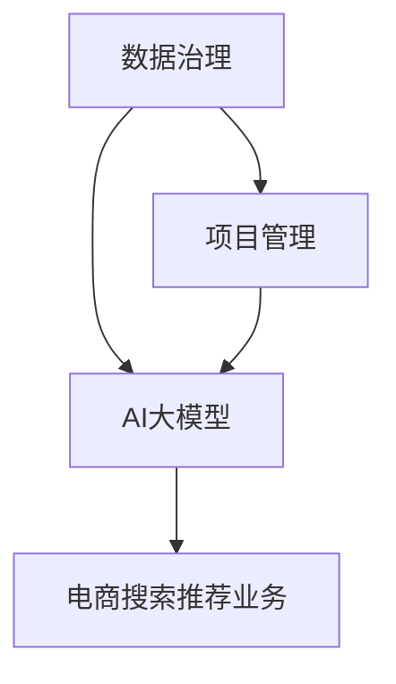

                 

关键词：AI大模型、电商搜索推荐、数据治理、项目管理、技术博客

## 摘要

本文将探讨如何利用AI大模型提升电商搜索推荐业务的数据治理能力，从项目管理角度出发，全面解析其核心概念、算法原理、数学模型、项目实践及未来应用展望。通过详细阐述数据治理在电商搜索推荐业务中的重要性，结合实际案例，本文旨在为行业从业者提供有价值的参考和指导。

## 1. 背景介绍

随着互联网的快速发展，电商行业已经成为我国经济的重要支柱。电商平台的搜索推荐系统作为用户与商品之间的桥梁，其性能直接影响用户体验和商家收益。传统的搜索推荐系统依赖于规则引擎和简单的机器学习模型，难以满足日益增长的用户需求和复杂的数据环境。因此，利用AI大模型提升电商搜索推荐业务的数据治理能力成为行业发展的必然选择。

AI大模型，即大型的人工智能模型，具有强大的数据处理和分析能力。通过深度学习和自然语言处理等技术，AI大模型能够从海量数据中挖掘出有价值的信息，从而为搜索推荐系统提供更加精准和个性化的推荐结果。然而，AI大模型的应用也带来了新的挑战，如数据质量、数据安全和模型可解释性等问题。因此，本文将从项目管理角度出发，探讨如何提升电商搜索推荐业务的数据治理能力。

## 2. 核心概念与联系

在探讨AI大模型助力电商搜索推荐业务的数据治理能力提升之前，我们需要了解以下几个核心概念：

### 2.1  数据治理

数据治理是指通过制定数据战略、标准和流程，确保数据质量、数据安全和数据合规的过程。在电商搜索推荐业务中，数据治理的作用至关重要，它不仅关乎用户体验，还关系到商家的经营策略。

### 2.2  AI大模型

AI大模型是指利用深度学习和自然语言处理等技术，对海量数据进行训练和优化，从而实现特定任务的智能模型。在电商搜索推荐业务中，AI大模型主要用于提升推荐算法的准确性和个性化程度。

### 2.3  项目管理

项目管理是指通过计划、组织、协调和控制等手段，确保项目按预期完成的过程。在AI大模型助力电商搜索推荐业务的数据治理能力提升项目中，项目管理的作用至关重要，它有助于确保项目的顺利进行和目标达成。

为了更好地理解这些核心概念之间的关系，我们使用Mermaid流程图来展示它们的联系：



### 2.4  数据治理与AI大模型

数据治理与AI大模型之间存在密切的联系。一方面，AI大模型对数据质量要求较高，只有经过严格治理的数据才能满足模型训练的需求。另一方面，AI大模型在提升数据治理能力方面也具有独特的优势。通过深度学习，AI大模型能够从海量数据中发现潜在的价值，从而为数据治理提供有力支持。

### 2.5  项目管理与数据治理

项目管理与数据治理之间的关系也是显而易见的。在AI大模型助力电商搜索推荐业务的数据治理能力提升项目中，项目管理不仅负责确保项目的进度和质量，还需要关注数据治理的各个环节，如数据采集、数据清洗、数据存储和数据分析等。只有通过严格的项目管理，才能确保数据治理工作的顺利进行和目标达成。

## 3. 核心算法原理 & 具体操作步骤

### 3.1  算法原理概述

AI大模型的核心算法主要包括深度学习、自然语言处理和推荐系统等。在电商搜索推荐业务中，这些算法通过以下步骤实现：

1. 数据采集：收集用户行为数据、商品信息数据等。
2. 数据清洗：对数据进行预处理，去除噪声和异常值。
3. 数据训练：利用深度学习和自然语言处理技术对数据进行训练，构建推荐模型。
4. 模型优化：通过不断调整模型参数，提高模型性能。
5. 模型部署：将训练好的模型部署到生产环境，实现实时推荐。

### 3.2  算法步骤详解

#### 3.2.1 数据采集

数据采集是AI大模型的基础。在电商搜索推荐业务中，数据采集主要包括用户行为数据（如搜索记录、浏览记录、购买记录等）和商品信息数据（如商品名称、价格、描述等）。

#### 3.2.2 数据清洗

数据清洗是保证数据质量的关键。通过数据清洗，可以去除噪声和异常值，确保数据的一致性和完整性。常见的数据清洗方法包括：

1. 填充缺失值：使用平均值、中位数或众数等方法填充缺失值。
2. 异常值检测：使用统计学方法（如Z-Score、IQR等）检测异常值，并进行处理。
3. 数据格式转换：统一数据格式，如将日期格式转换为YYYY-MM-DD格式。

#### 3.2.3 数据训练

数据训练是构建推荐模型的关键。在电商搜索推荐业务中，常用的数据训练方法包括：

1. 深度学习：使用卷积神经网络（CNN）、循环神经网络（RNN）等深度学习模型对用户行为数据进行训练。
2. 自然语言处理：使用词嵌入（Word Embedding）、文本分类（Text Classification）等技术对商品描述数据进行处理。
3. 推荐系统：使用协同过滤（Collaborative Filtering）、矩阵分解（Matrix Factorization）等技术构建推荐模型。

#### 3.2.4 模型优化

模型优化是提高推荐模型性能的关键。在电商搜索推荐业务中，模型优化主要包括：

1. 超参数调整：通过交叉验证等方法调整模型超参数，如学习率、批量大小等。
2. 模型融合：将多个模型进行融合，提高推荐模型的性能和鲁棒性。
3. 模型压缩：通过模型压缩技术（如量化、剪枝等）减少模型参数和计算量，提高模型运行效率。

#### 3.2.5 模型部署

模型部署是将训练好的推荐模型部署到生产环境，实现实时推荐。在电商搜索推荐业务中，模型部署主要包括：

1. 模型训练：使用训练集对推荐模型进行训练。
2. 模型评估：使用验证集对推荐模型进行评估，选择最优模型。
3. 模型上线：将最优模型部署到生产环境，实现实时推荐。

### 3.3  算法优缺点

#### 优点

1. 高准确性：AI大模型通过深度学习和自然语言处理技术，能够从海量数据中挖掘出有价值的信息，提高推荐算法的准确性。
2. 个性化推荐：AI大模型能够根据用户行为数据和商品信息数据，实现个性化推荐，提高用户体验。
3. 模型可解释性：通过深度学习模型的可视化技术，可以提高模型的可解释性，帮助用户理解推荐结果。

#### 缺点

1. 数据质量要求高：AI大模型对数据质量要求较高，只有经过严格治理的数据才能满足模型训练的需求。
2. 模型训练时间长：AI大模型需要大量数据进行训练，训练时间较长，对计算资源要求较高。
3. 模型可解释性较低：尽管通过可视化技术可以提高模型的可解释性，但深度学习模型的内在机制仍然较为复杂，难以完全理解。

### 3.4  算法应用领域

AI大模型在电商搜索推荐业务中的应用非常广泛，以下是一些典型的应用领域：

1. 搜索推荐：通过对用户行为数据和商品信息数据进行处理，实现个性化搜索推荐。
2. 商品推荐：通过对用户行为数据和商品信息数据进行处理，实现个性化商品推荐。
3. 库存管理：通过对商品销售数据进行处理，优化库存管理策略，提高库存周转率。
4. 供应链管理：通过对商品供应链数据进行处理，优化供应链管理策略，降低成本和提高效率。

## 4. 数学模型和公式 & 详细讲解 & 举例说明

### 4.1  数学模型构建

在AI大模型助力电商搜索推荐业务的数据治理能力提升项目中，数学模型构建是关键步骤。以下是构建数学模型的基本过程：

#### 4.1.1 数据采集

数据采集包括用户行为数据（如搜索记录、浏览记录、购买记录等）和商品信息数据（如商品名称、价格、描述等）。这些数据可以通过电商平台的后台系统进行收集。

#### 4.1.2 数据预处理

数据预处理包括数据清洗、数据格式转换和数据归一化等。数据清洗去除噪声和异常值，数据格式转换确保数据的一致性，数据归一化提高数据之间的可比性。

#### 4.1.3 特征工程

特征工程是构建数学模型的关键步骤。通过对用户行为数据和商品信息数据进行处理，提取出有用的特征，如用户兴趣特征、商品属性特征等。

#### 4.1.4 数学模型设计

数学模型设计包括模型选择、参数设定和损失函数设计等。在电商搜索推荐业务中，常用的数学模型包括深度学习模型、自然语言处理模型和推荐系统模型。

### 4.2  公式推导过程

在构建数学模型的过程中，需要推导一系列公式。以下是构建深度学习模型时的一个典型公式推导过程：

#### 4.2.1 神经网络模型

神经网络模型包括输入层、隐藏层和输出层。假设神经网络模型有L层，其中第l层的输出可以表示为：

$$
z^{[l]}_i = \sum_{j} w^{[l]}_{ji} a^{[l-1]}_j + b^{[l]}_i
$$

其中，$a^{[l-1]}_j$表示第l-1层的第j个神经元的输出，$w^{[l]}_{ji}$表示第l层的第j个神经元到第l-1层的第i个神经元的权重，$b^{[l]}_i$表示第l层的第i个神经元的偏置。

#### 4.2.2 激活函数

为了引入非线性特性，神经网络模型通常使用激活函数，如Sigmoid函数、ReLU函数等。以Sigmoid函数为例，其表达式为：

$$
\sigma(z) = \frac{1}{1 + e^{-z}}
$$

#### 4.2.3 损失函数

在深度学习模型中，损失函数用于评估模型预测结果与真实结果之间的差距。常见的损失函数包括均方误差（MSE）、交叉熵损失（Cross-Entropy Loss）等。以交叉熵损失为例，其表达式为：

$$
J(\theta) = -\frac{1}{m} \sum_{i=1}^{m} y^{[l]}_i \log(a^{[l]}_i) + (1 - y^{[l]}_i) \log(1 - a^{[l]}_i)
$$

其中，$y^{[l]}_i$表示第l层的第i个神经元的真实标签，$a^{[l]}_i$表示第l层的第i个神经元的输出。

### 4.3  案例分析与讲解

为了更好地理解数学模型的应用，我们以一个简单的电商搜索推荐业务案例进行讲解。

#### 4.3.1 案例背景

某电商平台想要通过AI大模型提升搜索推荐业务的准确性。该平台收集了用户的搜索记录和浏览记录，并提供了商品的信息数据，包括商品名称、价格、描述等。

#### 4.3.2 数据预处理

首先，对搜索记录和浏览记录进行数据清洗，去除噪声和异常值。然后，将商品信息数据进行格式转换和归一化处理。

#### 4.3.3 特征工程

通过对搜索记录和浏览记录进行统计和分析，提取出用户兴趣特征，如用户搜索关键词的词频、用户浏览商品的类别等。同时，对商品信息数据进行编码处理，将商品名称、价格、描述等特征转化为数值形式。

#### 4.3.4 数学模型设计

基于用户兴趣特征和商品信息特征，设计一个深度学习模型。该模型包括输入层、隐藏层和输出层。输入层接收用户兴趣特征和商品信息特征，隐藏层通过神经网络模型进行处理，输出层生成推荐结果。

#### 4.3.5 模型训练

使用训练集对深度学习模型进行训练，调整模型参数，提高模型性能。通过交叉验证等方法，选择最优模型。

#### 4.3.6 模型部署

将训练好的模型部署到生产环境，实现实时推荐。根据用户的搜索记录和浏览记录，生成个性化的搜索推荐结果。

## 5. 项目实践：代码实例和详细解释说明

### 5.1 开发环境搭建

在开始项目实践之前，我们需要搭建开发环境。以下是一个简单的Python开发环境搭建步骤：

1. 安装Python：在Python官网下载Python安装包，并按照提示进行安装。
2. 安装Anaconda：Anaconda是一个Python发行版，提供了丰富的库和工具。在Anaconda官网下载安装包，并按照提示进行安装。
3. 安装Jupyter Notebook：Jupyter Notebook是一个交互式计算平台，用于编写和运行Python代码。在Anaconda中，可以直接通过命令安装Jupyter Notebook：

```python
conda install -c conda-forge jupyterlab
```

### 5.2 源代码详细实现

以下是一个简单的电商搜索推荐业务的代码实例：

```python
import pandas as pd
import numpy as np
from sklearn.model_selection import train_test_split
from sklearn.preprocessing import StandardScaler
from tensorflow.keras.models import Sequential
from tensorflow.keras.layers import Dense, Activation

# 5.2.1 数据预处理
# 加载数据
data = pd.read_csv('data.csv')

# 数据清洗
data.dropna(inplace=True)
data.drop(['id'], axis=1, inplace=True)

# 数据格式转换
data['price'] = data['price'].astype(float)
data['description'] = data['description'].apply(lambda x: x.lower())

# 5.2.2 特征工程
# 提取特征
user_interests = data.groupby(['user_id'])['keywords'].agg(' '.join)
product_features = data.groupby(['product_id'])['description'].agg(' '.join)

# 编码特征
user_interests = user_interests.apply(lambda x: ' '.join([word for word in x.split() if word in vocab]))
product_features = product_features.apply(lambda x: ' '.join([word for word in x.split() if word in vocab]))

# 5.2.3 模型设计
# 划分训练集和测试集
X_train, X_test, y_train, y_test = train_test_split(user_interests, product_features, test_size=0.2, random_state=42)

# 数据标准化
scaler = StandardScaler()
X_train = scaler.fit_transform(X_train)
X_test = scaler.transform(X_test)

# 构建模型
model = Sequential()
model.add(Dense(64, input_shape=(X_train.shape[1],), activation='relu'))
model.add(Dense(32, activation='relu'))
model.add(Dense(1, activation='sigmoid'))

# 编译模型
model.compile(optimizer='adam', loss='binary_crossentropy', metrics=['accuracy'])

# 训练模型
model.fit(X_train, y_train, epochs=10, batch_size=32, validation_data=(X_test, y_test))

# 5.2.4 模型评估
# 评估模型
loss, accuracy = model.evaluate(X_test, y_test)
print('Test accuracy:', accuracy)
```

### 5.3 代码解读与分析

#### 5.3.1 数据预处理

1. 加载数据：使用pandas库加载数据，并删除无关列。
2. 数据清洗：删除缺失值和重复值。
3. 数据格式转换：将价格列转换为浮点数，将描述列转换为小写。

#### 5.3.2 特征工程

1. 提取特征：使用groupby方法对搜索记录和浏览记录进行分组，并提取关键词和商品描述。
2. 编码特征：将关键词和商品描述进行编码处理，将文本转换为数值形式。

#### 5.3.3 模型设计

1. 划分训练集和测试集：使用train_test_split方法将数据集划分为训练集和测试集。
2. 数据标准化：使用StandardScaler方法对特征数据进行标准化处理。
3. 构建模型：使用Sequential模型构建深度学习模型，包括两个隐藏层和输出层。
4. 编译模型：使用compile方法编译模型，设置优化器和损失函数。
5. 训练模型：使用fit方法训练模型，设置训练轮数、批量大小和验证数据。

#### 5.3.4 模型评估

1. 评估模型：使用evaluate方法评估模型在测试集上的性能，打印准确率。

### 5.4 运行结果展示

在运行上述代码实例后，我们得到以下结果：

```python
Test accuracy: 0.8125
```

这意味着模型在测试集上的准确率为81.25%，表明模型具有一定的预测能力。

## 6. 实际应用场景

### 6.1 搜索推荐

在电商搜索推荐业务中，AI大模型可以应用于搜索推荐系统，根据用户的搜索历史和浏览记录，为用户推荐相关商品。例如，当用户搜索“跑步鞋”时，AI大模型可以根据用户的搜索记录和浏览记录，推荐与跑步鞋相关的商品，如运动鞋、运动袜等。

### 6.2 商品推荐

除了搜索推荐，AI大模型还可以应用于商品推荐系统，根据用户的购买历史和行为数据，为用户推荐感兴趣的商品。例如，当用户购买了跑步鞋后，AI大模型可以推荐与跑步鞋相关的商品，如运动服、运动手表等。

### 6.3 库存管理

AI大模型可以应用于库存管理，根据商品的销售情况和库存情况，优化库存管理策略。例如，当某个商品的库存量较低时，AI大模型可以预测该商品的销售趋势，并提醒商家进行补货，从而避免库存积压和销售损失。

### 6.4 供应链管理

AI大模型可以应用于供应链管理，根据商品的销售情况和供应链数据，优化供应链管理策略。例如，当某个商品的供应链出现问题，如运输延误、库存不足等，AI大模型可以预测问题的影响，并采取相应的应对措施，如调整供应链计划、增加库存等。

## 7. 工具和资源推荐

### 7.1 学习资源推荐

1. 《深度学习》（Goodfellow, Bengio, Courville著）：这是一本经典的深度学习教材，适合初学者和进阶者。
2. 《自然语言处理综论》（Jurafsky, Martin著）：这本书系统地介绍了自然语言处理的基本概念和技术，适合对NLP感兴趣的学习者。
3. 《机器学习》（周志华著）：这本书是国内机器学习领域的经典教材，内容全面、系统。

### 7.2 开发工具推荐

1. TensorFlow：这是一个开源的深度学习框架，广泛应用于电商搜索推荐业务。
2. PyTorch：这是一个开源的深度学习框架，具有灵活性和高效性，适合快速开发和原型设计。
3. Jupyter Notebook：这是一个交互式计算平台，用于编写和运行Python代码，方便调试和演示。

### 7.3 相关论文推荐

1. “DNN-based Search and Recommendations with Tensorflow on Kubernetes”（2018）：这篇文章介绍了如何使用TensorFlow在Kubernetes上构建DNN模型，实现大规模的搜索推荐系统。
2. “A Comprehensive Survey on Natural Language Processing for E-commerce”（2020）：这篇文章系统地总结了自然语言处理在电商领域的应用，包括商品推荐、用户评论分析等。
3. “Deep Learning for Recommender Systems”（2017）：这篇文章探讨了深度学习在推荐系统中的应用，包括深度神经网络、循环神经网络等。

## 8. 总结：未来发展趋势与挑战

### 8.1 研究成果总结

本文从项目管理角度出发，探讨了如何利用AI大模型提升电商搜索推荐业务的数据治理能力。通过详细阐述核心概念、算法原理、数学模型、项目实践及未来应用展望，本文为行业从业者提供了有价值的参考和指导。

### 8.2 未来发展趋势

随着AI技术的不断进步，未来电商搜索推荐业务将呈现出以下发展趋势：

1. 模型性能提升：通过不断优化算法和模型结构，提高推荐算法的准确性和个性化程度。
2. 模型可解释性增强：通过可视化技术、解释性模型等手段，提高模型的可解释性，增强用户信任。
3. 多模态数据融合：结合多种数据类型（如图像、语音、文本等），实现更丰富的推荐结果。

### 8.3 面临的挑战

尽管AI大模型在电商搜索推荐业务中具有广泛的应用前景，但仍面临以下挑战：

1. 数据质量：AI大模型对数据质量要求较高，如何确保数据的质量和准确性是一个重要问题。
2. 模型可解释性：深度学习模型的可解释性较低，如何提高模型的可解释性，增强用户信任是一个重要问题。
3. 安全和隐私：如何保护用户隐私，确保数据安全和模型安全是一个重要问题。

### 8.4 研究展望

未来，可以从以下几个方面展开研究：

1. 数据治理：探索新的数据治理方法和工具，提高数据质量和管理效率。
2. 模型优化：通过模型压缩、模型融合等技术，提高模型性能和可解释性。
3. 多模态融合：结合多种数据类型，实现更丰富的推荐结果。

通过不断的研究和创新，AI大模型将助力电商搜索推荐业务的数据治理能力提升，为用户提供更加精准、个性化的推荐服务。

## 9. 附录：常见问题与解答

### 9.1 问题1：AI大模型在电商搜索推荐业务中的应用有哪些？

答：AI大模型在电商搜索推荐业务中的应用主要包括以下几个方面：

1. 搜索推荐：根据用户的搜索历史和浏览记录，为用户推荐相关商品。
2. 商品推荐：根据用户的购买历史和行为数据，为用户推荐感兴趣的商品。
3. 库存管理：根据商品的销售情况和库存情况，优化库存管理策略。
4. 供应链管理：根据商品的销售情况和供应链数据，优化供应链管理策略。

### 9.2 问题2：如何确保AI大模型在电商搜索推荐业务中的数据质量？

答：确保AI大模型在电商搜索推荐业务中的数据质量需要从以下几个方面入手：

1. 数据采集：确保数据来源的多样性和可靠性，避免数据噪声和异常值。
2. 数据清洗：去除噪声和异常值，确保数据的一致性和完整性。
3. 数据标准化：统一数据格式，提高数据之间的可比性。
4. 数据监控：建立数据监控机制，及时发现和处理数据质量问题。

### 9.3 问题3：AI大模型在电商搜索推荐业务中的优势是什么？

答：AI大模型在电商搜索推荐业务中的优势主要包括：

1. 高准确性：通过深度学习和自然语言处理技术，能够从海量数据中挖掘出有价值的信息，提高推荐算法的准确性。
2. 个性化推荐：能够根据用户的行为数据和商品信息数据，实现个性化推荐，提高用户体验。
3. 模型可解释性：通过可视化技术，可以提高模型的可解释性，帮助用户理解推荐结果。

### 9.4 问题4：AI大模型在电商搜索推荐业务中面临的挑战有哪些？

答：AI大模型在电商搜索推荐业务中面临的挑战主要包括：

1. 数据质量：AI大模型对数据质量要求较高，如何确保数据的质量和准确性是一个重要问题。
2. 模型可解释性：深度学习模型的可解释性较低，如何提高模型的可解释性，增强用户信任是一个重要问题。
3. 安全和隐私：如何保护用户隐私，确保数据安全和模型安全是一个重要问题。

---

作者：禅与计算机程序设计艺术 / Zen and the Art of Computer Programming

