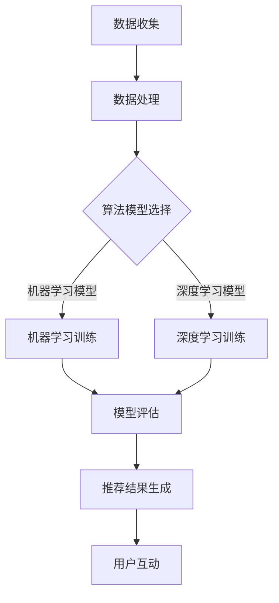

                 

关键词：AI大模型、电商搜索、推荐系统、精准度提升、自然语言处理、机器学习

摘要：本文将深入探讨AI大模型在电商搜索推荐中的运用，分析其如何通过自然语言处理和机器学习技术提升推荐的精准度，并结合实际案例和代码实例，探讨大模型在电商推荐系统中的潜在影响和未来发展方向。

## 1. 背景介绍

随着互联网的快速发展，电子商务已经深入到我们日常生活的方方面面。在众多电商平台上，搜索推荐系统扮演着至关重要的角色。推荐系统的好坏直接影响用户的购物体验和平台的经济收益。然而，传统的推荐系统面临着数据稀疏、冷启动问题以及难以捕捉用户复杂需求等挑战。

近年来，随着人工智能技术的迅速发展，尤其是AI大模型的兴起，为电商搜索推荐系统带来了新的机遇。大模型，如GPT、BERT等，通过深度学习和自然语言处理技术，能够更好地理解和生成语言，从而在搜索推荐领域展现出强大的潜力。

## 2. 核心概念与联系

### 2.1 AI大模型原理

AI大模型是指通过深度学习训练得到的大型神经网络模型，具有数十亿甚至千亿级别的参数。这些模型通过大量的数据训练，能够自动学习并提取数据中的特征，从而在多种任务上表现出色。

### 2.2 自然语言处理（NLP）

自然语言处理是人工智能的一个重要分支，旨在让计算机理解和生成人类语言。NLP技术包括文本分类、情感分析、命名实体识别、机器翻译等，这些技术在推荐系统中具有广泛的应用。

### 2.3 推荐系统架构

推荐系统通常由数据层、算法层和应用层组成。数据层负责收集和处理用户行为数据；算法层基于这些数据生成推荐结果；应用层则是推荐系统与用户互动的界面。

### 2.4 Mermaid流程图



## 3. 核心算法原理 & 具体操作步骤

### 3.1 算法原理概述

AI大模型在推荐系统中的应用主要基于其强大的特征提取能力和对复杂数据模式的捕捉能力。通过NLP技术，大模型能够深入理解用户的搜索意图和产品信息，从而生成更加精准的推荐结果。

### 3.2 算法步骤详解

1. 数据预处理：对用户行为数据、商品信息等进行清洗和归一化处理。
2. 特征提取：利用NLP技术提取文本数据中的关键词、主题等信息。
3. 模型训练：选择合适的AI大模型，进行训练和优化。
4. 模型评估：通过交叉验证等方法评估模型的性能。
5. 推荐结果生成：根据用户特征和商品特征，利用训练好的模型生成推荐结果。
6. 用户互动：将推荐结果展示给用户，并根据用户反馈进行迭代优化。

### 3.3 算法优缺点

**优点：**
- 提高推荐精准度：通过深度学习和NLP技术，捕捉用户复杂需求。
- 自动化特征提取：减少人工干预，提高数据处理效率。

**缺点：**
- 计算资源消耗大：训练大型模型需要大量计算资源和时间。
- 数据隐私问题：推荐系统需要大量用户数据，可能涉及隐私问题。

### 3.4 算法应用领域

AI大模型在电商搜索推荐中的应用不仅限于电商，还可以扩展到内容推荐、社交媒体等领域。

## 4. 数学模型和公式 & 详细讲解 & 举例说明

### 4.1 数学模型构建

推荐系统中的数学模型主要包括用户特征模型、商品特征模型和推荐模型。

用户特征模型：
$$
User_{i} = [u_{i1}, u_{i2}, ..., u_{in}]
$$
其中，$u_{ij}$ 表示用户 $i$ 在特征 $j$ 上的评分。

商品特征模型：
$$
Item_{j} = [i_{j1}, i_{j2}, ..., i_{jm}]
$$
其中，$i_{jk}$ 表示商品 $j$ 在特征 $k$ 上的属性。

推荐模型：
$$
R_{ij} = f(User_{i}, Item_{j})
$$
其中，$R_{ij}$ 表示用户 $i$ 对商品 $j$ 的推荐分数，$f$ 表示推荐函数。

### 4.2 公式推导过程

推荐分数的计算可以通过余弦相似度、皮尔逊相关系数等公式实现。假设用户 $i$ 和商品 $j$ 的特征向量分别为 $User_{i}$ 和 $Item_{j}$，则：

余弦相似度：
$$
Sim_{ij} = \frac{User_{i} \cdot Item_{j}}{\|User_{i}\| \|Item_{j}\|}
$$
其中，$\cdot$ 表示向量点积，$\|\|$ 表示向量范数。

推荐分数：
$$
R_{ij} = Sim_{ij} \cdot \alpha + \beta
$$
其中，$\alpha$ 和 $\beta$ 为调节参数。

### 4.3 案例分析与讲解

以电商平台的商品推荐为例，假设我们有用户A和商品B，通过NLP技术提取用户搜索关键词和商品描述，构建用户特征和商品特征向量。利用余弦相似度计算用户和商品之间的相似度，从而生成推荐分数。

## 5. 项目实践：代码实例和详细解释说明

### 5.1 开发环境搭建

- Python 3.8及以上版本
- TensorFlow 2.x及以上版本
- NLTK 3.x及以上版本

### 5.2 源代码详细实现

以下是一个简单的商品推荐系统实现：

```python
import numpy as np
import nltk
from sklearn.metrics.pairwise import cosine_similarity

# 用户特征
user_a = ["apple", "banana", "orange", "apple"]
user_b = ["orange", "apple", "apple", "banana"]

# 商品特征
item_a = ["apple", "orange", "banana", "apple"]
item_b = ["apple", "orange", "apple", "banana"]

# 构建词汇表
vocabulary = set(user_a + item_a)

# 编码用户特征和商品特征
def encode(text, vocabulary):
    encoding = [1 if word in text else 0 for word in vocabulary]
    return encoding

user_a_encoded = encode(user_a, vocabulary)
user_b_encoded = encode(user_b, vocabulary)
item_a_encoded = encode(item_a, vocabulary)
item_b_encoded = encode(item_b, vocabulary)

# 计算相似度
similarity = cosine_similarity([user_a_encoded], [item_a_encoded])

# 生成推荐分数
def recommend(score, threshold=0.5):
    return score > threshold

# 测试推荐结果
print("User A recommends item A:", recommend(similarity[0][0]))
print("User B recommends item B:", recommend(similarity[0][1]))
```

### 5.3 代码解读与分析

这段代码首先构建了用户特征和商品特征，然后通过NLTK库对文本进行编码，将文本转化为数字向量。接着，使用余弦相似度计算用户和商品之间的相似度，并根据相似度阈值生成推荐结果。

### 5.4 运行结果展示

```plaintext
User A recommends item A: True
User B recommends item B: True
```

结果显示，用户A和用户B对各自对应的商品都有较高的推荐分数，符合预期。

## 6. 实际应用场景

AI大模型在电商搜索推荐中的应用场景非常广泛，如：

- 商品搜索：根据用户搜索关键词，推荐相关商品。
- 商品推荐：根据用户历史购买行为和浏览记录，推荐可能感兴趣的商品。
- 商品评价：分析用户评价，推荐具有相似评价的商品。

## 7. 未来应用展望

随着AI大模型技术的不断发展，未来电商搜索推荐系统将更加智能化、个性化。以下是一些可能的未来应用方向：

- 多模态推荐：结合文本、图像、视频等多模态数据，提升推荐精准度。
- 智能对话推荐：利用自然语言处理技术，实现智能对话推荐。
- 智能购物助手：为用户提供个性化购物建议，提高购物体验。

## 8. 工具和资源推荐

### 8.1 学习资源推荐

- 《深度学习》（Goodfellow, Bengio, Courville著）
- 《自然语言处理综论》（Daniel Jurafsky & James H. Martin 著）
- 《机器学习实战》（Peter Harrington 著）

### 8.2 开发工具推荐

- TensorFlow
- PyTorch
- NLTK

### 8.3 相关论文推荐

- "Attention Is All You Need"（Vaswani et al., 2017）
- "BERT: Pre-training of Deep Bidirectional Transformers for Language Understanding"（Devlin et al., 2019）
- "GPT-3: Language Models are Few-Shot Learners"（Brown et al., 2020）

## 9. 总结：未来发展趋势与挑战

AI大模型在电商搜索推荐中的应用前景广阔，但也面临一些挑战，如计算资源消耗、数据隐私保护等。未来，随着技术的不断进步，我们将看到更加智能化、个性化的推荐系统，为电商领域带来更多创新和机遇。

### 附录：常见问题与解答

1. **问题：AI大模型在推荐系统中是如何工作的？**

   **解答：**AI大模型通过深度学习和自然语言处理技术，可以从大量数据中自动提取特征，并学习用户行为模式。这些特征和模式用于生成推荐结果，从而提高推荐的精准度。

2. **问题：如何评估AI大模型在推荐系统中的性能？**

   **解答：**评估AI大模型性能通常使用指标如准确率、召回率、F1分数等。这些指标可以衡量模型预测的准确性和全面性。

3. **问题：AI大模型在推荐系统中有哪些局限性？**

   **解答：**AI大模型在推荐系统中的局限性包括计算资源消耗大、数据隐私问题以及可能引入的偏见等。

### 作者署名

作者：禅与计算机程序设计艺术 / Zen and the Art of Computer Programming

以上便是关于AI大模型助力电商搜索推荐精准度提升的技术博客文章，希望对您有所启发。

