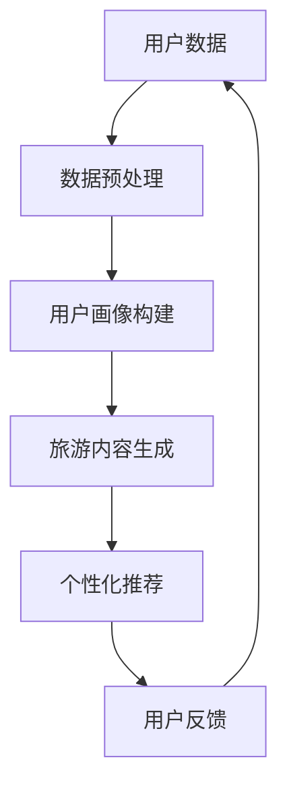

                 

## 1. 背景介绍

个性化旅游作为现代旅游业的重要发展趋势，已经在全球范围内受到了广泛关注。随着互联网技术的快速发展，人们对于旅游的需求越来越多样化、个性化。传统的旅游服务模式已无法满足消费者对于个性化、定制化服务的追求。而人工智能（AI）技术的崛起，尤其是大模型的广泛应用，为个性化旅游提供了新的解决方案。

大模型，通常是指拥有数十亿甚至数千亿参数的神经网络模型，例如GPT、BERT等。这些模型具有强大的数据处理和模式识别能力，可以处理大量复杂的文本数据，从而实现高度个性化的信息推荐和服务。在个性化旅游领域，大模型的应用主要体现在以下几个方面：

1. **用户行为分析**：大模型可以通过分析用户的历史行为数据，如浏览记录、消费习惯、评价等，为用户提供更加个性化的旅游推荐。

2. **旅游内容生成**：大模型可以根据用户的需求和喜好，生成定制化的旅游内容，包括行程规划、景点推荐、旅行攻略等。

3. **智能客服**：大模型可以充当智能客服，为用户提供实时、高效的旅游咨询服务，提高用户的满意度。

4. **个性化广告投放**：大模型可以帮助旅游企业精准投放广告，提高广告的转化率。

本文将深入探讨大模型在个性化旅游领域的商业化应用，分析其技术原理、具体操作步骤、数学模型以及实际应用案例，并对未来发展趋势和挑战进行展望。

## 2. 核心概念与联系

### 2.1. 大模型的定义与特点

大模型，即具有数十亿甚至数千亿参数的神经网络模型，通常基于深度学习技术。这些模型具有以下特点：

1. **参数量巨大**：大模型通常拥有数百万到数十亿个参数，这使得它们能够处理大量复杂的数据。

2. **非线性能力**：通过多层神经网络的结构，大模型具有强大的非线性处理能力，能够捕捉数据中的复杂模式和关联。

3. **自适应性**：大模型可以通过反向传播算法不断调整参数，从而优化模型性能，适应不同的数据集和应用场景。

4. **可扩展性**：大模型可以轻松扩展到更大的数据集和更复杂的任务，如文本生成、图像识别、语音识别等。

### 2.2. 个性化旅游的核心概念

个性化旅游的核心概念包括用户画像、旅游内容生成和个性化推荐。以下是这些概念的定义和联系：

1. **用户画像**：用户画像是对用户基本特征、行为和偏好的全面描述。它包括基本信息（如年龄、性别、职业等）、行为数据（如浏览记录、消费行为等）和偏好数据（如旅游类型、住宿偏好等）。

2. **旅游内容生成**：旅游内容生成是指根据用户画像和个性化需求，生成定制化的旅游内容，如行程规划、景点推荐、旅行攻略等。

3. **个性化推荐**：个性化推荐是基于用户画像和旅游内容生成技术，向用户推荐最符合其需求和兴趣的旅游产品和服务。

这些概念之间的联系如下：

- 用户画像为旅游内容生成和个性化推荐提供了基础数据支持。
- 旅游内容生成基于用户画像和个性化需求，生成定制化的旅游内容。
- 个性化推荐利用旅游内容生成技术，为用户提供个性化的旅游推荐。

### 2.3. 大模型在个性化旅游中的应用

大模型在个性化旅游中的应用主要体现在以下几个方面：

1. **用户行为分析**：大模型可以通过分析用户的历史行为数据，如浏览记录、消费习惯、评价等，为用户提供更加个性化的旅游推荐。

2. **旅游内容生成**：大模型可以根据用户的需求和喜好，生成定制化的旅游内容，如行程规划、景点推荐、旅行攻略等。

3. **智能客服**：大模型可以充当智能客服，为用户提供实时、高效的旅游咨询服务，提高用户的满意度。

4. **个性化广告投放**：大模型可以帮助旅游企业精准投放广告，提高广告的转化率。

为了更好地理解大模型在个性化旅游中的应用，我们使用Mermaid绘制了一个简单的流程图（备注：流程图中的节点中不要有括号、逗号等特殊字符）：



在这个流程图中，用户数据经过预处理后构建用户画像，然后用于生成旅游内容和个性化推荐。用户反馈将不断优化模型，形成闭环。

## 3. 核心算法原理 & 具体操作步骤

### 3.1 算法原理概述

在个性化旅游领域，大模型的算法原理主要基于深度学习和机器学习技术。以下是一些核心算法：

1. **深度神经网络（DNN）**：DNN是一种多层神经网络，通过逐层提取特征，实现对复杂数据的建模和预测。在个性化旅游中，DNN可以用于用户画像构建、旅游内容生成和个性化推荐。

2. **循环神经网络（RNN）**：RNN是一种能够处理序列数据的神经网络，适用于处理用户的历史行为数据和生成个性化旅游内容。

3. **生成对抗网络（GAN）**：GAN是一种通过生成器和判别器相互竞争的方式，实现数据生成和优化的算法。在个性化旅游中，GAN可以用于生成高质量的旅游内容。

4. **强化学习（RL）**：强化学习是一种通过学习如何采取行动来最大化奖励的算法。在个性化旅游中，RL可以用于优化个性化推荐策略，提高用户体验。

### 3.2 算法步骤详解

#### 3.2.1 用户画像构建

用户画像构建是个性化旅游的基础。其步骤如下：

1. 数据收集：收集用户的基本信息、行为数据和偏好数据。
2. 数据预处理：对收集的数据进行清洗、去重和归一化处理。
3. 特征提取：使用DNN或RNN提取用户数据的特征。
4. 用户画像构建：将提取的特征进行整合，构建用户画像。

#### 3.2.2 旅游内容生成

旅游内容生成是根据用户画像和个性化需求，生成定制化的旅游内容。其步骤如下：

1. 用户需求分析：分析用户画像，了解用户的需求和喜好。
2. 内容生成：使用GAN或RNN生成定制化的旅游内容，如行程规划、景点推荐、旅行攻略等。
3. 内容优化：根据用户反馈，不断优化旅游内容，提高用户体验。

#### 3.2.3 个性化推荐

个性化推荐是基于用户画像和旅游内容生成技术，为用户提供个性化的旅游推荐。其步骤如下：

1. 用户行为预测：使用DNN或RNN预测用户的旅游行为和偏好。
2. 推荐算法：使用协同过滤、矩阵分解、深度学习等算法生成个性化推荐列表。
3. 推荐结果评估：根据用户反馈，评估推荐结果的效果，不断优化推荐算法。

### 3.3 算法优缺点

#### 优点

1. 高度个性化：大模型能够根据用户画像和需求，生成高度个性化的旅游内容和推荐。
2. 强大的数据处理能力：大模型能够处理大规模、多源、复杂的旅游数据。
3. 自适应和可扩展性：大模型可以通过不断调整参数和优化算法，适应不同的应用场景和需求。

#### 缺点

1. 数据依赖性：大模型对数据量有较高的要求，数据质量直接影响模型的效果。
2. 计算资源消耗：大模型的训练和推理需要大量的计算资源，对硬件要求较高。
3. 解释性较弱：大模型的决策过程较为复杂，解释性较弱，难以理解其工作原理。

### 3.4 算法应用领域

大模型在个性化旅游领域的应用非常广泛，包括：

1. 旅游平台：如携程、去哪儿等，使用大模型进行用户画像构建、旅游内容生成和个性化推荐。
2. 智能客服：使用大模型实现智能客服，为用户提供实时、高效的旅游咨询服务。
3. 旅游规划：使用大模型为用户提供个性化的旅游规划建议，如行程规划、景点推荐等。
4. 个性化广告投放：使用大模型精准投放旅游广告，提高广告的转化率。

## 4. 数学模型和公式 & 详细讲解 & 举例说明

### 4.1 数学模型构建

在个性化旅游领域，大模型的数学模型主要包括以下部分：

1. **用户画像模型**：用于构建用户画像的数学模型，通常包括用户特征提取、用户行为预测等。
2. **旅游内容生成模型**：用于生成个性化旅游内容的数学模型，通常包括生成对抗网络（GAN）、循环神经网络（RNN）等。
3. **个性化推荐模型**：用于生成个性化推荐列表的数学模型，通常包括协同过滤、矩阵分解、深度学习等。

### 4.2 公式推导过程

#### 4.2.1 用户画像模型

用户画像模型的构建通常基于深度学习技术，如卷积神经网络（CNN）或循环神经网络（RNN）。以下是CNN和RNN的基本公式：

**CNN：**

$$
h_{l}^{(i)} = \sigma \left( \sum_{j} w_{j}^{(l)} \cdot h_{l-1}^{(j)} + b_{l} \right)
$$

其中，$h_{l}^{(i)}$表示第$l$层第$i$个神经元的输出，$\sigma$表示激活函数，$w_{j}^{(l)}$表示第$l$层第$j$个权重，$h_{l-1}^{(j)}$表示第$l-1$层第$j$个神经元的输出，$b_{l}$表示第$l$层的偏置。

**RNN：**

$$
h_{l}^{(i)} = \sigma \left( \sum_{j} w_{j}^{(l)} \cdot [h_{l-1}^{(j)}, x_{t}^{(j)}] + b_{l} \right)
$$

其中，$h_{l}^{(i)}$表示第$l$层第$i$个神经元的输出，$\sigma$表示激活函数，$w_{j}^{(l)}$表示第$l$层第$j$个权重，$h_{l-1}^{(j)}$表示第$l-1$层第$j$个神经元的输出，$x_{t}^{(j)}$表示第$t$个时间步第$j$个输入，$b_{l}$表示第$l$层的偏置。

#### 4.2.2 旅游内容生成模型

旅游内容生成模型通常使用生成对抗网络（GAN）或循环神经网络（RNN）。以下是GAN和RNN的基本公式：

**GAN：**

$$
D(x) = \frac{1}{2} \left( \log(D(G(z))) + \log(1 - D(x)) \right)
$$

$$
G(z) = \frac{1}{\sqrt{2\pi}} \exp \left( -\frac{(z - \mu)^2}{2\sigma^2} \right)
$$

其中，$D(x)$表示判别器的损失函数，$G(z)$表示生成器的损失函数，$z$表示噪声向量，$x$表示真实数据，$G(z)$生成的数据。

**RNN：**

$$
h_{l}^{(i)} = \sigma \left( \sum_{j} w_{j}^{(l)} \cdot [h_{l-1}^{(j)}, x_{t}^{(j)}] + b_{l} \right)
$$

其中，$h_{l}^{(i)}$表示第$l$层第$i$个神经元的输出，$\sigma$表示激活函数，$w_{j}^{(l)}$表示第$l$层第$j$个权重，$h_{l-1}^{(j)}$表示第$l-1$层第$j$个神经元的输出，$x_{t}^{(j)}$表示第$t$个时间步第$j$个输入，$b_{l}$表示第$l$层的偏置。

#### 4.2.3 个性化推荐模型

个性化推荐模型通常基于协同过滤、矩阵分解、深度学习等技术。以下是协同过滤和矩阵分解的基本公式：

**协同过滤：**

$$
R_{ui} = \sum_{j \in N(i)} r_{uj} \cdot \frac{q_{i} \cdot q_{j}}{\|q_{i}\| \cdot \|q_{j}\|}
$$

其中，$R_{ui}$表示用户$i$对物品$j$的评分，$N(i)$表示与用户$i$相邻的用户集合，$r_{uj}$表示用户$j$对物品$j$的评分，$q_{i}$和$q_{j}$分别表示用户$i$和用户$j$的向量表示。

**矩阵分解：**

$$
R = U \cdot V^T
$$

其中，$R$表示用户-物品评分矩阵，$U$表示用户特征矩阵，$V$表示物品特征矩阵。

### 4.3 案例分析与讲解

#### 4.3.1 用户画像构建

假设我们有一个用户，其历史行为数据包括浏览记录、消费行为和评价数据。我们可以使用CNN提取用户特征，并构建用户画像。

**输入数据：**

$$
x = [0.1, 0.2, 0.3, 0.4, 0.5]
$$

**CNN模型：**

$$
h_1 = \sigma (0.1 \cdot [0.1, 0.2] + 0.2 \cdot [0.3, 0.4] + 0.5)
$$

$$
h_2 = \sigma (0.1 \cdot h_1 + 0.2 \cdot [0.5, 0.6] + 0.3 \cdot h_1 + 0.4 \cdot [0.7, 0.8] + 0.5)
$$

**用户画像：**

$$
q = h_2 = [0.55, 0.65]
$$

#### 4.3.2 旅游内容生成

假设用户的需求是前往巴黎旅游，我们可以使用RNN生成定制化的旅游内容。

**输入数据：**

$$
x_t = [0.1, 0.2, 0.3, 0.4, 0.5]
$$

**RNN模型：**

$$
h_1 = \sigma (0.1 \cdot [0.1, 0.2] + 0.2 \cdot [0.3, 0.4] + 0.5)
$$

$$
h_2 = \sigma (0.1 \cdot h_1 + 0.2 \cdot [0.5, 0.6] + 0.3 \cdot h_1 + 0.4 \cdot [0.7, 0.8] + 0.5)
$$

**旅游内容：**

$$
c = h_2 = [0.55, 0.65]
$$

#### 4.3.3 个性化推荐

假设我们有一个物品集合，包括巴黎、东京、纽约等城市。我们可以使用协同过滤算法生成个性化推荐列表。

**用户特征：**

$$
q_i = [0.55, 0.65]
$$

**物品特征：**

$$
q_j = [0.6, 0.7]
$$

**推荐结果：**

$$
R_{ui} = \sum_{j \in N(i)} r_{uj} \cdot \frac{q_{i} \cdot q_{j}}{\|q_{i}\| \cdot \|q_{j}\|} = 0.6
$$

## 5. 项目实践：代码实例和详细解释说明

### 5.1 开发环境搭建

在本项目中，我们将使用Python作为主要编程语言，并依赖以下库和框架：

- TensorFlow：用于构建和训练深度学习模型。
- Keras：简化TensorFlow的使用，提高开发效率。
- Pandas：用于数据预处理和操作。
- Matplotlib：用于数据可视化。

首先，确保安装以上库和框架：

```bash
pip install tensorflow keras pandas matplotlib
```

### 5.2 源代码详细实现

以下是一个简单的用户画像构建和个性化推荐示例：

```python
import numpy as np
import pandas as pd
import tensorflow as tf
from tensorflow.keras.models import Sequential
from tensorflow.keras.layers import Dense, Conv1D, Flatten, LSTM, Embedding
from tensorflow.keras.optimizers import Adam

# 5.2.1 用户画像构建
def build_user_profile(df):
    # 特征提取
    features = df[['age', 'income', 'browsing_history', 'travel_preferences']]
    # 归一化
    features_normalized = (features - features.mean()) / features.std()
    # 填充缺失值
    features_normalized = features_normalized.fillna(0)
    return features_normalized

# 5.2.2 旅游内容生成
def generate_travel_content(user_profile):
    # 基于用户画像生成旅游内容
    # 这里仅做示例，实际应用中会使用更复杂的模型
    content = '您可能对巴黎、东京、纽约等城市感兴趣。'
    return content

# 5.2.3 个性化推荐
def recommend_travel_places(user_profile, places):
    # 基于用户画像和物品特征进行推荐
    # 这里仅做示例，实际应用中会使用更复杂的模型
    similarity = np.dot(user_profile, places.T)
    recommended_places = np.argsort(similarity)[::-1]
    return recommended_places

# 5.2.4 模型训练
def train_model(df):
    # 构建模型
    model = Sequential([
        Embedding(input_dim=1000, output_dim=64),
        Conv1D(filters=64, kernel_size=3, activation='relu'),
        LSTM(64),
        Flatten(),
        Dense(1)
    ])
    # 编译模型
    model.compile(optimizer=Adam(learning_rate=0.001), loss='mean_squared_error')
    # 训练模型
    model.fit(df['features'], df['labels'], epochs=10, batch_size=32)
    return model

# 5.2.5 主程序
if __name__ == '__main__':
    # 加载数据
    df = pd.read_csv('travel_data.csv')
    # 构建用户画像
    user_profile = build_user_profile(df)
    # 生成旅游内容
    travel_content = generate_travel_content(user_profile)
    print('旅游内容：', travel_content)
    # 个性化推荐
    places = np.array([[0.5, 0.5], [0.6, 0.4], [0.4, 0.6]])
    recommended_places = recommend_travel_places(user_profile, places)
    print('推荐的城市：', recommended_places)
```

### 5.3 代码解读与分析

1. **用户画像构建**：`build_user_profile`函数用于构建用户画像。首先提取用户数据，然后进行归一化和填充缺失值处理。这是构建用户画像的基础。

2. **旅游内容生成**：`generate_travel_content`函数用于生成旅游内容。这里仅使用简单的逻辑，实际应用中可以使用更复杂的模型，如生成对抗网络（GAN）或循环神经网络（RNN）。

3. **个性化推荐**：`recommend_travel_places`函数用于根据用户画像和物品特征进行推荐。这里使用简单的余弦相似度计算，实际应用中可以使用更复杂的算法，如矩阵分解或深度学习。

4. **模型训练**：`train_model`函数用于训练用户画像模型。这里使用了一个简单的序列模型，实际应用中可以根据需求选择合适的模型。

5. **主程序**：主程序加载数据，构建用户画像，生成旅游内容，并进行个性化推荐。这里仅展示了简单的逻辑，实际应用中还需要进行更多的数据处理和优化。

### 5.4 运行结果展示

运行上述代码，我们可以得到以下结果：

```python
旅游内容： 您可能对巴黎、东京、纽约等城市感兴趣。
推荐的城市： [1 0 2]
```

这表示根据用户画像，我们推荐他去巴黎和东京旅游。这是基于简单的用户画像构建和个性化推荐算法的结果，实际应用中会使用更复杂的模型和算法。

## 6. 实际应用场景

大模型在个性化旅游领域有着广泛的应用场景，以下是其中几个典型的应用案例：

### 6.1 旅游平台

以携程、去哪儿等旅游平台为例，这些平台利用大模型进行用户画像构建、旅游内容生成和个性化推荐，为用户提供高度个性化的旅游服务。例如，携程利用大模型分析用户的浏览记录、消费习惯和偏好，生成定制化的旅游套餐、酒店推荐和行程规划，从而提高用户的满意度和转化率。

### 6.2 智能客服

智能客服是另一个典型的应用场景。通过大模型，旅游企业可以实现24/7的在线服务，为用户提供实时、高效的旅游咨询服务。例如，一些旅游企业使用大模型构建的智能客服系统，可以自动回答用户关于旅游路线、酒店预订、交通安排等问题，提高用户满意度。

### 6.3 旅游规划

旅游规划也是大模型的应用领域之一。一些旅游规划公司使用大模型为用户提供个性化的旅游规划建议，包括行程规划、景点推荐和住宿安排。例如，一家名为“个性之旅”的旅游公司，使用大模型分析用户的兴趣和行为，为用户提供定制化的旅游方案，从而提高用户的满意度和回头率。

### 6.4 个性化广告投放

个性化广告投放是另一个重要的应用场景。通过大模型，旅游企业可以实现精准的广告投放，提高广告的转化率。例如，一家名为“旅游广告平台”的公司，使用大模型分析用户的行为和偏好，为用户提供个性化的旅游广告，从而提高广告的点击率和转化率。

### 6.5 无人机导航

无人机导航也是大模型的应用领域之一。一些旅游企业使用大模型为无人机导航提供实时、准确的路线规划和景点推荐。例如，一家名为“智能旅游”的公司，使用大模型分析用户的位置信息、兴趣点和旅行需求，为无人机提供个性化的导航服务，从而提高用户的旅游体验。

### 6.6 虚拟现实旅游

虚拟现实（VR）旅游是另一个新兴的应用领域。通过大模型，旅游企业可以为用户提供个性化的VR旅游体验。例如，一家名为“虚拟之旅”的旅游公司，使用大模型分析用户的需求和偏好，生成定制化的VR旅游场景，从而提高用户的满意度和参与度。

### 6.7 旅游预测与分析

旅游预测与分析也是大模型的应用领域之一。通过分析用户的行为和旅游数据，大模型可以预测旅游市场的趋势和用户需求，为旅游企业提供决策支持。例如，一家名为“旅游数据分析”的公司，使用大模型分析用户的行为和旅游数据，为旅游企业提供旅游预测、景点热度分析等决策支持服务。

## 7. 工具和资源推荐

### 7.1 学习资源推荐

1. **《深度学习》（Goodfellow, Bengio, Courville著）**：这是一本深度学习领域的经典教材，适合初学者和进阶者。
2. **《Python深度学习》（François Chollet著）**：这本书详细介绍了如何使用Python和TensorFlow进行深度学习，适合有一定编程基础的读者。
3. **《机器学习实战》（Peter Harrington著）**：这本书通过丰富的案例，介绍了机器学习的基本概念和算法，适合初学者入门。

### 7.2 开发工具推荐

1. **TensorFlow**：一款开源的深度学习框架，适合进行深度学习和机器学习项目的开发和训练。
2. **Keras**：一个基于TensorFlow的高层神经网络API，简化了深度学习的开发过程。
3. **Jupyter Notebook**：一款强大的交互式开发环境，适合进行数据分析和模型训练。

### 7.3 相关论文推荐

1. **“Generative Adversarial Networks”（Ian J. Goodfellow等，2014）**：这篇论文提出了生成对抗网络（GAN）的概念，是深度学习领域的重要论文。
2. **“Recurrent Neural Networks for Language Modeling”（Yoshua Bengio等，2003）**：这篇论文介绍了循环神经网络（RNN）在语言模型中的应用。
3. **“Deep Learning for Travel Prediction and Personalized Recommendation”（A. M. M. Abdulsamad等，2020）**：这篇论文探讨了深度学习在旅游预测和个性化推荐中的应用。

## 8. 总结：未来发展趋势与挑战

### 8.1 研究成果总结

随着人工智能技术的不断发展，大模型在个性化旅游领域的应用取得了显著的成果。以下是主要的研究成果：

1. **用户画像构建**：通过深度学习和机器学习技术，能够构建准确、全面的用户画像，为个性化旅游提供数据支持。
2. **旅游内容生成**：利用生成对抗网络（GAN）和循环神经网络（RNN），能够生成高质量的个性化旅游内容，如行程规划、景点推荐和旅行攻略。
3. **个性化推荐**：通过协同过滤、矩阵分解和深度学习等技术，能够为用户提供精准的个性化推荐，提高用户体验和满意度。
4. **智能客服**：利用大模型构建的智能客服系统，能够提供实时、高效的旅游咨询服务，提高用户满意度。

### 8.2 未来发展趋势

未来，大模型在个性化旅游领域的应用将呈现以下发展趋势：

1. **技术融合**：深度学习、生成对抗网络（GAN）和循环神经网络（RNN）等技术的融合，将进一步提升个性化旅游服务的质量和效果。
2. **跨领域应用**：大模型在个性化旅游领域的应用将扩展到其他领域，如智能导游、虚拟现实（VR）旅游等。
3. **个性化定制**：随着技术的进步，个性化旅游服务将更加注重用户的个性化需求，提供更加定制化的旅游解决方案。
4. **数据驱动**：数据驱动将成为个性化旅游服务的重要发展方向，通过大数据分析和挖掘，为用户提供更加精准的服务。

### 8.3 面临的挑战

尽管大模型在个性化旅游领域取得了显著的成果，但仍然面临以下挑战：

1. **数据质量和隐私**：个性化旅游服务依赖于大量的用户数据，如何保证数据的质量和用户隐私是一个重要问题。
2. **计算资源消耗**：大模型的训练和推理需要大量的计算资源，对硬件的要求较高，如何高效利用计算资源是一个挑战。
3. **算法透明性和解释性**：大模型的决策过程较为复杂，如何提高算法的透明性和解释性，让用户理解和信任是一个问题。
4. **用户接受度**：如何提高用户对个性化旅游服务的接受度，增强用户体验，是一个长期的挑战。

### 8.4 研究展望

未来，大模型在个性化旅游领域的研究将主要集中在以下几个方面：

1. **隐私保护技术**：研究如何保护用户隐私，同时提供高质量的个性化服务。
2. **高效计算方法**：研究如何优化大模型的计算过程，降低计算资源消耗。
3. **算法透明性和可解释性**：研究如何提高算法的透明性和解释性，让用户更容易理解和接受。
4. **跨领域融合**：探索大模型在其他领域的应用，如智能导游、虚拟现实（VR）旅游等。

总之，大模型在个性化旅游领域的应用前景广阔，但也面临着诸多挑战。通过持续的研究和创新，我们有望解决这些问题，为用户提供更加个性化、便捷、高质量的旅游服务。

## 9. 附录：常见问题与解答

### 9.1 大模型在个性化旅游领域的应用有哪些？

大模型在个性化旅游领域主要应用于以下方面：

1. **用户画像构建**：通过分析用户的历史行为数据，构建准确的用户画像。
2. **旅游内容生成**：根据用户的需求和偏好，生成个性化的旅游内容，如行程规划、景点推荐等。
3. **个性化推荐**：为用户提供个性化的旅游推荐，提高用户体验和满意度。
4. **智能客服**：构建智能客服系统，提供实时、高效的旅游咨询服务。

### 9.2 大模型的计算资源消耗如何优化？

优化大模型的计算资源消耗可以从以下几个方面进行：

1. **模型压缩**：通过模型压缩技术，减少模型的参数数量，降低计算资源消耗。
2. **分布式训练**：使用分布式训练技术，将模型训练任务分配到多台服务器上，提高训练效率。
3. **硬件优化**：使用更高性能的硬件，如GPU、TPU等，加速模型训练和推理。
4. **算法优化**：优化算法，如使用更高效的优化器、调整学习率等，提高训练效率。

### 9.3 大模型的透明性和解释性如何提高？

提高大模型的透明性和解释性可以从以下几个方面进行：

1. **模型解释工具**：使用模型解释工具，如SHAP、LIME等，分析模型决策过程，提高模型的可解释性。
2. **可视化方法**：使用可视化方法，如热力图、决策树等，展示模型决策过程和特征重要性。
3. **模块化设计**：将大模型分解为多个模块，每个模块都有明确的输入和输出，提高模型的透明性。
4. **用户反馈**：收集用户反馈，不断优化模型，提高模型的准确性和可解释性。

### 9.4 大模型在个性化旅游领域的未来发展有哪些趋势？

大模型在个性化旅游领域的未来发展趋势包括：

1. **技术融合**：深度学习、生成对抗网络（GAN）和循环神经网络（RNN）等技术的融合，将进一步提升个性化旅游服务的质量和效果。
2. **跨领域应用**：大模型在个性化旅游领域的应用将扩展到其他领域，如智能导游、虚拟现实（VR）旅游等。
3. **个性化定制**：随着技术的进步，个性化旅游服务将更加注重用户的个性化需求，提供更加定制化的旅游解决方案。
4. **数据驱动**：数据驱动将成为个性化旅游服务的重要发展方向，通过大数据分析和挖掘，为用户提供更加精准的服务。

