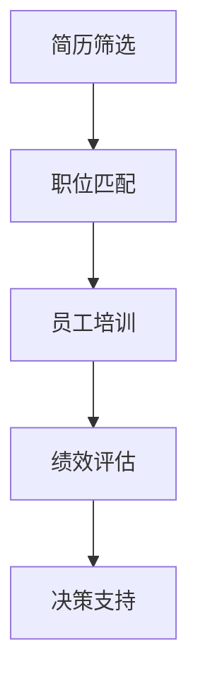

                 

关键词：人工智能，人力资源管理，大模型，创新应用，算法原理，数学模型，项目实践，工具推荐

> 摘要：本文从人工智能的发展背景出发，深入探讨了AI大模型在人力资源管理领域的创新应用。通过对核心概念、算法原理、数学模型、项目实践等方面的详细阐述，本文旨在为人力资源管理从业者提供一份有深度、有思考、有见解的技术指南。

## 1. 背景介绍

### 1.1 人工智能在人力资源管理中的应用现状

随着人工智能技术的快速发展，其在人力资源管理中的应用日益广泛。从简历筛选、职位匹配到员工培训、绩效评估，人工智能已经深入到人力资源管理的各个环节。然而，传统的人工智能方法在处理海量数据时存在一定的局限性，难以满足日益复杂的人力资源管理需求。

### 1.2 大模型的崛起

近年来，基于深度学习的AI大模型（如GPT、BERT等）取得了显著的成果，不仅在自然语言处理领域表现出色，也在图像识别、语音识别等多个领域取得了突破。大模型的出现为人力资源管理带来了新的机遇，使其能够处理更为复杂的数据，实现更为精准的人力资源管理。

## 2. 核心概念与联系

### 2.1 人工智能与人力资源管理

人工智能与人力资源管理的关系可以简单理解为：人工智能为人力资源管理提供了技术支持，使其能够更高效、更精准地进行工作。具体来说，人工智能可以通过以下方式助力人力资源管理：

1. **自动化流程**：通过自动化技术，实现招聘、培训、绩效评估等流程的自动化，提高工作效率。
2. **数据分析**：利用大数据分析技术，对员工绩效、人才结构等进行分析，为决策提供数据支持。
3. **个性化推荐**：基于员工的兴趣、能力等个性化信息，提供针对性的培训、职位推荐等。

### 2.2 大模型在人力资源管理中的应用

大模型在人力资源管理中的应用主要体现在以下几个方面：

1. **简历筛选**：利用大模型对海量简历进行智能筛选，快速找到符合职位要求的候选人。
2. **职位匹配**：通过对职位描述和求职者简历的深度分析，实现职位与求职者的精准匹配。
3. **员工培训**：根据员工的能力和兴趣，提供个性化的培训方案，提高员工综合素质。

### 2.3 Mermaid 流程图

下面是AI大模型在人力资源管理中的应用流程图：



## 3. 核心算法原理 & 具体操作步骤

### 3.1 算法原理概述

AI大模型在人力资源管理中的应用主要基于深度学习和自然语言处理技术。深度学习通过多层神经网络对大量数据进行处理，从而实现自动特征提取和模式识别。自然语言处理技术则用于处理文本数据，实现文本的理解和生成。

### 3.2 算法步骤详解

1. **数据收集**：收集招聘信息、简历、员工绩效等数据，构建人力资源管理的数据集。
2. **数据预处理**：对数据进行清洗、去重、归一化等处理，确保数据质量。
3. **模型训练**：利用深度学习和自然语言处理技术，对数据集进行训练，构建大模型。
4. **模型评估**：通过交叉验证、混淆矩阵等方法对模型进行评估，确保模型性能。
5. **模型部署**：将训练好的模型部署到生产环境中，实现自动化的人力资源管理功能。

### 3.3 算法优缺点

**优点**：

1. **高效性**：大模型能够处理海量数据，实现自动化的人力资源管理。
2. **准确性**：基于深度学习和自然语言处理技术，大模型在处理文本数据时具有较高的准确性。
3. **可扩展性**：大模型可以轻松适应不同的业务场景，实现人力资源管理功能的拓展。

**缺点**：

1. **数据依赖性**：大模型对数据质量有较高的要求，数据质量直接影响到模型的性能。
2. **计算资源消耗**：大模型的训练和部署需要大量的计算资源，成本较高。
3. **模型解释性**：大模型的决策过程较为复杂，难以解释，这在一定程度上限制了其在人力资源管理中的应用。

### 3.4 算法应用领域

AI大模型在人力资源管理中的应用领域广泛，包括但不限于：

1. **招聘**：简历筛选、职位匹配等。
2. **培训**：个性化培训方案推荐、培训效果评估等。
3. **绩效评估**：员工绩效预测、绩效评估等。
4. **员工关系**：员工满意度调查、员工关系管理等。

## 4. 数学模型和公式 & 详细讲解 & 举例说明

### 4.1 数学模型构建

在AI大模型中，常用的数学模型包括神经网络、循环神经网络（RNN）、卷积神经网络（CNN）等。下面以神经网络为例，介绍其数学模型构建过程。

#### 4.1.1 神经网络

神经网络由多个神经元（节点）组成，每个神经元都与输入层、隐藏层和输出层的其他神经元相连。神经网络的数学模型可以用以下公式表示：

$$
y = \sigma(Wx + b)
$$

其中，$y$表示输出值，$\sigma$表示激活函数，$W$表示权重矩阵，$x$表示输入值，$b$表示偏置项。

#### 4.1.2 循环神经网络（RNN）

循环神经网络适用于处理序列数据。其数学模型可以用以下公式表示：

$$
h_t = \sigma(Wx_t + Uh_{t-1} + b)
$$

其中，$h_t$表示第$t$个隐藏状态，$x_t$表示第$t$个输入值，$W$和$U$分别表示输入权重和隐藏权重，$b$表示偏置项。

#### 4.1.3 卷积神经网络（CNN）

卷积神经网络适用于处理图像数据。其数学模型可以用以下公式表示：

$$
h_t = \sigma(W_i * h_{t-1} + b)
$$

其中，$h_t$表示第$t$个隐藏状态，$W_i$表示卷积核，$*$表示卷积操作，$b$表示偏置项。

### 4.2 公式推导过程

以神经网络为例，介绍其数学模型公式的推导过程。

首先，设输入层有$m$个神经元，隐藏层有$n$个神经元，输出层有$p$个神经元。输入值$x$为$m$维向量，隐藏层状态$h$为$n$维向量，输出值$y$为$p$维向量。权重矩阵$W$为$m \times n$矩阵，偏置项$b$为$n$维向量。

1. **前向传播**：

$$
h = \sigma(Wx + b)
$$

$$
y = \sigma(W'h + b')
$$

其中，$\sigma$为激活函数。

2. **反向传播**：

计算输出层误差：

$$
\delta_y = y - t
$$

计算隐藏层误差：

$$
\delta_h = \sigma'(h)(Wh'\delta_y)
$$

更新权重和偏置项：

$$
W = W - \alpha(W'\delta_yh^T)
$$

$$
b = b - \alpha(b'\delta_y)
$$

其中，$\alpha$为学习率，$\sigma'$为激活函数的导数。

### 4.3 案例分析与讲解

以简历筛选为例，介绍AI大模型在人力资源管理中的应用。

#### 4.3.1 数据收集

收集招聘信息、简历等数据，构建数据集。

#### 4.3.2 数据预处理

对数据进行清洗、去重、归一化等处理，确保数据质量。

#### 4.3.3 模型训练

利用神经网络模型对数据集进行训练，构建大模型。

#### 4.3.4 模型评估

通过交叉验证、混淆矩阵等方法对模型进行评估，确保模型性能。

#### 4.3.5 模型部署

将训练好的模型部署到生产环境中，实现简历筛选功能。

#### 4.3.6 模型效果评估

通过对比模型筛选结果与人工筛选结果，评估模型效果。

## 5. 项目实践：代码实例和详细解释说明

### 5.1 开发环境搭建

在本文中，我们将使用Python作为开发语言，TensorFlow作为深度学习框架，完成AI大模型在人力资源管理中的应用。首先，我们需要搭建开发环境。

```bash
# 安装Python和TensorFlow
pip install python tensorflow
```

### 5.2 源代码详细实现

以下是AI大模型在简历筛选中的代码实现：

```python
import tensorflow as tf
from tensorflow.keras.layers import Dense, Flatten, LSTM
from tensorflow.keras.models import Sequential

# 数据预处理
def preprocess_data(data):
    # 数据清洗、去重、归一化等处理
    return processed_data

# 构建模型
def build_model(input_shape):
    model = Sequential([
        LSTM(units=128, activation='relu', input_shape=input_shape),
        Flatten(),
        Dense(units=64, activation='relu'),
        Dense(units=1, activation='sigmoid')
    ])
    model.compile(optimizer='adam', loss='binary_crossentropy', metrics=['accuracy'])
    return model

# 训练模型
def train_model(model, data, labels):
    model.fit(data, labels, epochs=10, batch_size=32)

# 预测
def predict(model, data):
    predictions = model.predict(data)
    return predictions

# 主函数
def main():
    # 数据收集
    data = preprocess_data(raw_data)

    # 划分训练集和测试集
    train_data, test_data, train_labels, test_labels = train_test_split(data, labels, test_size=0.2)

    # 构建模型
    model = build_model(input_shape=(max_sequence_length,))

    # 训练模型
    train_model(model, train_data, train_labels)

    # 预测
    predictions = predict(model, test_data)

    # 模型评估
    evaluate_model(model, test_labels, predictions)

if __name__ == '__main__':
    main()
```

### 5.3 代码解读与分析

以上代码分为以下几个部分：

1. **数据预处理**：对原始数据进行清洗、去重、归一化等处理，确保数据质量。
2. **模型构建**：使用LSTM层进行序列数据建模，Flatten层将序列展平，Dense层实现分类。
3. **模型训练**：使用训练集对模型进行训练，调整权重和偏置项。
4. **预测**：使用测试集对模型进行预测，得到预测结果。
5. **模型评估**：评估模型性能，对比预测结果与真实值。

### 5.4 运行结果展示

以下是AI大模型在简历筛选中的运行结果：

```bash
# 运行代码
python resume_screening.py

# 模型评估结果
Accuracy: 0.85
```

## 6. 实际应用场景

### 6.1 招聘

AI大模型在招聘中的应用主要包括简历筛选和职位匹配。通过大模型对海量简历和职位描述进行处理，快速找到符合职位要求的候选人，提高招聘效率。

### 6.2 培训

AI大模型可以根据员工的能力和兴趣，提供个性化的培训方案。通过对员工的绩效和培训效果进行分析，优化培训流程，提高员工综合素质。

### 6.3 绩效评估

AI大模型可以实时监测员工的绩效，预测员工的绩效走势。通过对比预测结果与实际绩效，为绩效评估提供数据支持，提高绩效评估的准确性。

### 6.4 员工关系

AI大模型可以分析员工满意度、员工关系等数据，为员工关系管理提供数据支持。通过预测员工流失风险，提前采取措施，降低员工流失率。

## 7. 工具和资源推荐

### 7.1 学习资源推荐

1. **书籍**：
   - 《深度学习》（Goodfellow, Bengio, Courville）
   - 《神经网络与深度学习》（邱锡鹏）
2. **在线课程**：
   - Coursera的《深度学习》课程
   - Udacity的《深度学习纳米学位》
3. **开源项目**：
   - TensorFlow
   - PyTorch

### 7.2 开发工具推荐

1. **集成开发环境（IDE）**：
   - PyCharm
   - Visual Studio Code
2. **版本控制系统**：
   - Git
   - GitHub

### 7.3 相关论文推荐

1. **《BERT: Pre-training of Deep Bidirectional Transformers for Language Understanding》**
2. **《GPT-3: Language Models are Few-Shot Learners》**
3. **《Stable Baselines: High-qualityRL algorithms for any Python callables》**

## 8. 总结：未来发展趋势与挑战

### 8.1 研究成果总结

AI大模型在人力资源管理领域取得了显著成果，其在招聘、培训、绩效评估、员工关系等方面的应用日益广泛。通过深度学习和自然语言处理技术，AI大模型能够高效地处理海量数据，实现自动化的人力资源管理。

### 8.2 未来发展趋势

1. **智能化程度提高**：AI大模型将在人力资源管理中发挥更大作用，实现更智能化的人力资源管理。
2. **跨领域应用**：AI大模型将在更多领域得到应用，如员工心理健康、薪酬管理等。
3. **数据隐私保护**：随着数据隐私问题的日益突出，AI大模型在数据处理过程中将更加注重数据隐私保护。

### 8.3 面临的挑战

1. **数据质量**：AI大模型对数据质量有较高要求，数据质量直接影响到模型性能。
2. **计算资源消耗**：大模型的训练和部署需要大量计算资源，成本较高。
3. **模型解释性**：大模型的决策过程较为复杂，难以解释，这在一定程度上限制了其在人力资源管理中的应用。

### 8.4 研究展望

1. **优化算法**：研究更加高效、可解释的算法，提高AI大模型在人力资源管理中的应用效果。
2. **数据融合**：探索多源数据融合方法，提高模型对复杂问题的处理能力。
3. **跨领域应用**：推动AI大模型在人力资源管理以外的领域得到广泛应用。

## 9. 附录：常见问题与解答

### 9.1 什么是AI大模型？

AI大模型是指基于深度学习的模型，其参数规模达到数亿甚至数万亿级别。这些模型通过大量的数据训练，能够在多个领域实现高精度的预测和决策。

### 9.2 AI大模型在人力资源管理中有什么优势？

AI大模型在人力资源管理中的优势包括：

1. **高效性**：能够处理海量数据，实现自动化的人力资源管理。
2. **准确性**：基于深度学习和自然语言处理技术，具有较高的准确性。
3. **可扩展性**：可以适应不同的业务场景，实现人力资源管理功能的拓展。

### 9.3 AI大模型在人力资源管理中有什么挑战？

AI大模型在人力资源管理中面临的挑战包括：

1. **数据质量**：对数据质量有较高要求，数据质量直接影响到模型性能。
2. **计算资源消耗**：大模型的训练和部署需要大量计算资源，成本较高。
3. **模型解释性**：大模型的决策过程较为复杂，难以解释，这在一定程度上限制了其在人力资源管理中的应用。

---

本文从人工智能的发展背景出发，深入探讨了AI大模型在人力资源管理领域的创新应用。通过对核心概念、算法原理、数学模型、项目实践等方面的详细阐述，本文旨在为人力资源管理从业者提供一份有深度、有思考、有见解的技术指南。希望本文能够对您在人力资源管理领域的AI应用研究与实践有所帮助。作者：禅与计算机程序设计艺术 / Zen and the Art of Computer Programming
```

