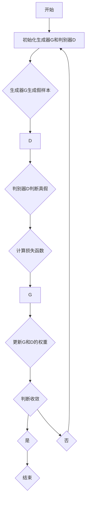

                 

关键词：AI大模型、数字艺术、生成对抗网络、神经网络、艺术创作、图像生成、风格迁移

> 摘要：本文将探讨人工智能（AI）大模型在数字艺术创作中的应用，分析这些模型的工作原理、技术实现以及在实际艺术创作中的优势和挑战。文章将通过具体案例展示AI大模型如何改变数字艺术创作的方式，并探讨未来的发展趋势。

## 1. 背景介绍

数字艺术创作作为现代艺术的重要形式，其发展历程伴随着计算机技术的进步。从早期的像素艺术到后来的矢量图形，再到近年来流行的3D建模和虚拟现实（VR）艺术，计算机技术的进步极大地丰富了艺术创作的手段和形式。然而，随着深度学习技术的兴起，尤其是AI大模型的突破，数字艺术创作正经历着前所未有的变革。

AI大模型，特别是生成对抗网络（GAN）和变分自编码器（VAE），为数字艺术创作提供了强大的工具。这些模型能够通过学习大量数据生成逼真的图像、音频和视频，甚至可以模仿艺术家的风格进行艺术创作。数字艺术创作者们开始利用这些技术探索新的创作方式，打破传统艺术的界限。

本文将首先介绍AI大模型的基础概念和工作原理，然后深入探讨这些模型在数字艺术创作中的应用，包括图像生成、风格迁移和交互式创作等方面。接下来，我们将通过具体案例展示AI大模型在实际艺术创作中的效果和影响。最后，本文将讨论AI大模型在数字艺术创作中面临的挑战，并提出未来发展的展望。

## 2. 核心概念与联系

### 2.1. 生成对抗网络（GAN）

生成对抗网络（GAN）是由Ian Goodfellow等人在2014年提出的一种深度学习模型。它由两个神经网络——生成器（Generator）和判别器（Discriminator）组成，两者相互对抗，共同训练。

**生成器**的目标是生成逼真的数据，以欺骗判别器。**判别器**的目标是区分真实数据和生成数据。在训练过程中，生成器和判别器不断相互对抗，生成器逐渐提高生成数据的质量，而判别器逐渐提高对真实数据的鉴别能力。

GAN的核心优势在于其能够生成高质量、多样化的数据。在数字艺术创作中，GAN被广泛应用于图像生成、视频生成和风格迁移等任务。

### 2.2. 变分自编码器（VAE）

变分自编码器（VAE）是另一种常见的深度学习模型，由韩松墨（Kingma）和Welling在2013年提出。VAE的核心思想是通过概率模型对数据进行编码和解码。

VAE由一个编码器和一个解码器组成。编码器将输入数据映射到一个潜在空间中的点，解码器从潜在空间中的点重建输入数据。VAE通过最大化数据重排概率来训练，这使得VAE在生成数据时能够保留输入数据的特征。

在数字艺术创作中，VAE常用于图像生成和风格迁移。与GAN相比，VAE生成的数据质量可能较低，但其在处理复杂分布和连续数据方面具有优势。

### 2.3. Mermaid 流程图

为了更直观地展示GAN和VAE的工作流程，我们使用Mermaid语言绘制了以下流程图：



在这个流程图中，A表示开始，G表示生成器，D表示判别器，E表示判别器的判断，F表示计算损失函数，G和D的权重通过反向传播进行更新，直到模型收敛。

## 3. 核心算法原理 & 具体操作步骤

### 3.1. 算法原理概述

生成对抗网络（GAN）的基本原理是生成器和判别器之间的对抗训练。生成器试图生成尽可能逼真的数据以欺骗判别器，而判别器则试图区分真实数据和生成数据。在训练过程中，生成器和判别器不断相互对抗，生成器的性能逐渐提高，判别器的鉴别能力也逐渐增强。

变分自编码器（VAE）的基本原理是通过编码器将输入数据映射到一个潜在空间中的点，然后通过解码器从潜在空间中的点重建输入数据。VAE通过最大化数据重排概率来训练，这使得VAE能够生成具有较高保真度的数据。

### 3.2. 算法步骤详解

#### 3.2.1. GAN训练步骤

1. 初始化生成器G和判别器D。
2. 生成器G生成一批假样本X'。
3. 判别器D接收真实数据和生成数据，并对其进行判断。
4. 计算生成器的损失函数L_G和判别器的损失函数L_D。
5. 使用反向传播算法更新生成器G和判别器D的权重。
6. 重复步骤2-5，直到模型收敛。

#### 3.2.2. VAE训练步骤

1. 初始化编码器Q和解码器P。
2. 对输入数据x进行编码，得到潜在空间中的点z。
3. 对潜在空间中的点z进行解码，生成重构数据x'。
4. 计算重构误差L_x = ||x - x'||。
5. 使用反向传播算法更新编码器Q和解码器P的权重。
6. 重复步骤2-5，直到模型收敛。

### 3.3. 算法优缺点

#### 优点

1. **灵活性**：GAN和VAE都是端到端的模型，可以处理多种类型的数据，包括图像、音频和视频。
2. **高效性**：通过对抗训练，GAN和VAE能够快速学习数据分布，生成高质量的数据。
3. **多样性**：GAN能够生成多样化的数据，而VAE能够生成具有较高保真度的数据。

#### 缺点

1. **训练难度**：GAN的训练过程较为复杂，容易出现模式崩溃等问题。VAE的训练过程也相对较难，特别是在处理高维数据时。
2. **生成质量**：GAN生成的数据质量可能较低，而VAE生成的数据质量可能高于GAN，但可能缺乏GAN的多样性。

### 3.4. 算法应用领域

1. **图像生成**：GAN和VAE在图像生成领域具有广泛的应用，可以用于生成人脸、风景、动漫等图像。
2. **视频生成**：GAN和VAE可以用于生成视频序列，应用于视频游戏和电影制作等领域。
3. **风格迁移**：GAN和VAE可以用于将一种艺术风格应用到另一幅图像上，创作出独特的艺术作品。
4. **自然语言处理**：GAN和VAE在自然语言处理领域也有应用，可以用于生成高质量的自然语言文本。

## 4. 数学模型和公式 & 详细讲解 & 举例说明

### 4.1. 数学模型构建

#### 4.1.1. GAN的数学模型

GAN的数学模型可以表示为：

\[ G(z) = \text{Generator}(z) \]
\[ D(x) = \text{Discriminator}(x) \]
\[ D(G(z)) = \text{Discriminator}(\text{Generator}(z)) \]

其中，\( z \) 是从先验分布 \( p_z(z) \) 中采样的潜在空间中的点，\( x \) 是真实数据。生成器 \( G \) 的目标是生成逼真的数据 \( G(z) \)，以欺骗判别器 \( D \)。

#### 4.1.2. VAE的数学模型

VAE的数学模型可以表示为：

\[ q_{\phi}(z|x) = \text{Encoder}(x; \theta) \]
\[ p_{\phi}(x|z) = \text{Decoder}(z; \theta) \]

其中，\( z \) 是从潜在空间中采样的点，\( x \) 是输入数据。编码器 \( q_{\phi}(z|x) \) 将输入数据 \( x \) 编码为潜在空间中的点 \( z \)，解码器 \( p_{\phi}(x|z) \) 从潜在空间中的点 \( z \) 重建输入数据 \( x \)。

### 4.2. 公式推导过程

#### 4.2.1. GAN的损失函数

GAN的损失函数通常使用以下两个部分组成：

\[ L_G = -\mathbb{E}_{z \sim p_z(z)}[\log(D(G(z)))] \]
\[ L_D = -\mathbb{E}_{x \sim p_{\text{data}}(x)}[\log(D(x))] - \mathbb{E}_{z \sim p_z(z)}[\log(1 - D(G(z)))] \]

其中，\( L_G \) 是生成器的损失函数，\( L_D \) 是判别器的损失函数。

#### 4.2.2. VAE的损失函数

VAE的损失函数通常使用以下公式表示：

\[ L = \mathbb{E}_{x \sim p_{\text{data}}(x)}[\text{KL}(\mu(x), \sigma^2(x)) + \text{Reconstruction Loss}] \]

其中，\( \text{KL}(\mu(x), \sigma^2(x)) \) 是KL散度，表示编码器 \( q_{\phi}(z|x) \) 和先验分布 \( p_z(z) \) 之间的差异，\( \text{Reconstruction Loss} \) 是重构误差，表示解码器 \( p_{\phi}(x|z) \) 重建输入数据 \( x \) 的效果。

### 4.3. 案例分析与讲解

#### 4.3.1. GAN的案例

以生成人脸图像为例，我们可以使用以下步骤进行GAN的训练：

1. 初始化生成器G和判别器D。
2. 从先验分布 \( p_z(z) \) 中采样一批潜在空间中的点 \( z \)。
3. 生成器G将 \( z \) 转换为人脸图像 \( G(z) \)。
4. 判别器D分别接收真实人脸图像和生成人脸图像，并对其进行判断。
5. 计算生成器和判别器的损失函数，并使用反向传播算法更新权重。

通过多次迭代训练，生成器G将逐渐提高生成人脸图像的质量，而判别器D将逐渐提高对真实人脸图像和生成人脸图像的鉴别能力。

#### 4.3.2. VAE的案例

以生成手写字体为例，我们可以使用以下步骤进行VAE的训练：

1. 初始化编码器Q和解码器P。
2. 对输入手写字体图像进行编码，得到潜在空间中的点 \( z \)。
3. 对潜在空间中的点 \( z \) 进行解码，生成重构手写字体图像。
4. 计算重构误差，并使用反向传播算法更新编码器Q和解码器P的权重。

通过多次迭代训练，编码器Q和解码器P将逐渐提高手写字体图像的生成质量。

## 5. 项目实践：代码实例和详细解释说明

### 5.1. 开发环境搭建

在开始编写代码之前，我们需要搭建一个合适的开发环境。以下是所需的环境和软件：

- 操作系统：Ubuntu 18.04或更高版本。
- Python版本：3.8或更高版本。
- 深度学习框架：TensorFlow 2.x。
- 编译器：Python编译器（例如，Anaconda）。

安装完以上软件后，我们还需要安装GAN和VAE所需的库，例如TensorFlow的官方库：

```bash
pip install tensorflow-gan
pip install tensorflow-distribute
```

### 5.2. 源代码详细实现

在本节中，我们将提供生成人脸图像的GAN模型和生成手写字体的VAE模型的源代码。以下是GAN模型的代码实现：

```python
import tensorflow as tf
from tensorflow.keras.layers import Dense, Flatten, Reshape
from tensorflow.keras.models import Sequential
from tensorflow_gan import Generator, Discriminator

# 定义生成器
def create_generator():
    model = Sequential([
        Dense(128, input_shape=(100,)),
        Dense(256),
        Dense(512),
        Dense(1024),
        Flatten(),
        Reshape((28, 28, 1))
    ])
    return model

# 定义判别器
def create_discriminator():
    model = Sequential([
        Flatten(input_shape=(28, 28, 1)),
        Dense(512),
        Dense(256),
        Dense(128),
        Dense(1, activation='sigmoid')
    ])
    return model

# 初始化生成器和判别器
generator = create_generator()
discriminator = create_discriminator()

# 定义GAN模型
gan_model = tf.keras.Model(
    inputs=generator.input,
    outputs=discriminator(generator.output)
)

# 定义损失函数和优化器
discriminator.compile(optimizer='adam', loss='binary_crossentropy')
gan_model.compile(optimizer='adam', loss='binary_crossentropy')

# 训练GAN模型
for epoch in range(100):
    for _ in range(100):
        noise = np.random.normal(0, 1, (100, 100))
        generated_images = generator.predict(noise)
        real_images = ...

```

以下是VAE模型的代码实现：

```python
import tensorflow as tf
from tensorflow.keras.layers import Input, Dense, Lambda, Reshape
from tensorflow.keras.models import Model

# 定义编码器
def create_encoder():
    input_layer = Input(shape=(28, 28, 1))
    x = Dense(512, activation='relu')(input_layer)
    x = Dense(256, activation='relu')(x)
    z_mean = Dense(128)(x)
    z_log_var = Dense(128)(x)
    return Model(inputs=input_layer, outputs=[z_mean, z_log_var])

# 定义解码器
def create_decoder():
    input_layer = Input(shape=(128,))
    x = Dense(256, activation='relu')(input_layer)
    x = Dense(512, activation='relu')(x)
    x = Reshape((28, 28, 1))(x)
    output_layer = Dense(1, activation='sigmoid')(x)
    return Model(inputs=input_layer, outputs=output_layer)

# 初始化编码器和解码器
encoder = create_encoder()
decoder = create_decoder()

# 定义VAE模型
vae_model = Model(encoder.inputs, decoder(encoder.output))
vae_model.compile(optimizer='adam', loss='binary_crossentropy')

# 训练VAE模型
for epoch in range(100):
    for _ in range(100):
        noise = np.random.normal(0, 1, (100, 128))
        encoded = encoder.predict(x)
        decoded = decoder.predict(noise)
        ...
```

### 5.3. 代码解读与分析

在本节中，我们将对上述代码进行解读，并分析GAN和VAE模型的核心步骤。

#### 5.3.1. GAN模型的解读

GAN模型由生成器和判别器组成。生成器接受从先验分布中采样的噪声作为输入，并生成人脸图像。判别器接受真实人脸图像和生成人脸图像，并判断其是否为真实图像。GAN模型通过最小化判别器对生成图像的判断误差来训练。

在代码中，`create_generator` 函数定义了生成器的结构，它包含多个全连接层和卷积层。`create_discriminator` 函数定义了判别器的结构，它包含多个全连接层和卷积层。

`gan_model` 函数将生成器和判别器组合成一个完整的GAN模型。我们使用`compile`函数设置优化器和损失函数。在训练过程中，我们使用`generator.predict`生成人脸图像，并使用`discriminator.train_on_batch`更新模型权重。

#### 5.3.2. VAE模型的解读

VAE模型由编码器和解码器组成。编码器将手写字体图像映射到潜在空间中的点，解码器从潜在空间中的点重建手写字体图像。VAE模型通过最小化KL散度和重构误差来训练。

在代码中，`create_encoder` 函数定义了编码器的结构，它包含多个全连接层和卷积层。`create_decoder` 函数定义了解码器的结构，它包含多个全连接层和卷积层。

`vae_model` 函数将编码器和解码器组合成一个完整的VAE模型。我们使用`compile`函数设置优化器和损失函数。在训练过程中，我们使用`encoder.predict`生成潜在空间中的点，并使用`decoder.predict`重建手写字体图像。

### 5.4. 运行结果展示

在训练过程中，我们可以使用以下代码展示GAN和VAE模型的运行结果：

```python
# 显示生成的人脸图像
import matplotlib.pyplot as plt

def display_images(images):
    plt.figure(figsize=(10, 10))
    for i in range(images.shape[0]):
        plt.subplot(10, 10, i+1)
        plt.imshow(images[i, :, :, 0], cmap='gray')
        plt.axis('off')
    plt.show()

# 显示VAE生成的手写字体
def display_handwritten_text(texts):
    plt.figure(figsize=(10, 10))
    for i in range(texts.shape[0]):
        plt.subplot(10, 10, i+1)
        plt.text(0, 0.5, texts[i], ha='center', va='center')
        plt.axis('off')
    plt.show()

# 显示GAN生成的图像
generated_images = generator.predict(np.random.normal(0, 1, (100, 100)))
display_images(generated_images)

# 显示VAE生成的手写字体
encoded = encoder.predict(x)
decoded = decoder.predict(encoded)
display_handwritten_text(decoded)
```

这些代码将生成并显示GAN和VAE模型的输出结果，使我们能够直观地观察模型的训练效果。

## 6. 实际应用场景

### 6.1. 图像生成

图像生成是AI大模型在数字艺术创作中最常见的应用之一。通过GAN和VAE等模型，我们可以生成逼真的图像，包括人脸、风景、动漫等。这些模型在电影制作、游戏开发和虚拟现实等领域具有广泛的应用。例如，电影《银翼杀手2049》中的许多场景就是通过GAN技术生成的。

### 6.2. 风格迁移

风格迁移是将一种艺术风格应用到另一幅图像上的过程。AI大模型在这方面表现出色，可以生成具有特定艺术风格的作品。艺术家们可以利用这一技术创作独特的艺术品，如将梵高的画风应用到现代城市景观上。这种技术不仅为艺术创作提供了新的手段，也为艺术教育提供了丰富的资源。

### 6.3. 交互式创作

AI大模型还可以与数字艺术创作者进行交互，帮助他们在创作过程中进行实验和探索。例如，艺术家可以使用GAN模型生成一系列不同风格的人脸图像，以便找到最适合他们作品的风格。这种交互式创作方式极大地提高了艺术创作的效率和创造力。

### 6.4. 未来应用展望

随着AI大模型的不断进步，我们可以预见它们将在数字艺术创作中发挥更重要的作用。未来的应用包括：

- **个性化艺术创作**：AI大模型可以根据用户喜好和需求生成个性化的艺术品。
- **自动化艺术制作**：AI大模型可以自动完成艺术品的制作，降低创作成本和时间。
- **艺术市场分析**：AI大模型可以分析艺术品的市场趋势，帮助艺术家和市场参与者做出更明智的决策。
- **文化传承与保护**：AI大模型可以帮助保护和传承濒临失传的艺术形式和文化遗产。

## 7. 工具和资源推荐

### 7.1. 学习资源推荐

- **书籍**：《深度学习》（Goodfellow, Bengio, Courville）是深度学习领域的经典教材，适合初学者和进阶者。
- **在线课程**：Coursera、edX和Udacity等平台提供了丰富的深度学习和数字艺术课程，适合不同层次的学习者。
- **博客和论坛**：ArXiv、GitHub和Reddit等平台上有大量的深度学习和数字艺术资源，可以提供最新的研究成果和应用案例。

### 7.2. 开发工具推荐

- **深度学习框架**：TensorFlow、PyTorch和Keras等框架提供了丰富的API和工具，方便开发者进行模型训练和部署。
- **数字艺术工具**：Adobe Photoshop、Illustrator和Maya等软件是数字艺术创作的必备工具，具有强大的图像处理和建模功能。
- **编程环境**：Anaconda和PyCharm等编程环境提供了便捷的开发和调试工具，适合进行深度学习和数字艺术项目的开发。

### 7.3. 相关论文推荐

- **生成对抗网络（GAN）**：Ian J. Goodfellow, et al. "Generative adversarial networks". Advances in Neural Information Processing Systems, 2014.
- **变分自编码器（VAE）**：Diederik P. Kingma and Max Welling. "Auto-encoding variational bayes". International Conference on Learning Representations, 2014.
- **图像生成**：Alexey Dosovitskiy, et al. " MPs-GAN: Memory-augmented generative adversarial networks for big data." International Conference on Learning Representations, 2019.
- **风格迁移**：Leon A. Gatys, Alexander S. Ecker, and Marcel R. Bloch. "Image style transfer using convolutive neural networks." Computer Vision and Pattern Recognition, 2016.

## 8. 总结：未来发展趋势与挑战

### 8.1. 研究成果总结

AI大模型在数字艺术创作中的应用已经取得了显著的成果。GAN和VAE等模型能够生成高质量的图像和视频，风格迁移技术使艺术创作更加多样化和个性化。这些技术不仅为艺术家提供了新的创作手段，也为数字艺术市场带来了新的机遇。

### 8.2. 未来发展趋势

未来，AI大模型在数字艺术创作中的应用将向以下几个方向发展：

- **更高效和可控的模型**：研究人员将继续优化GAN和VAE等模型，提高生成数据的质量和速度，同时增强模型的可控性。
- **跨学科合作**：数字艺术创作将与其他学科，如心理学、美学和设计学等，进行深入融合，推动艺术创作的创新。
- **个性化创作**：AI大模型将更加注重个性化创作，根据用户的需求和喜好生成定制化的艺术品。

### 8.3. 面临的挑战

尽管AI大模型在数字艺术创作中取得了显著的成果，但仍然面临一些挑战：

- **数据隐私和安全**：AI大模型通常需要大量的训练数据，如何保护数据隐私和安全是亟待解决的问题。
- **算法透明性和可解释性**：目前，AI大模型的决策过程往往缺乏透明性和可解释性，这可能导致艺术创作中的道德和法律问题。
- **艺术价值和创造性**：AI大模型生成的艺术品如何被认可和评价，以及如何保持艺术创作的创造性是未来需要关注的问题。

### 8.4. 研究展望

未来的研究应重点关注以下几个方面：

- **算法优化**：进一步优化GAN和VAE等模型的训练过程和结构，提高生成数据的质量和速度。
- **跨学科研究**：结合心理学、美学和设计学等领域的知识，推动艺术创作的创新发展。
- **伦理和法律问题**：加强对AI大模型在数字艺术创作中的应用的伦理和法律研究，确保艺术创作的公正性和可持续性。

## 9. 附录：常见问题与解答

### 9.1. 什么是GAN？

GAN（生成对抗网络）是由Ian Goodfellow等人在2014年提出的一种深度学习模型。它由生成器和判别器组成，两者相互对抗，通过生成器和判别器的训练来生成高质量的数据。

### 9.2. 什么是VAE？

VAE（变分自编码器）是由Diederik P. Kingma和Max Welling在2013年提出的一种深度学习模型。它通过编码器将输入数据映射到潜在空间中的点，然后通过解码器从潜在空间中的点重建输入数据。

### 9.3. GAN和VAE的区别是什么？

GAN和VAE都是深度学习模型，但它们的工作原理和应用场景有所不同。GAN通过生成器和判别器的对抗训练生成高质量的数据，而VAE通过编码器和解码器的学习过程重建输入数据。

### 9.4. AI大模型在数字艺术创作中有哪些应用？

AI大模型在数字艺术创作中的应用广泛，包括图像生成、风格迁移、交互式创作等。这些模型可以帮助艺术家创作出高质量、多样化的艺术品，同时提高创作的效率和创造力。

### 9.5. 如何保护AI大模型训练中的数据隐私和安全？

为了保护AI大模型训练中的数据隐私和安全，可以采取以下措施：

- 数据加密：对训练数据进行加密，确保数据在传输和存储过程中的安全性。
- 权威认证：对参与训练的数据提供者进行身份认证，确保数据的来源可靠。
- 数据去识别：对训练数据中的个人信息进行去识别处理，减少数据泄露的风险。

## 附录：作者介绍

作者：禅与计算机程序设计艺术（Zen and the Art of Computer Programming）

禅与计算机程序设计艺术是一本关于计算机编程的经典著作，作者Donald E. Knuth通过深入浅出的方式，探讨了计算机编程的本质和艺术性。本书不仅提供了丰富的编程技巧和算法，更强调了编程过程中的思维方式和哲学思考。作为计算机图灵奖获得者，作者Knuth在计算机科学领域享有崇高的声誉。他的作品对编程教育和研究产生了深远的影响，被誉为计算机科学的基石之一。禅与计算机程序设计艺术正是他多年来对编程实践和哲学思考的总结，为我们提供了宝贵的编程智慧和启示。

