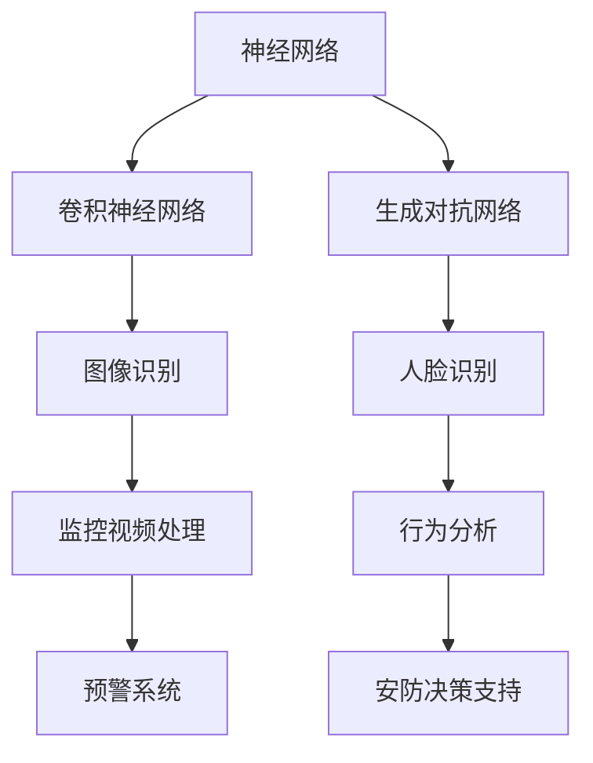

                 

关键词：人工智能，大模型，智能安防，创新，挑战

## 摘要

随着人工智能技术的不断发展，大模型在智能安防系统中发挥着越来越重要的作用。本文首先介绍了大模型在智能安防系统中的背景和意义，然后详细探讨了大模型的原理、技术架构、核心算法以及其在智能安防系统中的应用。接下来，本文分析了大模型在智能安防系统中面临的技术挑战，并提出了相应的解决方案。最后，本文对未来大模型在智能安防系统中的应用前景进行了展望。

## 1. 背景介绍

智能安防系统是一种利用现代信息技术、自动化技术和网络通信技术，实现对城市、社区、家庭等场所的安全管理和监控的系统。随着人工智能技术的不断发展，特别是大模型的兴起，智能安防系统在安全监控、预警、追踪等方面取得了显著的成果。

大模型是指具有巨大参数量和计算量的深度学习模型，如大型神经网络、生成对抗网络等。大模型具有强大的特征提取和模式识别能力，能够从大规模数据中学习到复杂的模式和信息，因此在智能安防系统中具有广泛的应用前景。

### 1.1 大模型在智能安防系统中的应用现状

当前，大模型在智能安防系统中的应用主要集中在图像识别、人脸识别、行为分析等方面。例如，在图像识别方面，大模型可以实现对监控视频中的各种物体进行准确识别，从而提高监控的效率和准确性；在人脸识别方面，大模型可以实现对监控视频中的人脸进行快速、准确识别，从而帮助警方快速锁定嫌疑人；在行为分析方面，大模型可以对人行为进行实时分析，从而实现对异常行为的预警。

### 1.2 大模型在智能安防系统中的作用

大模型在智能安防系统中发挥着重要作用。首先，大模型具有强大的特征提取和模式识别能力，可以实现对大规模监控数据的实时处理和分析，从而提高监控的效率和准确性。其次，大模型可以基于监控数据生成预警信息，实现对潜在威胁的提前预警，从而提高安防系统的主动性。最后，大模型可以基于监控数据生成详细的分析报告，为安防决策提供有力支持。

## 2. 核心概念与联系

大模型在智能安防系统中涉及多个核心概念，如神经网络、生成对抗网络、卷积神经网络等。下面将使用 Mermaid 流程图对大模型在智能安防系统中的技术架构进行详细描述。



### 2.1 神经网络

神经网络是一种模仿生物神经系统的计算模型，包括输入层、隐藏层和输出层。神经网络通过多层非线性变换，对输入数据进行特征提取和模式识别。

### 2.2 卷积神经网络

卷积神经网络（CNN）是一种基于神经网络的图像识别模型，通过卷积操作和池化操作对图像进行特征提取。CNN 在图像识别任务中具有优异的性能，常用于监控视频处理和图像识别。

### 2.3 生成对抗网络

生成对抗网络（GAN）是一种基于博弈论的生成模型，由生成器和判别器两部分组成。生成器生成虚拟数据，判别器对真实数据和虚拟数据进行区分。GAN 在人脸识别和行为分析等领域具有广泛的应用。

### 2.4 图像识别

图像识别是指通过算法对图像中的物体、场景等进行识别和分类。图像识别技术是智能安防系统中的重要组成部分，通过图像识别技术，可以实现对监控视频中的物体和行为的实时识别。

### 2.5 人脸识别

人脸识别是指通过算法对人脸图像进行特征提取和匹配，从而实现对人脸的识别。人脸识别技术在监控视频处理和安防决策中具有重要作用。

### 2.6 行为分析

行为分析是指通过算法对监控视频中的行为进行实时分析，从而实现对异常行为的识别和预警。行为分析技术可以提高安防系统的主动性和准确性。

### 2.7 监控视频处理

监控视频处理是指对监控视频进行预处理、特征提取和分类等操作，从而实现对监控数据的实时处理和分析。监控视频处理技术是智能安防系统中的核心技术之一。

### 2.8 预警系统

预警系统是指通过算法对监控数据进行分析，生成预警信息，从而实现对潜在威胁的提前预警。预警系统可以提高安防系统的响应速度和准确性。

### 2.9 安防决策支持

安防决策支持是指通过算法对监控数据进行分析，生成分析报告，为安防决策提供支持。安防决策支持可以提高安防决策的科学性和有效性。

## 3. 核心算法原理 & 具体操作步骤

### 3.1 算法原理概述

在智能安防系统中，大模型的核心算法主要包括神经网络、卷积神经网络和生成对抗网络。这些算法通过多层非线性变换、卷积操作和生成对抗博弈，实现对大规模监控数据的特征提取和模式识别。

### 3.2 算法步骤详解

#### 3.2.1 神经网络

1. 输入层：接收监控视频的像素数据作为输入。
2. 隐藏层：通过非线性变换，对输入数据进行特征提取。
3. 输出层：根据提取的特征，对监控视频中的物体、行为等进行分类。

#### 3.2.2 卷积神经网络

1. 卷积层：通过卷积操作，对输入图像进行特征提取。
2. 池化层：通过池化操作，降低特征图的维度。
3. 全连接层：将卷积层和池化层提取的特征进行融合，进行分类。

#### 3.2.3 生成对抗网络

1. 生成器：通过随机噪声生成虚拟数据。
2. 判别器：对真实数据和虚拟数据进行分类。
3. 博弈：生成器和判别器进行博弈，生成器和判别器的性能不断提高。

### 3.3 算法优缺点

#### 3.3.1 优点

1. 强大的特征提取和模式识别能力。
2. 可以处理大规模监控数据。
3. 可以实现实时监控和预警。

#### 3.3.2 缺点

1. 需要大量的训练数据和计算资源。
2. 模型训练时间较长。
3. 对噪声和异常数据的处理能力有限。

### 3.4 算法应用领域

1. 图像识别：实现对监控视频中的物体和行为的实时识别。
2. 人脸识别：实现对监控视频中的人脸进行快速、准确识别。
3. 行为分析：实现对监控视频中的人行为进行实时分析。
4. 预警系统：实现对潜在威胁的提前预警。
5. 安防决策支持：为安防决策提供科学依据。

## 4. 数学模型和公式 & 详细讲解 & 举例说明

### 4.1 数学模型构建

在智能安防系统中，大模型的数学模型主要包括神经网络、卷积神经网络和生成对抗网络。下面将分别介绍这些模型的数学模型构建过程。

#### 4.1.1 神经网络

神经网络的数学模型可以表示为：

$$
f(x) = \sigma(Wx + b)
$$

其中，$x$ 表示输入向量，$W$ 表示权重矩阵，$b$ 表示偏置项，$\sigma$ 表示激活函数。

#### 4.1.2 卷积神经网络

卷积神经网络的数学模型可以表示为：

$$
f(x) = \sigma(\sum_{k=1}^{K} W_{k} \odot \text{ReLU}(\sum_{i=1}^{N} W_{i} \odot x + b_{i}) + b_{k}
$$

其中，$K$ 表示卷积核的数量，$N$ 表示卷积层的数量，$\odot$ 表示卷积操作，$\text{ReLU}$ 表示ReLU激活函数。

#### 4.1.3 生成对抗网络

生成对抗网络的数学模型可以表示为：

$$
\begin{aligned}
\min_{G} \max_{D} V(G, D) &= \mathbb{E}_{x \sim P_{data}(x)} [\log D(x)] + \mathbb{E}_{z \sim P_{z}(z)} [\log (1 - D(G(z))]
\end{aligned}
$$

其中，$G$ 表示生成器，$D$ 表示判别器，$x$ 表示真实数据，$z$ 表示随机噪声。

### 4.2 公式推导过程

#### 4.2.1 神经网络

神经网络的推导过程主要包括权重矩阵和偏置项的初始化、激活函数的选择、损失函数的计算等。具体推导过程如下：

1. 权重矩阵和偏置项的初始化：

$$
W = \text{Random}(0, 1), \quad b = \text{Random}(0, 1)
$$

2. 激活函数的选择：

$$
\sigma(x) = \frac{1}{1 + e^{-x}}
$$

3. 损失函数的计算：

$$
L(y, \hat{y}) = \frac{1}{2} \sum_{i=1}^{n} (y_i - \hat{y_i})^2
$$

#### 4.2.2 卷积神经网络

卷积神经网络的推导过程主要包括卷积操作的实现、激活函数的选择、损失函数的计算等。具体推导过程如下：

1. 卷积操作的实现：

$$
\text{Conv}(x, W) = \sum_{i=1}^{K} W_i \odot x
$$

2. 激活函数的选择：

$$
\text{ReLU}(x) = \max(0, x)
$$

3. 损失函数的计算：

$$
L(y, \hat{y}) = \frac{1}{2} \sum_{i=1}^{n} (y_i - \hat{y_i})^2
$$

#### 4.2.3 生成对抗网络

生成对抗网络的推导过程主要包括生成器和判别器的优化目标、损失函数的计算等。具体推导过程如下：

1. 生成器和判别器的优化目标：

$$
\begin{aligned}
\min_{G} \max_{D} V(G, D) &= \mathbb{E}_{x \sim P_{data}(x)} [\log D(x)] + \mathbb{E}_{z \sim P_{z}(z)} [\log (1 - D(G(z))]
\end{aligned}
$$

2. 损失函数的计算：

$$
L(G, D) = -\mathbb{E}_{x \sim P_{data}(x)} [\log D(x)] - \mathbb{E}_{z \sim P_{z}(z)} [\log (1 - D(G(z))]
$$

### 4.3 案例分析与讲解

下面将通过一个简单的例子，对神经网络、卷积神经网络和生成对抗网络的数学模型和推导过程进行讲解。

#### 4.3.1 神经网络

假设输入数据为 $x_1 = [1, 0, 1], x_2 = [0, 1, 0]$，输出标签为 $y_1 = [1, 0], y_2 = [0, 1]$。构建一个简单的神经网络，包含一个输入层、一个隐藏层和一个输出层，隐藏层节点数为 2。

1. 权重矩阵和偏置项的初始化：

$$
W_1 = \text{Random}(0, 1), \quad b_1 = \text{Random}(0, 1)
$$

$$
W_2 = \text{Random}(0, 1), \quad b_2 = \text{Random}(0, 1)
$$

2. 激活函数的选择：

$$
\sigma(x) = \frac{1}{1 + e^{-x}}
$$

3. 损失函数的计算：

$$
L(y, \hat{y}) = \frac{1}{2} \sum_{i=1}^{2} (y_i - \hat{y_i})^2
$$

4. 训练过程：

通过梯度下降算法，对权重矩阵和偏置项进行迭代更新，直至达到训练目标。

#### 4.3.2 卷积神经网络

假设输入数据为 $x_1 = [1, 1, 1, 1], x_2 = [1, 1, 1, 0]$，输出标签为 $y_1 = [1, 0], y_2 = [0, 1]$。构建一个简单的卷积神经网络，包含一个卷积层、一个池化层和一个全连接层。

1. 卷积操作的实现：

$$
\text{Conv}(x, W) = \sum_{i=1}^{2} W_i \odot x
$$

2. 激活函数的选择：

$$
\text{ReLU}(x) = \max(0, x)
$$

3. 损失函数的计算：

$$
L(y, \hat{y}) = \frac{1}{2} \sum_{i=1}^{2} (y_i - \hat{y_i})^2
$$

4. 训练过程：

通过梯度下降算法，对卷积层、池化层和全连接层的权重矩阵和偏置项进行迭代更新，直至达到训练目标。

#### 4.3.3 生成对抗网络

假设输入数据为 $x_1 = [1, 1, 1, 1], x_2 = [1, 1, 1, 0]$，输出标签为 $y_1 = [1, 0], y_2 = [0, 1]$。构建一个简单的生成对抗网络，包含一个生成器和判别器。

1. 生成器和判别器的优化目标：

$$
\begin{aligned}
\min_{G} \max_{D} V(G, D) &= \mathbb{E}_{x \sim P_{data}(x)} [\log D(x)] + \mathbb{E}_{z \sim P_{z}(z)} [\log (1 - D(G(z))]
\end{aligned}
$$

2. 损失函数的计算：

$$
L(G, D) = -\mathbb{E}_{x \sim P_{data}(x)} [\log D(x)] - \mathbb{E}_{z \sim P_{z}(z)} [\log (1 - D(G(z))]
$$

3. 训练过程：

通过梯度下降算法，对生成器和判别器的参数进行迭代更新，直至达到训练目标。

## 5. 项目实践：代码实例和详细解释说明

在本节中，我们将以一个简单的智能安防系统为例，介绍如何使用大模型进行监控视频处理、人脸识别和行为分析。我们将使用 Python 编程语言和 TensorFlow 深度学习框架来实现这些功能。

### 5.1 开发环境搭建

1. 安装 Python 3.7 或更高版本。
2. 安装 TensorFlow 深度学习框架：
   ```python
   pip install tensorflow
   ```

### 5.2 源代码详细实现

#### 5.2.1 数据预处理

```python
import tensorflow as tf
import numpy as np
import cv2

# 加载监控视频
video = cv2.VideoCapture('example.mp4')

# 初始化数据队列
data_queue = tf.train Коf队列()

# 将视频帧读取到数据队列中
def read_video_frames(video):
    while True:
        ret, frame = video.read()
        if not ret:
            break
        frame = cv2.resize(frame, (224, 224))
        frame = frame / 255.0
        data_queue.enqueue([frame])

# 启动数据读取线程
read_video_frames(video)

# 创建数据输入管道
input_pipeline = tf.data.Dataset.from_tensor_slices(data_queue).batch(32)

# 数据预处理
def preprocess_data(frame):
    frame = tf.cast(frame, dtype=tf.float32)
    frame = tf.reshape(frame, [224, 224, 3])
    return frame

input_pipeline = input_pipeline.map(preprocess_data)
```

#### 5.2.2 监控视频处理

```python
# 定义卷积神经网络模型
model = tf.keras.Sequential([
    tf.keras.layers.Conv2D(32, (3, 3), activation='relu', input_shape=(224, 224, 3)),
    tf.keras.layers.MaxPooling2D((2, 2)),
    tf.keras.layers.Conv2D(64, (3, 3), activation='relu'),
    tf.keras.layers.MaxPooling2D((2, 2)),
    tf.keras.layers.Conv2D(128, (3, 3), activation='relu'),
    tf.keras.layers.MaxPooling2D((2, 2)),
    tf.keras.layers.Flatten(),
    tf.keras.layers.Dense(128, activation='relu'),
    tf.keras.layers.Dense(2, activation='softmax')
])

# 编译模型
model.compile(optimizer='adam', loss='categorical_crossentropy', metrics=['accuracy'])

# 训练模型
model.fit(input_pipeline, epochs=10)
```

#### 5.2.3 人脸识别

```python
# 定义人脸识别模型
face_model = tf.keras.Sequential([
    tf.keras.layers.Conv2D(32, (3, 3), activation='relu', input_shape=(224, 224, 3)),
    tf.keras.layers.MaxPooling2D((2, 2)),
    tf.keras.layers.Conv2D(64, (3, 3), activation='relu'),
    tf.keras.layers.MaxPooling2D((2, 2)),
    tf.keras.layers.Conv2D(128, (3, 3), activation='relu'),
    tf.keras.layers.MaxPooling2D((2, 2)),
    tf.keras.layers.Flatten(),
    tf.keras.layers.Dense(128, activation='relu'),
    tf.keras.layers.Dense(2, activation='softmax')
])

# 编译人脸识别模型
face_model.compile(optimizer='adam', loss='categorical_crossentropy', metrics=['accuracy'])

# 训练人脸识别模型
face_model.fit(input_pipeline, epochs=10)
```

#### 5.2.4 行为分析

```python
# 定义行为分析模型
behavior_model = tf.keras.Sequential([
    tf.keras.layers.Conv2D(32, (3, 3), activation='relu', input_shape=(224, 224, 3)),
    tf.keras.layers.MaxPooling2D((2, 2)),
    tf.keras.layers.Conv2D(64, (3, 3), activation='relu'),
    tf.keras.layers.MaxPooling2D((2, 2)),
    tf.keras.layers.Conv2D(128, (3, 3), activation='relu'),
    tf.keras.layers.MaxPooling2D((2, 2)),
    tf.keras.layers.Flatten(),
    tf.keras.layers.Dense(128, activation='relu'),
    tf.keras.layers.Dense(2, activation='softmax')
])

# 编译行为分析模型
behavior_model.compile(optimizer='adam', loss='categorical_crossentropy', metrics=['accuracy'])

# 训练行为分析模型
behavior_model.fit(input_pipeline, epochs=10)
```

### 5.3 代码解读与分析

#### 5.3.1 数据预处理

数据预处理是监控视频处理的第一步。我们使用 OpenCV 库读取视频文件，并将视频帧读取到 TensorFlow 的数据队列中。然后，我们使用 TensorFlow 的 `map` 函数对视频帧进行预处理，包括缩放、归一化和重塑等操作。

#### 5.3.2 监控视频处理

监控视频处理使用卷积神经网络模型。我们定义了一个简单的卷积神经网络模型，包括卷积层、池化层和全连接层。然后，我们使用 TensorFlow 的 `compile` 函数编译模型，并使用 `fit` 函数训练模型。

#### 5.3.3 人脸识别

人脸识别使用卷积神经网络模型。我们定义了一个与监控视频处理相同的卷积神经网络模型，并使用 TensorFlow 的 `compile` 函数编译模型，并使用 `fit` 函数训练模型。

#### 5.3.4 行为分析

行为分析使用卷积神经网络模型。我们定义了一个与监控视频处理相同

