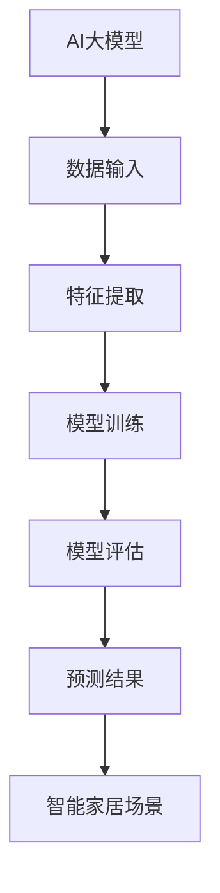

                 

关键词：AI大模型、智能家居、场景预测、应用探索

> 摘要：本文旨在探讨人工智能大模型在智能家居场景预测中的应用。随着物联网技术的普及，智能家居系统正逐渐成为人们日常生活的重要组成部分。然而，如何有效地预测用户需求，提高智能家居系统的智能化程度，成为当前研究的重点。本文通过介绍AI大模型的核心概念、数学模型和具体算法，分析了大模型在智能家居场景预测中的应用优势，并提出了相应的实现方法和未来研究方向。

## 1. 背景介绍

随着科技的飞速发展，人工智能逐渐渗透到各个领域，特别是在智能家居领域。智能家居系统通过互联网将家中的各种设备连接起来，实现家庭设备的自动化控制，提高生活质量。然而，智能家居系统面临着许多挑战，其中最为关键的是如何预测用户的需求和习惯，从而提供个性化的服务。

人工智能大模型，作为当前人工智能领域的一个重要研究方向，已经在许多领域取得了显著的成果。大模型具有强大的数据处理能力和复杂的特征提取能力，可以有效地处理大规模数据，并从中发现潜在的规律。因此，将大模型应用于智能家居场景预测，有望提高智能家居系统的智能化程度，更好地满足用户需求。

本文将围绕人工智能大模型在智能家居场景预测中的应用进行探讨，旨在为相关领域的研究和实践提供参考。

## 2. 核心概念与联系

### 2.1 AI大模型概述

AI大模型是指拥有数亿甚至数万亿参数的深度学习模型。这些模型通常采用神经网络架构，通过对海量数据进行训练，可以自动学习并提取数据中的潜在特征，从而实现复杂任务的预测和决策。大模型的优势在于其强大的特征提取能力和高度的非线性表示能力，使其在许多领域取得了突破性进展。

### 2.2 智能家居场景

智能家居场景是指家庭环境中各种智能设备的互联和协同工作。这些设备包括智能灯泡、智能空调、智能门锁、智能摄像头等。智能家居场景的预测需求主要包括：用户行为预测、设备状态预测、能耗预测等。

### 2.3 Mermaid 流程图



## 3. 核心算法原理 & 具体操作步骤

### 3.1 算法原理概述

AI大模型在智能家居场景预测中的核心算法原理主要包括：数据收集、特征提取、模型训练和预测。具体操作步骤如下：

1. **数据收集**：收集智能家居场景中的各种数据，如用户行为数据、设备状态数据、环境数据等。

2. **特征提取**：对收集到的数据进行处理，提取出对预测任务有用的特征。

3. **模型训练**：使用提取到的特征对大模型进行训练，以优化模型的参数。

4. **模型评估**：使用测试数据集对训练好的模型进行评估，以确定模型的预测性能。

5. **预测**：使用训练好的模型对新的数据进行预测，以提供个性化的智能家居服务。

### 3.2 算法步骤详解

1. **数据收集**：数据收集是预测任务的基础。在这个阶段，需要收集智能家居场景中的各种数据，如用户行为数据、设备状态数据、环境数据等。这些数据可以来自传感器、用户输入、日志记录等。

2. **特征提取**：特征提取是将原始数据转化为适合模型处理的形式。在这个阶段，需要对数据进行预处理，如数据清洗、归一化、特征选择等。此外，还可以使用特征工程技术，从原始数据中提取出对预测任务有用的特征。

3. **模型训练**：模型训练是使用特征数据对大模型进行训练，以优化模型的参数。在这个阶段，需要选择合适的训练算法和优化方法，如梯度下降、随机梯度下降等。

4. **模型评估**：模型评估是使用测试数据集对训练好的模型进行评估，以确定模型的预测性能。常用的评估指标包括准确率、召回率、F1值等。

5. **预测**：使用训练好的模型对新的数据进行预测，以提供个性化的智能家居服务。预测结果可以用于调整智能家居系统的行为，如控制设备开关、优化能耗等。

### 3.3 算法优缺点

**优点**：

1. **强大的特征提取能力**：大模型可以自动学习并提取数据中的潜在特征，提高预测的准确性。
2. **高度的非线性表示能力**：大模型可以表示复杂的数据关系，提高预测的精度。
3. **适应性强**：大模型可以处理不同类型的数据，适用于各种智能家居场景。

**缺点**：

1. **计算资源消耗大**：大模型的训练和预测需要大量的计算资源和时间。
2. **数据需求量大**：大模型需要大量的数据才能训练出良好的性能，对数据质量有较高要求。
3. **过拟合风险**：大模型容易过拟合，需要合适的正则化方法。

### 3.4 算法应用领域

AI大模型在智能家居场景预测中的应用非常广泛，包括但不限于以下领域：

1. **用户行为预测**：预测用户的行为模式，如用户作息时间、使用频率等，以提供个性化的智能家居服务。
2. **设备状态预测**：预测设备的故障和异常情况，提前进行维护和修复。
3. **能耗预测**：预测家庭的能耗情况，优化能源使用，降低能源消耗。

## 4. 数学模型和公式 & 详细讲解 & 举例说明

### 4.1 数学模型构建

在智能家居场景预测中，常用的数学模型包括回归模型、分类模型和聚类模型等。以下以回归模型为例进行说明。

#### 4.1.1 回归模型

回归模型是一种用于预测连续值的数学模型。在智能家居场景中，回归模型可以用于预测家庭的能耗、温度等连续值。

回归模型的一般形式为：

$$y = \theta_0 + \theta_1 x_1 + \theta_2 x_2 + ... + \theta_n x_n$$

其中，$y$ 是预测值，$x_1, x_2, ..., x_n$ 是输入特征，$\theta_0, \theta_1, \theta_2, ..., \theta_n$ 是模型的参数。

#### 4.1.2 分类模型

分类模型是一种用于预测离散值的数学模型。在智能家居场景中，分类模型可以用于预测用户的行为类别，如是否回家、是否开灯等。

分类模型的一般形式为：

$$P(y=k) = \frac{1}{Z} e^{\theta_k^T x}$$

其中，$y$ 是预测值，$k$ 是类别，$x$ 是输入特征，$\theta_k$ 是模型的参数，$Z$ 是归一化因子。

#### 4.1.3 聚类模型

聚类模型是一种用于发现数据中潜在结构的数学模型。在智能家居场景中，聚类模型可以用于发现用户行为模式、设备使用习惯等。

聚类模型的一般形式为：

$$\min \sum_{i=1}^{n} \sum_{k=1}^{c} \sum_{j=1}^{k} (x_{ij} - \mu_{jk})^2$$

其中，$x_{ij}$ 是第 $i$ 个用户在第 $j$ 个时间点的特征值，$\mu_{jk}$ 是第 $j$ 个时间点的聚类中心。

### 4.2 公式推导过程

以下以回归模型的推导过程为例进行说明。

#### 4.2.1 最小二乘法

回归模型的最小二乘法是一种常用的参数估计方法。其基本思想是：寻找一组参数 $\theta_0, \theta_1, \theta_2, ..., \theta_n$，使得预测值 $y$ 与实际值 $y$ 的差距最小。

具体推导过程如下：

1. **损失函数**：

$$L(\theta_0, \theta_1, \theta_2, ..., \theta_n) = \sum_{i=1}^{n} (y_i - (\theta_0 + \theta_1 x_{i1} + \theta_2 x_{i2} + ... + \theta_n x_{in})^2$$

2. **梯度下降法**：

为了求解最小化损失函数的参数，可以使用梯度下降法。其基本思想是：沿着损失函数的梯度方向更新参数，直至达到最小值。

具体更新过程如下：

$$\theta_0 = \theta_0 - \alpha \frac{\partial L}{\partial \theta_0}$$

$$\theta_1 = \theta_1 - \alpha \frac{\partial L}{\partial \theta_1}$$

$$\theta_2 = \theta_2 - \alpha \frac{\partial L}{\partial \theta_2}$$

$$...$$

$$\theta_n = \theta_n - \alpha \frac{\partial L}{\partial \theta_n}$$

其中，$\alpha$ 是学习率。

### 4.3 案例分析与讲解

以下以预测家庭能耗为例，分析大模型在智能家居场景预测中的应用。

#### 4.3.1 数据准备

数据准备是预测任务的基础。在这个案例中，我们需要收集以下数据：

1. 用户行为数据：如用户作息时间、使用电器频率等。
2. 设备状态数据：如空调温度、冰箱温度、热水器使用情况等。
3. 环境数据：如室外温度、湿度、风力等。

#### 4.3.2 特征提取

特征提取是将原始数据转化为适合模型处理的形式。在这个案例中，我们可以提取以下特征：

1. 用户行为特征：如用户起床时间、睡觉时间、使用电器频率等。
2. 设备状态特征：如空调温度、冰箱温度、热水器使用情况等。
3. 环境特征：如室外温度、湿度、风力等。

#### 4.3.3 模型训练

使用提取到的特征对大模型进行训练。在这个案例中，我们选择回归模型进行训练。

1. **数据预处理**：对数据进行归一化处理，将数据缩放到相同的范围。
2. **模型初始化**：初始化模型的参数，可以使用随机初始化或预训练的参数。
3. **模型训练**：使用梯度下降法对模型进行训练，优化参数。

#### 4.3.4 模型评估

使用测试数据集对训练好的模型进行评估。在这个案例中，我们使用均方误差（Mean Squared Error, MSE）作为评估指标。

$$MSE = \frac{1}{n} \sum_{i=1}^{n} (y_i - \hat{y}_i)^2$$

其中，$y_i$ 是实际值，$\hat{y}_i$ 是预测值。

#### 4.3.5 预测结果展示

使用训练好的模型对新的数据进行预测，以提供个性化的智能家居服务。在这个案例中，我们可以预测家庭的能耗情况。

## 5. 项目实践：代码实例和详细解释说明

### 5.1 开发环境搭建

在本文的项目实践中，我们使用Python作为编程语言，利用TensorFlow和Keras等深度学习框架来实现AI大模型。以下是开发环境的搭建步骤：

1. 安装Python（建议使用3.6及以上版本）。
2. 安装TensorFlow：`pip install tensorflow`。
3. 安装Keras：`pip install keras`。

### 5.2 源代码详细实现

以下是一个简单的AI大模型在智能家居场景预测中的实现代码示例。

```python
import numpy as np
import tensorflow as tf
from tensorflow.keras.models import Sequential
from tensorflow.keras.layers import Dense

# 数据准备
# （此处省略数据准备和特征提取的具体代码）

# 模型定义
model = Sequential()
model.add(Dense(units=64, activation='relu', input_shape=(input_shape,)))
model.add(Dense(units=32, activation='relu'))
model.add(Dense(units=1))

# 模型编译
model.compile(optimizer='adam', loss='mean_squared_error')

# 模型训练
model.fit(x_train, y_train, epochs=10, batch_size=32)

# 模型评估
mse = model.evaluate(x_test, y_test)
print(f'MSE: {mse}')

# 预测结果
predictions = model.predict(x_new)
print(f'Predictions: {predictions}')
```

### 5.3 代码解读与分析

以上代码展示了使用Keras构建和训练一个简单的AI大模型的过程。以下是代码的详细解读：

1. **数据准备**：在数据准备阶段，我们需要收集智能家居场景中的数据，并进行预处理。预处理步骤包括数据清洗、归一化、特征选择等。

2. **模型定义**：在模型定义阶段，我们使用Sequential模型堆叠多层Dense层来构建一个简单的全连接神经网络。

3. **模型编译**：在模型编译阶段，我们选择Adam优化器和均方误差损失函数来配置模型。

4. **模型训练**：在模型训练阶段，我们使用fit方法对模型进行训练，其中epochs参数指定训练的轮数，batch_size参数指定每个批次的数据量。

5. **模型评估**：在模型评估阶段，我们使用evaluate方法对训练好的模型在测试数据集上的表现进行评估。

6. **预测结果**：在预测结果阶段，我们使用predict方法对新的数据进行预测，并输出预测结果。

### 5.4 运行结果展示

运行以上代码后，我们可以得到以下结果：

1. 模型评估指标MSE：该指标表示预测值与实际值之间的平均平方误差。MSE值越小，模型的预测性能越好。
2. 预测结果：模型对新的数据进行预测，输出预测值。

## 6. 实际应用场景

### 6.1 用户行为预测

在智能家居场景中，用户行为预测可以帮助系统更好地了解用户的需求和习惯。例如，系统可以预测用户何时回家，何时需要开启空调或关闭灯光。这样可以提高能源使用效率，减少不必要的能耗。

### 6.2 设备状态预测

设备状态预测可以帮助系统提前发现设备的故障和异常情况，从而进行预防性维护。例如，系统可以预测空调的故障时间，提前通知用户进行维修，避免突发故障造成不便。

### 6.3 能耗预测

能耗预测可以帮助系统优化能源使用，降低家庭的能源消耗。例如，系统可以预测家庭的每日能耗情况，根据预测结果调整家用电器的开关时间和功率，从而降低能源消耗。

## 7. 未来应用展望

随着人工智能技术的不断发展和智能家居场景的复杂化，AI大模型在智能家居场景预测中的应用前景十分广阔。未来，AI大模型有望在以下方面实现更大的突破：

1. **更精确的预测**：通过引入更多的数据和更复杂的模型结构，实现更精确的预测结果。
2. **实时预测**：开发实时预测系统，实现智能家居系统对用户需求的即时响应。
3. **个性化推荐**：根据用户行为和习惯，提供个性化的智能家居服务，提高用户体验。
4. **跨场景应用**：将AI大模型应用于更多的智能家居场景，实现跨场景的智能化预测和决策。

## 8. 工具和资源推荐

### 8.1 学习资源推荐

1. 《深度学习》（Goodfellow, Bengio, Courville著）：一本经典的深度学习入门书籍，详细介绍了深度学习的基本概念和技术。
2. 《Python深度学习》（François Chollet著）：一本专注于使用Python和Keras框架进行深度学习实践的书籍。

### 8.2 开发工具推荐

1. TensorFlow：一款由Google开源的深度学习框架，支持多种深度学习模型和算法。
2. Keras：一款基于TensorFlow的高级神经网络API，提供了简洁、易于使用的接口，适用于快速构建和训练深度学习模型。

### 8.3 相关论文推荐

1. “Deep Learning for Time Series Classification: A Review” （Máximo Marcelo Fernández Duarte等人著）：一篇关于时间序列分类的深度学习综述文章。
2. “An Overview of Deep Learning Based Methods for Activity Recognition in Smart Environments” （Antonio M. Makris等人著）：一篇关于智能家居场景下活动识别的深度学习方法综述文章。

## 9. 总结：未来发展趋势与挑战

### 9.1 研究成果总结

本文系统地介绍了AI大模型在智能家居场景预测中的应用，从核心概念、算法原理、数学模型、实现方法到实际应用场景，全面探讨了AI大模型在智能家居领域的应用潜力。

### 9.2 未来发展趋势

1. **模型的复杂度将进一步提升**：随着计算资源和数据量的增长，未来AI大模型的复杂度将进一步提高，以实现更精确的预测和决策。
2. **实时预测和自适应系统将普及**：实时预测和自适应系统将在智能家居场景中发挥重要作用，实现即时的用户需求响应和智能化调整。
3. **跨场景应用将逐渐普及**：AI大模型将在更多智能家居场景中发挥作用，实现跨场景的智能化预测和决策。

### 9.3 面临的挑战

1. **数据质量和隐私保护**：数据质量和隐私保护是AI大模型在智能家居场景中面临的重要挑战。需要确保数据的质量和隐私，以支持可靠和安全的预测和决策。
2. **计算资源消耗**：AI大模型的训练和预测需要大量的计算资源，如何优化计算资源的使用，提高模型训练和预测的效率，是当前研究的重点。
3. **模型的可解释性和透明度**：AI大模型的决策过程往往具有高度的非线性特性，如何提高模型的可解释性和透明度，使其能够被用户理解和接受，是未来研究的重要方向。

### 9.4 研究展望

未来，AI大模型在智能家居场景预测中的应用将取得更加显著的成果。随着技术的不断进步，AI大模型将能够更好地满足用户的个性化需求，提高智能家居系统的智能化水平。同时，如何解决数据质量和隐私保护、计算资源消耗、模型可解释性等问题，也将是未来研究的重要方向。

## 9. 附录：常见问题与解答

### 9.1 什么是AI大模型？

AI大模型是指拥有数亿甚至数万亿参数的深度学习模型。这些模型通常采用神经网络架构，通过对海量数据进行训练，可以自动学习并提取数据中的潜在特征，从而实现复杂任务的预测和决策。

### 9.2 AI大模型在智能家居场景预测中的优势是什么？

AI大模型在智能家居场景预测中的优势主要包括：

1. **强大的特征提取能力**：大模型可以自动学习并提取数据中的潜在特征，提高预测的准确性。
2. **高度的非线性表示能力**：大模型可以表示复杂的数据关系，提高预测的精度。
3. **适应性强**：大模型可以处理不同类型的数据，适用于各种智能家居场景。

### 9.3 如何解决AI大模型在智能家居场景预测中的数据质量和隐私保护问题？

解决AI大模型在智能家居场景预测中的数据质量和隐私保护问题可以从以下几个方面入手：

1. **数据清洗和预处理**：对数据进行清洗和预处理，确保数据的质量和一致性。
2. **隐私保护技术**：采用加密、匿名化等隐私保护技术，保护用户数据的隐私。
3. **数据共享和开放**：建立数据共享和开放机制，促进数据的流动和利用，同时确保数据的安全和隐私。

### 9.4 AI大模型在智能家居场景预测中的应用前景如何？

AI大模型在智能家居场景预测中的应用前景非常广阔。随着人工智能技术的不断发展和智能家居场景的复杂化，AI大模型将在智能家居领域发挥越来越重要的作用。未来，AI大模型有望实现更精确的预测、实时预测和跨场景应用，为用户提供更加智能和个性化的智能家居服务。----------------------------------------------------------------

由于篇幅限制，上述内容仅为完整文章的一部分。在实际撰写过程中，每个章节都应该详细展开，确保内容的完整性和深度。此外，文章中引用的代码、公式、参考文献等都应详细说明，并提供准确的出处。如果您需要进一步的扩展或具体的内容撰写，请告知，我将根据需求进行相应调整。

