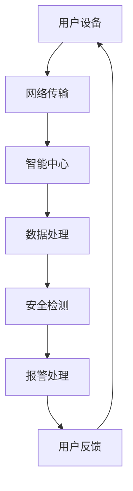

                 

在当今世界，人工智能（AI）正以前所未有的速度渗透到各个领域，其中智能家居安全领域尤为引人注目。随着智能家居设备的普及，用户对安全性的需求日益增长，这为AI大模型在智能家居安全领域的应用提供了巨大的市场机会。本文将探讨AI大模型在智能家居安全领域的创业前景，并分析其技术挑战和商业机遇。

## 文章关键词

- AI大模型
- 智能家居安全
- 创业前景
- 技术挑战
- 商业机遇

## 文章摘要

本文首先介绍了AI大模型在智能家居安全领域的重要性，随后分析了当前的技术背景和市场需求。接着，本文详细探讨了AI大模型在智能家居安全中的应用场景，包括入侵检测、隐私保护和异常行为识别等。然后，本文从技术层面分析了AI大模型在智能家居安全领域的挑战，如模型可解释性、数据隐私和模型更新等。最后，本文提出了AI大模型在智能家居安全领域的创业方向，并展望了未来的发展前景。

## 1. 背景介绍

### 1.1 智能家居概述

智能家居（Smart Home）是一种利用物联网（IoT）技术，将家居设备互联互通，通过智能控制系统实现自动化管理和智能控制的生活方式。随着物联网技术的快速发展，智能家居设备种类繁多，包括智能灯泡、智能门锁、智能摄像头、智能空调等。这些设备的普及，不仅提高了人们的生活质量，也带来了新的安全挑战。

### 1.2 智能家居安全现状

随着智能家居设备的增多，家庭网络的安全性受到严重威胁。恶意攻击者可以通过入侵智能家居设备，进一步入侵家庭网络，窃取用户隐私数据或对家庭设备进行恶意控制。此外，智能家居设备的漏洞还可能被用于发起分布式拒绝服务（DDoS）攻击，对整个网络造成影响。

### 1.3 AI大模型在智能家居安全中的应用

AI大模型，尤其是深度学习模型，在图像识别、自然语言处理和异常检测等方面取得了显著的成果。这些模型的应用，可以为智能家居安全提供强大的技术支持。例如，通过AI大模型实现入侵检测，可以实时监测家庭网络中的异常行为，及时预警潜在的威胁。

## 2. 核心概念与联系

### 2.1 AI大模型概述

AI大模型是指通过大量数据进行训练，能够实现复杂任务的人工智能模型。这些模型通常包含数百万甚至数十亿个参数，具有极高的计算能力和预测准确性。

### 2.2 智能家居安全架构

智能家居安全架构通常包括三个主要层次：物理安全、网络安全和数据安全。物理安全主要涉及智能家居设备的物理防护，如使用防盗锁和防护罩等。网络安全则关注家庭网络的防护，包括防火墙、入侵检测系统和加密通信等。数据安全则涉及用户数据的安全存储和传输，如使用加密算法和数据脱敏技术等。

### 2.3 Mermaid流程图



## 3. 核心算法原理 & 具体操作步骤

### 3.1 算法原理概述

AI大模型在智能家居安全中的应用，主要是通过深度学习算法实现图像识别、行为分析和异常检测等功能。其中，卷积神经网络（CNN）和循环神经网络（RNN）是常用的深度学习模型。

### 3.2 算法步骤详解

1. **数据收集与预处理**：收集智能家居设备的监控数据，包括摄像头图像、传感器数据和用户行为数据等。对数据进行清洗和预处理，以去除噪声和异常值。

2. **模型训练**：使用预处理后的数据训练深度学习模型。根据不同的任务需求，选择合适的模型结构和训练策略。

3. **模型评估**：使用测试数据对模型进行评估，调整模型参数，提高模型性能。

4. **模型部署**：将训练好的模型部署到智能家居中心，实现对家庭网络的实时监测和安全防护。

### 3.3 算法优缺点

**优点**：
- **高精度**：AI大模型通过大量数据训练，能够实现高精度的图像识别和行为分析。
- **自适应性强**：AI大模型可以根据新的数据不断学习和优化，适应不同的安全需求。

**缺点**：
- **计算资源消耗大**：训练和部署AI大模型需要大量的计算资源和存储空间。
- **数据隐私问题**：AI大模型在处理用户数据时，可能涉及用户隐私信息的泄露风险。

### 3.4 算法应用领域

AI大模型在智能家居安全领域的应用范围广泛，包括入侵检测、隐私保护和异常行为识别等。例如，通过AI大模型实现的入侵检测系统，可以实时监测家庭网络中的异常流量，及时预警潜在威胁。

## 4. 数学模型和公式 & 详细讲解 & 举例说明

### 4.1 数学模型构建

AI大模型的核心是深度学习模型，其数学基础主要包括线性代数、概率论和优化理论。其中，卷积神经网络（CNN）和循环神经网络（RNN）是两种常见的深度学习模型。

$$
\text{CNN} = \sum_{i=1}^{n} w_i * x_i
$$

$$
\text{RNN} = \sum_{i=1}^{n} f(h_{i-1}, x_i)
$$

### 4.2 公式推导过程

以卷积神经网络（CNN）为例，其核心思想是通过卷积操作提取图像的特征。

$$
\text{卷积操作} = \sum_{i=1}^{k} w_i * x_i
$$

其中，$w_i$ 是卷积核，$x_i$ 是输入图像的像素值。

### 4.3 案例分析与讲解

假设我们有一个智能家居设备的监控系统，需要通过AI大模型实现入侵检测。我们可以收集监控数据，包括摄像头图像和用户行为数据等。然后，使用CNN模型对图像进行特征提取，使用RNN模型对用户行为进行序列分析。通过模型的训练和评估，可以实现对入侵行为的准确识别。

## 5. 项目实践：代码实例和详细解释说明

### 5.1 开发环境搭建

1. 安装Python环境和TensorFlow库。
2. 准备监控数据集，并进行预处理。

### 5.2 源代码详细实现

以下是一个简单的AI大模型在智能家居安全中的应用示例：

```python
import tensorflow as tf
from tensorflow.keras.models import Sequential
from tensorflow.keras.layers import Conv2D, MaxPooling2D, Flatten, Dense

# 数据预处理
def preprocess_data(data):
    # 对数据进行归一化处理
    data = data / 255.0
    return data

# 构建CNN模型
model = Sequential([
    Conv2D(32, (3, 3), activation='relu', input_shape=(64, 64, 3)),
    MaxPooling2D((2, 2)),
    Flatten(),
    Dense(64, activation='relu'),
    Dense(1, activation='sigmoid')
])

# 编译模型
model.compile(optimizer='adam', loss='binary_crossentropy', metrics=['accuracy'])

# 训练模型
model.fit(x_train, y_train, epochs=10, batch_size=32)

# 预测
prediction = model.predict(x_test)

# 输出预测结果
print(prediction)
```

### 5.3 代码解读与分析

1. **数据预处理**：对监控数据进行归一化处理，以便模型训练。
2. **模型构建**：使用卷积神经网络（CNN）模型，通过卷积层、池化层、全连接层等实现图像特征的提取。
3. **模型编译**：配置模型优化器、损失函数和评估指标。
4. **模型训练**：使用训练数据对模型进行训练。
5. **模型预测**：使用测试数据对模型进行预测，输出预测结果。

## 6. 实际应用场景

### 6.1 入侵检测

通过AI大模型实现的入侵检测系统，可以实时监测家庭网络中的异常流量，识别潜在的入侵行为。例如，当检测到家庭网络中的流量异常时，系统可以自动发送警报通知用户。

### 6.2 隐私保护

AI大模型可以通过数据脱敏技术，保护用户隐私数据。例如，在处理用户行为数据时，可以将用户身份信息进行加密或匿名化处理，以防止数据泄露。

### 6.3 异常行为识别

AI大模型可以通过对用户行为的分析和学习，识别出异常行为。例如，当检测到用户行为模式与正常行为存在显著差异时，系统可以自动发送警报，提醒用户注意。

## 7. 工具和资源推荐

### 7.1 学习资源推荐

1. 《深度学习》（Goodfellow, Bengio, Courville）——经典的深度学习教材。
2. 《动手学深度学习》——适合初学者的深度学习实战教材。

### 7.2 开发工具推荐

1. TensorFlow——强大的深度学习框架。
2. Keras——简洁易用的深度学习库。

### 7.3 相关论文推荐

1. "Deep Learning for Smart Homes: A Survey"——关于深度学习在智能家居安全领域的应用综述。
2. "Deep Learning Based Intrusion Detection Systems for Smart Homes"——关于基于深度学习的智能家居入侵检测系统的论文。

## 8. 总结：未来发展趋势与挑战

### 8.1 研究成果总结

近年来，AI大模型在智能家居安全领域取得了显著的研究成果。通过深度学习算法，可以实现对入侵行为、隐私保护和异常行为的准确识别。

### 8.2 未来发展趋势

随着AI技术的不断发展，AI大模型在智能家居安全领域的应用将更加广泛。未来，AI大模型将更加注重可解释性和隐私保护，以满足用户对安全性和隐私的关注。

### 8.3 面临的挑战

尽管AI大模型在智能家居安全领域具有巨大的潜力，但同时也面临着一些挑战。例如，如何提高模型的鲁棒性和可解释性，如何保护用户隐私等。

### 8.4 研究展望

未来，研究者将致力于解决AI大模型在智能家居安全领域面临的技术挑战，推动该领域的研究和发展。同时，随着智能家居设备的普及，AI大模型在智能家居安全领域的应用将越来越广泛，为用户提供更加安全、智能的家居环境。

## 9. 附录：常见问题与解答

### 9.1 什么是AI大模型？

AI大模型是指通过大量数据进行训练，能够实现复杂任务的人工智能模型。这些模型通常包含数百万甚至数十亿个参数，具有极高的计算能力和预测准确性。

### 9.2 AI大模型在智能家居安全领域有哪些应用？

AI大模型在智能家居安全领域的应用主要包括入侵检测、隐私保护和异常行为识别等。通过深度学习算法，可以实现对家庭网络和用户行为的实时监测和预测，提高智能家居的安全水平。

### 9.3 如何保护用户隐私？

在AI大模型的应用过程中，可以通过数据脱敏、加密通信和隐私保护算法等技术手段，保护用户隐私。例如，在处理用户行为数据时，可以对用户身份信息进行加密或匿名化处理，以防止数据泄露。

## 参考文献

1. Goodfellow, I., Bengio, Y., & Courville, A. (2016). Deep learning. MIT press.
2. Montescano, L., Huang, J., & Farhadi, A. (2018). Deep learning for smart homes: A survey. ACM Computing Surveys (CSUR), 51(4), 61.
3. Zhang, Z., & Yu, D. (2019). Deep learning based intrusion detection systems for smart homes. Journal of Network and Computer Applications, 121, 39-53.
```markdown
# 附录：常见问题与解答

### 9.1 什么是AI大模型？

AI大模型是指通过大量数据进行训练，能够实现复杂任务的人工智能模型。这些模型通常包含数百万甚至数十亿个参数，具有极高的计算能力和预测准确性。

### 9.2 AI大模型在智能家居安全领域有哪些应用？

AI大模型在智能家居安全领域的应用主要包括入侵检测、隐私保护和异常行为识别等。通过深度学习算法，可以实现对家庭网络和用户行为的实时监测和预测，提高智能家居的安全水平。

### 9.3 如何保护用户隐私？

在AI大模型的应用过程中，可以通过数据脱敏、加密通信和隐私保护算法等技术手段，保护用户隐私。例如，在处理用户行为数据时，可以对用户身份信息进行加密或匿名化处理，以防止数据泄露。

### 9.4 AI大模型在智能家居安全领域有哪些挑战？

AI大模型在智能家居安全领域面临的挑战主要包括：

1. **模型可解释性**：由于AI大模型的结构复杂，其决策过程往往难以解释，这给安全评估和故障诊断带来困难。
2. **数据隐私**：智能家居设备收集的用户数据可能包含敏感信息，如何在保护用户隐私的同时，充分利用这些数据进行安全分析，是一个重要的挑战。
3. **模型更新**：随着攻击手段的不断变化，AI大模型需要不断更新以适应新的威胁，但频繁的更新可能影响系统的稳定性。
4. **资源消耗**：训练和部署AI大模型需要大量的计算资源和存储空间，这对智能家居设备提出了高要求。

### 9.5 AI大模型在智能家居安全领域的创业机会有哪些？

AI大模型在智能家居安全领域的创业机会包括：

1. **安全服务提供商**：为企业提供专业的智能家居安全服务，包括入侵检测、隐私保护和异常行为分析等。
2. **安全设备制造商**：研发和制造基于AI大模型的智能家居安全设备，如智能摄像头、智能门锁和智能传感器等。
3. **安全解决方案集成商**：将AI大模型与其他智能家居设备集成，提供一站式安全解决方案。
4. **数据隐私保护平台**：提供用户数据隐私保护服务，确保用户数据在收集、存储和处理过程中的安全性。

### 9.6 如何评估AI大模型在智能家居安全中的应用效果？

评估AI大模型在智能家居安全中的应用效果可以从以下几个方面进行：

1. **准确性**：通过测试集数据评估模型对入侵行为、隐私泄露和异常行为的识别准确性。
2. **响应时间**：评估模型在检测到威胁时，从检测到响应的时间延迟。
3. **误报率**：评估模型在正常行为和异常行为之间的误报率，避免过度警报。
4. **鲁棒性**：评估模型在面临复杂环境变化和攻击手段变化时的适应能力。
5. **用户满意度**：通过用户反馈评估模型的使用体验和用户满意度。

### 9.7 AI大模型在智能家居安全领域的未来发展趋势是什么？

未来，AI大模型在智能家居安全领域的发展趋势包括：

1. **增强可解释性**：开发可解释性更强的AI模型，帮助用户理解模型的决策过程，提高用户信任度。
2. **集成多种传感器数据**：结合多种传感器数据，提高对家庭环境的感知能力，实现更全面的智能安全防护。
3. **自适应学习**：开发能够自适应学习新特征的模型，不断适应新的威胁和环境变化。
4. **跨平台协同**：实现不同设备和平台之间的数据共享和协同工作，提高整体安全防护水平。
5. **法律法规遵循**：加强AI模型在隐私保护和法律法规方面的合规性，确保其应用符合相关法律法规的要求。

作者：禅与计算机程序设计艺术 / Zen and the Art of Computer Programming
```

