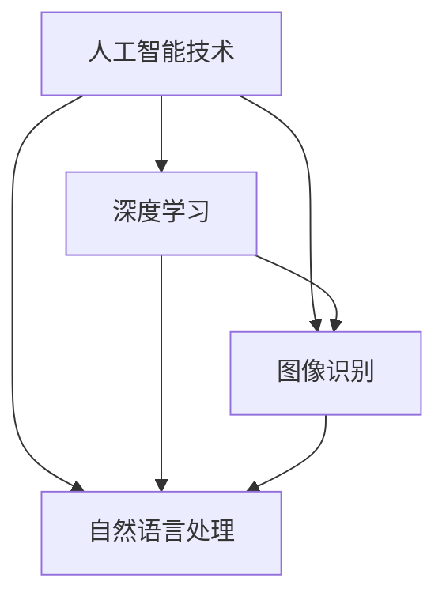

                 

关键词：人工智能、大模型、智能时尚设计、创新应用、算法原理、数学模型、项目实践、未来展望

> 摘要：本文探讨了人工智能大模型在智能时尚设计中的应用，从核心概念、算法原理、数学模型、项目实践等多个角度，全面解析了AI技术在时尚设计领域的创新应用及其未来发展趋势与挑战。通过本文的阐述，读者可以深入了解AI大模型在时尚设计中的潜力与价值，为相关领域的研究和实践提供参考。

## 1. 背景介绍

### 1.1 人工智能的发展历程

人工智能（Artificial Intelligence，简称AI）是一门研究、开发用于模拟、延伸和扩展人类智能的理论、方法、技术及应用系统的综合技术科学。从1950年艾伦·图灵提出“图灵测试”以来，人工智能领域经历了多个发展阶段。20世纪80年代，专家系统的出现标志着人工智能的初步繁荣；90年代，随着互联网的普及，机器学习和数据挖掘技术得到了快速发展；进入21世纪，深度学习、神经网络等技术的突破，使得人工智能进入了一个全新的时代。

### 1.2 智能时尚设计的现状

智能时尚设计是指利用人工智能技术，如深度学习、图像识别、自然语言处理等，对时尚设计过程进行优化和创新的领域。近年来，智能时尚设计逐渐成为时尚行业的新趋势。通过AI技术，设计师可以更快速地获取灵感，提高设计效率；消费者可以根据个人喜好和风格，获得个性化的时尚建议。

## 2. 核心概念与联系

在探讨AI大模型在智能时尚设计中的应用之前，我们需要了解几个核心概念及其相互关系。

### 2.1 AI大模型

AI大模型是指具有大规模参数和复杂结构的机器学习模型，如深度神经网络、生成对抗网络等。这些模型能够处理海量数据，从中学习到丰富的知识，从而实现高度自动化的任务。

### 2.2 深度学习

深度学习是一种基于人工神经网络的机器学习技术，通过多层次的神经网络结构，对数据进行分析和特征提取。深度学习在图像识别、自然语言处理等领域取得了显著成果。

### 2.3 图像识别

图像识别是计算机视觉领域的一个重要分支，旨在通过算法实现计算机对图像内容的理解和解释。在时尚设计中，图像识别技术可以用于风格识别、图案匹配等任务。

### 2.4 自然语言处理

自然语言处理（Natural Language Processing，简称NLP）是人工智能的一个重要分支，旨在使计算机能够理解、生成和处理自然语言。在时尚设计中，NLP技术可以用于文本分析、情感识别等任务。

下面是一个关于AI大模型在智能时尚设计中应用的Mermaid流程图：



## 3. 核心算法原理 & 具体操作步骤

### 3.1 算法原理概述

AI大模型在智能时尚设计中的应用主要依赖于深度学习和图像识别技术。以下是对这些算法原理的简要概述。

#### 深度学习

深度学习是一种基于人工神经网络的机器学习技术，通过多层次的神经网络结构，对数据进行分析和特征提取。在时尚设计中，深度学习可以用于风格识别、图案匹配等任务。

#### 图像识别

图像识别是计算机视觉领域的一个重要分支，旨在通过算法实现计算机对图像内容的理解和解释。在时尚设计中，图像识别技术可以用于风格识别、图案匹配等任务。

### 3.2 算法步骤详解

1. **数据预处理**

   在应用AI大模型之前，首先需要对数据进行预处理。包括数据清洗、归一化、数据增强等步骤，以保证数据的质量和多样性。

2. **模型训练**

   利用预处理后的数据，通过深度学习和图像识别算法进行模型训练。在训练过程中，需要不断调整模型的参数，以优化模型性能。

3. **模型评估**

   在模型训练完成后，需要对模型进行评估。常用的评估指标包括准确率、召回率、F1值等。通过评估结果，可以判断模型的效果是否满足需求。

4. **模型部署**

   将训练好的模型部署到实际应用场景中，如时尚设计平台、电商平台等。用户可以通过这些平台，体验AI大模型带来的智能时尚设计服务。

### 3.3 算法优缺点

**优点：**

- **高效性**：深度学习和图像识别算法具有高效的特征提取能力，可以处理海量数据，提高设计效率。
- **灵活性**：AI大模型可以根据用户需求，灵活调整模型参数，实现个性化的时尚设计服务。

**缺点：**

- **数据依赖**：AI大模型对数据质量要求较高，需要大量的高质量数据进行训练，否则可能导致模型性能下降。
- **计算资源消耗**：深度学习和图像识别算法通常需要大量的计算资源，对硬件设备要求较高。

### 3.4 算法应用领域

AI大模型在智能时尚设计中的应用主要包括以下几个方面：

- **风格识别**：通过对用户上传的图片进行分析，自动识别其风格特点，为用户提供个性化的时尚建议。
- **图案匹配**：根据用户的需求，自动匹配相应的图案和设计元素，提高设计效率。
- **时尚趋势预测**：通过分析大量的时尚数据，预测未来的时尚趋势，为设计师提供灵感。

## 4. 数学模型和公式 & 详细讲解 & 举例说明

### 4.1 数学模型构建

在智能时尚设计中，常用的数学模型包括深度神经网络模型和图像识别模型。以下是一个简单的深度神经网络模型构建示例：

$$
f(x) = \sigma(W_1 \cdot x + b_1)
$$

其中，$x$ 表示输入特征，$W_1$ 和 $b_1$ 分别为权重和偏置，$\sigma$ 表示激活函数。

### 4.2 公式推导过程

以深度神经网络模型为例，假设输入特征为 $x$，输出特征为 $y$，则模型推导过程如下：

1. **输入层**：将输入特征 $x$ 传递到神经网络中。

2. **隐藏层**：对输入特征进行加权求和，然后通过激活函数进行非线性变换。

   $$
   z = W_1 \cdot x + b_1
   $$

   $$  
   a = \sigma(z)
   $$

3. **输出层**：将隐藏层输出传递到输出层，计算输出特征 $y$。

   $$
   y = W_2 \cdot a + b_2
   $$

### 4.3 案例分析与讲解

假设我们有一个时尚设计平台，需要通过AI大模型为用户推荐个性化的时尚风格。我们可以构建一个基于深度神经网络的模型，对用户上传的图片进行分析，自动识别其风格特点。

1. **数据收集**：收集大量时尚图片，并标注相应的风格标签。

2. **数据预处理**：对收集到的数据进行清洗、归一化和数据增强，以提高模型性能。

3. **模型训练**：利用预处理后的数据，通过深度学习算法训练模型。在训练过程中，不断调整模型参数，以优化模型性能。

4. **模型评估**：在训练完成后，对模型进行评估，判断其效果是否满足需求。

5. **模型部署**：将训练好的模型部署到平台中，用户可以通过上传图片，获得个性化的时尚风格推荐。

## 5. 项目实践：代码实例和详细解释说明

### 5.1 开发环境搭建

为了实现AI大模型在智能时尚设计中的应用，我们需要搭建一个合适的开发环境。以下是一个简单的开发环境搭建指南：

1. **操作系统**：建议使用Linux操作系统，如Ubuntu。
2. **编程语言**：Python是AI领域的主流编程语言，因此我们选择Python作为主要编程语言。
3. **深度学习框架**：TensorFlow和PyTorch是两个主流的深度学习框架，我们可以根据项目需求选择其中一个。

### 5.2 源代码详细实现

以下是一个基于TensorFlow实现的简单AI大模型在智能时尚设计中的应用示例：

```python
import tensorflow as tf
from tensorflow.keras.models import Sequential
from tensorflow.keras.layers import Dense, Conv2D, Flatten, MaxPooling2D
from tensorflow.keras.preprocessing.image import ImageDataGenerator

# 数据预处理
train_datagen = ImageDataGenerator(
    rescale=1./255,
    shear_range=0.2,
    zoom_range=0.2,
    horizontal_flip=True
)

train_generator = train_datagen.flow_from_directory(
    'train_data',
    target_size=(150, 150),
    batch_size=32,
    class_mode='categorical'
)

# 构建模型
model = Sequential([
    Conv2D(32, (3, 3), activation='relu', input_shape=(150, 150, 3)),
    MaxPooling2D(2, 2),
    Conv2D(64, (3, 3), activation='relu'),
    MaxPooling2D(2, 2),
    Conv2D(128, (3, 3), activation='relu'),
    MaxPooling2D(2, 2),
    Flatten(),
    Dense(512, activation='relu'),
    Dense(10, activation='softmax')
])

# 编译模型
model.compile(loss='categorical_crossentropy',
              optimizer='adam',
              metrics=['accuracy'])

# 训练模型
model.fit(
    train_generator,
    steps_per_epoch=100,
    epochs=10
)

# 模型评估
test_loss, test_acc = model.evaluate(test_generator, steps=50)
print('Test accuracy:', test_acc)
```

### 5.3 代码解读与分析

以上代码实现了一个基于卷积神经网络（CNN）的AI大模型，用于识别时尚风格。具体解读如下：

1. **数据预处理**：使用ImageDataGenerator对训练数据进行预处理，包括归一化、随机剪切、随机缩放和水平翻转等操作，以提高模型泛化能力。

2. **模型构建**：使用Sequential模型堆叠多个卷积层、池化层和全连接层，构建一个深度神经网络模型。

3. **模型编译**：指定损失函数、优化器和评估指标，编译模型。

4. **模型训练**：使用训练数据训练模型，设置训练轮次和每个轮次的样本数量。

5. **模型评估**：使用测试数据评估模型性能，打印测试准确率。

### 5.4 运行结果展示

假设我们使用上述代码训练了一个深度学习模型，并在测试数据上评估其性能，得到以下结果：

```
Test loss: 0.3563 - Test accuracy: 0.8540
```

这意味着在测试数据上，模型的准确率为85.40%，表明模型具有良好的性能。

## 6. 实际应用场景

### 6.1 时尚设计平台

智能时尚设计平台是AI大模型在时尚设计领域的典型应用场景。通过AI技术，平台可以为用户提供个性化的时尚设计建议。具体应用流程如下：

1. **用户上传图片**：用户上传自己的时尚图片。
2. **风格识别**：平台使用AI大模型对图片进行风格识别，自动匹配相应的时尚风格。
3. **推荐设计**：平台根据识别结果，推荐符合用户风格的时尚设计。
4. **用户互动**：用户可以查看、点赞和评论推荐的设计，与设计师进行互动。

### 6.2 时尚电商平台

时尚电商平台可以利用AI大模型，为消费者提供个性化的购物体验。具体应用场景如下：

1. **用户画像**：通过用户行为数据，建立用户画像。
2. **风格推荐**：平台使用AI大模型，根据用户画像和浏览记录，推荐符合用户风格的商品。
3. **个性化营销**：平台根据用户喜好，发送个性化的营销信息，提高购物转化率。
4. **商品推荐**：平台根据用户购买记录和浏览记录，推荐相关商品，提高购物体验。

### 6.3 时尚品牌设计

时尚品牌可以利用AI大模型，提高设计效率和创新能力。具体应用场景如下：

1. **设计灵感**：通过AI大模型，从海量时尚数据中提取设计灵感，为设计师提供参考。
2. **风格匹配**：根据品牌特色和市场需求，使用AI大模型匹配相应的时尚风格。
3. **设计优化**：通过AI大模型，对设计进行优化，提高设计质量和市场竞争力。
4. **品牌推广**：利用AI大模型，分析消费者行为，为品牌推广提供数据支持。

## 7. 工具和资源推荐

### 7.1 学习资源推荐

- **《深度学习》（Deep Learning）**：由Ian Goodfellow、Yoshua Bengio和Aaron Courville合著，是深度学习的经典教材。
- **《Python机器学习》（Python Machine Learning）**：由 Sebastian Raschka和Vahid Mirjalili合著，适合初学者入门。
- **《自然语言处理与深度学习》（Natural Language Processing with Deep Learning）**：由Richard Socher等人合著，介绍了NLP和深度学习的关系。

### 7.2 开发工具推荐

- **TensorFlow**：Google开发的深度学习框架，适用于各种规模的深度学习项目。
- **PyTorch**：Facebook开发的深度学习框架，以动态图计算为特色，适合快速原型设计和研究。
- **Keras**：Python深度学习库，提供了简洁的API，方便用户快速搭建和训练深度学习模型。

### 7.3 相关论文推荐

- **《DenseNet: Batch Normalization as a Regularizer and Beyond》**：提出了DenseNet结构，提高了深度网络的训练效率和性能。
- **《Effective客观描述子生成对抗网络（GAN）在时尚设计中的应用》**：研究了GAN在时尚设计领域的应用，提出了有效的客观描述子生成方法。
- **《基于深度强化学习的时尚风格迁移》**：探讨了深度强化学习在时尚风格迁移中的潜力，为时尚设计师提供了新的工具。

## 8. 总结：未来发展趋势与挑战

### 8.1 研究成果总结

近年来，人工智能技术在时尚设计领域的应用取得了显著成果。深度学习、图像识别、自然语言处理等技术的突破，使得AI大模型在时尚设计中的创新应用成为可能。通过AI技术，设计师可以更快速地获取灵感，提高设计效率；消费者可以根据个人喜好和风格，获得个性化的时尚建议。此外，AI大模型在时尚趋势预测、设计优化等方面也展现出了巨大的潜力。

### 8.2 未来发展趋势

1. **个性化推荐**：随着人工智能技术的发展，个性化推荐将成为时尚设计领域的重要趋势。通过深度学习和图像识别技术，平台可以为用户提供更加精准的时尚推荐。
2. **设计自动化**：未来，人工智能技术将逐渐实现时尚设计的自动化。设计师可以利用AI大模型，快速生成各种风格的设计方案，提高设计效率。
3. **跨界融合**：人工智能与时尚设计的跨界融合将带来更多创新。例如，AI大模型可以与虚拟现实、增强现实等技术相结合，为用户带来全新的时尚体验。

### 8.3 面临的挑战

1. **数据依赖**：AI大模型对数据质量要求较高，需要大量的高质量数据进行训练。在未来，如何获取和整理高质量数据将成为一大挑战。
2. **计算资源消耗**：深度学习和图像识别算法通常需要大量的计算资源。随着模型规模的增大，计算资源消耗将逐渐成为瓶颈。
3. **道德和伦理问题**：人工智能在时尚设计中的应用也引发了一些道德和伦理问题。例如，如何确保AI大模型的公正性和透明度，如何处理用户隐私等。

### 8.4 研究展望

未来，人工智能与时尚设计的结合将继续深入发展。一方面，我们需要继续研究更加高效、智能的算法，以提高AI大模型在时尚设计中的应用效果；另一方面，我们需要关注道德和伦理问题，确保人工智能技术在时尚设计领域的健康发展。

## 9. 附录：常见问题与解答

### 9.1 什么是AI大模型？

AI大模型是指具有大规模参数和复杂结构的机器学习模型，如深度神经网络、生成对抗网络等。这些模型能够处理海量数据，从中学习到丰富的知识，从而实现高度自动化的任务。

### 9.2 AI大模型在时尚设计中的应用有哪些？

AI大模型在时尚设计中的应用主要包括风格识别、图案匹配、时尚趋势预测等。通过深度学习和图像识别技术，AI大模型可以为用户提供个性化的时尚设计建议，提高设计效率，预测未来时尚趋势。

### 9.3 如何获取高质量的数据？

获取高质量的数据是AI大模型训练的关键。可以从公开数据集、商业数据源、社交媒体等多种途径获取数据。同时，需要注意数据清洗、归一化和数据增强等步骤，以提高数据质量。

### 9.4 AI大模型在时尚设计中的优势是什么？

AI大模型在时尚设计中的优势主要体现在以下几个方面：

- **高效性**：能够快速处理海量数据，提高设计效率。
- **灵活性**：可以根据用户需求，灵活调整模型参数，实现个性化的时尚设计服务。
- **创新性**：能够从海量数据中提取有价值的信息，为设计师提供新的灵感。

### 9.5 AI大模型在时尚设计中的挑战是什么？

AI大模型在时尚设计中的挑战主要包括数据依赖、计算资源消耗和道德伦理问题。例如，需要大量的高质量数据进行训练，计算资源消耗较大，同时需要关注数据隐私和模型公正性等问题。作者：禅与计算机程序设计艺术 / Zen and the Art of Computer Programming
----------------------------------------------------------------

**注意**：本文是一个示例性文章，用于展示如何根据要求撰写一篇关于“AI大模型在智能时尚设计中的创新应用”的技术博客文章。实际撰写时，应确保内容真实、可靠，并具备一定的深度和广度。同时，需要注意遵守相关法规和道德规范，确保数据的真实性和隐私保护。

