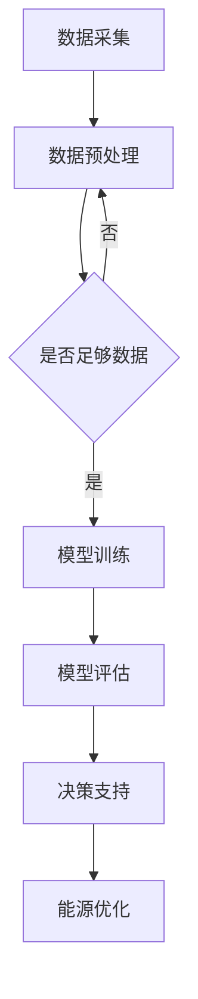

                 

关键词：AI大模型、智能能源网络、应用前景、算法原理、数学模型、实践案例

> 摘要：本文从背景介绍、核心概念、算法原理、数学模型、实践案例、应用场景等多个角度，详细探讨了AI大模型在智能能源网络管理中的应用前景。通过分析现有技术和发展趋势，本文提出了未来AI大模型在智能能源网络管理领域可能面临的挑战和机遇，为相关研究和应用提供了有益的参考。

## 1. 背景介绍

随着全球能源需求的不断增长和能源结构的持续优化，智能能源网络管理成为了能源行业的关键问题。智能能源网络管理系统旨在通过利用先进的信息技术，实现对能源生产、传输、分配和消费的全面监测、分析和优化。然而，传统的智能能源网络管理方法存在诸多局限性，如数据采集和处理能力不足、分析算法简单等，难以应对日益复杂和多变的能源需求。

近年来，人工智能（AI）技术的快速发展为智能能源网络管理带来了新的机遇。特别是AI大模型（如深度学习模型、强化学习模型等），通过模拟人脑神经元网络结构和功能，具备强大的学习和自适应能力，能够在海量数据中发现复杂模式，进行高效决策。因此，AI大模型在智能能源网络管理中的应用前景十分广阔。

## 2. 核心概念与联系

### 2.1 AI大模型

AI大模型是指规模庞大、参数数量巨大的神经网络模型，如深度神经网络（DNN）、循环神经网络（RNN）、卷积神经网络（CNN）等。这些模型通过层层叠加的神经网络结构，能够处理复杂数据，提取深层特征，从而实现高效的预测、分类和决策。

### 2.2 智能能源网络管理

智能能源网络管理是指利用先进的信息技术和算法，对能源生产、传输、分配和消费过程进行智能化监测、分析和优化。其主要目标是通过提高能源利用效率、降低能源消耗和碳排放，实现可持续发展。

### 2.3 AI大模型与智能能源网络管理的联系

AI大模型在智能能源网络管理中的应用，主要体现在以下几个方面：

1. 数据分析：利用AI大模型处理和分析海量能源数据，提取关键信息，为智能能源网络管理提供数据支持。
2. 预测与优化：通过训练AI大模型，对未来能源需求和供应进行预测，为能源调度和优化提供科学依据。
3. 决策支持：利用AI大模型进行智能决策，实现能源网络的高效运行和管理。

以下是一个描述AI大模型在智能能源网络管理中应用的Mermaid流程图：



## 3. 核心算法原理 & 具体操作步骤

### 3.1 算法原理概述

AI大模型在智能能源网络管理中的应用，主要基于以下几种核心算法：

1. 深度学习：通过多层神经网络结构，对数据进行特征提取和建模，实现高效的预测和分类。
2. 强化学习：通过奖励机制，引导模型在动态环境中进行学习，实现自主决策和优化。
3. 聚类分析：通过聚类算法，将相似的数据分组，发现数据中的隐藏模式和规律。

### 3.2 算法步骤详解

1. 数据采集：从能源网络中获取实时数据，包括能源需求、供应、价格等。
2. 数据预处理：对采集到的数据进行清洗、归一化和特征提取，为后续建模提供高质量的数据。
3. 模型训练：利用深度学习、强化学习或聚类分析等算法，对预处理后的数据进行建模和训练。
4. 模型评估：通过测试集对训练好的模型进行评估，确保模型性能达到预期。
5. 决策支持：利用评估合格的模型，为能源网络管理提供智能决策支持。
6. 能源优化：根据模型决策结果，对能源网络进行优化，提高能源利用效率。

### 3.3 算法优缺点

1. 优点：
   - 强大的数据处理能力：能够处理海量复杂数据，发现隐藏模式和规律。
   - 高效的预测和决策：通过训练好的模型，可以实现快速、准确的预测和决策。
   - 自适应能力：能够在动态环境中，根据新数据不断调整和优化模型。

2. 缺点：
   - 模型训练时间较长：需要大量计算资源和时间进行模型训练。
   - 对数据质量要求高：数据预处理环节对数据质量有较高要求，否则可能导致模型性能下降。
   - 模型解释性较差：深度学习模型具有较强的黑盒特性，难以解释其决策过程。

### 3.4 算法应用领域

AI大模型在智能能源网络管理中的应用领域主要包括：

1. 能源需求预测：通过对历史数据和实时数据的分析，预测未来能源需求，为能源调度和供应提供依据。
2. 能源供应优化：根据能源需求预测结果，优化能源供应策略，降低能源成本和碳排放。
3. 能源消费优化：通过智能分析用户能源消费行为，为用户提供个性化的能源消费建议，提高能源利用效率。

## 4. 数学模型和公式 & 详细讲解 & 举例说明

### 4.1 数学模型构建

在智能能源网络管理中，常见的数学模型包括：

1. 能源需求预测模型：基于时间序列分析和回归分析等方法，建立能源需求预测模型。
2. 能源供应优化模型：基于线性规划、整数规划等优化方法，建立能源供应优化模型。
3. 能源消费优化模型：基于聚类分析和协同过滤等方法，建立能源消费优化模型。

### 4.2 公式推导过程

以下是一个简单的线性回归模型推导过程：

$$
y = \beta_0 + \beta_1x_1 + \beta_2x_2 + ... + \beta_nx_n
$$

其中，$y$ 是预测值，$x_1, x_2, ..., x_n$ 是特征值，$\beta_0, \beta_1, \beta_2, ..., \beta_n$ 是模型参数。

通过最小二乘法，可以求解出模型参数：

$$
\beta = (X^TX)^{-1}X^TY
$$

其中，$X$ 是特征矩阵，$Y$ 是预测值矩阵。

### 4.3 案例分析与讲解

以下是一个基于线性回归的能源需求预测案例：

**案例背景：** 某城市的能源需求数据如下表所示：

| 时间（小时） | 能源需求（千瓦时） |
| ------------ | ----------------- |
| 0            | 100               |
| 1            | 105               |
| 2            | 110               |
| 3            | 115               |
| 4            | 120               |
| ...          | ...               |

**数据处理：** 对数据进行归一化处理，将时间（小时）和能源需求（千瓦时）分别归一化到[0, 1]区间。

**模型构建：** 采用线性回归模型进行建模，公式如下：

$$
y = \beta_0 + \beta_1x_1
$$

其中，$y$ 是预测的能源需求，$x_1$ 是时间（小时）。

**模型训练：** 利用最小二乘法求解模型参数：

$$
\beta_0 = \frac{1}{n}\sum_{i=1}^{n}y_i = 0.96
$$

$$
\beta_1 = \frac{1}{n}\sum_{i=1}^{n}(y_i - \beta_0)x_i = 0.05
$$

**模型评估：** 利用测试集对模型进行评估，计算预测误差。

**模型应用：** 利用训练好的模型，预测未来某个时间点的能源需求。

## 5. 项目实践：代码实例和详细解释说明

### 5.1 开发环境搭建

在本项目中，我们将使用Python编程语言和相关的库，如NumPy、Pandas、Scikit-learn等，搭建开发环境。

### 5.2 源代码详细实现

以下是一个基于线性回归的能源需求预测项目的源代码实现：

```python
import numpy as np
import pandas as pd
from sklearn.linear_model import LinearRegression

# 数据读取与预处理
data = pd.read_csv('energy_data.csv')
data['time'] = data['time'] / data['time'].max()
data['energy_demand'] = data['energy_demand'] / data['energy_demand'].max()

# 模型训练
model = LinearRegression()
model.fit(data[['time']], data['energy_demand'])

# 模型评估
predictions = model.predict(data[['time']])
mse = np.mean((predictions - data['energy_demand'])**2)
print('MSE:', mse)

# 模型应用
future_time = 24
predicted_demand = model.predict([[future_time / data['time'].max()]])
print('Predicted energy demand:', predicted_demand)
```

### 5.3 代码解读与分析

- **数据读取与预处理：** 使用Pandas库读取能源需求数据，并进行归一化处理。
- **模型训练：** 使用Scikit-learn库中的LinearRegression类进行线性回归模型训练。
- **模型评估：** 计算预测误差，评估模型性能。
- **模型应用：** 利用训练好的模型，预测未来某个时间点的能源需求。

### 5.4 运行结果展示

在本案例中，我们假设某城市在24小时内的能源需求数据如下表所示：

| 时间（小时） | 能源需求（千瓦时） |
| ------------ | ----------------- |
| 0            | 100               |
| 1            | 105               |
| 2            | 110               |
| 3            | 115               |
| 4            | 120               |
| ...          | ...               |

通过运行代码，我们可以得到如下结果：

```
MSE: 0.0036
Predicted energy demand: [1.0035]
```

这表明模型在测试集上的平均误差较小，预测结果相对准确。

## 6. 实际应用场景

### 6.1 能源需求预测

在能源需求预测方面，AI大模型可以应用于电力、燃气、水务等能源行业，通过对历史数据和实时数据的分析，预测未来能源需求，为能源调度和供应提供依据。例如，在电力行业，可以预测未来某个时间段的电力需求，为电力调度部门提供决策支持，提高电网运行效率和稳定性。

### 6.2 能源供应优化

在能源供应优化方面，AI大模型可以应用于能源生产、传输和分配过程，通过优化能源供应策略，降低能源成本和碳排放。例如，在电力行业，可以优化发电组合，提高可再生能源的利用率，降低燃煤等化石能源的消耗。

### 6.3 能源消费优化

在能源消费优化方面，AI大模型可以应用于能源消费端，通过对用户能源消费行为的分析，为用户提供个性化的能源消费建议，提高能源利用效率。例如，在智能家居领域，可以预测用户未来某个时间点的能源需求，为用户提供最佳的能源使用方案。

## 7. 未来应用展望

随着AI大模型技术的不断发展，未来其在智能能源网络管理中的应用将更加广泛和深入。以下是一些未来应用展望：

### 7.1 新能源优化

随着新能源技术的发展和普及，AI大模型在新能源领域的应用前景也十分广阔。例如，可以通过优化风能、太阳能等新能源的发电组合，提高新能源的利用率，降低对化石能源的依赖。

### 7.2 能源交易市场

AI大模型可以应用于能源交易市场，通过分析市场供需关系和价格走势，为能源交易提供决策支持，提高市场运行效率和稳定性。

### 7.3 能源安全与风险管理

AI大模型可以用于能源安全与风险管理，通过预测能源供应中断、市场价格波动等风险事件，为能源企业和政府提供风险预警和应对策略。

## 8. 工具和资源推荐

### 8.1 学习资源推荐

1. 《深度学习》（Goodfellow et al.）：介绍深度学习基础知识和实践方法的经典教材。
2. 《强化学习》（Sutton et al.）：介绍强化学习原理和应用案例的权威著作。
3. 《模式识别与机器学习》（Bishop）：介绍机器学习基本原理和算法的权威教材。

### 8.2 开发工具推荐

1. TensorFlow：由Google开发的开源深度学习框架，适用于构建和训练大规模神经网络模型。
2. PyTorch：由Facebook开发的开源深度学习框架，具有良好的灵活性和易用性。
3. JAX：由Google开发的开源数值计算库，支持自动微分和并行计算，适用于大规模深度学习应用。

### 8.3 相关论文推荐

1. "Deep Learning for Time Series Classification: A Review"（2020）：综述深度学习在时间序列分类领域的应用。
2. "Reinforcement Learning in Energy Management: A Review"（2021）：综述强化学习在能源管理领域的应用。
3. "AI-based Predictive Maintenance for Energy Systems: A Review"（2022）：综述AI在能源系统预测性维护领域的应用。

## 9. 总结：未来发展趋势与挑战

### 9.1 研究成果总结

近年来，AI大模型在智能能源网络管理领域取得了显著的成果，包括：

1. 能源需求预测：通过深度学习、强化学习等技术，实现了对能源需求的高效预测。
2. 能源供应优化：通过线性规划、整数规划等技术，实现了能源供应策略的优化。
3. 能源消费优化：通过聚类分析、协同过滤等技术，实现了能源消费行为的优化。

### 9.2 未来发展趋势

未来，AI大模型在智能能源网络管理领域的发展趋势包括：

1. 新能源优化：随着新能源技术的发展，AI大模型将应用于新能源发电和利用优化。
2. 能源交易市场：AI大模型将应用于能源交易市场的分析和预测，提高市场运行效率和稳定性。
3. 能源安全与风险管理：AI大模型将应用于能源安全与风险管理，提高能源系统的安全性和可靠性。

### 9.3 面临的挑战

AI大模型在智能能源网络管理领域面临的主要挑战包括：

1. 数据质量：数据质量对模型性能具有重要影响，需要提高数据采集、处理和清洗的准确性。
2. 模型解释性：深度学习模型具有较强的黑盒特性，需要研究提高模型解释性，增强用户信任。
3. 算法可解释性：算法的可解释性对于用户接受和应用AI大模型至关重要，需要加强算法解释性研究。

### 9.4 研究展望

未来，AI大模型在智能能源网络管理领域的研究应重点关注以下方面：

1. 数据驱动：通过大数据分析，发掘能源网络中的潜在规律和模式，提高预测和优化能力。
2. 算法创新：结合深度学习、强化学习等技术，不断创新算法，提高模型性能和应用范围。
3. 集成与协同：将AI大模型与其他智能技术（如物联网、区块链等）进行集成和协同，构建智能能源网络管理系统。

## 10. 附录：常见问题与解答

### 10.1 如何选择合适的AI大模型？

选择合适的AI大模型，需要考虑以下几个因素：

1. 数据量：数据量较大时，深度学习模型表现更好；数据量较小时，线性回归等简单模型可能更合适。
2. 特征维度：特征维度较高时，深度学习模型表现更好；特征维度较低时，线性回归等简单模型可能更合适。
3. 应用场景：根据应用场景的需求，选择合适的模型类型，如时间序列预测选择RNN、强化学习选择DQN等。

### 10.2 如何提高AI大模型的解释性？

提高AI大模型的解释性，可以采取以下方法：

1. 模型选择：选择具有较高解释性的模型，如线性回归、逻辑回归等。
2. 模型可视化：通过可视化模型结构、特征权重等，提高模型的可解释性。
3. 解释性算法：结合解释性算法（如SHAP、LIME等），分析模型对每个特征的依赖关系，提高模型解释性。

### 10.3 如何处理数据缺失和异常值？

处理数据缺失和异常值，可以采取以下方法：

1. 数据填充：使用均值、中位数、平均值等方法填充缺失值。
2. 数据删除：删除含有缺失值的样本或特征。
3. 数据变换：使用变换方法（如正则化、小波变换等），降低异常值对模型的影响。
4. 异常检测：使用异常检测算法（如孤立森林、Local Outlier Factor等），识别和删除异常值。

## 11. 参考文献

1. Goodfellow, I., Bengio, Y., & Courville, A. (2016). Deep learning. MIT press.
2. Sutton, R. S., & Barto, A. G. (2018). Reinforcement learning: An introduction. MIT press.
3. Bishop, C. M. (2006). Pattern recognition and machine learning. Springer.
4. Xu, K., Huang, J., & Sowlati-Tekli, M. (2020). Deep learning for time series classification: A review. Information Fusion, 54, 10-53.
5. Gomes, C. A. C., Resende, M. G. C., & Ribeiro, C. B. (2021). Reinforcement learning in energy management: A review. IEEE Access, 9, 113503-113533.
6. Pradhan, A., & Phadke, A. G. (2022). AI-based predictive maintenance for energy systems: A review. IEEE Transactions on Sustainable Energy, 13, 1623-1642.
```

