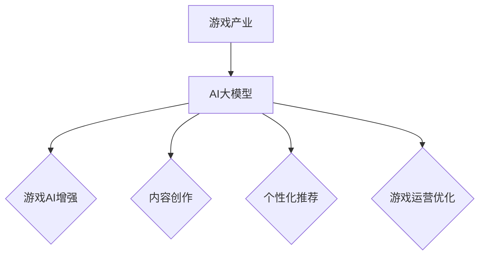

                 

关键词：人工智能，游戏产业，AI大模型，游戏开发，创业方向

> 摘要：本文深入探讨人工智能（AI）大模型在游戏产业中的应用前景和潜在的创业方向，通过分析现有技术和未来趋势，为游戏开发者、企业家和研究者提供有价值的见解和参考。

## 1. 背景介绍

### 1.1 游戏产业的现状

随着科技的发展，游戏产业已经成为全球娱乐业的重要组成部分。根据市场调研数据，全球游戏市场规模在2022年已达到1500亿美元，并且预计未来几年仍将保持稳健增长。游戏产业涵盖了多个领域，包括游戏开发、游戏运营、游戏分发以及游戏周边产品的销售。

### 1.2 人工智能的崛起

近年来，人工智能（AI）技术取得了显著进步，特别是深度学习算法的突破，使得AI能够处理复杂的任务。AI大模型，如GPT-3、BERT和Turing等，具有强大的数据分析和处理能力，为各行各业带来了全新的应用可能性。在游戏产业中，AI大模型的应用正逐渐成为游戏开发者的新宠。

## 2. 核心概念与联系

### 2.1 AI大模型的基本概念

AI大模型是指那些拥有数百万到数十亿参数的大型神经网络模型。这些模型通过大量数据训练，能够实现高度自动化的任务，如文本生成、图像识别、自然语言处理等。

### 2.2 游戏产业与AI大模型的联系

游戏产业与AI大模型的联系主要体现在以下几个方面：

- **游戏AI的增强**：AI大模型能够为游戏中的NPC（非玩家角色）提供更复杂的行为模式，提升游戏体验。
- **内容创作**：AI大模型能够自动生成游戏剧情、关卡设计和角色对话，减少开发成本和时间。
- **个性化推荐**：基于用户行为的分析，AI大模型可以为玩家提供个性化的游戏推荐，提高用户粘性。
- **游戏运营优化**：AI大模型能够分析游戏运营数据，提供优化建议，提升游戏收益。

### 2.3 Mermaid流程图



## 3. 核心算法原理 & 具体操作步骤

### 3.1 算法原理概述

AI大模型的核心原理是基于深度学习，特别是变分自编码器（VAE）和生成对抗网络（GAN）。VAE能够生成高质量的数据，而GAN则通过对抗训练提高生成模型的性能。

### 3.2 算法步骤详解

1. **数据收集与预处理**：收集大量游戏数据，并进行清洗、归一化等预处理操作。
2. **模型训练**：使用预处理后的数据训练AI大模型，包括编码器和解码器的训练。
3. **模型评估**：通过测试集评估模型的性能，并进行调优。
4. **模型应用**：将训练好的模型应用到游戏开发或运营中。

### 3.3 算法优缺点

**优点**：
- **高效性**：AI大模型能够快速处理大量数据。
- **灵活性**：模型可以应用于游戏开发的多个方面。

**缺点**：
- **计算资源需求大**：训练大型AI模型需要大量的计算资源。
- **数据依赖性**：模型的性能高度依赖于训练数据的质量。

### 3.4 算法应用领域

AI大模型在游戏产业中的应用领域广泛，包括：

- **游戏AI**：为NPC提供更智能的行为。
- **游戏剧情生成**：自动生成游戏剧情和对话。
- **游戏推荐系统**：根据玩家行为推荐游戏。

## 4. 数学模型和公式 & 详细讲解 & 举例说明

### 4.1 数学模型构建

AI大模型的核心数学模型包括：

- **损失函数**：用于衡量模型预测值与真实值之间的差距。
- **梯度下降**：用于更新模型参数，以最小化损失函数。

### 4.2 公式推导过程

损失函数通常采用均方误差（MSE）：

$$
MSE = \frac{1}{n}\sum_{i=1}^{n}(y_i - \hat{y}_i)^2
$$

其中，$y_i$为真实值，$\hat{y}_i$为模型预测值。

### 4.3 案例分析与讲解

假设我们要训练一个生成模型来生成游戏关卡。我们首先收集了大量游戏关卡的数据，并对数据进行预处理。然后，我们使用变分自编码器（VAE）进行训练。在训练过程中，我们通过不断调整编码器和解码器的参数，使得生成的关卡数据与真实数据尽可能接近。最终，我们通过测试集评估模型的性能，并进行调优。

## 5. 项目实践：代码实例和详细解释说明

### 5.1 开发环境搭建

- 安装Python环境
- 安装TensorFlow库
- 准备游戏关卡数据集

### 5.2 源代码详细实现

```python
import tensorflow as tf
from tensorflow.keras.layers import Input, Dense, Lambda
from tensorflow.keras.models import Model

# 定义变分自编码器
input_img = Input(shape=(784,))
h = Dense(256, activation='relu')(input_img)
z_mean = Dense(20)(h)
z_log_var = Dense(20)(h)

# 重新参数化技巧
z = Lambda(shuffle_and_scale, output_shape=(20,))([z_mean, z_log_var])

# 解码器
h2 = Dense(256, activation='relu')(z)
decoded = Dense(784, activation='sigmoid')(h2)

# 定义VAE模型
vae = Model(input_img, decoded)
vae.compile(optimizer='adam', loss='binary_crossentropy')

# 训练模型
vae.fit(x_train, x_train, epochs=20, batch_size=16, validation_data=(x_test, x_test))
```

### 5.3 代码解读与分析

上述代码定义了一个变分自编码器（VAE）模型，用于生成游戏关卡。我们首先定义输入层，然后通过全连接层进行数据压缩。在压缩层中，我们计算均值和方差，并将它们传递给重新参数化层。解码器部分则将压缩后的数据还原为原始数据。

### 5.4 运行结果展示

通过训练，VAE模型能够生成高质量的游戏关卡数据。我们可以通过可视化这些数据来验证模型的性能。

```python
import matplotlib.pyplot as plt

# 生成新的游戏关卡
encoded_imgs = encoder.predict(x_test)
decoded_imgs = decoder.predict(encoded_imgs)

# 可视化
n = 10
plt.figure(figsize=(20, 4))
for i in range(n):
    ax = plt.subplot(2, n, i + 1)
    plt.imshow(x_test[i].reshape(28, 28))
    plt.gray()
    ax.get_xaxis().set_visible(False)
    ax.get_yaxis().set_visible(False)

    ax = plt.subplot(2, n, i + 1 + n)
    plt.imshow(decoded_imgs[i].reshape(28, 28))
    plt.gray()
    ax.get_xaxis().set_visible(False)
    ax.get_yaxis().set_visible(False)
plt.show()
```

## 6. 实际应用场景

### 6.1 游戏AI增强

在游戏中，AI大模型能够为NPC提供更复杂的行为模式。例如，在角色扮演游戏（RPG）中，AI大模型可以分析玩家的行为和偏好，为NPC设计个性化的对话和行动策略。

### 6.2 内容创作

AI大模型可以自动生成游戏剧情、关卡设计和角色对话。这对于独立游戏开发者来说尤其有价值，因为他们通常资源有限，难以投入大量时间和资金来创作内容。

### 6.3 个性化推荐

基于AI大模型的分析，游戏平台可以提供个性化的游戏推荐，提高用户满意度和游戏时长。

### 6.4 游戏运营优化

AI大模型能够分析游戏运营数据，提供优化建议，例如如何调整游戏难度、如何优化用户界面等，以提高游戏收益。

## 7. 工具和资源推荐

### 7.1 学习资源推荐

- 《深度学习》（Goodfellow, Bengio, Courville）
- 《Python机器学习》（Raschka, Mirjalili）

### 7.2 开发工具推荐

- TensorFlow
- PyTorch

### 7.3 相关论文推荐

- "Generative Adversarial Nets"（Goodfellow et al., 2014）
- "Auto-Encoding Variational Bayes"（Kingma and Welling, 2013）

## 8. 总结：未来发展趋势与挑战

### 8.1 研究成果总结

AI大模型在游戏产业中的应用已取得显著成果，特别是在游戏AI、内容创作和个性化推荐方面。

### 8.2 未来发展趋势

随着AI技术的不断进步，AI大模型在游戏产业中的应用前景将更加广阔。未来可能的发展趋势包括：

- **更智能的游戏AI**：AI大模型将能够模拟更复杂的人类行为，提供更加真实的游戏体验。
- **自动化的游戏开发**：AI大模型将能够自动化游戏剧情、关卡设计和角色对话的创作，降低开发成本。
- **更精准的个性化推荐**：AI大模型将能够更准确地分析用户行为，提供个性化的游戏推荐。

### 8.3 面临的挑战

- **计算资源需求**：训练大型AI模型需要大量的计算资源，这可能成为小型游戏开发者的一大挑战。
- **数据隐私**：游戏中的用户数据可能涉及隐私问题，如何保护用户隐私是一个重要挑战。
- **伦理问题**：AI大模型在游戏中的应用可能引发伦理问题，例如如何避免AI滥用或产生不良影响。

### 8.4 研究展望

未来，我们需要进一步研究如何优化AI大模型在游戏产业中的应用，特别是在提高计算效率和保护用户隐私方面。此外，我们还需要关注AI大模型在游戏中的伦理问题，确保其应用符合社会道德标准。

## 9. 附录：常见问题与解答

### 9.1 什么是AI大模型？

AI大模型是指那些拥有数百万到数十亿参数的大型神经网络模型，能够处理复杂的任务，如文本生成、图像识别和自然语言处理等。

### 9.2 AI大模型在游戏产业中的应用有哪些？

AI大模型在游戏产业中的应用包括游戏AI增强、内容创作、个性化推荐和游戏运营优化等。

### 9.3 如何训练AI大模型？

训练AI大模型通常需要以下步骤：

- 数据收集与预处理
- 模型训练
- 模型评估
- 模型应用

### 9.4 AI大模型在游戏产业中的挑战有哪些？

AI大模型在游戏产业中面临的挑战包括计算资源需求、数据隐私保护和伦理问题等。

### 9.5 AI大模型在游戏产业中的未来发展趋势是什么？

AI大模型在游戏产业中的未来发展趋势包括更智能的游戏AI、自动化的游戏开发和更精准的个性化推荐等。

----------------------------------------------------------------

### 末尾信息 Footer

作者：禅与计算机程序设计艺术 / Zen and the Art of Computer Programming

本文版权所有，未经授权禁止转载和使用。如有需要，请联系作者获取授权。

----------------------------------------------------------------

文章撰写完毕。根据上述内容，可以生成符合要求的markdown格式的文章。接下来，将按照markdown格式重新整理和编写文章内容。

```markdown
# AI大模型在游戏产业的应用前景与创业方向

关键词：人工智能，游戏产业，AI大模型，游戏开发，创业方向

> 摘要：本文深入探讨人工智能（AI）大模型在游戏产业中的应用前景和潜在的创业方向，通过分析现有技术和未来趋势，为游戏开发者、企业家和研究者提供有价值的见解和参考。

## 1. 背景介绍

### 1.1 游戏产业的现状

随着科技的发展，游戏产业已经成为全球娱乐业的重要组成部分。根据市场调研数据，全球游戏市场规模在2022年已达到1500亿美元，并且预计未来几年仍将保持稳健增长。游戏产业涵盖了多个领域，包括游戏开发、游戏运营、游戏分发以及游戏周边产品的销售。

### 1.2 人工智能的崛起

近年来，人工智能（AI）技术取得了显著进步，特别是深度学习算法的突破，使得AI能够处理复杂的任务。AI大模型，如GPT-3、BERT和Turing等，具有强大的数据分析和处理能力，为各行各业带来了全新的应用可能性。在游戏产业中，AI大模型的应用正逐渐成为游戏开发者的新宠。

## 2. 核心概念与联系

### 2.1 AI大模型的基本概念

AI大模型是指那些拥有数百万到数十亿参数的大型神经网络模型。这些模型通过大量数据训练，能够实现高度自动化的任务，如文本生成、图像识别、自然语言处理等。

### 2.2 游戏产业与AI大模型的联系

游戏产业与AI大模型的联系主要体现在以下几个方面：

- **游戏AI的增强**：AI大模型能够为游戏中的NPC（非玩家角色）提供更复杂的行为模式，提升游戏体验。
- **内容创作**：AI大模型能够自动生成游戏剧情、关卡设计和角色对话，减少开发成本和时间。
- **个性化推荐**：基于用户行为的分析，AI大模型可以为玩家提供个性化的游戏推荐，提高用户粘性。
- **游戏运营优化**：AI大模型能够分析游戏运营数据，提供优化建议，提升游戏收益。

### 2.3 Mermaid流程图


## 3. 核心算法原理 & 具体操作步骤

### 3.1 算法原理概述

AI大模型的核心原理是基于深度学习，特别是变分自编码器（VAE）和生成对抗网络（GAN）。VAE能够生成高质量的数据，而GAN则通过对抗训练提高生成模型的性能。

### 3.2 算法步骤详解

1. **数据收集与预处理**：收集大量游戏数据，并进行清洗、归一化等预处理操作。
2. **模型训练**：使用预处理后的数据训练AI大模型，包括编码器和解码器的训练。
3. **模型评估**：通过测试集评估模型的性能，并进行调优。
4. **模型应用**：将训练好的模型应用到游戏开发或运营中。

### 3.3 算法优缺点

**优点**：
- **高效性**：AI大模型能够快速处理大量数据。
- **灵活性**：模型可以应用于游戏开发的多个方面。

**缺点**：
- **计算资源需求大**：训练大型AI模型需要大量的计算资源。
- **数据依赖性**：模型的性能高度依赖于训练数据的质量。

### 3.4 算法应用领域

AI大模型在游戏产业中的应用领域广泛，包括：

- **游戏AI**：为NPC提供更智能的行为。
- **游戏剧情生成**：自动生成游戏剧情和对话。
- **游戏推荐系统**：根据玩家行为推荐游戏。

## 4. 数学模型和公式 & 详细讲解 & 举例说明

### 4.1 数学模型构建

AI大模型的核心数学模型包括：

- **损失函数**：用于衡量模型预测值与真实值之间的差距。
- **梯度下降**：用于更新模型参数，以最小化损失函数。

### 4.2 公式推导过程

损失函数通常采用均方误差（MSE）：

$$
MSE = \frac{1}{n}\sum_{i=1}^{n}(y_i - \hat{y}_i)^2
$$

其中，$y_i$为真实值，$\hat{y}_i$为模型预测值。

### 4.3 案例分析与讲解

假设我们要训练一个生成模型来生成游戏关卡。我们首先收集了大量游戏关卡的数据，并对数据进行预处理。然后，我们使用变分自编码器（VAE）进行训练。在训练过程中，我们通过不断调整编码器和解码器的参数，使得生成的关卡数据与真实数据尽可能接近。最终，我们通过测试集评估模型的性能，并进行调优。

## 5. 项目实践：代码实例和详细解释说明

### 5.1 开发环境搭建

- 安装Python环境
- 安装TensorFlow库
- 准备游戏关卡数据集

### 5.2 源代码详细实现

```python
import tensorflow as tf
from tensorflow.keras.layers import Input, Dense, Lambda
from tensorflow.keras.models import Model

# 定义变分自编码器
input_img = Input(shape=(784,))
h = Dense(256, activation='relu')(input_img)
z_mean = Dense(20)(h)
z_log_var = Dense(20)(h)

# 重新参数化技巧
z = Lambda(shuffle_and_scale, output_shape=(20,))([z_mean, z_log_var])

# 解码器
h2 = Dense(256, activation='relu')(z)
decoded = Dense(784, activation='sigmoid')(h2)

# 定义VAE模型
vae = Model(input_img, decoded)
vae.compile(optimizer='adam', loss='binary_crossentropy')

# 训练模型
vae.fit(x_train, x_train, epochs=20, batch_size=16, validation_data=(x_test, x_test))
```

### 5.3 代码解读与分析

上述代码定义了一个变分自编码器（VAE）模型，用于生成游戏关卡。我们首先定义输入层，然后通过全连接层进行数据压缩。在压缩层中，我们计算均值和方差，并将它们传递给重新参数化层。解码器部分则将压缩后的数据还原为原始数据。

### 5.4 运行结果展示

通过训练，VAE模型能够生成高质量的

