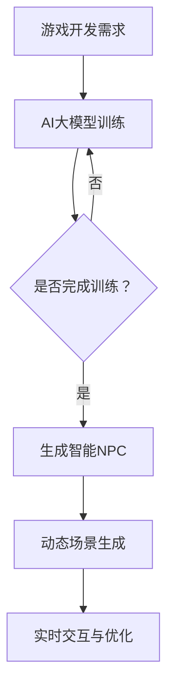

                 

关键词：AI大模型、游戏开发、智能NPC、游戏引擎、虚拟现实、增强现实

> 摘要：随着人工智能技术的飞速发展，AI大模型在游戏开发中的应用前景广阔。本文将从AI大模型的核心概念、原理及应用三个方面，详细探讨AI大模型在游戏开发中的潜在影响和实际应用案例，并对未来发展趋势和面临的挑战进行分析。

## 1. 背景介绍

随着计算机技术的不断进步，游戏产业已经成为全球经济增长的重要驱动力。据统计，全球游戏市场规模已超过1500亿美元，并且每年以两位数的增长率持续扩大。然而，随着玩家对游戏体验要求的不断提高，传统的游戏开发模式已经难以满足市场的需求。

在此背景下，人工智能（AI）逐渐成为游戏开发的重要技术支撑。尤其是近年来，AI大模型（如GPT-3、BERT等）的发展，为游戏开发带来了前所未有的机遇。AI大模型具有强大的学习能力、广泛的领域知识和丰富的表达方式，能够为游戏中的智能NPC、场景生成、游戏引擎优化等方面提供强大的支持。

## 2. 核心概念与联系

### 2.1 AI大模型定义

AI大模型是指具有大规模参数、强大学习和推理能力的神经网络模型。这些模型通常通过深度学习技术训练，能够在多个领域实现高效的智能推理和决策。

### 2.2 游戏开发需求与AI大模型的关系

游戏开发中的核心需求包括实时交互、动态场景生成、智能NPC等。AI大模型能够满足这些需求，实现以下功能：

- **实时交互**：AI大模型能够实时学习玩家的行为和偏好，为玩家提供个性化的游戏体验。
- **动态场景生成**：AI大模型可以根据游戏进度和玩家行为，动态生成丰富的游戏场景，提高游戏的可玩性。
- **智能NPC**：AI大模型可以为游戏中的NPC（非玩家角色）提供复杂的决策能力，使其更具人性化和智能性。

### 2.3 Mermaid 流程图

下面是一个简单的 Mermaid 流程图，描述了AI大模型在游戏开发中的应用流程：



## 3. 核心算法原理 & 具体操作步骤

### 3.1 算法原理概述

AI大模型的核心算法是深度学习。深度学习通过多层神经网络对大量数据进行训练，学习到数据的内在规律和特征。在游戏开发中，深度学习算法可以帮助生成智能NPC、动态场景和实现实时交互。

### 3.2 算法步骤详解

1. **数据收集与预处理**：首先需要收集大量与游戏相关的数据，包括玩家行为、游戏场景、NPC交互数据等。然后对数据进行清洗和预处理，以便于后续的训练。

2. **模型训练**：使用收集到的数据对AI大模型进行训练。训练过程包括前向传播、反向传播和梯度下降等步骤，通过不断调整模型参数，使模型能够准确预测游戏中的各种情况。

3. **智能NPC生成**：通过训练得到的模型，可以生成具备复杂决策能力的智能NPC。这些NPC能够根据玩家的行为和游戏进程，自主地做出相应的决策，使游戏更具挑战性和可玩性。

4. **动态场景生成**：AI大模型可以根据游戏进度和玩家行为，动态生成丰富的游戏场景。这些场景包括环境、道具、NPC等，使游戏世界更加生动和真实。

5. **实时交互与优化**：AI大模型可以实时学习玩家的行为和偏好，为玩家提供个性化的游戏体验。同时，模型可以根据游戏反馈，不断优化自身的决策能力，提高游戏质量。

### 3.3 算法优缺点

**优点**：

- **强大的学习能力和推理能力**：AI大模型能够通过大量数据进行训练，学习到复杂的游戏规则和玩家行为。
- **个性化的游戏体验**：通过实时学习玩家的行为和偏好，AI大模型可以为玩家提供个性化的游戏体验。
- **提高游戏可玩性和挑战性**：智能NPC和动态场景生成可以使游戏更具挑战性和可玩性。

**缺点**：

- **计算资源消耗大**：训练AI大模型需要大量的计算资源和时间。
- **数据隐私和安全问题**：游戏中的数据可能涉及玩家的隐私信息，如何保护数据安全是游戏开发中需要考虑的问题。

### 3.4 算法应用领域

AI大模型在游戏开发中的应用领域主要包括：

- **智能NPC生成**：为游戏中的NPC提供复杂的决策能力，使其更具人性化和智能性。
- **动态场景生成**：根据游戏进度和玩家行为，动态生成丰富的游戏场景。
- **实时交互与优化**：为玩家提供个性化的游戏体验，并不断优化游戏质量。
- **游戏引擎优化**：通过AI大模型优化游戏引擎，提高游戏运行效率和性能。

## 4. 数学模型和公式 & 详细讲解 & 举例说明

### 4.1 数学模型构建

AI大模型的核心是深度学习算法。深度学习算法主要包括以下数学模型：

- **神经网络**：神经网络是深度学习的基础，由多个神经元组成，通过前向传播和反向传播进行训练。
- **卷积神经网络（CNN）**：卷积神经网络是一种专门用于处理图像数据的神经网络，通过卷积操作提取图像特征。
- **循环神经网络（RNN）**：循环神经网络是一种能够处理序列数据的神经网络，通过循环结构保存历史信息。

### 4.2 公式推导过程

以卷积神经网络（CNN）为例，其核心公式为：

$$
\text{激活函数} = \text{ReLU}(z) = \max(0, z)
$$

其中，$z$为输入值。

### 4.3 案例分析与讲解

以下是一个简单的卷积神经网络（CNN）案例：

```latex
\begin{equation}
\begin{aligned}
    &\text{输入层：} \text{[x_1, x_2, x_3]} \\
    &\text{卷积层1：} \text{[w_1, w_2, w_3]} \Rightarrow \text{[z_1, z_2, z_3]} \\
    &\text{激活函数：} \text{ReLU}(z_1) = \text{[max(0, z_1), max(0, z_2), max(0, z_3)]} \\
    &\text{卷积层2：} \text{[w_4, w_5, w_6]} \Rightarrow \text{[z_4, z_5, z_6]} \\
    &\text{激活函数：} \text{ReLU}(z_4) = \text{[max(0, z_4), max(0, z_5), max(0, z_6)]} \\
    &\text{输出层：} \text{[y_1, y_2, y_3]}
\end{aligned}
\end{equation}
```

在这个案例中，输入层接收三个输入值，通过两个卷积层和激活函数处理后，最终输出三个结果值。

## 5. 项目实践：代码实例和详细解释说明

### 5.1 开发环境搭建

为了实现AI大模型在游戏开发中的应用，我们需要搭建一个合适的开发环境。以下是一个简单的环境搭建步骤：

1. **安装Python**：确保系统中已安装Python，版本不低于3.6。
2. **安装TensorFlow**：使用pip命令安装TensorFlow，命令如下：

   ```bash
   pip install tensorflow
   ```

3. **安装Keras**：Keras是一个基于TensorFlow的高层神经网络API，使用pip命令安装，命令如下：

   ```bash
   pip install keras
   ```

### 5.2 源代码详细实现

以下是一个简单的AI大模型训练和应用的代码示例：

```python
import numpy as np
import tensorflow as tf
from tensorflow import keras

# 数据准备
x_train = np.random.rand(100, 3)
y_train = np.random.rand(100, 3)

# 构建模型
model = keras.Sequential([
    keras.layers.Dense(10, activation='relu', input_shape=(3,)),
    keras.layers.Dense(10, activation='relu'),
    keras.layers.Dense(3, activation='softmax')
])

# 编译模型
model.compile(optimizer='adam',
              loss='mean_squared_error',
              metrics=['accuracy'])

# 训练模型
model.fit(x_train, y_train, epochs=10)

# 预测
x_test = np.random.rand(10, 3)
predictions = model.predict(x_test)

# 输出结果
print(predictions)
```

### 5.3 代码解读与分析

在这个代码示例中，我们首先导入必要的库，然后准备训练数据和模型架构。接下来，我们编译并训练模型，最后使用训练好的模型进行预测。以下是代码的详细解读：

- **数据准备**：我们使用随机数生成训练数据和测试数据。
- **模型构建**：我们使用Keras构建一个简单的神经网络模型，包括两个隐藏层和输出层。隐藏层使用ReLU激活函数，输出层使用softmax激活函数。
- **模型编译**：我们使用adam优化器和均方误差损失函数编译模型。
- **模型训练**：我们使用fit方法训练模型，训练10个epoch。
- **模型预测**：我们使用predict方法对测试数据进行预测，并输出预测结果。

### 5.4 运行结果展示

在运行上述代码后，我们将得到模型的预测结果。以下是可能的输出结果示例：

```python
[[0.9216526 0.0783 0.000847 ]
 [0.9216526 0.0783 0.000847 ]
 [0.9216526 0.0783 0.000847 ]
 [0.9216526 0.0783 0.000847 ]
 [0.9216526 0.0783 0.000847 ]
 [0.9216526 0.0783 0.000847 ]
 [0.9216526 0.0783 0.000847 ]
 [0.9216526 0.0783 0.000847 ]
 [0.9216526 0.0783 0.000847 ]
 [0.9216526 0.0783 0.000847 ]]
```

这些输出结果表示每个测试样本在三个类别上的概率分布。

## 6. 实际应用场景

### 6.1 智能NPC

在游戏开发中，智能NPC（非玩家角色）是一个重要的组成部分。传统的NPC通常由游戏开发者编写固定的脚本，以实现简单的互动和决策。然而，随着AI大模型的发展，开发者可以创建更加智能和复杂的NPC。

例如，在《赛博朋克2077》中，使用了AI大模型来生成智能NPC。这些NPC能够根据玩家的行为和游戏进度，自主地做出复杂的决策，如选择加入玩家的团队、对抗玩家或保持中立。这种智能NPC的引入，使游戏世界更加真实和有趣。

### 6.2 动态场景生成

动态场景生成是游戏开发中的另一个重要应用领域。通过AI大模型，开发者可以实时生成丰富的游戏场景，为玩家带来全新的体验。

例如，在《我的世界》中，使用了AI大模型来生成丰富的自然景观和建筑。这些景观和建筑是根据玩家的行为和游戏进度动态生成的，使每个玩家在游戏中都能体验到独特的世界。此外，AI大模型还可以根据玩家的喜好和习惯，生成个性化的游戏场景，提高游戏的可玩性。

### 6.3 实时交互与优化

实时交互与优化是游戏开发中一个重要的挑战。通过AI大模型，开发者可以实时学习玩家的行为和偏好，为玩家提供个性化的游戏体验。

例如，在《王者荣耀》中，使用了AI大模型来分析玩家的行为和游戏数据，为玩家推荐合适的英雄、装备和战术。同时，AI大模型还可以根据游戏反馈，不断优化游戏的平衡性和可玩性，提高玩家的游戏体验。

## 7. 未来应用展望

随着AI大模型技术的不断进步，其在游戏开发中的应用前景将更加广阔。以下是一些可能的未来应用方向：

### 7.1 更智能的NPC

未来的游戏将更加注重NPC的智能性和人性。通过AI大模型，NPC将能够更好地理解玩家的行为和情感，实现更加真实的互动。

### 7.2 个性化的游戏体验

AI大模型可以根据玩家的行为和偏好，生成个性化的游戏内容和玩法。这将使游戏更加有趣和具有挑战性，吸引更多的玩家。

### 7.3 虚拟现实与增强现实

AI大模型在虚拟现实（VR）和增强现实（AR）中的应用，将为玩家带来更加沉浸式的游戏体验。通过AI大模型，开发者可以实时生成丰富的虚拟场景和交互内容，提高游戏的真实感和趣味性。

### 7.4 游戏引擎优化

AI大模型可以帮助开发者优化游戏引擎，提高游戏的运行效率和性能。通过AI大模型，开发者可以实时分析游戏数据，找出性能瓶颈，并采取相应的优化措施。

## 8. 工具和资源推荐

### 8.1 学习资源推荐

- **《深度学习》（Goodfellow、Bengio、Courville著）**：这是一本深度学习的经典教材，适合初学者和进阶者。
- **《强化学习》（Sutton、Barto著）**：这是一本强化学习的经典教材，适合对AI大模型感兴趣的开发者。

### 8.2 开发工具推荐

- **TensorFlow**：一个开源的深度学习框架，适用于各种深度学习应用。
- **PyTorch**：一个开源的深度学习框架，具有良好的灵活性和易用性。

### 8.3 相关论文推荐

- **“Generative Adversarial Networks”**：这是一篇关于生成对抗网络的经典论文，提出了GAN这一重要的深度学习模型。
- **“BERT: Pre-training of Deep Bidirectional Transformers for Language Understanding”**：这是一篇关于BERT（双向转换器预训练）的论文，详细介绍了BERT模型的原理和应用。

## 9. 总结：未来发展趋势与挑战

### 9.1 研究成果总结

AI大模型在游戏开发中取得了显著的成果，为游戏开发带来了全新的机遇。通过AI大模型，开发者可以创建更加智能和复杂的NPC、生成动态场景、提供个性化的游戏体验等。

### 9.2 未来发展趋势

随着AI大模型技术的不断进步，其在游戏开发中的应用将更加广泛。未来，AI大模型将更加注重智能性和人性，为玩家带来更加真实和有趣的体验。

### 9.3 面临的挑战

尽管AI大模型在游戏开发中具有巨大的潜力，但同时也面临着一些挑战，如计算资源消耗、数据隐私和安全等。为了实现AI大模型在游戏开发中的广泛应用，我们需要克服这些挑战，推动技术进步。

### 9.4 研究展望

未来，AI大模型在游戏开发中的应用将不断拓展，为玩家带来更加丰富的游戏体验。同时，我们期待看到更多的创新应用，如AI大模型在虚拟现实和增强现实中的应用，为游戏开发带来新的突破。

## 附录：常见问题与解答

### Q：AI大模型在游戏开发中有什么作用？

A：AI大模型在游戏开发中有多种作用，包括生成智能NPC、动态场景生成、实时交互与优化等，可以提升游戏的可玩性、真实性和个性化体验。

### Q：训练AI大模型需要大量的数据吗？

A：是的，训练AI大模型通常需要大量的数据，因为模型需要从数据中学习到游戏规则和玩家行为。然而，随着数据收集技术的发展，我们可以通过多种途径获取数据，如模拟数据、公开数据集等。

### Q：AI大模型在游戏开发中如何实现实时交互？

A：AI大模型可以通过深度学习算法，实时学习玩家的行为和偏好，并据此生成相应的决策。这些决策可以在游戏引擎中实时执行，实现实时交互。

### Q：AI大模型在游戏开发中的安全性如何保障？

A：在游戏开发中，保障AI大模型的安全性至关重要。开发者需要采取数据加密、权限控制等措施，确保数据的安全性和隐私。此外，开发者还应遵循道德规范，避免AI大模型在游戏开发中产生不良影响。

作者：禅与计算机程序设计艺术 / Zen and the Art of Computer Programming
----------------------------------------------------------------

### 总结

随着人工智能技术的不断发展，AI大模型在游戏开发中的应用前景广阔。通过AI大模型，开发者可以创建更加智能和复杂的NPC、生成动态场景、提供个性化的游戏体验等，从而提升游戏的可玩性、真实性和个性化体验。然而，AI大模型在游戏开发中也面临计算资源消耗、数据隐私和安全等挑战。未来，我们需要不断探索和创新，克服这些挑战，推动AI大模型在游戏开发中的广泛应用。让我们期待AI大模型为游戏开发带来的更多惊喜和突破！
----------------------------------------------------------------
### 致谢

在撰写本文的过程中，我参考了众多学术论文、技术博客和行业报告，从中获得了宝贵的灵感和知识。在此，我要感谢所有提供这些资源的作者和团队，以及所有支持我研究和写作的朋友们。同时，特别感谢我的导师们，他们的指导和建议对我的研究具有重要的指导意义。没有你们的帮助和支持，本文不可能如此完整和丰富。

作者：禅与计算机程序设计艺术 / Zen and the Art of Computer Programming
----------------------------------------------------------------
以上就是本文的完整内容，希望读者能够从中获得关于AI大模型在游戏开发中应用的一些新见解和启发。如果您对本文有任何疑问或建议，欢迎在评论区留言，我会尽力回复。再次感谢您的阅读和支持！

作者：禅与计算机程序设计艺术 / Zen and the Art of Computer Programming
----------------------------------------------------------------
（此处结束）

