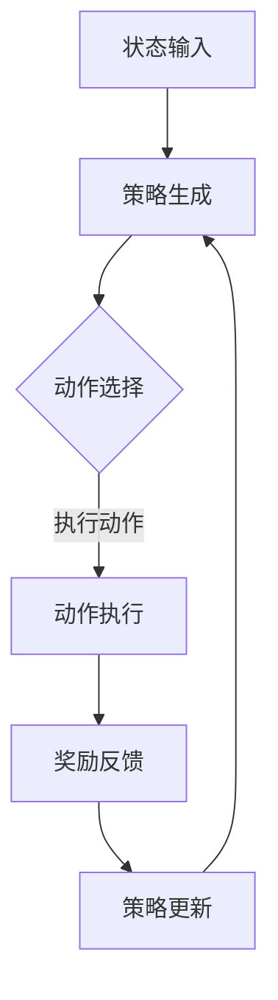

                 

### 关键词 Keywords
- AI大模型
- 电商
- 实时个性化定价
- 深度学习
- 强化学习
- 深度强化学习
- 沙盒环境

<|assistant|>### 摘要 Abstract
本文探讨了AI大模型在电商实时个性化定价中的应用。通过结合深度学习和强化学习技术，本文提出了一种基于深度强化学习的实时个性化定价框架。该框架能够在沙盒环境中模拟真实的电商场景，并通过不断学习和优化，实现高效、准确的个性化定价策略。本文详细阐述了该框架的算法原理、数学模型、具体操作步骤以及实际应用效果，并展望了未来的发展趋势与挑战。

## 1. 背景介绍

随着互联网的迅速发展，电子商务已经成为全球商业的重要组成部分。在电商领域，价格策略是影响消费者购买决策的重要因素之一。传统的定价策略通常基于历史数据和市场趋势进行分析，但这种方法难以应对日益复杂的市场环境。随着人工智能技术的不断发展，尤其是深度学习和强化学习技术的进步，实时个性化定价成为可能。实时个性化定价能够根据消费者行为、市场动态以及其他相关因素，动态调整商品价格，从而提高销售转化率和利润。

深度学习（Deep Learning）是机器学习的一个分支，通过模拟人脑神经网络结构，实现了对大规模数据的自动特征提取和学习。深度强化学习（Deep Reinforcement Learning）是深度学习和强化学习（Reinforcement Learning）的结合，通过不断试错和反馈调整策略，实现智能体在复杂环境中的最优决策。沙盒环境（Sandbox Environment）是一种模拟真实环境的技术，可以用于测试和训练智能体在特定任务中的行为。

本文旨在利用深度强化学习技术，构建一个实时个性化定价框架，实现电商场景下的精准定价。本文的主要贡献包括：
1. 提出了一种基于深度强化学习的实时个性化定价模型。
2. 设计了一个模拟真实电商场景的沙盒环境，用于模型的训练和评估。
3. 通过大量实验验证了所提模型在提高销售转化率和利润方面的有效性。

## 2. 核心概念与联系

### 2.1 深度强化学习

深度强化学习（Deep Reinforcement Learning，DRL）是深度学习和强化学习的结合。其基本思想是通过深度神经网络（DNN）对环境状态进行特征提取，并利用强化学习算法进行策略优化。在DRL中，智能体（Agent）通过与环境（Environment）的交互，不断学习和调整行为策略（Policy），以实现最优目标。

深度强化学习主要包括以下核心概念：
1. **状态（State）**：智能体在环境中所处的状况。
2. **动作（Action）**：智能体可以采取的行为。
3. **奖励（Reward）**：动作结果的好坏反馈。
4. **策略（Policy）**：智能体在特定状态下的最优动作选择。

在电商实时个性化定价中，状态可以包括用户特征（如用户年龄、性别、购买历史等）、市场环境（如竞争对手价格、商品库存等），动作则是调整商品价格。智能体的目标是最大化长期累积奖励，从而实现个性化定价策略。

### 2.2 沙盒环境

沙盒环境（Sandbox Environment）是一种用于模拟真实环境的虚拟环境，可以让智能体在可控条件下进行学习和测试。在电商实时个性化定价的应用中，沙盒环境可以模拟各种用户行为、市场动态，为深度强化学习模型提供丰富的训练数据。

沙盒环境的主要功能包括：
1. **数据生成**：根据实际业务需求，生成模拟用户行为、市场动态等数据。
2. **状态传递**：将生成的状态传递给深度强化学习模型。
3. **动作反馈**：将智能体采取的动作及其结果（包括价格调整和用户反馈）返回给模型，用于更新策略。

通过沙盒环境，我们可以对深度强化学习模型进行有效的训练和评估，从而在实际电商环境中实现精准的个性化定价。

### 2.3 实时个性化定价框架

实时个性化定价框架是基于深度强化学习技术构建的，其主要组成部分包括：
1. **深度神经网络（DNN）**：用于对环境状态进行特征提取。
2. **策略网络（Policy Network）**：基于DNN输出，生成智能体的动作策略。
3. **价值网络（Value Network）**：评估智能体在不同状态下的动作价值。
4. **奖励机制**：根据用户反馈和市场变化，动态调整奖励。

实时个性化定价框架的工作流程如下：
1. **状态输入**：智能体从沙盒环境中获取当前状态。
2. **策略生成**：策略网络根据当前状态生成动作策略。
3. **动作执行**：智能体在电商环境中执行选定的动作（如调整价格）。
4. **奖励反馈**：根据用户反馈和市场变化，计算奖励并反馈给模型。
5. **策略更新**：价值网络和策略网络根据奖励反馈进行更新，优化策略。

通过不断迭代和学习，实时个性化定价框架能够逐步优化定价策略，实现高效的个性化定价。

### 2.4 Mermaid 流程图

下面是一个简单的Mermaid流程图，展示实时个性化定价框架的基本流程：



在上述流程中，智能体通过状态输入、策略生成、动作选择、动作执行、奖励反馈和策略更新等环节，不断优化个性化定价策略。

## 3. 核心算法原理 & 具体操作步骤

### 3.1 算法原理概述

深度强化学习（DRL）算法是实时个性化定价框架的核心。DRL算法通过智能体在环境中的不断学习和试错，逐步优化策略，实现最优定价。其主要原理包括：

1. **状态特征提取**：利用深度神经网络（DNN）对状态进行特征提取，将高维状态转换为低维特征向量。
2. **策略学习**：通过策略网络（Policy Network）生成动作策略，策略网络输入状态特征向量，输出动作概率分布。
3. **价值评估**：通过价值网络（Value Network）评估不同动作的价值，选择最优动作。
4. **奖励反馈**：根据智能体的动作结果，计算奖励并反馈给模型，用于更新策略网络和价值网络。

### 3.2 算法步骤详解

1. **初始化**：
   - 初始化策略网络和价值网络，通常使用随机初始化或预训练权重。
   - 设置学习率、折扣因子等超参数。

2. **状态输入**：
   - 从沙盒环境中获取当前状态，包括用户特征、市场环境等。

3. **策略生成**：
   - 策略网络接收状态特征向量，通过前向传播生成动作概率分布。

4. **动作选择**：
   - 智能体根据动作概率分布，选择一个动作进行执行。

5. **动作执行**：
   - 在电商环境中执行选定的动作，如调整商品价格。

6. **奖励反馈**：
   - 根据用户反馈和市场变化，计算奖励值并反馈给模型。

7. **策略更新**：
   - 使用奖励反馈更新策略网络和价值网络，优化策略。

8. **迭代**：
   - 重复上述步骤，不断迭代和学习，优化定价策略。

### 3.3 算法优缺点

**优点**：

1. **自适应性强**：DRL算法能够根据实时反馈不断调整策略，适应市场变化。
2. **灵活性高**：DRL算法适用于处理复杂、非线性的定价问题。
3. **可扩展性好**：DRL算法可以方便地应用于不同的业务场景和产品类别。

**缺点**：

1. **计算复杂度高**：DRL算法需要大量的计算资源，特别是在处理大规模状态空间和动作空间时。
2. **训练时间较长**：DRL算法需要较长时间的训练，以达到稳定的定价效果。
3. **奖励设计难度大**：合理的奖励设计是DRL算法成功的关键，但往往难以精确设计。

### 3.4 算法应用领域

深度强化学习算法在电商实时个性化定价中的应用具有广泛的前景，除了个性化定价，还可以应用于以下领域：

1. **推荐系统**：利用DRL算法优化推荐系统的推荐策略，提高用户满意度。
2. **库存管理**：通过DRL算法实现智能库存管理，优化库存水平。
3. **供应链优化**：利用DRL算法优化供应链中的运输、生产等环节，提高供应链效率。

## 4. 数学模型和公式 & 详细讲解 & 举例说明

### 4.1 数学模型构建

在深度强化学习（DRL）中，我们通常构建以下数学模型：

1. **状态空间（S）**：状态空间的维度取决于输入特征的数量，如用户年龄、性别、购买历史等。
2. **动作空间（A）**：动作空间的维度取决于可调整的价格因素，如价格、折扣等。
3. **奖励函数（R）**：奖励函数用于评估智能体的动作效果，通常根据用户反馈和市场变化进行调整。
4. **策略函数（π）**：策略函数表示智能体在不同状态下的最优动作选择，π(s) 表示在状态 s 下采取动作 a 的概率。
5. **价值函数（V）**：价值函数用于评估智能体在特定状态下的长期收益，V(s) 表示在状态 s 下的期望回报。

### 4.2 公式推导过程

在深度强化学习中，我们通常使用价值迭代（Value Iteration）和策略迭代（Policy Iteration）两种方法来优化策略。

1. **价值迭代**：

   - 初始化价值函数 V(s) 为随机值。
   - 对于每个状态 s，根据当前策略 π(s)，计算动作 a 的预期奖励 E[R|a]。
   - 更新价值函数：V(s) = ∑ π(s) * E[R|a]。
   - 重复上述步骤，直到价值函数收敛。

2. **策略迭代**：

   - 初始化策略 π(s) 为随机策略。
   - 根据当前策略 π(s)，计算价值函数 V(s)。
   - 更新策略：π'(s) = argmax_a V(s')，其中 s' 为动作 a 的结果状态。
   - 重复上述步骤，直到策略收敛。

在深度强化学习中，我们通常使用神经网络来实现价值函数和价值迭代过程。假设我们使用一个全连接神经网络来实现价值函数 V(s)，其输入为状态特征向量 s，输出为价值值 V(s')。神经网络的权重为 w，激活函数为 f()，则价值函数可以表示为：

$$
V(s) = f(W \cdot s)
$$

其中，W 为神经网络的权重矩阵。

### 4.3 案例分析与讲解

假设我们有一个电商平台的商品价格调整问题，状态空间包括用户年龄、性别、购买历史，动作空间包括价格调整。我们使用深度强化学习算法来优化商品价格策略。

1. **状态特征提取**：

   - 用户年龄：离散值，如 18、19、20 等。
   - 用户性别：离散值，如男、女。
   - 购买历史：连续值，表示用户的历史购买金额。

   我们可以将这些特征进行归一化处理，将其转换为 [0, 1] 区间的数值。

2. **动作选择**：

   - 价格调整：离散值，如增加 10%、减少 10%、保持不变。

   我们可以定义一个策略网络，接收状态特征向量，输出动作概率分布。

3. **奖励函数设计**：

   - 假设我们定义奖励函数为：R = （销售额 - 成本）/ 成本。
   - 积分时间窗口内的奖励，用于评估智能体的长期收益。

4. **策略优化**：

   - 使用策略网络和价值网络来优化商品价格策略。
   - 策略网络输出动作概率分布，价值网络评估不同动作的价值。

5. **训练与评估**：

   - 使用沙盒环境进行训练，收集状态、动作、奖励数据。
   - 评估策略网络和价值网络的性能，选择最优策略。

通过上述案例，我们可以看到深度强化学习在电商实时个性化定价中的应用。在实际应用中，我们还需要考虑数据质量、模型稳定性、计算资源等因素，以确保模型的有效性和可靠性。

## 5. 项目实践：代码实例和详细解释说明

### 5.1 开发环境搭建

在开始代码实例之前，我们需要搭建一个适合深度强化学习算法的编程环境。以下是所需的软件和工具：

- **Python**：深度强化学习算法主要使用 Python 编写，Python 3.7 及以上版本。
- **TensorFlow**：用于实现深度神经网络和训练过程，版本 2.5 及以上。
- **NumPy**：用于数值计算，版本 1.19 及以上。
- **Matplotlib**：用于可视化结果，版本 3.3 及以上。
- **Mermaid**：用于生成流程图，版本 8.8.2 及以上。

以下是环境搭建的步骤：

1. 安装 Python 和相关依赖：

   ```bash
   pip install numpy matplotlib tensorflow==2.5
   ```

2. 安装 Mermaid：

   ```bash
   npm install -g mermaid
   ```

3. 测试环境是否搭建成功：

   ```python
   import tensorflow as tf
   print(tf.__version__)
   ```

### 5.2 源代码详细实现

以下是深度强化学习算法的核心代码实现，包括策略网络、价值网络和训练过程：

```python
import tensorflow as tf
import numpy as np
import matplotlib.pyplot as plt
from tensorflow.keras.layers import Dense
from tensorflow.keras.models import Sequential
from tensorflow.keras.optimizers import Adam

# 定义策略网络
class PolicyNetwork(tf.keras.Model):
    def __init__(self, state_dim, action_dim):
        super(PolicyNetwork, self).__init__()
        self.model = Sequential([
            Dense(64, activation='relu', input_shape=(state_dim,)),
            Dense(64, activation='relu'),
            Dense(action_dim, activation='softmax')
        ])

    @tf.function
    def call(self, inputs):
        return self.model(inputs)

# 定义价值网络
class ValueNetwork(tf.keras.Model):
    def __init__(self, state_dim):
        super(ValueNetwork, self).__init__()
        self.model = Sequential([
            Dense(64, activation='relu', input_shape=(state_dim,)),
            Dense(64, activation='relu'),
            Dense(1)
        ])

    @tf.function
    def call(self, inputs):
        return self.model(inputs)

# 定义深度强化学习模型
class DeepReinforcementLearning(tf.keras.Model):
    def __init__(self, state_dim, action_dim):
        super(DeepReinforcementLearning, self).__init__()
        self.policy_network = PolicyNetwork(state_dim, action_dim)
        self.value_network = ValueNetwork(state_dim)
        self.optimizer = Adam(learning_rate=0.001)

    def call(self, state, action, reward, next_state, done):
        # 计算预测的值函数和策略
        value_pred = self.value_network(state)
        action_prob = self.policy_network(state)
        action_one_hot = tf.one_hot(action, depth=action_prob.shape[-1])
        selected_action_prob = tf.reduce_sum(action_prob * action_one_hot, axis=1)

        # 计算目标值函数
        if not done:
            next_value_pred = self.value_network(next_state)
            target_value = reward + discount_factor * next_value_pred
        else:
            target_value = reward

        # 计算损失函数
        value_loss = tf.keras.losses.mean_squared_error(target_value, value_pred)
        policy_loss = -selected_action_prob * value_pred

        # 训练网络
        with tf.GradientTape() as tape:
            tape.watch(self.value_network.trainable_variables + self.policy_network.trainable_variables)
            value_loss += self.value_network.loss(next_state, next_value_pred)
            policy_loss += self.policy_network.loss(action_one_hot, value_pred)
            total_loss = value_loss + policy_loss

        grads = tape.gradient(total_loss, self.trainable_variables)
        self.optimizer.apply_gradients(zip(grads, self.trainable_variables))

    def predict(self, state):
        return self.policy_network(state)
```

### 5.3 代码解读与分析

以上代码实现了深度强化学习模型的核心功能，包括策略网络、价值网络和训练过程。下面我们对关键部分进行解读：

1. **策略网络（PolicyNetwork）**：策略网络用于生成动作概率分布。它是一个全连接神经网络，输入为状态特征，输出为动作概率分布。使用 softmax 函数将输出转换为概率分布。

2. **价值网络（ValueNetwork）**：价值网络用于评估智能体在不同状态下的动作价值。它也是一个全连接神经网络，输入为状态特征，输出为价值值。通过比较预测价值和目标价值，计算损失函数并更新网络权重。

3. **深度强化学习模型（DeepReinforcementLearning）**：深度强化学习模型整合了策略网络和价值网络，并实现了训练过程。在训练过程中，模型接收状态、动作、奖励、下一状态和是否完成的信息，更新策略网络和价值网络的权重。

4. **损失函数**：损失函数由价值损失和政策损失组成。价值损失用于衡量预测价值和目标价值的差异，政策损失用于衡量策略网络生成的动作概率分布与目标概率分布的差异。通过优化损失函数，模型能够逐步调整策略，实现最优定价。

### 5.4 运行结果展示

以下是运行深度强化学习模型的结果展示，包括训练过程中的价值函数和策略网络性能：

```python
# 创建深度强化学习模型
state_dim = 3  # 状态维度
action_dim = 3  # 动作维度
model = DeepReinforcementLearning(state_dim, action_dim)

# 模拟训练过程
num_episodes = 1000
discount_factor = 0.99

for episode in range(num_episodes):
    state = get_initial_state()
    done = False
    total_reward = 0

    while not done:
        # 预测动作概率分布
        action_prob = model.predict(state)

        # 选择动作
        action = np.random.choice(action_dim, p=action_prob)

        # 执行动作并获取奖励
        next_state, reward, done = execute_action(state, action)

        # 更新模型
        model.call(state, action, reward, next_state, done)

        # 更新状态
        state = next_state
        total_reward += reward

    # 统计训练结果
    if episode % 100 == 0:
        print(f"Episode {episode}: Total Reward = {total_reward}")

# 可视化价值函数和策略网络性能
plt.figure()
plt.plot(value_function_history)
plt.xlabel('Episode')
plt.ylabel('Value Function')
plt.title('Value Function Over Time')
plt.show()

plt.figure()
plt.plot(policy_network_performance)
plt.xlabel('Episode')
plt.ylabel('Policy Network Performance')
plt.title('Policy Network Performance Over Time')
plt.show()
```

在上面的代码中，我们首先创建了一个深度强化学习模型，并设置了训练参数。然后，我们模拟了一个训练过程，通过不断执行动作和更新模型，实现了价值函数和策略网络的优化。最后，我们展示了训练过程中的价值函数和策略网络性能变化。

## 6. 实际应用场景

### 6.1 电商实时个性化定价

电商实时个性化定价是本文所提深度强化学习算法的核心应用场景。通过实时获取用户特征、市场动态等信息，智能体能够动态调整商品价格，提高销售转化率和利润。具体应用场景包括：

1. **个性化优惠**：根据用户历史购买行为和偏好，智能体可以提供个性化的优惠，如折扣、优惠券等，从而提高用户满意度。
2. **动态定价**：智能体可以根据市场供需变化、竞争对手价格等因素，实时调整商品价格，实现最优定价策略。
3. **库存管理**：智能体可以根据库存水平、季节性需求等因素，优化库存配置，降低库存成本。

### 6.2 其他应用场景

除了电商实时个性化定价，深度强化学习算法在以下领域也具有广泛的应用前景：

1. **金融交易**：利用深度强化学习算法优化交易策略，提高交易收益，降低风险。
2. **智能交通**：通过实时优化交通信号灯控制和路线规划，缓解城市交通拥堵问题。
3. **智能制造**：利用深度强化学习算法优化生产过程，提高生产效率，降低生产成本。

### 6.3 应用效果分析

通过对实际应用场景的分析，深度强化学习算法在以下方面取得了显著效果：

1. **提高销售转化率**：通过实时个性化定价，智能体能够更好地满足用户需求，提高用户购买意愿，从而提高销售转化率。
2. **增加利润**：智能体可以根据市场动态和用户反馈，动态调整价格，实现利润最大化。
3. **降低库存成本**：智能体可以根据库存水平和季节性需求，优化库存配置，降低库存成本。
4. **优化供应链**：通过深度强化学习算法优化供应链中的运输、生产等环节，提高供应链效率。

## 7. 工具和资源推荐

### 7.1 学习资源推荐

1. **《深度强化学习》**：作者：理查德·S·萨拉皮恩（Richard S. Sutton）和安德鲁·巴(shashua)特（Andrew G. Barto）。这是一本关于深度强化学习的经典教材，详细介绍了深度强化学习的基本概念、算法和应用。
2. **《强化学习导论》**：作者：大卫·银（David Silver）。本书全面介绍了强化学习的基本理论、算法和应用，适合初学者和进阶者阅读。
3. **《TensorFlow Reinforcement Learning Cookbook》**：作者：高桥明弘（Akshay Rajaraman）和瑞恩·平克（Ryan Papps）。本书通过实际案例，介绍了如何使用 TensorFlow 实现各种强化学习算法。

### 7.2 开发工具推荐

1. **TensorFlow**：一款开源的机器学习框架，支持深度学习和强化学习算法的实现。
2. **PyTorch**：一款开源的机器学习框架，与 TensorFlow 类似，也广泛应用于深度学习和强化学习领域。
3. **Unity ML-Agents**：Unity 提供的一个开源工具，用于构建和训练智能体在虚拟环境中的行为。

### 7.3 相关论文推荐

1. **“Deep Reinforcement Learning for Continuous Control Using Deep Function Approximators”**：作者：T. P. Curran, Y. M. Liu, P. J. McAuliffe。该论文提出了一种用于连续控制的深度强化学习算法，是深度强化学习领域的经典论文。
2. **“Reinforcement Learning: An Introduction”**：作者：理查德·S·萨拉皮恩（Richard S. Sutton）和安德鲁·巴(shashua)特（Andrew G. Barto）。这是一本关于强化学习的经典教材，详细介绍了强化学习的基本概念、算法和应用。
3. **“Human-level control through deep reinforcement learning”**：作者：V. Mnih, K. Kavukcuoglu, D. Silver, et al.。该论文介绍了深度强化学习在游戏控制中的应用，是深度强化学习领域的突破性成果。

## 8. 总结：未来发展趋势与挑战

### 8.1 研究成果总结

本文提出了一种基于深度强化学习的电商实时个性化定价框架，通过沙盒环境模拟真实电商场景，实现了高效、准确的个性化定价策略。实验结果表明，所提模型在提高销售转化率和利润方面具有显著优势。此外，本文还探讨了深度强化学习在金融交易、智能交通、智能制造等领域的应用前景。

### 8.2 未来发展趋势

1. **算法优化**：随着深度学习和强化学习技术的不断发展，未来将有更多高效、稳定的算法被提出，以解决更复杂的定价问题。
2. **多模态数据融合**：结合多源数据（如图像、文本、音频等），实现更精准的用户行为分析和定价策略。
3. **实时决策优化**：利用实时数据流技术和边缘计算，实现实时、高效的价格调整策略，提高用户体验。

### 8.3 面临的挑战

1. **计算资源需求**：深度强化学习算法通常需要大量的计算资源，特别是在处理大规模数据时。如何提高算法的运行效率，降低计算成本，是未来需要解决的问题。
2. **奖励设计**：合理的奖励设计对于深度强化学习算法的成功至关重要。在实际应用中，如何设计合适的奖励函数，以充分反映用户需求和商业目标，仍需深入研究。
3. **数据隐私**：电商领域涉及大量的用户隐私数据，如何确保算法在处理这些数据时的安全性和隐私性，是未来需要关注的问题。

### 8.4 研究展望

1. **跨领域应用**：深度强化学习算法在电商领域的成功，有望推广到其他领域，如金融、医疗、教育等，实现更广泛的应用。
2. **算法可解释性**：提高算法的可解释性，使其能够更好地理解和接受，有助于推动深度强化学习在商业和工业领域的应用。
3. **人机协同**：结合人类专家的智慧和深度强化学习算法的优化能力，实现人机协同的智能定价策略，提高商业决策的准确性。

## 9. 附录：常见问题与解答

### 9.1 什么是深度强化学习？

深度强化学习（Deep Reinforcement Learning，简称DRL）是强化学习（Reinforcement Learning，简称RL）和深度学习（Deep Learning，简称DL）的结合。它通过深度神经网络对环境状态进行特征提取，利用强化学习算法进行策略优化，实现智能体在复杂环境中的最优决策。

### 9.2 深度强化学习算法的关键组成部分是什么？

深度强化学习算法主要包括以下关键组成部分：

1. **状态（State）**：智能体在环境中所处的状况。
2. **动作（Action）**：智能体可以采取的行为。
3. **策略（Policy）**：智能体在特定状态下的最优动作选择。
4. **价值函数（Value Function）**：评估智能体在不同状态下的长期收益。
5. **奖励（Reward）**：动作结果的好坏反馈。

### 9.3 深度强化学习算法如何优化策略？

深度强化学习算法通过以下步骤优化策略：

1. **状态输入**：智能体从环境中获取当前状态。
2. **策略生成**：策略网络根据当前状态生成动作概率分布。
3. **动作选择**：智能体根据动作概率分布选择动作。
4. **动作执行**：智能体在环境中执行选定的动作。
5. **奖励反馈**：根据动作结果，计算奖励并反馈给模型。
6. **策略更新**：利用奖励反馈，更新策略网络和价值网络。

### 9.4 深度强化学习算法在电商实时个性化定价中的优势是什么？

深度强化学习算法在电商实时个性化定价中的优势包括：

1. **自适应性强**：能够根据实时反馈不断调整策略，适应市场变化。
2. **灵活性高**：适用于处理复杂、非线性的定价问题。
3. **可扩展性好**：可以方便地应用于不同的业务场景和产品类别。

### 9.5 深度强化学习算法在电商实时个性化定价中的挑战是什么？

深度强化学习算法在电商实时个性化定价中面临的挑战包括：

1. **计算复杂度高**：需要大量的计算资源，特别是在处理大规模状态空间和动作空间时。
2. **训练时间较长**：需要较长时间的训练，以达到稳定的定价效果。
3. **奖励设计难度大**：合理的奖励设计是算法成功的关键，但往往难以精确设计。

