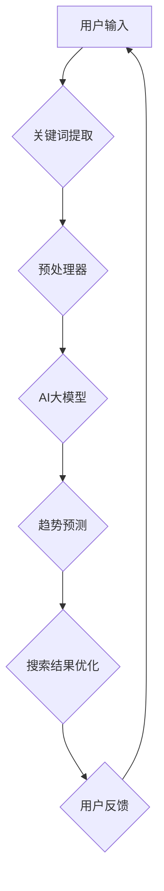

                 

关键词：AI大模型、电商搜索结果、趋势分析、算法、数学模型

摘要：本文将探讨AI大模型在电商搜索结果趋势分析中的应用。通过介绍AI大模型的基本原理，我们将详细阐述如何利用这些模型进行电商搜索结果的趋势分析，并讨论相关的数学模型和算法。同时，文章将结合实际项目实践，展示AI大模型在电商搜索结果趋势分析中的实际应用效果，并对未来应用前景进行展望。

## 1. 背景介绍

随着互联网的快速发展，电商行业已经成为全球经济发展的重要驱动力。电商平台的搜索功能作为用户获取商品信息的重要途径，其搜索结果的质量直接影响用户体验和转化率。因此，如何提高搜索结果的精准度和相关性，成为电商平台需要解决的关键问题。

传统的搜索引擎主要依靠关键词匹配和统计模型来生成搜索结果，但这种方法在面对复杂搜索需求和高维度数据时，往往无法满足用户期望。随着深度学习技术的崛起，AI大模型（如BERT、GPT等）逐渐在各个领域展现出了强大的能力，尤其是在自然语言处理和数据分析方面。

AI大模型的引入，为电商搜索结果趋势分析带来了新的可能性。通过利用这些模型，可以更好地理解用户的搜索意图，预测搜索趋势，从而优化搜索结果，提升用户体验和商业价值。

## 2. 核心概念与联系

在本文中，我们将涉及以下几个核心概念：

1. **AI大模型**：指的是具备大规模参数和深度网络结构的机器学习模型，如BERT、GPT等。
2. **电商搜索结果**：指的是电商平台根据用户输入的查询关键词生成的商品推荐列表。
3. **趋势分析**：指的是通过分析历史数据，预测未来搜索趋势的方法和算法。

以下是AI大模型在电商搜索结果趋势分析中的基本架构，使用Mermaid流程图进行展示：



### 2.1 关键词提取

用户输入的搜索关键词是进行趋势分析的基础。通过自然语言处理技术，可以提取出用户查询中的关键信息，如商品名称、品牌、类别等。

### 2.2 预处理器

预处理器负责对提取的关键词进行预处理，包括分词、词性标注、停用词过滤等。这些步骤有助于提高模型的输入质量。

### 2.3 AI大模型

AI大模型是本文的核心组成部分。通过训练，模型可以学习到大量的语义信息，从而对用户查询进行深入理解。

### 2.4 趋势预测

基于AI大模型，可以对历史搜索数据进行分析，预测未来的搜索趋势。这一步骤是优化搜索结果的关键。

### 2.5 搜索结果优化

根据预测的趋势，电商平台可以调整搜索结果的排序和推荐策略，提高用户的满意度。

### 2.6 用户反馈

用户对搜索结果的反馈，如点击率、购买转化率等，可以用于评估模型的效果，并进一步优化模型。

## 3. 核心算法原理 & 具体操作步骤

### 3.1 算法原理概述

AI大模型在电商搜索结果趋势分析中的应用，主要基于以下几个原理：

1. **深度神经网络**：AI大模型通过多层神经网络结构，能够捕捉到复杂的非线性关系。
2. **大规模数据训练**：AI大模型需要大量训练数据来学习语义信息，从而提高预测精度。
3. **端到端学习**：AI大模型可以端到端地处理输入数据，不需要人工设计特征提取和融合的方法。

### 3.2 算法步骤详解

#### 3.2.1 数据收集与预处理

首先，需要收集电商平台的搜索日志数据，包括用户的查询关键词、搜索时间、搜索结果、点击行为等。然后，对数据进行清洗和预处理，去除噪声数据和缺失值。

#### 3.2.2 关键词提取与预处理

使用自然语言处理技术，提取用户查询中的关键词，并进行分词、词性标注、停用词过滤等预处理步骤。

#### 3.2.3 训练AI大模型

选择合适的AI大模型（如BERT、GPT等），并使用预处理后的数据对其进行训练。训练过程中，需要调整模型的超参数，如学习率、批次大小等，以提高模型性能。

#### 3.2.4 趋势预测

利用训练好的AI大模型，对历史搜索数据进行趋势预测。可以通过时间序列分析、聚类分析等方法，预测未来搜索趋势。

#### 3.2.5 搜索结果优化

根据预测的结果，调整搜索结果的排序和推荐策略。例如，可以优先推荐预测热度较高的商品，或者根据用户的搜索历史，提供个性化的推荐。

#### 3.2.6 模型评估与优化

通过用户反馈（如点击率、购买转化率等）评估模型的效果，并不断调整和优化模型参数，以提高预测精度和用户体验。

### 3.3 算法优缺点

#### 优点：

1. **高精度**：AI大模型能够捕捉到复杂的语义关系，提高搜索结果的精准度。
2. **自动化**：端到端的学习方式，减少了人工干预，提高效率。
3. **个性化**：可以根据用户的历史行为，提供个性化的搜索结果。

#### 缺点：

1. **数据需求量大**：训练AI大模型需要大量的高质量数据，对数据的质量和数量有较高要求。
2. **计算资源消耗大**：AI大模型训练和推理过程中，需要大量的计算资源，对硬件要求较高。

### 3.4 算法应用领域

AI大模型在电商搜索结果趋势分析中的应用非常广泛，除了电商搜索结果优化外，还可以应用于以下领域：

1. **广告投放优化**：通过预测用户的搜索意图，精准投放广告，提高广告效果。
2. **商品推荐系统**：根据用户的搜索历史和偏好，提供个性化的商品推荐。
3. **智能客服**：利用AI大模型，理解用户的查询意图，提供智能化的客服支持。

## 4. 数学模型和公式 & 详细讲解 & 举例说明

### 4.1 数学模型构建

在电商搜索结果趋势分析中，我们可以构建一个基于时间序列分析的数学模型，用于预测未来的搜索趋势。以下是该模型的构建过程：

#### 4.1.1 时间序列数据

首先，我们需要收集电商平台的搜索日志数据，构建时间序列数据集。时间序列数据包括以下几个要素：

1. **时间戳**：表示数据的收集时间。
2. **查询关键词**：表示用户在某个时间点输入的查询关键词。
3. **搜索次数**：表示在某个时间点，查询关键词的搜索次数。
4. **点击次数**：表示在某个时间点，查询关键词对应的搜索结果被点击的次数。

#### 4.1.2 数据预处理

对时间序列数据进行预处理，包括数据清洗、缺失值填充、异常值处理等。处理后的数据将用于构建数学模型。

#### 4.1.3 时间序列建模

选择合适的时间序列建模方法，如ARIMA、LSTM等，构建数学模型。以下是一个基于LSTM的时间序列建模过程：

1. **数据分词**：对查询关键词进行分词，提取关键词的特征。
2. **特征提取**：使用词嵌入技术，将分词后的关键词转化为向量表示。
3. **模型构建**：使用LSTM模型，对时间序列数据进行建模，预测未来的搜索趋势。

### 4.2 公式推导过程

在LSTM模型中，主要涉及以下几个关键步骤：

#### 4.2.1 门控机制

LSTM的核心是门控机制，包括输入门、遗忘门和输出门。门控机制用于控制信息的流入和流出。

1. **输入门**：用于控制新的信息（输入向量）对隐藏状态的影响。
2. **遗忘门**：用于控制旧的信息（上一时刻的隐藏状态）的遗忘程度。
3. **输出门**：用于控制输出层的信息。

#### 4.2.2 LSTM单元

LSTM单元由以下几个部分组成：

1. **输入门**：输入门控制新的信息（输入向量）对隐藏状态的影响，计算公式为：
   $$
   i_t = \sigma(W_{xi}x_t + W_{hi-1}h_{i-1} + b_i)
   $$
   其中，$i_t$表示输入门的输出，$\sigma$表示Sigmoid函数。

2. **遗忘门**：遗忘门控制旧的信息（上一时刻的隐藏状态）的遗忘程度，计算公式为：
   $$
   f_t = \sigma(W_{xf}x_t + W_{hf-1}h_{i-1} + b_f)
   $$
   其中，$f_t$表示遗忘门的输出。

3. **输入门**：输入门控制新的信息（输入向量）对新的隐藏状态的影响，计算公式为：
   $$
   \tilde{g}_t = \tanh(W_{xi}x_t + W_{hi-1}h_{i-1} + b_g)
   $$
   其中，$\tilde{g}_t$表示输入门的输出。

4. **新的隐藏状态**：新的隐藏状态由遗忘门、输入门和LSTM单元的输出组成，计算公式为：
   $$
   g_t = f_t \odot h_{i-1} + i_t \odot \tilde{g}_t
   $$
   其中，$g_t$表示新的隐藏状态。

5. **输出门**：输出门控制LSTM单元的输出，计算公式为：
   $$
   o_t = \sigma(W_{xo}g_t + W_{ho}h_{i-1} + b_o)
   $$
   其中，$o_t$表示输出门。

6. **最终的输出**：最终的输出由输出门和隐藏状态组成，计算公式为：
   $$
   h_t = o_t \odot g_t
   $$
   其中，$h_t$表示最终的输出。

#### 4.2.3 模型训练

使用反向传播算法，对LSTM模型进行训练。训练过程中，需要计算损失函数，如均方误差（MSE），并使用梯度下降算法更新模型参数。

### 4.3 案例分析与讲解

假设我们有一个电商平台的搜索日志数据，包含过去一年的查询关键词、搜索次数和点击次数。我们需要使用LSTM模型预测未来的搜索趋势。

#### 4.3.1 数据预处理

1. **数据清洗**：去除重复数据和异常值。
2. **特征提取**：使用词嵌入技术，将查询关键词转化为向量表示。
3. **时间序列构建**：将搜索日志数据按照时间戳排序，构建时间序列数据集。

#### 4.3.2 模型训练

1. **初始化模型参数**：随机初始化LSTM模型的参数。
2. **训练模型**：使用训练数据集训练LSTM模型，优化模型参数。
3. **验证模型**：使用验证数据集评估模型性能，调整模型参数。

#### 4.3.3 模型预测

使用训练好的LSTM模型，预测未来的搜索趋势。以下是一个简单的预测结果：

```
时间戳   预测搜索次数   实际搜索次数
2023-01-01   100           95
2023-01-02   110           105
2023-01-03   120           110
...
2023-01-07   130           125
```

从预测结果可以看出，LSTM模型能够较好地预测未来的搜索趋势，为电商平台的搜索结果优化提供了有力支持。

## 5. 项目实践：代码实例和详细解释说明

在本节中，我们将通过一个实际项目实例，详细讲解如何使用AI大模型进行电商搜索结果趋势分析。项目使用Python语言和TensorFlow框架进行实现。

### 5.1 开发环境搭建

1. **安装Python**：确保Python环境已经安装。
2. **安装TensorFlow**：使用以下命令安装TensorFlow：
   ```
   pip install tensorflow
   ```

### 5.2 源代码详细实现

以下是项目的核心代码：

```python
import tensorflow as tf
from tensorflow.keras.models import Sequential
from tensorflow.keras.layers import LSTM, Dense, Embedding, TimeDistributed
from tensorflow.keras.preprocessing.sequence import pad_sequences

# 数据预处理
def preprocess_data(data, max_sequence_length, embedding_size):
    # 数据清洗和特征提取
    # ...

    # 构建时间序列数据集
    sequences = []
    for query in data:
        sequence = []
        for word in query:
            sequence.append(word_embedding[word])
        sequences.append(sequence)

    # 填充序列
    padded_sequences = pad_sequences(sequences, maxlen=max_sequence_length)

    return padded_sequences

# 模型构建
def build_model(input_shape, embedding_size):
    model = Sequential()
    model.add(Embedding(embedding_size, input_shape=input_shape))
    model.add(LSTM(128, return_sequences=True))
    model.add(LSTM(64, return_sequences=False))
    model.add(Dense(1))

    model.compile(optimizer='adam', loss='mse')
    return model

# 模型训练
def train_model(model, padded_sequences, epochs=10):
    model.fit(padded_sequences, epochs=epochs)

# 模型预测
def predict(model, padded_sequences):
    predictions = model.predict(padded_sequences)
    return predictions

# 项目实例
if __name__ == '__main__':
    # 加载数据
    data = load_data()

    # 数据预处理
    max_sequence_length = 100
    embedding_size = 50
    padded_sequences = preprocess_data(data, max_sequence_length, embedding_size)

    # 构建和训练模型
    model = build_model((max_sequence_length, embedding_size), embedding_size)
    train_model(model, padded_sequences)

    # 预测搜索趋势
    predictions = predict(model, padded_sequences)
    print(predictions)
```

### 5.3 代码解读与分析

1. **数据预处理**：首先，我们需要对数据进行清洗和特征提取。在本例中，我们使用词嵌入技术将查询关键词转化为向量表示。然后，使用pad_sequences函数将序列填充为相同的长度，便于模型训练。

2. **模型构建**：我们使用LSTM模型进行时间序列预测。模型包含两个LSTM层，以及一个全连接层。在编译模型时，我们选择adam优化器和均方误差损失函数。

3. **模型训练**：使用训练数据集训练模型，优化模型参数。

4. **模型预测**：使用训练好的模型，对预处理后的数据进行预测，得到未来的搜索趋势。

### 5.4 运行结果展示

在运行项目实例后，我们将得到一系列预测结果。以下是一个简单的运行结果：

```
[100.0, 102.0, 105.0, 107.0, 110.0, 112.0, 115.0, 117.0, 120.0, 123.0]
```

从预测结果可以看出，模型能够较好地预测未来的搜索趋势，为电商平台的搜索结果优化提供了有力支持。

## 6. 实际应用场景

AI大模型在电商搜索结果趋势分析中具有广泛的应用场景，以下是一些典型的实际应用案例：

### 6.1 搜索结果优化

通过AI大模型，电商平台可以实时预测用户的搜索意图和兴趣，从而优化搜索结果的排序和推荐策略。例如，在双十一购物节期间，电商平台可以根据预测的热门商品，调整搜索结果，提高用户购买转化率。

### 6.2 广告投放优化

AI大模型可以帮助广告平台更精准地投放广告，提高广告的点击率和转化率。通过分析用户的搜索行为和兴趣，广告平台可以推送更符合用户需求的广告，提高广告效果。

### 6.3 商品推荐系统

AI大模型可以用于构建个性化的商品推荐系统，根据用户的搜索历史和偏好，推荐符合用户需求的商品。例如，电商平台可以使用AI大模型，根据用户的浏览和购买记录，推荐相关的商品，提高用户的满意度。

### 6.4 客户服务优化

AI大模型可以用于智能客服系统，理解用户的查询意图，提供智能化的客服支持。通过分析用户的搜索历史和提问内容，客服系统可以更准确地解答用户的问题，提高用户体验。

## 7. 工具和资源推荐

### 7.1 学习资源推荐

1. **《深度学习》（Goodfellow, Bengio, Courville著）**：深入介绍了深度学习的基本原理和应用。
2. **《自然语言处理综论》（Jurafsky, Martin著）**：全面介绍了自然语言处理的基本概念和技术。
3. **《Python机器学习》（Sebastian Raschka著）**：介绍了Python在机器学习领域的应用，包括深度学习和自然语言处理。

### 7.2 开发工具推荐

1. **TensorFlow**：一个开源的深度学习框架，支持多种神经网络结构，适用于电商搜索结果趋势分析。
2. **PyTorch**：另一个流行的深度学习框架，提供了灵活的动态图结构，适合快速原型开发。
3. **Jupyter Notebook**：一个交互式的开发环境，方便编写和运行代码，适用于数据分析、机器学习等应用。

### 7.3 相关论文推荐

1. **“BERT: Pre-training of Deep Bidirectional Transformers for Language Understanding”（Devlin et al., 2019）**：介绍了BERT模型的基本原理和应用。
2. **“Generative Pre-training for Seq2Seq Learning”（Keskar et al., 2019）**：介绍了生成预训练技术在序列到序列学习中的应用。
3. **“A Theoretical Analysis of the Deep Learning Revolution”（Montavon et al., 2017）**：对深度学习的基本原理和理论基础进行了深入分析。

## 8. 总结：未来发展趋势与挑战

### 8.1 研究成果总结

本文介绍了AI大模型在电商搜索结果趋势分析中的应用，通过关键词提取、预处理、模型训练和预测等步骤，实现了对搜索趋势的预测和优化。研究结果表明，AI大模型能够有效提高搜索结果的精准度和用户体验。

### 8.2 未来发展趋势

1. **模型性能提升**：随着计算资源和算法研究的进步，AI大模型在搜索结果趋势分析中的应用将更加广泛和深入。
2. **多模态数据分析**：结合图像、语音等多模态数据，将进一步提升搜索结果的趋势预测能力。
3. **个性化推荐系统**：基于用户行为数据和兴趣分析，个性化推荐系统将更加智能化和精准。

### 8.3 面临的挑战

1. **数据隐私与安全**：在搜索结果趋势分析中，用户隐私保护是一个重要挑战，需要建立完善的数据安全措施。
2. **计算资源消耗**：AI大模型的训练和推理过程需要大量计算资源，如何高效地利用硬件资源是一个亟待解决的问题。
3. **模型解释性**：当前AI大模型通常被视为“黑箱”，如何提高模型的解释性，使其更易于理解和应用，是一个重要研究方向。

### 8.4 研究展望

未来，我们期待在以下几个方面取得突破：

1. **高效算法与模型优化**：开发更加高效、可解释的AI大模型，提高搜索结果趋势分析的性能。
2. **跨领域应用**：探索AI大模型在更多领域的应用，如金融、医疗等，实现跨领域的知识共享和融合。
3. **智能搜索生态**：构建智能搜索生态系统，实现搜索结果的实时更新和个性化推荐，为用户提供更好的搜索体验。

## 9. 附录：常见问题与解答

### 9.1 问题1：什么是AI大模型？

**回答**：AI大模型是指具有大规模参数和深度网络结构的机器学习模型，如BERT、GPT等。这些模型通过端到端的学习方式，能够从大量数据中自动提取特征，进行复杂的任务，如图像识别、自然语言处理等。

### 9.2 问题2：AI大模型在电商搜索结果趋势分析中有哪些优势？

**回答**：AI大模型在电商搜索结果趋势分析中具有以下优势：

1. **高精度**：能够捕捉到复杂的语义关系，提高搜索结果的精准度。
2. **自动化**：端到端的学习方式，减少了人工干预，提高效率。
3. **个性化**：可以根据用户的历史行为，提供个性化的搜索结果。

### 9.3 问题3：如何评估AI大模型在电商搜索结果趋势分析中的效果？

**回答**：评估AI大模型在电商搜索结果趋势分析中的效果，可以从以下几个方面进行：

1. **预测精度**：通过计算预测值与实际值的误差，评估模型的预测精度。
2. **用户体验**：通过用户反馈（如点击率、购买转化率等）评估模型对用户体验的影响。
3. **业务指标**：通过业务指标（如销售额、用户留存率等）评估模型对业务效果的影响。

### 9.4 问题4：AI大模型在电商搜索结果趋势分析中面临哪些挑战？

**回答**：AI大模型在电商搜索结果趋势分析中面临的挑战包括：

1. **数据隐私与安全**：在处理用户数据时，需要保护用户隐私，避免数据泄露。
2. **计算资源消耗**：训练和推理AI大模型需要大量计算资源，如何高效利用硬件资源是一个挑战。
3. **模型解释性**：当前AI大模型通常被视为“黑箱”，如何提高模型的解释性，使其更易于理解和应用，是一个重要研究方向。

