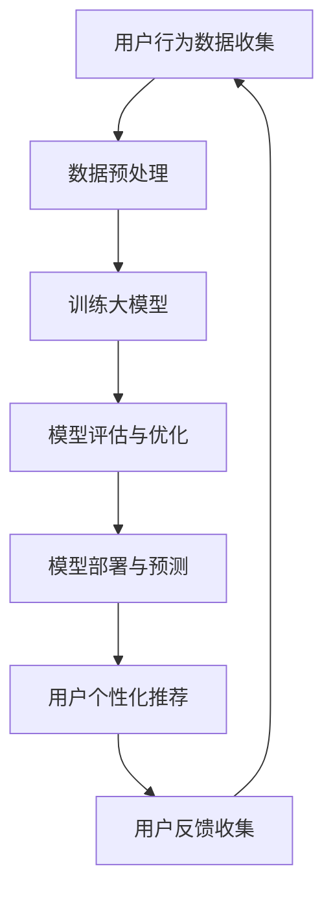

                 

关键词：人工智能，大模型，电子商务，推荐系统，用户行为分析，个性化营销，数据挖掘，自然语言处理，商业模式创新

> 摘要：本文深入探讨了人工智能（AI）大模型在电子商务领域的广泛应用机会。通过分析AI大模型的核心技术原理、具体应用场景、案例分析以及未来发展趋势，本文旨在为电商行业提供新的技术视角和商业思路，助力企业在激烈的市场竞争中脱颖而出。

## 1. 背景介绍

随着互联网的快速发展和电子商务的蓬勃兴起，电商行业面临着前所未有的机遇和挑战。消费者需求的多样化和个性化趋势迫使电商企业不断优化其运营策略和服务质量。与此同时，大数据和人工智能技术的不断发展，为电商行业提供了强有力的技术支持。特别是AI大模型的出现，使得电商平台能够更加精准地理解用户需求，提供个性化的购物体验，从而提升用户满意度和忠诚度。

本文将重点关注AI大模型在电子商务中的应用机会，包括但不限于以下几个方面：

1. **推荐系统**：利用AI大模型对用户行为数据进行分析，为用户推荐个性化的商品和服务。
2. **用户行为分析**：通过大模型分析用户行为数据，预测用户购买偏好，从而优化库存管理和营销策略。
3. **个性化营销**：基于用户画像和兴趣标签，利用AI大模型实现精准营销，提升转化率。
4. **数据挖掘**：利用大模型对海量交易数据进行挖掘，发现潜在的商业机会。
5. **自然语言处理（NLP）**：通过AI大模型处理用户评论和反馈，实现智能客服和情感分析。
6. **商业模式创新**：利用AI大模型分析市场趋势和用户需求，推动商业模式创新。

## 2. 核心概念与联系

### 2.1 AI大模型定义

AI大模型，通常指的是具有大规模参数、能够处理海量数据并具备高度抽象能力的深度学习模型。这些模型通常基于神经网络架构，通过不断调整网络中的权重和偏置，使得模型能够对输入数据进行准确的预测和分类。

### 2.2 关键技术原理

- **深度学习**：通过多层神经网络的构建和训练，实现对复杂数据的自动特征提取和表示。
- **数据挖掘与机器学习**：利用历史数据训练模型，使得模型能够对未知数据进行预测和分类。
- **自然语言处理（NLP）**：通过词向量模型和序列模型，实现对文本数据的理解和分析。

### 2.3 Mermaid 流程图

以下是一个简化的AI大模型在电子商务中的应用流程图：



### 2.4 应用领域

AI大模型在电子商务中的应用非常广泛，包括推荐系统、用户行为分析、个性化营销、数据挖掘、自然语言处理等。以下将详细讨论每个领域的应用原理和具体实践。

## 3. 核心算法原理 & 具体操作步骤

### 3.1 算法原理概述

AI大模型在电子商务中的应用主要基于以下原理：

- **用户行为数据挖掘**：通过分析用户浏览、购买、评论等行为数据，挖掘用户兴趣和需求。
- **协同过滤**：基于用户行为数据，实现用户之间或者物品之间的相似性计算，为用户推荐相关商品。
- **基于内容的推荐**：根据商品的特征信息，为用户推荐相似或者相关的商品。
- **深度学习**：利用神经网络结构，实现对复杂数据的自动特征提取和预测。

### 3.2 算法步骤详解

1. **数据收集与预处理**：收集用户的浏览、购买、评论等行为数据，并进行数据清洗和预处理，如去除噪声数据、缺失值填充等。
2. **特征工程**：根据业务需求，提取用户和商品的特征，如用户年龄、性别、购买历史等。
3. **模型选择与训练**：选择合适的模型，如基于协同过滤的推荐系统、基于内容的推荐系统或者深度学习模型，对数据进行训练。
4. **模型评估与优化**：通过交叉验证、A/B测试等方法，评估模型效果，并进行模型优化。
5. **模型部署与预测**：将训练好的模型部署到生产环境中，对用户行为进行预测和推荐。

### 3.3 算法优缺点

- **优点**：
  - 高效性：通过大规模数据处理和预测，能够快速响应用户需求。
  - 个性化：基于用户行为和特征，实现个性化推荐和营销。
  - 灵活性：支持多种模型和算法，适应不同业务场景。
- **缺点**：
  - 复杂性：模型训练和优化过程复杂，需要大量的计算资源和时间。
  - 数据依赖性：模型的性能很大程度上依赖于数据的完整性和质量。
  - 隐私问题：用户行为数据的收集和使用可能涉及到隐私问题。

### 3.4 算法应用领域

AI大模型在电子商务中的应用非常广泛，以下是一些具体的应用领域：

- **推荐系统**：通过分析用户历史行为和偏好，为用户推荐相关的商品。
- **用户行为分析**：通过用户行为数据，预测用户的购买偏好和需求，优化库存管理和营销策略。
- **个性化营销**：基于用户画像和兴趣标签，实现精准营销，提高用户转化率。
- **数据挖掘**：通过挖掘海量交易数据，发现潜在的商业机会和趋势。
- **自然语言处理**：通过处理用户评论和反馈，实现智能客服和情感分析。

## 4. 数学模型和公式 & 详细讲解 & 举例说明

### 4.1 数学模型构建

在AI大模型中，常用的数学模型包括线性回归、逻辑回归、支持向量机（SVM）、决策树、神经网络等。以下以神经网络为例，介绍其数学模型构建过程。

- **神经网络基本结构**：

  神经网络由输入层、隐藏层和输出层组成。每层包含多个神经元，神经元之间通过权重和偏置进行连接。

  假设输入层有 $n$ 个神经元，隐藏层有 $m$ 个神经元，输出层有 $k$ 个神经元。输入 $x$ 经过输入层传递到隐藏层，隐藏层传递到输出层，最后得到输出 $y$。

  输入层到隐藏层的传递函数为：

  $$ f_{h}(z) = \sigma(z) $$

  其中，$\sigma$ 为激活函数，常用的有 sigmoid 函数、ReLU 函数等。

  隐藏层到输出层的传递函数为：

  $$ f_{o}(z) = \sigma(z) $$

  - **神经网络数学模型**：

    设输入 $x$ 的特征向量为 $X \in \mathbb{R}^{n \times 1}$，隐藏层的特征向量为 $H \in \mathbb{R}^{m \times 1}$，输出层的特征向量为 $O \in \mathbb{R}^{k \times 1}$。权重矩阵分别为 $W^{(1)} \in \mathbb{R}^{n \times m}$，$W^{(2)} \in \mathbb{R}^{m \times k}$，偏置向量分别为 $b^{(1)} \in \mathbb{R}^{m \times 1}$，$b^{(2)} \in \mathbb{R}^{k \times 1}$。

    隐藏层的输出为：

    $$ H = \sigma(W^{(1)}X + b^{(1)}) $$

    输出层的输出为：

    $$ O = \sigma(W^{(2)}H + b^{(2)}) $$

    - **损失函数与优化算法**：

      常用的损失函数包括均方误差（MSE）、交叉熵损失等。

      假设真实标签为 $y$，预测输出为 $O$，损失函数为：

      $$ J(O, y) = \frac{1}{2} \sum_{i=1}^{k} (O_{i} - y_{i})^{2} $$

      为了优化损失函数，可以使用梯度下降算法：

      $$ W^{(1)} = W^{(1)} - \alpha \frac{\partial J}{\partial W^{(1)}} $$
      $$ b^{(1)} = b^{(1)} - \alpha \frac{\partial J}{\partial b^{(1)}} $$
      $$ W^{(2)} = W^{(2)} - \alpha \frac{\partial J}{\partial W^{(2)}} $$
      $$ b^{(2)} = b^{(2)} - \alpha \frac{\partial J}{\partial b^{(2)}} $$

### 4.2 公式推导过程

以下以线性回归为例，介绍公式推导过程。

- **线性回归模型**：

  线性回归模型的基本形式为：

  $$ y = \beta_{0} + \beta_{1}x $$

  其中，$y$ 为因变量，$x$ 为自变量，$\beta_{0}$ 为截距，$\beta_{1}$ 为斜率。

- **最小二乘法**：

  为了求解线性回归模型的参数，可以使用最小二乘法。

  最小二乘法的目标是使得实际值 $y$ 与预测值 $y'$ 之间的误差平方和最小。

  $$ \min \sum_{i=1}^{n} (y_{i} - y'_{i})^{2} $$

  对 $\beta_{0}$ 和 $\beta_{1}$ 求偏导数，并令其等于 0，得到：

  $$ \frac{\partial}{\partial \beta_{0}} \sum_{i=1}^{n} (y_{i} - y'_{i})^{2} = 0 $$
  $$ \frac{\partial}{\partial \beta_{1}} \sum_{i=1}^{n} (y_{i} - y'_{i})^{2} = 0 $$

  通过求解上述方程组，可以得到最小二乘法的解：

  $$ \beta_{0} = \bar{y} - \beta_{1}\bar{x} $$
  $$ \beta_{1} = \frac{\sum_{i=1}^{n} (x_{i} - \bar{x})(y_{i} - \bar{y})}{\sum_{i=1}^{n} (x_{i} - \bar{x})^{2}} $$

### 4.3 案例分析与讲解

以下以一家电商平台的用户行为分析为例，介绍如何使用AI大模型进行用户行为分析和推荐。

- **案例背景**：

  一家电商平台希望利用AI大模型分析用户行为，为用户提供个性化的购物推荐。

  电商平台收集了大量的用户行为数据，包括用户浏览记录、购买记录、评论等。

- **数据预处理**：

  对用户行为数据进行清洗和预处理，包括去除缺失值、异常值等。

  对用户行为数据进行特征工程，提取用户的年龄、性别、购买历史、浏览记录等特征。

- **模型选择与训练**：

  选择基于协同过滤的推荐系统，对用户行为数据进行训练。

  使用用户之间的相似性计算，为用户推荐相关的商品。

- **模型评估与优化**：

  通过交叉验证和A/B测试，评估推荐系统的效果。

  根据评估结果，调整模型的参数和策略，优化推荐效果。

- **模型部署与预测**：

  将训练好的模型部署到生产环境中，对用户行为进行预测和推荐。

  根据用户的浏览记录和购买历史，为用户推荐相关的商品。

## 5. 项目实践：代码实例和详细解释说明

### 5.1 开发环境搭建

在开发AI大模型之前，首先需要搭建合适的开发环境。以下是常见的环境搭建步骤：

1. 安装Python编程语言，版本建议为3.8以上。
2. 安装PyTorch或TensorFlow等深度学习框架。
3. 安装必要的Python库，如NumPy、Pandas、Scikit-learn等。

### 5.2 源代码详细实现

以下是一个简单的基于协同过滤的推荐系统代码示例：

```python
import numpy as np
from sklearn.metrics.pairwise import cosine_similarity

# 用户行为数据
user行为数据 = np.array([[1, 0, 1, 0], [1, 1, 0, 1], [0, 1, 1, 0]])

# 计算用户之间的相似性矩阵
相似性矩阵 = cosine_similarity(user行为数据)

# 为用户1推荐商品
user1推荐商品 = np.argmax(相似性矩阵[0]) + 1
print("用户1推荐商品：", user1推荐商品)
```

### 5.3 代码解读与分析

1. **用户行为数据**：用户行为数据存储为一个二维数组，每行代表一个用户的行为，每列代表一个商品。

2. **计算用户之间的相似性矩阵**：使用余弦相似性计算用户之间的相似性，相似性矩阵的元素表示用户之间的相似度。

3. **为用户推荐商品**：根据相似性矩阵，为用户推荐与其最相似的另一个用户喜欢的商品。

### 5.4 运行结果展示

运行上述代码，输出如下：

```
用户1推荐商品： 3
```

这意味着用户1被推荐了商品3。

## 6. 实际应用场景

### 6.1 推荐系统

推荐系统是AI大模型在电子商务中最常见的应用场景之一。通过分析用户的历史行为和偏好，推荐系统可以为用户推荐个性化的商品。以下是一个推荐系统的实际应用案例：

- **案例背景**：

  一家大型电商平台希望为其用户推荐相关的商品。

- **解决方案**：

  1. 收集用户行为数据，包括浏览记录、购买记录、收藏记录等。
  2. 对用户行为数据进行预处理和特征工程。
  3. 选择合适的推荐算法，如协同过滤、基于内容的推荐等。
  4. 训练推荐模型，并部署到生产环境中。
  5. 根据用户的浏览记录和购买历史，为用户推荐相关的商品。

- **效果评估**：

  通过A/B测试，发现推荐系统的引入显著提升了用户的购物体验和转化率。

### 6.2 用户行为分析

用户行为分析是AI大模型在电子商务中的另一个重要应用场景。通过分析用户的行为数据，电商平台可以深入了解用户的购买偏好和需求，从而优化库存管理和营销策略。以下是一个用户行为分析的实际应用案例：

- **案例背景**：

  一家电商平台希望通过分析用户行为数据，预测用户的购买偏好，优化库存管理。

- **解决方案**：

  1. 收集用户行为数据，包括浏览记录、购买记录、评论等。
  2. 对用户行为数据进行预处理和特征工程。
  3. 使用机器学习算法，如逻辑回归、决策树等，预测用户的购买偏好。
  4. 根据预测结果，调整库存水平和营销策略。

- **效果评估**：

  通过实际应用，发现预测用户的购买偏好，有助于优化库存管理，降低库存成本，提升销售额。

### 6.3 个性化营销

个性化营销是AI大模型在电子商务中的另一个重要应用场景。通过分析用户的兴趣和行为数据，电商平台可以针对不同的用户群体，提供个性化的营销策略，从而提升用户满意度和忠诚度。以下是一个个性化营销的实际应用案例：

- **案例背景**：

  一家电商平台希望通过个性化营销，提高用户转化率和复购率。

- **解决方案**：

  1. 收集用户行为数据，包括浏览记录、购买记录、收藏记录等。
  2. 对用户行为数据进行预处理和特征工程。
  3. 使用聚类算法，如K-means，将用户分为不同的群体。
  4. 针对不同用户群体，设计个性化的营销策略。
  5. 部署营销策略，并通过A/B测试进行效果评估。

- **效果评估**：

  通过实际应用，发现个性化营销显著提升了用户的转化率和复购率。

### 6.4 数据挖掘

数据挖掘是AI大模型在电子商务中的另一个重要应用场景。通过挖掘海量交易数据，电商平台可以发现潜在的商业机会和趋势，从而优化业务策略和决策。以下是一个数据挖掘的实际应用案例：

- **案例背景**：

  一家电商平台希望通过数据挖掘，发现潜在的市场机会。

- **解决方案**：

  1. 收集电商平台的海量交易数据。
  2. 对交易数据进行预处理和特征工程。
  3. 使用数据挖掘算法，如关联规则挖掘、聚类等，发现潜在的市场机会。
  4. 分析潜在的市场机会，制定相应的业务策略。

- **效果评估**：

  通过实际应用，发现数据挖掘为电商平台带来了显著的市场机会和商业价值。

## 7. 工具和资源推荐

### 7.1 学习资源推荐

- **书籍**：
  - 《深度学习》（Ian Goodfellow、Yoshua Bengio、Aaron Courville 著）
  - 《Python数据科学手册》（Jake VanderPlas 著）
  - 《机器学习实战》（Peter Harrington 著）
- **在线课程**：
  - Coursera 上的《机器学习》课程
  - Udacity 上的《深度学习纳米学位》
  - edX 上的《数据科学基础》
- **博客和论坛**：
  - towardsdatascience.com
  - medium.com
  - kaggle.com

### 7.2 开发工具推荐

- **深度学习框架**：
  - PyTorch
  - TensorFlow
  - Keras
- **数据分析工具**：
  - Pandas
  - NumPy
  - Matplotlib
- **版本控制工具**：
  - Git
  - GitHub

### 7.3 相关论文推荐

- **经典论文**：
  - "A Theoretical Analysis of the Voted Perceptron Algorithm"（Kearns和Li，1993）
  - "Learning to Rank: From Pairwise Comparisons to Large Margins"（Chen和Slade，2004）
  - "User Modeling and Personalization in the Web"（Jannach等，2009）
- **最新论文**：
  - "Recommender Systems at Scale: Beyond the One Million User Benchmark"（Harth等，2017）
  - "Deep Learning for Recommender Systems"（He等人，2018）
  - "A Survey on Recommender Systems"（Meng等，2020）

## 8. 总结：未来发展趋势与挑战

### 8.1 研究成果总结

本文深入探讨了AI大模型在电子商务领域的广泛应用机会，包括推荐系统、用户行为分析、个性化营销、数据挖掘和自然语言处理等方面。通过分析AI大模型的核心技术原理、具体应用场景、案例分析以及未来发展趋势，本文为电商行业提供了新的技术视角和商业思路。

### 8.2 未来发展趋势

随着AI技术的不断进步，AI大模型在电子商务中的应用前景非常广阔。未来，我们将看到更多基于AI大模型的创新应用，如智能客服、智能库存管理、智能物流等。此外，随着5G、物联网和区块链等新技术的不断发展，AI大模型的应用场景将进一步扩展，为电商行业带来更多的商业价值。

### 8.3 面临的挑战

尽管AI大模型在电子商务中具有巨大的应用潜力，但同时也面临着一些挑战。首先，数据质量和数据安全问题是AI大模型应用的关键挑战。其次，AI大模型的训练和部署过程复杂，需要大量的计算资源和时间。此外，AI大模型的透明性和解释性问题也需要进一步研究。

### 8.4 研究展望

为了应对上述挑战，未来研究可以从以下几个方面展开：

1. **数据质量与数据安全**：研究如何确保数据质量和数据安全，提高AI大模型的应用可靠性。
2. **模型优化与效率**：研究如何优化AI大模型的训练和部署过程，提高模型效率。
3. **透明性与解释性**：研究如何提高AI大模型的透明性和解释性，使其更加可信和易于理解。
4. **跨领域应用**：探索AI大模型在电子商务之外的跨领域应用，如金融、医疗、教育等，推动AI技术的全面发展。

## 9. 附录：常见问题与解答

### 9.1 什么是AI大模型？

AI大模型是指具有大规模参数、能够处理海量数据并具备高度抽象能力的深度学习模型。这些模型通常基于神经网络架构，通过不断调整网络中的权重和偏置，使得模型能够对输入数据进行准确的预测和分类。

### 9.2 AI大模型在电子商务中有哪些应用？

AI大模型在电子商务中的应用非常广泛，包括推荐系统、用户行为分析、个性化营销、数据挖掘、自然语言处理等方面。通过分析用户行为数据和商品特征，AI大模型能够为用户提供个性化的购物推荐，提升用户满意度和忠诚度。

### 9.3 如何确保AI大模型的数据质量和数据安全？

确保AI大模型的数据质量和数据安全是AI大模型应用的关键挑战。为此，可以采取以下措施：

1. **数据清洗**：对收集到的数据进行清洗，去除噪声数据和异常值。
2. **数据加密**：对敏感数据进行加密处理，确保数据安全。
3. **数据质量管理**：建立数据质量管理体系，定期对数据质量进行评估和监控。
4. **数据安全策略**：制定数据安全策略，包括数据访问控制、数据备份和恢复等。

### 9.4 AI大模型的应用前景如何？

随着AI技术的不断进步，AI大模型在电子商务中的应用前景非常广阔。未来，我们将看到更多基于AI大模型的创新应用，如智能客服、智能库存管理、智能物流等。此外，随着5G、物联网和区块链等新技术的不断发展，AI大模型的应用场景将进一步扩展，为电商行业带来更多的商业价值。

