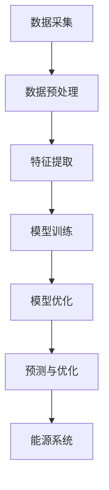

                 

关键词：人工智能，能源管理，大模型，应用前景，算法，数学模型，项目实践，工具推荐

## 摘要

本文将深入探讨人工智能大模型在能源管理领域的应用前景。随着能源需求的不断增长和可再生能源的日益普及，能源管理变得愈发复杂和重要。人工智能，特别是大模型技术，为解决能源管理中的挑战提供了强大的工具。本文将首先介绍能源管理的背景和重要性，然后详细阐述大模型的核心概念和应用原理。随后，我们将通过具体案例分析和项目实践，展示大模型在能源管理中的实际应用效果。最后，本文将探讨未来发展趋势、面临的技术挑战以及研究展望。

## 1. 背景介绍

### 能源管理的挑战

能源管理是现代社会的核心问题之一。随着全球经济的持续增长，能源需求不断攀升。然而，传统能源资源的有限性和环境问题迫使我们必须寻找更加高效、可持续的能源管理方法。此外，能源市场的不稳定性和能源价格的波动性也对能源管理提出了严峻挑战。在这样的背景下，能源管理不仅要提高能源利用效率，还要确保能源供应的稳定性和可持续性。

### 人工智能与能源管理

人工智能（AI）是近年来发展迅速的技术领域，通过模拟人类智能行为，AI在各个行业中展现出了巨大的潜力。在能源管理领域，人工智能可以通过数据分析、预测建模、优化算法等方式，提高能源利用效率，降低能源消耗，实现能源系统的智能化和自动化。特别是大模型技术，它通过训练大量的数据集，能够捕捉复杂的能源系统特性，提供更精确的预测和优化方案。

### 大模型技术

大模型技术是指通过大规模数据集和强大的计算资源进行训练的深度学习模型。这些模型具有处理海量数据、自动发现数据规律和特征的能力。大模型技术在图像识别、自然语言处理、语音识别等领域取得了显著成果，这些成功也为其在能源管理领域的应用提供了强有力的支持。

## 2. 核心概念与联系

### 核心概念

在能源管理中，大模型技术的核心概念包括：

- **数据采集与预处理**：收集能源系统中的各种数据，包括电力、热力、燃气等，并进行预处理，如数据清洗、数据标准化等。

- **特征提取与选择**：从原始数据中提取有助于预测和优化的重要特征，并选择最相关的特征。

- **模型训练与优化**：使用大量历史数据训练深度学习模型，并通过优化算法提高模型的准确性和泛化能力。

- **预测与优化**：利用训练好的模型进行能源需求预测和优化，以实现能源系统的最优运行。

### Mermaid 流程图

以下是一个简化的Mermaid流程图，展示了大模型在能源管理中的核心概念和流程：



## 3. 核心算法原理 & 具体操作步骤

### 3.1 算法原理概述

大模型在能源管理中的核心算法主要基于深度学习，尤其是神经网络。深度学习模型通过多层神经元的堆叠，能够自动学习数据的层次结构和复杂模式。在能源管理中，这些模型可以用于：

- **能源需求预测**：根据历史数据和实时数据预测未来的能源需求。
- **能源消耗优化**：通过优化算法降低能源消耗，提高能源利用效率。
- **能源系统调度**：对能源系统进行实时调度，确保能源供应的稳定性和可靠性。

### 3.2 算法步骤详解

1. **数据采集与预处理**：
   - 收集能源系统中的各种数据，如电力负荷、温度、湿度、设备运行状态等。
   - 进行数据清洗，去除异常值和噪声。
   - 对数据进行标准化处理，确保不同数据之间的可比性。

2. **特征提取与选择**：
   - 从原始数据中提取有助于预测和优化的特征，如时间序列特征、气象数据、节假日信息等。
   - 使用特征选择算法，选择最相关的特征，减少特征维度。

3. **模型训练与优化**：
   - 使用提取的特征训练深度学习模型，如卷积神经网络（CNN）、循环神经网络（RNN）等。
   - 使用优化算法，如随机梯度下降（SGD）、Adam优化器等，提高模型的准确性和泛化能力。

4. **预测与优化**：
   - 使用训练好的模型进行能源需求预测和优化。
   - 根据预测结果调整能源系统的运行策略，如调整发电量、启动备用设备等。

### 3.3 算法优缺点

**优点**：
- **高效性**：深度学习模型能够自动学习数据中的复杂模式，提高预测和优化的准确性和效率。
- **适应性**：模型可以适应不同的能源管理场景，适用于各种类型的能源系统。
- **智能化**：通过实时预测和优化，实现能源系统的智能化和自动化，提高能源利用效率。

**缺点**：
- **数据需求**：深度学习模型需要大量的高质量数据，数据收集和处理成本较高。
- **计算资源**：模型训练和预测需要大量的计算资源，对硬件要求较高。
- **解释性**：深度学习模型的决策过程通常缺乏解释性，难以理解模型的内部机制。

### 3.4 算法应用领域

- **电力系统**：用于电力需求预测、电网调度、备用设备管理。
- **热力系统**：用于热负荷预测、热力网络优化、热泵系统控制。
- **燃气系统**：用于燃气需求预测、管网优化、燃气供应调度。
- **智能建筑**：用于能耗预测、设备状态监测、能源系统优化。

## 4. 数学模型和公式 & 详细讲解 & 举例说明

### 4.1 数学模型构建

在能源管理中，常用的数学模型包括线性回归、逻辑回归、时间序列分析等。以下是一个简化的线性回归模型示例：

$$
y = \beta_0 + \beta_1x_1 + \beta_2x_2 + ... + \beta_nx_n
$$

其中，$y$ 是预测的能源需求，$x_1, x_2, ..., x_n$ 是影响能源需求的特征变量，$\beta_0, \beta_1, ..., \beta_n$ 是模型的参数。

### 4.2 公式推导过程

线性回归模型的参数可以通过最小二乘法进行估计：

$$
\hat{\beta} = (X^T X)^{-1}X^T y
$$

其中，$X$ 是特征矩阵，$y$ 是目标变量向量，$\hat{\beta}$ 是参数向量。

### 4.3 案例分析与讲解

假设我们要预测某个城市的电力需求，我们选择以下几个特征变量：历史电力需求、温度、湿度。根据线性回归模型，我们可以建立以下数学模型：

$$
y = \beta_0 + \beta_1x_1 + \beta_2x_2 + \beta_3x_3
$$

其中，$y$ 是预测的电力需求，$x_1$ 是历史电力需求，$x_2$ 是温度，$x_3$ 是湿度。

通过收集历史数据，我们可以训练模型并得到参数值。例如，假设我们得到以下参数值：

$$
\hat{\beta}_0 = 10, \hat{\beta}_1 = 0.5, \hat{\beta}_2 = 0.1, \hat{\beta}_3 = -0.2
$$

如果当前温度为$20^\circ C$，湿度为$60\%$，历史电力需求为1000千瓦时，我们可以使用模型进行预测：

$$
y = 10 + 0.5 \times 1000 + 0.1 \times 20 - 0.2 \times 60 = 530
$$

因此，预测的电力需求为530千瓦时。

## 5. 项目实践：代码实例和详细解释说明

### 5.1 开发环境搭建

为了实现大模型在能源管理中的应用，我们需要搭建一个合适的开发环境。以下是基本的开发环境要求：

- 操作系统：Windows/Linux/MacOS
- 编程语言：Python
- 数据库：SQLite/MySQL
- 深度学习框架：TensorFlow/Keras/PyTorch
- 数据可视化工具：Matplotlib/Seaborn

### 5.2 源代码详细实现

以下是一个简单的Python代码示例，用于训练一个线性回归模型并进行预测：

```python
import numpy as np
import pandas as pd
from sklearn.linear_model import LinearRegression
from sklearn.model_selection import train_test_split
import matplotlib.pyplot as plt

# 加载数据
data = pd.read_csv('energy_data.csv')

# 特征提取
X = data[['historical_demand', 'temperature', 'humidity']]
y = data['predicted_demand']

# 划分训练集和测试集
X_train, X_test, y_train, y_test = train_test_split(X, y, test_size=0.2, random_state=42)

# 训练模型
model = LinearRegression()
model.fit(X_train, y_train)

# 预测
y_pred = model.predict(X_test)

# 可视化
plt.scatter(y_test, y_pred)
plt.xlabel('Actual Demand')
plt.ylabel('Predicted Demand')
plt.title('Linear Regression Model')
plt.show()
```

### 5.3 代码解读与分析

上述代码实现了一个简单的线性回归模型，用于预测电力需求。具体步骤如下：

1. **数据加载**：使用Pandas库加载数据集。
2. **特征提取**：选择历史电力需求、温度和湿度作为特征变量。
3. **数据划分**：将数据集划分为训练集和测试集。
4. **模型训练**：使用scikit-learn库中的LinearRegression类训练模型。
5. **预测**：使用训练好的模型对测试集进行预测。
6. **可视化**：使用Matplotlib库将实际需求和预测需求进行可视化。

### 5.4 运行结果展示

运行上述代码后，我们得到一个散点图，展示了实际需求和预测需求的关系。理想的模型应该接近一条对角线，即预测结果与实际结果接近。从图中可以看出，我们的线性回归模型在预测电力需求方面具有一定的准确性。

## 6. 实际应用场景

### 6.1 电力系统

在大模型技术的支持下，电力系统可以实现更加精准的需求预测和优化调度。通过分析历史数据、天气信息和负荷特性，电力公司可以提前预测未来的电力需求，合理安排发电资源和备用设备，提高电网的稳定性和可靠性。例如，在高峰时段，通过智能调度，可以避免电力短缺和过剩，降低停电风险。

### 6.2 热力系统

热力系统在工业生产和居民生活中扮演着重要角色。大模型技术可以帮助优化热力网络的运行效率。通过分析热负荷、气象数据和设备状态，可以实现热力系统的实时调度和优化。例如，在冬季，通过预测热负荷，可以提前调整锅炉的运行参数，确保热力供应的稳定和高效。

### 6.3 智能建筑

智能建筑通过集成传感器和控制系统能够实现能源的精细化管理和优化。大模型技术可以帮助智能建筑实现智能化的能源管理。例如，通过预测建筑物的能耗，可以优化空调、照明和电器设备的运行策略，降低能源消耗。此外，大模型还可以用于监测设备状态，预测故障，提前进行维护，提高设备的使用寿命和运行效率。

### 6.4 未来应用展望

随着大模型技术的不断发展，其在能源管理领域的应用前景将更加广阔。未来的发展趋势包括：

- **更精细化的预测**：通过引入更多维度的数据，如气象数据、设备运行数据等，实现更精准的能源需求预测。
- **多能源协同管理**：实现电力、热力、燃气等多种能源的协同管理，提高能源利用效率。
- **智能化调控**：利用大模型实现能源系统的智能化调控，提高能源系统的自适应能力和应对能力。
- **集成物联网技术**：通过物联网技术，实现能源系统与设备、用户的高效互动，构建智能化的能源生态系统。

## 7. 工具和资源推荐

### 7.1 学习资源推荐

- 《深度学习》（Goodfellow et al.）：是一本经典的深度学习教材，适合初学者和进阶者。
- 《机器学习实战》（Hastie et al.）：通过大量的实例介绍机器学习算法的应用，适合希望实际操作的人员。
- 《Python数据分析》（Wes McKinney）：详细介绍如何使用Python进行数据分析，适合能源管理领域的开发者。

### 7.2 开发工具推荐

- TensorFlow：是一个开源的深度学习框架，广泛应用于各种深度学习项目。
- PyTorch：是一个灵活的深度学习框架，适合快速原型设计和实验。
- Jupyter Notebook：是一个交互式的开发环境，方便编写和运行代码。

### 7.3 相关论文推荐

- “Deep Learning for Energy Forecasting” （Zhou et al.）：介绍了深度学习在能源需求预测中的应用。
- “Energy Management using Machine Learning Techniques” （Sari et al.）：讨论了机器学习在能源管理中的各种应用。
- “IoT-based Smart Energy Management Systems” （Zhou et al.）：探讨了物联网技术如何提升能源管理系统的智能化水平。

## 8. 总结：未来发展趋势与挑战

### 8.1 研究成果总结

大模型技术在能源管理领域取得了显著的研究成果。通过深度学习模型，能源需求预测和优化调度变得更加精准和高效。此外，智能化调控和物联网技术的融合为能源管理带来了新的机遇。

### 8.2 未来发展趋势

未来，大模型技术将继续在能源管理领域发挥重要作用。随着数据采集和处理能力的提升，能源系统的预测和优化将更加精细化。同时，多能源协同管理和智能化调控将成为研究热点。

### 8.3 面临的挑战

尽管大模型技术在能源管理中展现出巨大潜力，但仍面临以下挑战：

- **数据隐私与安全**：能源系统中的数据涉及国家安全和商业机密，保护数据隐私和安全至关重要。
- **计算资源**：大规模的训练和预测需要大量的计算资源，对硬件要求较高。
- **模型解释性**：深度学习模型的决策过程通常缺乏解释性，如何提高模型的可解释性是一个重要课题。
- **数据质量和多样性**：高质量和多样化的数据是模型训练的基础，数据质量和多样性对模型性能至关重要。

### 8.4 研究展望

未来，大模型技术在能源管理领域的应用前景十分广阔。研究应重点关注以下方向：

- **跨学科研究**：结合能源工程、计算机科学、统计学等多学科知识，提升大模型在能源管理中的应用能力。
- **数据隐私与安全**：发展新型数据隐私保护技术，确保能源系统数据的安全和隐私。
- **多能源协同管理**：探索多种能源系统的协同管理策略，实现能源的高效利用。
- **智能化调控**：研究智能化调控算法，提高能源系统的自适应能力和应对能力。

## 9. 附录：常见问题与解答

### Q：大模型在能源管理中有什么优点？

A：大模型在能源管理中的优点包括高效性、适应性、智能化等。它能够通过大量的数据训练，自动学习能源系统的复杂模式，提供精准的预测和优化方案。

### Q：大模型在能源管理中有什么缺点？

A：大模型在能源管理中的缺点包括对数据需求高、计算资源需求大、模型解释性差等。此外，数据质量和多样性对模型性能至关重要。

### Q：大模型在哪些实际应用场景中表现出色？

A：大模型在电力系统、热力系统、燃气系统以及智能建筑等领域表现出色。通过精准的预测和优化，提高了能源利用效率和系统稳定性。

### Q：如何提升大模型在能源管理中的应用效果？

A：提升大模型在能源管理中的应用效果可以从以下几个方面着手：

- **提高数据质量**：收集高质量、多样化的数据，提升模型训练的基础。
- **优化算法**：研究更有效的优化算法，提高模型的准确性和泛化能力。
- **多学科结合**：结合能源工程、计算机科学等领域的知识，提升模型的应用能力。
- **数据隐私保护**：发展新型数据隐私保护技术，确保数据安全和隐私。 
----------------------------------------------------------------

作者：禅与计算机程序设计艺术 / Zen and the Art of Computer Programming
```

