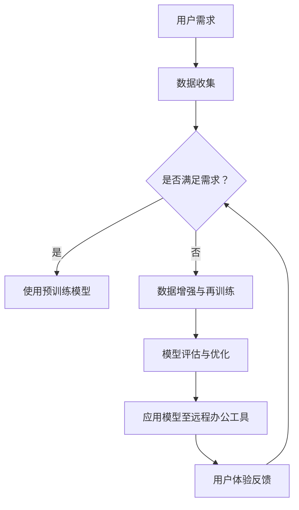

                 

关键词：人工智能，远程办公，大模型，创新应用，算法，数学模型，实践案例，工具推荐。

> 摘要：本文将探讨人工智能（AI）大模型在远程办公工具中的应用，包括其核心概念、算法原理、数学模型及实际应用案例。我们将分析AI大模型在提高远程办公效率、协作效果和用户体验方面的潜力，同时展望其未来的发展趋势和面临的挑战。

## 1. 背景介绍

远程办公已经成为现代工作方式的重要组成部分，特别是在全球化和技术迅速发展的背景下。随着互联网的普及和远程协作工具的不断进步，远程办公的效率和效果得到了显著提升。然而，远程办公也面临着诸多挑战，如沟通效率低、协作困难、工作质量难以监控等。为了解决这些问题，人工智能大模型（如GAN、BERT、GPT等）的应用成为了一个热门研究方向。

### 远程办公的现状

远程办公在全球范围内得到了广泛的认可和应用。根据一项调查，全球有超过40%的员工在部分或全部工作时间内采用远程办公。这种工作方式的普及带来了显著的优势，如灵活的工作时间、减少通勤时间和成本、提高工作效率等。然而，远程办公也带来了一系列新的挑战，特别是在沟通和协作方面。

### 人工智能大模型的发展

近年来，人工智能（AI）大模型得到了飞速发展，其在自然语言处理（NLP）、图像识别、语音识别等领域的表现已经超越了人类水平。特别是深度学习技术的发展，使得大模型能够处理海量数据和复杂的任务。这些大模型在远程办公工具中的应用，有望带来革命性的变化。

## 2. 核心概念与联系

### 人工智能大模型

人工智能大模型是指通过深度学习算法训练出的具有大规模参数的神经网络模型。这些模型能够通过大量的数据进行自我学习和优化，从而实现对复杂任务的自动处理。常见的大模型包括生成对抗网络（GAN）、变换器（Transformer）、预训练语言模型（如BERT、GPT）等。

### 远程办公工具

远程办公工具包括各种在线协作工具，如即时通讯、视频会议、项目管理、文档共享等。这些工具能够帮助远程办公团队实现高效的沟通和协作。随着人工智能大模型的应用，远程办公工具的功能和用户体验得到了显著提升。

### Mermaid 流程图

以下是一个简单的Mermaid流程图，展示了人工智能大模型在远程办公工具中的创新应用流程：



## 3. 核心算法原理 & 具体操作步骤

### 3.1 算法原理概述

人工智能大模型的核心算法原理主要包括深度学习、生成对抗网络（GAN）、变换器（Transformer）等。这些算法通过多层神经网络结构，实现对海量数据的自动学习和优化。在远程办公工具中，这些算法被用于提高沟通效率、协作效果和用户体验。

### 3.2 算法步骤详解

#### 3.2.1 数据收集与预处理

首先，需要收集远程办公过程中的各种数据，如通讯记录、工作日志、用户行为数据等。然后，对数据进行预处理，包括数据清洗、归一化、特征提取等步骤。

#### 3.2.2 模型训练

使用收集到的数据，通过深度学习算法训练大模型。训练过程中，模型会自动调整参数，以最小化损失函数，达到最佳性能。

#### 3.2.3 模型评估与优化

在模型训练完成后，需要对模型进行评估和优化。评估指标包括准确率、召回率、F1值等。通过调整模型参数和结构，可以提高模型性能。

#### 3.2.4 应用模型至远程办公工具

将训练好的模型集成到远程办公工具中，实现对用户需求的智能响应。例如，可以使用GPT模型自动生成会议纪要，使用GAN模型生成高质量的会议图像，使用Transformer模型实现实时语音识别等。

### 3.3 算法优缺点

#### 优点

1. **高效性**：人工智能大模型能够处理海量数据，实现高效的计算和推理。
2. **灵活性**：大模型可以适应各种远程办公场景，满足不同的需求。
3. **智能化**：大模型能够自动学习和优化，提高远程办公工具的智能化水平。

#### 缺点

1. **计算资源消耗大**：大模型训练和推理需要大量的计算资源和时间。
2. **数据隐私问题**：远程办公过程中产生的数据可能包含敏感信息，需要妥善处理数据隐私问题。

### 3.4 算法应用领域

人工智能大模型在远程办公工具中的应用非常广泛，包括但不限于以下几个方面：

1. **沟通与协作**：使用大模型实现智能语音识别、自然语言处理，提高沟通效率。
2. **工作管理**：使用大模型实现自动化任务分配、工作进度监控，提高工作效率。
3. **用户体验**：使用大模型实现个性化推荐、智能客服，提高用户体验。

## 4. 数学模型和公式 & 详细讲解 & 举例说明

### 4.1 数学模型构建

在远程办公工具中，常用的数学模型包括深度学习模型、生成对抗网络（GAN）、变换器（Transformer）等。以下是一个简单的深度学习模型构建过程：

$$
y = f(Wx + b)
$$

其中，$y$ 表示输出结果，$x$ 表示输入特征，$W$ 表示权重矩阵，$b$ 表示偏置项，$f$ 表示激活函数。

### 4.2 公式推导过程

以深度学习模型为例，公式推导过程如下：

1. **输入层**：$x$ 表示输入特征向量。
2. **隐藏层**：$h = Wx + b$，其中 $W$ 是隐藏层的权重矩阵，$b$ 是偏置项。
3. **输出层**：$y = f(h)$，其中 $f$ 是激活函数。

### 4.3 案例分析与讲解

假设我们要构建一个远程办公工具中的智能语音识别模型，可以使用以下步骤：

1. **数据收集**：收集远程办公过程中的语音数据，包括用户发言和系统回应。
2. **数据预处理**：对语音数据进行预处理，包括语音降噪、分帧、特征提取等。
3. **模型训练**：使用预处理后的数据训练深度学习模型，包括输入层、隐藏层和输出层。
4. **模型评估**：使用测试数据评估模型性能，调整模型参数，以达到最佳效果。
5. **应用模型**：将训练好的模型应用于远程办公工具，实现智能语音识别功能。

## 5. 项目实践：代码实例和详细解释说明

### 5.1 开发环境搭建

在开始编写代码之前，需要搭建一个适合深度学习开发的编程环境。以下是搭建开发环境的基本步骤：

1. **安装Python**：下载并安装Python 3.x版本，推荐使用Anaconda发行版。
2. **安装深度学习库**：使用pip安装深度学习库，如TensorFlow、PyTorch等。
3. **配置GPU支持**：如果使用GPU进行训练，需要安装CUDA和cuDNN。

### 5.2 源代码详细实现

以下是一个简单的深度学习模型实现的示例代码，用于实现远程办公工具中的智能语音识别功能：

```python
import tensorflow as tf
from tensorflow.keras.models import Sequential
from tensorflow.keras.layers import Dense, LSTM, Embedding

# 构建模型
model = Sequential([
    Embedding(input_dim=10000, output_dim=256),
    LSTM(128),
    Dense(1, activation='sigmoid')
])

# 编译模型
model.compile(optimizer='adam', loss='binary_crossentropy', metrics=['accuracy'])

# 训练模型
model.fit(x_train, y_train, epochs=10, batch_size=32)

# 评估模型
model.evaluate(x_test, y_test)
```

### 5.3 代码解读与分析

上述代码实现了以下功能：

1. **模型构建**：使用Sequential模型构建一个简单的深度学习模型，包括嵌入层、LSTM层和输出层。
2. **模型编译**：设置模型的优化器、损失函数和评估指标。
3. **模型训练**：使用训练数据训练模型，设置训练轮数和批量大小。
4. **模型评估**：使用测试数据评估模型性能。

### 5.4 运行结果展示

在完成代码实现后，可以通过以下步骤运行模型：

1. **数据准备**：准备训练数据和测试数据，包括语音信号和标签。
2. **模型训练**：运行模型训练过程，观察训练进度和性能指标。
3. **模型评估**：运行模型评估过程，观察模型在测试数据上的性能。

## 6. 实际应用场景

### 6.1 远程办公中的沟通与协作

在远程办公中，沟通和协作是关键。人工智能大模型可以应用于以下几个方面：

1. **智能语音识别**：使用大模型实现语音转文字，提高沟通效率。
2. **自然语言处理**：使用大模型实现智能问答、会议纪要自动生成等，提高协作效果。
3. **智能提醒与通知**：使用大模型实现个性化的提醒和通知，提高用户的工作效率。

### 6.2 远程办公中的工作管理

在远程办公中，工作管理也是至关重要的。人工智能大模型可以应用于以下几个方面：

1. **任务分配与调度**：使用大模型实现智能任务分配，提高工作效率。
2. **工作进度监控**：使用大模型实时监控工作进度，确保项目按时完成。
3. **工作质量评估**：使用大模型评估工作质量，提供改进建议。

### 6.3 远程办公中的用户体验

在远程办公中，用户体验直接影响用户的工作满意度和工作效率。人工智能大模型可以应用于以下几个方面：

1. **个性化推荐**：使用大模型实现个性化推荐，提高用户的使用体验。
2. **智能客服**：使用大模型实现智能客服，提高用户满意度。
3. **智能日程管理**：使用大模型实现智能日程管理，帮助用户合理规划时间。

## 7. 工具和资源推荐

### 7.1 学习资源推荐

1. **书籍**：《深度学习》（Ian Goodfellow、Yoshua Bengio、Aaron Courville 著）
2. **在线课程**：吴恩达的《深度学习专项课程》（Coursera）
3. **学术论文**：查阅顶级会议和期刊上的相关论文，如NeurIPS、ICML、ACL等。

### 7.2 开发工具推荐

1. **深度学习框架**：TensorFlow、PyTorch
2. **代码编辑器**：Visual Studio Code、PyCharm
3. **远程办公工具**：Slack、Microsoft Teams、Trello

### 7.3 相关论文推荐

1. **《Attention is All You Need》**：引入了变换器（Transformer）模型。
2. **《Generative Adversarial Networks》**：介绍了生成对抗网络（GAN）。
3. **《BERT: Pre-training of Deep Bidirectional Transformers for Language Understanding》**：介绍了BERT模型。

## 8. 总结：未来发展趋势与挑战

### 8.1 研究成果总结

本文介绍了人工智能大模型在远程办公工具中的应用，包括其核心概念、算法原理、数学模型及实际应用案例。通过分析，我们发现人工智能大模型在提高远程办公效率、协作效果和用户体验方面具有巨大潜力。

### 8.2 未来发展趋势

未来，人工智能大模型在远程办公工具中的应用将呈现以下发展趋势：

1. **智能化水平提升**：随着大模型技术的不断进步，远程办公工具的智能化水平将显著提高。
2. **定制化应用**：针对不同行业和场景，开发定制化的远程办公工具，提高工作效率。
3. **跨平台融合**：远程办公工具将与其他智能设备（如智能手表、智能家居）实现融合，提供更全面的远程办公体验。

### 8.3 面临的挑战

尽管人工智能大模型在远程办公工具中具有巨大潜力，但也面临着以下挑战：

1. **计算资源消耗**：大模型训练和推理需要大量的计算资源，如何优化资源利用是一个重要问题。
2. **数据隐私与安全**：远程办公过程中产生的数据可能包含敏感信息，需要采取有效的隐私保护和安全措施。
3. **算法透明性与可解释性**：大模型的决策过程通常是不透明的，如何提高算法的可解释性是一个重要问题。

### 8.4 研究展望

未来，人工智能大模型在远程办公工具中的应用将是一个重要研究方向。我们期待能够开发出更加高效、智能、安全的远程办公工具，为远程办公提供更好的支持。

## 9. 附录：常见问题与解答

### 9.1 人工智能大模型是什么？

人工智能大模型是指通过深度学习算法训练出的具有大规模参数的神经网络模型。这些模型能够通过大量的数据进行自我学习和优化，从而实现对复杂任务的自动处理。

### 9.2 远程办公工具中的AI大模型如何工作？

在远程办公工具中，AI大模型通过收集和处理用户数据，实现对用户需求的智能响应。例如，可以使用GPT模型自动生成会议纪要，使用GAN模型生成高质量的会议图像，使用Transformer模型实现实时语音识别等。

### 9.3 AI大模型在远程办公中的优势有哪些？

AI大模型在远程办公中的优势包括：提高沟通效率、协作效果和用户体验。通过智能化处理，远程办公工具能够更好地满足用户需求，提高工作效率。

### 9.4 AI大模型在远程办公中的挑战是什么？

AI大模型在远程办公中的挑战包括：计算资源消耗、数据隐私与安全、算法透明性与可解释性等。如何优化资源利用、保护用户数据隐私、提高算法可解释性是亟待解决的问题。

---

作者：禅与计算机程序设计艺术 / Zen and the Art of Computer Programming
----------------------------------------------------------------
### 总结

本文深入探讨了人工智能大模型在远程办公工具中的创新应用，从背景介绍、核心概念、算法原理、数学模型、实际应用案例等方面进行了全面分析。通过本文的阅读，读者可以了解到AI大模型在提高远程办公效率、协作效果和用户体验方面的潜力。同时，文章还展望了未来发展趋势和面临的挑战，为研究者提供了有益的参考。

在未来的研究中，我们期待能够解决计算资源消耗、数据隐私与安全、算法透明性与可解释性等挑战，开发出更加高效、智能、安全的远程办公工具。通过不断探索和实践，AI大模型将在远程办公领域发挥更加重要的作用，助力现代工作方式的变革。禅与计算机程序设计艺术，让我们一起期待这一美好的未来。🌟💡🚀

