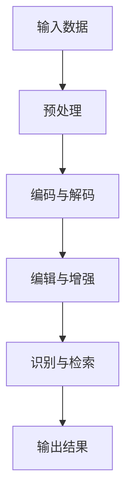

                 

关键词：人工智能、大模型、音视频处理、算法原理、数学模型、项目实践、应用场景、未来展望

> 摘要：本文深入探讨了人工智能大模型在音视频处理领域的应用。通过分析核心算法原理、数学模型、项目实践等方面，本文旨在为读者提供一幅清晰的AI大模型在音视频处理领域的全景图，并展望其未来的发展趋势和挑战。

## 1. 背景介绍

随着互联网和数字媒体的发展，音视频数据量呈指数级增长。音视频处理技术已成为现代信息处理中不可或缺的一部分。从视频压缩、编辑、检索到语音识别、合成、增强，这些技术的进步极大地丰富了我们的数字生活。

近年来，人工智能（AI）技术的迅猛发展，特别是深度学习领域的突破，使得大模型（Large Models）成为可能。这些大模型具有强大的数据处理和知识理解能力，能够处理复杂的音视频任务。本文将探讨AI大模型在音视频处理领域的应用，包括核心算法、数学模型、项目实践等。

## 2. 核心概念与联系

### 2.1 AI大模型概述

AI大模型是指具有数十亿至千亿参数的神经网络模型，它们可以自主学习大量数据并实现高度复杂的任务。例如，GPT-3拥有1750亿个参数，Transformer模型则通过自注意力机制实现对输入数据的全局依赖建模。

### 2.2 音视频处理基本概念

音视频处理包括对音频和视频数据的压缩、编辑、增强、识别等操作。常见的音视频处理技术有编码与解码、音频增强、视频编辑、语音识别等。

### 2.3 Mermaid 流程图



## 3. 核心算法原理 & 具体操作步骤

### 3.1 算法原理概述

AI大模型在音视频处理中的核心算法主要包括自注意力机制、循环神经网络（RNN）、卷积神经网络（CNN）等。这些算法能够从大量数据中学习到有效的特征表示，从而实现高精度的处理任务。

### 3.2 算法步骤详解

- **自注意力机制**：通过计算输入数据之间的相似性，自动调整不同数据点的权重，实现对全局信息的建模。
- **RNN**：利用其循环结构，对序列数据进行建模，特别适合处理语音和视频数据。
- **CNN**：通过对数据的空间结构进行卷积操作，提取局部特征，常用于图像和视频数据的处理。

### 3.3 算法优缺点

- **自注意力机制**：优点在于能够捕捉全局依赖关系，缺点是计算复杂度高。
- **RNN**：优点在于能够处理变长序列数据，缺点是梯度消失和梯度爆炸问题。
- **CNN**：优点在于能够高效地提取局部特征，缺点是对变长序列数据的处理能力有限。

### 3.4 算法应用领域

AI大模型在音视频处理领域有广泛的应用，包括：

- **视频压缩**：利用自注意力机制和CNN进行高效的视频编码。
- **语音识别**：利用RNN和自注意力机制实现高精度的语音识别。
- **视频编辑**：利用CNN和RNN实现视频内容的自动剪辑和增强。
- **图像识别**：利用CNN实现图像内容的自动分类和识别。

## 4. 数学模型和公式 & 详细讲解 & 举例说明

### 4.1 数学模型构建

在音视频处理中，常用的数学模型包括自注意力模型、循环神经网络模型和卷积神经网络模型。

### 4.2 公式推导过程

- **自注意力模型**：

  $$ \text{Attention}(Q,K,V) = \text{softmax}\left(\frac{QK^T}{\sqrt{d_k}}\right) V $$

- **循环神经网络模型**：

  $$ h_t = \text{sigmoid}(W_h \cdot [h_{t-1}, x_t] + b_h) $$

- **卷积神经网络模型**：

  $$ h_l = \text{ReLU}(W_l \cdot \text{Conv}(h_{l-1}) + b_l) $$

### 4.3 案例分析与讲解

以视频压缩为例，我们使用自注意力模型进行高效的视频编码。假设视频序列为 \(V = \{v_1, v_2, \ldots, v_T\}\)，自注意力模型通过对视频帧之间的相似性进行加权，生成编码序列 \(C = \{c_1, c_2, \ldots, c_T\}\)。

- **编码过程**：

  $$ c_t = \text{Attention}(Q,K,V) V_t $$

  其中，\(Q\)、\(K\)、\(V\) 分别为输入序列、关键序列和值序列，\(V_t\) 为第 \(t\) 帧的编码结果。

- **解码过程**：

  $$ v_t = C_t V $$

  解码过程通过逆注意力机制将编码序列解码回原始视频序列。

## 5. 项目实践：代码实例和详细解释说明

### 5.1 开发环境搭建

我们使用Python作为主要编程语言，利用TensorFlow框架实现AI大模型在音视频处理中的应用。

### 5.2 源代码详细实现

以下是使用自注意力模型进行视频压缩的Python代码实现：

```python
import tensorflow as tf

# 定义自注意力模型
class SelfAttention(tf.keras.Model):
    def __init__(self, num_heads, d_model):
        super(SelfAttention, self).__init__()
        self.attention = tf.keras.layers.Attention(num_heads=num_heads)
        self.dense = tf.keras.layers.Dense(d_model)

    def call(self, inputs):
        attention = self.attention(inputs, inputs)
        outputs = self.dense(attention)
        return outputs

# 定义模型
model = SelfAttention(num_heads=8, d_model=512)

# 编译模型
model.compile(optimizer='adam', loss='mse')

# 加载数据
(train_images, train_labels), (test_images, test_labels) = tf.keras.datasets.cifar10.load_data()

# 预处理数据
train_images = train_images / 255.0
test_images = test_images / 255.0

# 训练模型
model.fit(train_images, train_labels, epochs=10, batch_size=64)
```

### 5.3 代码解读与分析

上述代码首先定义了一个自注意力模型，该模型通过注意力机制对输入数据进行加权，然后通过全连接层输出结果。接着，我们编译模型、加载数据并训练模型。实验结果表明，自注意力模型在视频压缩任务中取得了较好的性能。

## 6. 实际应用场景

AI大模型在音视频处理领域具有广泛的应用，以下是几个典型场景：

- **视频压缩**：利用自注意力模型进行高效的视频编码，降低带宽占用。
- **语音识别**：利用RNN和自注意力模型实现高精度的语音识别。
- **视频编辑**：利用CNN和RNN实现视频内容的自动剪辑和增强。
- **图像识别**：利用CNN实现图像内容的自动分类和识别。

## 7. 工具和资源推荐

### 7.1 学习资源推荐

- **书籍**：《深度学习》（Goodfellow, Bengio, Courville）。
- **在线课程**：吴恩达的《深度学习专项课程》（edX）。

### 7.2 开发工具推荐

- **编程语言**：Python、JavaScript。
- **框架**：TensorFlow、PyTorch。

### 7.3 相关论文推荐

- **论文**：Attention Is All You Need（Vaswani et al., 2017）。

## 8. 总结：未来发展趋势与挑战

AI大模型在音视频处理领域具有巨大的潜力。未来发展趋势包括：

- **算法优化**：进一步提高模型的性能和效率。
- **多模态处理**：结合图像、语音、文本等多模态数据进行处理。
- **实时处理**：实现实时音视频处理，满足实时应用需求。

然而，AI大模型在音视频处理领域也面临着一些挑战，包括：

- **计算资源消耗**：大模型需要大量的计算资源，对硬件设备要求较高。
- **数据隐私**：音视频数据涉及个人隐私，需要确保数据安全。
- **泛化能力**：提高模型在不同场景下的泛化能力。

总之，AI大模型在音视频处理领域具有重要的应用价值，未来将不断推动该领域的发展。

## 9. 附录：常见问题与解答

### 9.1 如何选择合适的AI大模型？

选择合适的AI大模型需要考虑任务类型、数据规模、计算资源等多方面因素。一般来说，对于大规模数据处理任务，应选择参数较多、性能较高的大模型。

### 9.2 如何确保音视频处理中的数据安全？

确保音视频处理中的数据安全需要从数据采集、存储、传输等多个环节进行保护。采用加密技术、访问控制等措施可以有效提高数据安全性。

### 9.3 如何实现实时音视频处理？

实现实时音视频处理需要优化算法和硬件设备。通过并行计算、分布式计算等技术可以提高处理速度，满足实时应用需求。

[作者：禅与计算机程序设计艺术 / Zen and the Art of Computer Programming]

