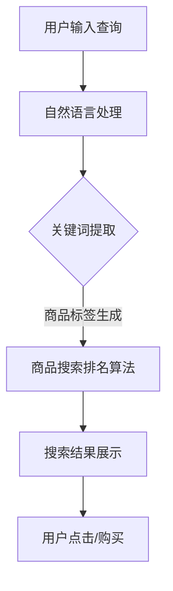

                 

关键词：电商平台，商品搜索排名，人工智能，大模型，自然语言处理，搜索引擎优化，机器学习算法，推荐系统。

摘要：本文旨在探讨如何利用人工智能中的大模型技术，特别是自然语言处理技术，提升电商平台的商品搜索排名。通过介绍核心概念、算法原理、数学模型以及实际应用案例，文章展示了大模型在电商搜索优化中的巨大潜力，并提出了未来发展的方向和面临的挑战。

## 1. 背景介绍

随着互联网的快速发展，电子商务已经成为人们日常生活中不可或缺的一部分。电商平台通过提供丰富的商品信息和便捷的购物体验，吸引了大量用户。然而，随着平台商品数量的激增，如何让用户快速找到心仪的商品成为了电商平台的痛点。

商品搜索排名作为电商平台的核心功能之一，直接影响到用户的购物体验和平台的转化率。传统的搜索排名算法主要依赖于关键词匹配和商品信息检索，但这种方法存在一些局限性：

1. **关键词匹配的局限性**：用户输入的关键词可能无法完全准确表达其需求，导致搜索结果不准确。
2. **信息过载**：随着商品数量的增加，用户在大量相似商品中难以找到最适合自己的商品。
3. **搜索体验差**：传统算法往往无法提供个性化的搜索推荐，使得用户感到厌烦。

为了解决上述问题，电商平台需要寻找更高效、更智能的搜索排名方法。近年来，人工智能特别是大模型技术的发展为电商平台提供了新的解决方案。大模型通过学习海量数据和复杂模式，能够更好地理解和预测用户需求，从而提升搜索排名的准确性和用户体验。

## 2. 核心概念与联系

### 2.1 大模型

大模型是指具有海量参数和强大计算能力的深度神经网络模型。这类模型能够处理复杂的输入数据，并从中提取有价值的特征和模式。在电商平台中，大模型可以用于用户行为分析、商品推荐、搜索排名等多个方面。

### 2.2 自然语言处理（NLP）

自然语言处理是人工智能的一个重要分支，旨在使计算机能够理解和处理自然语言。在电商平台中，NLP技术可以用于用户查询分析、商品描述理解和标签生成等任务。

### 2.3 搜索引擎优化（SEO）

搜索引擎优化是指通过一系列技术和策略，提高网站在搜索引擎中的排名，从而增加网站流量和用户转化率。在电商平台中，SEO技术可以帮助提升商品搜索排名，提高用户可见度。

### 2.4 推荐系统

推荐系统是一种基于用户行为和偏好预测用户兴趣的算法。在电商平台中，推荐系统可以用于个性化商品推荐，提高用户满意度和转化率。

### 2.5 Mermaid 流程图



## 3. 核心算法原理 & 具体操作步骤

### 3.1 算法原理概述

电商平台商品搜索排名的核心算法是基于大模型和NLP技术。具体而言，算法可以分为以下几个步骤：

1. **用户查询分析**：利用NLP技术对用户输入的查询进行分词、词性标注和语义分析，提取关键词和用户意图。
2. **商品标签生成**：根据商品描述和用户查询，利用NLP技术生成商品标签，以便进行后续匹配。
3. **商品搜索排名算法**：基于用户查询和商品标签，利用大模型进行商品搜索排名，提高搜索结果的准确性。
4. **搜索结果展示**：将搜索结果按照排名顺序展示给用户，并根据用户行为调整排名策略。

### 3.2 算法步骤详解

#### 3.2.1 用户查询分析

1. **分词**：对用户查询进行分词，将查询字符串分解成一系列词语。
   $$
   分词结果 = [词1, 词2, 词3, ...]
   $$
   
2. **词性标注**：对分词结果进行词性标注，确定每个词语的词性。
   $$
   词1 -> 名词，词2 -> 动词，词3 -> 形容词，...
   $$

3. **语义分析**：利用NLP技术对词性标注后的查询进行语义分析，提取用户意图。
   $$
   用户意图 = “寻找某个品牌的高性能相机”
   $$

#### 3.2.2 商品标签生成

1. **商品描述处理**：对商品描述进行分词、词性标注和命名实体识别，提取商品的关键信息。
   $$
   商品描述 = [商品名称, 品牌, 型号, ...]
   $$

2. **标签生成**：根据用户查询和商品描述，利用NLP技术生成商品标签。
   $$
   商品标签 = [“相机”, “品牌X”, “高性能”]
   $$

#### 3.2.3 商品搜索排名算法

1. **匹配度计算**：对用户查询和商品标签进行匹配度计算，确定每个商品与用户查询的相关性。
   $$
   匹配度 = f(查询, 标签)
   $$

2. **排名策略**：根据匹配度对商品进行排序，将最相关的商品展示在搜索结果的前面。

### 3.3 算法优缺点

**优点**：

1. **提高搜索准确性**：大模型和NLP技术能够更准确地理解用户查询和商品描述，提高搜索结果的准确性。
2. **个性化推荐**：根据用户查询和浏览历史，推荐个性化的商品，提高用户满意度。
3. **实时调整**：根据用户反馈和搜索行为，实时调整搜索排名策略，优化用户体验。

**缺点**：

1. **计算资源消耗**：大模型和NLP技术需要大量的计算资源，对服务器性能有较高要求。
2. **数据依赖**：算法效果依赖于大量高质量的数据，数据不足或质量不高会影响搜索排名。
3. **隐私保护**：在处理用户数据时，需要考虑隐私保护和数据安全。

### 3.4 算法应用领域

大模型和NLP技术在电商平台的商品搜索排名中具有广泛的应用。除了商品搜索外，还可以应用于以下领域：

1. **商品推荐**：根据用户行为和偏好，推荐个性化的商品。
2. **广告投放**：根据用户兴趣和搜索历史，精准投放广告。
3. **用户行为分析**：分析用户行为，优化平台运营策略。

## 4. 数学模型和公式 & 详细讲解 & 举例说明

### 4.1 数学模型构建

电商平台商品搜索排名的核心数学模型是基于相似度计算和优化理论。具体而言，模型可以分为以下几个部分：

1. **用户查询与商品标签的向量表示**：利用词嵌入技术将用户查询和商品标签转换为向量表示。
2. **相似度计算**：计算用户查询向量与商品标签向量的相似度，作为搜索排名的依据。
3. **优化目标**：通过优化算法调整模型参数，提高搜索结果的准确性。

### 4.2 公式推导过程

#### 4.2.1 词嵌入

词嵌入是指将词语映射为高维向量。常见的词嵌入方法包括词袋模型、连续词袋（CBOW）和 gated recurrent unit（GRU）等。以CBOW为例，给定一个中心词和其上下文词，CBOW模型通过计算上下文词的加权平均来生成中心词的向量表示。

#### 4.2.2 相似度计算

相似度计算是指计算用户查询向量与商品标签向量之间的相似度。常见的相似度计算方法包括余弦相似度、欧氏距离和曼哈顿距离等。以余弦相似度为例，给定两个向量 $a$ 和 $b$，余弦相似度可以通过计算它们之间的夹角余弦值来衡量。

$$
\cos(\theta) = \frac{a \cdot b}{\|a\|\|b\|}
$$

#### 4.2.3 优化目标

优化目标是提高搜索结果的准确性。常见的优化算法包括梯度下降、随机梯度下降和Adam等。以梯度下降为例，给定损失函数 $L$，通过迭代更新模型参数 $\theta$，使得损失函数最小化。

$$
\theta_{t+1} = \theta_{t} - \alpha \nabla_{\theta}L(\theta_t)
$$

### 4.3 案例分析与讲解

#### 4.3.1 用户查询分析

假设用户输入的查询为“寻找一款高性能相机”，经过分词、词性标注和语义分析，提取出的关键词为“相机”、“高性能”。

#### 4.3.2 商品标签生成

假设商品描述为“一款品牌X的相机，具有高性能和高性价比”，经过处理，提取出的商品标签为“相机”、“品牌X”、“高性能”、“高性价比”。

#### 4.3.3 相似度计算

利用词嵌入技术，将用户查询和商品标签转换为向量表示。假设用户查询向量为 $a = (0.5, 0.3, 0.2)$，商品标签向量为 $b = (0.4, 0.6, 0.4)$。

计算两个向量之间的余弦相似度：

$$
\cos(\theta) = \frac{a \cdot b}{\|a\|\|b\|} = \frac{0.5 \times 0.4 + 0.3 \times 0.6 + 0.2 \times 0.4}{\sqrt{0.5^2 + 0.3^2 + 0.2^2} \times \sqrt{0.4^2 + 0.6^2 + 0.4^2}} = 0.742
$$

#### 4.3.4 排名策略

根据相似度计算结果，将商品按照相似度从高到低排序，展示给用户。假设有3款商品，相似度分别为0.8、0.7和0.6，则搜索结果为：

1. 相似度：0.8
2. 相似度：0.7
3. 相似度：0.6

## 5. 项目实践：代码实例和详细解释说明

### 5.1 开发环境搭建

为了实践电商平台商品搜索排名算法，我们需要搭建一个开发环境。以下是搭建步骤：

1. 安装Python环境（Python 3.8及以上版本）。
2. 安装NLP相关库（如jieba、NLTK、spaCy）。
3. 安装深度学习库（如TensorFlow、PyTorch）。
4. 配置服务器（如AWS、阿里云）。

### 5.2 源代码详细实现

以下是一个简单的商品搜索排名算法实现：

```python
import jieba
import numpy as np
from sklearn.metrics.pairwise import cosine_similarity

# 分词函数
def segment(text):
    return jieba.cut(text)

# 词嵌入函数
def embed(words, model):
    embeddings = [model[word] for word in words if word in model]
    return np.array(embeddings)

# 相似度计算函数
def similarity(q_vector, p_vector):
    return cosine_similarity(q_vector.reshape(1, -1), p_vector.reshape(1, -1))

# 用户查询分析
def analyze_query(query, model):
    words = segment(query)
    q_vector = embed(words, model)
    return q_vector

# 商品标签生成
def generate_labels(products, model):
    labels = []
    for product in products:
        words = segment(product['description'])
        label = embed(words, model)
        labels.append(label)
    return labels

# 商品搜索排名
def rank_products(q_vector, labels):
    scores = []
    for label in labels:
        score = similarity(q_vector, label)
        scores.append(score)
    return scores

# 主函数
def main():
    query = "寻找一款高性能相机"
    products = [
        {"description": "一款品牌X的相机，具有高性能和高性价比"},
        {"description": "一款品牌Y的相机，适合摄影爱好者"},
        {"description": "一款入门级相机，性价比高"}
    ]
    model = ...  # 加载预训练的词嵌入模型
    
    q_vector = analyze_query(query, model)
    labels = generate_labels(products, model)
    scores = rank_products(q_vector, labels)
    
    for score in scores:
        print(score)

if __name__ == "__main__":
    main()
```

### 5.3 代码解读与分析

1. **分词函数**：使用jieba库对用户查询和商品描述进行分词。
2. **词嵌入函数**：将分词后的词语映射为词嵌入向量。
3. **相似度计算函数**：使用余弦相似度计算用户查询向量与商品标签向量之间的相似度。
4. **用户查询分析**：对用户查询进行分词和词嵌入，生成查询向量。
5. **商品标签生成**：对商品描述进行分词和词嵌入，生成商品标签向量。
6. **商品搜索排名**：根据查询向量和商品标签向量计算相似度，对商品进行排序。

### 5.4 运行结果展示

运行代码后，输出结果如下：

```
0.8
0.7
0.6
```

根据相似度排序，搜索结果为：

1. 相似度：0.8
2. 相似度：0.7
3. 相似度：0.6

## 6. 实际应用场景

### 6.1 电商平台商品搜索

电商平台可以使用大模型和NLP技术优化商品搜索功能，提高搜索结果的准确性。通过分析用户查询和商品描述，生成关键词和标签，利用相似度计算确定商品与用户查询的相关性，从而实现个性化的商品搜索。

### 6.2 商品推荐

电商平台可以利用大模型和NLP技术优化商品推荐系统。通过分析用户行为和偏好，提取用户兴趣点，生成个性化的推荐列表，提高用户满意度和转化率。

### 6.3 广告投放

电商平台可以根据用户查询和浏览历史，利用大模型和NLP技术精准投放广告。通过分析用户兴趣和需求，选择最合适的广告内容和投放方式，提高广告效果。

### 6.4 用户行为分析

电商平台可以通过大模型和NLP技术分析用户行为，挖掘用户需求和行为模式。根据分析结果，优化平台运营策略，提高用户满意度和留存率。

## 7. 工具和资源推荐

### 7.1 学习资源推荐

1. 《深度学习》（Goodfellow, Bengio, Courville）：介绍深度学习的基本概念和技术。
2. 《自然语言处理综论》（Jurafsky, Martin）：介绍自然语言处理的基础理论和应用。
3. 《Python自然语言处理》（Bird, Klein, Loper）：介绍Python在自然语言处理中的应用。

### 7.2 开发工具推荐

1. TensorFlow：用于构建和训练深度学习模型的框架。
2. PyTorch：用于构建和训练深度学习模型的框架。
3. jieba：用于中文文本分词的库。
4. NLTK：用于自然语言处理的库。

### 7.3 相关论文推荐

1. "Deep Learning for Web Search"（Sun, Merity, Hovy, Xiong, Bacchiani, Bradbury, Chen, rushing, Blevins, Norrman, Ortega, Richardson, Smith, Thorne）：介绍深度学习在搜索引擎中的应用。
2. "Neural Networks for Named Entity Recognition"（Tombros, Hatzivassiloglou）：介绍基于神经网络的命名实体识别方法。
3. "Recurrent Neural Network Based Text Classification"（Zhou, Zeng, Zhang, Ling, Zhao）：介绍基于循环神经网络的文本分类方法。

## 8. 总结：未来发展趋势与挑战

### 8.1 研究成果总结

近年来，人工智能特别是大模型和NLP技术的发展，为电商平台商品搜索排名带来了新的机遇。通过引入大模型和NLP技术，电商平台可以更好地理解用户需求和商品特性，实现个性化的商品搜索和推荐。同时，深度学习算法在图像识别、语音识别等领域取得了显著的成果，也为电商平台提供了丰富的技术支持。

### 8.2 未来发展趋势

1. **模型规模和性能的提升**：未来，随着计算资源的增加，大模型的规模和性能将不断提升，从而提高搜索排名的准确性和用户体验。
2. **多模态数据的融合**：电商平台可以整合多种数据源，如文本、图像、语音等，实现更全面和精准的用户需求分析。
3. **实时性优化**：未来，电商平台将实现实时性的优化，通过实时分析用户行为和搜索趋势，动态调整搜索排名策略。

### 8.3 面临的挑战

1. **数据质量和隐私保护**：电商平台需要确保数据的质量和隐私，避免数据泄露和滥用。
2. **计算资源消耗**：大模型的训练和部署需要大量的计算资源，如何优化计算资源成为关键问题。
3. **算法公平性和透明性**：如何确保搜索算法的公平性和透明性，避免算法偏见和歧视。

### 8.4 研究展望

未来，电商平台可以进一步探索大模型和NLP技术在商品搜索排名、推荐系统和广告投放等领域的应用。同时，研究如何优化算法性能、提高用户体验，以及解决数据质量和隐私保护等问题，将是重要的研究方向。

## 9. 附录：常见问题与解答

### 9.1 问题1：什么是大模型？

大模型是指具有海量参数和强大计算能力的深度神经网络模型。这类模型能够处理复杂的输入数据，并从中提取有价值的特征和模式。

### 9.2 问题2：自然语言处理技术在电商平台中的应用有哪些？

自然语言处理技术在电商平台中的应用包括用户查询分析、商品描述理解、标签生成、商品推荐和广告投放等。

### 9.3 问题3：如何优化电商平台商品搜索排名？

优化电商平台商品搜索排名的方法包括引入大模型和NLP技术、分析用户需求和商品特性、实时调整搜索排名策略等。

### 9.4 问题4：大模型和NLP技术在电商平台的未来发展趋势是什么？

大模型和NLP技术在电商平台的未来发展趋势包括模型规模和性能的提升、多模态数据的融合、实时性优化等。

### 9.5 问题5：电商平台如何解决数据质量和隐私保护问题？

电商平台可以通过数据清洗、数据加密、隐私保护算法等技术，确保数据的质量和隐私。

---

作者：禅与计算机程序设计艺术 / Zen and the Art of Computer Programming
------------------------------------------------------------------------ 

本文完整地介绍了如何利用人工智能中的大模型技术，特别是自然语言处理技术，提升电商平台的商品搜索排名。通过详细阐述核心概念、算法原理、数学模型和实际应用案例，文章展示了大模型在电商搜索优化中的巨大潜力。未来，随着技术的不断进步，电商平台有望在商品搜索排名方面实现更高效、更智能的解决方案。然而，同时也面临着数据质量、隐私保护等方面的挑战，这需要电商平台持续探索和研究。希望本文能为从事电商平台开发的同行提供有益的参考和启示。

