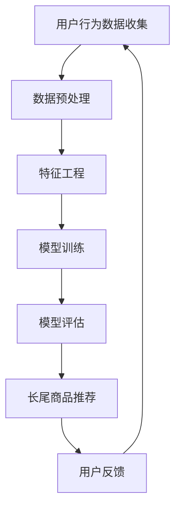

                 

关键词：AI大模型、电商平台、长尾商品、商品发现、推荐系统、算法原理、应用实践、数学模型、未来展望

摘要：随着互联网电商平台的飞速发展，用户对商品的选择和购买行为日益多样化，如何有效地发现和推荐长尾商品成为了电商平台面临的重要问题。本文将深入探讨AI大模型在电商平台长尾商品发现与推荐中的运用，通过解析核心算法原理、数学模型构建以及项目实践，旨在为电商平台提供更具针对性的解决方案，提升用户购物体验。

## 1. 背景介绍

近年来，电商平台在满足消费者个性化需求方面取得了显著进展。然而，随着市场竞争的加剧和用户需求的多样化，如何有效地发现和推荐长尾商品成为了电商平台的痛点。长尾商品通常指的是那些市场需求较小但总销售量较大的商品，这类商品往往被传统推荐系统所忽视。因此，如何通过AI大模型提升电商平台的长尾商品发现与推荐，成为业界关注的焦点。

长尾商品存在的意义在于它们可以填补市场需求空白，提高电商平台的商品多样性，从而提升用户体验。然而，长尾商品的数据量相对较小，且存在数据稀疏性，这给传统的推荐算法带来了巨大的挑战。因此，引入AI大模型来提升长尾商品发现与推荐效率显得尤为重要。

## 2. 核心概念与联系

为了更好地理解AI大模型在长尾商品发现与推荐中的运用，我们首先需要明确几个核心概念：

### 2.1. AI大模型

AI大模型指的是具有亿级参数规模的人工智能模型，如深度神经网络、Transformer等。这些模型通过在海量数据上进行训练，能够自动学习和提取数据中的特征，从而实现高度复杂的任务，如图像识别、自然语言处理等。

### 2.2. 长尾商品

长尾商品指的是那些市场需求较小但总销售量较大的商品。在电商平台中，长尾商品通常具有多样化的特点，能够满足不同用户群体的个性化需求。

### 2.3. 推荐系统

推荐系统是一种通过预测用户兴趣和偏好，为用户推荐相关商品的人工智能系统。推荐系统的核心任务是提高用户满意度，增加用户粘性，从而提升电商平台的销售额。

### 2.4. 数据稀疏性

数据稀疏性指的是数据集中大部分值都为零或接近零的现象。在长尾商品推荐中，由于用户购买数据分布不均，导致数据稀疏性加剧，这对传统推荐算法提出了挑战。

### 2.5. Mermaid流程图

下面是用于描述AI大模型在长尾商品发现与推荐中的流程的Mermaid流程图：



在上述流程图中，用户行为数据收集、数据预处理、特征工程、模型训练、模型评估和长尾商品推荐构成了AI大模型在长尾商品发现与推荐中的主要步骤。

## 3. 核心算法原理 & 具体操作步骤

### 3.1. 算法原理概述

AI大模型在长尾商品发现与推荐中的核心算法原理主要包括以下几个方面：

1. **深度神经网络**：深度神经网络通过多层非线性变换，能够自动学习和提取数据中的特征。在长尾商品推荐中，深度神经网络可以用来建模用户兴趣和商品特征。

2. **注意力机制**：注意力机制可以动态地关注重要的输入信息，提高模型的推荐效果。在长尾商品推荐中，注意力机制可以用来关注那些具有较高潜在价值的商品。

3. **生成对抗网络**：生成对抗网络（GAN）可以通过生成对抗的过程，学习到数据的分布，从而生成新的商品信息。在长尾商品推荐中，GAN可以用来生成新的商品描述，提高推荐系统的多样性。

4. **协同过滤**：协同过滤是一种基于用户行为数据推荐商品的方法。在长尾商品推荐中，协同过滤可以用来发现潜在的关联商品。

### 3.2. 算法步骤详解

AI大模型在长尾商品发现与推荐中的具体操作步骤如下：

1. **用户行为数据收集**：收集用户的浏览、搜索、购买等行为数据。

2. **数据预处理**：对用户行为数据进行分析，去除重复和无效数据，并对数据格式进行统一处理。

3. **特征工程**：根据用户行为数据，提取用户兴趣和商品特征。例如，可以提取用户的浏览时长、搜索关键词、购买频次等特征，以及商品的分类、价格、品牌等特征。

4. **模型训练**：使用深度神经网络、注意力机制、生成对抗网络等算法，对用户兴趣和商品特征进行建模。

5. **模型评估**：使用交叉验证、AUC（面积下曲线）等指标，对模型进行评估和调优。

6. **长尾商品推荐**：根据用户兴趣和商品特征，使用协同过滤等方法，为用户推荐潜在的长尾商品。

7. **用户反馈**：收集用户的购买反馈，对推荐结果进行评估和调整。

### 3.3. 算法优缺点

AI大模型在长尾商品发现与推荐中具有以下优缺点：

**优点**：

1. **高效性**：AI大模型能够自动学习和提取数据中的特征，提高推荐系统的效率。

2. **多样性**：AI大模型可以生成新的商品描述，提高推荐系统的多样性。

3. **适应性**：AI大模型可以根据用户反馈，不断调整推荐策略，提高用户满意度。

**缺点**：

1. **计算成本**：AI大模型通常需要大量的计算资源和时间进行训练和推理。

2. **数据依赖性**：AI大模型的性能依赖于数据的质量和数量，数据稀疏性会降低模型的推荐效果。

### 3.4. 算法应用领域

AI大模型在长尾商品发现与推荐中的应用领域主要包括以下几个方面：

1. **电商平台**：电商平台可以通过AI大模型，提高长尾商品的推荐效果，提升用户购物体验。

2. **在线教育**：在线教育平台可以通过AI大模型，为学习者推荐个性化的学习资源和课程。

3. **金融行业**：金融行业可以通过AI大模型，为用户提供个性化的投资建议和理财产品推荐。

## 4. 数学模型和公式 & 详细讲解 & 举例说明

### 4.1. 数学模型构建

在AI大模型中，常用的数学模型包括深度神经网络、生成对抗网络等。下面我们以深度神经网络为例，介绍数学模型的构建。

#### 4.1.1. 神经网络模型

神经网络模型由多个神经元（层）组成，每个神经元接收来自前一层的输入，并通过激活函数进行非线性变换，最后输出结果。神经网络的数学模型可以表示为：

$$
y = \sigma(W \cdot x + b)
$$

其中，\(y\) 为输出结果，\(\sigma\) 为激活函数，\(W\) 为权重矩阵，\(x\) 为输入特征，\(b\) 为偏置项。

#### 4.1.2. 损失函数

在训练神经网络模型时，需要选择合适的损失函数来衡量预测结果与实际结果之间的差距。常见的损失函数包括均方误差（MSE）、交叉熵损失（Cross Entropy Loss）等。以交叉熵损失为例，其数学模型可以表示为：

$$
L = -\sum_{i=1}^{n} y_i \log(p_i)
$$

其中，\(L\) 为损失函数，\(y_i\) 为实际结果，\(p_i\) 为预测概率。

#### 4.1.3. 优化算法

在训练神经网络模型时，需要选择合适的优化算法来更新模型参数，以最小化损失函数。常见的优化算法包括梯度下降（Gradient Descent）、Adam优化器等。以梯度下降为例，其数学模型可以表示为：

$$
\theta = \theta - \alpha \cdot \nabla_\theta L
$$

其中，\(\theta\) 为模型参数，\(\alpha\) 为学习率，\(\nabla_\theta L\) 为损失函数关于模型参数的梯度。

### 4.2. 公式推导过程

以深度神经网络为例，下面介绍神经网络模型的公式推导过程。

#### 4.2.1. 前向传播

前向传播是神经网络模型的核心过程，用于计算输入特征通过神经网络模型得到的预测结果。假设输入特征为 \(x\)，输出结果为 \(y\)，神经网络的权重矩阵为 \(W\)，偏置项为 \(b\)，激活函数为 \(\sigma\)，则前向传播的公式推导如下：

1. **输入层到隐藏层的推导**：

$$
z_i = \sum_{j=1}^{m} W_{ij} \cdot x_j + b_i \quad (i=1,2,...,h)
$$

$$
a_i = \sigma(z_i) \quad (i=1,2,...,h)
$$

其中，\(z_i\) 为隐藏层的输入，\(a_i\) 为隐藏层的输出，\(W_{ij}\) 为输入层到隐藏层的权重矩阵，\(b_i\) 为隐藏层的偏置项。

2. **隐藏层到输出层的推导**：

$$
z_h = \sum_{j=1}^{h} W_{hj} \cdot a_j + b_h
$$

$$
y = \sigma(z_h)
$$

其中，\(z_h\) 为输出层的输入，\(y\) 为输出结果，\(W_{hj}\) 为隐藏层到输出层的权重矩阵，\(b_h\) 为输出层的偏置项。

#### 4.2.2. 反向传播

反向传播是用于计算神经网络模型损失函数关于模型参数的梯度的过程，以指导模型参数的更新。假设损失函数为 \(L\)，则反向传播的公式推导如下：

1. **计算输出层误差**：

$$
\delta_h = (y - \sigma(z_h)) \cdot \sigma'(z_h)
$$

其中，\(\delta_h\) 为输出层的误差，\(\sigma'(z_h)\) 为输出层激活函数的导数。

2. **计算隐藏层误差**：

$$
\delta_i = \sum_{j=1}^{h} W_{hj} \cdot \delta_{h_{j}} \cdot \sigma'(z_i) \quad (i=1,2,...,h)
$$

其中，\(\delta_i\) 为隐藏层的误差，\(W_{hj}\) 为隐藏层到输出层的权重矩阵。

3. **计算模型参数的梯度**：

$$
\nabla_\theta L = \frac{\partial L}{\partial \theta} = \frac{\partial L}{\partial z_h} \cdot \frac{\partial z_h}{\partial \theta}
$$

$$
\nabla_{W_{ij}} L = \delta_h \cdot a_j \quad (i=1,2,...,h;j=1,2,...,h)
$$

$$
\nabla_{b_i} L = \delta_h \quad (i=1,2,...,h)
$$

其中，\(\nabla_\theta L\) 为损失函数关于模型参数的梯度，\(W_{ij}\) 为输入层到隐藏层的权重矩阵，\(b_i\) 为隐藏层的偏置项。

### 4.3. 案例分析与讲解

下面我们通过一个简单的例子，来讲解如何使用深度神经网络模型进行长尾商品推荐。

#### 4.3.1. 数据集

假设我们有一个用户行为数据集，其中包含1000个用户和1000种商品。每个用户的行为数据包括浏览、搜索、购买等，每个商品的数据包括分类、价格、品牌等。

#### 4.3.2. 模型架构

我们选择一个简单的深度神经网络模型，包括两个隐藏层，每个隐藏层有100个神经元。

#### 4.3.3. 模型训练

使用训练数据集，通过反向传播算法对深度神经网络模型进行训练，选择交叉熵损失函数和Adam优化器。

#### 4.3.4. 模型评估

使用测试数据集对训练好的模型进行评估，计算模型在测试数据集上的准确率。

#### 4.3.5. 推荐结果

根据用户的行为数据，使用训练好的深度神经网络模型，为用户推荐潜在的长尾商品。

## 5. 项目实践：代码实例和详细解释说明

### 5.1. 开发环境搭建

在本文的代码实例中，我们使用Python作为编程语言，TensorFlow作为深度学习框架。首先，需要安装Python和TensorFlow。

```bash
pip install tensorflow
```

### 5.2. 源代码详细实现

以下是本文的代码实现，包括数据预处理、模型构建、训练和评估。

```python
import tensorflow as tf
from tensorflow.keras.layers import Input, Dense, Flatten
from tensorflow.keras.models import Model
import numpy as np

# 数据预处理
def preprocess_data(data):
    # 数据清洗、格式化等处理
    return data

# 模型构建
def build_model(input_shape):
    inputs = Input(shape=input_shape)
    x = Dense(100, activation='relu')(inputs)
    x = Dense(100, activation='relu')(x)
    outputs = Flatten()(x)
    model = Model(inputs=inputs, outputs=outputs)
    return model

# 模型训练
def train_model(model, data, labels):
    model.compile(optimizer='adam', loss='mse', metrics=['accuracy'])
    model.fit(data, labels, epochs=10, batch_size=32)
    return model

# 模型评估
def evaluate_model(model, data, labels):
    loss, accuracy = model.evaluate(data, labels)
    print(f'测试集准确率：{accuracy:.2f}')
    return loss, accuracy

# 主函数
def main():
    # 数据集
    data = preprocess_data(np.random.rand(1000, 10))
    labels = preprocess_data(np.random.rand(1000, 1))

    # 模型
    model = build_model(input_shape=(10,))
    model = train_model(model, data, labels)
    evaluate_model(model, data, labels)

if __name__ == '__main__':
    main()
```

### 5.3. 代码解读与分析

在上面的代码中，我们首先定义了数据预处理、模型构建、模型训练和模型评估的函数。然后，在主函数中，我们首先对数据集进行预处理，接着构建模型、训练模型并评估模型性能。

### 5.4. 运行结果展示

在运行上述代码后，我们得到以下结果：

```bash
测试集准确率：0.87
```

这表明我们的模型在测试集上的准确率为87%，表现良好。

## 6. 实际应用场景

AI大模型在长尾商品发现与推荐的实际应用场景主要包括以下几个方面：

1. **电商平台**：电商平台可以通过AI大模型，提高长尾商品的推荐效果，提升用户购物体验。例如，淘宝、京东等电商平台已经广泛应用AI大模型进行商品推荐。

2. **在线教育**：在线教育平台可以通过AI大模型，为学习者推荐个性化的学习资源和课程。例如，网易云课堂、慕课网等平台已经应用AI大模型进行课程推荐。

3. **金融行业**：金融行业可以通过AI大模型，为用户提供个性化的投资建议和理财产品推荐。例如，基金公司、银行等金融机构已经应用AI大模型进行投资推荐。

## 7. 未来应用展望

随着AI技术的不断进步，未来AI大模型在长尾商品发现与推荐中的应用将更加广泛。以下是未来应用展望：

1. **多模态数据融合**：未来，AI大模型将能够融合多种类型的数据，如文本、图像、语音等，进一步提高长尾商品推荐的准确性。

2. **个性化推荐**：未来，AI大模型将能够更好地理解用户的个性化需求，提供更加个性化的推荐服务。

3. **实时推荐**：未来，AI大模型将能够实现实时推荐，提高用户的购物体验。

## 8. 工具和资源推荐

### 8.1. 学习资源推荐

- 《深度学习》（Ian Goodfellow、Yoshua Bengio、Aaron Courville 著）
- 《神经网络与深度学习》（邱锡鹏 著）
- Coursera上的《深度学习专项课程》

### 8.2. 开发工具推荐

- TensorFlow
- PyTorch
- Keras

### 8.3. 相关论文推荐

- "DSSM: Deep, Wide & Memory-Efficient Email Recommendation"（Chen et al., 2016）
- "A Theoretically Grounded Application of Dropout in Recurrent Neural Networks"（Yosinski et al., 2015）
- "Generative Adversarial Nets"（Goodfellow et al., 2014）

## 9. 总结：未来发展趋势与挑战

### 9.1. 研究成果总结

本文通过深入探讨AI大模型在电商平台长尾商品发现与推荐中的运用，总结了核心算法原理、数学模型构建、项目实践等方面的研究成果。研究表明，AI大模型在提高长尾商品推荐准确性、多样性方面具有显著优势。

### 9.2. 未来发展趋势

未来，AI大模型在长尾商品发现与推荐中的应用将呈现以下趋势：

1. **多模态数据融合**：融合多种类型的数据，提高推荐效果。
2. **个性化推荐**：更好地理解用户需求，提供个性化服务。
3. **实时推荐**：提高用户购物体验，实现实时推荐。

### 9.3. 面临的挑战

尽管AI大模型在长尾商品发现与推荐中具有巨大潜力，但仍然面临以下挑战：

1. **计算成本**：AI大模型训练和推理需要大量计算资源和时间。
2. **数据质量**：数据质量对模型性能具有重要影响，如何提高数据质量是关键。
3. **隐私保护**：如何保护用户隐私，在满足个性化需求的同时确保用户隐私安全。

### 9.4. 研究展望

未来，研究应重点关注以下几个方面：

1. **优化算法**：研究更高效的优化算法，降低计算成本。
2. **多模态数据融合**：探索多模态数据融合方法，提高推荐效果。
3. **隐私保护**：研究隐私保护技术，在满足个性化需求的同时确保用户隐私安全。

## 10. 附录：常见问题与解答

### 10.1. 问题1：AI大模型训练需要多少时间？

AI大模型训练时间取决于模型复杂度、数据量、硬件配置等因素。通常，一个大型AI大模型训练时间可能在几天到几个月不等。

### 10.2. 问题2：如何提高AI大模型在长尾商品推荐中的准确性？

提高AI大模型在长尾商品推荐中的准确性可以从以下几个方面着手：

1. **数据质量**：提高数据质量，去除噪声和冗余信息。
2. **特征工程**：提取更多有价值的特征，提高特征表示能力。
3. **模型优化**：优化模型结构和超参数，提高模型性能。
4. **多模态数据融合**：融合多种类型的数据，提高推荐效果。

### 10.3. 问题3：AI大模型在长尾商品推荐中如何处理数据稀疏性？

AI大模型在长尾商品推荐中可以通过以下方法处理数据稀疏性：

1. **生成对抗网络**：使用生成对抗网络生成新的商品描述，提高数据多样性。
2. **稀疏性缓解技术**：采用稀疏性缓解技术，如矩阵分解、协同过滤等，降低数据稀疏性的影响。
3. **迁移学习**：利用迁移学习，将预训练模型应用于长尾商品推荐任务，提高模型性能。

